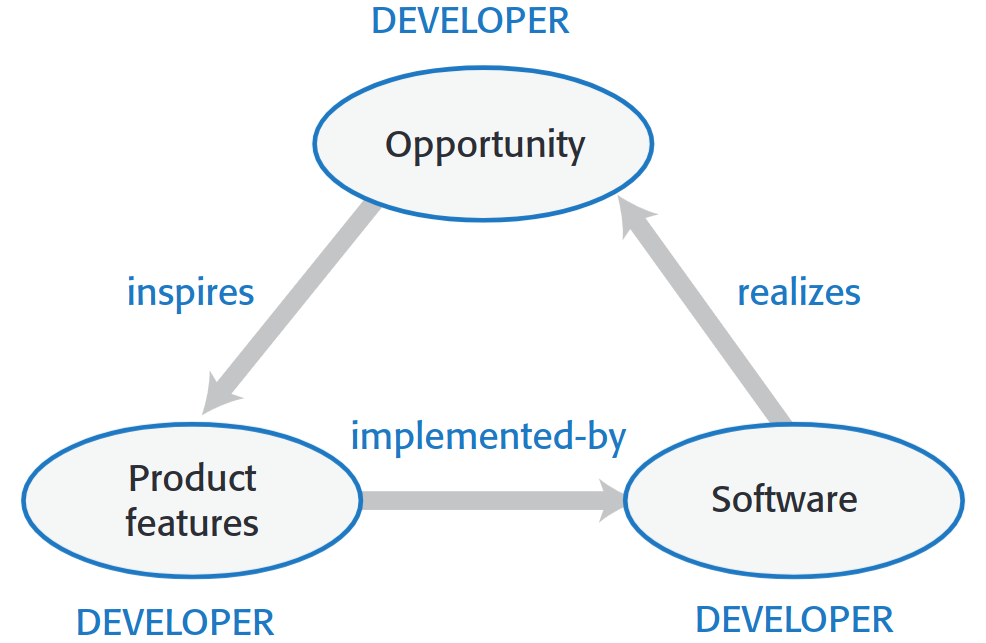
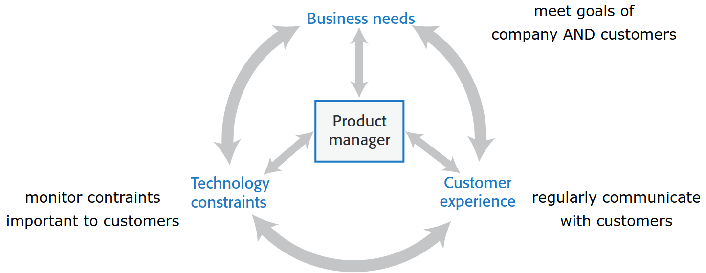

---
tags:
  - università/advanced-software-engineering
  - software-products
  - product-management
data: 2026-09-22
capitolo: "1 — Software products"
corso: "Advanced Software Engineering"
professore: "Antonio Brogi"
fonte: "Appunti di Emiliano Sescu (github.com/Faxatos), cap. 1"
---

# Prodotti software

## Software engineering project-based

L'ingegneria del software **project-based** (orientata al progetto) è la forma più antica di ingegneria del software. Si parte da una richiesta del cliente e, alla fine del progetto, si consegna al cliente il software richiesto.

Il problema principale è che il cliente deve scrivere i **requisiti** (cioè la descrizione di cosa il software deve fare) in un formato preciso, parlando di cose che di solito non conosce: il cliente non ragiona in termini di requisiti software, ma è costretto a produrli. In più i requisiti **non sono fissi**: cambiano a ogni incontro, perché il cliente capisce via via cosa il software può fare per lui.

*Fig. 1.1 — Ciclo di vita del software project-based.*

Con il tempo gli sviluppatori tendono a passare da tanti prodotti fatti su misura per clienti diversi a **un unico prodotto** che vada bene per tutti.

> [!tip] Software generico
>
> Per la maggior parte delle aziende gli utenti non hanno bisogno di software su misura, ma di **software generico** che risolva problemi comuni.

---

## Software engineering product-based

Nell'ingegneria del software **product-based** (orientata al prodotto) è il team di sviluppo a decidere quali sono le funzionalità (*feature*) del software e come cambierà nel tempo. Il cliente esce dal ciclo: sono gli sviluppatori a scegliere cosa costruire, e quindi devono individuare le feature che rispondono ai bisogni dei clienti.

*Fig. 1.2 — Ciclo di vita del software product-based.*

Un requisito tipico dei prodotti è la **velocità**: bisogna sviluppare in fretta, altrimenti qualcun altro occupa quella fetta di mercato. Il tempo è critico, ed è per questo che si usano i **metodi agili**.

### Modelli di esecuzione

Esistono tre modi in cui un prodotto software può essere eseguito:

- **Stand-alone**: interfaccia utente, funzionalità e dati stanno tutti sul computer dell'utente. Il fornitore (*vendor*) si occupa solo di creare e inviare gli aggiornamenti.
- **Ibrida** (*hybrid*): una parte dell'applicazione è sul dispositivo dell'utente (interfaccia, dati utente, aggiornamenti) e una parte sul server del fornitore (logica di business e backup dei dati).
- **Software as a Service (SaaS)**: l'utente non installa nulla, ha solo un'interfaccia (browser o app). Il programma gira sul server del fornitore, quindi è più facile gestirlo e aggiornarlo senza doverlo distribuire.

*Fig. 1.3 — Modelli di esecuzione.*

---

## Product vision

Ogni nuovo prodotto software dovrebbe avere una **visione** (*product vision*) che risponde a tre domande: **chi** sono i clienti a cui ci rivolgiamo? **Cosa** stiamo sviluppando? **Perché** i clienti dovrebbero comprarlo?

Per gli sviluppatori è comodo riassumere la visione in una scheda con questa struttura:

> [!definition] Schema della product vision
>
> **FOR** (cliente target) **WHO** (bisogno o opportunità)
>
> **THE** (nome del prodotto) **is a** (categoria del prodotto) **THAT** (beneficio chiave, motivo per comprarlo)
>
> **UNLIKE** (principale alternativa concorrente) **OUR PRODUCT** (cosa ci distingue dai concorrenti)

> [!example] Il sistema iLearn (dal libro di Sommerville)
>
> **Per** insegnanti ed educatori **che** hanno bisogno di aiutare gli studenti a usare risorse didattiche online, **iLearn** è un ambiente di apprendimento aperto **che** permette agli insegnanti stessi di configurare facilmente le risorse per le loro classi. **A differenza** degli ambienti come Moodle, centrati sulla gestione di materiali e valutazioni, **il nostro prodotto** mette al centro il processo di apprendimento.

Le fonti da cui nasce una buona visione sono:

- **Esperienza nel dominio** (*domain experience*): chi sviluppa lavora già in un certo settore (es. marketing e vendite), conosce il software che serve e ne vede i difetti, quindi intravede spazio per un sistema migliore.
- **Esperienza sul prodotto** (*product experience*): chi usa software esistente (es. un word processor) può trovare modi più semplici per offrire le stesse funzionalità. I nuovi prodotti possono anche sfruttare tecnologie recenti (es. interfacce vocali).
- **Esperienza con i clienti** (*customer experience*): parlando a lungo con i potenziali clienti si capiscono i loro problemi e i vincoli che li limitano (es. l'interoperabilità con altri sistemi), oltre alle caratteristiche per loro irrinunciabili.
- **Prototipazione e sperimentazione**: se l'idea c'è ma non è ancora chiara, un prototipo permette di esplorarla e di raccogliere feedback dai clienti (che ragionano in termini di funzionalità). Il feedback guida il prototipo successivo.

---

## Software product management

Il **Product Manager** (PM) deve assicurarsi che il team implementi feature che portano **valore reale** ai clienti. Per farlo deve bilanciare tre forze (vedremo che alcune tecniche Agile lo aiutano):

- **Bisogni di business**: tutto lo sviluppo va gestito tenendo conto degli obiettivi sia del cliente sia dell'azienda.
- **Esperienza dei clienti**: raccogliere regolarmente il feedback dei clienti su come usano il prodotto.
- **Vincoli tecnologici**: tenere conto dei limiti tecnologici dell'azienda e dell'hardware/tecnologia che il cliente già usa.

*Fig. 1.4 — Compiti del Product Manager.*

Sul piano tecnico il PM si occupa di:

- **Product roadmap**: obiettivi, milestone, criteri di successo e strade alternative se gli obiettivi non vengono raggiunti.
- **User story e scenari**, per individuare le feature del prodotto.
- **Product backlog**: la lista delle cose da fare per completare lo sviluppo.
- **Acceptance testing**: test usati lungo tutto il ciclo di vita per verificare che ogni release raggiunga gli obiettivi fissati.
- **Customer testing**: raccolta di feedback su usabilità e feature.
- **UI design**, per avere un'interfaccia semplice e naturale.
