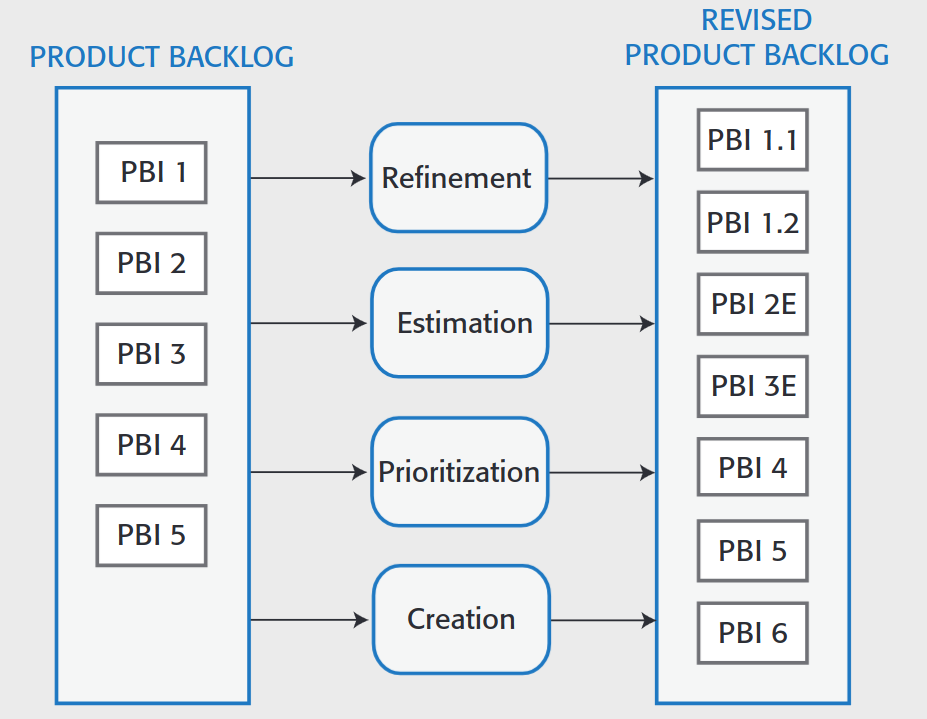

---
tags:
  - università/advanced-software-engineering
  - agile
  - scrum
  - extreme-programming
data: 2026-09-22
capitolo: "2 — Agile Software Engineering"
corso: "Advanced Software Engineering"
professore: "Antonio Brogi"
fonte: "Appunti di Emiliano Sescu (github.com/Faxatos), cap. 2"
---

# Ingegneria del software Agile

Per circa 50 anni l'ingegneria del software è stata dominata dallo sviluppo **plan-driven** (guidato da un piano), che prevedeva:

- una pianificazione dettagliata del progetto (parte molto pesante);
- la specifica dei requisiti (anch'essa molto onerosa);
- metodi di analisi e progettazione;
- una documentazione completa del sistema;
- un controllo di qualità formale.

All'inizio degli anni 2000 viene pubblicato il **Manifesto per lo sviluppo agile del software**, che mette al primo posto:

- **Individui e interazioni** più che processi e strumenti.
- **Software funzionante** più che documentazione esaustiva. La documentazione serve a chi modificherà il codice in futuro, ma renderla dettagliata costa molto.
- **Collaborazione con il cliente** più che negoziazione del contratto: il cliente entra nel processo di sviluppo.
- **Rispondere al cambiamento** più che seguire un piano, perché nessuno può prevedere il futuro.

> [!note] "Più che" non vuol dire "invece di"
>
> Il manifesto non dice che processi, documentazione, contratti e piani siano inutili: dice che hanno valore, ma che gli elementi a sinistra ne hanno **di più**.

La vera novità di Agile è smettere di pensare le applicazioni come si faceva prima e allinearsi a come **gli utenti** vedono il sistema: un insieme di funzionalità. Uno dei principi chiave è lo **sviluppo incrementale**: si scelgono poche funzionalità, si implementano, e si ripete.

*Fig. 2.1 — Il ciclo di Continuous Integration e Continuous Deployment.*

Il ciclo si ripete finché il sistema non è completo. Ogni giro può anche fallire, perché si sono capite male le funzionalità richieste o perché il cliente ha cambiato idea. Questo processo, che si può immaginare come una *pipeline*, si chiama **Continuous Integration e Continuous Delivery/Deployment (CI/CD)**.

Oltre ai quattro valori, il manifesto elenca **dodici principi** (tra parentesi il significato pratico):

1. La priorità massima è **soddisfare il cliente** con consegne rapide e continue di software di valore (appena c'è un pezzo di software usabile, va rilasciato).
2. **I cambiamenti nei requisiti sono benvenuti**, anche a sviluppo avanzato: i processi agili li sfruttano come vantaggio competitivo per il cliente (è irrealistico avere tutte le funzionalità chiare fin dall'inizio: bisogna accettare che i requisiti cambino).
3. **Consegnare spesso software funzionante**, da ogni paio di settimane a ogni paio di mesi, preferendo i tempi più brevi (pipeline CI/CD).
4. Chi si occupa del business e gli sviluppatori devono **lavorare insieme ogni giorno** per tutto il progetto.
5. I progetti si costruiscono attorno a **persone motivate**: bisogna dare loro l'ambiente e il supporto di cui hanno bisogno e fidarsi di loro (principio assente negli appunti originali).
6. Il modo più efficace per passare informazioni al team e dentro il team è la **conversazione faccia a faccia**.
7. Il **software funzionante** è la misura principale del progresso (non la consegna di nuova documentazione o specifiche).
8. I processi agili promuovono uno **sviluppo sostenibile**: sponsor, sviluppatori e utenti devono poter mantenere un ritmo costante indefinitamente.
9. L'attenzione continua all'**eccellenza tecnica** e al buon design aumenta l'agilità.
10. La **semplicità**, cioè l'arte di massimizzare il lavoro *non* fatto, è essenziale.
11. Le migliori architetture, requisiti e design emergono da **team auto-organizzati** (invece che da team separati in stanze diverse).
12. A intervalli regolari il team **riflette** su come diventare più efficace e adatta il suo comportamento di conseguenza.

---

## Extreme Programming (XP)

L'**Extreme Programming (XP)** è una delle prime tecniche nate all'interno della metodologia Agile. I suoi punti chiave sono riassunti nell'immagine:

*Fig. 2.2 — I principi dell'Extreme Programming.*

Le pratiche descritte nella tabella della figura sono:

- **Incremental planning / user stories**: non c'è un "grande piano". Cosa implementare in ogni incremento si decide con un rappresentante del cliente, scrivendo i requisiti come *user story*; le storie da includere in una release dipendono dal tempo disponibile e dalla loro priorità.
- **Small releases**: si parte dall'insieme minimo di funzionalità utile che porta valore, e le release successive, frequenti, aggiungono funzionalità un po' alla volta.
- **Test-driven development**: prima di scrivere il codice si scrivono i test per quella funzionalità. Questo chiarisce cosa deve fare il codice e fa sì che ci sia sempre una versione "testata" del codice. Un framework di test automatici controlla che il nuovo codice non rompa quello esistente.
- **Continuous integration**: appena un compito è finito, viene integrato nel sistema completo e si crea una nuova versione; tutti i test di unità devono passare prima che la nuova versione sia accettata.
- **Refactoring**: migliorare struttura, leggibilità, efficienza e sicurezza del programma. Tutti gli sviluppatori devono fare refactoring appena trovano possibili miglioramenti, per mantenere il codice semplice e manutenibile.

---

## Scrum

> [!definition] Scrum
>
> **Scrum** è un framework leggero che aiuta persone, team e organizzazioni a generare valore attraverso soluzioni adattive a problemi complessi. Contiene un insieme di principi e regole da seguire per raggiungere un obiettivo comune.

La motivazione è questa: i manager di un'azienda software hanno bisogno di sapere quanto costerà sviluppare un prodotto, quanto tempo servirà e quando potrà uscire sul mercato. Lo sviluppo plan-driven risponde con piani di lungo periodo che indicano i **deliverable** (cosa il team consegnerà e quando). Però i piani cambiano sempre: sono affidabili solo quelli di breve periodo.

Scrum si basa su due idee:

- l'**empirismo**: la conoscenza viene dall'esperienza e le decisioni si prendono in base a ciò che si osserva;
- il **pensiero Lean**: ridurre gli sprechi e concentrarsi sull'essenziale.

Usa un approccio **iterativo e incrementale** per rendere il lavoro più prevedibile e controllare il rischio. I tre **pilastri** di Scrum sono:

- **Trasparenza**: l'avanzamento e il lavoro devono essere visibili sia a chi li svolge sia a chi li riceve.
- **Ispezione**: gli artefatti di Scrum e i progressi verso gli obiettivi concordati vanno controllati spesso e con attenzione, per scoprire problemi o deviazioni indesiderate.
- **Adattamento**: se qualcosa nel processo si discosta oltre i limiti accettabili (es. nuovi requisiti) o il prodotto non va bene, bisogna correggere il processo o ciò che si sta producendo, e farlo il prima possibile.

Scrum funziona se le persone vivono i suoi **cinque valori**: **Impegno** (*commitment*, rispettare le scadenze), **Focus**, **Apertura** (verso nuove soluzioni), **Rispetto** (per i compagni di team e gli altri) e **Coraggio** (di proporre soluzioni che allineino meglio il prodotto alla sua visione).

### Scrum Team

Un team **auto-organizzato** coordina il lavoro discutendo i compiti e decidendo insieme chi fa cosa. Il team decide da solo tempi e deliverable, e gli sviluppatori sono coinvolti il meno possibile nelle **interazioni esterne**, cioè quelle con persone fuori dal team (management e clienti). L'idea di Scrum è che gli sviluppatori pensino solo a sviluppare: le interazioni esterne le gestiscono **Scrum Master** e **Product Owner**, così il team lavora senza interferenze o distrazioni.

#### Product Owner

Il **Product Owner** fa in modo che il team resti concentrato sulla costruzione del prodotto, senza perdersi in lavori tecnicamente interessanti ma poco rilevanti. Nello sviluppo di prodotti, di solito questo ruolo lo ricopre il Product Manager.

> [!tip] Chi gestisce cosa
>
> Le interazioni esterne **legate al prodotto** le gestisce il **Product Owner**.

#### Scrum Master

Lo **Scrum Master** è un esperto di Scrum che guida il team nell'usare bene il metodo. Non è un project manager tradizionale ma un **coach** del team, con autorità su *come* il team usa Scrum. In molte aziende però si occupa anche di parte della gestione del progetto.

Il motivo è pratico: tranne che nelle aziende molto piccole, il team deve riferire i progressi al management, e qualcuno deve farlo. Ruotare questo compito tra i membri non funziona, perché serve continuità nei rapporti con l'esterno. Lo Scrum Master è la persona che conosce meglio lo stato del lavoro, quindi è quella più adatta a fornire informazioni e piani affidabili, anche se gli ideatori di Scrum non l'avevano previsto.

> [!tip] Chi gestisce cosa
>
> Le interazioni esterne **legate al team** le gestisce lo **Scrum Master**.

#### Developers

I team auto-organizzati prendono le decisioni discutendo e trovando un accordo. La **dimensione ideale** di un team Scrum è di **5-8 persone**: abbastanza per avere competenze diverse (reti, user experience, database, ...) e livelli di esperienza diversi, ma abbastanza poche per comunicare in modo informale ed efficace e mettersi d'accordo sulle priorità.

Il vantaggio di un team auto-organizzato è che diventa coeso e si adatta ai cambiamenti. Visto che la responsabilità del lavoro è del team e non dei singoli, il team regge anche l'uscita o l'ingresso di persone. Inoltre, comunicando molto, i membri imparano a conoscere le competenze degli altri.

Scrum assume che il team lavori nello **stesso spazio** e che il **daily scrum** (la riunione quotidiana) tenga tutti aggiornati. Ma due ipotesi dietro il daily scrum non sempre valgono:

- Scrum assume persone a tempo pieno nello stesso ufficio. In realtà si può lavorare part-time o da luoghi diversi (e, in un team di studenti, ognuno segue lezioni in orari diversi).
- Scrum assume che tutti possano partecipare a una riunione mattutina. In realtà qualcuno ha orari flessibili (es. per impegni familiari) o lavora a più progetti contemporaneamente.

### Artefatti

#### Product Backlog

> [!definition] Product backlog
>
> Il **product backlog** è la lista delle cose da fare per sviluppare il prodotto. Viene rivisto e aggiornato prima di ogni sprint.

*Fig. 2.3 — Il product backlog durante le attività sul backlog.*

Come mostra la figura, gli elementi (**PBI**, *Product Backlog Item*) vengono prima selezionati e messi in ordine di priorità; in base alla priorità verranno implementati nello sprint successivo. Alcuni esempi di PBI:

- "Come insegnante, voglio poter configurare gli strumenti disponibili per ogni classe." (*feature*)
- "Come genitore, voglio poter vedere i lavori dei miei figli e le valutazioni degli insegnanti." (*feature*)
- "Come insegnante di bambini piccoli, voglio un'interfaccia a immagini per chi non sa ancora leggere bene." (*richiesta di un utente*)
- "Cifrare tutti i dati personali degli utenti." (*miglioramento tecnico*)

Un PBI può trovarsi in tre **stati**:

- **Ready for consideration**: idee e descrizioni di feature ad alto livello, ancora in valutazione. Sono provvisorie: possono cambiare o non entrare mai nel prodotto.
- **Ready for refinement**: il team è d'accordo che l'elemento è importante e va fatto nel ciclo corrente. Cosa serve è abbastanza chiaro, ma va ancora raffinato.
- **Ready for implementation**: il PBI è abbastanza dettagliato da poter stimare lo sforzo e iniziare a implementarlo. Sono note anche le dipendenze da altri elementi.

#### Sprint Backlog

> [!definition] Sprint backlog
>
> Lo **sprint backlog** è la lista ristretta di compiti, presi dal product backlog, che il team si impegna a completare durante lo sprint.

Si crea durante lo *sprint planning*: si scelgono gli elementi in base all'obiettivo dello sprint e li si divide in compiti più piccoli e concreti. A differenza del product backlog, che contiene tutte le possibili feature e migliorie, lo sprint backlog contiene **solo ciò che si può fare nel tempo dello sprint**. Durante lo sprint il team lo aggiorna per segnare i compiti completati e i cambiamenti.

Lo sprint backlog aiuta il team a restare allineato all'obiettivo e a gestire l'avanzamento. Per visualizzare il lavoro e il tempo rimanenti si usano spesso i **burn-down chart**.

### Eventi Scrum

In Scrum il software si sviluppa in periodi di durata fissa chiamati **sprint**, di solito lunghi **2-4 settimane**. Durante lo sprint il team fa riunioni quotidiane (gli *scrum*) per controllare l'avanzamento e aggiornare la lista del lavoro ancora da fare. Ogni sprint deve produrre un **incremento di prodotto rilasciabile** (*shippable product increment*): il software sviluppato deve essere completo e pronto per il deploy.

Gli sprint sono **timeboxed**: lo sviluppo si ferma alla fine dello sprint, che il lavoro sia finito o no.

Le attività di uno sprint sono tre:

- **Sprint Planning**: il team sceglie gli elementi da completare nello sprint e, se serve, li raffina per creare lo sprint backlog. Non dovrebbe durare più di un giorno, all'inizio dello sprint.
- **Sprint Execution**: il team implementa gli elementi dello sprint backlog. Se non riesce a completarli tutti, lo sprint **non viene allungato**: gli elementi non finiti tornano nel product backlog per gli sprint successivi.
- **Sprint Review**: il team (ed eventualmente stakeholder esterni) rivede il lavoro fatto, ragionando su cosa è andato bene, cosa è andato male e come migliorare il processo.

*Fig. 2.4 — Le attività dello sprint all'interno del ciclo Scrum.*

#### Sprint Planning

Nello sprint planning si concorda un **obiettivo dello sprint** (*sprint goal*), che può riguardare funzionalità, supporto, prestazioni o affidabilità. Per definirlo il team sceglie quali elementi del product backlog implementare. Il risultato è lo **sprint backlog**, una versione più dettagliata del product backlog con i compiti da svolgere nello sprint.

Durante lo sprint il team fa ogni giorno un **daily scrum** per coordinarsi: una riunione breve, di solito a inizio giornata, in cui ognuno racconta cosa ha fatto, che problemi ha incontrato e cosa farà oggi. Così tutti sanno cosa succede e si può ripianificare in fretta se serve.

> [!tip] Stand-up meeting
>
> Gli scrum devono restare brevi e concentrati. Per evitare discussioni lunghe a volte si fanno **in piedi**, senza sedie (*stand-up meeting*).

Durante lo scrum si rivede lo sprint backlog: si tolgono gli elementi completati e se ne aggiungono di nuovi se emergono nuove informazioni. Poi il team decide chi lavora su cosa quel giorno.

#### Sprint Execution

Scrum non impone pratiche tecniche specifiche durante lo sprint, ma due sono molto consigliate:

- **Test automation**: automatizzare più test possibile, creando una suite di test eseguibili in qualsiasi momento per controllare la qualità del software.
- **Continuous Integration**: ogni volta che si modifica un componente, lo si integra subito con gli altri per ottenere il sistema completo, che poi si testa per scoprire problemi imprevisti nelle interazioni tra componenti.

#### Sprint Review

Alla fine di ogni sprint c'è una **sprint review** con tutto il team. Si controlla se l'obiettivo dello sprint è stato raggiunto, si discutono i problemi nuovi emersi e si ragiona su come migliorare il modo di lavorare.

È il **Product Owner** a decidere se l'obiettivo è stato raggiunto, confermando che gli elementi scelti sono stati implementati completamente. La review include anche una **revisione del processo**: il team riflette su come ha usato Scrum e su come essere più produttivo nello sprint successivo.

### Esecuzione: le attività sul backlog

A seconda dello stato di un PBI si possono fare diverse azioni:

- **Refinement** (raffinamento): si analizzano i PBI esistenti e li si divide in PBI più dettagliati. Può portare alla creazione di nuovi elementi.
- **Estimation** (stima): il team stima quanto lavoro serve per implementare un PBI e aggiunge la stima al PBI.
- **Creation** (creazione): si aggiungono nuovi elementi al backlog, ad esempio feature proposte dal product manager, modifiche a feature esistenti, miglioramenti tecnici o attività di processo (come valutare nuovi strumenti di sviluppo).
- **Prioritization** (priorità): i nuovi elementi vengono ordinati per priorità all'interno del backlog.

Gli effetti di queste azioni si vedono in Fig. 2.3. Per decidere lo stato o l'azione successiva di un PBI si usano alcune metriche:

- **Sforzo richiesto** (*effort*): in persone-ora o persone-giorno, cioè le ore o i giorni che servirebbero a **una** persona per implementare il PBI. Non coincide con il tempo di calendario, perché più persone possono lavorare sullo stesso elemento.
- **Story point**: una stima arbitraria dello sforzo che tiene conto di dimensione del compito, complessità, tecnologie necessarie e parti "sconosciute" del lavoro. Nascono dal confronto tra user story ma si possono usare per qualsiasi PBI. Si stimano in modo **relativo**: il team fissa i punti di un compito di riferimento e stima gli altri per confronto (più/meno complesso, più grande/più piccolo, ...).

> [!example] Sforzo vs tempo di calendario
>
> Un PBI stimato 10 persone-giorno, se ci lavorano in due, può essere finito in circa 5 giorni di calendario.
