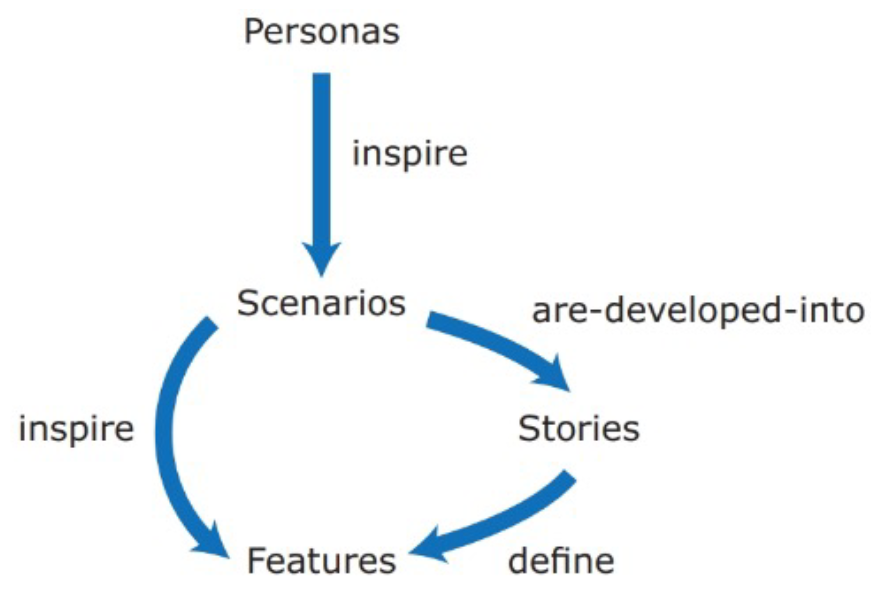
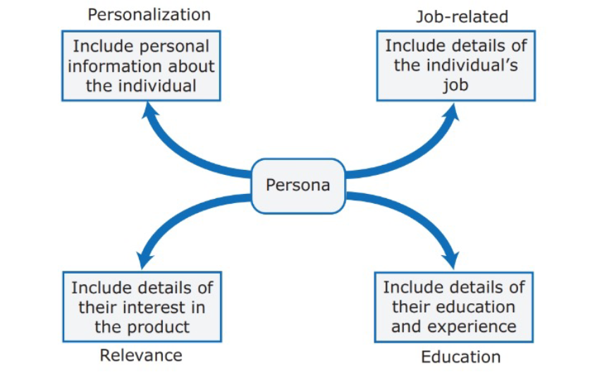
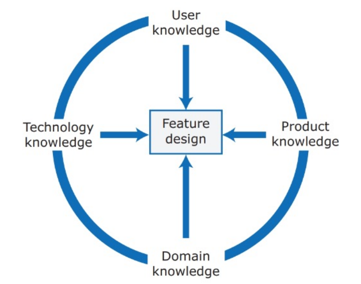
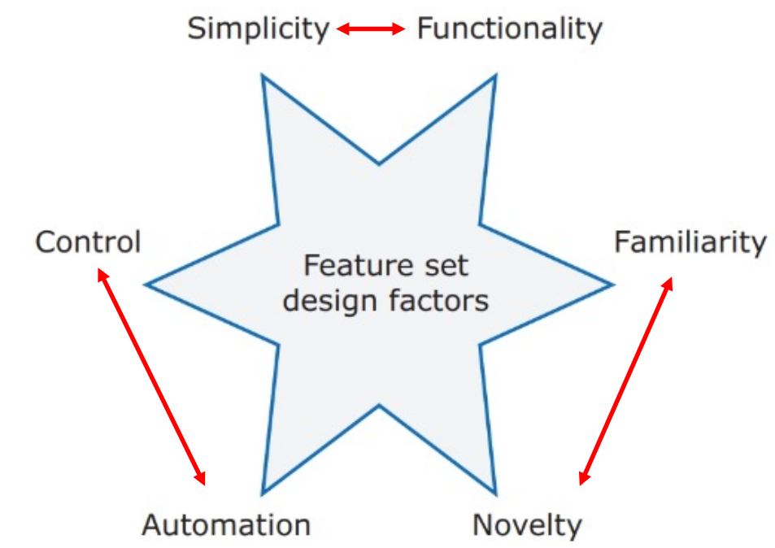

---
tags:
  - università/advanced-software-engineering
  - requisiti
  - personas
  - user-stories
data: 2026-09-22
capitolo: "3 — Features, Scenarios, and Stories"
corso: "Advanced Software Engineering"
professore: "Antonio Brogi"
fonte: "Appunti di Emiliano Sescu (github.com/Faxatos), cap. 3"
---

# Feature, scenari e storie

Il design di un prodotto software nasce di solito da uno di questi fattori:

- l'ispirazione;
- bisogni di aziende o consumatori che i prodotti esistenti non soddisfano;
- insoddisfazione verso i prodotti esistenti;
- cambiamenti tecnologici che rendono possibili nuovi tipi di prodotto.

In questo capitolo vediamo come arrivare alla specifica del prodotto che vogliamo creare. Abbiamo già visto che discutere i requisiti con il cliente è difficile, soprattutto per la differenza di linguaggio e perché spesso il cliente non sa nemmeno quali funzionalità vuole.

Lo sviluppo product-based richiede meno documentazione di quello project-based. In Agile i requisiti non li fissa il cliente e cambiano spesso: per questo gli sviluppatori devono **individuare da soli le feature** del prodotto, capendo chi sono i potenziali utenti e come attirarli (con interviste, sondaggi, consultazioni informali, ecc.).

Per individuare le feature si usano rappresentazioni degli utenti (**personas**) e descrizioni in linguaggio naturale (**scenari** e **storie**).

*Fig. 3.1 — Il processo di generazione delle feature.*

---

## Personas

> [!definition] Persona
>
> Una **persona** è un utente tipo a cui si rivolge il prodotto, descritto come se fosse una persona reale.

Per progettare feature utili bisogna capire i potenziali utenti: il loro background, le loro competenze e la loro esperienza influenzano l'esperienza d'uso e l'interfaccia. Di solito bastano **poche personas** (1-2, al massimo 5) per individuare le feature principali. Le personas permettono agli sviluppatori di "mettersi nei panni degli utenti".

Una persona si descrive con questi elementi:

- **Personalizzazione**: le si dà un nome e si descrive la sua situazione personale. A volte si usa anche una foto di repertorio: alcuni studi dicono che aiuta i team a usare meglio le personas.
- **Lavoro** (*job-related*): se il prodotto è per le aziende, si descrive il suo lavoro e (se serve) in cosa consiste. Per lavori noti a tutti, come l'insegnante, può non servire.
- **Rilevanza**: se possibile, si spiega perché potrebbe interessarle il prodotto e cosa vorrebbe farci.
- **Formazione**: si descrive il suo percorso di studi e il suo livello di competenze tecniche. È importante soprattutto per progettare l'interfaccia.

*Fig. 3.2 — Gli elementi chiave di una persona.*

L'uso della foto non è accettato da tutti: gli studi mostrano che la foto ci condiziona con dei pregiudizi. Quando non è possibile studiare gli utenti reali (ad esempio per prodotti del tutto nuovi) si creano delle **proto-personas**, cioè personas immaginate.

---

## Scenari

Una volta create le personas, si passa agli scenari. Per scoprire le feature del prodotto si descrivono scenari di interazione tra l'utente e il prodotto.

> [!definition] Scenario
>
> Uno **scenario** è un racconto che descrive una situazione in cui un utente usa le feature del prodotto per raggiungere un obiettivo preciso.

Uno scenario contiene questi elementi:

*Fig. 3.3 — Gli elementi chiave di uno scenario.*

Gli scenari narrativi e di alto livello facilitano la comunicazione e stimolano la creatività nel design. **Non sono però specifiche**: mancano di dettagli e possono essere incompleti. Di solito servono più scenari (es. 3-4) per ogni persona, che coprano le sue responsabilità principali. Gli scenari si scrivono **dal punto di vista dell'utente**.

> [!tip] Come si lavora sugli scenari
>
> Ogni membro del team scrive da solo alcuni scenari, poi li discute con il resto del team e, se possibile, con gli utenti.

---

## User Stories

Gli scenari sono storie d'uso ad alto livello, mentre le **user story** sono racconti più fini e seguono una struttura precisa:

> [!definition] User story
>
> **As a** &lt;ruolo&gt; **I want to** &lt;fare qualcosa&gt; **so that** &lt;motivo / valore&gt;.
>
> (Come &lt;ruolo&gt; voglio &lt;fare qualcosa&gt; così da &lt;motivo / valore&gt;.)

Le user story non fanno parte del manifesto Agile, ma aiutano a rispettarne i principi:

- la priorità massima è soddisfare il cliente con consegne rapide e continue di software di valore;
- il software funzionante è la misura principale del progresso;
- la semplicità, l'arte di massimizzare il lavoro non fatto, è essenziale.

Le user story aiutano anche a **visualizzare l'avanzamento**: si possono scrivere su post-it e attaccarle a una bacheca delle cose da fare. Va ricordato però che:

- le storie che **non creano valore** per il cliente sono lavoro che non conta come progresso;
- creare storie che **dipendono l'una dall'altra** può portare a situazioni di stallo (*deadlock*).

Il product backlog di Scrum è spesso un insieme di user story. Le storie lunghe (**epic**) vanno spezzate in storie più semplici. A ogni storia si associa una **priorità** (e magari una stima dello sforzo), e le storie si ordinano per priorità (*requirements triage*).

È possibile esprimere come user story tutte le funzionalità descritte in uno scenario, ma gli scenari si leggono in modo più naturale: rendono le storie più facili da capire, danno più contesto e sono più facili da "vendere" agli stakeholder.

### Dalle storie alle feature

L'obiettivo finale delle user story è individuare le **feature** che definiscono il prodotto. In linea di principio una feature dovrebbe avere queste proprietà:

- **Indipendenza**: non deve dipendere da come sono implementate le altre feature, né dall'ordine in cui vengono attivate.
- **Coerenza**: deve corrispondere a una sola funzionalità. Non deve fare più di una cosa e non deve mai avere effetti collaterali.
- **Rilevanza**: deve riflettere il modo in cui gli utenti svolgono normalmente un compito. Niente funzionalità oscure che servono raramente.

Per progettare le feature servono quattro tipi di conoscenza:

*Fig. 3.4 — Le conoscenze necessarie per il design delle feature.*

- **Conoscenza degli utenti**: scenari e user story dicono al team cosa vogliono gli utenti e come potrebbero usare le feature.
- **Conoscenza dei prodotti**: si può avere esperienza di prodotti esistenti, o studiarli durante lo sviluppo. A volte le feature devono replicare quelle dei prodotti esistenti, perché offrono funzionalità di base sempre necessarie.
- **Conoscenza del dominio**: conoscere il settore in cui opera il prodotto (es. finanza, prenotazione di eventi) permette di pensare a modi nuovi per aiutare gli utenti a raggiungere i loro obiettivi.
- **Conoscenza della tecnologia**: spesso i nuovi prodotti nascono per sfruttare tecnologie arrivate dopo i concorrenti. Chi conosce le tecnologie più recenti può progettare feature che le usano.

### Bilanciare i fattori e il feature creep

Nel design delle feature bisogna trovare un equilibrio tra fattori opposti.

*Fig. 3.5 — I fattori nel design delle feature.*

> [!tip] Le tre coppie in conflitto
>
> - **Semplicità vs funzionalità**: più funzioni aggiungi, più il prodotto diventa complicato da usare.
> - **Familiarità vs novità**: gli utenti vogliono ritrovare cose che conoscono, ma un prodotto nuovo deve anche offrire qualcosa di diverso.
> - **Automazione vs controllo**: automatizzare semplifica la vita, ma alcuni utenti vogliono decidere da soli cosa succede.

Il numero di feature tende a crescere man mano che si immaginano nuovi potenziali utenti: questo fenomeno si chiama **feature creep**. La crescita è spinta dal marketing, che vuole accontentare tutte le richieste degli utenti, aggiungere le feature dei concorrenti e supportare sia utenti esperti sia principianti. Per evitare il feature creep conviene porsi alcune domande su ogni feature, che aiutano a capire quali sono inutili.

*Fig. 3.6 — Le domande sulle feature per evitare il feature creep.*

### Derivare le feature

Il team di sviluppo si riunisce per discutere scenari e storie e ricavare la lista delle descrizioni delle feature. Per ogni feature si individuano l'**input** e il modo in cui viene **attivata**, si descrive l'**azione** (come vengono elaborati i dati) e infine si scrive l'**output** atteso.

*Fig. 3.7 — Derivazione di una feature.*
