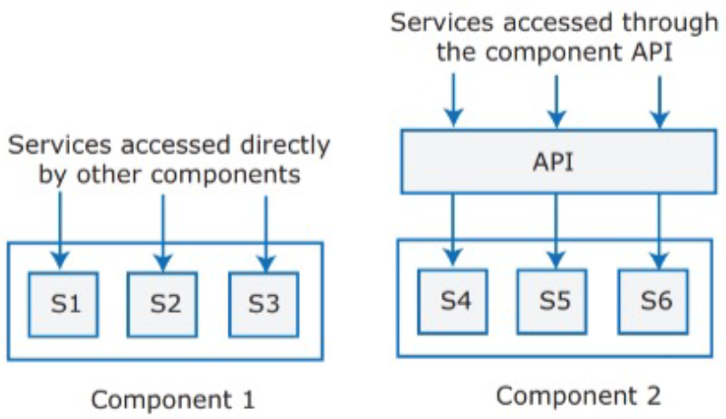
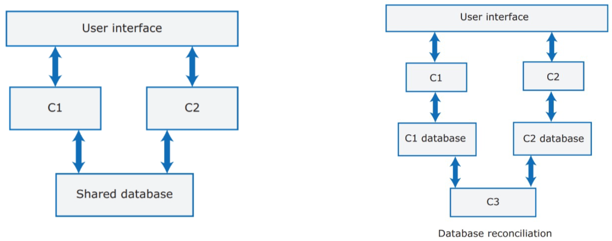
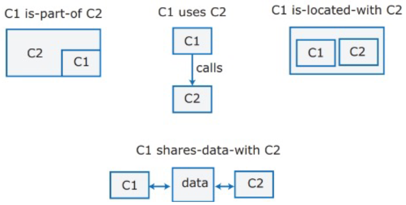
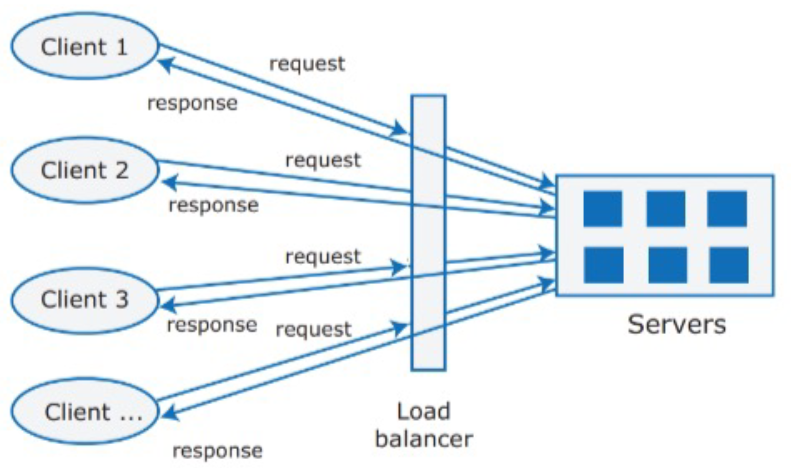
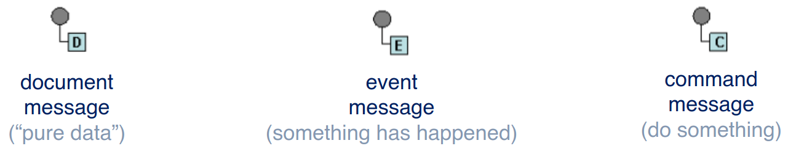
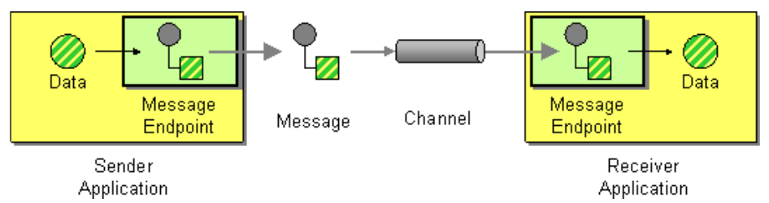
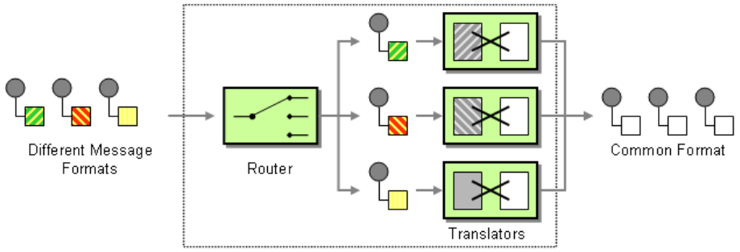

---
tags:
  - università/advanced-software-engineering
  - architettura
  - enterprise-integration-patterns
data: 2026-09-22
capitolo: "4 — Software Architecture"
corso: "Advanced Software Engineering"
professore: "Antonio Brogi"
fonte: "Appunti di Emiliano Sescu (github.com/Faxatos), cap. 4"
---

# Architettura software

> [!definition] Architettura software
>
> L'**architettura** è l'organizzazione fondamentale di un sistema software: i suoi **componenti**, le loro relazioni tra loro e con l'ambiente, e i principi che ne guidano il design.

L'architettura influenza prestazioni, usabilità, sicurezza, affidabilità, manutenibilità e così via. È fatta di **componenti**, dove ogni componente implementa un insieme coerente di funzionalità (**servizi** che altri componenti possono usare). Ecco un esempio di come si usano i componenti:

*Fig. 4.1 — Chiamare i servizi di un componente tramite API.*

Quando il software è grande bisogna sviluppare delle **API** (*Application Programming Interface*) per far comunicare i componenti, che potrebbero anche essere realizzati con tecnologie diverse.

Nel progettare il software si tengono in considerazione diversi aspetti:

- **Caratteristiche non funzionali**: sicurezza, prestazioni ecc. riguardano tutti gli utenti. Se si sbagliano, difficilmente il prodotto avrà successo commerciale. Ognuna di queste caratteristiche ha un **costo** (disponibilità, sicurezza, ...).
- **Durata del prodotto**: se si prevede che il prodotto duri a lungo, bisognerà rilasciare revisioni regolari. Serve quindi un'architettura che possa **evolvere** e accogliere nuove feature e tecnologie.
- **Riuso del software**: riusare grandi componenti di altri prodotti o software open source fa risparmiare molto tempo, ma **limita le scelte** architetturali, perché il design deve adattarsi al software riusato.
- **Numero di utenti**: per software consumer distribuito via Internet il numero di utenti può cambiare molto in fretta. Se l'architettura non permette di **scalare** rapidamente in su e in giù, le prestazioni crollano.
- **Compatibilità**: per alcuni prodotti è importante restare compatibili con altri software, così gli utenti possono adottarlo usando dati preparati con un altro sistema. Questo può limitare le scelte (es. il database da usare).

---

## Attributi di qualità non funzionali

Le **caratteristiche non funzionali** descrivono le capacità operative del sistema e i suoi vincoli, e cercano di migliorarne il funzionamento. Le più comuni sono:

- **Responsiveness** (reattività): il sistema restituisce i risultati in un tempo ragionevole?
- **Reliability** (affidabilità): le feature si comportano come si aspettano sviluppatori e utenti?
- **Availability** (disponibilità): il sistema riesce a fornire i suoi servizi quando gli utenti li chiedono?
- **Security** (sicurezza): il sistema protegge se stesso e i dati degli utenti da attacchi e intrusioni?
- **Usability** (usabilità): gli utenti riescono ad accedere alle feature che servono e a usarle in fretta e senza errori?
- **Maintainability** (manutenibilità): il sistema si può aggiornare e ampliare con nuove feature senza costi eccessivi?
- **Resilience** (resilienza): il sistema continua a fornire servizi se una parte si guasta o subisce un attacco esterno?

Ogni attributo non funzionale che si implementa va anche **testato**, e questo aumenta il costo del prodotto. Inoltre ottimizzarne uno di solito ne peggiora altri: ad esempio, per avere più sicurezza con chiavi più lunghe si sacrificano un po' di prestazioni o di usabilità.

> [!note] I prototipi
>
> I prototipi non devono rispettare queste caratteristiche: l'obiettivo è costruirli in fretta.

Una buona pratica per la **manutenibilità** è dividere il sistema in parti piccole e autonome ed **evitare strutture dati condivise**. Senza un database centralizzato, se un componente deve cambiare l'organizzazione dei suoi dati gli altri non ne risentono, e il sistema può continuare a funzionare in parte anche se un database si guasta.

*Fig. 4.2 — Partizionamento del database.*

Il prezzo da pagare è la **consistenza finale** (*eventual consistency*): se il componente C1 fa una modifica (vedi Fig. 4.2), prima o poi quella modifica deve arrivare anche al database di C3, e questo è un costo in più. Lo stesso vale per la disponibilità: per averne di più si possono usare più database, ma poi vanno sincronizzati. Quando qualcosa va storto in un sistema distribuito è difficile annullare (*rollback*) le transazioni: per questo di solito **si rinuncia alla consistenza per ottenere disponibilità**.

> [!tip] Collegamento: teorema CAP
>
> È lo stesso compromesso descritto dal **teorema CAP**: in presenza di partizioni di rete un sistema distribuito non può garantire insieme consistenza e disponibilità, quindi deve sceglierne una.

---

## Decomposizione del sistema

Ricapitolando i termini:

- un **servizio** è un'unità coerente di funzionalità;
- un **componente** è un'unità software che offre uno o più servizi;
- un **modulo** è un insieme di componenti.

*Fig. 4.3 — Esempi di relazioni tra componenti.*

Quando i componenti aumentano, le relazioni tra loro aumentano ancora più in fretta. Per questo bisogna decomporre **quanto serve, non di più**.

Si decompone per avere parti più semplici, da mantenere separatamente. Una buona guida è la **separazione delle responsabilità** (*separation of concerns*): lo vedremo con i microservizi, ognuno dei quali implementa una sola funzionalità di business. Si vogliono anche **interfacce stabili**, da cambiare solo se davvero necessario. Il principio "**implementa una volta sola**" è in contrasto con l'idea di team indipendenti che lavorano su sistemi indipendenti: non ci sono regole fisse, bisogna sempre trovare un compromesso.

*Fig. 4.4 — Linee guida di design per controllare la complessità.*

### Architettura a livelli

Un altro aspetto della decomposizione è l'**architettura a livelli** (*layered architecture*). Ogni livello è un'area di responsabilità e si considera separatamente dagli altri. Dentro ogni livello i componenti sono indipendenti e non si sovrappongono nelle funzionalità. Il modello architetturale è di alto livello e **non contiene dettagli implementativi**. Di solito gli architetti partono da livelli generici e li adattano, aggiungendone o togliendone, finché l'architettura non va bene per i suoi obiettivi.

*Fig. 4.5 — Esempio di architettura a livelli.*

Alcune questioni riguardano l'intero sistema, quindi ogni livello deve tenerne conto. Queste **cross-cutting concerns** (sicurezza, prestazioni, affidabilità, validazione, ...) creano interazioni tra i livelli. Nell'esempio di Fig. 4.5 la validazione compare in più livelli.

> [!warning] Il dilemma dell'implementazione
>
> Quando si progetta l'architettura non si vuole parlare di implementazione, per non vincolare il design con dettagli tecnici. Però bisogna anche pensare alle possibili implementazioni per capire come progettare: ad esempio, scegliere un database relazionale influenza i componenti dei livelli superiori.

---

## Architettura di distribuzione

> [!definition] Architettura di distribuzione
>
> L'**architettura di distribuzione** definisce i server e come i componenti vengono assegnati ai server, cioè dove il software sarà installato ed eseguito in produzione.

Il tipo più comune è l'**architettura client-server**, adatta alle applicazioni in cui i client accedono a un database condiviso ed eseguono logica di business su quei dati. I client interagiscono con dei **load balancer** (bilanciatori di carico), installati su un cluster di server.

*Fig. 4.6 — Esempio di architettura client-server.*

Un pattern molto usato è il **Model-View-Controller (MVC)**, che struttura il codice dividendolo in tre parti: **Model**, **View** e **Controller**. In molti casi aiuta anche a capire come implementare la comunicazione tra le parti, e questo influisce sulla semplicità ed efficienza dell'architettura (spesso la comunicazione avviene con **HTTP + JSON**).

*Fig. 4.7 — Model-View-Controller.*

Il pattern di Fig. 4.7 **separa la logica di presentazione dei dati dalla logica di business**. Si colloca al livello logico/di business e si usa nelle architetture multi-tier.

*Fig. 4.8 — Tipi comuni di architettura client-server.*

L'architettura client-server si può realizzare in vari modi (Fig. 4.8). L'**architettura orientata ai servizi** (*Service-Oriented Architecture*, SOA) è leggermente diversa: ha un **service gateway** che smista le richieste al servizio giusto.

La scelta dell'architettura di distribuzione dipende da:

- **Tipo di dati e aggiornamenti**: se si usano soprattutto dati strutturati modificati da più feature, di solito conviene un **unico database condiviso** che gestisca lock e transazioni. Se i dati sono distribuiti tra i servizi, serve un modo per tenerli consistenti, e questo appesantisce il sistema.
- **Piattaforma di esecuzione**: se il sistema girerà nel cloud con utenti che accedono via Internet, di solito conviene un'**architettura a servizi**, perché scalare è più semplice. Se è un sistema aziendale che gira su server locali, può andare meglio un'architettura **multi-tier**.
- **Frequenza dei cambiamenti**: se si prevede che alcuni componenti vengano cambiati o sostituiti spesso, isolarli come servizi separati (dentro container) rende i cambiamenti più semplici.

---

## Scelte tecnologiche

Alcune scelte tecnologiche sono particolarmente importanti, perché se il design del prodotto cambia bisogna cambiare anche loro, con più complessità e costi durante lo sviluppo. Le principali sono:

- **Database**: si può scegliere un database relazionale **SQL** (dati organizzati in tabelle strutturate: adatto quando servono le transazioni e le strutture dati sono prevedibili e semplici) oppure un database non strutturato **NoSQL** (organizzazione dei dati più flessibile e definita dall'utente, anche gerarchica: più efficiente per l'analisi dei dati e per l'elaborazione concorrente di "big data").
- **Piattaforma di rilascio** (*delivery platform*): dove girerà il prodotto, web o mobile. Ogni piattaforma ha i suoi problemi (sul mobile: connessione intermittente, potenza del processore, gestione della batteria, schermo piccolo, tastiera a schermo). Conviene decidere presto per iniziare prima lo sviluppo.
- **Server**: il prodotto girerà in un cloud pubblico o su server interni? La maggior parte dei prodotti consumer usa **microservizi** in container, installati nel cloud (architettura SOA). I prodotti aziendali invece si preoccupano di più della sicurezza nel cloud (dove e come vengono salvati i dati dei clienti). Deciso di andare nel cloud, bisogna scegliere il provider: attenzione, poi è difficile spostarsi da un provider all'altro (**vendor lock-in**).
- **Open source**: esistono componenti open source adatti da integrare nel prodotto? Sono abbastanza sicuri?
- **Strumenti di sviluppo**: le tecnologie di sviluppo (toolkit mobile, framework web, ...) influenzano l'architettura. Anche le tecnologie che gli sviluppatori conoscono già finiscono per influenzarla indirettamente.

---

## Enterprise Application Integration

Le **applicazioni enterprise** sono grandi sistemi software pensati per lavorare in un'organizzazione (aziende, pubblica amministrazione). L'utente vede solo il front-end, ma dietro c'è molta funzionalità di back-end fatta di tanti servizi. Questi servizi eterogenei si possono classificare come:

- **source**: servizi che fanno solo richieste;
- **sink**: servizi che rispondono solo alle richieste;
- un misto dei due.

I servizi comunicano con tipi di dati eterogenei (con rappresentazioni diverse anche per dati simili), e queste informazioni possono essere condivise via rete con altre organizzazioni. Tutta questa complessità fa delle applicazioni enterprise delle **applicazioni distribuite multi-servizio**, i cui servizi devono lavorare insieme ed essere integrati in modo adeguato.

La domanda architetturale è: come integrare tutto in modo **coerente, estendibile e manutenibile**? Un modo per gestire la complessità è usare i **pattern**.

> [!definition] Pattern
>
> Un **pattern** è un'astrazione di alto livello di una soluzione accettata e riusabile per un problema ricorrente. Si descrive con:
>
> - **problema**: quale problema risolve;
> - **contesto**: in quale situazione (per lo stesso problema possono esistere pattern diversi);
> - **forze**: perché conviene usare il pattern per quel problema;
> - **soluzione**: come applicare il pattern.

L'idea dei pattern è non reinventare la ruota e usare soluzioni già consolidate. L'**Enterprise Application Integration (EAI)** è un'astrazione riusabile di soluzioni collaudate per i problemi tipici che nascono quando si integrano i componenti e i servizi di un'applicazione enterprise.

### Pattern

Questi pattern sono stati studiati più di 20 anni fa. Tra tutti, i più usati sono i **pattern di messaggistica** (*messaging patterns*), mostrati in Fig. 4.9 (catalogo completo su [enterpriseintegrationpatterns.com](https://www.enterpriseintegrationpatterns.com/patterns/messaging/)).

*Fig. 4.9 — I pattern di messaggistica.*

> [!definition] Messaggio
>
> Un **messaggio** è un pezzo di dati discreto inviato da un servizio a un altro. Di solito è formato da un **header** (metadati) e un **body** (il contenuto, *payload*).

Esempi concreti sono i **document message** (solo dati), gli **event message** (notifiche di eventi) e i **command message** (comandi per eseguire un'azione).

*Fig. 4.10 — Esempi di messaggi concreti.*

Scambiandosi messaggi, i servizi non sono legati strettamente tra loro: la comunicazione a messaggi permette l'**accoppiamento debole** (*loose coupling*). Si realizza con i **canali** (*channel*): astrazioni che portano i messaggi da una sorgente a una destinazione (implementate in vari modi: RPC, HTTP, TCP, ...). I canali sono **a senso unico**, quindi la comunicazione è naturalmente **asincrona**; una comunicazione sincrona (richiesta/risposta) usa due canali.

I servizi applicativi di solito sono indipendenti dal sistema di messaggistica, quindi si usano degli **adapter** per mandare sui canali i dati specifici dell'applicazione. I **message endpoint** permettono ai servizi di inviare e ricevere messaggi dai canali. Esistono vari tipi di canale:

- **point-to-point**: garantisce che un messaggio venga ricevuto da **un solo** destinatario (è quello di Fig. 4.11);
- **publish-subscribe**: il publisher consegna una copia di ogni messaggio a **ogni** subscriber.

*Fig. 4.11 — Integrazione semplice con comunicazione a messaggi.*

Questo da solo però non basta: cosa succede se il servizio che riceve si aspetta un formato di dati diverso? Un **message translator** adatta il messaggio al servizio destinatario. Possono servire anche altri passaggi, ad esempio decidere come instradare i messaggi verso destinazioni diverse o multiple, come dividerli e come aggregarli.

### Pipes and Filters

Lo stile architetturale **pipes and filters** (insieme agli altri pattern EIP) permette di strutturare le integrazioni più complesse. I messaggi attraversano più passi di elaborazione (i **filter**), e ogni componente invia i messaggi lungo i canali (le **pipe**) a cui è collegato. I messaggi scorrono nelle pipe e, quando arrivano a un filter, possono essere trasformati prima di raggiungere il **sink** (la destinazione finale).

> [!example] Loan Broker
>
> Un esempio classico di EAI è il **Loan Broker**: arriva una richiesta di prestito, il **Credit Bureau** la valuta (punteggio di credito), la **Rule Base** decide a quali banche inoltrarla, le **banche** accettano o rifiutano il prestito. Tutte le risposte vengono aggregate e rimandate a chi ha fatto la richiesta. L'area grigia in figura rappresenta il servizio di prestito.

*Fig. 4.12 — Il design del Loan Broker.*

Altri pattern usati nell'esempio:

- **Content Enricher**: usa informazioni del messaggio in arrivo (es. campi chiave) per recuperare dati da una fonte esterna e li aggiunge al messaggio. Le informazioni originali si possono tenere o scartare. In Fig. 4.12 le chiamate *Get Credit Score* e *Get Banks* sono esempi di arricchimento.
- **Router**: ci sono due categorie principali. I **content-based router** instradano in base al tipo di messaggio (nell'header) o al suo contenuto (nel body). I **context-based router** instradano in base a informazioni di contesto prese da una configurazione centrale. In generale un message router è collegato a più canali e contiene la logica per decidere su quale inviare.

*Fig. 4.13 — Pattern di routing dei messaggi.*

Una **recipient list** esamina il messaggio in arrivo, decide la lista dei destinatari e lo inoltra su tutti i canali associati a quei destinatari. Un **content-based router** invia ogni messaggio al destinatario giusto in base al suo contenuto.

- **Normalizer**: traduce i messaggi in un **formato di dati comune**. Di solito si realizza combinando più pattern: si possono comporre pattern per crearne di composti, come nel caso del normalizer.

*Fig. 4.14 — Schema del Normalizer.*

- **Aggregator**: un aggregator (**con stato**) raccoglie e memorizza i singoli messaggi finché non ha ricevuto un insieme completo di messaggi collegati (vedi Fig. 4.13). Si usa quando alcuni passi dell'integrazione possono avvenire **in parallelo**: processi indipendenti girano in parallelo e i loro risultati vengono aggregati per decidere come proseguire.
