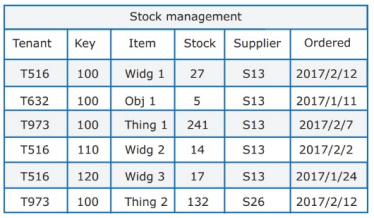
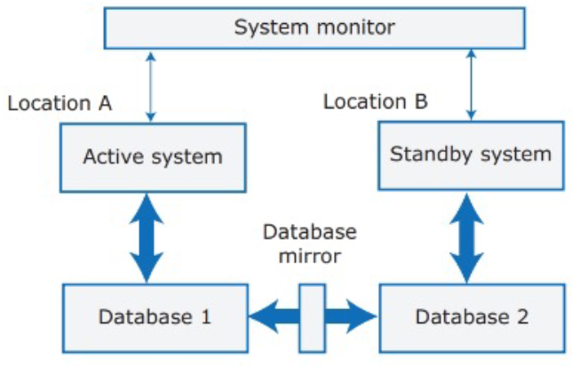
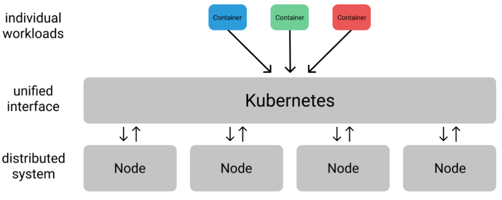
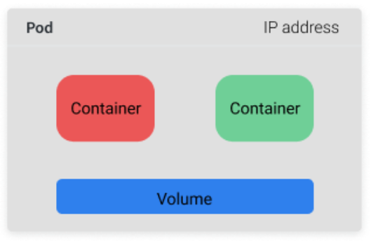
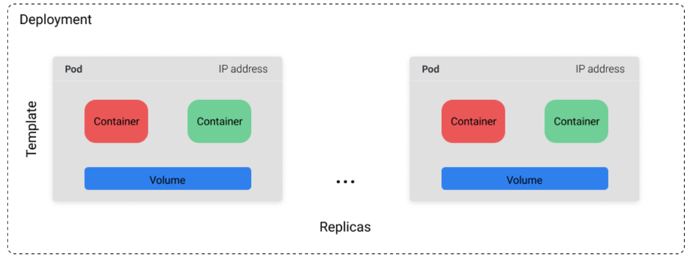
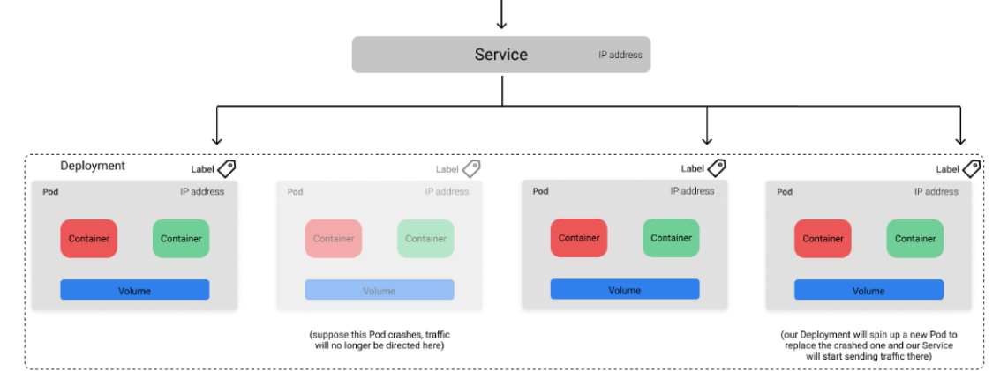
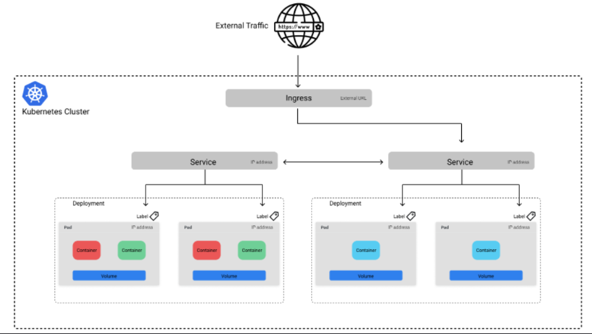
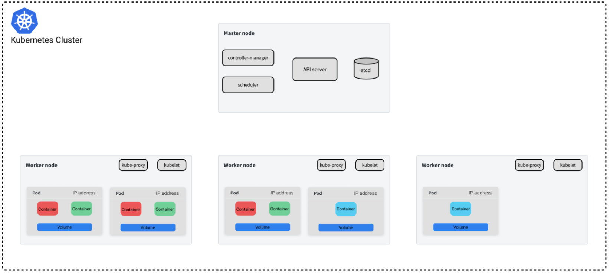

---
tags:
  - università/advanced-software-engineering
  - cloud
  - docker
  - kubernetes
  - saas
data: 2026-09-22
capitolo: "5 — Cloud-based Software"
corso: "Advanced Software Engineering"
professore: "Antonio Brogi"
fonte: "Appunti di Emiliano Sescu (github.com/Faxatos), cap. 5"
---

# Software cloud-based

La rivoluzione del software cloud-based nasce dall'unione di due cose: hardware potente e reti ad alta velocità, che hanno portato al **cloud computing**, e **risorse virtualizzate** (calcolo, storage, piattaforme) disponibili su richiesta.

I vantaggi principali del software nel cloud sono:

- **Scalabilità** (*scalability*): mantenere le prestazioni quando il carico aumenta (utile quando non si sa quanti clienti avrà il prodotto).
- **Elasticità** (*elasticity*): adattare la configurazione dei server alla domanda che cambia, evitando sia di avere **troppe** risorse (*overprovisioning*) sia **troppo poche** (*underprovisioning*).
- **Resilienza** (*resilience*): continuare a fornire il servizio anche se alcuni server si guastano.
- **Costo**: la maggior parte dei servizi cloud si paga a consumo (*pay-per-use*), senza comprare hardware.

---

## Virtualizzazione e container

Uno degli ingredienti del cloud è la virtualizzazione delle risorse. Nello stesso server fisico si possono ospitare molti **server virtuali**, cioè **macchine virtuali** (VM).


*Fig. 5.1 — Macchine virtuali e container.*

Lo stack a sinistra in Fig. 5.1 è una macchina con un sistema operativo e un **hypervisor**, il software che rende possibile la virtualizzazione. Quello in figura è un hypervisor di **tipo 2** (*hosted*), che gira sopra il sistema operativo; quello di **tipo 1** (*bare-metal*) gira direttamente sull'hardware. I riquadri arancioni sono le macchine virtuali, cioè partizioni della macchina fisica, ognuna con il proprio sistema operativo (*guest OS*).

Lo stack a destra usa i **container**: invece di isolare tutto come fanno le VM, i container **condividono lo stesso sistema operativo** e sfruttano la capacità del kernel di creare più istanze isolate dello spazio utente. I container girano su un **container manager** che sta sopra il sistema operativo.

> [!tip] VM vs container
>
> Condividere il sistema operativo rende i container **molto più leggeri e veloci da avviare** delle VM. Il prezzo è una **sicurezza minore**: c'è meno isolamento, e ad esempio un container può "contaminare" la memoria di un altro.

### Docker

La **portabilità** delle applicazioni è sempre stata uno dei grandi problemi dell'ingegneria del software. Tradizionalmente c'era un ambiente per sviluppo e test e un altro per la produzione (quello in cui l'applicazione viene installata e distribuita agli utenti). I due ambienti non erano uguali, quindi ogni volta che un'applicazione passava da uno all'altro servivano tempo e soldi.

> [!definition] Docker
>
> **Docker** è una piattaforma che permette di eseguire applicazioni in un ambiente isolato, usando i **container**. Un'applicazione, una volta sviluppata, viene chiusa in un container: aperto in un nuovo ambiente, il container non ha problemi di portabilità grazie al **Docker Engine** (che crea ed esegue i container). La piattaforma include anche il **Docker Hub**, per distribuire i container.


*Fig. 5.2 — Il ciclo di vita di Docker.*

I componenti software vengono impacchettati in **immagini** (*image*), cioè modelli **in sola lettura** usati per creare ed eseguire i container. Siccome le immagini sono in sola lettura, per salvare dati in modo persistente servono dei **volumi esterni**.

Le immagini sono conservate in un **Docker registry** (privato o pubblico), organizzato in **repository**: ogni repository contiene le immagini delle diverse versioni di un software, identificate dalla coppia `repository:tag`. Le immagini sono fatte a **livelli** (*layer*), e ogni livello è a sua volta un'immagine (quello più in basso si chiama **immagine base**).

I comandi principali (Fig. 5.2) sono:

- `pull`: scarica un'immagine dal registry;
- `push`: carica un'immagine nel registry;
- `build`: costruisce un'immagine a partire da un **Dockerfile** ([documentazione](https://docs.docker.com/engine/reference/builder/));
- `run`: esegue un'immagine in un container;
- `commit`: salva le modifiche fatte a un container come nuova versione dell'immagine.

Se un'immagine genera più processi dentro un container, la vita del container è legata al **processo principale**. Per questo è buona pratica usare **un container per processo**: quando un processo termina, gli altri non ne risentono. Se l'applicazione è fatta di più servizi, Docker offre **Docker Compose** ([documentazione](https://docs.docker.com/compose/)), che avvia un container per ogni servizio e gestisce anche la rete (i servizi locali si chiamano per nome) e la comunicazione tra i container.

---

## Everything as a Service

Il cloud computing offre diversi modelli di servizio:

- **IaaS** (*Infrastructure as a Service*): fornisce server (virtualizzati), storage e rete. Il provider gestisce l'infrastruttura, il cliente tutto il resto (sistema operativo, applicazione, ...). Esempi: Amazon EC2 e S3.
- **PaaS** (*Platform as a Service*): fornisce una piattaforma completa (VM, sistema operativo, servizi, SDK, ...). Il provider gestisce infrastruttura, sistema operativo e software di supporto; il cliente installa e gestisce solo l'applicazione. Esempi: Heroku, Azure, Google App Engine.
- **SaaS** (*Software as a Service*): fornisce software pronto all'uso, accessibile tramite *thin client* (es. browser) o API. Il provider gestisce infrastruttura, sistema operativo e applicazione; il cliente **non gestisce nulla**, ed è per questo il modello con la quota di mercato più grande. Esempio: Salesforce.com.

La Fig. 5.3 mostra con un'analogia cosa offre ogni modello e cosa invece deve gestire il cliente.


*Fig. 5.3 — Pizza as a Service (in blu ciò che gestisce il cliente, in verde ciò che gestisce il fornitore).*

### SaaS

Prima del SaaS i prodotti software si installavano sui computer dei clienti. I clienti dovevano configurarli e gestirne gli aggiornamenti, e le aziende dovevano mantenere diverse versioni del prodotto. Con il SaaS il prodotto è fornito come servizio: il cliente non installa nulla, paga un **abbonamento** e usa il prodotto da remoto.

Vantaggi del SaaS (per il fornitore):

- **Flusso di cassa**: entrate regolari, perché i clienti pagano abbonamenti periodici o a consumo.
- **Gestione degli aggiornamenti**: è il fornitore a controllare gli aggiornamenti, e tutti i clienti li ricevono insieme. Non si devono mantenere più versioni, quindi si risparmia.
- **Continuous deployment**: si possono rilasciare nuove versioni appena le modifiche sono pronte e testate.
- **Flessibilità nei pagamenti**: diverse opzioni di pagamento attirano più clienti (es. piccole aziende o privati evitano grandi costi iniziali).
- **Prova prima di comprare** (*try before you buy*): si può offrire il prodotto gratis o a basso costo all'inizio per raccogliere feedback (es. gratis per qualche settimana).
- **Raccolta dati**: è facile raccogliere dati su come viene usato il prodotto e su come interagiscono i clienti.

Svantaggi del SaaS:

- **Rispetto delle leggi sulla privacy**: ogni Paese ha leggi diverse, spesso severe, su dove e come conservare i dati personali.
- **Sicurezza**: i clienti possono non voler cedere il controllo dei propri dati a un fornitore esterno, che però deve gestirli. E se il fornitore subisce un furto di dati (*data breach*), avviserà i clienti?
- **Limiti della rete**: possono rallentare le risposte quando si trasferiscono molti dati.
- **Scambio di dati**: se il cloud non offre API adatte, scambiare dati è difficile. Dipende dal contratto: a seconda dell'offerta si può accedere a insiemi di dati diversi.
- **Perdita di controllo sugli aggiornamenti**: il fornitore può cambiare troppo e troppo spesso (es. nuove funzioni ogni giorno che cambiano l'interfaccia).
- **Service lock-in**: è difficile spostarsi da un fornitore SaaS a un altro.

Scelto il SaaS, bisogna affrontare alcune questioni di design:

- **Elaborazione locale o remota**: alcune feature si possono eseguire in locale, riducendo il traffico di rete e velocizzando le risposte, ma aumentando il consumo di batteria sui dispositivi mobili.
- **Autenticazione**: di solito ci sono tre possibilità: un sistema di autenticazione proprio del prodotto; l'**autenticazione federata**, basata su un rapporto di fiducia tra un *Service Provider* (SP, es. chi vende l'applicazione) e un *Identity Provider* (IdP) esterno; le credenziali personali di servizi esterni (es. Google, LinkedIn).
- **Fuga di informazioni** (*information leakage*): se il servizio è offerto a più organizzazioni, c'è il rischio che un membro di un'organizzazione acceda a dati di un'altra.
- **Database multi-tenant o multi-instance**: i sistemi **multi-tenant** usano un solo archivio (con tecniche avanzate per partizionare i dati e controllare le partizioni), quelli **multi-instance** hanno copie separate del sistema e del database per ogni cliente.

### Sistemi multi-tenant e multi-instance

#### Sistemi multi-tenant

> [!definition] Sistema multi-tenant
>
> Un sistema **multi-tenant** usa **un unico schema di database** condiviso da tutti gli utenti. Ogni riga è etichettata con un **identificatore del tenant** (il cliente): così si ottiene un **isolamento logico**, cioè ogni utente vede solo i dati del proprio tenant.


*Fig. 5.4 — Esempio di schema di database multi-tenant.*

Vantaggi:

- **Uso delle risorse**: il fornitore controlla tutte le risorse usate dal software e può ottimizzarle.
- **Sicurezza**: siccome i dati di tutti i clienti stanno nello stesso database, il database deve essere progettato fin dall'inizio per la sicurezza, quindi probabilmente avrà meno vulnerabilità di un database standard. Inoltre c'è una sola copia del software da correggere se si scopre una vulnerabilità.
- **Gestione degli aggiornamenti**: aggiornare un'unica istanza è più facile che aggiornarne tante, e tutti i clienti usano sempre l'ultima versione.

Svantaggi:

- **Poca flessibilità**: tutti i clienti devono usare lo stesso schema, con poche possibilità di adattarlo.
- **Sicurezza**: con i dati di tutti nello stesso database, c'è il rischio teorico che i dati passino da un cliente all'altro. Peggio ancora, un attacco al database colpisce **tutti** i clienti.
- **Complessità**: dover gestire tanti utenti rende questi sistemi più complessi dei multi-instance, e quindi più esposti a bug.

Le aziende medie e grandi raramente vogliono software multi-tenant generico: preferiscono una versione adattata alle loro esigenze. Due soluzioni possibili:

1. **Aggiungere campi extra** a ogni tabella, che il cliente usa come vuole. Però è difficile prevedere quante colonne servono (troppo poche non bastano, troppe sprecano spazio) e clienti diversi vorranno tipi di colonne diversi.
2. **Aggiungere a ogni tabella un campo che punta a una "tabella di estensione"**, che il cliente crea secondo le sue esigenze. Questo però aggiunge complessità a un sistema già complesso.

La **sicurezza** è la preoccupazione principale dei clienti aziendali. Poiché tutto sta nello stesso database, un bug o un attacco potrebbe esporre i dati di alcuni o di tutti i clienti. Per ridurre il rischio si usano:

- il **controllo degli accessi multilivello**: l'accesso ai dati è controllato sia a livello di organizzazione sia a livello del singolo utente;
- la **cifratura dei dati**: così, se il sistema si guasta, i dati di un'azienda non sono leggibili da persone di altre aziende. Di solito si cifrano solo i dati sensibili.

#### Sistemi multi-instance

> [!definition] Sistema multi-instance
>
> In un sistema **multi-instance** ogni cliente ha il **proprio sistema**, adattato alle sue esigenze, con il proprio database e i propri controlli di sicurezza.

È concettualmente più semplice di un sistema multi-tenant ed elimina problemi come la fuga di dati tra organizzazioni. Si può realizzare in due modi:

- **Basato su VM**: l'istanza del software e il database di ogni cliente girano in una propria macchina virtuale. Tutti gli utenti dello stesso cliente accedono al database condiviso di quel sistema.
- **Basato su container**: ogni utente ha una versione isolata del software e del database, in un insieme di container. È la soluzione migliore per prodotti in cui gli utenti lavorano per lo più da soli, condividendo pochi dati (es. utenti privati).

Le due cose si possono anche combinare: un'azienda può avere il proprio sistema su VM e, sopra, eseguire container per i singoli utenti.

Vantaggi:

- **Flessibilità**: ogni istanza si può adattare alle esigenze del cliente.
- **Sicurezza**: ogni cliente ha il suo database, quindi niente fughe di dati tra clienti.
- **Scalabilità**: ogni istanza si scala secondo le esigenze del suo cliente (qualcuno avrà bisogno di server più potenti di altri).
- **Resilienza**: un guasto software probabilmente colpisce un solo cliente, gli altri continuano a lavorare.

Svantaggi:

- **Costo**: affittare tante VM nel cloud e gestire tanti sistemi costa di più. Le VM si avviano lentamente, quindi spesso vanno tenute accese sempre, anche quando il servizio è poco usato.
- **Gestione degli aggiornamenti**: aggiornare tante istanze è complicato, soprattutto se sono state personalizzate per clienti diversi.

---

## Architettura del software nel cloud

Nelle prime fasi del design di un'architettura cloud bisogna rispondere ad alcune domande:

- Database **multi-tenant o multi-instance**? (organizzazione del database)
- Quali sono i requisiti di **scalabilità e resilienza**?
- Struttura **monolitica o a servizi**? (struttura del software)

Le risposte guidano la scelta della piattaforma cloud su cui installare e distribuire il prodotto.

### Organizzazione del database

Ci sono tre modi per fornire il database dei clienti in un sistema cloud:

1. **Multi-tenant**, condiviso da tutti i clienti e ospitato nel cloud su server grandi e potenti.
2. **Multi-instance**, con il database di ogni cliente in una propria macchina virtuale.
3. **Multi-instance**, con ogni database in un proprio container. Il database di un cliente può anche essere distribuito su più container.

Fattori per scegliere:

- **Clienti target**: i clienti hanno bisogno di schemi di database diversi e di personalizzazioni? Se sì → **multi-instance**.
- **Requisiti sulle transazioni**: è fondamentale supportare transazioni **ACID**, cioè avere dati sempre consistenti? Se sì → **multi-tenant** o **multi-instance su VM**.
- **Dimensione e connessioni del database**: quanto è grande il database tipico? Quante relazioni ci sono tra i dati? Per database molto grandi di solito conviene il **multi-tenant**, perché si possono concentrare gli sforzi sull'ottimizzazione delle prestazioni.
- **Interoperabilità**: i clienti vorranno trasferire dati da database esistenti? Quanto sono diversi i loro schemi da un possibile schema multi-tenant? Che supporto si aspettano per il trasferimento? Se i clienti hanno schemi molto diversi → **multi-instance**.
- **Struttura del sistema**: si usa un'architettura a servizi? Il database del cliente si può dividere in tanti database, uno per servizio? Se sì → **multi-instance in container**.

### Scalabilità e resilienza

#### Scalabilità

La **scalabilità** (la capacità di adattarsi automaticamente ai cambiamenti di carico) si ottiene in due modi quando il carico cresce:

- **scaling out** (scalare in orizzontale): aggiungere nuovi server virtuali;
- **scaling up** (scalare in verticale): aumentare la potenza di un server esistente.

Nel cloud si fa tipicamente **scaling out**: il prodotto deve essere organizzato in modo che i singoli componenti si possano replicare ed eseguire in parallelo, mentre dei meccanismi di **load balancing** distribuiscono le richieste tra le istanze (ad esempio con un PaaS).

#### Resilienza

La **resilienza** (la capacità di continuare a fornire i servizi critici in caso di guasti o attacchi) si ottiene con la tecnica dell'**hot standby**: si tengono **repliche** del software e dei dati in luoghi diversi (Fig. 5.5). Gli aggiornamenti del database vengono copiati sull'altro database (*mirroring*) e un **system monitor** controlla di continuo lo stato del sistema.

Un'alternativa più economica è il **cool standby**: in caso di guasto i dati si ripristinano da un backup, quindi il sistema resta non disponibile finché il ripristino non è finito.


*Fig. 5.5 — Schema della tecnica hot standby.*

### Struttura del software

La scelta principale è tra un sistema **monolitico** e **servizi piccoli e senza stato** (*fine-grained, stateless*). I servizi indipendenti si possono replicare, distribuire e spostare, quindi sono particolarmente adatti al software cloud con servizi in container. Il monolite si usa spesso per costruire i **prototipi**, anche quando alla fine un sistema a servizi sarebbe più adatto.

Per scegliere la piattaforma cloud si considerano due gruppi di aspetti:

1. **Aspetti tecnici**: carico previsto e quanto è prevedibile, resilienza, servizi cloud offerti dal provider, privacy e protezione dei dati (alcuni Paesi UE hanno regole severe su come e dove si salvano i dati, quindi il provider deve garantire dove vengono conservati).
2. **Aspetti di business**: esperienza degli sviluppatori (linguaggi e tecnologie dipendono da cosa sa il team), **Service Level Agreement** (SLA, le garanzie offerte dal provider), portabilità e migrazione (avere un "piano d'uscita" contro il vendor lock-in), clienti target (che magari hanno sistemi vecchi che devono interagire con i nuovi) e costi (inclusi quelli per sviluppatori e tecnologie).

---

## Orchestrazione dei container

Come visto, i container sono un modo leggero per isolare l'ambiente di un'applicazione. Le immagini dei container si possono eseguire in modo affidabile su qualsiasi macchina, garantendo portabilità dallo sviluppo al deploy (noi abbiamo usato Docker).

Il deploy automatico che offre Docker, però, ha poche capacità di ottimizzare l'uso della memoria e può non sfruttare bene le risorse. E restano varie domande aperte:

- Cosa succede se un container muore?
- Cosa succede se si guasta la macchina su cui gira il container?
- Come comunicano più container tra loro, anche su nodi diversi?
- Come si gestisce la rete tra container?
- Se la produzione ha più macchine, come si decide su quale far girare un container?

La soluzione è l'**orchestrazione dei container**: l'architetto definisce quali container devono girare e poi lascia alla piattaforma di orchestrazione il compito di realizzare quella configurazione.

### Kubernetes

Una delle piattaforme di orchestrazione più usate è **Kubernetes** (abbreviato **K8s**). Gestisce l'intero ciclo di vita dei container, creando e spegnendo risorse quando serve: se un container si spegne all'improvviso, K8s ne lancia un altro al suo posto. Offre anche un meccanismo per far comunicare le applicazioni tra loro anche mentre i container sottostanti vengono creati e distrutti. Dato un insieme di carichi di lavoro (container) e un insieme di macchine in un **cluster**, l'orchestratore esamina ogni container e sceglie la macchina migliore su cui eseguirlo.

Kubernetes riceve tramite la sua API lo **stato desiderato** (*Desired State Management*), descritto in un **manifest** YAML. Il manifest dice quali sono i **Pod** (gruppi di container) e quante **repliche** di ciascuno servono. Kubernetes mette sullo stesso nodo tutti i container di uno stesso Pod e crea tante repliche quante ne sono richieste; un nodo può ospitare più Pod. Se un nodo (*worker*, cioè una macchina che ospita container) si guasta, Kubernetes se ne accorge e avvia una nuova replica altrove (Fig. 5.6). I servizi del cluster Kubernetes gestiscono anche la comunicazione tra i nodi, sia quelli esistenti sia quelli nuovi.


*Fig. 5.6 — L'idea di gestione di Kubernetes.*

> [!example] Un manifest minimo (Deployment)
>
> Questo manifest chiede a K8s di tenere sempre attive 3 repliche di un Pod con un container `web`:
>
> ```yaml
> apiVersion: apps/v1
> kind: Deployment
> metadata:
>   name: web
> spec:
>   replicas: 3
>   selector:
>     matchLabels: { app: web }
>   template:
>     metadata:
>       labels: { app: web }
>     spec:
>       containers:
>         - name: web
>           image: nginx:1.27
> ```
>
> Se un Pod muore, K8s nota che le repliche sono 2 invece di 3 e ne crea una nuova.

### Principi di design di Kubernetes

- **Dichiaratività**: con l'approccio dichiarativo si descrive solo lo **stato desiderato** del sistema (nel manifest). K8s si accorge quando lo stato reale non corrisponde a quello desiderato e interviene per correggerlo: il sistema diventa **self-healing** (si ripara da solo). Lo stato desiderato è definito da un insieme di **oggetti**: ogni oggetto ha una **specifica** (*spec*, lo stato desiderato) e uno **stato** (*status*, lo stato attuale). K8s controlla di continuo che lo stato di ogni oggetto sia uguale alla specifica: se un oggetto non risponde ne avvia una nuova versione; se il suo stato si è allontanato dalla specifica, esegue i comandi necessari per riportarlo allo stato desiderato.
- **Distribuzione**: Kubernetes offre un'**unica interfaccia** per interagire con un intero cluster di macchine, così gli sviluppatori non devono comunicare con ogni macchina singolarmente.


*Fig. 5.7 — Schema della distribuzione in Kubernetes.*

- **Disaccoppiamento**: ogni container dovrebbe occuparsi di **una sola cosa**, come nelle architetture a microservizi. K8s supporta in modo naturale servizi disaccoppiati, che si possono scalare e aggiornare in modo indipendente.
- **Infrastruttura immutabile**: invece di entrare in un container per aggiornare una libreria, si costruisce una **nuova immagine**, si installa la nuova versione e si spegne quella vecchia. Il motivo è che i container sono pensati per essere **effimeri**, pronti a essere sostituiti in qualsiasi momento. Un'infrastruttura immutabile rende anche facile tornare a uno stato precedente (es. dopo un errore): basta cambiare la configurazione per usare un'immagine più vecchia.

### Oggetti di Kubernetes

Kubernetes definisce molti oggetti che si possono descrivere nei manifest (in JSON o YAML). I principali sono:

- **Pod**: la **più piccola unità di deploy** di Kubernetes. È formato da uno o più container strettamente collegati, con una rete e dei volumi (file system) condivisi. Un Pod non si distribuisce su più macchine. Ogni Pod ha un **indirizzo IP** unico per comunicare con lui.


*Fig. 5.8 — Schema di un Pod.*

- **Deployment**: un insieme di Pod definito da un **template** e da un **numero di repliche** *n* (quante copie del template far girare). Il cluster cerca sempre di avere *n* Pod disponibili.


*Fig. 5.9 — Schema di un Deployment.*

- **Service**: offre un **punto di accesso stabile** per mandare il traffico ai Pod giusti, anche quando i Pod cambiano per aggiornamenti, scaling o guasti. Il Service sa a quali Pod inviare il traffico grazie alle **label** (coppie chiave-valore) definite nei metadati dei Pod.


*Fig. 5.10 — Schema di un Service.*

- **Ingress**: i Service sono raggiungibili solo dall'interno del cluster. Per esporre l'applicazione al **traffico esterno** si definisce un oggetto Ingress, che sceglie quali Service rendere pubblici e li espone dietro un punto di accesso stabile (un URL esterno).


*Fig. 5.11 — Schema di un Ingress.*

### Il control plane di Kubernetes

Vediamo ad alto livello come funziona Kubernetes "sotto il cofano". Un cluster (insieme di macchine) ha due tipi di macchine:

- il **master node** (spesso uno solo), che contiene la maggior parte dei componenti del **control plane**;
- i **worker node**, che eseguono i carichi di lavoro delle applicazioni.

#### Master node

Gli utenti inviano le specifiche nuove o aggiornate degli oggetti (i manifest) all'**API server** del master node. L'API server valida le richieste (controllando l'input) e fa da **interfaccia unica** per qualsiasi domanda sullo stato attuale del cluster. Lo stato del cluster (configurazione, specifiche e stati degli oggetti, nodi del cluster, assegnazione degli oggetti ai nodi, ...) è salvato in un archivio chiave-valore distribuito chiamato **etcd**.

Il master node (Fig. 5.12) è formato da:

- l'**API server**;
- **etcd**, che contiene tutto lo stato del cluster;
- il **controller-manager**;
- lo **scheduler**.

L'API server fa da intermediario per rispettare il principio di **disaccoppiamento**: ogni componente ha un solo compito, e questo rende anche più facile ripartire dopo un guasto.

Il **controller-manager** controlla lo stato del cluster tramite l'API server. Se lo stato reale è diverso da quello desiderato, chiede modifiche all'API server per portare il cluster verso lo stato desiderato.


*Fig. 5.12 — Struttura del master node di Kubernetes.*

Lo **scheduler** decide dove eseguire gli oggetti (Fig. 5.13):

1. chiede all'API server quali oggetti non sono ancora assegnati a una macchina;
2. l'API server gli restituisce gli oggetti non assegnati (letti da etcd);
3. lo scheduler decide a quali macchine assegnarli e lo comunica all'API server;
4. l'API server registra l'assegnazione in etcd.


*Fig. 5.13 — Il ciclo di vita dello scheduler.*

#### Worker node

Ogni worker node contiene un **kubelet**, l'"agente" del nodo: comunica con l'API server per sapere quali container sono stati assegnati al nodo ed è responsabile di avviare i Pod che li eseguono. Quando un nodo entra nel cluster, il kubelet annuncia la sua esistenza all'API server, così lo scheduler può assegnargli dei Pod. Ogni worker contiene anche **kube-proxy**, che permette ai container di comunicare tra loro attraverso i vari nodi del cluster. La Fig. 5.14 mostra la struttura completa.


*Fig. 5.14 — La struttura completa di Kubernetes.*

> [!warning] Quando Kubernetes non conviene
>
> - Se il carico di lavoro può girare su **una sola macchina**.
> - Se serve **poca potenza di calcolo**.
> - Se non serve **alta disponibilità** e si possono tollerare periodi di fermo.
> - Se non si prevede di **cambiare spesso** i servizi installati.
> - Se si ha un **monolite** e non si pensa di dividerlo in microservizi.

Esiste anche un modo per orchestrare container con Docker, chiamato **Docker Swarm**, ma Kubernetes è un orchestratore molto più potente. Le due tecnologie comunque collaborano, quindi non c'è lock-in tra Docker e Kubernetes.
