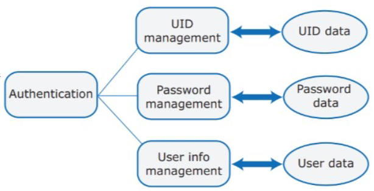
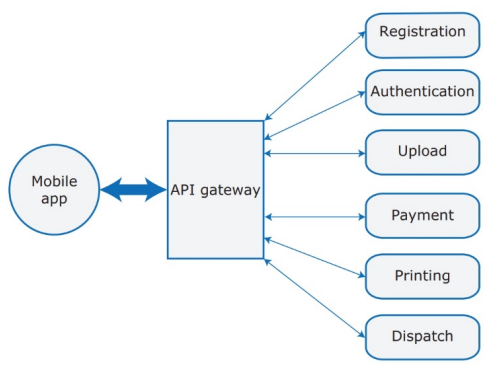
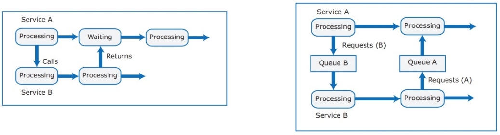
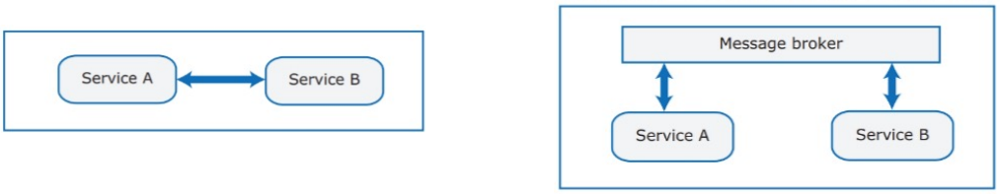
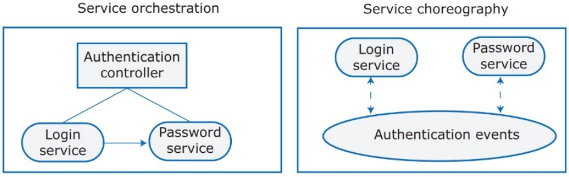
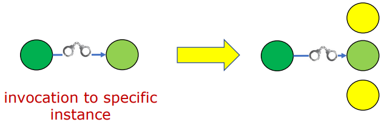

---
tags:
  - università/advanced-software-engineering
  - microservizi
  - cap-theorem
  - architectural-smells
data: 2026-09-22
capitolo: "6 — Microservices Architecture"
corso: "Advanced Software Engineering"
professore: "Antonio Brogi"
fonte: "Appunti di Emiliano Sescu (github.com/Faxatos), cap. 6"
---

# Architettura a microservizi

Questo capitolo tratta le **architetture a microservizi**: idee di base, principi e vantaggi che le rendono così diffuse. Partiamo da una domanda: **come si divide un sistema in componenti?**

Dividere il sistema in componenti è il primo passo per adottare i microservizi. I motivi per farlo sono diversi:

- team diversi possono lavorare **in parallelo**;
- favorisce il **riuso**;
- rende più facile **distribuire** il sistema su più computer;
- permette di replicare, eseguire in parallelo e spostare i componenti, sfruttando al massimo le capacità del cloud (scalabilità, affidabilità, flessibilità).

Tra i principi dei microservizi è centrale l'uso di **servizi senza stato** (*stateless*), che salvano le informazioni persistenti in **database locali**. Questo rende il sistema agile e scalabile (i servizi si possono spostare tra server virtuali quando serve) e aiuta a costruire sistemi resilienti e tolleranti ai guasti.

> [!definition] Servizio software
>
> Un **servizio software** è un componente software accessibile via Internet. Si usa tramite la sua **interfaccia pubblica**, che nasconde tutti i dettagli di implementazione. Dato un input, produce l'output corrispondente **senza effetti collaterali**.

I servizi **non mantengono uno stato interno**: lo stato è salvato in un database esplicito oppure lo conserva chi chiama il servizio. Quando serve uno stato, la richiesta contiene lo stato e la risposta contiene il risultato insieme allo stato aggiornato.

Un po' di storia che ha portato ai microservizi:

- **Service-Oriented Architecture** (SOA, fine anni '90): applicazioni fatte di tanti blocchi, ognuno una classe o un oggetto. I blocchi erano indipendenti e potevano essere scritti con tecnologie diverse, perché comunicavano tra loro (o con Internet) tramite interfacce pubbliche.
- **Web Services** (primi anni 2000): servizi basati su standard (XML, SOAP, WSDL e molti altri), usati per descrivere i servizi (input, output, tipi dei parametri, ...). Gli standard erano utili, ma erano così tanti da diventare difficili da gestire.
- **Sistemi a servizi moderni** (oggi): protocolli di interazione e interfacce molto più semplici, con formati più efficienti per codificare i messaggi. Risultato: meno overhead ed esecuzione più veloce.

**Amazon Web Services** ha avuto un grande impatto su questo mondo, con un "manifesto" di linee guida su come implementare i servizi:

- un servizio deve riguardare **una sola funzione di business**;
- i servizi devono essere **completamente indipendenti**, ognuno con il **proprio database**;
- un servizio deve gestire la **propria interfaccia utente**;
- deve essere possibile sostituire o replicare un servizio **senza cambiare gli altri**.

Da qui nascono i **microservizi**: servizi in genere piccoli, senza stato e con **una sola responsabilità**.

*Fig. 6.1 — Esempio di sistema che usa un modulo di autenticazione.*

> [!example] Dividere un modulo di autenticazione
>
> Prendiamo un sistema con un modulo di autenticazione che offre: registrazione, autenticazione con UID/password, autenticazione a due fattori, gestione delle informazioni utente, reset della password. La Fig. 6.1 mostra una possibile divisione in microservizi.
>
> Per trovare i microservizi si spezzano le feature "grosse" in funzioni più dettagliate, si guardano i dati usati e si crea **un microservizio per ogni dato logico da gestire** (ogni servizio ha i propri dati). Se un servizio ha bisogno dei dati di un altro, li chiede tramite interfaccia oppure replica solo alcuni dati critici (accettando problemi di consistenza), cercando di replicare il meno possibile.

---

## Microservizi

> [!definition] Microservizio
>
> Un **microservizio** è un servizio **indipendente** (la sua interfaccia non è toccata dai cambiamenti degli altri servizi) e di solito **piccolo**, che si combina con altri per creare applicazioni. Deve essere possibile modificarlo e ripubblicarlo **senza cambiare o fermare gli altri servizi**.

Caratteristiche che un microservizio deve avere:

- **Autonomo** (*self-contained*): poche dipendenze esterne. Gestisce i propri dati e la propria interfaccia utente, quindi si può installare e cambiare subito.
- **Leggero** (*lightweight*): comunica con protocolli leggeri, così l'overhead di comunicazione è basso.
- **Indipendente dall'implementazione**: ogni microservizio può essere scritto in un linguaggio diverso e usare tecnologie diverse.
- **Installabile da solo** (*independently deployable*): ogni microservizio gira nel suo processo e si installa in modo indipendente con sistemi automatici.
- **Orientato al business**: deve implementare capacità e bisogni di business, non solo offrire un servizio tecnico. Questo si sposa bene con i framework Agile.

Due misure importanti per i microservizi sono:

- l'**accoppiamento** (*coupling*): quante relazioni ci sono **tra** componenti diversi;
- la **coesione** (*cohesion*): quante relazioni ci sono **dentro** un componente.

L'obiettivo è **basso accoppiamento e alta coesione**: basso accoppiamento vuol dire servizi e aggiornamenti indipendenti, alta coesione vuol dire meno comunicazione (e quindi meno overhead) tra servizi.

> [!tip] Quanto deve essere grande un microservizio?
>
> Ogni servizio deve fare **una sola cosa, e farla bene** (*Single Responsibility Principle*). Per le dimensioni si usa la **regola del due**: un servizio deve poter essere sviluppato, testato e installato da un team in **due settimane**, e il team deve poter essere sfamato con **due pizze grandi** (8-10 persone).

Servono così tante persone perché il team deve: implementare le funzionalità del servizio; scrivere il codice che lo rende completamente indipendente; elaborare i messaggi in entrata e in uscita; gestire i guasti (ci saranno quasi sicuramente guasti dei servizi e delle interazioni); gestire la consistenza dei dati usati anche da altri servizi (problema serio quando i dati sono replicati); mantenere l'interfaccia del servizio; testare il servizio e le sue interazioni; supportare il servizio dopo il rilascio (**"you build it, you run it"**, chi lo costruisce lo gestisce).

Anni fa c'erano team diversi per lo sviluppo e per la produzione; oggi si usa molto il **DevOps**, in cui le stesse persone costruiscono e mantengono il servizio.

---

## Architettura

Le due motivazioni principali per usare un'architettura a microservizi sono:

- **ridurre i tempi** per rilasciare nuove feature e aggiornamenti;
- **scalare**.

Mettendo i microservizi in container separati, ognuno si può fermare e riavviare velocemente senza toccare gli altri, e le repliche si possono installare in fretta. Se questi due aspetti sono importanti per l'applicazione, i microservizi sono la scelta giusta; altrimenti (per un'applicazione semplice) un'**applicazione monolitica** va benissimo.

*Fig. 6.2 — Sistema di stampa foto per dispositivi mobili.*

La Fig. 6.2 mostra che i microservizi aiutano a individuare i servizi di base dell'applicazione: c'è un servizio separato per ogni area di funzionalità. Mostra anche una buona pratica: usare un **API gateway** come unico punto di contatto tra l'app mobile e i microservizi. È il gateway a inoltrare ogni richiesta al microservizio giusto.

Nelle architetture a microservizi bisogna prendere **cinque decisioni di design**:

1. Quali microservizi compongono il sistema?
2. Come comunicano tra loro?
3. Come si distribuiscono e condividono i dati?
4. Come si coordinano i microservizi?
5. Come si rilevano, segnalano e gestiscono i guasti?

Le vediamo una per una.

### Decomposizione del sistema

La decomposizione è una delle scelte più importanti, ma anche delle più difficili. Con **troppi** microservizi, funzionalità collegate finiscono in servizi diversi che devono parlarsi di continuo: tanta comunicazione, quindi molto overhead. Con **troppo pochi**, ogni servizio fa troppe cose e i servizi diventano poco indipendenti negli aggiornamenti e nel deploy. Alcuni consigli:

- trovare il giusto equilibrio tra funzionalità molto fini e prestazioni del sistema;
- seguire il **common closure principle**: gli elementi che probabilmente cambieranno insieme devono stare nello stesso servizio;
- associare i servizi alle **capacità di business**;
- ogni servizio deve accedere **solo ai dati che gli servono** (con meccanismi per propagare i dati quando serve).

> [!tip] Da dove partire
>
> Ragionare direttamente a microservizi è difficile: per questo si parte spesso da un **monolite** e lo si divide in seguito. Un buon modo per capire come dividere è guardare i **dati** che i servizi devono gestire.

### Comunicazione tra servizi

La seconda scelta riguarda come comunicano i servizi.

*Fig. 6.3 — Interazione sincrona e asincrona tra servizi.*

La prima scelta (Fig. 6.3) è tra comunicazione **sincrona** e **asincrona**:

- la **sincrona** (a sinistra) è più facile da scrivere e da capire;
- l'**asincrona** (a destra) ha un accoppiamento più basso ed è più efficiente, ma è più difficile da scrivere (serve una coda per le richieste) e da capire.

*Fig. 6.4 — Comunicazione diretta e indiretta tra servizi.*

La seconda scelta (Fig. 6.4) è tra comunicazione **diretta** e **indiretta**:

- nella **diretta** un servizio manda messaggi direttamente a un altro. È più semplice e veloce, ma chi chiama deve conoscere gli URI degli altri servizi;
- nella **indiretta** si usa un **message broker** (o una coda) che trova l'indirizzo del servizio richiesto e si occupa di tradurre i messaggi. Supporta sia interazioni sincrone sia asincrone e rende più facile modificare e sostituire i servizi, ma è più complessa e lenta.

### Distribuzione e condivisione dei dati

Ogni microservizio deve **gestire i propri dati**, perché vogliamo che i microservizi siano indipendenti (gli altri non devono sapere come sono organizzati i suoi dati). Ci saranno comunque dipendenze tra i dati di servizi diversi. Per gestirle:

- condividere **il meno possibile**;
- condividere **in sola lettura**, con pochi servizi responsabili degli aggiornamenti;
- prevedere un meccanismo per tenere **consistenti** le copie del database usate dai servizi replicati.

Un meccanismo classico per la consistenza sono le **transazioni ACID** (*Atomicity, Consistency, Isolation, Durability*): gli aggiornamenti vengono serializzati, cioè il database passa da uno stato consistente a un altro, evitando inconsistenze. Nei sistemi distribuiti però bisogna scegliere tra consistenza e prestazioni, e con i microservizi il sistema va progettato per **tollerare un po' di inconsistenza**. Ci sono due tipi di inconsistenza da gestire:

- **Inconsistenza di dati dipendenti**: le azioni o i guasti di un servizio possono rendere inconsistenti i dati gestiti da un altro servizio.
- **Inconsistenza tra repliche**: più repliche dello stesso servizio girano insieme, ognuna con la propria copia del database che aggiorna per conto suo. Le copie devono diventare **prima o poi** consistenti (*eventual consistency*).

#### Il teorema CAP

> [!theorem] Teorema CAP (congettura di Brewer, PODC 2000)
>
> È impossibile per un servizio web garantire **contemporaneamente**:
>
> - **Consistency** (consistenza): ogni servizio restituisce la risposta corretta a ogni richiesta;
> - **Availability** (disponibilità): ogni richiesta prima o poi riceve una risposta;
> - **Partition tolerance** (tolleranza alle partizioni): i servizi possono essere divisi in più gruppi, e la rete può ritardare o perdere quanti messaggi vuole tra i servizi.

Una riformulazione successiva (Gilbert e Lynch, 2012) dice: *in una rete soggetta a guasti di comunicazione, è impossibile per qualsiasi servizio web implementare una memoria condivisa atomica in lettura/scrittura che garantisca una risposta a ogni richiesta*. In pratica, visto che le partizioni di rete capitano, bisogna **scegliere tra consistenza e disponibilità**.

> [!tip] Idea della dimostrazione (versione semplificata)
>
> Siano S1 e S2 due repliche dello stesso servizio in due partizioni di rete diverse, e supponiamo che ogni messaggio tra S1 e S2 possa essere ritardato o perso. Un client scrive il valore V1 su S1. Poi un altro client legge da S2. S2 non può sapere se S1 ha ricevuto una scrittura (il messaggio potrebbe essersi perso). Allora ha due scelte:
>
> - **risponde subito** con il valore che ha: la risposta può essere vecchia, quindi si perde la **consistenza**;
> - **aspetta** di sentire S1 per essere sicuro: ma il messaggio potrebbe non arrivare mai, quindi si perde la **disponibilità**.

Soluzioni pratiche:

- garantire la **disponibilità** e offrire consistenza "al meglio possibile" (*best-effort*): è la soluzione più comune;
- garantire la **consistenza forte** e offrire disponibilità best-effort: si usa quando la consistenza è indispensabile (es. applicazioni finanziarie);
- trovare un **compromesso** (es. tollerare dati vecchi di un'ora, ma non di un giorno).

#### Il pattern Saga

Come si implementano le transazioni distribuite con un pattern?

> [!definition] Saga
>
> Il **pattern Saga** implementa ogni transazione di business che coinvolge più servizi come una **saga**, cioè una **sequenza di transazioni locali** (Fig. 6.5). Ogni transazione locale aggiorna un database e fa partire la transazione locale successiva. Se una transazione locale fallisce, la saga esegue una serie di **transazioni di compensazione** (invece di fare rollback, che con i microservizi a volte non è possibile).

*Fig. 6.5 — Esempio di saga.*

Le saghe si possono coordinare in due modi:

- **Coreografia**: ogni transazione locale pubblica degli eventi che fanno partire le transazioni successive.
- **Orchestrazione**: un **orchestratore** dice ai partecipanti quali transazioni locali eseguire.

Anche le transazioni di compensazione si possono fare in due modi:

- **modello backward** (all'indietro): si annullano le modifiche fatte dalle transazioni locali già eseguite;
- **modello forward** (in avanti): si applica il principio "**riprova più tardi**".

> [!example] L'approccio di Netflix
>
> Netflix replica i dati su *n* nodi con **Apache Cassandra** per ottenere la consistenza finale: il sistema prova ad aggiornare più repliche possibile, e richiede che rispondano almeno $\lfloor n/2 \rfloor + 1$ repliche (la maggioranza). È un esempio di compromesso ottenibile con l'eventual consistency.

### Coordinamento dei servizi

Il coordinamento dei servizi si può fare in due modi:

- **Orchestrazione**: un orchestratore dice ai microservizi come devono "suonare".
- **Coreografia**: i microservizi si gestiscono da soli.

> [!tip] Un'immagine per ricordarlo
>
> L'orchestrazione è come un **semaforo** (qualcuno decide per tutti), la coreografia è come una **rotonda** (ognuno si regola da sé seguendo le regole).

*Fig. 6.6 — Esempio di orchestrazione e coreografia.*

Nella Fig. 6.6, con l'**orchestrazione** c'è un controller esplicito che coordina il sistema (l'*Authentication controller*); con la **coreografia** si usa una sincronizzazione basata su **eventi** (un meccanismo publish & subscribe chiamato *Authentication events*). La coreografia evita un controller in più (che sarebbe un **single point of failure**), ma è più difficile da debuggare e da ripristinare in caso di guasto.

> [!tip] Buona pratica
>
> Partire sempre con l'**orchestrazione** (più facile da progettare) e passare alla coreografia solo se il prodotto diventa rigido o difficile da aggiornare.

### Gestione dei guasti

Prima o poi qualcosa andrà storto, inevitabilmente.

> [!example] Quanto costa dipendere da altri servizi
>
> Un servizio offre una funzionalità F chiamando altri due servizi, ognuno disponibile il 99% del tempo e indipendenti tra loro. F è disponibile solo quando lo sono entrambi: $0{,}99 \times 0{,}99 = 0{,}9801$, cioè circa il 98%. Il restante 2% di un giorno (1440 minuti) sono circa **30 minuti al giorno** di non disponibilità.

Soprattutto negli ambienti distribuiti, bisogna gestire i guasti: i servizi devono essere **progettati per sopravvivere ai guasti**. Ci sono tre tipi principali di guasto:

- **Guasto interno** (*internal service failure*): il servizio stesso rileva il problema e può segnalarlo a chi lo ha chiamato con un messaggio di errore. Esempio: un servizio riceve un URL in input e scopre che il link non è valido.
- **Guasto esterno** (*external service failure*): una causa esterna compromette la disponibilità del servizio, che può smettere di rispondere; bisogna intervenire per riavviarlo.
- **Guasto di prestazioni** (*service performance failure*): le prestazioni del servizio scendono sotto un livello accettabile, per carico eccessivo o per un problema interno. Un monitoraggio esterno può rilevare sia i guasti di prestazioni sia i servizi che non rispondono.

#### Circuit breaker

Una delle soluzioni più tipiche per i microservizi è il **circuit breaker** (interruttore automatico): un design pattern che rende i microservizi resilienti limitando l'impatto di guasti e ritardi dei servizi.

Funziona così (Fig. 6.7): tra il client e il servizio remoto (il *supplier*) si aggiunge un componente, il circuit breaker.

1. Il circuit breaker riceve la richiesta dal client, la inoltra al servizio remoto e fa partire un timer.
2. Se il servizio remoto risponde in tempo, il circuit breaker inoltra la risposta al client.
3. Se scade il timer (il servizio è guasto o troppo lento), il circuit breaker dice al client che il servizio remoto ha fallito, così il client non resta bloccato ad aspettare.
4. Dopo più fallimenti il circuit breaker **scatta** (*trip*): per un certo periodo tutte le chiamate al servizio remoto falliscono **subito**, senza nemmeno provarci (circuito aperto).
5. Finito il periodo, lascia passare un numero limitato di richieste di prova. Se vanno a buon fine torna al funzionamento normale, altrimenti il periodo di attesa ricomincia.

*Fig. 6.7 — Esempio di diagramma di sequenza di un circuit breaker.*

> [!example] Il circuit breaker di Spotify
>
> Il servizio di ricerca di Spotify a volte fallisce (deve cercare in un indice enorme di canzoni). Allora Spotify ricarica velocemente la pagina e usa il tempo che l'utente impiega a scrivere il nome della canzone come periodo di attesa. Nessun messaggio di errore compare all'utente.

Ci sono molti modi per testare la gestione dei guasti. Uno interessante è **Chaos Monkey** di Netflix (dal *chaos engineering*): uno strumento che spegne a caso istanze di VM e container **in produzione**. Visto che si fa direttamente in produzione, è un test "coraggioso".

---

## Servizi RESTful

I microservizi sono **servizi RESTful**. **REST** (*REpresentational State Transfer*) ha quattro principi:

- **Identificazione delle risorse tramite URI**: il servizio espone un insieme di risorse, ognuna identificata da un **URI** (*Uniform Resource Identifier*, una sequenza di caratteri che identifica una risorsa logica o fisica).
- **Interfaccia uniforme**: i client usano i metodi HTTP per creare, leggere, aggiornare e cancellare le risorse: **POST** e **PUT** per creare e aggiornare lo stato di una risorsa, **DELETE** per cancellarla, **GET** per leggerne lo stato attuale.
- **Messaggi auto-descrittivi**: le richieste contengono abbastanza informazioni di contesto per essere elaborate, anche perché la stessa risorsa può essere rappresentata in vari formati (HTML, XML, JSON, testo, PDF, JPEG, ...). Per questo le risorse sono **separate dalla loro rappresentazione**.
- **Interazioni senza stato tramite hyperlink**: ogni interazione con una risorsa è **stateless**, cioè il server non conserva lo stato del client e l'eventuale stato di sessione è tenuto dal client. Le interazioni senza stato si basano sul **trasferimento esplicito dello stato**.

> [!note] Nota
>
> Gli altri dettagli su REST sono dati per noti dalla laurea triennale.

---

## Deploy dei servizi

Per circa 70 anni, in ogni progetto software un gruppo di sviluppatori gestiva tutto il ciclo di vita secondo l'approccio project-based (requisiti, specifiche, prototipo, test, integrazione, qualità dell'esperienza, ...). Finito il software, il **team operativo** (*operations*), che non aveva partecipato allo sviluppo, lo metteva in produzione (magari in un ambiente diverso da quello di sviluppo) e poi rispondeva ai problemi dei clienti.

*Fig. 6.8 — Pipeline di Continuous Deployment.*

La nuova era dell'ingegneria del software è il **DevOps** (da *development* + *operations*): **lo stesso team** si occupa di sviluppo, deploy e gestione del servizio. La Fig. 6.8 mostra la pipeline che parte quando c'è un commit: test di unità, build, test di integrazione, creazione del container, deploy, test di accettazione e, se tutto va bene, sostituzione del servizio attuale con la nuova versione.

### Monitoraggio

I test non possono prevenire il 100% dei problemi imprevisti, quindi bisogna **monitorare** i servizi in produzione. Senza monitoraggio non si conosce lo stato dei servizi, ma un monitoraggio eccessivo peggiora le prestazioni: come spesso accade con i microservizi, serve un compromesso.

*Fig. 6.9 — Esempio di monitoraggio.*

Il monitoraggio aiuta anche l'affidabilità (Fig. 6.9): quando si introduce una nuova versione di un servizio si può tenere attiva quella vecchia e spostare il "**current version link**" sulla nuova. Se il monitoraggio rileva un problema nella nuova versione "Cameras 002", il link torna alla versione 001 del servizio.

---

## Architectural smell

> [!definition] Architectural smell
>
> Un **architectural smell** è una decisione architetturale di uso comune che però **peggiora le qualità** del sistema durante il suo ciclo di vita.

Definiti i principi dei microservizi, come si rilevano gli smell che li violano e come si risolvono tramite **refactoring**? Questa sezione presenta, sulla base di una *multivocal review* (una rassegna che usa sia articoli scientifici sia siti tecnici), gli smell più riconosciuti per i microservizi e i refactoring per eliminarli.

I principi di design considerati sono:

- **Deploy indipendente** (*independent deployability*): ogni microservizio deve essere installabile in modo indipendente.
- **Scalabilità orizzontale** (*horizontal scalability*): ogni microservizio deve poter essere scalato in orizzontale, cioè si devono poter aggiungere o togliere sue repliche.
- **Isolamento dei guasti** (*isolation of failures*): i guasti devono restare isolati, evitando l'effetto a cascata.
- **Decentralizzazione** (*decentralization*): va applicata in tutti gli aspetti, dalla gestione dei dati alla governance.

### Smell e refactoring

Gli smell sono raggruppati per principio violato; per ognuno vediamo i refactoring che lo risolvono.

#### Deploy indipendente

- **Smell: più servizi in un container** (*multiple services in one container*). Idealmente si vuole un container per microservizio. Si può mettere nello stesso container qualche microservizio che interagisce molto, ma può creare vari problemi.
- **Refactoring**: mettere **ogni servizio in un container separato**.

#### Scalabilità orizzontale

- **Smell: interazione basata su endpoint** (*endpoint-based service interaction*). Se si interagisce con **una specifica istanza** di un servizio (Fig. 6.10), aggiungere repliche non fa scalare l'applicazione, perché si parla sempre con la stessa replica.
- **Refactoring**:
  - aggiungere un **service discovery** che dice a chi chiama quale replica usare (usato nel 55% dei casi);
  - aggiungere un **message router** che inoltra la richiesta a una delle repliche, es. un load balancer (31%);
  - aggiungere un **message broker** che raccoglie le richieste, poi elaborate dalle repliche, es. una coda di messaggi (14%). È il meno usato perché richiede di modificare il codice del microservizio.

*Fig. 6.10 — Interazione basata su endpoint.*

- **Smell: assenza di un API gateway**: i client chiamano direttamente i servizi (simile allo smell precedente).
- **Refactoring**: aggiungere un **API gateway**, che oltre a risolvere lo smell è utile anche per autenticazione, limitazione del traffico (*throttling*), ecc.

#### Isolamento dei guasti

- **Smell: interazione instabile** (*wobbly service interaction*): l'interazione di m1 con m2 è "instabile" quando un guasto di m2 può causare un guasto di m1.
- **Refactoring**: aggiungere un **circuit breaker** (42% dei casi), usare dei **timeout** (22%), aggiungere un **bulkhead** (20%) o un **message broker** (16%).

> [!tip] Cos'è un bulkhead
>
> Il nome viene dalle paratie stagne delle navi: si dividono le risorse (thread, connessioni, ...) in compartimenti separati, così se una parte si blocca non trascina con sé tutto il resto.

#### Decentralizzazione

- **Smell: persistenza condivisa** (*shared persistence*): più servizi usano lo stesso database.
- **Refactoring** (Fig. 6.11):
  - **dividere il database** (50% dei casi);
  - aggiungere un **data manager** che fa da gateway tra i servizi e il database (22%);
  - **unire i servizi** (9%).

*Fig. 6.11 — Soluzioni per la persistenza condivisa.*

- **Smell: team a livello unico** (*single-layer teams*): team divisi per livello tecnico (es. team del database, team dell'interfaccia) invece che per servizio. Va contro l'idea di Agile.
- **Refactoring**: **dividere i team per servizio**.

### Una toolchain per i microservizi

Ora che conosciamo gli smell, vogliamo trovarli e risolverli. Il primo passo è creare una **rappresentazione grafica** dell'architettura (Fig. 6.12), per capire meglio la struttura dell'applicazione.

Questi modelli permettono anche **viste per team**, visto che ogni servizio è sviluppato da un team diverso. È utile soprattutto quando ci sono smell tra microservizi gestiti da team diversi: i team possono accorgersene e mettersi d'accordo per risolverli.

*Fig. 6.12 — Modellare l'architettura di un'applicazione.*

Esistono strumenti che ricevono questi modelli e restituiscono gli smell presenti. Uno è stato sviluppato all'Università di Pisa: **MicroFreshener** ([GitHub](https://github.com/di-unipi-socc/microFreshener)). Per sistemi grandi può essere difficile ottenere a mano il modello dell'architettura, quindi sono stati creati strumenti (**MicroMiner** e **MicroTOM**) che lo ricavano analizzando i manifest K8s e facendo analisi dinamica dell'applicazione in esecuzione (l'orchestrazione dei container, infatti, cambia il comportamento dell'applicazione). La Fig. 6.13 mostra la toolchain completa.

*Fig. 6.13 — Toolchain per i microservizi.*

Dopo aver analizzato gli smell e applicato le correzioni in MicroFreshener, il risultato si può **installare automaticamente** sull'orchestratore di container già esistente (nella toolchain, con TosKeriser e TosKose).
