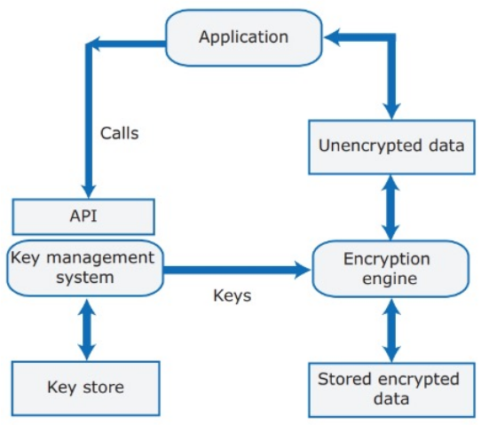

---
tags:
  - università/advanced-software-engineering
  - sicurezza
  - privacy
  - security-smells
data: 2026-09-22
capitolo: "7 — Security and Privacy"
corso: "Advanced Software Engineering"
professore: "Antonio Brogi"
fonte: "Appunti di Emiliano Sescu (github.com/Faxatos), cap. 7"
---

# Sicurezza e privacy

La sicurezza del software è una priorità sia per chi sviluppa il prodotto sia per chi lo usa, perché un attacco può causare danni a entrambi. La Fig. 7.1 mostra i tipi principali di minaccia; alcuni attacchi li combinano (ad esempio un **ransomware** colpisce l'integrità dei dati, ma di conseguenza anche la disponibilità del sistema).

*Fig. 7.1 — I tipi principali di minacce alla sicurezza.*

> [!tip] Le tre minacce in breve
>
> - **Disponibilità** (*availability*): impedire agli utenti legittimi di usare il sistema.
> - **Integrità** (*integrity*): danneggiare il sistema o i suoi dati.
> - **Riservatezza** (*confidentiality*): accedere a informazioni private.

La sicurezza riguarda **tutto il sistema**: il software applicativo dipende dal sistema operativo, dal web server, dal runtime del linguaggio, dal database, dai framework, dagli strumenti, ecc. Un attacco può colpire qualsiasi livello dell'infrastruttura, a partire dalla rete.

Alcune attività di gestione del sistema per mantenerlo sicuro:

- **Standard e procedure di autenticazione e autorizzazione**, perché tutti gli utenti abbiano un'autenticazione forte e permessi di accesso impostati bene.
- **Gestione dell'infrastruttura**: tenere configurato bene il software di base e applicare subito gli aggiornamenti di sicurezza che correggono le vulnerabilità.
- **Monitoraggio regolare degli attacchi**, per accorgersene presto e attivare strategie di difesa che ne limitino gli effetti.
- **Politiche di backup**, per avere copie integre di programmi e dati da ripristinare dopo un attacco.

---

## Attacchi e difese

### Injection

Un attacco di **injection** avviene quando un utente malintenzionato usa un campo di input valido per inserire **codice malevolo** o **comandi per il database** che danneggiano il sistema.

- **Buffer overflow**: una delle classi di attacco più comuni. L'attaccante costruisce con cura una stringa di input che contiene istruzioni eseguibili e sovrascrive la memoria. Se viene sovrascritto l'indirizzo di ritorno di una funzione, il controllo passa al codice malevolo. Succede ad esempio con sistemi operativi e librerie scritti in C/C++, che non controllano se gli accessi agli array restano nei limiti.
- **SQL injection**: possibile quando l'input dell'utente diventa parte di un comando SQL.

La contromisura più semplice è **controllare la validità dell'input**.

> [!example] SQL injection
>
> Se il codice costruisce la query come `"SELECT * FROM users WHERE name = '" + input + "'"` e l'utente scrive `' OR '1'='1`, la condizione diventa sempre vera e la query restituisce tutti gli utenti. Oltre a validare l'input, la difesa standard è usare **query parametrizzate** (*prepared statement*).

### Session hijacking

Molte applicazioni usano il concetto di **sessione**: un periodo in cui l'autenticazione dell'utente con l'applicazione web resta valida. Di solito si realizza con dei **cookie di sessione** (token) che il server dà al client e che il client rimanda a ogni richiesta HTTP, così l'utente non deve autenticarsi di nuovo a ogni interazione. La sessione si chiude quando l'utente fa logout o quando scade (*timeout*).

Nel **session hijacking** (furto di sessione) l'attaccante si procura un cookie di sessione valido per **fingersi un utente legittimo**. Può ottenerlo con un attacco di cross-site scripting o osservando il traffico (facile su Wi-Fi non protette e con dati non cifrati). L'attacco può essere:

- **attivo**: l'attaccante compie azioni sul server al posto dell'utente;
- **passivo**: l'attaccante si limita a osservare il traffico client-server in cerca di informazioni utili (password, numeri di carta di credito, ...).

Difese: **cifrare il traffico** client-server (es. HTTPS), usare l'**autenticazione a più fattori** per confermare azioni nuove e potenzialmente dannose, usare **timeout di sessione** abbastanza brevi.

### Cross-site scripting (XSS)

Il **cross-site scripting** è un'altra forma di injection: l'attaccante aggiunge **codice JavaScript malevolo** alla pagina web che il server manda al client. Lo script viene eseguito quando la pagina è mostrata nel browser della vittima, con l'obiettivo di rubare informazioni del cliente o dirottarlo su un altro sito. Può anche rubare i cookie, rendendo possibile il session hijacking.

*Fig. 7.2 — Un attacco di cross-site scripting.*

Difese: **validare l'input** (dei form), **controllare i dati presi dal database** prima di inserirli nella pagina generata, usare il comando HTML di **"encode"** (così le informazioni aggiunte alla pagina non sono eseguibili).

### Denial of Service (DoS)

Gli attacchi **Denial of Service** (DoS) vogliono rendere il sistema **inutilizzabile** per l'uso normale. Di solito si usano molti computer distribuiti (spesso infettati e controllati dall'attaccante) che mandano centinaia di migliaia di richieste a un'applicazione web (**DDoS**, *Distributed DoS*). Lo scopo è sabotare il fornitore del servizio o chiedere un riscatto.

Contromisure:

- software specializzati che **rilevano e scartano** i pacchetti in arrivo, evitando di essere sommersi dalle richieste;
- **blocchi temporanei** degli utenti (es. bloccare un utente dopo ripetuti tentativi di login falliti con la sua email);
- **tracciamento degli indirizzi IP** (es. applicare il blocco solo se i tentativi falliti arrivano da indirizzi IP insoliti).

### Brute force

L'attaccante ha solo una parte delle informazioni (es. un nome utente valido ma non la password) e prova ripetutamente a indovinare la parte mancante, ad esempio con un generatore di stringhe che crea tutte le combinazioni possibili di lettere e numeri.

Difese: convincere (cioè obbligare) gli utenti a usare **password lunghe**, che non siano nel dizionario né parole comuni. Un ulteriore livello di sicurezza è l'**autenticazione a due fattori**.

---

## Autenticazione e autorizzazione

### Autenticazione

> [!definition] Autenticazione
>
> L'**autenticazione** serve a garantire che gli utenti del sistema siano **davvero chi dicono di essere**.

Ci sono tre approcci principali:

- **Basata sulla conoscenza** (*knowledge-based*): l'utente fornisce informazioni segrete e personali scelte alla registrazione (es. una password). Ha diversi punti deboli: password poco sicure; **phishing** (l'utente clicca un link in una email che porta a un sito falso che raccoglie login e password); stessa password usata ovunque; password dimenticate spesso (serve un meccanismo di recupero, che è una possibile vulnerabilità se le credenziali sono state rubate). Si può rendere più sicura obbligando a usare password forti e aggiungendo domande personali per il recupero.
- **Basata sul possesso** (*possession-based*): l'utente ha un **dispositivo fisico** collegato al sistema che genera o mostra informazioni note al sistema (es. un codice inviato al numero di telefono, o un dispositivo dedicato che genera codici usa e getta).
- **Basata sugli attributi** (*attribute-based*): usa una caratteristica **biometrica** unica dell'utente (impronta digitale, volto).

Se il sistema conserva informazioni riservate, la buona pratica è l'**autenticazione a più fattori** (*multi-factor*, es. password e poi un codice ricevuto sul cellulare), che aggiunge un livello di sicurezza.

Di solito gli sviluppatori non scrivono l'autenticazione da zero ma usano librerie e toolkit già pronti (es. [OAuth](https://oauth.net/2/)). Anche così, costruire un sistema di autenticazione sicuro e affidabile richiede molto lavoro. Per questo spesso l'autenticazione si **delega** a un **sistema di identità federata**, cioè a un servizio esterno (es. Google, Facebook), come in Fig. 7.3. Questi servizi sono collaudati e probabilmente molto più sicuri di qualsiasi sistema fatto in casa. In più il fornitore del prodotto non deve gestire un proprio database di password e può ottenere altre informazioni sull'utente (se l'utente acconsente).

*Fig. 7.3 — Diagramma di sequenza dell'identità federata.*

Sui **dispositivi mobili** le regole cambiano, perché scrivere password sulla tastiera del telefono è scomodo. Un'alternativa è installare un **token di autenticazione** sul dispositivo, ma se il telefono viene rubato o perso qualcun altro può accedere al prodotto. Un'alternativa più sicura sono i **certificati digitali** personali degli utenti, emessi da enti fidati.

### Autorizzazione

> [!definition] Autorizzazione
>
> Mentre l'autenticazione verifica **chi è** l'utente, l'**autorizzazione** controlla **a quali risorse** l'utente può accedere.

Nei prodotti multiutente serve un **controllo degli accessi**, con una politica che rispetti le regole di protezione dei dati e limiti l'accesso ai dati personali (anche per evitare cause legali in caso di furto di dati).

Un modo diffuso per implementare la politica di accesso sono le **Access Control List (ACL)**:

- gli utenti sono divisi in **gruppi**, e questo riduce molto la dimensione delle ACL;
- gruppi diversi possono avere diritti diversi su risorse diverse;
- le **gerarchie di gruppi** permettono di assegnare diritti a sottogruppi o a singoli utenti.

*Fig. 7.4 — Esempio di Access Control List.*

---

## Crittografia

La **crittografia** (*encryption*) rende un testo illeggibile applicandogli una trasformazione algoritmica. Il testo viene cifrato con una chiave segreta, viaggia su canali non sicuri e, quando arriva a destinazione, viene **decifrato** con la stessa chiave o con un'altra.

Le tecniche moderne sono considerate "praticamente inattaccabili" con la tecnologia di oggi, anche se la storia insegna che una cifratura apparentemente inattaccabile può diventare attaccabile con nuove tecnologie (cosa succederà quando i computer quantistici saranno in commercio?).

Esistono due grandi categorie:

- **Crittografia simmetrica**: è la più antica (usata da secoli) ma si usa ancora oggi. Usa **la stessa chiave** per cifrare e decifrare. Il suo punto debole è come **condividere la chiave** in modo sicuro.
- **Crittografia asimmetrica**: usa **chiavi diverse** per cifrare e decifrare (una **pubblica** e una **privata**). È il metodo più sicuro, ma anche il più costoso in termini di calcolo.

> [!tip] Il meglio dei due mondi
>
> Di solito si **inizia** la comunicazione con la crittografia asimmetrica solo per scambiarsi in modo sicuro una **chiave simmetrica**, che poi si usa per il resto della comunicazione (più veloce).

### TLS

Il **Transport Layer Security (TLS)** è un protocollo di sicurezza molto diffuso per garantire privacy e sicurezza dei dati nelle comunicazioni su Internet. L'uso principale è cifrare la comunicazione tra applicazioni web e server, ad esempio quando un browser carica un sito. Usato sopra HTTP dà **HTTPS**, ormai lo standard per i siti web.

TLS serve anche a **verificare l'identità** dei web server tramite i **certificati digitali** che il server manda al client. I certificati sono emessi da enti fidati di verifica dell'identità (**CA**, *Certificate Authority*). La Fig. 7.5 mostra un tipico handshake client-server.

![Handshake TLS tra client e server: il client dice quali metodi di cifratura supporta, il server sceglie quello da usare; il client chiede al server di provare la sua identità; il server genera un numero casuale grande RS, lo cifra con la sua chiave privata e invia certificato digitale e RS cifrato; il client controlla il certificato, genera un numero casuale RC, decifra RS e cifra RC con la chiave pubblica presa dal certificato; il server decifra RC con la chiave privata; entrambi calcolano la chiave simmetrica da RS e RC e si scambiano i dati cifrati con quella chiave fino alla fine della sessione|560](assets/07-sicurezza_fig7-5_handshake-tls.png)
*Fig. 7.5 — Interazione TLS tra client e server per generare la chiave simmetrica con cui scambiare i dati.*

### Quando e dove cifrare

I dati degli utenti si dividono in tre categorie:

- **Dati in transito** (*in transit*): vanno **sempre cifrati**, per avere comunicazioni private.
- **Dati a riposo** (*at rest*, cioè salvati): vanno **sempre cifrati**, così in caso di attacco nessuno ottiene le informazioni degli utenti in chiaro.
- **Dati in uso** (*in use*, cioè in elaborazione): cifrarli e decifrarli **rallenta** i tempi di risposta del sistema.

La cifratura si può fare a quattro livelli:

- **Applicazione**: l'applicazione decide quali dati cifrare e li decifra subito prima di usarli. Costa in prestazioni (la sicurezza non è gratis) e richiede una gestione delle chiavi.
- **Database**: il DBMS può cifrare l'intero database quando viene chiuso e decifrarlo quando viene riaperto, oppure cifrare solo singole tabelle o colonne.
- **File**: il sistema operativo cifra i singoli file quando vengono chiusi e li decifra quando vengono riaperti.
- **Supporto** (*media*): il sistema operativo cifra i dischi quando vengono smontati e li decifra quando vengono rimontati (utile per portatili rubati o persi).

Tutti questi livelli richiedono una **chiave**. Le leggi sulla protezione dei dati possono richiedere di conservare copie dei dati per anni in modo sicuro: se si perdono le chiavi, i dati cifrati diventano **inaccessibili per sempre**! Le chiavi vanno cambiate periodicamente e il database deve conservare più versioni delle chiavi con la loro data. Per semplificare si usano i **Key Management System (KMS)**, che garantiscono che le chiavi siano generate, conservate e usate in modo sicuro e solo da utenti autorizzati (Fig. 7.6).

*Fig. 7.6 — Schema d'uso di un KMS.*

---

## Privacy

> [!definition] Privacy
>
> La **privacy** è un concetto sociale che riguarda la raccolta, la diffusione e l'uso corretto delle informazioni personali possedute da terzi.

*Fig. 7.7 — Le leggi sulla protezione dei dati.*

Principi di protezione dei dati (in Europa sono alla base del **GDPR**):

- **Consapevolezza e controllo**: gli utenti devono sapere quali dati vengono raccolti mentre usano il prodotto e devono avere il controllo sulle informazioni personali raccolte.
- **Scopo**: bisogna dire agli utenti **perché** si raccolgono i dati, e non usarli per altri scopi.
- **Consenso**: serve sempre il consenso dell'utente prima di comunicare i suoi dati ad altri.
- **Durata**: non si devono tenere i dati più del necessario. Se un utente cancella l'account, vanno cancellati anche i suoi dati personali.
- **Conservazione sicura**: i dati vanno conservati in modo che non possano essere alterati o mostrati a persone non autorizzate.
- **Accesso e correzione**: gli utenti devono poter sapere quali dati personali conserviamo e poter correggere eventuali errori.
- **Luogo**: non si devono conservare i dati in Paesi con leggi sulla protezione dei dati più deboli, a meno di un accordo esplicito che garantisca regole più forti.

Ci sono anche motivi di **business** per curare la privacy:

- se il sistema non rispetta le leggi sulla protezione dei dati, il fornitore rischia cause legali o di non poter vendere il prodotto;
- se il prodotto è venduto ad aziende, i clienti aziendali possono pretendere garanzie sulla privacy (per non essere a rischio con i loro utenti);
- una fuga o un uso scorretto dei dati dei clienti può danneggiare la reputazione del fornitore.

Quali dati raccogliere dipende dalle funzionalità del prodotto e dal modello di business. Altri consigli:

- non raccogliere informazioni personali che non servono;
- definire una **privacy policy** che dica come vengono raccolte, conservate e gestite le informazioni personali e sensibili;
- dire chiaramente se si usano i dati degli utenti per la pubblicità mirata o per servizi pagati da altre aziende;
- se il prodotto ha funzioni social con cui gli utenti condividono informazioni, assicurarsi che capiscano come controllare cosa condividono.

---

## Security smell

### Le sfide della sicurezza nei microservizi

Vediamo le caratteristiche degli attacchi e della sicurezza tipiche dei microservizi:

- **Più ampia è la superficie d'attacco, più alto è il rischio**: i microservizi si scambiano dati con chiamate remote, quindi ci sono potenzialmente moltissimi punti d'ingresso. La sicurezza dell'applicazione dipende dall'**anello più debole**: basta un solo punto d'ingresso debole per compromettere tutto.
- **Controlli di sicurezza distribuiti peggiorano le prestazioni**: ogni microservizio deve fare i suoi controlli di sicurezza, magari collegandosi a un servizio remoto che rilascia i token. Controlli ripetuti e distribuiti rallentano il sistema. Un ripiego è **fidarsi della rete** e saltare i controlli nei singoli microservizi, ma la vera soluzione (e la tendenza del settore) è la **rete zero-trust** (non ci si fida di nessuno per default), tenendo d'occhio le prestazioni complessive.
- **Stabilire la fiducia tra microservizi richiede automazione**: la comunicazione tra servizi deve avvenire su canali protetti. Se i servizi usano certificati, ogni microservizio deve ricevere un certificato (e la relativa chiave privata) per autenticarsi con gli altri, e chi riceve deve saper validare il certificato di chi chiama. Bisogna quindi creare la fiducia tra microservizi, anche revocando e rinnovando i certificati. Con centinaia di microservizi serve per forza l'**automazione**.
- **Tracciare le richieste tra più microservizi è difficile**: i **log** si possono aggregare in metriche che mostrano lo stato del sistema (es. media di accessi non validi all'ora) e fanno scattare allarmi. Le **trace** seguono una richiesta da quando entra nel sistema a quando esce. A differenza del monolite, una richiesta può attraversare molti microservizi, quindi è difficile collegare tra loro i pezzi della stessa richiesta.
- **I container complicano la gestione di credenziali e policy**: i container sono server **immutabili** (ottimo per semplificare il deploy e scalare in orizzontale), cioè non cambiano stato dopo l'avvio. Ma ogni servizio deve mantenere una lista dinamica di client autorizzati e un insieme dinamico di policy di accesso: l'unico modo per aggiornarle è tenere le credenziali nel file system del container e **iniettarle all'avvio**.
- **La distribuzione rende difficile condividere il contesto utente**: a una richiesta che si muove nel sistema si vogliono associare molte informazioni (es. se è una richiesta premium o no). Il problema è far sì che il microservizio che riceve si fidi del contesto utente passato da chi chiama (se qualcuno lo manipola, è un attacco). Una soluzione diffusa è il **JSON Web Token (JWT)**, un token di sicurezza per condividere il contesto utente tra microservizi.
- **Le responsabilità di sicurezza sono divise tra team diversi**: team indipendenti possono usare tecnologie diverse (buone pratiche di sicurezza, strumenti di test di sicurezza statici e dinamici, ...). Le organizzazioni spesso usano un approccio **ibrido**: un team di sicurezza centrale più esperti di sicurezza dentro i singoli team.

### Smell e refactoring

> [!definition] Security smell
>
> Un **security smell** è una decisione architetturale di uso comune che segnala **possibili violazioni della sicurezza** in un'applicazione a microservizi.

Come per gli architectural smell (vedi [[06 - Architettura a microservizi]]), si vuole capire come rilevarli e risolverli tramite refactoring, sulla base di una multivocal review. Le proprietà di sicurezza considerate sono:

- **Confidenzialità** (*confidentiality*): quanto il sistema garantisce che i dati siano accessibili solo a chi è autorizzato.
- **Integrità** (*integrity*): quanto il sistema impedisce modifiche non autorizzate a programmi o dati.
- **Autenticità** (*authenticity*): quanto si può dimostrare che l'identità di un soggetto o di una risorsa è quella dichiarata.

Uno smell può violare più proprietà. Ecco gli smell, le proprietà violate e i refactoring:

- **Controllo degli accessi insufficiente** (*insufficient access control*) — viola la **confidenzialità**. Alcuni servizi non controllano gli accessi, e questo porta al problema del **confused deputy** (un attaccante ottiene dati a cui non dovrebbe accedere, usando un servizio che ha più permessi di lui). I permessi del client vanno verificati al momento della richiesta, senza aggiungere latenza e colli di bottiglia con chiamate continue a un servizio centrale. **Refactoring**: usare **OAuth 2.0**, un framework basato su token per il controllo degli accessi delegato.
- **Microservizi accessibili pubblicamente** (*publicly accessible microservices*) — viola la **confidenzialità**. Alcuni microservizi sono raggiungibili direttamente dai client esterni: ognuno deve controllare autenticazione e autorizzazione a ogni richiesta (più costi di manutenzione) e le credenziali sono più esposte. **Refactoring**: il più citato è un **API gateway** che, da dietro un firewall, gestisce autenticazione, autorizzazione, limitazione del traffico e validazione del contenuto dei messaggi.
- **Privilegi non necessari ai microservizi** (*unnecessary privileges*) — viola **confidenzialità** e **integrità**. A volte i microservizi hanno livelli di accesso, permessi o funzionalità che non servono alle loro funzioni di business, spesso perché i programmatori copiano e incollano schemi simili. Più risorse esposte senza motivo vuol dire superficie d'attacco più ampia. **Refactoring**: seguire il **principio del privilegio minimo** (*Least Privilege Principle*: il codice deve avere solo i permessi necessari per il suo compito, e niente di più).
- **Crittografia "fatta in casa"** (*home-made crypto code*) — viola **confidenzialità**, **integrità** e **autenticità**. Usare codice crittografico scritto da sé può essere peggio che non cifrare affatto, per il falso senso di sicurezza che dà. **Refactoring**: usare librerie crittografiche ampiamente testate dalla comunità e aggiornate regolarmente (evitando algoritmi sperimentali).
- **Dati esposti non cifrati** (*non-encrypted data exposure*) — viola **confidenzialità**, **integrità** e **autenticità**. L'applicazione espone per errore dati sensibili (es. salvati senza cifratura o con protezioni vulnerabili), e un intruso può leggerli o modificarli, credenziali comprese. **Refactoring**: **cifrare tutti i dati sensibili a riposo**; devono restare sempre cifrati ed essere decifrati solo quando servono. La maggior parte dei DBMS supporta la cifratura automatica, ma si può cifrare anche a livello di applicazione, sistema operativo e cache. Attenzione: cifrare consuma risorse, quindi va fatto solo sui dati davvero critici.
- **Segreti scritti nel codice** (*hardcoded secrets*) — viola **confidenzialità**, **integrità** e **autenticità**. Segreti come chiavi API, client secret e credenziali non vanno mai messi nel codice o nelle variabili d'ambiente, perché possono essere esposti per errore (es. un gestore di eccezioni che manda informazioni a una piattaforma di logging). **Refactoring**: cifrare i segreti a riposo, non salvare le credenziali insieme all'applicazione o nei repository del codice, non passare i segreti tramite variabili d'ambiente.
- **Comunicazione tra servizi non protetta** (*non-secured service-to-service communications*) — viola **confidenzialità**, **integrità** e **autenticità**. Senza canali sicuri i dati sono esposti ad attacchi **man-in-the-middle**, intercettazione (*eavesdropping*) e manomissione (*tampering*). **Refactoring**: usare il **mutual TLS (mTLS)**, che cifra i dati in transito e ne garantisce integrità e riservatezza, e permette a ogni microservizio di identificare con certezza l'altro (**autenticazione reciproca**).
- **Traffico non autenticato** (*unauthenticated traffic*) — viola l'**autenticità**. I microservizi devono autenticarsi tra loro (soprattutto quando si passano il contesto utente). Altrimenti sono esposti a manomissione dei dati, denial of service o aumento dei privilegi. **Refactoring**: il **mutual TLS**, oppure **OpenID Connect**, che usa JWT con le informazioni dell'utente autenticato; i microservizi verificano l'identità dell'utente con i server di autorizzazione.
- **Autenticazione multipla** (*multiple user authentication*) — viola l'**autenticità**. È una tentazione far autenticare gli utenti da punti diversi, ma ogni punto d'accesso è un possibile varco per un intruso. **Refactoring**: il **Single Sign-On** (un solo punto d'ingresso), che semplifica anche il salvataggio dei log e i controlli. Si ottiene con un **API gateway** e **OpenID Connect** (per condividere il contesto utente).
- **Autorizzazione centralizzata** (*centralized authorization*) — viola l'**autenticità**. L'autorizzazione si può fare al bordo dell'applicazione (nell'API gateway) e/o in ogni microservizio. Se si fa **solo** al bordo, il punto centrale diventa un **collo di bottiglia**, e c'è il rischio di **confused deputy**: i microservizi si fidano del gateway solo perché è il gateway. **Refactoring**: **autorizzazione decentralizzata**, passando un **token di accesso** (es. JWT) con ogni richiesta a un microservizio e dando accesso solo se il token è valido.

### Fare refactoring o no?

Va deciso **caso per caso**: risolvere uno smell può peggiorare altre proprietà! Esempio: passare all'autorizzazione decentralizzata rispetta i principi di design dichiarati e garantisce le proprietà di sicurezza, ma quella centralizzata è più facile da mantenere e ha prestazioni migliori.

Per vedere questi compromessi aiuta modellare le **interdipendenze tra obiettivi "soft"** (*soft goal*) come grafi, che si possono anche analizzare in modo automatico (Fig. 7.8).

![Grafo delle interdipendenze tra obiettivi: al centro le due scelte "passare all'autorizzazione decentralizzata" e "mantenere quella centralizzata", collegate con frecce verdi (effetto positivo) o rosse (effetto negativo) alle proprietà di sicurezza (confidentiality, integrity, authenticity), ai principi di design (independent deployability, horizontal scalability, isolation of failures, decentralization), all'efficienza (resource utilization, time behaviour, capacity) e alla manutenibilità (modularity, reusability, modifiability, testability, analysability)|555](assets/07-sicurezza_fig7-8_autorizzazione-centralizzata.png)
*Fig. 7.8 — Confronto tra autorizzazione centralizzata e decentralizzata.*
