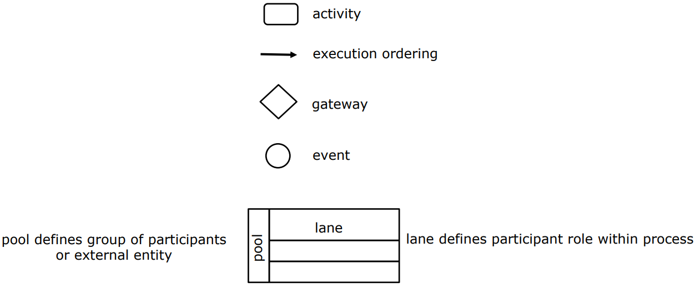
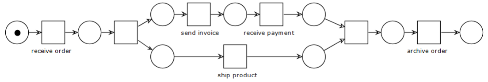
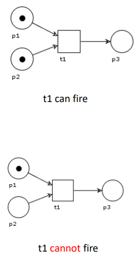
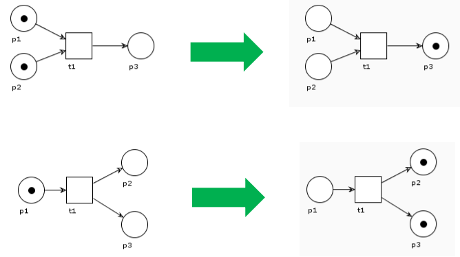
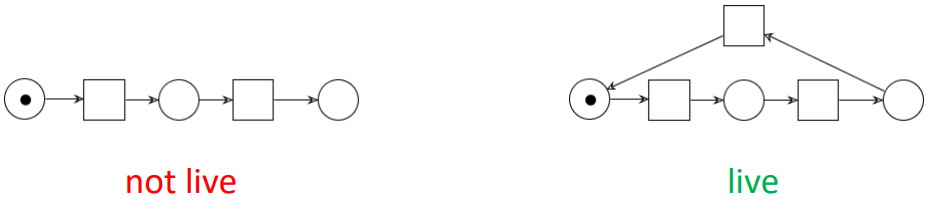
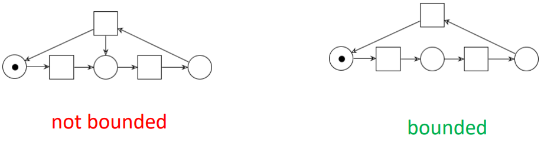

---
tags:
  - università/advanced-software-engineering
  - bpmn
  - petri-nets
  - workflow-nets
data: 2026-09-22
capitolo: "8 — Business Process Modeling"
corso: "Advanced Software Engineering"
professore: "Antonio Brogi"
fonte: "Appunti di Emiliano Sescu (github.com/Faxatos), cap. 8"
---

# Business Process Modeling

Il **Business Process Management** (BPM) è il metodo sistematico con cui si analizzano i processi di business esistenti di un'organizzazione e si introducono miglioramenti per rendere il flusso di lavoro più efficace ed efficiente (IBM ci ha fatto una fortuna).

> [!definition] Processo, modello, istanza
>
> - Un **processo di business** è un insieme di attività di business che rappresentano i passi necessari per raggiungere un obiettivo di business.
> - Un **modello di processo** (Fig. 8.1) è formato da un insieme di modelli di attività e dai **vincoli di esecuzione** tra di esse.
> - Un'**istanza di processo** è un caso concreto nell'operatività di un'azienda, formato da istanze di attività.

*Fig. 8.1 — Esempio di modello di processo di business.*

---

## BPMN

La **Business Process Model and Notation (BPMN)** è la notazione grafica standard per modellare i processi di business (Fig. 8.2).

*Fig. 8.2 — La notazione grafica per il business process modeling.*

La Fig. 8.3 mostra un esempio completo, con il funzionamento di tre tipi di **gateway**:

- **parallelo** (AND): attiva tutti i rami in uscita e, in ingresso, aspetta che arrivino tutti;
- **esclusivo** (XOR): sceglie **uno solo** dei rami in uscita;
- **inclusivo** (OR): attiva **uno o più** rami in base a una condizione su ciascuno; in ingresso aspetta tutti i rami che erano stati attivati.

*Fig. 8.3 — Esempio: processo di spedizione di un rivenditore di hardware.*

La Fig. 8.4 mostra come più processi possono interagire tramite **message flow** (frecce tratteggiate tra pool diversi). C'è un processo principale e uno secondario. Quando si raggiunge un **terminate event**, tutte le attività del processo terminano subito. Nel processo principale si vedono anche un **timer event** e un **event-based gateway** (che aspetta un evento per scegliere il ramo).

*Fig. 8.4 — Esempio di collaborazione B2B (pizza).*

L'ultimo esempio (Fig. 8.5) mostra la notazione dei **sotto-processi** (*sub-process*) e degli **eventi agganciati** (*attached event*) al bordo di un'attività:

- **error** → **interrompente**: se scatta, l'attività viene interrotta e si segue il ramo dell'evento;
- **escalation** → **non interrompente**: se scatta, si avvia il ramo dell'evento ma l'attività continua.

*Fig. 8.5 — Esempio: evasione dell'ordine e approvvigionamento.*

> [!note] Collegamento con il corso di BPM
>
> BPMN, reti di Petri e soundness sono trattati in dettaglio negli appunti di Business Process Modeling: [[07a - EPC e BPMN]], [[04 - Petri Nets]], [[12 - Soundness]].

---

## Workflow net

Nel BPM è fondamentale poter **dimostrare proprietà** dei modelli di processo.

Le **workflow net** sono un'estensione delle **reti di Petri** e sono una delle tecniche più note per specificare processi di business in modo **formale e astratto**. La rappresentazione grafica delle reti di Petri facilita la comunicazione tra stakeholder diversi, e le proprietà del processo si possono analizzare formalmente con vari strumenti disponibili.

La Fig. 8.6 mostra come una rete di Petri renda leggibile un modello di processo, traducendo l'esempio di Fig. 8.1.

*Fig. 8.6 — La rete di Petri dell'esempio precedente (Fig. 8.1).*

### Reti di Petri

Una **rete di Petri** è formata da:

- **transizioni** (quadrati), che modellano le **attività**;
- **posti** (*place*, cerchi) e **archi** orientati tra posti e transizioni, che modellano i **vincoli di esecuzione**.

La dinamica del sistema è rappresentata dai **token** (i pallini): come sono distribuiti nei posti determina lo **stato** del sistema modellato.

> [!definition] Regola di scatto
>
> - Una transizione **può scattare** (è *abilitata*) se c'è **un token in ognuno dei suoi posti di input** (Fig. 8.7).
> - Quando scatta, **toglie un token** da ogni posto di input e **aggiunge un token** a ogni posto di output (Fig. 8.8).

*Fig. 8.7 — Reti di Petri: la regola di input.*

*Fig. 8.8 — Reti di Petri: la regola di output.*

### Workflow net e soundness

Le workflow net arricchiscono le reti di Petri con notazioni che semplificano la rappresentazione dei processi di business. Come le reti di Petri, si concentrano sul **flusso di controllo** del processo:

- le **transizioni** rappresentano le **attività**;
- i **posti** rappresentano le **condizioni**;
- i **token** rappresentano le **istanze di processo**.

La Fig. 8.9 mostra alcuni pattern di composizione utilizzabili con le reti di Petri.

> [!definition] Workflow net
>
> Una rete di Petri è una **workflow net** se e solo se:
>
> 1. c'è un **unico posto sorgente** (*source*, $i$) senza archi in ingresso;
> 2. c'è un **unico posto pozzo** (*sink*, $o$) senza archi in uscita;
> 3. ogni posto e ogni transizione si trova su **qualche cammino** dal posto iniziale a quello finale.

> [!definition] Soundness
>
> Una workflow net è **sound** (corretta) se e solo se:
>
> 1. ogni esecuzione della rete che parte dallo stato iniziale (un token nel posto sorgente, nessun altro token) **arriva prima o poi allo stato finale** (un token nel posto pozzo, nessun altro token);
> 2. ogni transizione compare in **almeno un'esecuzione** della rete.

> [!warning] Cosa dice (e cosa non dice) la soundness
>
> Le workflow net **astraggono dai dati**: le scelte che dipendono dai dati diventano scelte "alla cieca". Di conseguenza l'analisi può considerare **più rami del necessario**.
>
> - Una rete **non sound** va presa solo come un **avvertimento** di possibili problemi a runtime: l'analisi di un ramo che in realtà non verrà mai eseguito può rendere la rete non sound, anche se l'applicazione non lo eseguirà mai.
> - Al contrario, l'analisi di un ciclo può non accorgersi che l'applicazione non terminerà mai: una rete **sound non garantisce** che l'applicazione termini sempre.

*Fig. 8.9 — Pattern di composizione delle reti di Petri.*

### Verificare la soundness

Come si stabilisce in modo formale (e automatico) se una rete è sound? Servono prima due proprietà:

> [!definition] Liveness
>
> Una rete di Petri $(PN, M)$ è **viva** (*live*) se e solo se per ogni stato raggiungibile $M'$ e per ogni transizione $t$ esiste uno stato $M''$ raggiungibile da $M'$ in cui $t$ è abilitata.
>
> In parole semplici: da qualunque punto si arrivi, ogni transizione può ancora scattare prima o poi.

*Esempio di rete non viva (a sinistra) e viva (a destra).*

> [!definition] Boundedness
>
> Una rete di Petri $(PN, M)$ è **limitata** (*bounded*) se e solo se per ogni posto $p$ esiste un $n \in \mathbb{N}$ tale che, in ogni stato raggiungibile $M'$, il numero di token in $p$ è minore di $n$.
>
> In parole semplici: nessun posto può accumulare infiniti token.

*Esempio di rete non limitata (a sinistra) e limitata (a destra).*

> [!theorem] Soundness tramite liveness e boundedness
>
> Una workflow net $N$ è **sound** se e solo se $(\overline{N}, \{i\})$ è **viva e limitata**, dove $\overline{N}$ è la rete $N$ a cui si aggiunge una transizione che va dal posto pozzo $o$ al posto sorgente $i$.

> [!tip] Perché si aggiunge la transizione da $o$ a $i$
>
> "Cortocircuitando" la rete, il processo può ripartire dopo aver finito. Così la domanda "ogni esecuzione termina correttamente e ogni attività è utile?" diventa una domanda su proprietà classiche (liveness e boundedness) che i tool sanno già verificare.
