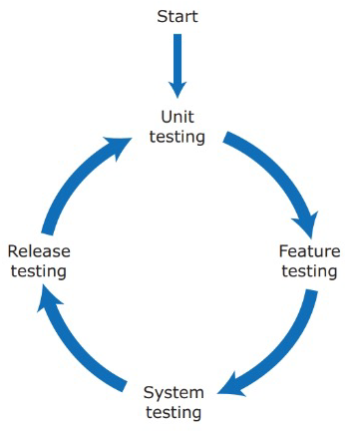
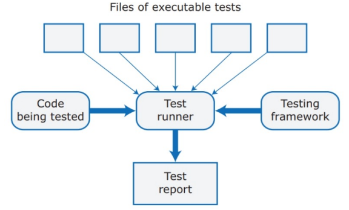
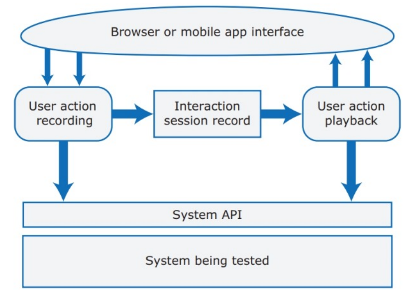

---
tags:
  - università/advanced-software-engineering
  - testing
  - tdd
  - code-review
data: 2026-09-22
capitolo: "9 — Testing"
corso: "Advanced Software Engineering"
professore: "Antonio Brogi"
fonte: "Appunti di Emiliano Sescu (github.com/Faxatos), cap. 9"
---

# Testing

> [!definition] Testing
>
> Il **testing** è il processo sistematico con cui si esegue un programma usando dati che simulano l'input dell'utente, per verificare che il software funzioni come previsto e rispetti i requisiti.

Il testing serve a osservare in modo metodico il comportamento del programma. Il principio di base è **confrontare il comportamento atteso con quello reale** durante l'esecuzione:

- se il comportamento osservato è quello atteso, il test **passa**;
- se si discosta da quello atteso, il test **fallisce**.

Alcuni tipi di test:

- **Test funzionale** (*functional testing*): verifica che l'applicazione svolga le sue funzioni come previsto. Si valutano le singole feature per controllare che rispettino i requisiti, guardando input, output e comportamento del sistema in varie condizioni.
- **Test con gli utenti** (*user testing*, o test di usabilità): valuta il software dal punto di vista dell'utente finale, per verificare che sia facile e intuitivo da usare e che risponda ai bisogni di chi lo userà. Spesso coinvolge utenti reali, per trovare problemi di usabilità, difetti di design o punti da migliorare.
- **Test di prestazioni e di carico** (*performance and load testing*): il test di prestazioni misura reattività, velocità ed efficienza in condizioni diverse. Il test di carico, un suo sottoinsieme, valuta come si comporta il sistema con livelli simulati o previsti di utenti contemporanei. Aiutano a trovare colli di bottiglia, misurare la scalabilità e assicurare buone prestazioni con carichi diversi.
- **Test di sicurezza** (*security testing*): cerca vulnerabilità e punti deboli per proteggere il sistema da minacce e accessi non autorizzati. Valuta la resistenza ad attacchi, furti di dati e manipolazioni, e aiuta a garantire che i dati sensibili siano protetti e che si rispettino gli standard di sicurezza.

> [!warning] Il limite del testing
>
> Il testing può mostrare la **presenza** di bug, ma **mai la loro assenza** (Dijkstra): non sostituisce la verifica formale del software.

Il resto del capitolo approfondisce il test funzionale e il test di sicurezza.

---

## Test funzionale

Il **test funzionale** è un insieme completo di test che garantiscono che **tutto il codice venga eseguito almeno una volta**, per verificare il comportamento complessivo del sistema. Il testing deve iniziare **dal giorno in cui si comincia a scrivere codice**, e i test automatici semplificano il ciclo sviluppo-test.

Il test funzionale è un'attività **a fasi**: il processo è organizzato in fasi distinte (Fig. 9.1). Le fasi non sono rigidamente in sequenza e spesso si sovrappongono. Inoltre il **test di regressione** si fa continuamente, in ogni fase, per controllare che modifiche o nuove feature non introducano difetti in funzionalità già testate. Dividere il lavoro in fasi aiuta a trovare e risolvere i problemi ai diversi livelli dello sviluppo.


*Fig. 9.1 — Il ciclo di vita del test funzionale.*

### Unit testing

L'obiettivo dello **unit testing** è testare le **unità del programma** (es. funzioni, metodi) **in isolamento**.

> [!definition] Principio dello unit test
>
> Se un'unità di programma si comporta come previsto per un insieme di input che hanno alcune caratteristiche in comune, si comporterà allo stesso modo per un insieme più grande di input con le stesse caratteristiche.

> [!example] Esempio
>
> Se un programma si comporta correttamente con gli input 1, 5, 17, 45, 99, si può concludere che elaborerà correttamente anche tutti gli altri interi tra 1 e 99.

Per questo è importante individuare le **partizioni di equivalenza**: insiemi di input che vengono trattati allo stesso modo da un pezzo di codice. Poi si testa il programma con diversi input presi da ogni partizione. I programmatori sbagliano spesso proprio sui **limiti** delle partizioni, quindi conviene usare i valori di confine come input.

Linee guida per gli unit test:

- **Testa i casi limite**: se la partizione ha un limite inferiore e superiore (lunghezza delle stringhe, numeri, ...), scegli input ai bordi dell'intervallo.
- **Forza gli errori**: scegli input che facciano generare al sistema tutti i messaggi di errore, e input che dovrebbero produrre output non validi.
- **Riempi i buffer**: scegli input che facciano traboccare tutti i buffer di input.
- **Ripeti**: ripeti più volte lo stesso input o la stessa serie di input.
- **Overflow e underflow**: se il programma fa calcoli numerici, scegli input che producano numeri molto grandi o molto piccoli.
- **Non dimenticare null e zero**: se il programma usa puntatori o stringhe, testa sempre con puntatori e stringhe nulli; con le sequenze, testa la sequenza vuota; con i numeri, testa sempre lo zero.
- **Tieni il conto**: con liste e trasformazioni di liste, conta gli elementi di ogni lista e controlla che i conti tornino dopo ogni trasformazione.
- **Uno è diverso**: se il programma lavora su sequenze, testa sempre anche sequenze con un solo elemento.

> [!example] Partizioni e limiti in pratica
>
> Una funzione accetta un'età tra 18 e 65. Le partizioni sono: minore di 18 (non valida), 18-65 (valida), maggiore di 65 (non valida). Oltre a un valore "normale" per ogni partizione (es. 10, 40, 80), si testano i confini: 17, 18, 65, 66.

### Feature testing

Una feature implementa una funzionalità utile per l'utente. L'obiettivo del **feature testing** è verificare che quella funzionalità sia implementata come previsto e risponda ai bisogni reali degli utenti. Le feature di solito sono realizzate da più unità che interagiscono, quindi ci sono due tipi di test:

- **Test di interazione**: verificano le interazioni tra unità (di solito scritte da sviluppatori diversi). Possono anche scoprire bug nelle singole unità sfuggiti agli unit test.
- **Test di utilità** (*usefulness tests*): verificano che la feature faccia quello che gli utenti probabilmente vogliono. Il **Product Manager** dovrebbe partecipare alla loro progettazione.

I test delle feature si ricavano da **scenari** o **user story**.

> [!example] Da user story a test
>
> **User story** — Registrazione: "Come utente, voglio poter accedere senza creare un nuovo account, così non devo ricordare un altro login e un'altra password."
>
> **Test** — Schermata di login iniziale:
>
> - verificare che, quando l'utente clicca su "Accedi con Google", venga mostrata correttamente la schermata che chiede le credenziali Google;
> - verificare che il login vada a buon fine se l'utente ha già fatto l'accesso a Google.

### System testing

L'obiettivo del **system testing** è testare il sistema **nel suo insieme**, per:

- scoprire interazioni inattese o indesiderate tra le feature;
- capire se le feature lavorano bene insieme per supportare ciò che gli utenti vogliono davvero fare;
- assicurarsi che il sistema funzioni come previsto nei diversi ambienti in cui verrà usato;
- testare reattività, throughput, sicurezza e gli altri attributi di qualità.

Un consiglio per creare i test di sistema è usare scenari e user story per individuare i **percorsi completi** (*end-to-end*) degli utenti, perché si vuole testare il flusso dei dati attraverso moduli diversi.

### Release testing

Il **release testing** testa un sistema pronto per essere rilasciato ai clienti, nel suo **ambiente operativo reale** (non in un ambiente di test). L'obiettivo è **decidere se il sistema è abbastanza buono da essere rilasciato**, non trovare bug.

Serve perché preparare un sistema per il rilascio vuol dire impacchettarlo per il deploy, installare software e librerie necessari e configurare i parametri, e in questi passaggi si possono fare errori. Se il software è nel cloud, si può usare un processo di **rilascio continuo** automatico.

---

## Test di sicurezza

Gli obiettivi del **test di sicurezza** sono:

- trovare le **vulnerabilità** che un attaccante potrebbe sfruttare;
- fornire prove convincenti che il sistema è **abbastanza sicuro**.

Trovare vulnerabilità è più difficile che trovare bug, perché bisogna testare qualcosa che il software **NON** deve fare (potenzialmente infiniti test). I normali test funzionali possono non rivelare le vulnerabilità, e anche il software su cui si appoggia il prodotto (sistema operativo, librerie, database, ...) può contenerne.

Un test di sicurezza completo richiede conoscenze specialistiche (es. coinvolgere esperti esterni per il **penetration testing**, che costa molto). Di solito le aziende usano un **approccio basato sul rischio**: individuano i principali rischi di sicurezza del prodotto e scrivono test che dimostrino che il prodotto se ne protegge. Alcuni test si possono automatizzare, altri richiedono per forza controlli manuali del comportamento e dei file.

Esempi di rischi di sicurezza:

- un attaccante non autorizzato entra nel sistema usando credenziali autorizzate;
- una persona autorizzata accede a risorse che le sono vietate;
- il sistema di autenticazione non riconosce un attaccante non autorizzato;
- un attaccante accede al database con una SQL injection;
- gestione scorretta delle sessioni HTTP;
- i cookie di sessione HTTP finiscono in mano a un attaccante;
- dati riservati non cifrati;
- chiavi di cifratura finite in mano a un potenziale attaccante.

> [!tip] Pensa come un attaccante
>
> Quando si testa la sicurezza bisogna ragionare come un **attaccante**, non come un utente normale: provare apposta a fare le cose sbagliate e ripetere le azioni più volte.

---

## Automazione dei test

I **test automatici** sono molto usati nelle aziende di prodotto, perché testare il sistema a mano è noioso e soggetto a errori. I test eseguibili controllano che il software restituisca il risultato atteso per certi dati di input (Fig. 9.2).

> [!definition] Struttura di un test automatico (Arrange-Act-Assert)
>
> 1. **Arrange** (prepara): si prepara il sistema per eseguire il test (si definiscono i parametri del test).
> 2. **Action** (esegui): si chiama l'unità da testare con quei parametri.
> 3. **Assert** (verifica): si dichiara cosa deve essere vero se il test va a buon fine.


*Fig. 9.2 — Schema del test runner.*

> [!example] Un test con Arrange-Act-Assert (Python)
>
> ```python
> def test_sconto_10_percento():
>     carrello = Carrello(totale=100)        # Arrange
>     carrello.applica_sconto(0.10)          # Action
>     assert carrello.totale == 90           # Assert
> ```

Esistono framework di test per tutti i linguaggi più usati. Anche il **codice dei test può contenere bug**: per ridurre il rischio conviene scrivere test il più semplici possibile e revisionare i test insieme al codice che testano.

Gli **unit test** sono i più facili da automatizzare. Buoni unit test riducono (ma non eliminano) il bisogno di feature test, ed è un bene perché i **test tramite interfaccia grafica** (GUI) sono costosi da automatizzare (Fig. 9.3): conviene testare tramite le **API**. Per controllare che una feature abbia funzionato come previsto servono più asserzioni.


*Fig. 9.3 — Il ciclo del test basato su GUI.*

---

## Test-Driven Development

Alcuni framework Agile, come l'Extreme Programming, sono **test-driven**: gli sviluppatori scrivono **prima i test eseguibili** e **poi il codice** che li fa passare. La Fig. 9.4 mostra come il **Test-Driven Development** (TDD) si inserisce nel ciclo di sviluppo.


*Fig. 9.4 — Il ciclo del Test-Driven Development.*

> [!tip] Il ciclo in tre parole: red, green, refactor
>
> Si scrive un test che fallisce (**red**), si scrive il codice minimo per farlo passare (**green**), si migliora il codice mantenendo i test verdi (**refactor**).

Vantaggi:

- **Approccio sistematico**: i test sono legati chiaramente a parti del codice, quindi non ci sono parti non testate.
- I test aiutano a **capire il codice**.
- **Debug semplificato** e incrementale.
- **Codice più semplice** (punto discutibile).

Svantaggi:

- è difficile applicare il TDD al **test di sistema**;
- scoraggia i **cambiamenti radicali** al programma;
- porta a concentrarsi sui test invece che sul problema da risolvere;
- porta a pensare troppo ai dettagli di implementazione invece che alla struttura generale del programma;
- è difficile scrivere test con **"dati sbagliati"**.

---

## Code review

Il testing ha dei limiti:

- Gli sviluppatori testano il codice in base a **come hanno capito** cosa deve fare. Se hanno capito male, l'errore sarà sia nel codice sia nei test.
- I test possono non coprire tutto il codice scritto (il TDD sposta il problema sull'incompletezza del codice).
- I test non dicono molto su altre qualità del programma (leggibilità, struttura, facilità di evoluzione).

Per questo le **code review** (revisioni del codice) completano il testing. La Fig. 9.5 mostra come lavora un revisore.


*Fig. 9.5 — Il ciclo delle code review.*

Spesso c'è **un solo revisore** (dello stesso team DevOps o di un altro), che può commentare anche la leggibilità e la comprensibilità del codice. Ogni sessione di review dovrebbe riguardare **200-400 righe di codice** e può partire in automatico dai commit sui repository condivisi.

Il revisore usa spesso una **checklist** con punti generali o specifici del linguaggio. Esempi:

- (generale) I nomi di variabili e funzioni sono significativi?
- (generale) Sono stati considerati tutti gli errori sui dati, con i relativi test?
- (generale) Tutte le eccezioni sono gestite esplicitamente?
- (Python) Si usano parametri di default nelle funzioni?
- (Python) I tipi sono usati in modo coerente?
- (Python) Il livello di indentazione è corretto?
