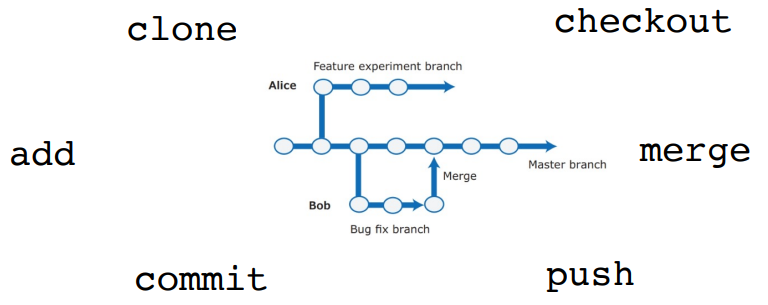
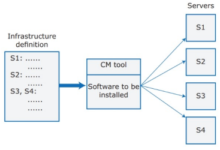

---
tags:
  - università/advanced-software-engineering
  - devops
  - ci-cd
  - git
  - infrastructure-as-code
data: 2026-09-22
capitolo: "10 — DevOps"
corso: "Advanced Software Engineering"
professore: "Antonio Brogi"
fonte: "Appunti di Emiliano Sescu (github.com/Faxatos), cap. 10"
---

# DevOps

Nell'ingegneria del software project-based c'erano due team separati:

- un **team di sviluppo**, che si occupava di tutto lo sviluppo (design, requisiti, specifiche, prototipi, test, integrazione) fino a consegnare un software testato e pronto al rilascio;
- un **team operativo** (*operations*), che installava e manteneva il sistema (supporto agli utenti ed eventuali modifiche al software).

I problemi di questo modello erano i ritardi di comunicazione tra i team, strumenti diversi, competenze diverse e spesso la difficoltà a capire i problemi dell'altro team. In più, per correggere bug urgenti o vulnerabilità di sicurezza servivano giorni, perché il team operativo non aveva sviluppato il software.

Tre fattori hanno permesso il cambiamento:

- l'**ingegneria del software Agile** ha ridotto i tempi di sviluppo, e il processo di rilascio tradizionale è diventato un collo di bottiglia;
- **Amazon** ha riprogettato il suo software a (micro)servizi, affidando sviluppo e supporto di ogni servizio **allo stesso team**;
- è diventato possibile rilasciare software come **SaaS** su cloud pubblici o privati.

> [!definition] DevOps
>
> Il **DevOps** (*Development* + *Operations*) unisce sviluppo, deploy e supporto in **un unico team**.

I principi del DevOps sono:

- **Tutti sono responsabili di tutto**: tutti i membri del team condividono la responsabilità di sviluppare, rilasciare e supportare il software.
- **Tutto ciò che si può automatizzare va automatizzato**: tutte (o quasi) le attività di test, deploy e supporto devono essere automatiche.
- **Prima misura, poi cambia**: il DevOps deve essere guidato dai dati raccolti sul sistema e sul suo funzionamento.

Vantaggi del DevOps:

- **Deploy più veloce** (il vantaggio principale): i ritardi di comunicazione tra persone si riducono drasticamente, e si passa in produzione in ore invece che in giorni o settimane.
- **Meno rischi**: ogni release aggiunge piccoli incrementi di funzionalità, quindi ci sono meno probabilità di interazioni impreviste tra feature e di guasti.
- **Riparazioni più rapide**: non bisogna scoprire quale team deve risolvere il problema e aspettare che lo faccia.
- **Team più produttivi**: i team DevOps sono più produttivi di team che si occupano di attività separate.

Un team DevOps mette insieme competenze diverse: ingegneria del software, UX design, sicurezza, infrastruttura, rapporto con i clienti e altro. Il suo successo si basa su:

- una **cultura di rispetto reciproco e condivisione**: tutti partecipano agli scrum e alle altre riunioni, e ognuno è incoraggiato a condividere le proprie competenze e a impararne di nuove;
- il **supporto degli sviluppatori al software che hanno scritto**: se un servizio si guasta nel weekend, è lo sviluppatore che deve rimetterlo in funzione; se non è disponibile, lo fa un altro membro del team. I team DevOps puntano a riparare i guasti il più in fretta possibile, **non a cercare un colpevole**.

---

## Gestione del codice

Durante lo sviluppo di un prodotto si scrivono decine di migliaia di righe di codice e di test automatici, organizzate in centinaia di file. Si usano decine di librerie e servono vari programmi per creare ed eseguire il codice: senza un supporto automatico è impossibile tenere traccia delle modifiche.

> [!definition] Sistema di gestione del codice
>
> Un **code management system** è un software che supporta le pratiche per gestire un codice che evolve nel tempo. Deve garantire che le modifiche di sviluppatori diversi **non interferiscano** tra loro e aiutare a creare **versioni diverse** del prodotto. Deve anche semplificare la creazione del prodotto eseguibile dai sorgenti e l'esecuzione dei test automatici.

La Fig. 10.1 mostra i componenti: in alto la pipeline **CI/CD** (*Continuous Integration / Continuous Delivery-Deployment*), in basso le **misurazioni DevOps**, al centro il sistema di gestione del codice con le sue funzionalità principali.

*Fig. 10.1 — La struttura di un sistema DevOps.*

Funzionalità di un sistema di gestione del codice:

- **Identificazione di versioni e release**: ogni versione di un file inviata al sistema riceve un identificatore unico (i file gestiti non vengono mai sovrascritti) e si può recuperare con l'identificatore o con altri attributi del file.
- **Registrazione della storia delle modifiche**: chi invia una modifica deve aggiungere una nota che ne spiega il motivo, così gli altri capiscono perché è nata una nuova versione.
- **Sviluppo indipendente**: più sviluppatori possono lavorare sullo stesso file contemporaneamente. Ogni invio crea una nuova versione, quindi i file non vengono mai sovrascritti da modifiche successive.
- **Supporto ai progetti**: gli sviluppatori scaricano il codice nel loro spazio personale, ci lavorano e lo rimandano al sistema condiviso. Si possono creare **branch** paralleli per lavorare in contemporanea, e le modifiche fatte in branch diversi si possono unire (**merge**). Tutti i file di un progetto si possono scaricare insieme.
- **Gestione dello spazio**: meccanismi efficienti evitano di tenere più copie di file che differiscono di poco (oggi meno importante, perché lo spazio costa poco).

### Sistemi centralizzati e distribuiti

All'inizio si usavano sistemi **centralizzati**, ma i vantaggi dei sistemi **distribuiti** (es. **Git**, creato per il kernel Linux) li hanno resi la soluzione migliore:

- **Resilienza**: ognuno ha la propria copia del repository (e può lavorare anche offline). Se il repository condiviso si danneggia o viene attaccato, si continua a lavorare e lo si ripristina dalle copie.
- **Velocità**: fare commit è veloce, perché si può fare in locale (senza trasferire dati in rete) oltre che sul branch comune.
- **Flessibilità**: avendo ognuno la propria copia, sperimentare in locale è molto più semplice e sicuro.

In Git ogni sviluppatore ha sul proprio computer un **clone privato** del repository condiviso, e c'è un **repository di progetto condiviso** (sul server dell'azienda o nel cloud, su servizi come GitHub o GitLab). La Fig. 10.2 mostra alcuni comandi Git e l'aspetto dei branch.

*Fig. 10.2 — Esempio di branch Git.*

> [!tip] I comandi Git della figura
>
> - `clone`: copia in locale un repository remoto.
> - `add`: prepara le modifiche da salvare (le mette nella *staging area*).
> - `commit`: salva le modifiche preparate come nuova versione nel repository locale.
> - `push`: invia i commit locali al repository condiviso.
> - `checkout`: passa a un altro branch o a un'altra versione.
> - `merge`: unisce le modifiche di un branch in un altro.

Nello sviluppo open source con Git di solito c'è un gruppo di persone che decide quali modifiche accettare. GitHub usa un meccanismo chiamato **Webhooks** per avviare gli strumenti di automazione DevOps quando il repository del progetto viene aggiornato.

---

## Automazione DevOps

"**Tutto ciò che si può automatizzare va automatizzato**": vediamo nel dettaglio questo principio del DevOps. Le forme di automazione sono:

- **Continuous integration**: ogni volta che uno sviluppatore fa commit di una modifica sul branch principale (*master*), si costruisce e si testa una versione eseguibile del sistema.
- **Continuous delivery**: costruita la nuova versione, il software eseguibile viene testato in un ambiente che simula quello operativo del prodotto.
- **Continuous deployment**: una nuova release del sistema viene resa disponibile agli utenti ogni volta che si fa una modifica al branch principale.
- **Infrastructure as code**: modelli leggibili dalle macchine dell'infrastruttura su cui gira il prodotto (rete, server, router, ...) vengono usati da strumenti di gestione della configurazione per costruire la piattaforma di esecuzione. Il modello include anche il software da installare (compilatori, librerie, DBMS, ...).

### Continuous integration

Serve la continuous integration perché, se il sistema si integra raramente, i problemi sono **difficili da isolare** e correggerli rallenta lo sviluppo. Integrare il sistema (*system building*) non vuol dire solo compilare, ma anche:

1. installare il software del database e creare il database con lo schema giusto;
2. caricare nel database i dati di test;
3. collegare il codice compilato con le librerie e gli altri componenti usati;
4. controllare che i servizi esterni usati siano attivi;
5. spostare i file di configurazione nelle posizioni giuste (e cancellare quelli vecchi);
6. eseguire i test di sistema per controllare che l'integrazione sia riuscita.

Come mostra la Fig. 10.3, ogni volta che si fa push di una modifica sul repository condiviso si crea e si testa una versione integrata del sistema. Finito il push, il repository manda un messaggio al **server di integrazione**, che costruisce una nuova versione del prodotto.

*Fig. 10.3 — La pipeline di continuous integration.*

> [!tip] Integrate twice
>
> È buona pratica **integrare due volte**: prima sulla macchina locale dello sviluppatore, poi facendo push sul repository del progetto, che avvia il server di integrazione (Fig. 10.4). Si fa così perché mettere una **build rotta** nel repository di progetto è una cosa molto grave.

*Fig. 10.4 — La pipeline "integrate twice".*

Vantaggi della continuous integration:

- **Trovare e correggere i bug è più veloce**: se si fa una piccola modifica e un test di sistema fallisce, il problema è quasi certamente nel nuovo codice.
- **C'è sempre un sistema funzionante** a disposizione del team, per provare idee e fare demo al management e ai clienti.
- **Cultura della qualità** nel team: nessuno vuole essere quello che ha "rotto la build", quindi tutti controllano bene il proprio lavoro prima del push.

Analizzare tutto il codice a ogni commit è molto pesante: per questo gli strumenti di integrazione **ripetono le operazioni solo se i file da cui dipendono sono cambiati** (es. ricompilano solo i file sorgente modificati). Per capire se una dipendenza è cambiata si possono usare le **date di modifica** dei file.

### Continuous delivery e deployment

Con la continuous integration e la gestione del codice si può creare una versione eseguibile del sistema, costruendolo e testandolo prima sul computer dello sviluppatore e poi sul server di integrazione.

Quando però lo si installa nell'**ambiente di produzione reale**, qualcosa può andare storto, perché la produzione è **diversa dall'ambiente di sviluppo** (il server può avere un'organizzazione del file system diversa, permessi diversi, applicazioni installate diverse, ...).

La **continuous delivery** garantisce che il sistema modificato sia pronto per i clienti eseguendo test delle feature nell'ambiente di produzione (per controllare che l'ambiente non causi guasti), test di sistema e **test di carico** (per vedere come si comporta il software quando aumentano gli utenti). Il modo più semplice per creare una replica dell'ambiente di produzione sono i **container**.

Come mostra la Fig. 10.5:

- per la **delivery**, dopo i primi test di integrazione si configura un ambiente di test "a fasi" (*staged*) e si lanciano i test di accettazione del sistema (funzionalità, carico, prestazioni);
- per il **deployment**, software e dati vengono trasferiti sui server di produzione, si passa alla nuova versione del sistema e si riavvia il processo. È fondamentale gestire anche i client ancora collegati alla vecchia versione.

*Fig. 10.5 — Schema di continuous delivery e continuous deployment.*

> [!tip] Delivery vs deployment
>
> Con la **continuous delivery** il software è sempre **pronto** per essere rilasciato (ma la decisione di rilasciarlo può restare manuale). Con il **continuous deployment** ogni modifica che passa i test viene **rilasciata automaticamente** agli utenti.

Vantaggi del continuous deployment:

- **Costi ridotti**: la pipeline di deploy è completamente automatica.
- **Problemi risolti più in fretta**: un problema probabilmente riguarda una piccola parte del sistema, e la sua causa è evidente.
- **Feedback dei clienti più rapido**: si rilasciano le nuove feature appena sono pronte e si usa il feedback degli utenti per migliorarle.
- **A/B testing**: con molti clienti e più server, si può installare la nuova versione solo su alcuni server e usare un load balancer per mandarci una parte dei clienti, così si misura come vengono usate le nuove feature.

> [!warning] Non rilasciare proprio tutto
>
> Probabilmente conviene non rilasciare ogni singola modifica:
>
> - piccole modifiche possono contenere feature incomplete, che è meglio non mostrare ai concorrenti prima di averle finite;
> - i clienti possono irritarsi se il software cambia di continuo, soprattutto l'interfaccia;
> - si possono voler sincronizzare i rilasci con i cicli di business noti (es. l'inizio dell'anno scolastico per il mercato dell'istruzione).

Molti strumenti di continuous integration (come **Jenkins** e **Travis**) si possono usare anche per la continuous delivery e il deployment. Si possono integrare con strumenti di gestione della configurazione dell'infrastruttura, anche se per il software nel cloud spesso è più semplice usare i **container** insieme agli strumenti di CI.

### Infrastructure as code

Gestire a mano un'infrastruttura con decine o centinaia di server è **costoso e soggetto a errori**. I server (fisici o virtuali) hanno configurazioni diverse e software diversi: quando esce una nuova versione di un software, alcuni server vanno aggiornati e altri no, per via di dipendenze da versioni vecchie. Tenere traccia a mano del software installato su ogni server è difficilissimo e spesso non si fa (es. le modifiche d'emergenza non sempre vengono documentate).

L'idea è automatizzare l'aggiornamento dei server usando un **modello dell'infrastruttura leggibile dalle macchine**. Gli strumenti di **Configuration Management** (CM, come **Puppet**, **Chef** e **Ansible**) installano automaticamente software e servizi sui server secondo la definizione dell'infrastruttura. L'infrastruttura è rappresentata come dati, per questo si parla di **Infrastructure as Code** (IaC, Fig. 10.6). Quando serve un cambiamento si aggiorna il modello, e lo strumento CM applica le modifiche a tutti i server.

*Fig. 10.6 — Schema dell'infrastructure as code.*

Vantaggi dell'infrastructure as code:

- **Visibilità**: l'infrastruttura è definita in un modello a sé che tutto il team DevOps può leggere, capire e revisionare.
- **Riproducibilità**: le installazioni avvengono sempre nella stessa sequenza e producono sempre lo stesso ambiente. Non serve che qualcuno si ricordi l'ordine delle operazioni (i computer sono più affidabili delle persone in questo).
- **Affidabilità**: l'automazione evita i piccoli errori che gli amministratori fanno quando ripetono le stesse modifiche su più server.
- **Ripristino**: il modello dell'infrastruttura si può versionare e salvare nel sistema di gestione del codice. Se una modifica crea problemi, si torna facilmente a una versione precedente e si reinstalla l'ambiente che si sa funzionare.

I **container** sono un modo molto efficace per rilasciare prodotti nel cloud, perché rendono semplice avere **ambienti di esecuzione identici**: per ogni tipo di server si definisce l'ambiente necessario e si costruisce un'immagine; quando si aggiorna il software si crea una nuova immagine. Per scalabilità, resilienza e orchestrazione si può usare un sistema di gestione dei container come **Kubernetes** (vedi [[05 - Software cloud-based]]).

---

## Misurazioni DevOps

Per migliorare continuamente il processo DevOps, cioè rilasciare più in fretta software di qualità migliore, bisogna **misurare e analizzare** dati sul prodotto e sul processo. Ci sono vari tipi di misurazioni:

- **Misure di processo**: dati sui processi di sviluppo, test e deploy.
- **Misure di servizio**: dati su prestazioni, affidabilità e gradimento del software da parte dei clienti.
- **Misure d'uso**: dati su **come i clienti usano** il prodotto (invece di mostrare pop-up che chiedono se il prodotto è piaciuto); aiutano a trovare problemi nel software stesso.
- **Misure di successo del business**: dati su quanto il prodotto contribuisce al successo complessivo dell'azienda. È difficile isolare il contributo del DevOps, perché il successo potrebbe dipendere dal DevOps oppure da una gestione migliore.

> [!example] Metriche tipiche
>
> - **Processo**: frequenza dei deploy, percentuale di deploy falliti, tempo medio di ripristino dopo un guasto.
> - **Servizio**: disponibilità, tempi di risposta, numero di segnalazioni dei clienti.
> - **Uso**: numero di utenti attivi, feature più e meno usate, durata delle sessioni.

Misurare il software e il suo sviluppo è complesso: bisogna scegliere metriche che diano informazioni utili e trovare modi affidabili per raccoglierle e analizzarle. Alcune misure (es. la **soddisfazione dei clienti**) vanno ricavate da altre metriche (es. il **numero di clienti che tornano**).

La misurazione va automatizzata il più possibile: gli sviluppatori devono **strumentare** il software perché raccolga dati su se stesso e usare un sistema di monitoraggio per le prestazioni e la disponibilità. Per raccogliere dati in automatico si può:

- usare strumenti di continuous integration come **Jenkins** per i dati su deploy, test superati, ecc.;
- usare i servizi di monitoraggio dei provider cloud, come **Amazon CloudWatch**, per disponibilità e prestazioni;
- raccogliere i dati forniti dai clienti tramite i sistemi di gestione delle segnalazioni (*issue management*);
- aggiungere al prodotto della **strumentazione** per raccogliere dati sulle prestazioni e su come lo usano i clienti. Di solito i **file di log** sono la scelta migliore: si registrano più eventi possibile e si usano strumenti di analisi dei log per capire come viene usato il software.
