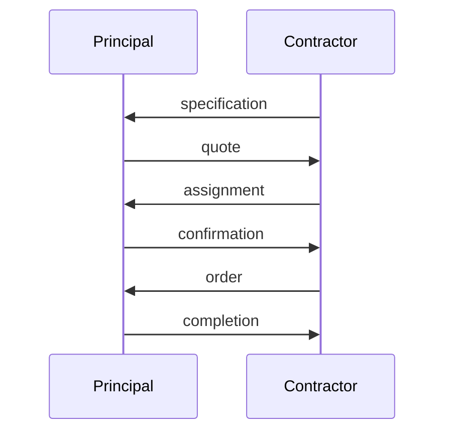
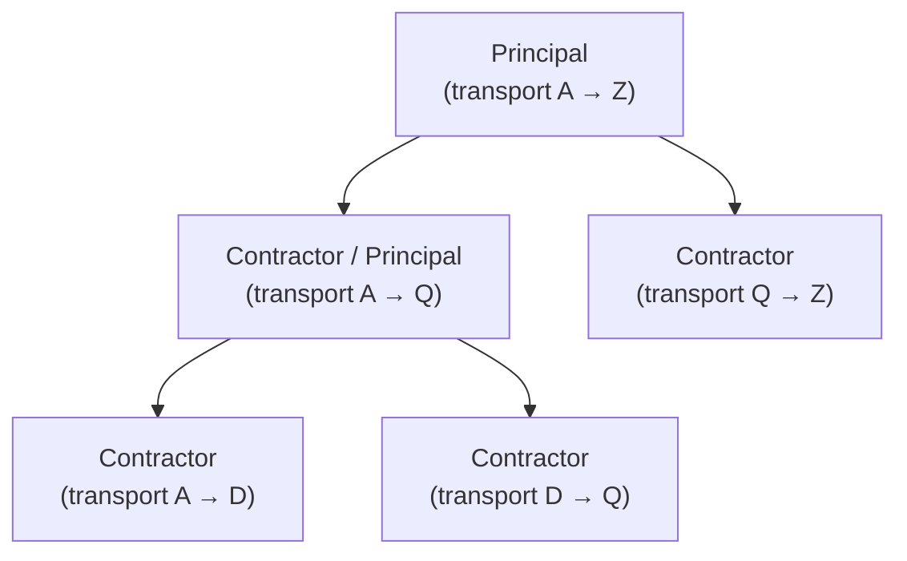

---
tags:
  - università/business-process-modeling
  - business-process
  - process-orientation
  - organizational-structure
data: 2026-07-03
lezione: "02 — Business Processes"
corso: "MPB (6 cfu, 295AA)"
professore: "Roberto Bruni"
fonte: "Weske, *Business Process Management*, Ch.1 · van der Aalst, *Workflow Management*, Ch.1"
---

# Business Processes

Questa lezione introduce il **vocabolario di base** del corso. Non c'è ancora nessun formalismo: l'obiettivo è capire *cosa* sono i processi di business, *da dove* nasce l'esigenza di ragionare "per processi", e *quali* sono gli elementi (attori, casi, procedure, task, risorse) che ricorreranno in tutto il resto. Fissiamo i termini preferiti, ammettendo però sinonimi in modo intercambiabile. La terminologia tecnica resta in inglese, così come compare sulle slide.

---

## Orientamento al processo

### Dai prodotti al lavoro

Il punto di partenza è quasi ovvio, ma è importante seguirlo perché è la radice di tutto. Per vivere abbiamo bisogno di **prodotti** (cibo, vestiti, casa, trasporti, salute) e, sempre più spesso, di **servizi**, cioè prodotti immateriali come l'approvazione di un credito, la conoscenza, l'intrattenimento. Qualunque prodotto, materiale o immateriale, è l'esito di un certo **work**: un task, una funzione, un incarico, spesso solo un tassello di un'attività più grande.

Nessuno però è capace di produrre da sé tutto ciò di cui ha bisogno. Per questo i prodotti vengono scambiati attraverso il **market**: la distribuzione in cambio di denaro. È proprio l'esistenza del mercato a far nascere una gran quantità di *lavoro derivato* che altrimenti non esisterebbe — commercio, banche, pubblicità, logistica, assicurazioni, e-commerce e così via — oltre al lavoro puramente interno che serve solo a tenere in piedi l'organizzazione, senza contribuire direttamente a soddisfare un bisogno.

### Le unità di lavoro e la nascita del Taylorismo

Di fronte a questa mole di lavoro, le persone lo organizzano in **work units** specializzate: divisioni relativamente autonome, ciascuna capace di fare bene una gamma limitata di prodotti o servizi. L'orientamento al processo nasce da una revisione critica di *come* organizzare queste unità, un modo introdotto da **Frederick Taylor** (1856–1915).

L'idea di Taylor è che, analizzando scientificamente il lavoro, si possa trovare "la" maniera migliore di eseguirlo (la *one best way*, tramite lo studio dei tempi e dei movimenti) e che questa maniera vada poi imposta dall'alto. Ne segue una netta separazione tra chi *pensa* il lavoro e chi lo *esegue*.

> [!definition] Taylorismo
>
> Applicazione di una **functional breakdown** del lavoro complesso: lo si scompone in unità di piccolissima granularità, così che una forza lavoro **altamente specializzata** possa svolgerle in modo efficiente. La ricerca della *"one best way"* passa dallo studio scientifico del lavoro (time and motion study) e comporta la separazione tra **lavoro mentale** (la pianificazione, affidata al management) e **lavoro manuale** (l'esecuzione, affidata agli operai).

Questa spinta verso la specializzazione non è un fatto improvviso, ma il punto d'arrivo di una lunga traiettoria storica. La si può leggere lungo due dimensioni parallele: cosa il lavoratore *tiene a fuoco* (il suo **focus**) e quanto è specializzato (le sue **capabilities**).

| Epoca | Worker's focus | Worker's capabilities |
|---|---|---|
| **Prehistoric times** | l'intero processo, per *tutti* i prodotti | *pure generalist* |
| **Ancient times** | l'intero processo, per *un singolo* prodotto | *intermediate specialist* |
| **Middle Ages → Industrial** | una *singola parte* di un processo, per un singolo prodotto | *pure specialist* |

*Fig. — "Road to Taylorism": scorrendo dalle epoche antiche a quella industriale, il lavoratore si restringe progressivamente a una porzione sempre più piccola del processo, diventando specialista puro.*

Il taylorismo ha funzionato benissimo nella manifattura e ha alimentato la rivoluzione industriale con le catene di montaggio. Ma ha un rovescio della medaglia che diventa evidente quando lo si applica fuori dalla fabbrica.

> [!warning] Il pitfall del Taylorismo
>
> Scomporre il lavoro in tante attività minime impone molti **handover**, cioè passaggi di consegne da un lavoratore all'altro. Finché i prodotti si assemblavano in pochi passi semplici, questi passaggi non costavano quasi nulla e non richiedevano di sapere cosa fosse successo prima. Ma nelle organizzazioni che trattano **informazione e dati immateriali** i passi di un processo sono strettamente **correlati**: per svolgere un passo serve spesso conoscere lo stato dell'intero caso. Qui gli handover diventano un problema serio, perché ogni passaggio richiede di trasferire anche il contesto, cioè conoscenza.

A questo si aggiunge un costo umano. In una società complessa, un'iper-specializzazione fa perdere ai lavoratori la visione d'insieme (la *big picture*): non capiscono più come il proprio pezzetto si inserisca nel tutto, e questo genera **alienazione**, con ricadute negative sulla produttività (e sulla vita delle persone). Far sapere a un dipendente per quale cliente sta lavorando è, non a caso, un modo semplice per aumentarne motivazione e resa.

> [!tip] L'idea chiave della prospettiva a processo
>
> La risposta a questi problemi è **ricombinare** più unità di lavoro a grana fine in unità più grandi, riducendo così il numero di handover. Il prezzo da pagare è che i lavoratori devono avere competenze più ampie: diventano *knowledge worker* con una visione dell'obiettivo finale. A livello organizzativo, questo orientamento al processo si realizza al meglio con una **struttura a matrice** (che vedremo tra poco). Il punto centrale è che ragionare per processi non serve solo a *elencare* le attività, ma soprattutto a **studiare e migliorare le connessioni** tra di esse.

---

## Strutture organizzative

Se ragioniamo per processi, dobbiamo chiederci come sono organizzate le persone che li eseguono. Una **struttura organizzativa** stabilisce come lavoro, autorità e responsabilità vengono ripartiti tra il personale. Il vincolo di fondo è che ogni **resource** sa svolgere solo certi task, e ogni task può essere svolto solo da certe risorse: un cassiere di banca, per esempio, non può concedere un mutuo. Descrivere un processo significa allora indicare tre cose — *quali* task servono, in *quale ordine*, e *chi* li esegue — e il modo in cui si assegnano i work item alle risorse incide moltissimo su efficienza ed efficacia.

Le risorse si classificano secondo due criteri complementari: le **functions** (le competenze e proprietà funzionali di una risorsa) e i **roles** (la posizione nell'organizzazione, come l'appartenenza a un gruppo o a un'unità di lavoro). Una stessa risorsa può ricoprire più ruoli, anche contemporaneamente. Su questa base si distinguono tre forme tipiche di struttura.

### Struttura a rete (network)

Nella struttura a **rete**, attori autonomi collaborano per fornire prodotti o servizi senza una gerarchia. Le relazioni sono orizzontali: aggregazioni ad-hoc, outsourcing, ingresso e uscita dinamici dei membri dal team. È la forma più flessibile e meno rigida.

### Struttura gerarchica

La struttura **gerarchica** è organizzata come un **albero**. Poiché la nozione di albero tornerà spesso nel corso, conviene richiamarla con precisione.

> [!definition] Tree
>
> Un albero è un **grafo** (vertici + archi) in cui due qualsiasi vertici sono connessi da **esattamente un cammino** — equivalentemente, un grafo **connesso e aciclico**.
> - **Leaf**: un vertice di grado 1 (una "foglia" con un solo collegamento).
> - **Rooted tree**: un albero in cui si distingue un vertice speciale, la **root**; da lì gli archi si orientano implicitamente allontanandosi dalla radice.

Calata sull'organizzazione, questa struttura prende il nome di **organization chart** (organigramma): i nodi interni dell'albero sono ruoli o funzioni individuali, le foglie sono lo staff o i dipartimenti, e i rami rappresentano le relazioni di autorità (chi comanda chi).

### Struttura a matrice (matrix)

La struttura a **matrice** è quella che serve davvero all'orientamento al processo, perché tiene insieme due dimensioni contemporaneamente: quella **gerarchica** (le funzioni, stabili) e quella **funzionale-dinamica** (i processi/progetti in corso). Concretamente, si ha **una riga per ciascun processo**: ogni persona resta inquadrata nella gerarchia delle funzioni, ma può avere anche uno o più capi legati ai progetti, i **project leader**.


*Fig. — Struttura a matrice. Verticalmente scorre la gerarchia funzionale (President → Vice President → ruoli operativi); orizzontalmente, ogni riga è un progetto/cliente gestito da un project manager. I pallini alle intersezioni sono le assegnazioni: un progetto "attraversa" in orizzontale più funzioni della gerarchia — è esattamente la cross-functionality che ci interessa.*

---

## Attori : principal e contractor

Passiamo da come è organizzato il lavoro a chi lo commissiona e chi lo esegue. Nella pratica, gran parte del lavoro di una persona le viene **assegnato o dato in outsourcing** da qualcun altro: i suoi **principal** (che possono essere individui, dipartimenti o intere aziende). I principal si presentano in due forme, il **boss** e il **customer**, spesso collegate tra loro: un boss assegna un compito che a sua volta serve a soddisfare un customer. Chi riceve il compito è il **contractor** (e può essere non solo una persona, ma anche una macchina o un software).

Tra principal e contractor si stabilisce un **contract** sul caso da svolgere (con scadenza, prezzo, ecc.), e può nascere un vero e proprio **protocollo di comunicazione** per scambiarsi informazioni. Un dettaglio importante è che un attore non è per forza *solo* principal o *solo* contractor: può essere **entrambi allo stesso tempo**, perché un contractor può ri-delegare a terzi parte del lavoro ricevuto.

Il protocollo di comunicazione tra i due si legge come una sequenza di messaggi che vanno avanti e indietro:



E proprio perché un contractor può fare da principal verso altri, i contratti si concatenano in un **contract tree**. L'esempio classico è un trasporto complessivo che viene scomposto in sotto-trasporti affidati a contractor diversi:



Ogni nodo dell'albero è insieme il contractor di chi sta sopra e il principal di chi sta sotto: la delega si propaga verso il basso.

---

## Casi, procedure, task, risorse, attività

Arriviamo ai mattoni concettuali con cui descriveremo qualunque processo. Sono cinque termini che è facile confondere, quindi conviene fissarli bene, uno per uno, cogliendo le relazioni tra loro.

> [!definition] Case
>
> Il **case** è l'oggetto concreto su cui si lavora. Spesso è una cosa tangibile che viene prodotta o modificata (una pagnotta, un mobile, una casa), ma può anche essere astratto (una causa legale, un sinistro assicurativo, dei dati digitali). Ogni caso ha un **inizio** e una **fine**, è **distinguibile** da ogni altro caso ed è di natura **discreta**. *Sinonimi: work, job, product, service, item.*

> [!definition] Procedure
>
> La **procedure** descrive *come* si lavora su un caso: quali **task** eseguire e quali **condizioni** determinano il loro ordine. Ogni caso viene trattato eseguendo una procedura. *Sinonimi: process, project.*

> [!definition] Task
>
> Un **task** è un'unità **logica** di lavoro, che viene svolta come un tutt'uno indivisibile.

> [!definition] Resource
>
> Una **resource** è il nome generico per una persona, una macchina, o un gruppo di persone/macchine **responsabile** di un task.

> [!definition] Activity
>
> Un'**activity** è l'**esecuzione** effettiva di un task da parte di una risorsa. Ecco la distinzione sottile: una procedura è lo schema, l'attività è ciò che accade davvero. Casi diversi possono seguire la stessa procedura, ma comportare attività differenti a seconda dei loro attributi — un sinistro può richiedere obiezioni e un altro no, pur seguendo la stessa procedura.

Il collante che tiene insieme questi concetti è la **knowledge**. Alcuni task li svolge un computer senza alcun intervento umano; altri richiedono intelligenza umana, cioè un giudizio o una decisione (un impiegato di banca che valuta una richiesta di prestito) e quindi conoscenza: esperienza pregressa, linee guida aziendali, contesto del caso.

### Cases vs procedures: l'economia di scala

C'è un'osservazione quantitativa che spiega molte scelte aziendali: in una qualsiasi azienda il numero di **procedure** è generalmente **finito e molto più piccolo** del numero di **casi** da gestire. È più facile confezionare cento gonne con lo stesso modello che cento gonne con cento modelli diversi — in altre parole, il pronto-moda costa meno del su-misura.

> [!tip] Economy of scale
>
> Il costo per caso **diminuisce** al crescere del numero di casi trattati. La strategia che ne deriva è tenere **poche procedure** e far sì che ciascuna gestisca **quanti più casi possibile**. La situazione ideale è un piccolo insieme di buone procedure, ognuna capace di trattare molti casi.

Si potrebbe obiettare: e i sarti su misura, gli architetti che progettano ogni casa da zero, un caso per processo? In realtà anche loro sfruttano **approcci standard**. Il sarto, per esempio, segue sempre lo stesso schema — prende le misure, mostra alcuni modelli, modifica quello scelto, sceglie il tessuto, traccia il cartamodello — pur adattandolo al singolo cliente. L'osservazione generale, allora, è che **l'esecuzione di un task può dipendere fortemente dal caso**, senza per questo rinunciare a una procedura comune.

---

## Cosa sono, in sostanza, i business process

Con questo vocabolario possiamo dire cosa sono davvero i processi di business. Ogni prodotto che un'azienda offre al mercato è l'esito di una serie di task; i **business process** riguardano la **comprensione, correlazione, organizzazione e miglioramento** di quelle attività. Su questa idea si innesta il **Business Process Reengineering**: la convinzione che una riprogettazione **rapida e radicale** dei processi — e non solo miglioramenti graduali — possa essere la via al successo. Il cambiamento di prospettiva chiave è lo spostamento del focus dal **prodotto** (*what*, cosa si fa) alla **logica di business** (*how*, come il lavoro viene svolto).

### Le radici del concetto (anni '90)

Il concetto di processo si è affinato attraverso alcune definizioni storiche, ciascuna delle quali mette a fuoco parole-chiave diverse. Metterle una accanto all'altra aiuta a cogliere le proprietà essenziali.

> [!note] Le definizioni storiche di *business process*
>
> - **Hammer & Champy (1993)** — "una collezione di attività che prende uno o più input e crea un output *di valore per il cliente*." Parole-chiave: *collection, input, output.*
> - **Davenport (1993)** — "un insieme strutturato di attività per produrre un output specifico per un mercato particolare; uno specifico ordinamento di attività nel tempo e nello spazio, con un inizio e una fine." Parole-chiave: *structure, ordering, time, space, begin, end.*
> - **Johansson et al. (1993)** — "un insieme di attività *collegate* che prendono un input e lo trasformano in un output"; e la trasformazione deve **aggiungere valore**. Parole-chiave: *recipient, linked.*
> - **Rummler & Brache (1995)** — distingue i **production processes** (il cui output è ricevuto dal cliente esterno) dagli altri, invisibili all'esterno ma essenziali per gestire l'azienda.

Mettendo insieme queste definizioni, un processo ha alcune **proprietà ricorrenti**, che vale la pena enunciare distintamente:

- è una **collection**: raggruppa un insieme di task;
- ha **definability**: confini, input e output chiaramente definiti;
- è **ordered**: i suoi task sono ordinati secondo la loro posizione nel tempo e nello spazio;
- ha un **customer / recipient**: il suo output è destinato a qualcuno;
- è **linked**: le attività sono collegate lungo una catena a valore aggiunto, cioè in un ordine di esecuzione.

Quest'ultimo punto — l'ordinamento tra i task — merita un formalismo, perché è il cuore di ciò che modelleremo. L'ordine parziale tra i task si esprime con una **relazione di precedenza** $\prec$: fissato un insieme di task e dei vincoli, solo alcune sequenze di esecuzione (**execution trace**) rispettano quei vincoli e sono quindi valide.

> [!example] Precedenza ed execution trace
>
> Prendiamo l'insieme di task $S = \{a, b, c, d, e, f\}$ con la relazione di precedenza:
>
> $$
> \begin{aligned}
> a &\prec b \prec d \prec f \\[4pt]
> a &\prec c \prec e \prec f \\[4pt]
> c &\prec d
> \end{aligned}
> $$
>
> che si legge come il grafo di precedenza:
> ```mermaid
> flowchart LR
>     a --> b --> d --> f
>     a --> c --> e --> f
>     c --> d
> ```
> Una trace è **valida** se rispetta *tutti* i vincoli $\prec$. Per esempio `a b c d e f` e `a c b e d f` sono valide; invece `a b d c e f` **non** lo è, perché mette $d$ prima di $c$ violando il vincolo $c \prec d$. Il grafo, in fondo, dice solo quali passi devono precedere quali altri: qualunque ordine compatibile con tutte le frecce è ammesso.

### Ownership e cross-functionality

Un processo ben strutturato ha un vantaggio pratico: è **misurabile** lungo diverse dimensioni (costo, tempo, qualità dell'output, soddisfazione del cliente). E poiché è misurabile, migliorarlo ha un significato preciso: ridurre il costo o aumentare la soddisfazione *è* migliorare il processo. Perché ciò funzioni servono due condizioni.

La prima è l'**ownership**: deve esistere **un** responsabile della performance e del miglioramento continuo del processo. Durante i cambiamenti radicali, questa ownership deve addirittura prevalere sulle altre strutture organizzative, altrimenti il responsabile non avrebbe il potere di imporre modifiche che vanno contro l'organigramma esistente.

La seconda è la consapevolezza della **cross-functionality**: un processo tipicamente **attraversa più funzioni**, dentro e attraverso la struttura organizzativa. Entra un input, il processo tocca funzioni diverse dell'azienda, e ne esce un output diretto al customer — proprio come si vedeva orizzontalmente nell'organigramma a matrice.

### Primary, secondary e tertiary process

Infine, i processi si classificano secondo il loro ruolo nell'azienda, in tre livelli:

- **Primary process** (processi di produzione): producono i prodotti dell'azienda, sono orientati al cliente e generano il reddito. Esempi: acquisto di materie prime, vendita di servizi, progettazione e ingegnerizzazione, distribuzione.
- **Secondary process** (processi di supporto): sostengono quelli primari senza generare reddito diretto. Esempi: manutenzione dei macchinari, gestione del personale (selezione, formazione, buste paga), amministrazione finanziaria, marketing.
- **Tertiary process** (processi manageriali): dirigono e coordinano primari e secondari, fissando obiettivi, allocando risorse e stabilendo le precondizioni per i manager degli altri processi. Esempio: la gestione dei contratti con finanziatori e stakeholder.

---

## Verso una notazione standard

Resta un'ultima domanda, che fa da ponte con la lezione successiva: perché serve **standardizzare** il modo di descrivere i processi? Perché ci sono due mondi che devono parlarsi — gli **aspetti organizzativi di business** da un lato e l'**information technology** dall'altro — e un linguaggio comune è l'unico modo per farlo. I **linguaggi visuali** sono ottimi allo scopo: sono intuitivi, universali, immediati, non tecnici e richiedono poca conoscenza pregressa. La scelta più naturale, per rappresentare processi, è quella di **nodi e frecce** (i grafi orientati).

> [!definition] Notazione standard (diagrammatica)
>
> Un insieme **piccolo e predefinito** di forme e linee, ciascuna con un significato **non ambiguo**. Colori, bordi e simboli diversi possono assegnare significati o informazioni aggiuntive (per esempio, frecce diverse per dipendenze diverse). I concetti che una tale notazione deve saper esprimere sono: *start, end, task, link, order, ownership, responsibility.*

È esattamente questo il tema della prossima lezione, dove vedremo come questi concetti diventano simboli grafici precisi — e scopriremo che "nodi e frecce" da soli non bastano. → [[03 - Visual Notation]]
