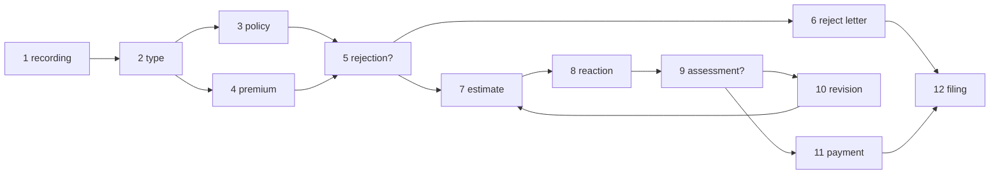
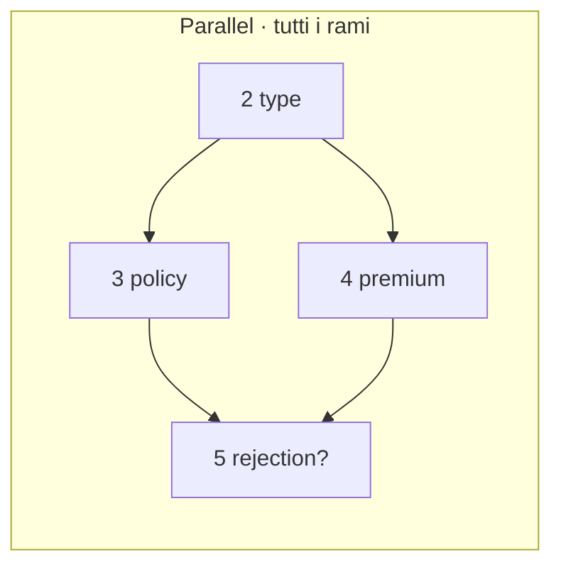
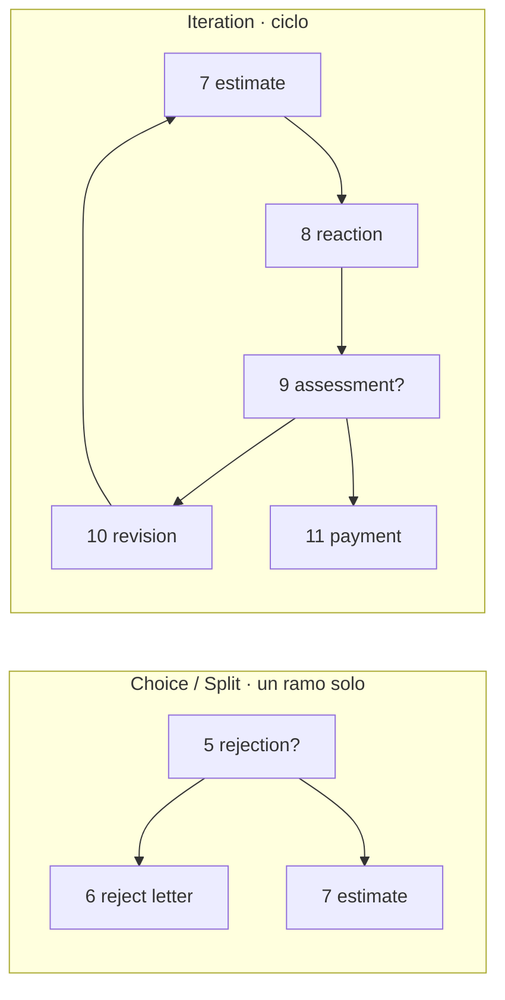
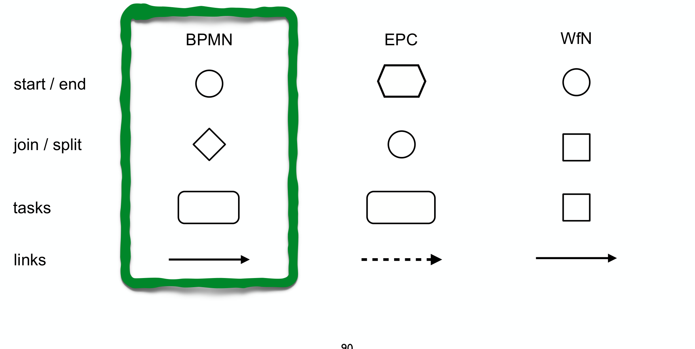

---
tags:
  - università/business-process-modeling
  - visual-notation
  - workflow-patterns
  - bpmn
data: 2026-07-03
lezione: "03 — Visual Notation"
corso: "MPB (6 cfu, 295AA)"
professore: "Roberto Bruni"
fonte: "Weske, *Business Process Management*, Ch.3 · van der Aalst, *Workflow Management*, Sect.1.3"
---

# Visual Notation

Nella lezione precedente ([[02 - Business Processes]]) abbiamo chiuso dicendo che i processi si rappresentano bene con **nodi e frecce**. Questa lezione mette alla prova quell'idea e ne scopre il limite: un grafo "ingenuo" di soli nodi e frecce è **ambiguo**, perché non sa distinguere il "fare più cose insieme" dal "scegliere una cosa sola". Vedremo prima *perché* nasce l'ambiguità, poi come la si risolve arricchendo il grafo con simboli precisi (i **gateway**), e infine daremo un primo sguardo ai tre standard che studieremo nel corso: **BPMN, EPC e Workflow nets**.

---

## Cosa modelliamo: processo, modello, istanza

Prima di disegnare qualcosa, dobbiamo essere precisi su *cosa* stiamo disegnando. Partiamo dalla definizione di riferimento.

> [!definition] Business process (Weske)
>
> Un **insieme di attività** eseguite in coordinamento in un ambiente organizzativo e tecnico, che realizzano **congiuntamente un obiettivo di business**. Ogni business process è **messo in atto  da una singola organizzazione**, ma può interagire con processi di altre organizzazioni.

Da questa definizione nascono due punti di vista che ci accompagneranno per tutto il corso, e che è bene distinguere fin da subito. Quando guardiamo *dentro* una singola organizzazione, e ci interessa come essa coordina le proprie attività, parliamo di **orchestration**. Quando invece guardiamo *l'interazione* tra processi di organizzazioni diverse, parliamo di **collaboration / choreography**. La stessa realtà, insomma, si osserva o dall'interno di un attore o dallo spazio tra più attori.

C'è poi una distinzione ancora più fondamentale, che è la stessa che in programmazione separa una *classe* da un *oggetto*: quella tra lo schema astratto e il caso concreto.

> [!definition] Model vs Instance (Weske)
>
> - Un **business process model** è un insieme di **activity model** con i **vincoli di esecuzione** tra di essi. È lo schema astratto, il *blueprint* (progetto) del processo.
> - Una **business process instance** è un **caso concreto** nell'operatività dell'azienda, composto da **activity instance**. È una singola esecuzione reale di quello schema.

Il rapporto tra i due è di uno-a-molti: un solo model fa da blueprint per un'infinità di istanze. Così come un activity model (per esempio "Enter credit request") genera molte activity instance concrete ("Enter credit request per r017, Miller, 10000", "per r018, Brown, 15500", e così via), allo stesso modo un process model genera molte process instance, una per ciascun caso trattato.

> [!note] Una convenzione che useremo sempre
>
> Quando non c'è rischio di confusione, diremo semplicemente "**activity**" per intendere sia l'activity model (il task astratto) sia l'activity instance (la sua esecuzione). Allo stesso modo "**process**" indicherà indifferentemente il model o l'istanza. Il contesto chiarisce di quale dei due si parla.

---

## Le domande che guidano la modellazione

Modellare un processo, in pratica, significa rispondere a una manciata di domande ricorrenti. Ognuna mette a fuoco una diversa dimensione del processo, e insieme coprono tutto ciò che serve descrivere.

- **Who is the customer?** Ogni processo **inizia e finisce con un customer**, che richiede un prodotto e ne riceve il risultato. Attenzione: il customer può anche essere **interno** all'azienda, per esempio un altro dipartimento.
- **Who is the owner?** A ogni processo è assegnato un **process owner**, responsabile del fatto che le istanze si svolgano correttamente, che gli obiettivi di business siano raggiunti e che le performance siano misurate e migliorate.
- **Which tasks?** Sono l'insieme di attività necessarie a raggiungere l'obiettivo. Possono essere descritte a **diversi livelli di granularità**: ogni unità di lavoro è vista come un'azione atomica, eventualmente con una durata e un costo.
- **Which dependencies?** Sono i **vincoli di esecuzione** che ordinano le attività in modo da usare bene le risorse. Riguardano la distribuzione nel **tempo**.
- **Which roles?** Ogni task può richiedere abilità specifiche, cioè **ruoli**. Riguardano la distribuzione nello **spazio** (chi, dove).

Rispondere a queste domande vuol dire passare da **descrizioni testuali informali** (i requisiti scritti a parole) a una **notazione grafica** precisa. Il guadagno è nella comunicazione: un modello esplicito e disegnato permette a stakeholder diversi di parlarsi con efficienza, raffinare i processi e migliorarli. È proprio per organizzare tutto questo che esiste una disciplina dedicata.

> [!definition] BPM e BPMS (Weske)
>
> - Il **Business Process Management (BPM)** è l'insieme di concetti, metodi e tecniche per supportare **design, amministrazione, configurazione, enactment e analisi** dei processi. Presuppone una rappresentazione **esplicita** di processi, task e vincoli.
> - Un **Business Process Management System (BPMS)** è un sistema software generico, **guidato da rappresentazioni esplicite** del processo, che coordina l'enactment delle sue istanze. I modelli sono l'**artefatto principale** con cui si implementano i processi — implementazione che può avvenire tramite regole organizzative oppure, appunto, tramite un software.

---

## Tre livelli di rappresentazione

Uno stesso processo può essere rappresentato a tre livelli diversi, a seconda di *chi* deve leggerlo. Non sono alternative in competizione, ma tre viste della stessa cosa.

| Livello | Per chi | Esempi |
|---|---|---|
| **Visual representations** (diagrammi, chart) | *what we see* — gli umani | notazioni informali e intuitive: BPMN, EPC, BPEL |
| **Languages** (sintassi macchina non ambigua) | *what machines see* — i calcolatori | dialetti di processo, schemi XML |
| **Models** (semantica rigorosa) | *what we analyse* — gli scienziati | automi, **Petri nets**, **workflow nets** |

Il livello grafico e quello linguistico sono **due facce della stessa medaglia**: quando disegniamo un modello, dietro le quinte esiste una descrizione testuale equivalente che la macchina può elaborare. Un modello BPMN, per esempio, ha sempre una controparte in un file XML con estensione `.bpmn`.

> [!example] Lo stesso processo, disegnato e scritto
>
> Un processo elementare *Start → Run → End* corrisponde a questo frammento XML, dove ritroviamo l'evento iniziale, il task "Run", l'evento finale e i flussi che li collegano:
> ```xml
> <bpmn:process id="Process_0pjif87">
>   <bpmn:startEvent id="StartEvent_1">
>     <bpmn:outgoing>Flow_0u05dpy</bpmn:outgoing>
>   </bpmn:startEvent>
>   <bpmn:task id="Activity_11zhm01" name="Run">
>     <bpmn:incoming>Flow_0u05dpy</bpmn:incoming>
>     <bpmn:outgoing>Flow_17t5zjm</bpmn:outgoing>
>   </bpmn:task>
>   <bpmn:sequenceFlow id="Flow_0u05dpy" sourceRef="StartEvent_1" targetRef="Activity_11zhm01"/>
>   <bpmn:endEvent id="Event_1t0u7im">
>     <bpmn:incoming>Flow_17t5zjm</bpmn:incoming>
>   </bpmn:endEvent>
>   <bpmn:sequenceFlow id="Flow_17t5zjm" sourceRef="Activity_11zhm01" targetRef="Event_1t0u7im"/>
> </bpmn:process>
> ```

Il terzo livello, quello dei **Models** (Petri nets, workflow nets), è invece ciò che ci darà una **semantica formale** su cui fare analisi automatica: è il filo che tiene insieme il resto del corso, a partire dalla lezione sui [[04 - Petri Nets|Petri net]].

---

## L'esempio guida: la richiesta di risarcimento assicurativo

Tutta la lezione ruota attorno a un unico esempio concreto, un processo di **insurance claim** (una richiesta di risarcimento a un'assicurazione), semplificato in 12 passi. Conviene leggerli come una storia: arriva una richiesta, la si esamina, si decide se pagarla o rifiutarla, si gestisce l'eventuale contestazione del cliente, si chiude.

1. **recording** — si registra la ricezione della richiesta;
2. **type** — si stabilisce di che tipo di richiesta si tratta;
3. **policy** — si verifica che la polizza del cliente copra il danno;
4. **premium** — si verifica che il premio sia in regola (pagamenti aggiornati?);
5. **rejection?** — si decide se rifiutare o ammettere;
6. **reject letter** — se il passo 3 *oppure* il 4 danno esito negativo, si produce una lettera di rifiuto, poi si va al passo 12;
7. **estimate** — se il 3 *e* il 4 sono entrambi positivi, si invia la stima dell'importo da pagare;
8. **reaction** — si registra la reazione del cliente;
9. **assessment?** — si valuta l'eventuale obiezione del cliente;
10. **revision** — se il passo 9 è negativo, si decide di rivedere il passo 7;
11. **payment** — se il passo 9 è positivo, si paga il risarcimento;
12. **filing** — si archivia e si chiude la pratica.

Se colleghiamo questi task con semplici frecce di dipendenza, otteniamo un primo grafo, leggibile ma — come stiamo per vedere — insidioso:



---

## I pattern di flusso (workflow patterns)

Prima di affrontare l'ambiguità, isoliamo i **mattoni ricorrenti** con cui è costruito questo (e qualunque) processo. Sono i pattern di control-flow, e li ritroviamo un po' ovunque.

- **Sequence** — un task segue semplicemente l'altro: prima `1 recording`, poi `2 type`.
- **Parallel** — dopo un task se ne attivano più d'uno, da svolgere *tutti* (è la concorrenza).
- **Choice / Split** — dopo un task se ne sceglie *uno solo* tra più alternative.
- **Merge** — più rami confluiscono di nuovo in un unico task.
- **Iteration** — un ciclo che ripete una porzione di processo (nel nostro esempio: estimate → reaction → assessment → revision → di nuovo estimate).

I due pattern più delicati, che stanno al cuore dell'ambiguità, sono il parallelismo e la scelta. Ecco come si presentano sul nostro esempio:





---

## Il problema dell'ambiguità

Ed eccoci al punto cruciale. Guardando i due diagrammi qui sopra ci accorgiamo di un fatto imbarazzante: **hanno la stessa forma grafica**. Sia il parallelismo (dopo il task 2 partono 3 e 4) sia la scelta (dopo il task 5 partono 6 o 7) si disegnano allo stesso modo — un nodo da cui escono due frecce. Ma il significato è opposto! Nel primo caso vanno fatti *entrambi*, nel secondo *uno solo*. Con soli nodi e frecce, quindi, restano aperte domande a cui il disegno non sa rispondere:

- Dopo il task 2, i task 3 e 4 vanno eseguiti **entrambi** (sempre), o se ne sceglie uno?
- Prima del task 5, bisogna aspettare che *entrambi* 3 e 4 siano finiti?
- Dopo il task 5, i task 6 e 7 sono **alternativi** (uno solo) o possono avvenire tutti e due?

> [!warning] Nodi e frecce non bastano
>
> Un grafo di sole dipendenze è intrinsecamente ambiguo nei punti di **split** (dove il flusso si dirama) e di **join** (dove si ricongiunge): non dice se il comportamento è **AND** (tutti i rami) o **XOR** (un ramo solo). La forma grafica è identica, il significato no. Servono simboli dedicati che rendano esplicita la differenza.

---

## Disambiguazione con i gateway split/join

La soluzione è annotare ogni punto di split e join con un **gateway** che ne dichiari la natura. In questo corso, seguendo le slide, ne usiamo due tipi, distinti anche per colore.

> [!definition] I due gateway
>
> - **`+` Parallel split / join** (concorrenza, AND — in *verde*): come split, attiva **tutti** i rami uscenti; come join, aspetta il completamento di **tutti** i rami entranti prima di proseguire.
> - **`✕` Choice split / join** (scelta, XOR — in *rosso*): come split, attiva **esattamente un** ramo uscente; come join, prosegue non appena **uno** dei rami entranti arriva.

Applicando questi gateway al nostro insurance claim, ogni diramazione acquista un significato preciso e il modello diventa **non ambiguo**:


*Fig. — Il modello disambiguato. Subito dopo `2 type` un gateway `+` (verde) apre in parallelo `3 policy` e `4 premium`, che un secondo `+` ricongiunge prima di `5 rejection?`. Da lì in avanti i gateway `✕` (rossi) gestiscono le scelte mutuamente esclusive: rifiuto o stima, e poi il ciclo di revisione e la chiusura. Verde = AND (tutti i rami), rosso = XOR (un ramo solo).*

Ora la lettura è univoca: i controlli su polizza e premio (3 e 4) avvengono **sempre entrambi**, perché sono racchiusi tra gateway `+`; mentre rifiuto/stima e gli esiti successivi sono **mutuamente esclusivi**, perché governati da gateway `✕`. L'ambiguità è sparita.

---

## Gli "ingredienti" di una notazione

Facciamo un passo indietro e chiediamoci: cosa deve saper esprimere, in generale, una notazione per processi? Progettarne una significa scegliere una forma grafica per ciascuno di un insieme fisso di concetti. Averli in mente aiuta a capire perché i vari standard fanno scelte diverse ma coprono le stesse esigenze.

- **start / end** — l'inizio e la fine del processo;
- **tasks** — le unità di lavoro;
- **join & split: concurrency** — i gateway paralleli (il nostro `+`);
- **join & split: internal decisions** — le scelte decise *dentro* il processo (il nostro `✕`);
- **split: external decisions** — le scelte determinate da un evento *esterno* (per esempio la reazione del cliente, che il processo non controlla);
- **links** — le dipendenze **causali e temporali** (le frecce, eventualmente di tipi diversi);

e, a un livello più avanzato, anche **responsibility** (di chi è l'intero processo o il singolo task), **information** (dati, parametri) e **platform** (binding, servizi, porte). La scelta concreta dei simboli è in fondo arbitraria, purché resti **coerente e non ambigua**: ed è esattamente ciò che i tre standard fanno, ciascuno a modo suo.

---

## Uno sguardo agli standard: BPMN, EPC, WfN

Gli stessi ingredienti vengono resi con simboli diversi nelle tre notazioni che studieremo. Confrontarli fianco a fianco mostra che parlano tutti delle stesse cose, con "alfabeti" differenti.


*Fig. — Confronto dei simboli. **BPMN** usa il cerchio per start/end, il rombo per i gateway, il rettangolo arrotondato per i task. **EPC** usa l'esagono per gli eventi di start/end, il cerchio per i connettori, il rettangolo per le funzioni. **Workflow nets** usano il cerchio per i place, il quadrato per le transizioni/task e frecce per i link — è la notazione formale dei Petri net.*

- **BPMN** (Business Process Model and Notation) è lo standard industriale, ricco e intuitivo.
- **EPC** (Event-driven Process Chain) alterna eventi e funzioni lungo la catena.
- **WfN** (Workflow nets) è la variante formale dei [[04 - Petri Nets|Petri net]], quella su cui poggerà l'**analisi** rigorosa dei processi.

Il resto del corso approfondirà proprio questi formalismi, partendo dai **Petri net** come base semantica: il livello dei *Models* che ci permetterà finalmente di *analizzare* un processo, e non solo di disegnarlo. → [[04 - Petri Nets]]
