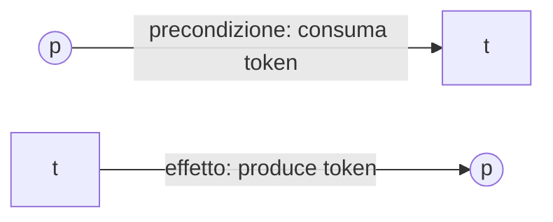
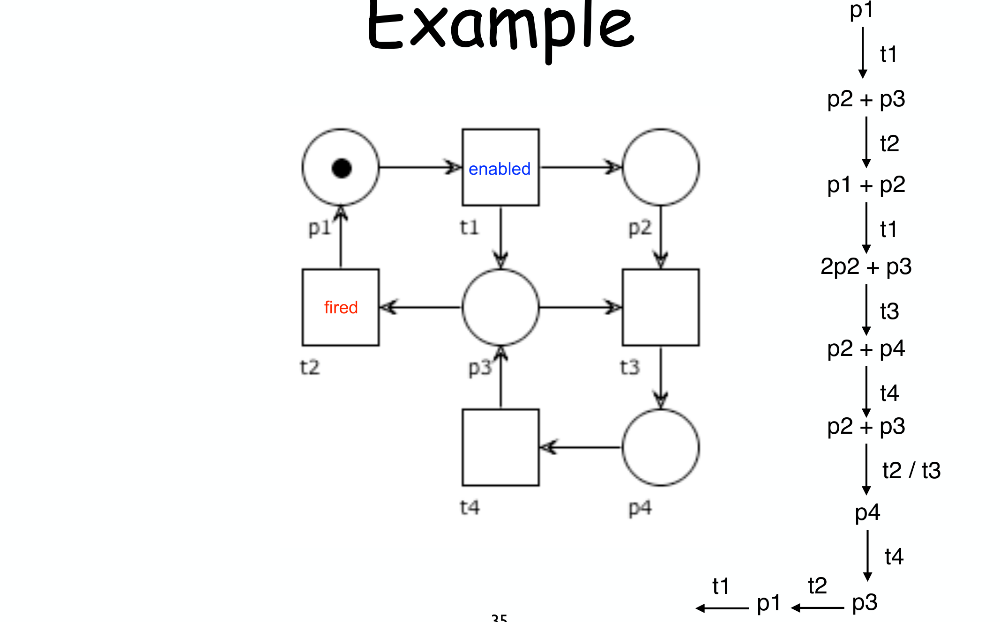
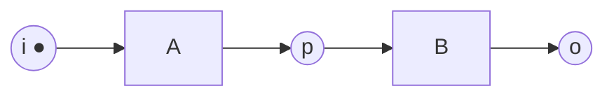
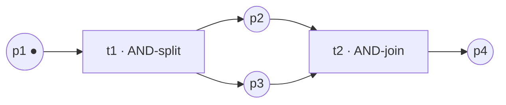
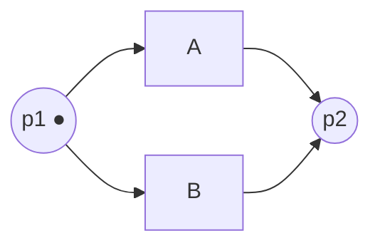
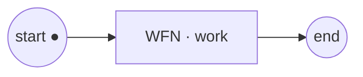
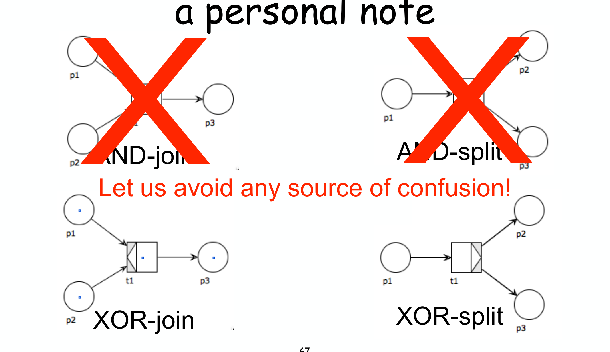
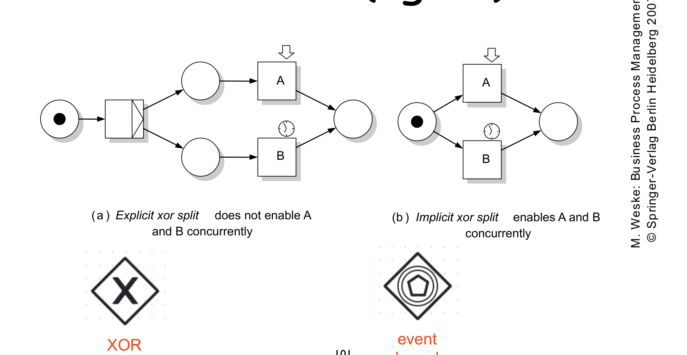
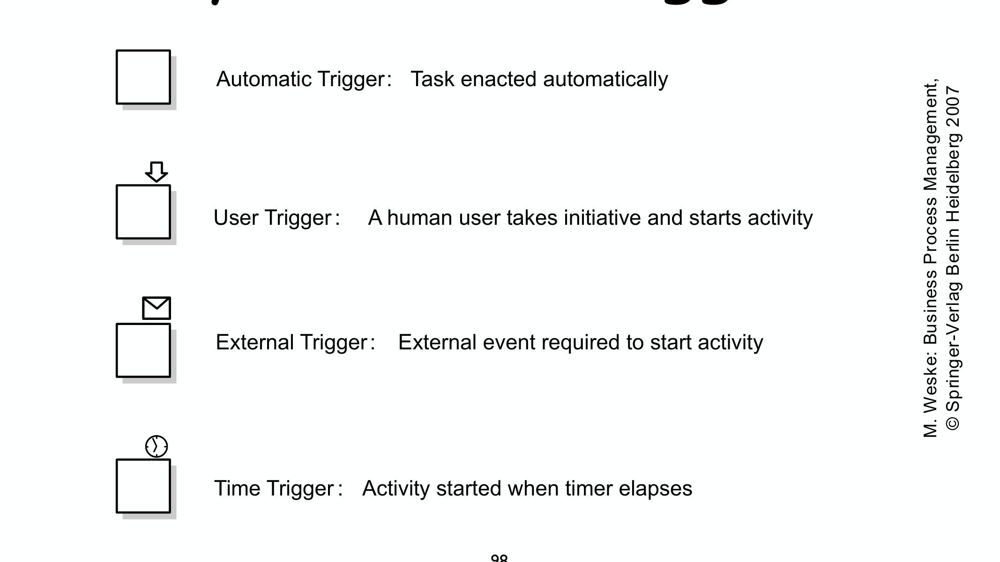

---
tags:
  - università/business-process-modeling
  - petri-nets
  - workflow-nets
  - formal-semantics
data: 2026-07-03
lezione: "04 — Petri Nets (basics)"
corso: "MPB (6 cfu, 295AA)"
professore: "Roberto Bruni"
fonte: "Weske, *Business Process Management*, Ch.4.4"
---

# Petri Nets

Nella lezione precedente ([[03 - Visual Notation]]) abbiamo scoperto un problema serio: un grafo fatto di soli nodi e frecce è **ambiguo**. Guardando le frecce non riusciamo a dire se, dopo un certo passo, due attività vanno svolte *entrambe* (in parallelo) oppure se ne va scelta *una sola*. Avevamo tamponato il problema aggiungendo dei gateway `+` e `✕`, ma quei simboli erano solo una convenzione grafica, senza una vera regola matematica dietro.

I **Petri net** risolvono il problema alla radice. Invece di aggiungere decorazioni a un grafo, cambiano proprio il *tipo* di grafo: ne usano uno in cui la distinzione tra "fare entrambi" e "scegliere uno" **emerge automaticamente dalla struttura**, senza bisogno di simboli speciali. In più forniscono una **semantica formale**, cioè una regola precisa e meccanica che dice, passo dopo passo, come il processo evolve. Questo ha due conseguenze importanti:

- **Formale** significa che il comportamento di ogni istanza del processo diventa *non ambiguo*: dato lo stato attuale, le mosse possibili sono determinate da una regola, non dall'interpretazione di chi legge.
- **Astratto** significa che ci concentriamo solo sulla logica del processo, ignorando l'ambiente di esecuzione (chi esegue, su quale macchina, con quali dati concreti). È il principio di *separation of concerns*: un problema alla volta.

Furono introdotti da **Carl Adam Petri** (1926–2010) nella sua tesi di dottorato del **1962**. Il loro successo, che dagli anni '60 li ha portati fino a essere applicati oggi in moltissimi campi, si deve a una rappresentazione grafica e concettuale tanto semplice quanto potente. Per noi saranno la **base semantica** su cui costruiremo tutta l'analisi dei processi nel resto del corso.

---

## Gli elementi di base

Un Petri net è un grafo di tipo particolare, detto **bipartito**: ha due tipi di nodi diversi che si alternano sempre, e non si collegano mai due nodi dello stesso tipo. I due tipi di nodo sono i **place** e le **transition**; sopra di essi si muovono i **token**. Prima di dare le definizioni precise, conviene capire *a cosa servono* con un'immagine mentale.

Pensiamo a un processo come a qualcosa che scorre attraverso una serie di **condizioni** (stati in cui il processo si può trovare) e di **eventi** (cose che accadono e fanno passare il processo da una condizione all'altra). Nei Petri net:

- le **condizioni** sono i **place** (i cerchi): rappresentano *dove si trova* il processo, cioè uno stato in attesa che qualcosa accada;
- gli **eventi** sono le **transition** (i quadrati): rappresentano *qualcosa che succede*, un'azione che trasforma lo stato;
- ciò che effettivamente *scorre* e segnala in quale condizione siamo sono i **token** (i pallini dentro i cerchi).

> [!definition] Transition (i quadrati)
>
> Una **transition** rappresenta *qualcosa che accade*: un'operazione, un calcolo, una valutazione, una trasformazione, una spedizione, un task, un'attività, una decisione. È la parte "attiva" della rete: quando una transition scatta, lo stato del processo cambia.

> [!definition] Place (i cerchi)
>
> Un **place** rappresenta una *condizione* o uno *stato* in cui il processo si può trovare: uno stato di attesa, un medium, un buffer, una condizione da soddisfare, un deposito di risorse, un tipo, una locazione di memoria. È la parte "passiva": da solo non fa nulla, ma **contiene i token** e così registra la situazione corrente.

> [!definition] Token (i pallini)
>
> Un **token** è ciò che *popola* un place e indica che quella condizione è soddisfatta. A seconda di cosa stiamo modellando, un token può rappresentare un oggetto fisico, un dato, un record, una risorsa disponibile, una marca di attivazione, un messaggio, un documento, un **caso** in lavorazione, un valore. La distribuzione dei token nei place (la **marcatura**) è lo *stato* del sistema in un dato istante.

> [!tip] L'analogia utile
>
> Immaginiamo un ambulatorio: un **place** è la sala d'attesa (una condizione: "paziente in attesa di visita"), una **transition** è la visita medica (l'evento che accade), il **token** è il paziente che occupa la sala. Finché c'è un paziente in sala (token nel place), la visita *può* avvenire; quando avviene (la transition scatta), il paziente lascia la sala e passa alla condizione successiva.

### Gli archi: come si collegano place e transition

I nodi sono collegati da **archi** orientati. La regola fondamentale è che un arco unisce **sempre** un place a una transition o viceversa, **mai** due nodi dello stesso tipo. Questa alternanza obbligata è ciò che rende la rete bipartita, ed è anche ciò che dà significato agli archi: un arco descrive sempre un rapporto tra una *condizione* e un *evento*.

> [!definition] Arc
>
> Un **arc** rappresenta una **dipendenza**, e ha due sole forme possibili:
> - **da un place $p$ a una transition $t$** ($p \to t$): significa che, per poter scattare, $t$ ha bisogno di un token in $p$; quando $t$ scatta, quel token viene **consumato**. Il place è quindi una *precondizione* dell'evento.
> - **da una transition $t$ a un place $p$** ($t \to p$): significa che lo scatto di $t$ **produce** un token in $p$. Il place è quindi un *effetto* dell'evento.

> [!warning] Archi vietati
>
> Non esistono archi **place → place** né **transition → transition**. Due condizioni non si collegano direttamente (serve sempre un evento in mezzo), e due eventi nemmeno (serve sempre una condizione in mezzo). Se disegnando una rete vi trovate un arco tra due cerchi o tra due quadrati, la rete **non è valida**.

*Fig. — A sinistra un place che fa da precondizione a una transition; a destra una transition che produce un token in un place.*

---

## La definizione formale

Ora che l'intuizione è chiara, possiamo scrivere la definizione precisa. Una rete è completamente descritta dicendo quali sono i suoi place, quali le sue transition, come sono collegati e da quale configurazione di token si parte.

> [!definition] Petri net
>
> Una **Petri net** è una tupla $(P, T, F, M_0)$ dove:
> - $P$ è un insieme **finito** di **place**;
> - $T$ è un insieme **finito** di **transition**, disgiunto dai place: $P \cap T = \varnothing$ (nessun nodo è insieme place e transition);
> - $F \subseteq (P \times T) \cup (T \times P)$ è la **flow relation**, cioè l'insieme degli archi: ogni arco è una coppia place–transition o transition–place, mai place–place o transition–transition (è qui che si formalizza la bipartizione);
> - $M_0$ è l'**initial marking**: la configurazione iniziale dei token, cioè quanti token stanno in ciascun place all'inizio.

Una volta fissata la struttura, ci serve un modo compatto per parlare del "vicinato" di un nodo, perché la regola di evoluzione dipenderà proprio da chi sta immediatamente prima e dopo. Introduciamo perciò il **pre-set** e il **post-set**.

> [!definition] Pre-set e post-set
>
> Dato una transition $t$:
> - il **pre-set** $\bullet t = \{\, p \mid (p,t) \in F \,\}$ è l'insieme degli **input place** di $t$, cioè tutti i place da cui parte una freccia verso $t$. Sono le condizioni che devono essere soddisfatte (avere un token) perché $t$ possa scattare.
> - il **post-set** $t \bullet = \{\, p \mid (t,p) \in F \,\}$ è l'insieme degli **output place** di $t$, cioè i place in cui $t$ deposita un token quando scatta. Sono gli effetti dell'evento.
>
> La stessa notazione si usa per un place $p$: $\bullet p$ sono le transition che *producono* token in $p$ (da dove i token possono arrivare), e $p \bullet$ sono le transition che *consumano* token da $p$ (dove i token possono andare a finire).
>
> In generale, per qualunque nodo $x$: $\;\bullet x = \{ y \mid (y,x) \in F \}\;$ (i predecessori) e $\;x\bullet = \{ y \mid (x,y) \in F \}\;$ (i successori).

Il punto da ricordare è questo: il **pre-set di una transition dice cosa le serve per scattare**, il **post-set dice cosa produce**. Con questi due insiemi possiamo enunciare la regola che governa tutta la dinamica.

---

## Il token game: come "gira" una rete

La rete disegnata è statica, ma il suo *comportamento* nasce dal movimento dei token, regolato da un'unica regola chiamata scherzosamente **token game** (il "gioco dei gettoni"). Tutto ruota attorno a due concetti: quando una transition è **enabled** (può scattare) e cosa succede quando **fires** (scatta).

> [!definition] Enabling e firing
>
> - Una transition $t$ è **enabled** (abilitata) quando **ciascuno** dei suoi input place $\bullet t$ contiene **almeno un token**. Cioè: tutte le precondizioni di $t$ sono soddisfatte contemporaneamente.
> - Una transition enabled può **fire** (scattare). Quando lo fa, in un colpo solo: **consuma** un token da *ciascuno* dei suoi input place e **produce** un token in *ciascuno* dei suoi output place.

Vale la pena soffermarsi su alcune proprietà di questa regola, perché sono la sorgente di quasi tutte le sottigliezze che vedremo.

> [!note] Tre proprietà cruciali dello scatto
>
> - **Atomicità**: lo scatto è un'azione indivisibile. Non esiste uno stato intermedio "a metà scatto"; o è avvenuto tutto (consumati gli input, prodotti gli output) o niente.
> - **Semantica interleaving**: in un dato momento più transition possono essere abilitate insieme, ma **ne scatta una sola per volta**. Non modelliamo il "veramente simultaneo": la concorrenza è resa come un intreccio (interleaving) di scatti presi uno alla volta, in ordine qualsiasi.
> - **Il numero di token può cambiare**: la rete è fissa, ma la quantità totale di token *non* si conserva. Se una transition ha più output place che input place (tipico dell'AND-split) crea token; se ne ha meno, li distrugge. Quindi lo stato del sistema evolve davvero, non si limita a spostare gli stessi gettoni.

### Un esempio passo per passo

Prendiamo una rete piccola per vedere la regola in azione. Supponiamo la sequenza: un place $p1$ con un token, seguito da una transition $t1$, che porta a un place $p2$, seguito da una transition $t2$, che porta a $p3$.

- **Stato iniziale**: token in $p1$. La transition $t1$ ha come unico input place $p1$, che contiene un token: quindi $t1$ è **enabled**. $t2$ invece non lo è, perché il suo input $p2$ è vuoto.
- **Scatta $t1$**: consuma il token da $p1$ e ne produce uno in $p2$. Nuovo stato: token in $p2$. Ora $t1$ non è più abilitata (p1 è vuoto) mentre $t2$ lo è diventata.
- **Scatta $t2$**: consuma da $p2$, produce in $p3$. Stato finale: token in $p3$. Nessuna transition è più abilitata: il processo si è fermato.

Nell'esempio delle slide la rete è un po' più ricca e mostra due fenomeni in più: la **creazione di token** (una transition apre due rami e quindi si passa, ad esempio, da un token in $p1$ a due token distribuiti in $p2$ e $p3$) e il **non-determinismo** (quando in uno stato sono abilitate più transition, come indicato da `t2 / t3`, il gioco può proseguire in modi diversi, e ciascuna scelta porta a una storia diversa).

*Fig. — Token game. Una **marcatura** si scrive come somma formale dei token nei place: per esempio `2p2 + p3` significa due token in p2 e uno in p3. A ogni passo la transition abilitata (enabled) scatta (fired) e si passa alla marcatura successiva. Dove compaiono più transition abilitate insieme (`t2 / t3`) la scelta di quale far scattare è non-deterministica, e apre rami di evoluzione differenti.*

---

## Costruire i pattern di flusso con place e transition

Il punto di forza dei Petri net, promesso all'inizio, è che i costrutti di control-flow (sequenza, parallelismo, scelta) **non richiedono simboli speciali**: nascono dal semplice modo in cui si dispongono place e transition. Vediamo come, ricordando la convenzione grafica: **cerchio = place, quadrato = transition, ● = token**.

**Sequenza.** Per dire "$B$ dopo $A$" basta mettere un place tra le due transition: $A$ produce un token in quel place, che diventa la precondizione di $B$. L'ordine è forzato perché $B$ non può scattare finché $A$ non ha prodotto il suo token.

**Parallelismo (AND-split e AND-join).** Se una **transition** ha *più output place*, quando scatta mette un token in *tutti* contemporaneamente: ha aperto più rami che procederanno in parallelo (AND-split). Simmetricamente, una transition con *più input place* può scattare solo quando *tutti* quei place hanno un token: aspetta il completamento di tutti i rami prima di proseguire (AND-join). Nell'esempio, $t1$ apre i due rami $p2$ e $p3$, e $t2$ li richiude aspettandoli entrambi.

**Scelta (XOR-split e XOR-join).** Qui è un **place** ad avere *più transition uscenti*: il suo unico token può abilitare più transition, ma appena una scatta consuma il token e le altre non sono più abilitate. Si esegue quindi *una sola* alternativa (XOR-split). Simmetricamente, un place con *più transition entranti* raccoglie rami alternativi in un unico punto (XOR-join). Nell'esempio, dal place $p1$ si può eseguire $A$ *oppure* $B$, ma non entrambi.

> [!tip] La regola d'oro: guarda che tipo di nodo si dirama
>
> Tutta la differenza tra concorrenza e scelta sta in **quale nodo** si trova nel punto di diramazione:
> - se a diramarsi è una **transition** (un evento), i rami sono in **AND** → *concorrenza*: tutti vengono attivati/attesi;
> - se a diramarsi è un **place** (una condizione con un token conteso), i rami sono in **XOR** → *scelta*: solo uno vince il token.
>
> Non serve nessun simbolo aggiuntivo: la semantica è già scritta nella struttura. È esattamente ciò che mancava ai gateway ambigui di [[03 - Visual Notation]].

Esiste anche l'**OR-split** (attiva "uno o più" rami, non necessariamente tutti né esattamente uno), ma non è un costrutto elementare: si ottiene combinando AND e XOR, e lo tratteremo più avanti.

---

## Workflow nets (WFN): Petri net su misura per i processi

I Petri net generici sono uno strumento potente ma *troppo libero* per modellare un processo di business. Un processo ha caratteristiche precise che un Petri net qualsiasi non garantisce: comincia in un punto ben definito, finisce in un punto ben definito, e ogni sua parte deve avere un senso all'interno di quel percorso dall'inizio alla fine. I **workflow net** (WFN) sono Petri net a cui imponiamo esattamente queste restrizioni.

L'idea di fondo, prima ancora della definizione, è semplice: un processo ha un punto di **start**, dove entra un caso da lavorare; un blocco di **work**, cioè tutta la logica interna; e un punto di **end**, dove il caso esce concluso.

*Fig. — Un token nel place di start rappresenta un'istanza del processo non ancora avviata; quando quel token raggiunge il place di end, il caso è concluso.*

> [!definition] Workflow net
>
> Un Petri net $(P, T, F)$ è un **workflow net** se soddisfa tre condizioni:
> 1. esiste un place iniziale distinto $i \in P$ **senza archi entranti** ($\bullet i = \varnothing$): è l'unico punto d'ingresso;
> 2. esiste un place finale distinto $o \in P$ **senza archi uscenti** ($o \bullet = \varnothing$): è l'unico punto d'uscita;
> 3. **ogni** altro place e transition si trova su almeno un **cammino da $i$ a $o$**.

Ognuna delle tre condizioni ha un significato concreto in termini di processo, che vale la pena esplicitare per capire *perché* le imponiamo.

> [!note] Perché proprio queste tre condizioni
>
> 1. Un token nel place iniziale $i$ rappresenta **un'istanza del processo che è stata creata ma non ancora avviata**. Volere un unico $i$ significa volere un unico modo di "far entrare" un caso.
> 2. Un token nel place finale $o$ rappresenta **un caso ormai concluso**. Un unico $o$ significa un unico modo di "considerare finito" il processo.
> 3. Chiedere che ogni nodo stia su un cammino $i \to o$ significa vietare **parti inutili**: niente attività irraggiungibili dall'inizio, niente condizioni da cui non si esce mai. Ogni pezzo della rete deve poter partecipare all'elaborazione di almeno un caso.

Da queste condizioni segue una proprietà strutturale importante, che useremo spesso.

> [!theorem] Unicità di source e sink
>
> In un workflow net, $i$ è **l'unico** nodo senza archi entranti e $o$ è **l'unico** nodo senza archi uscenti.
>
> *Dimostrazione (per $i$).* Supponiamo per assurdo che esista un altro nodo $v \neq i$ con $\bullet v = \varnothing$ (nessun arco entrante). Per la condizione 3, $v$ deve comparire in un cammino da $i$ a $o$. Ma un nodo senza archi entranti non può avere nulla che lo preceda in un cammino: potrebbe stare solo come *primo* nodo del cammino. Il primo nodo di ogni cammino, però, è $i$. Quindi $v = i$, contro l'ipotesi. La dimostrazione per $o$ è del tutto analoga, scambiando "entrante" con "uscente" e "primo" con "ultimo". $\blacksquare$

> [!tip] Come si riconosce (o si scarta) un workflow net
>
> In pratica, per stabilire se una rete è un WFN si controllano i tre requisiti. Le violazioni tipiche sono:
> - **manca un unico place iniziale**: ci sono più place senza archi entranti (più ingressi), oppure nessuno;
> - **c'è un nodo fuori da ogni cammino $i \to o$**: per esempio una transition $t$ che non è raggiungibile da $i$, oppure da cui non si arriva più a $o$ (un vicolo cieco).
>
> Se invece l'ingresso e l'uscita sono unici e ogni nodo sta su un cammino da $i$ a $o$, allora la rete **è** un workflow net.

### Comporre processi: la strutturazione gerarchica

Avere un unico ingresso e un'unica uscita porta un vantaggio pratico enorme: permette di **comporre** i processi in modo gerarchico. Poiché un WFN, visto da fuori, si comporta come una scatola con un ingresso e un'uscita — esattamente come una singola transition — possiamo **raffinare una transition sostituendola con un intero workflow net**. Quella transition, che nel modello di alto livello era un'attività atomica, diventa così un *sotto-processo* con la sua logica interna. Ripetendo il procedimento si costruiscono processi complessi per livelli successivi di dettaglio, tenendo ogni livello leggibile.

---

## Syntax sugar: le decorazioni (e perché diffidarne)

Alcuni tool di modellazione, per far risparmiare spazio, permettono di "decorare" i punti di split e join con simboli sintetici (AND-split, AND-join, XOR-split, XOR-join) invece di disegnare per esteso la sotto-rete di place e transition. È **zucchero sintattico** (syntax sugar): una scorciatoia grafica che *sta per* una struttura più estesa. Comodo, ma il professore mette in guardia con una nota personale esplicita.

*Fig. — "Let us avoid any source of confusion!": le decorazioni di AND vengono barrate perché ridondanti, mentre quelle di XOR restano ma con l'avvertenza che vanno usate con cautela.*

I problemi che rendono queste decorazioni infide sono tre, e conviene tenerli a mente perché toccano proprio la distinzione AND/XOR che abbiamo appena imparato a leggere dalla struttura:

> [!warning] Perché le decorazioni ingannano
>
> - **Sono graficamente troppo simili**: i simboli di AND e di XOR si assomigliano, e confonderli significa scambiare la concorrenza con la scelta — un errore semantico grave.
> - **Cambiano significato a seconda di dove sono poste**: lo stesso simbolo posto su una transition o su un place vuol dire cose diverse (split contro join), quindi la posizione conta quanto il disegno.
> - **Per l'AND sono ridondanti**: la semantica AND è *già* espressa dalla struttura (una transition che si dirama). Aggiungere una decorazione non porta informazione: appare solo per assomigliare ai gateway di BPMN. Meglio, allora, disegnare la rete esplicita e non lasciare spazio a fraintendimenti.

---

## Il catalogo dei pattern di control-flow

Combinando i tre mattoni di base (sequenza, AND, XOR) si ottengono i pattern ricorrenti con cui si costruisce qualunque processo. Vale la pena averli a catalogo, con la loro "ricetta" in termini di split e join:

- **Sequencing** — $B$ è eseguito dopo $A$; è il place intermedio a imporre l'ordine.
- **Parallelism** (AND-split + AND-join) — $A$ e $B$ vengono eseguiti **entrambi**, senza un ordine imposto tra loro; si aprono con un AND-split e si richiudono con un AND-join.
- **Explicit choice** (XOR-split + XOR-join) — si esegue $A$ **oppure** $B$, e la scelta è **esplicita**, cioè risolta da una transition prima che i rami partano.
- **Iteration** (XOR-join + XOR-split) — un ciclo: si ripete una porzione di processo **una o più volte** oppure **zero o più volte**, a seconda di dove si mettono join e split.
- **Mutual exclusion** — $A$ e $B$ **non possono** eseguire in concorrenza perché condividono un token/una risorsa: chi lo prende esclude l'altro.
- **Alternation** — $A$ e $B$ si eseguono **una volta ciascuno in alternanza** (prima $A$, poi $B$, poi di nuovo $A$...).

### Scelta esplicita vs implicita (deferred): il concetto chiave

Tra questi pattern ce n'è uno che merita attenzione particolare, perché tocca una domanda sottile: **chi** prende la decisione, e **quando**? La risposta distingue due tipi di scelta che sembrano uguali ma si comportano in modo diverso.

Nella **scelta esplicita**, esiste una transition il cui compito è proprio *decidere*: scatta lei, e con il suo scatto instrada il processo su un ramo piuttosto che sull'altro. La decisione avviene *dentro* il processo e *prima* che i task alternativi diventino disponibili. In termini di token: la transition decisionale consuma il token e lo mette nel place del ramo scelto, così solo quel ramo risulta poi abilitato.

Nella **scelta implicita** (o *deferred*, rimandata), invece, **nessuna transition decide**: sono i task alternativi stessi a competere. Tutti pescano dallo stesso place, quindi sono **abilitati insieme**; il primo che scatta consuma il token e taglia fuori gli altri. La decisione è quindi *rimandata* al momento dello scatto ed è tipicamente determinata da un **evento esterno** (event-based): parte il task per cui l'evento arriva prima. La differenza pratica è netta e si vede nel diagramma.

*Fig. — (a) **Explicit**: c'è una transition-decisione (XOR) che sceglie il ramo; A e B non sono mai abilitati contemporaneamente. (b) **Implicit / deferred**: il token nel place iniziale abilita **sia** A **sia** B nello stesso momento, e vince chi scatta per primo (event-based; in BPMN corrisponde al gateway a pentagono). Nei due casi la decisione è presa in momenti diversi del tempo.*

---

## Trigger: chi fa scattare una transition

Finora abbiamo descritto *quando* una transition può scattare (regola di enabling), ma non *chi* la fa scattare davvero. Nella realtà l'esecuzione dipende dall'**ambiente**: un'attività può partire da sola, oppure perché una persona la avvia, o perché arriva un messaggio, o perché scade un timer. I workflow net catturano questa informazione **decorando le transition con un trigger**, cioè annotando *chi o cosa* è responsabile dello scatto di quel task.

*Fig. — I simboli dei trigger (Weske).*

> [!definition] I quattro tipi di trigger
>
> - **Automatic trigger** (nessun simbolo): il task scatta **automaticamente** non appena è abilitato, senza bisogno di alcun intervento. È il caso di default.
> - **User trigger** (una freccia): serve l'**iniziativa di una persona**, che decide di avviare l'attività.
> - **External trigger** (una busta): serve un **evento esterno**, tipicamente la ricezione di un messaggio, perché l'attività parta.
> - **Time trigger** (un orologio): l'attività parte allo **scadere di un timer** (per esempio un time-out).
>
> Le transition prive di trigger sono, per convenzione, automatiche.

I trigger sono anche il legame naturale con la scelta implicita vista sopra: quando più task in *deferred choice* aspettano ciascuno un evento esterno diverso, è il primo trigger a scattare che risolve la competizione.

Con Petri net, workflow net, token game e la distinzione tra scelta esplicita e implicita abbiamo la **base formale** del corso. Su di essa costruiremo, nelle prossime lezioni, gli strumenti di analisi dei processi: raggiungibilità degli stati, liveness, soundness. → [[05 - Mining]]
