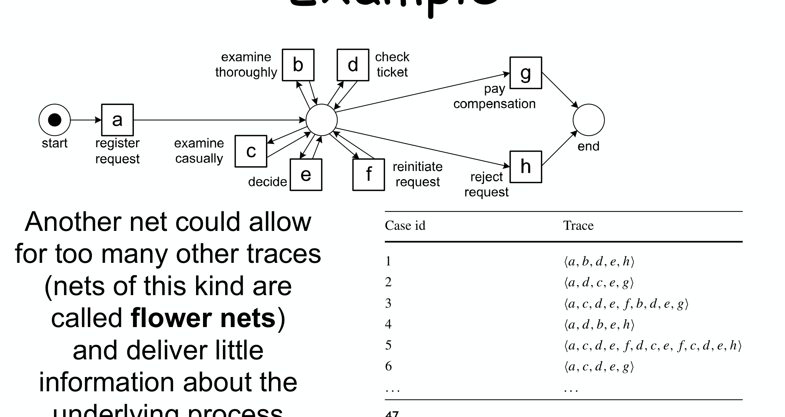

---
tags:
  - università/business-process-modeling
  - process-mining
  - alpha-algorithm
  - event-log
data: 2026-07-03
lezione: "05 — Process Mining"
corso: "MPB (6 cfu, 295AA)"
professore: "Roberto Bruni"
fonte: "van der Aalst, *Process Mining*, Ch.1 e 6"
---

# Process Mining

Fino a qui abbiamo imparato a *disegnare* un processo e a dargli una semantica formale con i [[04 - Petri Nets|Petri net]]. Ma da dove viene il modello? Finora l'abbiamo sempre supposto dato, disegnato a mano da un analista. Il **process mining** ribalta la prospettiva: invece di *progettare* il modello e poi confrontarlo con la realtà, parte dai **dati reali** — le tracce che i sistemi informatici lasciano mentre eseguono i processi — e da lì *scopre*, monitora e migliora il processo effettivo.

> [!definition] Process mining
>
> Una disciplina di ricerca relativamente giovane che si colloca **tra** il *machine learning / data mining* da un lato e il *process modeling / analysis* dall'altro. L'idea è **scoprire, monitorare e migliorare** i processi reali estraendo conoscenza dagli **event log** già disponibili nei sistemi odierni.

Il punto di forza è che non lavora su ciò che le persone *dicono* di fare, ma su ciò che il sistema *registra* essere stato fatto. È la differenza tra intervistare gli impiegati e leggere i log del gestionale.

---

## Lo schema del process mining

Tutta la disciplina si organizza attorno a uno schema che mette in relazione tre elementi: il **"world"** (il mondo reale con persone, macchine, organizzazioni e i loro business process), il **software system** che supporta e controlla quel mondo, e i **process model** che ne descrivono la logica. Tra questi elementi scorrono informazioni in entrambe le direzioni.

*Fig. — Lo schema. Il software system **supporta/controlla** il world e ne **registra gli eventi** negli event log. Il process model, da un lato, **modella e analizza** il world e, dall'altro, **specifica/configura** il software. Le tre frecce che collegano model ed event log sono le tre attività fondamentali del process mining: **discovery**, **conformance** ed **enhancement**.*

Il concetto centrale è che il modello e i dati (l'event log) possono essere messi in relazione in tre modi diversi, e questi tre modi sono esattamente i tre tipi di process mining.

> [!definition] I tre tipi di process mining
>
> - **Discovery**: si parte da un event log e si produce un modello, **senza usare alcuna informazione a priori**. È il caso in cui non esiste ancora un modello e lo si vuole ricostruire dai dati. (Si chiama anche *play-in*: dai dati al modello.)
> - **Conformance**: si confronta un modello **esistente** con un event log per misurare **quanto la realtà, registrata nel log, sia conforme al modello** (e viceversa). Serve a rilevare, localizzare e spiegare le deviazioni, e a misurarne la gravità.
> - **Enhancement**: si **estende o migliora** un modello esistente usando le informazioni sul processo reale contenute nel log. Non si limita a misurare la distanza (come la conformance), ma agisce sul modello.

Un quarto termine utile è **replay** (o *play-out*): far "girare" un modello su una traccia per vedere se il modello riesce a riprodurla. Il replay è alla base sia della conformance (le tracce del log sono riproducibili dal modello?) sia di analisi più avanzate come l'individuazione dei colli di bottiglia, i modelli predittivi e il supporto operativo.

Sull'enhancement vale la pena aggiungere una sottigliezza, perché quando modello e realtà divergono ci sono **due punti di vista opposti** su chi "ha torto".

> [!note] Enhancement: i due angoli di visuale
>
> - Se il modello è pensato come **descrittivo**, una divergenza significa che *il modello è sbagliato*: non cattura il comportamento reale, e la domanda è "come lo miglioro?". Un caso tipico è il **model repair**: se due attività sono modellate in sequenza ma nella realtà avvengono in qualsiasi ordine, si corregge il modello per rifletterlo.
> - Se il modello è pensato come **normativo** (prescrive come le cose *dovrebbero* andare), una divergenza significa che *la realtà si sta discostando dal desiderato*, e la domanda diventa "come controllo l'esecuzione perché rispetti il modello?".

---

## Gli event log: la materia prima

Tutto il process mining si regge sull'**event log**. Per capire cosa contiene, servono quattro concetti annidati.

> [!definition] Process, case, event, attribute
>
> - Ogni **process** definisce un insieme di **case** (i casi trattati).
> - Ogni **case** è una serie di **event** (gli eventi che compongono quel caso).
> - Ogni **event** è un'istanza unica di un task del processo e si riferisce a **esattamente un case**. Gli eventi sono ordinati nel tempo tramite il loro **timestamp**.
> - Gli eventi possono avere **attribute**: per esempio `case id`, `activity`, `timestamp`, `duration`, `cost`, `resource`.

Concretamente, un event log è una tabella: ogni riga è un evento, con colonne per case id, activity, timestamp, resource, cost, ecc. Due colonne sono essenziali: il **case id**, che lega l'evento al suo caso (cioè all'istanza di processo), e l'**activity**, che dice quale passo del processo è stato eseguito. Raggruppando gli eventi per case id e ordinandoli per timestamp, ogni caso diventa una **sequenza di attività**, cioè una **trace**.

Per lavorarci comodamente si passa a una rappresentazione compatta: si abbreviano le attività con lettere (per esempio `a` = register request, `b` = examine thoroughly, `c` = examine casually, `d` = check ticket, `e` = decide, `f` = reinitiate request, `g` = pay compensation, `h` = reject request) e ogni caso diventa una trace come $\langle a,b,d,e,h \rangle$. Un **event log** è quindi, in forma astratta, un insieme di trace.

> [!definition] Simple event log
>
> Sia $A$ un insieme di attività. Una **simple trace** $\sigma$ su $A$ è una sequenza finita di attività. Un **simple event log** $L$ su $A$ è un **multiset** di trace (multiinsieme, perché la stessa trace può ripetersi, e la sua *molteplicità* conta). Notazione:
>
> $$L_1 = [\langle a,b,c,d\rangle^3,\ \langle a,c,b,d\rangle^2,\ \langle a,e,d\rangle]$$
>
> Significa tre casi con la prima trace, due con la seconda, uno con la terza.

---

## Discovery: dai dati al modello

La **discovery** prende un event log e ne ricava un modello di processo, senza informazioni a priori. L'idea intuitiva è leggere le trace e dedurne la struttura, riconoscendo pattern ricorrenti. Sul nostro esempio si ragiona così: tutti i casi iniziano con `a` e finiscono con `g` o `h`; ogni `e` è preceduto da `d` e da una delle due attività di esame (`b` o `c`); `e` è sempre seguito da `f`, `g` o `h`; `b`/`c` e `d` compaiono in ordini diversi, il che suggerisce che siano **in parallelo**; la ripetizione di `b/c, d, e` suggerisce un **loop** (attraverso `f`). Mettendo insieme queste osservazioni si costruisce una rete di Petri.

*Fig. — Discovery example. La rete ricostruita riproduce (replay) tutte le trace del log: la notazione $L(N) \ni \langle a,b,d,e,h\rangle$ indica che quella trace appartiene al linguaggio della rete, cioè è una sua esecuzione valida.*

Un punto importante, che sembra un difetto ma è invece un **pregio**, è che la rete scoperta ammette anche trace **non presenti nel log** (per esempio $\langle a,d,c,e,f,b,d,e,g\rangle$). Questo è desiderato: l'obiettivo della discovery non è rappresentare *esattamente* le trace campione osservate, ma **generalizzare** il comportamento del log per mostrare il modello sottostante più plausibile, quello che non verrà smentito dalle prossime osservazioni.

Nota: usiamo i Petri net per rappresentare i modelli scoperti perché sono un modo succinto di rappresentare i processi e hanno una semantica non ambigua ma intuitiva; ma alcune tecniche di mining si applicano anche ad altre rappresentazioni.

---

## Qualità di un modello scoperto

Generalizzare troppo, o troppo poco, sono entrambi errori. È il problema centrale della discovery: trovare il giusto equilibrio.

> [!warning] Overfitting e underfitting
>
> - **Overfitting**: il modello è **troppo specifico**, ammette solo il comportamento accidentale osservato nel log e nient'altro. Ha imparato "a memoria" i campioni.
> - **Underfitting**: il modello è **troppo generale**, ammette anche comportamenti del tutto scorrelati da quelli osservati.

L'esempio estremo di underfitting è la **flower net**: una rete in cui, dopo l'attività iniziale, tutte le attività pescano da un unico place centrale e possono avvenire in qualsiasi ordine e quante volte si vuole.

*Fig. — Una **flower net**: ammette praticamente qualunque sequenza di attività. Riproduce tutte le trace del log (fitness perfetta) ma non dice **nulla** sulla struttura del processo — è l'underfitting portato all'estremo.*

Per giudicare un modello si usano quindi **quattro criteri di qualità**, che vanno bilanciati tra loro:

- **Fitness** — il modello riesce a riprodurre (replay) le trace del log? Un modello con alta fitness spiega il comportamento osservato.
- **Precision** — il modello evita di ammettere comportamenti *troppo* diversi da quelli osservati? È l'opposto dell'underfitting.
- **Generalization** — il modello generalizza oltre gli esempi specifici, senza incollarsi ai campioni? È l'opposto dell'overfitting.
- **Simplicity** — il modello ha una struttura semplice? (Il principio del rasoio di Occam: a parità di potere esplicativo, meglio il modello più semplice.)

La **conformance** (che misura l'allineamento tra modello e realtà) si aggancia proprio alla fitness: su un esempio si può contare quante trace del log il modello riesce a riprodurre (per esempio "7 ok su 10" per un modello, "2 ok su 10" per un altro peggiore).

---

## L'α-algorithm: scoprire una rete in modo automatico

Fin qui la discovery l'abbiamo fatta "a occhio". L'**α-algorithm** (alpha) è stato uno dei primi algoritmi di discovery capaci di gestire correttamente la **concorrenza**. Ha diversi limiti (li vedremo alla fine), ma è un'ottima introduzione, e molte sue idee sono confluite in tecniche più robuste. La sua strategia è di tipo *play-in*: scandisce il log alla ricerca di particolari pattern, le **log-based ordering relations**, e con esse costruisce una rete.

> [!definition] Process discovery (formale)
>
> Un algoritmo di process discovery è una funzione che mappa un event log $L$ su un modello $M$ tale che $M$ sia **"rappresentativo"** del comportamento visto in $L$. Ci concentriamo su simple event log e su modelli Petri net (idealmente **sound workflow net**).

### Le relazioni d'ordine basate sul log

Tutto parte da una relazione elementare, il "segue direttamente".

> [!definition] Log-based ordering relations
>
> La relazione di base è il **directly-follows**:
>
> $$a >_L b$$
>
> Vale se esiste una trace $\sigma = \langle t_1,\dots,t_n\rangle$ in $L$ e un indice $i$ tale che $t_i = a$ e $t_{i+1} = b$ — cioè $a$ è (qualche volta) **immediatamente seguito** da $b$. Da questa si derivano tre relazioni:
>
> $$\begin{aligned}
> a \to_L b &\quad \text{(causality): se } a >_L b \text{ ma non } b >_L a \\
> a \#_L b &\quad \text{(mutual exclusion): se né } a >_L b \text{ né } b >_L a \\
> a \parallel_L b &\quad \text{(concurrency): se } a >_L b \text{ e anche } b >_L a
> \end{aligned}$$
>
> - **Causality** $a \to_L b$: l'ordine è sempre lo stesso → dipendenza causale (prima $a$, poi $b$).
> - **Mutual exclusion / no relation** $a \#_L b$: le due attività non sono mai adiacenti.
> - **Concurrency** $a \parallel_L b$: entrambi gli ordini compaiono → le due attività sono in parallelo (indipendenti).

L'intuizione è che l'ordine (o il disordine) con cui due attività si susseguono nel log rivela la loro relazione strutturale nel processo:

*Fig. — Le relazioni. $a \to_L b$: si osserva solo $a$ seguito da $b$ (causalità). $a \#_L b$: mai adiacenti. $a \parallel_L b$: si osservano entrambi gli ordini, segno di parallelismo.*

Se disegniamo un nodo per attività e un arco $a \to b$ ogni volta che $a >_L b$, otteniamo un **Directly-Follows Graph (DFG)**, una prima rappresentazione grezza del comportamento (opzionalmente con archi pesati dalle frequenze).

### La footprint matrix

Tutte le relazioni d'ordine di un log si raccolgono in modo compatto in una **footprint matrix**: una tabella con una riga e una colonna per ogni attività, dove ogni cella riporta la relazione tra le due attività corrispondenti.

![Footprint matrix per il log L1 = [⟨a,b,c,d⟩³, ⟨a,c,b,d⟩², ⟨a,e,d⟩]: una tabella 5×5 (a,b,c,d,e) in cui ogni cella contiene una delle relazioni →, ←, # o ∥; per esempio la cella (b,c) contiene ∥ perché b e c sono in parallelo](assets/05-mining_p78_footprint-matrix.png)
*Fig. — La footprint matrix del log $L_1$. È **antisimmetrica** rispetto alla diagonale per le relazioni causali (se in $(a,b)$ c'è $\to$, in $(b,a)$ c'è $\leftarrow$), mentre $\#$ e $\parallel$ sono simmetriche. La cella $(b,c) = \parallel$ dice che $b$ e $c$ sono concorrenti.*

### I passi dell'algoritmo

L'α-algorithm costruisce la rete $\alpha(L) = (P_L, T_L, F_L)$ in otto passi. L'idea di fondo è che ogni **place** della rete corrisponde a un "punto di decisione" tra un gruppo di attività che lo alimentano e un gruppo che ne consuma.

> [!definition] I passi dell'α-algorithm
>
> 1. **$T_L$** — una transizione per ogni attività che compare nel log.
> 2. **$T_I$** — le attività che compaiono come **prima** (first) di almeno una trace: gli eventi iniziali.
> 3. **$T_O$** — le attività che compaiono come **ultima** (last) di almeno una trace: gli eventi finali.
> 4. **$X_L$** — le coppie di insiemi $(A, B)$ tali che **ogni** $a \in A$ è in causalità con **ogni** $b \in B$ ($a \to_L b$), tutte le attività di $A$ sono mutuamente esclusive tra loro ($\#_L$), e così tutte quelle di $B$. Sono i candidati "punti di decisione" (place).
> 5. **$Y_L$** — si tengono solo le coppie **massimali** di $X_L$ (quelle non contenute in un'altra): $(A,B)$ con $A$ e $B$ i più grandi possibile.
> 6. **$P_L$** — un place $p_{(A,B)}$ per ogni coppia in $Y_L$, più il place iniziale $i_L$ e quello finale $o_L$.
> 7. **$F_L$** — gli archi: da ogni $a \in A$ al place $p_{(A,B)}$, dal place a ogni $b \in B$; inoltre da $i_L$ verso ogni transizione iniziale ($T_I$) e da ogni transizione finale ($T_O$) verso $o_L$.
> 8. **$\alpha(L) = (P_L, T_L, F_L, i_L)$** — la rete risultante.

I passi 4 e 5 sono il cuore dell'algoritmo. Il passo 4 cerca ogni possibile "gruppo di cause $A$ → gruppo di effetti $B$" compatibile con la footprint; il passo 5 tiene solo i gruppi più grandi, perché un place che collega insiemi più ampi cattura meglio la struttura (un place per $(\{a\},\{b,e\})$ è più informativo di uno per $(\{a\},\{b\})$ e uno per $(\{a\},\{e\})$ separati). Applicato al log $L_1$ dell'esempio, l'algoritmo produce questa rete:

*Fig. — La rete $\alpha(L_1)$ costruita ai passi 6-7. I place massimali di $Y_{L_1} = \{(\{a\},\{b,e\}), (\{a\},\{c,e\}), (\{b,e\},\{d\}), (\{c,e\},\{d\})\}$ diventano i nodi cerchio della rete, collegati alle transizioni secondo il passo 7.*

---

## I limiti dell'α-algorithm

L'algoritmo è elegante ma fragile. Conviene conoscerne i limiti, perché mostrano cosa un semplice conteggio di adiacenze *non* riesce a catturare.

> [!warning] Tre limiti principali
>
> - **Dipendenze implicite**: alcune dipendenze non-locali (place "ridondanti" che vincolano scelte lontane nel processo) non vengono ricostruite, perché la footprint guarda solo alle adiacenze dirette.
> - **Short loop**: i cicli corti (un'attività che si ripete immediatamente, come `b,b`, o cicli di lunghezza due) confondono l'algoritmo — un'attività può risultare "sconnessa" dal modello, perché $a \parallel_L a$ non è distinguibile da un vero parallelismo.
> - **Noise**: l'algoritmo **non tiene conto delle frequenze**. Un comportamento raro e infrequente (rumore, non necessariamente un errore) pesa quanto uno comune: non c'è modo, di per sé, di decidere se ignorare le trace meno frequenti.

Il process mining chiude il cerchio del corso: dopo aver imparato a *disegnare* processi ([[03 - Visual Notation]]) e a dar loro una *semantica* ([[04 - Petri Nets]]), ora sappiamo anche *ricavarli dai dati* e *misurarne la qualità*. Nelle prossime lezioni torneremo sull'analisi strutturale delle reti. → [[06 - Orchestration e Collaboration]]
