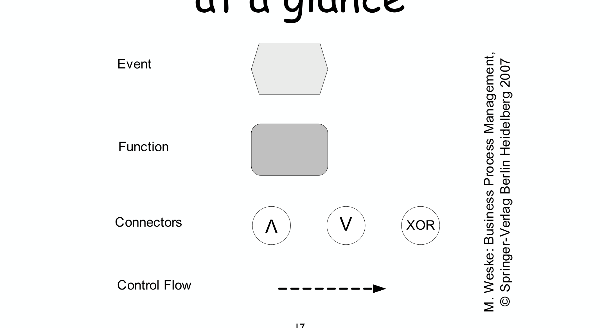
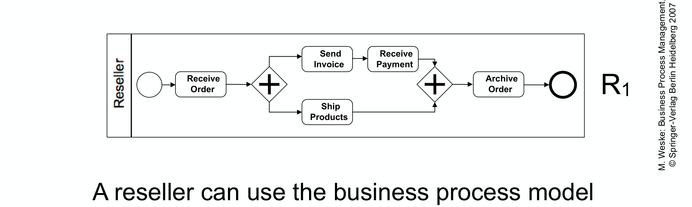

---
tags:
  - università/business-process-modeling
  - epc
  - orchestration
  - collaboration
  - choreography
data: 2026-07-03
lezione: "06 — Orchestration, Collaboration"
corso: "MPB (6 cfu, 295AA)"
professore: "Roberto Bruni"
fonte: "Weske, *Business Process Management*, Sect.1.1"
---

# Orchestration e Collaboration

Finora abbiamo guardato un processo come qualcosa di isolato. Ma nella realtà i processi *interagiscono*: un'azienda che vende deve coordinarsi con chi compra, e ciascuna ha la propria logica interna. Questa lezione affronta due temi. Primo, un nuovo linguaggio di modellazione, l'**EPC**, che affianca BPMN e workflow net. Secondo — ed è il cuore della lezione — i **tre punti di vista** da cui si può guardare un insieme di processi che collaborano: l'**orchestration** (uno solo che controlla), la **collaboration** (più attori che si scambiano messaggi) e la **choreography** (le regole globali dell'interazione).

---

## EPC: Event-driven Process Chain

L'**EPC** è un linguaggio di tipo flow-chart nato all'inizio degli anni '90 come parte del framework **ARIS** (Architecture of Integrated Information Systems) di **Wilhelm-August Scheer**. È pensato per due usi concreti: configurare un'implementazione di ERP (Enterprise Resource Planning) e guidare la modellazione, analisi e ridisegno dei processi di business. Il suo punto di forza dichiarato è la **semplicità**: una notazione informale, minimale e intuitiva, che non richiede una "legenda" per essere capita. Ha anche un formato di interscambio in XML, l'**EPC Markup Language** (`.epml`).

> [!definition] Event-driven Process Chain (EPC)
>
> Un grafo **ordinato di eventi e funzioni**, dotato di connettori che permettono l'esecuzione alternativa e parallela dei processi, specificata tramite gli operatori logici **AND**, **OR** e **XOR**.

L'EPC ha quattro tipi di ingredienti, ognuno con la sua forma grafica precisa.

*Fig. — Gli ingredienti dell'EPC.*

> [!definition] I quattro ingredienti dell'EPC
>
> - **Event** (esagono): un elemento **passivo** che descrive *sotto quali circostanze* un processo (o una funzione) opera, o *in quale stato* risulta — in pratica, pre- e post-condizioni. Ogni diagramma EPC deve **iniziare e finire con degli eventi**.
> - **Function** (rettangolo arrotondato): un elemento **attivo** che descrive un task o un'attività del processo. Una funzione può essere **raffinata** in un altro diagramma EPC (composizione gerarchica).
> - **Logical connector** (cerchio, a volte ottagono): esprime le relazioni logiche tra i rami di uno split o di un join. I tre operatori sono **AND** ($\wedge$), **OR** ($\vee$) e **XOR** ($\times$).
> - **Control flow** (freccia tratteggiata): collega eventi, funzioni e connettori, esprimendo dipendenze causali.

Una regola strutturale caratteristica dell'EPC è l'**alternanza** tra eventi e funzioni lungo il flusso (un evento abilita una funzione, che produce un evento, e così via), esattamente come i Petri net alternano place e transition.

> [!warning] La semantica dell'OR-join è insidiosa
>
> Mentre AND e XOR sono chiari, l'**OR-join** ha un significato sorprendentemente delicato. Quando su un ramo arriva un solo input, il join non può decidere subito: deve **aspettare l'altro input**, a meno che non sia *garantito* che l'altro non arriverà mai. Questa è una condizione **non-locale** (dipende da cosa può ancora succedere altrove nella rete), ed è la ragione per cui la semantica formale dell'OR-join è notoriamente problematica.

---

## I tre punti di vista sull'interazione tra processi

Veniamo al cuore della lezione. Quando più processi collaborano, possiamo modellarli da tre prospettive diverse. Non sono modelli in competizione: descrivono la *stessa* realtà a livelli di astrazione differenti, e la scelta dipende da cosa vogliamo mettere in evidenza.

### Orchestration: un unico punto di vista

Un business process, per definizione, è eseguito **da una singola organizzazione**. Perciò l'ordine delle sue attività può essere controllato in modo **centralizzato** da un componente software (il BPMS) gestito da quell'organizzazione. Questo tipo di controllo si chiama **orchestration**.

> [!definition] Orchestration
>
> Un modello a **singolo punto di vista** (single viewpoint), in cui un agente centrale controlla l'ordine delle attività di *un* processo. L'analogia è con il **direttore d'orchestra**, che dal centro coordina tutti i musicisti.

*Fig. — Orchestration del reseller (R1) in BPMN. È un processo interno a una sola organizzazione: dopo aver ricevuto l'ordine, le attività di fatturazione/incasso e di spedizione avvengono **in parallelo** (gateway `+`). Il reseller usa questo modello per configurare il proprio BPMS, e tutte le istanze verranno eseguite come specificato.*

### Collaboration: più punti di vista che si scambiano messaggi

Se ora consideriamo *insieme* il processo del reseller e quello del buyer, ciascuno resta autonomo e controllato dalla propria organizzazione, ma i due devono **comunicare**. Questo è il livello della **collaboration**.

> [!definition] Collaboration
>
> Un modello **decentralizzato a punti di vista multipli** (multiple viewpoints). Comprende le attività di **processi autonomi** e il modo in cui interagiscono per raggiungere un obiettivo comune. Ogni processo è eseguito da una sola organizzazione, ma processi cross-organizzativi possono interagire tra loro. Collegare le attività correlate di processi distinti è, appunto, la collaboration.

Il meccanismo dell'interazione è lo **scambio di messaggi**: messaggi elettronici o oggetti fisici trasportati da un processo all'altro. Graficamente, in sintassi BPMN, il **message flow** si rappresenta con **archi tratteggiati** (distinti dalle frecce piene del control flow interno).

*Fig. — Collaboration Buyer–Reseller. Ogni organizzazione ha la propria pool con il proprio control flow interno (frecce piene); gli **archi tratteggiati** tra le pool sono i **message flow** che collegano, per esempio, il "Place Order" del buyer al "Receive Order" del reseller.*

### Choreography: il punto di vista globale

C'è infine un terzo livello, che astrae ancora di più: la **choreography**. Qui non ci interessa la logica interna di ciascun partecipante, ma **solo le interazioni** tra di loro, viste dall'esterno.

> [!definition] Choreography
>
> Un modello a **punto di vista globale** (global viewpoint) che specifica le interazioni di un insieme di processi. Si differenzia:
> - dall'**orchestration** perché **non c'è un agente centrale** che controlla le attività;
> - dalla **collaboration** perché contiene **solo le attività di interazione** tra i partecipanti, non la logica interna di ciascuno.
>
> L'analogia è con i **ballerini** di una coreografia: si comportano in modo autonomo, ma seguono ciascuno la propria parte in una danza concordata.

*Fig. — Choreography. Ogni box è un'**attività di interazione** con i due partecipanti (Buyer/Reseller) sulle bande; il diagramma dice, per esempio, "il Buyer piazza l'ordine al Reseller", "il Reseller spedisce i prodotti al Buyer". Una choreography è una sorta di **contratto**: dice come gli attori **dovrebbero** interagire, senza imporre come ciascuno realizza internamente la propria parte.*

> [!abstract] I tre punti di vista a confronto
>
> - **Orchestration** — *single viewpoint*: un attore centrale controlla; è il "dentro" di una singola organizzazione (direttore d'orchestra).
> - **Collaboration** — *multiple viewpoints*: più attori autonomi con la loro logica interna, collegati da message flow (musicisti che si passano segnali).
> - **Choreography** — *global viewpoint*: solo le regole d'interazione, nessun controllore centrale (ballerini che seguono la coreografia).

---

## Compatibilità tra processi

C'è un problema pratico che emerge appena si mettono insieme processi **sviluppati separatamente**: non è affatto garantito che riescano a lavorare insieme. Ciascuno è stato progettato con le proprie assunzioni sull'ordine delle attività, e se queste assunzioni non combaciano l'interazione può **bloccarsi**.

Consideriamo un buyer B4 che si aspetta di *ricevere i prodotti prima di pagare la fattura*, e un reseller R2 che invece pretende di *ricevere il pagamento prima di spedire i prodotti*:

*Fig. — Un'interazione **incompatibile** (B4 + R2). Si crea un **deadlock**: R2 aspetta il pagamento prima di spedire, ma B4 aspetta i prodotti prima di pagare. Nessuno dei due può proseguire, e l'interazione si blocca.*

> [!warning] Compatibilità
>
> Due processi sono **compatibili** se, messi a interagire, riescono a completare senza bloccarsi. Processi sviluppati in modo indipendente possono risultare **incompatibili** anche se ciascuno, preso da solo, è perfettamente corretto: il problema nasce dall'**ordine in cui si aspettano gli scambi**. Analizzando tutte le combinazioni di varianti di buyer e reseller si costruisce una *compatibility matrix* che segna quali coppie funzionano ("ok") e quali no.

Questa nozione di "riuscire a completare senza bloccarsi" è centrale e verrà formalizzata più avanti, quando studieremo proprietà come la **soundness** delle reti. È il ponte naturale verso l'analisi strutturale dei processi. → [[07 - EPC e BPMN]]
