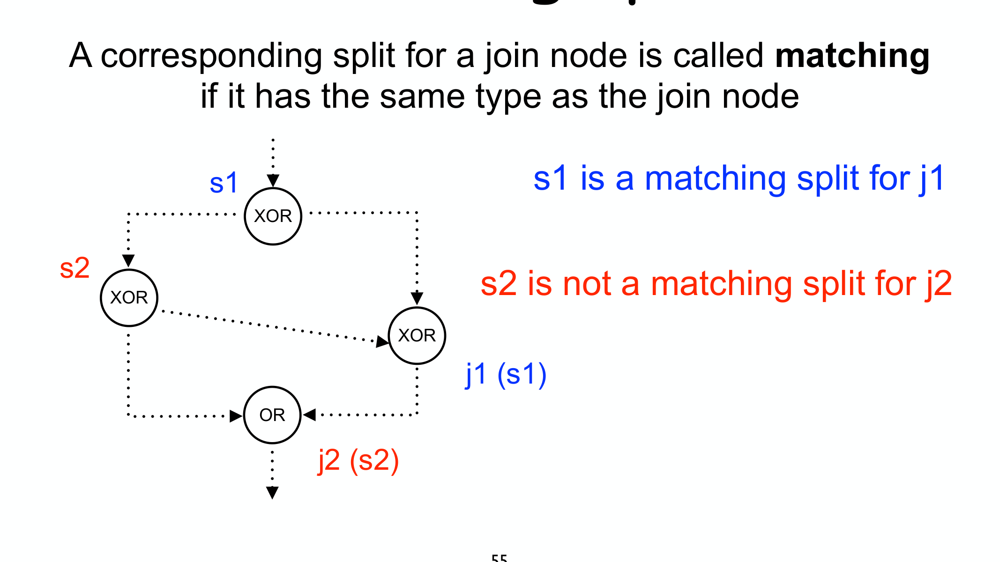
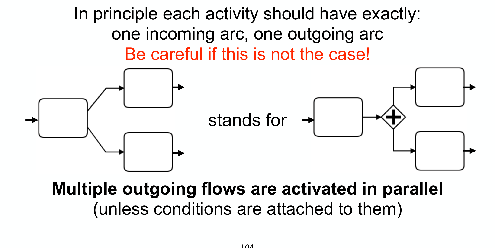

---
tags:
  - università/business-process-modeling
  - epc
  - bpmn
  - visual-notation
data: 2026-07-03
lezione: "07a — EPC and BPMN"
corso: "MPB (6 cfu, 295AA)"
professore: "Roberto Bruni"
fonte: "Weske, *Business Process Management*, Sect.4.3, 4.7, 5.7 · Dumas et al., *Fundamentals of BPM*, Ch.3-4"
---

# EPC e BPMN

Questa lezione approfondisce due notazioni diagrammatiche "high-level" per i processi. La prima metà completa lo studio dell'**EPC** iniziato in [[06 - Orchestration e Collaboration]]: le regole di buona formazione, la sua semantica operazionale (il *folder-passing*) e il problema spinoso dell'OR-join. La seconda metà introduce **BPMN**, lo standard industriale de facto, con i suoi elementi di base. Il filo conduttore è sempre lo stesso: una notazione grafica deve essere **espressiva** ma anche **non ambigua**, e vedremo dove entrambe queste notazioni faticano.

---

## Parte 1 — EPC: regole, semantica, OR-join

### Requisiti di buona formazione

Gli elementi di un EPC (eventi, funzioni, connettori) si possono combinare abbastanza liberamente, cicli inclusi, ma non in modo del tutto arbitrario. Ci sono vincoli strutturali che un diagramma deve rispettare per avere senso.

> [!definition] Requisiti di un diagramma EPC
>
> - Il grafo deve essere **debolmente connesso** (weakly connected): niente nodi isolati.
> - **Eventi**: al massimo **un** arco entrante e **uno** uscente, e almeno un arco incidente. Devono esistere almeno un evento di start e uno di end.
> - **Funzioni**: **esattamente** un arco entrante e uno uscente.
> - **Connettori** (logici): o **uno entrante e molti uscenti** (split), o **molti entranti e uno uscente** (join). Mai molti-a-molti.

A questi si aggiungono spesso delle **linee guida** più stringenti — start/end unici, nessun flusso diretto tra due eventi o tra due funzioni, nessun evento seguito da un nodo di decisione ((X)OR-split). Studi empirici, però, mostrano che queste guideline sono **troppo restrittive**: seguirle alla lettera produce diagrammi inutilmente complicati, e in pratica le persone le ignorano. La soluzione pragmatica è **rilassare la maggior parte dei vincoli**, tanto i nodi "dummy" mancanti (funzioni o eventi fittizi che ripristinano l'alternanza, oppure un connettore che disambigua) si possono sempre aggiungere dopo, in automatico.

> [!note] Start ed end multipli: cosa si assume
>
> - Uno **start event** (senza archi entranti) invoca una nuova istanza del processo. Più start event si assumono **mutuamente esclusivi**: c'è un **XOR-split implicito** che sceglie con quale far partire l'istanza.
> - Un **end event** (senza archi uscenti) segnala il completamento. Con più end event non c'è unanimità sulla semantica: si assume un **join implicito** (tipicamente XOR, ma non necessariamente).

Oltre agli elementi base, le funzioni possono avere **annotazioni**: l'**organization unit** (chi è responsabile della funzione, un'ellisse con linea verticale), gli **information/material/resource object** (i dati o oggetti in input/output, rettangoli collegati) e il **supporting system** (il supporto tecnico).

### La semantica folder-passing

Come si esegue un EPC? L'idea intuitiva è che un processo parte quando accadono i suoi eventi iniziali, le attività si eseguono secondo i vincoli del diagramma, e alla fine — se il diagramma è "corretto" — restano da trattare solo eventi finali. Per rendere precisa questa intuizione si usa la **folder-passing semantics**, del tutto analoga al token game dei [[04 - Petri Nets|Petri net]].

> [!definition] Folder-passing semantics
>
> Lo stato corrente del processo è dato dalle **folder** (cartelle) piazzate sul diagramma — l'equivalente dei token. Una **relazione di transizione** spiega come passare da uno stato al successivo, ed è **possibilmente non-deterministica**. Le regole per far avanzare le folder ricalcano quelle di split/join: un **AND-split** replica la folder su tutti i rami, un **AND-join** aspetta le folder su tutti i rami; uno **XOR-split** manda la folder su un solo ramo, e così via.

Il punto delicato — di nuovo — sono i **join**, in particolare quando devono decidere se aspettare o meno un secondo input. Questo richiede a volte di sapere non solo *dove sono* le folder, ma anche *dove non arriveranno mai*: un'informazione **non-locale**, difficile da propagare.

> [!warning] La semantica dei join è non-locale
>
> - **XOR-join**: se arrivano *entrambi* gli input dovrebbe **bloccare** il flusso (era una scelta, non dovevano arrivare tutti e due); se ne arriva uno solo, può procedere solo se è *informato* che l'altro non arriverà mai.
> - **OR-join**: se arriva un solo input dovrebbe rilasciare il flusso; se arrivano entrambi ne rilascia uno solo; ma se ne arriva uno solo **deve aspettare** l'altro *a meno che* non sia garantito che l'altro non arriverà mai. È la stessa condizione non-locale vista in [[06 - Orchestration e Collaboration]], ed è la ragione per cui l'OR-join è notoriamente problematico da formalizzare.

### Decorated EPC: disambiguare i join

Per togliere l'ambiguità dai join, si **annota** ulteriormente il diagramma, legando ogni join allo split da cui i flussi si erano separati. Servono tre nozioni via via più forti.

> [!definition] Candidate, corresponding, matching split
>
> - **Candidate split** di un join: un qualsiasi split i cui output sono connessi agli input di quel join.
> - **Corresponding split**: fra i candidati, quello **scelto** e associato al join (si etichetta il join con il suo split, es. `j1 (s1)`).
> - **Matching split**: un corresponding split che è dello **stesso tipo** del join (uno XOR-split per uno XOR-join).

*Fig. — Matching split. $s1$ (XOR) è **matching** per $j1$ (XOR), stesso tipo. $s2$ (XOR) è corresponding ma **non matching** per $j2$ (OR), tipo diverso.*

La distinzione serve a risolvere l'OR-join scegliendo una **policy**:

> [!definition] Policy dell'OR-join
>
> - Se l'OR-join ha uno split **matching**, la semantica è **wait-for-all**: aspetta il completamento di *tutti* i cammini attivati.
> - Altrimenti si sceglie un'altra policy: **every-time** (rilancia l'output a ogni input) oppure **first-come** (aspetta il primo input e ignora il secondo).
>
> Si assume che **ogni OR-join sia etichettato con una policy** (qualcuno propone perfino simboli a trapezio diversi per distinguerle).

---

## Parte 2 — BPMN: lo standard industriale

### Obiettivi, storia, pro e contro

Il **BPMN** (Business Process Model and Notation) nasce con un obiettivo di comprensibilità *trasversale*: una notazione grafica leggibile dagli **analisti** (che disegnano le bozze), dai **developer** (che le implementano) e dalle **persone di business** (che gestiscono i processi). Prima di BPMN esisteva una miriade di proposte frammentate (BPEL, BPML, UML AD, WS-CDL, XLANG, ...); BPMN nasce proprio per **ridurre questa frammentazione**, consolidare le idee migliori e favorire BPMS interoperabili. Storicamente: BPMI.org nel **2000**, la fusione con OMG nel **2005**, **BPMN 1.0** nel 2006, fino a **BPMN 2.0 final** nel **2011** (che aggiunge tra l'altro le choreographies, un metamodello completo e la serializzazione XML).

> [!abstract] Pro e contro di BPMN
>
> **Pregi**: *simplicity* (un piccolo insieme di simboli base), *extensibility* (molte decorazioni, aggiungibili in futuro), design grafico intuitivo, *generality* (copre orchestration + collaboration + choreography), disponibilità di tool e formato di scambio `.bpmn`.
> **Difetti**: oltre **100 elementi grafici**, una specifica verbosa (500 pagine), difficile da imparare a fondo (letture diverse dello stesso diagramma sono possibili), e vendor diversi implementano l'esecuzione di BPMN in modi diversi (e su sottoinsiemi diversi).

BPMN definisce i **Business Process Diagram (BPD)**, basati sulla tecnica del flowchart, con **quattro categorie** di elementi: **swimlanes**, **flow objects**, **connecting objects** e **artefacts**. Nonostante la ricchezza, molti concetti hanno una corrispondenza diretta con l'EPC:

*Fig. — BPMN vs EPC (a grandi linee). Ogni ingrediente EPC ha un analogo BPMN; BPMN aggiunge il **message flow** per la comunicazione tra pool.*

### Swimlanes: pool e lane

Le **swimlane** organizzano le attività in categorie visuali che illustrano capacità o responsabilità diverse.

> [!definition] Pool e lane
>
> - Un **pool** rappresenta un **partecipante** (o ruolo) del processo — un'organizzazione, un ruolo, un sistema — disegnato come un rettangolo con un nome. Un pool **deve contenere 0 o 1 processo** e può contenere 0 o più lane. Due pool possono essere collegati **solo da message flow**.
> - Una **lane** è una sotto-partizione gerarchica *dentro* un pool, per organizzare e categorizzare le attività.
> - Un **collapsed pool** nasconde il processo interno: è trattato come una **black-box**.

### Flow objects: eventi, attività, gateway

Il cuore di BPMN sono i **flow objects**, e la scelta di design è deliberata: fissare **pochi elementi core** (tre forme da imparare), poi aggiungere informazione tramite **bordi diversi e marker interni**. Così la notazione resta estensibile senza moltiplicare le forme base.

> [!definition] I tre flow objects
>
> - **Event** (cerchio): qualcosa che "accade" durante il processo. Il **bordo** ne definisce il tipo — **start** (bordo sottile), **intermediate** (doppio bordo), **end** (bordo spesso) — e un marker interno il sotto-tipo (message, timer, error, ...).
> - **Activity** (rettangolo arrotondato): un'unità di lavoro. Può essere **atomica** (un **task**) o **composta** (un **sub-process**).
> - **Gateway** (rombo): controlla lo split/join del sequence flow (condizione, fork, attesa); un marker interno ne indica la natura.

I **gateway** sono l'analogo dei connettori EPC, ma con più varianti. I principali:

- **Exclusive (XOR), data-based** — in split, instrada verso **esattamente un** ramo secondo condizioni; in merge, aspetta **un** ramo entrante.
- **Parallel (AND)** — in split, attiva **tutti** i rami simultaneamente; in merge, aspetta **tutti** i rami.
- **Inclusive (OR)** — in split, attiva **uno o più** rami secondo condizioni; in merge, aspetta tutti i rami *attivi*. Porta con sé **gli stessi problemi** dell'OR-join in EPC: da usare solo quando strettamente necessario.
- **Complex** — merge/branch con condizioni complesse; da usare con parsimonia perché la semantica può non essere chiara.
- **Event-based** — è sempre seguito da eventi catching o receive task, e instrada verso quello che accade **per primo** (è la scelta *implicita/deferred* di [[04 - Petri Nets]]).

### Connecting objects e requisiti

Gli oggetti si collegano con tre tipi di connettori: il **sequence flow** (linea piena con punta piena, l'ordine di esecuzione *dentro* un pool — in BPMN si evita il termine "control flow"), il **message flow** (tra pool *diversi*) e l'**association** (verso gli artefacts). Le regole di connettività ricalcano quelle EPC: gli eventi hanno al più un arco entrante e uno uscente, le attività **esattamente uno e uno**, i gateway sono uno-a-molti, molti-a-uno o molti-a-molti.

Cosa succede se un'attività ha *più* archi, violando la regola "uno e uno"? BPMN inserisce dei **gateway impliciti**, e qui si nasconde una trappola.

*Fig. — Gateway impliciti. **Più flussi uscenti** equivalgono a un **AND-split** (parallelo), a meno che non abbiano condizioni. Simmetricamente, **più flussi entranti** su un'attività sono trattati come **mutuamente esclusivi** (XOR-join implicito). È un "hidden issue": meglio rendere i gateway espliciti per evitare letture sbagliate.*

### Sub-process e naming

I modelli grandi sono difficili da leggere. Il **sub-process** migliora la leggibilità nascondendo parti del diagramma in un'attività composta e auto-contenuta, che si può mostrare **collapsed** (una scatola con un `+`) o **expanded** (aperta, con uno start/end impliciti). BPMN raccomanda anche **convenzioni di naming** precise: i pool prendono un sostantivo (spesso il verbo principale "nominalizzato", es. *order fulfilment*); gli eventi un sostantivo seguito da un participio passato (es. *Invoice emitted*); le attività un verbo all'imperativo seguito da un sostantivo (es. *Approve order*). In tutti i casi: label brevi, articoli spesso omessi.

### Pattern tipici

Con questi ingredienti si costruiscono i pattern ricorrenti: la **sequenza**, il **rework/repetition** (un blocco che inizia con un XOR-join e finisce con un XOR-split decisionale), le **attività parallele**, gli **start/end multipli** (comodi per catturare trigger mutuamente esclusivi; BPMN usa una **implicit termination semantics** — il caso finisce solo quando *ogni* token ha raggiunto un end). Un pattern particolarmente utile è la **decisione esclusiva** con i rami annotati dalle condizioni:

*Fig. — Decisione esclusiva (invoice checking). È buona pratica **annotare i rami con le condizioni** sotto cui vengono presi. Un ramo può essere marcato come **default flow** (una barra sull'arco), che significa "altrimenti" e si prende se nessun'altra condizione è vera.*

Per le **decisioni inclusive** (uno *o* più rami, es. distribuire un ordine a più magazzini), si può provare a usare solo XOR/AND, ma il diagramma diventa contorto e non scala col numero di rami; gli **OR-gateway** scalano bene, ma riportano tutti i problemi degli OR-join non-matched visti in EPC — da usare solo se davvero necessari. Regola pratica: i diagrammi sono più leggibili se i gateway sono **bilanciati** (ogni split ha il suo join dello stesso tipo).

Con EPC e BPMN abbiamo il quadro completo delle notazioni high-level. La prossima parte aggiunge gli elementi BPMN più avanzati. → [[07b - More BPMN]]
