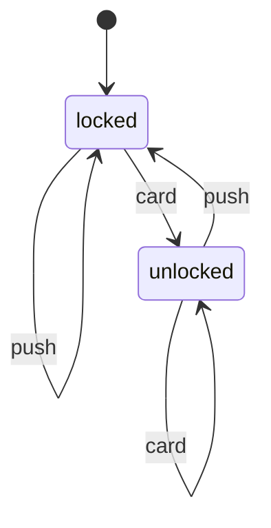

---
tags:
  - università/business-process-modeling
  - petri-nets
  - automata
  - multiset
  - formal-semantics
data: 2026-07-03
lezione: "08 — From automata to nets"
corso: "MPB (6 cfu, 295AA)"
professore: "Roberto Bruni"
fonte: "Petri nets basics · Esparza, *Free Choice Petri Nets* (optional)"
---

# From Automata to Nets

Questa lezione dà la **veste matematica** ai [[04 - Petri Nets|Petri net]] che avevamo introdotto in modo intuitivo. Il percorso parte da un modello che probabilmente già conosciamo — gli **automi a stati finiti** — mostra *perché non bastano* per i sistemi concorrenti, e da lì costruisce i Petri net "deformando" un automa. Lungo la strada fissiamo lo strumento formale che ci serve, i **multiset**, e diamo la definizione precisa di marcatura, abilitazione, scatto e sequenze di scatto.

Il motivo di tutto questo formalismo è pratico: vogliamo **analizzare** i processi, non solo disegnarli. L'analisi ha tre facce — la **validation** (testare la correttezza), la **verification** (dimostrarla) e la **performance** (pianificare e ottimizzare) — e i Petri net sono lo strumento giusto perché sono insieme **visuali, formali e supportati da tool**.

---

## Perché non bastano gli automi

Un **automa a stati finiti** modella bene i sistemi **sequenziali**: protocolli, parsing di testo, comportamento di personaggi nei videogiochi, unità di controllo di CPU, distributori automatici, semafori. L'idea è quella di un sistema che si trova, in ogni istante, in **esattamente uno** stato, e passa da uno stato all'altro leggendo input.

> [!definition] DFA (Deterministic Finite Automaton)
>
> Un DFA è una tupla $A = (Q, \Sigma, \delta, q_0, F)$ dove:
> - $Q$ è un insieme finito di **stati**;
> - $\Sigma$ è un insieme finito di **simboli** di input;
> - $\delta : Q \times \Sigma \to Q$ è la **funzione di transizione** (dato lo stato corrente e un input, restituisce il prossimo stato);
> - $q_0 \in Q$ è lo **stato iniziale**;
> - $F \subseteq Q$ è l'insieme degli **stati finali** (accettanti).

Un esempio minimo è il **tornello** (turnstile): è `locked` finché non si passa una `card`, che lo porta in `unlocked`; una `push` lo riporta in `locked`.

Per descrivere l'effetto di un'**intera parola** (non un solo simbolo) si estende $\delta$ alla **funzione destinazione** $\hat\delta : Q \times \Sigma^\star \to Q$, definita per **induzione** sulla lunghezza della parola: $\hat\delta(q, \epsilon) = q$ (parola vuota, si resta fermi) e $\hat\delta(q, wa) = \delta(\hat\delta(q, w), a)$ (si processa prima $w$, poi il simbolo finale $a$). Un automa **accetta** una parola $w$ se $\hat\delta(q_0, w) \in F$, e il suo **linguaggio** è $L(A) = \{ w \mid \hat\delta(q_0, w) \in F \}$.

Esiste anche la variante **non-deterministica** (NFA), in cui $\delta : Q \times \Sigma \to \wp(Q)$ restituisce un **insieme** di possibili stati successivi (uno stesso input può portare in stati diversi).

> [!warning] Il limite degli automi
>
> Gli automi vanno benissimo per i sistemi **sequenziali**, ma **non catturano direttamente il comportamento concorrente**. Se due cose accadono *in parallelo*, un automa è costretto a rappresentarne tutti gli intrecci (interleaving) come stati distinti, con un'esplosione del numero di stati. Un **Petri net** è per i sistemi **paralleli e concorrenti** ciò che un automa finito è per i sistemi sequenziali.

---

## Da un automa a una rete: il "reshaping"

Il modo più illuminante per capire i Petri net è vederli nascere da un automa, con una sequenza di piccole trasformazioni. Partendo da un automa (l'esempio della lezione è un riconoscitore di frasi in linguaggio naturale):

1. **Get a token** — si mette un **gettone** sullo stato iniziale, per segnare "dove siamo".
2. **Drop the initial-state arrow** — la freccia di start non serve più: lo dice il token.
3. **Transitions as boxes** — le transizioni (gli archi etichettati) diventano dei **quadrati** espliciti, nodi a sé stanti.
4. **Forget final states** — non ci interessa più "accettare" parole, ci interessa l'evoluzione dello stato.
5. **Add more tokens** — permettiamo **più di un token** contemporaneamente: ecco la concorrenza.
6. **Allow for more arcs** — un quadrato può avere più input e più output.

Il risultato ha una nuova terminologia:

*Fig. — L'automa "deformato" in una rete. I nodi-stato diventano **place** (cerchi), le transizioni etichettate diventano **transition** (quadrati), i **token** (pallini) segnano lo stato, e ora possono essercene più d'uno in giro contemporaneamente — è questo a rendere la rete capace di esprimere concorrenza.*

> [!note] I fatti che seguono dalla costruzione
>
> - Le reti sono **grafi bipartiti**: gli archi non collegano mai due place né due transition.
> - Sono una **struttura statica per un sistema dinamico**: place, transition e archi non cambiano; sono i **token** a muoversi tra i place.
> - I **place** sono componenti **passivi**, le **transition** componenti **attivi**.
> - Attenzione: i token **non fluiscono** lungo gli archi come acqua in un tubo — vengono **rimossi** dagli input place e **creati** ex-novo negli output place. È una differenza concettuale importante che spiega perché il numero totale di token può cambiare.

---

## Lo strumento formale: i multiset

Per descrivere con precisione "quanti token ci sono in ogni place" un insieme ordinario non basta: un place può contenere **più token uguali**. Serve la nozione di **multiset** (multiinsieme).

*Fig. — Set vs multiset. In entrambi l'**ordine non conta**; la differenza è che in un **set** ogni elemento compare **al più una volta**, mentre in un **multiset** può comparire **più volte**.*

> [!definition] Multiset
>
> Un **multiset** su un insieme $S$ è una funzione $M : S \to \mathbb{N}$ che a ogni elemento associa la sua **molteplicità** (quante volte compare). L'insieme dei multiset su $S$ si denota $\mu(S)$ o $S^\oplus$. Diciamo che $x \in M$ se $M(x) > 0$. Un **set** è il caso particolare in cui ogni molteplicità è 0 oppure 1.

Un multiset si scrive comodamente come **somma formale**: $M = k_1 x_1 + k_2 x_2 + \dots + k_n x_n$, dove $k_i$ è la molteplicità di $x_i$ (si omette se vale 1). Per esempio $2a + 3b + c$ è il multiset con due $a$, tre $b$ e una $c$. Le operazioni sono definite molteplicità per molteplicità:

- **Contenimento**: $M \subseteq M'$ se $M(x) \le M'(x)$ per ogni $x$.
- **Unione (somma)**: $(M + M')(x) = M(x) + M'(x)$.
- **Differenza**: $(M - M')(x) = M(x) - M'(x)$, **definita solo se** $M \supseteq M'$ (altrimenti si andrebbe sotto zero).

> [!example] Operazioni sui multiset
>
> - $3a + 2b \subseteq 2a + 3b + c$? **No** (serve $3a \le 2a$, falso).
> - $(a + 2b) + (2a + c) = 3a + 2b + c$.
> - $(2a + 3b) - (2a + b) = 2b$.
> - $(2a + 2b) - (a + c)$ = **non definita** (manca $c$ nel primo).

---

## Marcatura, abilitazione, scatto (in forma precisa)

Con i multiset possiamo formalizzare tutto ciò che in [[04 - Petri Nets]] avevamo descritto a parole.

> [!definition] Marking (marcatura)
>
> Una **marcatura** è un multiset sui place, $M : P \to \mathbb{N}$: dice quanti token stanno in ciascun place. $M(a) = 0$ significa "nessun token in $a$". **La marcatura è lo stato** del Petri net.

> [!definition] Petri net (con marcatura iniziale)
>
> Un **Petri net** è una tupla $(P, T, F, M_0)$ con $P$ place finiti, $T$ transition finite ($P \cap T = \varnothing$), $F \subseteq (P\times T)\cup(T\times P)$ la flow relation, e $M_0 \in \mu(P)$ la **marcatura iniziale**. Ricordiamo il **pre-set** $\bullet t = \{p \mid (p,t)\in F\}$ e il **post-set** $t\bullet = \{p \mid (t,p)\in F\}$.

Ed ecco il punto in cui il formalismo dei multiset ripaga: abilitazione e scatto diventano **operazioni aritmetiche** su marcature.

> [!definition] Enabling e firing (formali)
>
> - **Enabling**: una transizione $t$ è **abilitata** in $M$ se e solo se $\;\bullet t \subseteq M\;$, cioè se ogni input place ha abbastanza token. Si scrive $M \xrightarrow{t}$ oppure $M[t\rangle$.
> - **Firing**: una $t$ abilitata in $M$ può **scattare**, portando alla nuova marcatura
> $$M' = M - \bullet t + t\bullet$$
> e si scrive $M \xrightarrow{t} M'$ (o $M[t\rangle M'$). Cioè: **togli** un token da ogni input place, **aggiungi** un token in ogni output place.

Valgono le stesse osservazioni della lezione 04: lo scatto è **atomico**, la semantica è **interleaving** (una transizione alla volta), e il numero totale di token **può variare** perché $|\bullet t|$ e $|t\bullet|$ possono differire.

Introduciamo anche una notazione compatta per parlare di *esistenza* di mosse: $M \to$ se qualche transizione è abilitata in $M$; $M \to M'$ se $M \xrightarrow{t} M'$ per qualche $t$; $M \not\xrightarrow{t}$ se $t$ non è abilitata; $M \not\to$ se **nessuna** transizione è abilitata (marcatura *morta*).

---

## Sequenze di scatto e marcature raggiungibili

Un singolo scatto è solo un passo. Ci interessa l'evoluzione completa, cioè le **sequenze** di scatti.

> [!definition] Firing sequence
>
> Data una sequenza di transizioni $\sigma = t_1 t_2 \cdots t_{n-1} \in T^\star$, scriviamo $M \xrightarrow{\sigma} M'$ se esiste una successione di marcature $M = M_1 \xrightarrow{t_1} M_2 \xrightarrow{t_2} \cdots \xrightarrow{t_{n-1}} M_n = M'$. La sequenza può anche essere **infinita** ($\sigma \in T^\omega$), se il processo non termina mai.

> [!definition] Marcature raggiungibili
>
> Una marcatura $M'$ è **raggiungibile** da $M$ se $M \xrightarrow{\sigma} M'$ per qualche $\sigma$; si scrive $M \xrightarrow{\;\ast\;} M'$. L'insieme di tutte le marcature raggiungibili da $M$ si denota $\text{reach}(M)$ oppure $[M\rangle$. (Nota: $M \xrightarrow{\epsilon} M$, ogni marcatura raggiunge sé stessa con la sequenza vuota.)

Su queste sequenze si definiscono le nozioni di **concatenazione** (finito + finito = finito; finito + infinito = infinito) e di **prefisso** ($\sigma_1$ è prefisso di $\sigma$ se $\sigma_1\sigma_2 = \sigma$ per qualche $\sigma_2$). Un fatto utile lega abilitazione e prefissi:

> [!theorem] Abilitazione per prefissi
>
> Una sequenza $\sigma$ è abilitata in $M$ (cioè $M \xrightarrow{\sigma}$) **se e solo se** *ogni* prefisso $\sigma'$ di $\sigma$ è abilitato in $M$.
>
> *Idea:* ($\Rightarrow$) immediato dalla definizione. ($\Leftarrow$) se $\sigma$ è finita è banale (è prefisso di sé stessa); se è infinita, per ogni $i$ il passo $t_i$ è abilitato perché il prefisso $t_1\cdots t_i$ lo è, e quello è un prefisso finito. $\blacksquare$

L'insieme delle marcature raggiungibili $[M_0\rangle$ è il concetto centrale su cui costruiremo l'analisi: rappresenta **tutti gli stati** in cui il processo può finire. Nella prossima lezione lo organizzeremo in un grafo — l'**occurrence graph** — per poterlo studiare sistematicamente. → [[09 - Occurrence Graph]]
