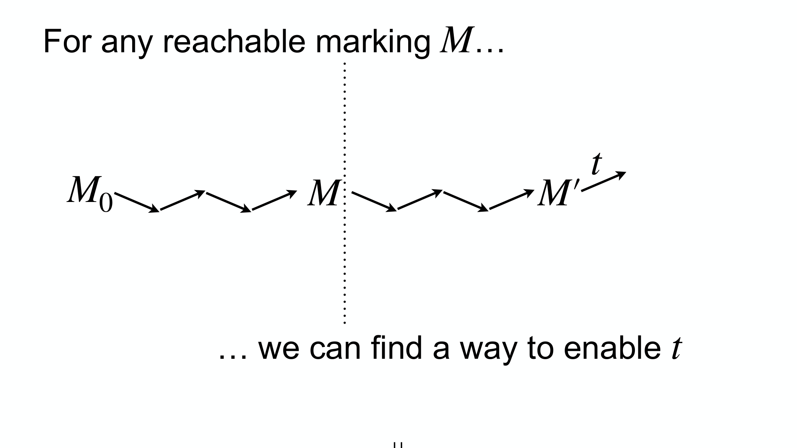
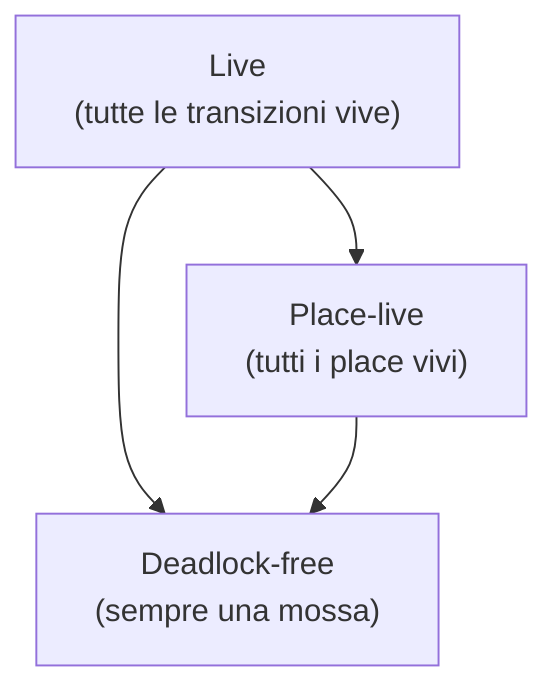

---
tags:
  - università/business-process-modeling
  - petri-nets
  - liveness
  - deadlock
data: 2026-07-03
lezione: "10 — Liveness"
corso: "MPB (6 cfu, 295AA)"
professore: "Roberto Bruni"
fonte: "Petri nets · Esparza, *Free Choice Petri Nets* (optional)"
---

# Liveness

In [[09 - Occurrence Graph]] abbiamo imparato a costruire lo spazio degli stati raggiungibili e a chiederci se è finito (boundedness). Ora affrontiamo una domanda diversa, sul *comportamento a lungo termine*: una data attività del processo **potrà sempre, prima o poi, essere eseguita**? Oppure può capitare di finire in uno stato da cui quell'attività non sarà **mai più** possibile? Questa è la nozione di **liveness** (vivacità), la proprietà chiave per garantire che un processo non "muoia" pezzo per pezzo. Studieremo la liveness delle transizioni, quella dei place, la nozione più debole di **deadlock-freedom**, e come queste proprietà si implicano a vicenda.

Una premessa logica utile per tutta la lezione: per **smentire** un'implicazione $P \Rightarrow Q$ basta esibire un caso in cui $P$ è vero e $Q$ falso, cioè

$$P \wedge \neg Q$$

E ricordiamo la transitività della raggiungibilità:

$$M \in [M_0\rangle \ \wedge\ M' \in [M\rangle \ \implies\ M' \in [M_0\rangle$$

Con "marcatura raggiungibile" intenderemo sempre "raggiungibile da $M_0$".

---

## Liveness di una transizione

Il primo istinto sarebbe dire che una transizione è "buona" se prima o poi si riesce a farla scattare. Ma questa è una condizione troppo debole: garantisce solo che $t$ scatti *almeno una volta*, non che resti sempre possibile. La liveness chiede molto di più.

> [!definition] Live, dead, non-live, non-dead (transizioni)
>
> Una transizione $t$ può essere:
> - **live** (viva): può *sempre* essere abilitata in futuro — qualunque cosa accada, non escludiamo mai che $t$ possa scattare di nuovo;
> - **dead** (morta): non potrà *mai* più essere abilitata in futuro;
> - **non-live**: può *diventare* dead (o lo è già);
> - **non-dead**: può essere abilitata *almeno una volta*.

L'aggettivo cruciale è **live**, e la sua definizione ha una struttura a due quantificatori che va letta con attenzione.

> [!definition] Transizione live (formale)
>
> Una transizione $t$ è **live** se da *ogni* marcatura raggiungibile si può *sempre* tornare a poterla abilitare:
> $$\forall M \in [M_0\rangle.\;\; \exists M' \in [M\rangle.\;\; M' \xrightarrow{t}$$
> Una rete è **live** se **tutte** le sue transizioni sono live.


*Fig. — Liveness. **Per ogni** marcatura raggiungibile $M$ (parte sinistra), **esiste** un modo di proseguire fino a una marcatura $M'$ che abilita $t$ (parte destra). Il "per ogni... esiste" è il cuore: non importa dove sei finito, una via per riabilitare $t$ c'è sempre.*

> [!warning] Liveness ≠ "si può abilitare almeno una volta"
>
> Non confondere la liveness di $t$ con la proprietà, molto più debole, $\exists M \in [M_0\rangle.\; M \xrightarrow{t}$. Quest'ultima dice solo che $t$ **non è dead** al marking iniziale (si riesce a scattarla una volta partendo da $M_0$). La liveness invece pretende che, **da qualunque punto**, si possa *ancora* riabilitarla. Una transizione può scattare all'inizio e poi morire per sempre: sarebbe non-dead ma **non** live.

Il modo migliore per afferrare la differenza è un esempio concreto, con marcature vere.

> [!example] Una transizione che scatta e poi muore
>
> Prendiamo una rete lineare: $t_1$ prende il token da $p_1$ e lo mette in $p_2$, poi $t_2$ lo porta in $p_3$.
> ```mermaid
> flowchart LR
>     p1(("p1 ●")) --> t1["t1"] --> p2(("p2")) --> t2["t2"] --> p3(("p3"))
> ```
> Partendo da $M_0 = p_1$, le marcature raggiungibili sono solo $[M_0\rangle = \{\,p_1,\ p_2,\ p_3\,\}$ (il token avanza e basta). Verifichiamo $t_1$:
> - da $p_1$: $t_1$ è abilitata ✔;
> - da $p_2$: per riabilitare $t_1$ servirebbe un token in $p_1$, ma da $p_2$ si va solo verso $p_3$, mai indietro ✘;
> - da $p_3$: fine corsa, niente scatta ✘.
>
> Quindi $t_1$ scatta **una volta** e poi non tornerà **mai più** abilitabile: è **non-dead** (ha scattato) ma **non live** (dalla marcatura $p_2$ è ormai dead). La condizione $\forall M \exists M'$ fallisce proprio su $M = p_2$: non esiste alcun $M'$ raggiungibile da $p_2$ che riabiliti $t_1$.
>
> Per rendere $t_1$ **live** basterebbe chiudere un ciclo — es. una transizione da $p_3$ di nuovo verso $p_1$: allora da *qualunque* marcatura si potrebbe sempre tornare in $p_1$ e riabilitare $t_1$.

Le definizioni negate si ottengono **scambiando i quantificatori** ($\forall \leftrightarrow \exists$) e negando la condizione finale.

> [!note] Recap formale (transizioni)
>
> - **Live**: da *ogni* $M$ raggiungibile, *esiste* un modo di riabilitare $t$.
> $$\text{Live}(t,N) \equiv \forall M \in [M_0\rangle.\; \exists M' \in [M\rangle.\; M' \xrightarrow{t}$$
> - **NonLive** (negazione): *esiste* una marcatura $M$ da cui, comunque si prosegua, $t$ *non* torna mai abilitabile.
> $$\text{NonLive}(t,N) \equiv \exists M \in [M_0\rangle.\; \forall M' \in [M\rangle.\; M' \not\xrightarrow{t}$$
> - **Dead**: $t$ non è abilitata in *nessuna* marcatura raggiungibile (non scatta mai).
> $$\text{Dead}(t,N) \equiv \forall M \in [M_0\rangle.\; M \not\xrightarrow{t}$$
> - **NonDead**: $t$ è abilitata in *almeno una* marcatura (scatta almeno una volta).
> $$\text{NonDead}(t,N) \equiv \exists M \in [M_0\rangle.\; M \xrightarrow{t}$$
>
> Il legame chiave è tra NonLive e Dead: la $M$ che testimonia la NonLive è una marcatura **da cui in poi $t$ è dead** (come $p_2$ nell'esempio). In una frase: **un sistema non è live ⟺ ha una transizione che a un certo punto può diventare dead.**

Il modo pratico di verificare la liveness è sull'**occurrence graph**:

> [!tip] Liveness sull'occurrence graph
>
> - $t$ è **live** ⟺ da *ogni* nodo del grafo si può raggiungere un nodo con un arco uscente etichettato $t$.
> - $t$ è **dead** (a $M_0$) ⟺ **non esiste alcun** arco etichettato $t$ in tutto l'occurrence graph.

---

## Liveness di un place

La stessa idea si trasporta ai place, sostituendo "abilitata" con "marcato". Diciamo che un place $p$ è **marcato** in $M$ se $M(p) > 0$ (c'è almeno un token), **unmarked** se $M(p) = 0$.

> [!definition] Place live (formale)
>
> Un place $p$ è **live** se da ogni marcatura raggiungibile si può sempre tornare ad averlo marcato:
> $$\forall M \in [M_0\rangle.\;\; \exists M' \in [M\rangle.\;\; M'(p) > 0$$
> Intuitivamente: ogni volta che $p$ si svuota, resta la possibilità di rimarcarlo in futuro (o resta sempre marcato). Una rete è **place-live** se tutti i suoi place sono live.

Come per le transizioni, $p$ è **dead** a $M$ se resterà unmarked per sempre:

$$\text{Dead}(p) \equiv \forall M' \in [M\rangle.\; M'(p) = 0$$

E sull'occurrence graph:

$$p \text{ è live} \iff \text{da ogni nodo si raggiunge un nodo con un token in } p$$

$$p \text{ è dead} \iff \text{nessun nodo del grafo ha token in } p$$

Escludiamo dal discorso i **nodi isolati** (place o transition con pre-set e post-set vuoti): consideriamo solo reti senza nodi isolati.

Vale la pena notare due fatti su come si propaga la "morte":

> [!note] Come si propaga la deadness
>
> - I nodi dead **rimangono dead** in ogni marcatura successiva: l'insieme dei nodi morti può solo **crescere** durante un'esecuzione (non si "resuscita").
> - **Ogni transizione nel pre- o post-set di un place dead è a sua volta dead** (VERO): se $p$ resta sempre vuoto, le transizioni che lo consumano non possono scattare, e quelle che lo producono non possono scattare (altrimenti $p$ si marcherebbe).
> - **Non** vale il viceversa: un place nel pre- o post-set di una transizione dead **non è necessariamente dead** (FALSO): $p$ potrebbe essere marcato/smarcato da *altre* transizioni.

---

## Liveness implica place-liveness

Le due nozioni non sono indipendenti: la liveness delle transizioni è la più forte.

> [!theorem] Live ⟹ place-live
>
> Se un sistema è live, allora è anche place-live.
>
> *Dimostrazione.* Prendiamo un place $p$ e una marcatura raggiungibile $M$; vogliamo trovare $M' \in [M\rangle$ con $M'(p) > 0$. Poiché la rete non ha nodi isolati, esiste una transizione $t \in \bullet p \cup p\bullet$ (che consuma o produce token in $p$). Per liveness, da $M$ si raggiunge $M''$ con $M'' \xrightarrow{t} M'''$. Ma allora $p$ è marcato **prima o dopo** lo scatto di $t$ (se $t \in p\bullet$ serviva un token in $p$ per scattare, se $t \in \bullet p$ lo produce): in ogni caso $M''(p) > 0$ oppure $M'''(p) > 0$, e abbiamo trovato la marcatura cercata. $\blacksquare$

Il viceversa **non** vale: esistono reti place-live ma non live (un place resta sempre rimarcabile, ma una transizione può morire).

---

## Deadlock-freedom

C'è una proprietà più debole ma altrettanto importante: la garanzia che il sistema **non si blocchi del tutto**. Un blocco totale (deadlock) è una marcatura da cui *nessuna* transizione può scattare — il processo è congelato.

> [!definition] Deadlock-freedom
>
> Una rete è **deadlock-free** se *ogni* marcatura raggiungibile abilita *qualche* transizione:
> $$\forall M \in [M_0\rangle.\;\; \exists t \in T.\;\; M \xrightarrow{t}$$
> Cioè: in qualunque momento dell'esecuzione, c'è **sempre almeno una** mossa disponibile. Sull'occurrence graph: **ogni nodo ha almeno un arco uscente**.


*Fig. — Deadlock-freedom. La rete di sinistra è deadlock-free: ogni marcatura raggiungibile abilita qualcosa. Quella di destra **no**: si può raggiungere una marcatura (es. con un token in `p5`) da cui `p5` non abilita alcuna transizione — il sistema è bloccato.*

> [!warning] Attenzione: deadlock ≠ non-live
>
> Deadlock-freedom è **più debole** della liveness. La liveness chiede che *ogni singola transizione* resti sempre riabilitabile; la deadlock-freedom chiede solo che *qualche* transizione sia sempre abilitata. Un sistema può girare all'infinito (deadlock-free) pur avendo una transizione che non scatterà mai più (non-live).

---

## Il quadro delle implicazioni

Mettendo insieme i risultati si ottiene una gerarchia di proprietà, dalla più forte alla più debole. Il **lemma** centrale è che la liveness implica la deadlock-freedom.

> [!theorem] Live ⟹ deadlock-free
>
> Se $(P,T,F,M_0)$ è live, allora è deadlock-free.
>
> *Dimostrazione (per assurdo).* Supponiamo esista $M \in [M_0\rangle$ con $M \not\to$ (deadlock). Prendiamo una transizione $t$ (l'insieme $T$ non è vuoto). Per liveness, esiste $M' \in [M\rangle$ con $M' \xrightarrow{t}$. Ma se $M$ è un deadlock, l'unica marcatura raggiungibile da $M$ è $M$ stessa ($[M\rangle = \{M\}$), quindi $M' = M$ e avremmo $M \xrightarrow{t}$: assurdo, perché $M$ era un deadlock. $\blacksquare$

Un altro tassello: **place-live ⟹ deadlock-free** (se ogni place è sempre rimarcabile, da ogni marcatura si può muovere qualcosa). Riassumendo tutte le relazioni:


*Le frecce sono implicazioni; nessuna si inverte.*

> [!note] Le implicazioni (e le NON-implicazioni)
>
> Valgono (per contrapposizione si leggono anche al negativo):
> - **live ⟹ place-live** — quindi *non place-live ⟹ non live*.
> - **live ⟹ deadlock-free** — quindi *possibile deadlock ⟹ non live*.
> - **place-live ⟹ deadlock-free** — quindi *possibile deadlock ⟹ non place-live*.
> - $t$ **dead ⟹ non-live**; $p$ **dead ⟹ non place-live** (e ⟹ non live).
>
> **Non** valgono (controesempi esistono):
> - deadlock-free ⟹̸ live (una rete può girare per sempre con una transizione morta).
> - deadlock-free ⟹̸ place-live.
> - place-live ⟹̸ live.
> - non-live ⟹̸ non place-live (una rete può avere una transizione dead ma tutti i place vivi).

Queste proprietà — boundedness, liveness, deadlock-freedom — sono i primi mattoni dell'analisi comportamentale. Per verificarle su reti grandi, però, l'esplorazione dell'occurrence graph è costosa: nella prossima lezione introdurremo un approccio **algebrico**, basato sulle matrici, che permette di ragionare sulle reti senza costruire tutto lo spazio degli stati. → [[11 - Net Matrices]]
