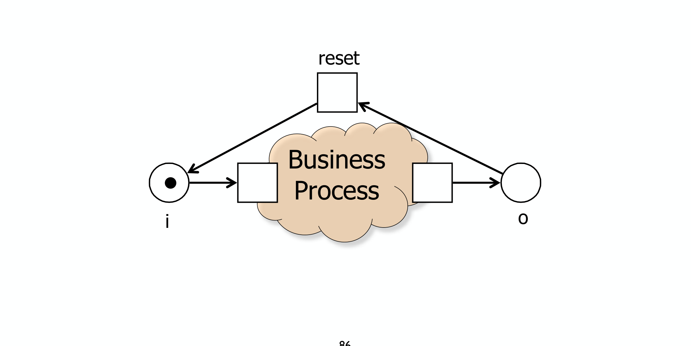

---
tags:
  - università/business-process-modeling
  - workflow-nets
  - soundness
  - verification
data: 2026-07-03
lezione: "12 — Analysis of WF nets (Soundness)"
corso: "MPB (6 cfu, 295AA)"
professore: "Roberto Bruni"
fonte: "Weske, *Business Process Management*, Ch.6"
---

# Soundness

Abbiamo ormai molti strumenti per analizzare i Petri net: reachability graph ([[09 - Occurrence Graph]]), liveness e deadlock-freedom ([[10 - Liveness]]), l'algebra delle matrici ([[11 - Net Matrices]]). Questa lezione li mette al servizio della domanda più importante per un processo di business: **il modello è "corretto"?** Formalizzeremo la nozione di **soundness** (solidità) di un workflow net e — questo è il risultato centrale del corso — la ricondurremo a proprietà che già sappiamo verificare: **liveness e boundedness**.

Ricordiamo la definizione di [[04 - Petri Nets|workflow net]]: un Petri net con un place iniziale $i$ (senza archi entranti), un place finale $o$ (senza archi uscenti), e ogni altro nodo su un cammino da $i$ a $o$.

---

## Correttezza strutturale vs comportamentale

La definizione di workflow net è **puramente strutturale**: dipende solo dalla forma del grafo (connettività, topologia), non dalla marcatura né dagli scatti. Già così esclude molti errori grossolani — nessun punto d'ingresso/uscita, ingressi o uscite multipli, task senza archi, gateway "decorati" male. Ma la struttura **non basta**.

> [!note] Terminologia: net vs net system
>
> Si usa **net system** per un Petri net **con** una marcatura iniziale data (si studiano proprietà *comportamentali*), e **net** per un Petri net **senza** marcatura specificata (si studiano proprietà *strutturali*). Per i workflow net, la marcatura iniziale sarà sempre **un token nel place iniziale** $i$.

Il problema è che la correttezza strutturale **non intercetta** difetti che emergono solo *eseguendo* il processo. Ecco i tipici:

*Fig. — Problemi che la struttura non cattura: **transizioni dead** (mai eseguibili), **token pendenti** lasciati nella rete dopo che il caso è "finito", **attività ancora in corso** alla terminazione. Un altro difetto è il **livelock**: un caso intrappolato in un ciclo senza mai poter terminare.*

Questi difetti sono errori *tipici*, riconoscibili **senza sapere quale sia il vero obiettivo** del processo. È qui che si inserisce la **verification** (rispondere a domande qualitative: c'è un deadlock? tutti i casi terminano? un task è eseguibile?), distinta dalla **validation** (quanto il modello aderisce alla realtà, ai log).

Uno strumento utile è il **linguaggio** del workflow net:

> [!definition] Linguaggio di un workflow net
>
> $L(N) = \{\sigma \mid i \xrightarrow{\sigma} o\}$: l'insieme delle **firing sequence** che portano dalla marcatura iniziale $i$ alla marcatura finale $o$. Definisce **tutte le trace ammissibili** del workflow (ad esempio, un ciclo si manifesta come $L(N) = \{A\,B\,D\,(C\,B\,D)^k\,E \mid k \ge 0\}$).

---

## Soundness

Cosa vuol dire che un processo è "corretto" a prescindere dal suo scopo? Tre cose, intuitivamente.

> [!definition] Soundness (per i business process, informale)
>
> Un processo è **sound** se:
> 1. non contiene **task inutili** (ogni attività può, in qualche esecuzione, essere svolta);
> 2. ogni caso, una volta avviato, può **sempre essere portato a termine** completamente;
> 3. **non restano item pendenti** alla conclusione del caso.

Tradotto sui workflow net, dove "avviare un caso" = mettere un token in $i$ e "concludere" = avere un token in $o$:

> [!definition] Soundness di un workflow net (formale)
>
> Un workflow net è **sound** se valgono tre condizioni:
> 1. **No dead task**: nessuna transizione è dead — $\;\forall t \in T.\; \exists M \in [i\rangle.\; M \xrightarrow{t}$ (ogni transizione è eseguibile in qualche marcatura raggiungibile).
> 2. **Option to complete**: da ogni marcatura raggiungibile si può arrivare a marcare $o$ — $\;\forall M \in [i\rangle.\; \exists M' \in [M\rangle.\; M'(o) \ge 1$.
> 3. **Proper completion**: quando $o$ è marcato, non resta nessun altro token — $\;\forall M \in [i\rangle.\; M(o) \ge 1 \Rightarrow M = o$.

> [!warning] Cosa NON dice l'"option to complete"
>
> La condizione 2 **non** proibisce le iterazioni né impone un limite ai cicli: dice solo che da *qualunque* marcatura raggiungibile deve **essere possibile** raggiungere $o$ in un certo numero di passi. Si assume implicitamente la **fairness**: una transizione non può essere rimandata indefinitamente. Così un ciclo va bene, purché esista sempre una via d'uscita verso $o$.

Verificare la soundness "a forza bruta" significa costruire il reachability graph e controllare: (1) ogni transizione etichetta almeno un arco; (2)+(3) il grafo ha un **unico stato finale** (sink), consistente in un solo token in $o$, raggiungibile da ogni altro stato, e nessun altro stato ha token in $o$. Ma questo è costoso (state explosion), non aiuta a *riparare* i processi, e può essere infinito. Serve un modo migliore.

---

## Il teorema principale: soundness = liveness + boundedness

L'idea geniale è **trasformare** il workflow net in modo da poter riusare le proprietà di liveness e boundedness, che sappiamo già verificare. La trasformazione consiste nell'aggiungere una transizione **reset** che riporta il token da $o$ a $i$: così il processo, invece di fermarsi alla fine, **riparte da capo**, e lo si può "giocare un numero qualsiasi di volte".

*Fig. — La costruzione $N^\star$. Al workflow net $N : i \to o$ si aggiunge la transizione **reset** $: o \to i$. Ogni volta che il processo raggiunge $o$, reset rimette il token in $i$ e il processo può ripartire: $N^\star$ permette **esecuzioni multiple** di $N$.*

> [!definition] La rete $N^\star$
>
> Dato un workflow net $N : i \to o$, la rete $N^\star$ si ottiene aggiungendo la transizione **reset** con $\bullet\text{reset} = \{o\}$ e $\text{reset}\bullet = \{i\}$.

> [!theorem] Main Theorem
>
> $N$ è **sound** $\iff$ $N^\star$ è **live** e **bounded**.

Il teorema è potente perché riconduce una proprietà specifica dei workflow (la soundness) a due proprietà generali dei Petri net, per cui esistono algoritmi e tool (come WoPeD). Vale la pena capire *perché* funziona, legando le tre condizioni di soundness alle due di $N^\star$.

> [!abstract] L'intuizione della dimostrazione
>
> - **$N^\star$ live** ⟹ *no dead task* (cond. 1): se ogni transizione può sempre riscattare in futuro, in particolare nessuna è morta.
> - **$N^\star$ bounded** ⟹ *proper completion* (cond. 3): se non ci fosse proper completion, quando $o$ è marcato resterebbe qualche token extra; reset lo riporterebbe verso $i$ accumulando token a ogni giro → unbounded. La boundedness lo vieta.
> - Insieme, live + bounded ⟹ *option to complete* (cond. 2): la liveness garantisce che reset (e quindi $o$) sia sempre raggiungibile.
>
> Le dimostrazioni formali usano il **marking equation lemma** e il **monotonicity lemma** di [[11 - Net Matrices]]: per esempio, "sound ⟹ $N^\star$ bounded" si prova per assurdo — se $N^\star$ fosse unbounded esisterebbe $i \xrightarrow{\ast} M \xrightarrow{\ast} M'$ con $M \subsetneq M'$; per monotonicità, dal surplus $L = M' - M$ si raggiungerebbe $o + L$ (un token in $o$ *più* dei token extra $L$), violando la proper completion.

---

## Un ingrediente in più: la strong connectedness

C'è una proprietà strutturale che si sposa bene con liveness e boundedness. Ricordiamo le nozioni di connessione, basate sui **cammini** (sequenze di nodi $x_1 \cdots x_k$ con $(x_i, x_{i+1}) \in F$) e **circuiti** (cammini a nodi distinti con $(x_k, x_1) \in F$).

> [!definition] Weakly / strongly connected
>
> Una rete è **weakly connected** se esiste un cammino **non orientato** tra due qualsiasi nodi distinti (non si può spezzare in componenti separate). È **strongly connected** se esiste un cammino **orientato** tra due qualsiasi nodi distinti (equivalentemente: per ogni arco $(x,y)$ esiste un cammino da $y$ a $x$).

La strong connectedness è più forte: nell'esempio "weakly connected ma non strongly connected" si può andare da un capo all'altro solo ignorando le frecce. (Impossibile invece essere strongly ma non weakly connected.) D'ora in poi consideriamo implicitamente solo reti **weakly connected** (altrimenti si studiano i sottosistemi separatamente).

> [!theorem] Teorema di strong connectedness
>
> Se un sistema **weakly connected** è **live** e **bounded**, allora è **strongly connected**.
>
> **Conseguenza (per contrapposizione):** se una rete weakly connected **non** è strongly connected, allora non può essere "live e bounded"; se è live non è bounded, se è bounded non è live. È un test rapido per **escludere** la soundness.

Questo si applica perfettamente a $N^\star$: la transizione reset chiude l'anello da $o$ a $i$ e rende la rete **strongly connected**. Infatti, presi due nodi qualsiasi, un cammino da uno all'altro esiste sempre passando per il "giro" $\cdots \to o \to \text{reset} \to i \to \cdots$ (poiché in $N$ ogni nodo sta su un cammino $i \to o$). Questa è la ragione strutturale per cui l'aggiunta di reset è "innocua" e permette il teorema principale.

Con la soundness abbiamo un criterio di correttezza per i workflow net, verificabile con gli strumenti standard. La prossima lezione si occupa di **come costruire** workflow net sound per costruzione, componendo blocchi corretti. → [[13 - WFnets Construction]]
