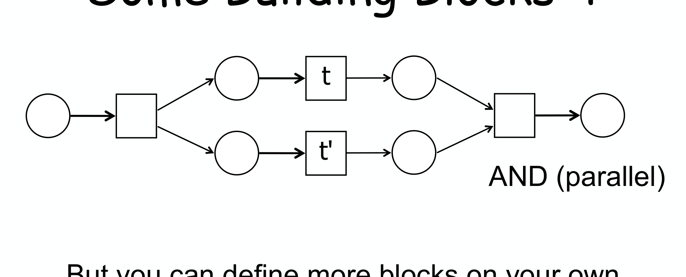

---
tags:
  - università/business-process-modeling
  - workflow-nets
  - soundness
  - refinement
data: 2026-07-03
lezione: "13 — Sound by construction"
corso: "MPB (6 cfu, 295AA)"
professore: "Roberto Bruni"
fonte: "Petri nets · workflow nets"
---

# WF-nets Construction

In [[12 - Soundness]] abbiamo definito la soundness e imparato a **verificarla** su una rete data (via il teorema $N$ sound $\iff N^\star$ live+bounded). Ma la verifica ha un limite: se la rete risulta *non* sound, non ci dice come ripararla, e su reti grandi costa (state explosion). Questa lezione ribalta il problema: invece di **verificare** la soundness a posteriori, la **garantisce per costruzione**. Si parte da mattoni elementari già dimostrati corretti e li si compone con regole che **preservano** la correttezza — così il risultato è sound e safe *by design*, senza bisogno di analizzarlo.

---

## L'idea: costruire, non verificare

La strategia ha due ingredienti.

> [!tip] Soundness per costruzione
>
> 1. Trovare un insieme di **building block**: piccoli workflow net di cui è **facile dimostrare** che sono **sound** e **safe** (1-bounded).
> 2. Definire dei **pattern di composizione** tali che, **componendo** WF net safe e sound, si ottiene ancora un WF net safe e sound.

Il cuore della tecnica è un'operazione di **sostituzione** (refinement): prendere una transizione di una rete e "esploderla", rimpiazzandola con un intero workflow net.

> [!definition] Composizione $N[N'/t]$
>
> Siano $N$ e $N'$ due workflow net safe e sound. Sia $t$ una **task di $N$ con esattamente un input place e un output place**. La rete $N[N'/t]$ si ottiene **rimpiazzando la task $t$ in $N$ con l'intera rete $N'$** (collegando i punti d'ingresso/uscita di $N'$ al posto di $t$).

> [!theorem] Il teorema di composizione
>
> Se $N$ e $N'$ sono workflow net safe e sound, allora $N[N'/t]$ è un workflow net **safe e sound** (dimostrazione omessa).

> [!abstract] Perché funziona (intuizione)
>
> Un workflow net sound, visto **da fuori**, si comporta *esattamente come una transizione*: prende un token dal suo input place e ne produce uno nel suo output place — solo, **non atomicamente** (nel mezzo fa il suo lavoro interno). Quindi rimpiazzare una transizione con un WF net sound non altera il comportamento globale. Formalmente, la dimostrazione costruisce una **corrispondenza biunivoca** tra le marcature della rete composta $N[N'/t]$ e le **coppie** di marcature di $N$ e $N'$.

Perché il collegamento funzioni, servono due lemmi sulle transizioni "di bordo":

> [!note] Transizioni iniziali e finali
>
> - Una transizione $t$ è **iniziale** se c'è un arco dal place iniziale $i$ a $t$. In un WF net sound, se $t$ è iniziale allora $\bullet t = \{i\}$ (altrimenti $t$ sarebbe dead, perché all'inizio l'unico token è in $i$).
> - Una transizione $t$ è **finale** se c'è un arco da $t$ al place finale $o$. In un WF net sound, se $t$ è finale allora $t\bullet = \{o\}$ (altrimenti $t$ sarebbe dead, oppure violerebbe la proper completion lasciando token oltre a quello in $o$).
>
> Questi vincoli assicurano che, sostituendo $N'$ al posto di $t$, le sue transizioni iniziali si aggancino puliti all'input di $t$ e quelle finali all'output.

---

## Il catalogo dei building block

Ecco i mattoni di base, tutti workflow net sound e safe (verificabili a mano). Sono le "istruzioni" con cui comporre qualunque processo.

*Fig. — Building blocks 1. **Basic**: la singola task. **Sequence**: $t$ poi $t'$. **Implicit XOR**: dal place iniziale, $t$ *oppure* $t'$ (scelta implicita, deferred). **Iteration**: un ciclo che può ripetersi; i place laterali sono marcati "not i / not o" perché un blocco interno non può usare direttamente l'ingresso/uscita globali.*

Oltre a questi ci sono le varianti esplicite della scelta e la concorrenza:

- **Explicit XOR-split / XOR-join**: la scelta risolta da una transizione dedicata (invece che dalla competizione sul place).
- **XOR block**: split e join esplicito racchiusi in un blocco.
- **AND (parallel)**: la concorrenza vera dei Petri net, con una transizione che apre due rami e una che li richiude.

*Fig. — Il blocco **AND (parallel)**: una transizione di split attiva entrambi i rami $t$ e $t'$, una di join attende il completamento di entrambi. È il pattern di parallelismo dei Petri net ([[04 - Petri Nets]]). Esiste anche una variante **AND with sync**. E, naturalmente, "you can define more blocks on your own".*

---

## Refinement e abstraction

La composizione si usa in due direzioni complementari:

- **Refinement** (raffinamento): si parte da una rete astratta e si **espande** progressivamente una transizione alla volta, sostituendola con un blocco più dettagliato. Ogni passo preserva soundness e safeness.
- **Abstraction** (astrazione): il procedimento inverso, utile per **dimostrare** che una rete complessa è sound — la si "riconosce" come composizione di blocchi noti, riducendola passo dopo passo (una iteration qui, un XOR block lì, una sequence, un blocco parallelo...) fino a un unico blocco basic. Se ogni riduzione è un pattern valido, la rete di partenza è sound per costruzione.

### Esempio di design: Car Damage

L'esempio riassuntivo è un processo assicurativo di gestione danni auto, costruito interamente componendo blocchi:

*Fig. — Design del Car Damage. Il processo è assemblato da blocchi: **choice** (classify: simple/complex; decide: OK/NOK), **AND parallel** (phone garage ∥ check insurance nel ramo simple), **sequence** (nel ramo complex). Essendo ogni blocco sound+safe e le composizioni valide, il risultato è **"sound and safe by construction"** — senza costruire il reachability graph.*

---

## Generalizzazione: sostituire transizioni con più archi

Finora abbiamo raffinato solo task con **un** input e **un** output. Il metodo si estende a transizioni con **più archi entranti e uscenti**, con una regola di ricablaggio precisa.

*Fig. — General replacement. Detti $T_{i'} = \{u \mid \bullet u = \{i'\}\}$ le transizioni **iniziali** di $N'$ e $T_{o'} = \{v \mid v\bullet = \{o'\}\}$ le **finali**, il ricablaggio è: ogni arco $(p,t)$ di $N$ diventa $(p, u)$ per ogni transizione iniziale $u$; ogni arco $(t,q)$ diventa $(v, q)$ per ogni transizione finale $v$. Anche così, $N[N'/t]$ resta un WF net **sound e safe**.*

> [!tip] Il valore pratico della tecnica
>
> Costruire per composizione dà **due garanzie gratis**: la rete è sound (nessun deadlock, nessun token pendente, nessuna task morta) e safe (1-bounded), **senza analisi**. È l'analogo, per i processi, della programmazione strutturata: comporre costrutti corretti (sequenza, scelta, ciclo, parallelo) dà programmi corretti per costruzione. Il prezzo è una minor libertà — non tutti i WF net sound sono ottenibili così — ma per il design pratico è un ottimo compromesso.

Con la costruzione per blocchi chiudiamo la teoria fondamentale dei workflow net. Le prossime lezioni introdurranno strumenti di analisi più avanzati, come gli **invarianti**. → [[14 - Invariants]]
