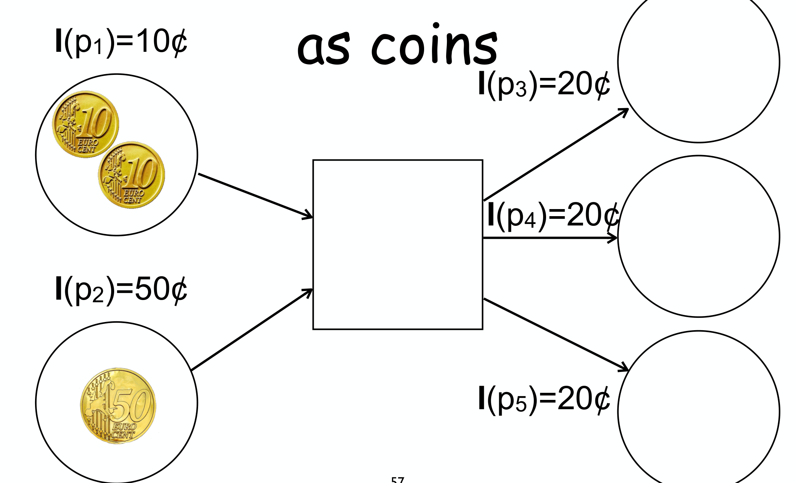

---
tags:
  - università/business-process-modeling
  - petri-nets
  - invariants
  - s-invariant
  - t-invariant
data: 2026-07-03
lezione: "14 — Invariants"
corso: "MPB (6 cfu, 295AA)"
professore: "Roberto Bruni"
fonte: "Petri nets · Esparza, *Free Choice Petri Nets* (optional)"
---

# Invariants

Con l'algebra delle matrici ([[11 - Net Matrices]]) abbiamo visto che si può ragionare sulle reti **senza** costruire l'occurrence graph. Questa lezione porta l'idea al suo culmine con gli **invarianti**: certe quantità che **restano costanti** durante ogni esecuzione, calcolabili direttamente dalla struttura della rete. Un solo invariante può dimostrare in una riga proprietà che altrimenti richiederebbero di esplorare tutti gli stati — per esempio "questa rete è bounded" o "questa marcatura non è raggiungibile". Studieremo due tipi duali: gli **S-invariant** (sui place) e i **T-invariant** (sulle transizioni).

> [!definition] Invariante
>
> Un **invariante** di un sistema dinamico è un'asserzione che **vale in ogni stato raggiungibile**. Esempi fuori dai Petri net: il perimetro e il numero di lati di un poligono restano invarianti se lo ruoti o lo trasli (ma il perimetro *cambia* se lo scali). In un Petri net, gli stati sono le marcature e le "mosse" sono gli scatti: un invariante è una proprietà vera per *tutte* le marcature raggiungibili.

> [!note] Anche le proprietà comportamentali sono invarianti
>
> Liveness, deadlock-freedom, boundedness e ciclicità sono tutte **ereditarie**: se valgono da $M_0$, valgono anche ripartendo da *qualsiasi* marcatura raggiungibile $M$. (Es. se il sistema è live e $M \in [M_0\rangle$, allora anche $(P,T,F,M)$ è live: ogni $M'$ raggiungibile da $M$ è raggiungibile da $M_0$, dove la liveness vale.) La **ciclicità** — $\forall M \in [M_0\rangle.\; M_0 \in [M\rangle$, cioè "si può sempre tornare a $M_0$" — è un altro esempio di questa famiglia.

Ma l'interesse vero sono gli **invarianti strutturali**, calcolati dalla sola struttura della rete (l'incidence matrix) e **indipendenti dalla marcatura iniziale**.

> [!tip] Perché gli invarianti
>
> - Si calcolano **efficientemente** (tempo polinomiale per una base), a differenza della raggiungibilità (EXPSPACE-hard).
> - Sono **indipendenti dalla marcatura iniziale**: una proprietà strutturale con conseguenze comportamentali.
> - Ragione didattica (dice il prof): *capisci davvero un modello solo quando lo pensi in termini di invarianti.*

---

## S-invariant: pesi sui place, somma conservata

L'idea di un **S-invariant** (o *place-invariant*) è assegnare un **peso** a ogni place in modo che la **somma pesata dei token** non cambi mai, qualunque scatto avvenga. L'immagine mentale migliore è quella delle **monete**.

*Fig. — Token come monete. L'S-invariant $I$ assegna a ogni place un "valore". Uno scatto conserva il valore totale solo se **quello che entra vale quanto quello che esce**: qui la transizione toglie $10\text{¢}+50\text{¢} = 60\text{¢}$ e ne produce $20\text{¢} \cdot 3 = 60\text{¢}$. Se questo vale per *ogni* transizione, la somma pesata dei token è un invariante.*

Questa condizione "valore in ingresso = valore in uscita, per ogni transizione" si scrive in forma matriciale in modo compatto.

> [!definition] S-invariant
>
> Un **S-invariant** di una rete $N=(P,T,F)$ è un vettore $I$ (di lunghezza $|P|$, a valori razionali) che soddisfa
> $$I \cdot \mathbf{N} = \mathbf{0}$$
> dove $\mathbf{N}$ è l'incidence matrix. È un sistema lineare **omogeneo**: la soluzione banale $I = \mathbf{0}$ c'è sempre, e **ogni combinazione lineare di S-invariant è ancora un S-invariant** (quindi le soluzioni formano uno spazio vettoriale).

C'è una caratterizzazione equivalente, spesso più comoda perché si legge **direttamente sul disegno** senza calcolare la matrice:

> [!definition] S-invariant (definizione alternativa)
>
> $I : P \to \mathbb{Q}$ è un S-invariant se e solo se, **per ogni transizione** $t$, il peso totale in ingresso eguaglia quello in uscita:
> $$\sum_{p \in \bullet t} I(p) = \sum_{p \in t\bullet} I(p)$$
> È esattamente la condizione "monete in = monete out" della figura, transizione per transizione.

### La proprietà fondamentale

Il motivo per cui gli S-invariant sono utili è un solo teorema, semplice ma potente.

> [!theorem] Proprietà fondamentale degli S-invariant
>
> Se $I$ è un S-invariant, allora per **ogni** marcatura raggiungibile $M \in [M_0\rangle$:
> $$I \cdot M = I \cdot M_0$$
> Cioè la **somma pesata dei token è costante** durante tutta l'esecuzione.
>
> *Dimostrazione.* Se $M \in [M_0\rangle$, c'è $\sigma$ con $M_0 \xrightarrow{\sigma} M$. Per la marking equation ([[11 - Net Matrices]]):
> $$M = M_0 + \mathbf{N}\cdot\vec{\sigma}$$
> Allora, moltiplicando entrambi i membri per $I$:
> $$I \cdot M = I \cdot M_0 + I \cdot \mathbf{N} \cdot \vec{\sigma} = I \cdot M_0 + \mathbf{0} \cdot \vec{\sigma} = I \cdot M_0$$
> perché $I \cdot \mathbf{N} = \mathbf{0}$. $\blacksquare$

Vediamolo su un esempio concreto — il modello di due semafori — che mostra anche come **combinare** più invarianti:

![Rete dei due semafori con S-invariant: [1 1 1 0 0 0 0] (un token totale tra i place del primo semaforo) e [0 0 0 0 1 1 1] (un token totale nel secondo); la loro combinazione [1 1 0 1 1 1 0] e la somma [2 2 1 1 2 2 1]](assets/14-invariants_p79_traffic-lights.png)
*Fig. — Esempio dei semafori. $[1\,1\,1\,0\,0\,0\,0]$ è un S-invariant: "la somma dei token nei tre place del primo semaforo è costante" (= 1, il semaforo è sempre in *uno* stato). Analogamente $[0\,0\,0\,0\,1\,1\,1]$ per il secondo. Poiché le combinazioni lineari sono ancora invarianti, si possono sommare per ottenerne altri (in fondo $[2\,2\,1\,1\,2\,2\,1]$).*

### A cosa servono gli S-invariant

Dalla proprietà fondamentale discendono tre usi pratici. Prima serve una classificazione dei possibili S-invariant, in base al segno dei pesi.

> [!definition] S-invariant semi-positive e positive
>
> - **Semi-positive**: $I \ge \mathbf{0}$ e $I \ne \mathbf{0}$ — nessun peso negativo, e almeno un peso strettamente positivo.
> - **Positive**: $I(p) > 0$ per **ogni** place $p$ — tutti i pesi strettamente positivi (caso più forte, implica semi-positive).
> - Il **support** $\langle I \rangle = \{p \mid I(p) > 0\}$ è l'insieme dei place con peso positivo. Per un invariante positive, il support è **tutto** $P$.

> [!theorem] 1) Boundedness (condizione sufficiente)
>
> Se la rete ha un S-invariant **positive**, allora è **bounded**. Anzi, ogni place è limitato esplicitamente: da
> $$I(p)\,M(p) \le I\cdot M = I\cdot M_0$$
> segue
> $$M(p) \le \frac{I \cdot M_0}{I(p)}$$
> un limite **indipendente** dalla marcatura raggiungibile. Basta dunque *esibire* un S-invariant positive per certificare la boundedness — senza esplorare gli stati.

> [!theorem] 2) Disprovare la liveness
>
> Se la rete è **live**, allora per ogni S-invariant semi-positive $I$ vale $I \cdot M_0 > 0$. Per contrapposizione: **se troviamo un S-invariant semi-positive con $I \cdot M_0 = 0$, la rete non è live.** (Se il valore iniziale è zero e i pesi sono $\ge 0$, i place del support restano vuoti per sempre → le transizioni collegate sono dead.)

> [!theorem] 3) Disprovare la raggiungibilità
>
> Poiché $I \cdot M = I \cdot M_0$ per ogni $M$ raggiungibile, **se una marcatura $M$ ha $I \cdot M \ne I \cdot M_0$ per qualche S-invariant $I$, allora $M$ non è raggiungibile.** È un test veloce che evita di risolvere il problema di raggiungibilità completo (EXPSPACE-hard).

> [!warning] Le implicazioni non si invertono
>
> Attenzione: sono condizioni *sufficienti* o *necessarie*, non equivalenze. **Niente** S-invariant positive ⟹ *forse* unbounded (non è detto). $I \cdot M_0 > 0$ ⟹ *forse* live. $I \cdot M = I \cdot M_0$ ⟹ *forse* $M$ raggiungibile. Gli invarianti danno certezze solo "in un verso".

---

## T-invariant: il ragionamento duale

Gli S-invariant nascono dall'equazione $I \cdot \mathbf{N} = \mathbf{0}$ (vettori a sinistra della matrice). Viene naturale chiedersi cosa si ottiene dall'equazione **duale**, con i vettori a destra: $\mathbf{N} \cdot y = \mathbf{0}$.

> [!definition] T-invariant
>
> Un **T-invariant** (o *transition-invariant*) di $N=(P,T,F)$ è un vettore $J$ (di lunghezza $|T|$, razionale) che soddisfa
> $$\mathbf{N} \cdot J = \mathbf{0}$$
> La caratterizzazione alternativa, leggibile sul disegno: $J$ è un T-invariant se e solo se **per ogni place** $p$, $\sum_{t \in \bullet p} J(t) = \sum_{t \in p\bullet} J(t)$ (i token prodotti in $p$ eguagliano quelli consumati).

Mentre un S-invariant è un peso *sui place* con significato "valore conservato", un T-invariant è un conteggio *sulle transizioni* con un significato diverso e altrettanto elegante.

> [!theorem] Proprietà fondamentale dei T-invariant
>
> Sia $M \xrightarrow{\sigma} M'$. Il Parikh vector $\vec{\sigma}$ è un T-invariant **se e solo se** $M' = M$.
>
> In parole: un T-invariant è **un insieme di scatti (con molteplicità) che riporta la rete esattamente alla marcatura di partenza**. La dimostrazione è immediata dalla marking equation:
> $$M' = M + \mathbf{N}\cdot\vec{\sigma}$$
> quindi
> $$M' = M \iff \mathbf{N}\cdot\vec{\sigma} = \mathbf{0}$$

![Rete persons/bikes/riders: i place persons (1 token) e bikes (3 token) alimentano la transizione take, che produce un token in riders; leave riporta i token in persons e bikes. Il T-invariant è [1 1]: eseguire take una volta e leave una volta riporta alla marcatura iniziale](assets/14-invariants_p134_t-invariant.png)
*Fig. — Un T-invariant facile da trovare. Nella rete "noleggio bici", `take` (persona+bici → rider) e `leave` (rider → persona+bici) sono l'una l'inversa dell'altra: il T-invariant $J = [1,1]$ dice che **eseguendo `take` una volta e `leave` una volta si torna allo stato di partenza**. L'ordine non conta (il Parikh vector lo dimentica).*

### A cosa servono i T-invariant

Il risultato chiave lega T-invariant, boundedness e liveness, e usa il **principio dei cassetti** (pigeonhole): se un cammino attraversa più stati di quanti ne esistano, uno stato si ripete.

> [!theorem] Bounded + live ⟹ positive T-invariant
>
> Se un sistema **bounded** ha una sequenza infinita di scatti (cosa garantita dalla liveness), allora — poiché gli stati raggiungibili sono finiti — per il pigeonhole una marcatura $M_i$ si ripete:
> $$M_i \xrightarrow{\sigma'} M_j = M_i$$
> Il Parikh vector di $\sigma'$ è un T-invariant (*reproduction lemma*). Con la liveness si può fare in modo che coinvolga *tutte* le transizioni, ottenendo un T-invariant **positive**.

Per contrapposizione si ricavano test utili:

> [!note] Usi dei T-invariant
>
> - **Disprovare la boundedness**: un sistema *live* **senza** T-invariant positive è **unbounded**.
> - **Disprovare la liveness**: un sistema *bounded* **senza** T-invariant positive è **non-live**. (In particolare, se una rete ha un S-invariant positive — quindi è bounded — ma nessun T-invariant positive, allora **non può essere live**.)
> - In generale, **nessun T-invariant positive ⟹ non (live e bounded)**: o è non-live, o è unbounded.

---

## Il quadro d'insieme: S- e T-invariant insieme

I due tipi di invariante sono complementari e, presi insieme, dicono molto sulla struttura globale della rete.

> [!theorem] Strong connectedness via invarianti
>
> Se una rete **weakly connected** ha **sia** un S-invariant positive **sia** un T-invariant positive, allora è **strongly connected**.
>
> Conseguenza (contrapposta): una rete weakly connected ma **non** strongly connected non può avere entrambi. Combinato con quanto visto in [[12 - Soundness]] (weakly connected + live + bounded ⟹ strongly connected), questo dà criteri strutturali rapidi per escludere soundness e altre buone proprietà.

> [!abstract] Riepilogo: cosa provano gli invarianti
>
> | Strumento | Prova / dimostra | Come |
> |---|---|---|
> | **S-invariant positive** | boundedness | esibirne uno |
> | **S-invariant semi-positive** con $I\cdot M_0 = 0$ | non-liveness | esibirne uno |
> | **S-invariant** con $I\cdot M \ne I\cdot M_0$ | $M$ non raggiungibile | esibirne uno |
> | **T-invariant positive** (assente, con liveness) | unboundedness | mostrarne l'assenza |
> | **T-invariant positive** (assente, con boundedness) | non-liveness | mostrarne l'assenza |
>
> Il filo conduttore: gli invarianti trasformano domande sul *comportamento* (esplorare infiniti stati) in **calcoli di algebra lineare** sulla struttura.

Gli invarianti sono l'apice degli strumenti algebrici del corso. Le prossime lezioni li applicano a classi speciali di reti (come i sistemi S e T) e all'analisi dei processi. → [[15 - S-T Systems]]
