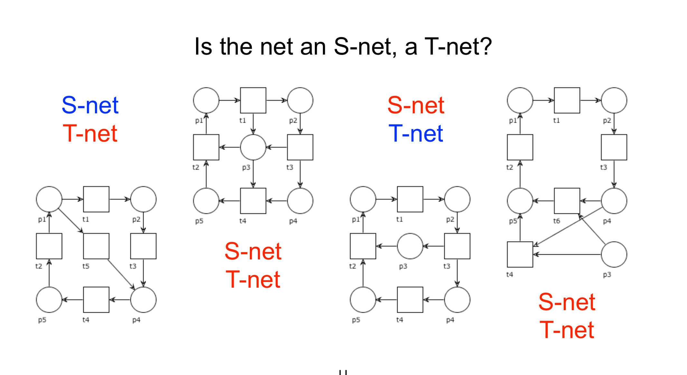
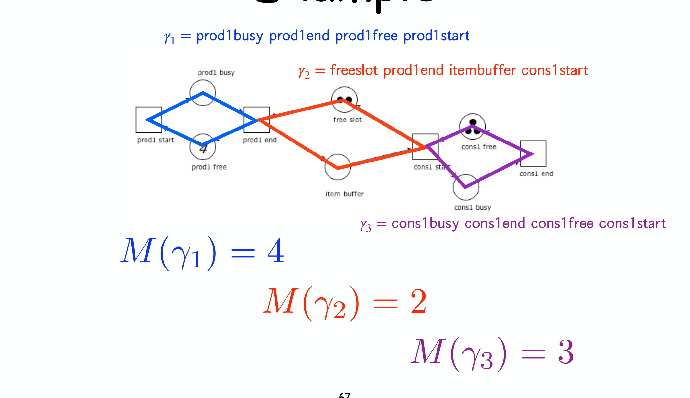
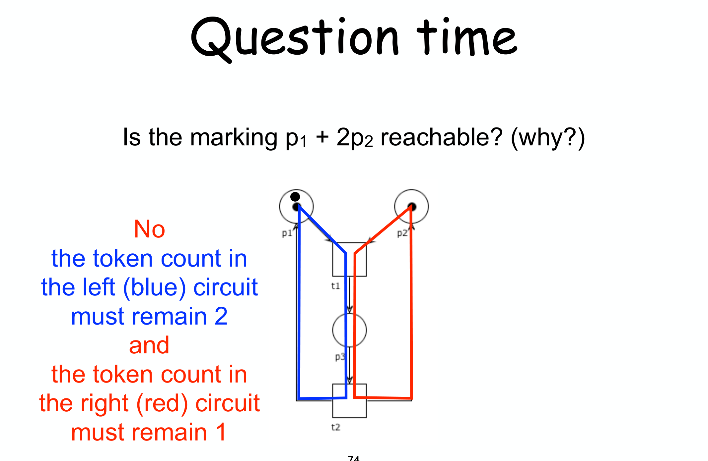

---
tags:
  - università/business-process-modeling
  - petri-nets
  - s-systems
  - t-systems
  - structural-analysis
data: 2026-07-03
lezione: "15 — S-systems and T-systems"
corso: "MPB (6 cfu, 295AA)"
professore: "Roberto Bruni"
fonte: "Petri nets · Esparza, *Free Choice Petri Nets* (optional)"
---

# S/T-Systems

Le proprietà comportamentali (boundedness, liveness) sono costose da verificare in generale, perché richiedono di esplorare gli stati. L'idea di questa lezione è: **restringere la classe di reti** a due famiglie particolarmente "pulite" e, per esse, dare **caratterizzazioni puramente strutturali** di quelle proprietà — controllabili guardando solo la forma del grafo, senza token game. Le due famiglie sono gli **S-system** (che vietano la sincronizzazione) e i **T-system** (che vietano la scelta), e sono l'una il **duale** dell'altra.

Il problema che vogliamo evitare è l'**interferenza tra conflitti e sincronizzazione**: in una rete generale due transizioni possono passare dall'essere indipendenti all'essere in conflitto a seconda di cosa scatta prima, e questo rende l'analisi difficile. Restringendo la struttura, questa interferenza scompare.

---

## Le due classi: S-net e T-net

La distinzione è sorprendentemente semplice e riguarda quanti archi hanno i nodi.

> [!definition] S-net e T-net
>
> - Una rete è un **S-net** se **ogni transizione ha esattamente un input place e un output place**:
>
> $$\forall t.\; |\bullet t| = 1 = |t\bullet|$$
>
> (La S viene da *Stellen*, "place" in tedesco.) Una transizione così **non può sincronizzare** (non aspetta più input) né **spezzare** (non produce più output): la sincronizzazione è **vietata**.
> - Una rete è un **T-net** se **ogni place ha esattamente una input transition e una output transition**:
>
> $$\forall p.\; |\bullet p| = 1 = |p\bullet|$$
>
> Un place così **non può essere conteso** da più transizioni: la **scelta/conflitto è vietata**. I T-net sono **concorrenti ma deterministici**.

*Fig. — Classificare S-net e T-net. Si guarda ogni transizione (per S-net: una freccia in, una out) e ogni place (per T-net: una in, una out). Le due proprietà sono indipendenti: una rete può essere solo S, solo T, entrambe, o nessuna delle due.*

Un **S-system** (risp. **T-system**) è semplicemente un net system $(N, M_0)$ dove $N$ è un S-net (risp. T-net). La bellezza è che per queste classi tutto diventa facile — al punto che, come vedremo, valgono due "take-home message" fortissimi sui workflow net.

---

## S-systems: la conservazione dei token

Poiché in un S-net ogni transizione toglie **esattamente un** token da un place e ne mette **esattamente uno** in un altro, il numero totale di token nella rete non cambia mai. È l'analogo di una legge di conservazione.

> [!theorem] Proprietà fondamentale degli S-system
>
> Il **numero totale di token** è invariante. Detto $M(P) = \sum_{p \in P} M(p)$ il conteggio totale, per ogni marcatura raggiungibile $M \in [M_0\rangle$ vale:
>
> $$M(P) = M_0(P)$$
>
> *Perché:* ogni scatto fa
>
> $$M'(P) = M(P) - |\bullet t| + |t\bullet| = M(P) - 1 + 1 = M(P)$$

Da questo discendono subito diverse conseguenze, tutte immediate.

> [!note] Conseguenze immediate per gli S-system
>
> - **Sempre bounded**: da
>
> $$M(p) \le M(P) = M_0(P)$$
>
> nessun place può superare $M_0(P)$ token. Un S-system è k-bounded con $k = M_0(P)$.
> - **Test di raggiungibilità gratis**: se $M(P) \ne M_0(P)$, allora $M$ **non è raggiungibile**. (Es. se parto con 6 token in totale, una marcatura con 7 token è impossibile.)
> - **S-invariant uniformi**: gli unici S-invariant di un S-net connesso sono i vettori costanti $I = [k, k, \dots, k]$ — coerente con "ogni token vale uguale, la somma si conserva".

E la liveness? Ha una caratterizzazione **puramente strutturale**, il primo dei risultati che cercavamo.

> [!theorem] Liveness degli S-system
>
> Un S-system $(N, M_0)$ è **live** $\iff$
>
> $$N \text{ è strongly connected} \quad \text{e} \quad M_0(P) \ge 1$$
>
> *Intuizione ($\Leftarrow$):* con un token in giro e strong connectedness, per abilitare una qualsiasi transizione $t$ basta **spostare il token fino a lei** lungo un cammino (che esiste, per la strong connectedness); poiché ogni transizione dell'S-net sposta solo il token, la si può portare dove serve.

Combinando conservazione e strong connectedness si ottiene anche una caratterizzazione **esatta della raggiungibilità** — cosa rarissima, dato che in generale è EXPSPACE-hard.

> [!theorem] Raggiungibilità negli S-system live
>
> In un S-system **live** (quindi strongly connected), una marcatura $M$ è **raggiungibile** $\iff$
>
> $$M(P) = M_0(P)$$
>
> Cioè: basta contare i token. Se $M$ ha lo stesso numero totale di token di $M_0$, allora è raggiungibile (li si sposta uno per volta nei place giusti sfruttando i cammini); altrimenti no.

> [!tip] Take-home message (S-net)
>
> **Ogni workflow net che sia un S-net è safe e sound.** La catena: un WF net S-net ha $N^\star$ ancora S-net → è bounded; è strongly connected (perché è un WF net con reset) e $M_0(P)=1$ → $N^\star$ è live; live + bounded $\iff$ $N$ sound ([[12 - Soundness]]). Il singolo token che scorre garantisce automaticamente la correttezza.

---

## T-systems: la conservazione sui circuiti

Passiamo al duale. In un T-net non c'è conservazione del numero *totale* di token (una transizione può avere più input e output place). Ma c'è una conservazione più sottile, sui **circuiti**.

Ricordiamo che un **circuito** è un cammino ciclico $\gamma$; scriviamo $M(\gamma)$ per il numero di token nei place del circuito, e diciamo che $\gamma$ è **marcato** se $M(\gamma) > 0$.

> [!theorem] Proprietà fondamentale dei T-system
>
> Il **conteggio dei token di ogni circuito** è invariante: per ogni circuito $\gamma$ e ogni $M \in [M_0\rangle$:
>
> $$M(\gamma) = M_0(\gamma)$$
>
> *Perché:* prendi una transizione $t$. In un T-net, o $t$ non tocca il circuito $\gamma$ (allora non ne cambia i token), oppure lo tocca — ma allora consuma da **esattamente un** place di $\gamma$ e produce in **esattamente un** place di $\gamma$ (per la struttura 1-in-1-out dei place), quindi il conteggio resta invariato. In ogni caso $M(\gamma)$ non cambia.

*Fig. — I circuiti di un T-system e i loro conteggi. Ogni circuito è come un "anello" con un numero fisso di token che ci girano dentro: $M(\gamma_1)=4$, $M(\gamma_2)=2$, $M(\gamma_3)=3$ resteranno tali per sempre. È l'analogo, sui circuiti, della conservazione totale degli S-system.*

Anche qui le conseguenze sono immediate e speculari a quelle degli S-system.

> [!note] Conseguenze per i T-system
>
> - **Test di raggiungibilità**: se $M(\gamma) \ne M_0(\gamma)$ per qualche circuito $\gamma$, allora $M$ **non è raggiungibile**.
> - **Boundedness da strong connectedness**: se un T-system è strongly connected, è **bounded** (ogni place sta in qualche circuito, il cui conteggio è limitato). È **safe** se $M_0(P)=1$ (o più in generale se ogni circuito ha $\le 1$ token).
> - **T-invariant uniformi**: gli unici T-invariant di un T-net connesso sono i vettori costanti $J = [k, \dots, k]$ (duale del risultato sugli S-net).

*Fig. — Usare i circuiti per la raggiungibilità. Ogni circuito ha un budget fisso di token: se la marcatura-obiettivo viola anche un solo budget (qui il circuito blu deve valere 2, il rosso 1), quella marcatura è irraggiungibile — senza costruire alcun reachability graph.*

E la liveness dei T-system? Anch'essa strutturale, ed è forse il criterio più elegante della lezione.

> [!theorem] Liveness dei T-system
>
> Un T-system $(N, M_0)$ è **live** $\iff$ **ogni circuito** di $N$ è **marcato** in $M_0$, cioè:
>
> $$M_0(\gamma) > 0 \quad \text{per ogni circuito } \gamma$$
>
> *Intuizione ($\Rightarrow$ per assurdo):* se un circuito $\gamma$ ha zero token, per la proprietà fondamentale **resterà vuoto per sempre**; ma allora una transizione che ha un input place in $\gamma$ non riceverà mai un token da lì e non scatterà mai → è dead → non live. Viceversa, se ogni circuito ha almeno un token, si dimostra che ogni transizione può sempre essere riabilitata.

---

## Il quadro duale e le conseguenze sui workflow net

Le due teorie sono l'una lo specchio dell'altra. Vale la pena vederle affiancate.

> [!abstract] S-system vs T-system: la dualità
>
> | | **S-system** | **T-system** |
> |---|---|---|
> | Vincolo | ogni **transizione** 1-in-1-out | ogni **place** 1-in-1-out |
> | Vieta | la **sincronizzazione** | la **scelta / conflitto** |
> | Conservazione | token **totali** $M(P)$ | token per **circuito** $M(\gamma)$ |
> | Sempre bounded? | **sì** (bounded da $M_0(P)$) | se **strongly connected** |
> | Live $\iff$ | strongly connected + $M_0(P)\ge1$ | ogni circuito marcato |
> | Invariante uniforme | S-invariant $[k\dots k]$ | T-invariant $[k\dots k]$ |
>
> La simmetria è perfetta scambiando *place ↔ transition*, *token totali ↔ token dei circuiti*, *sincronizzazione ↔ scelta*.

Il pagamento finale sono due criteri di **soundness verificabili a occhio** sui workflow net, senza alcuna analisi comportamentale.

> [!theorem] Soundness strutturale dei workflow net
>
> - **Se un workflow net $N$ è un S-net, allora è safe e sound.** (Un solo caso che scorre, nessuna sincronizzazione: la correttezza è automatica.)
> - **Se un workflow net $N$ è tale che $N^\star$ è un T-net, allora $N$ è safe e sound $\iff$ ogni circuito di $N^\star$ è marcato.** (Nota: $N$ stesso non può essere un T-net, perché il place $i$ non ha input e $o$ non ha output; ma $N^\star$, con la transizione reset, può esserlo.)

Questi due teoremi sono il coronamento del percorso sui Petri net: partiti dal disegno intuitivo, siamo arrivati a **certificare la correttezza di un processo controllando solo la struttura del grafo**. Nelle prossime lezioni torneremo alle notazioni di alto livello (EPC, BPMN) per applicarvi questi strumenti di analisi. → [[16a - EPC Analysis]]
