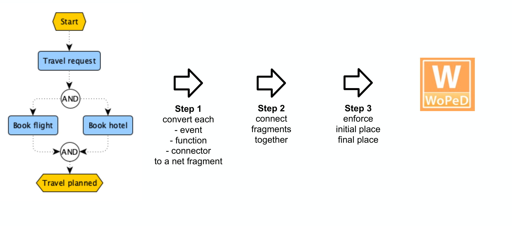
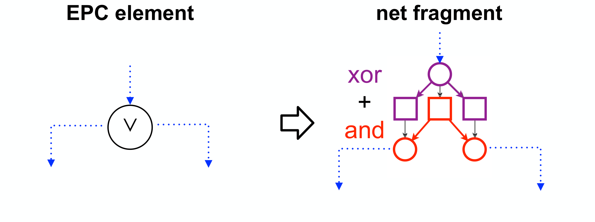
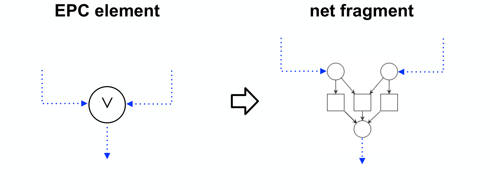
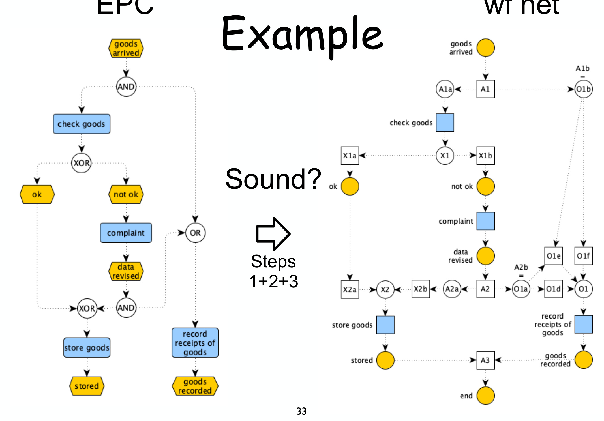
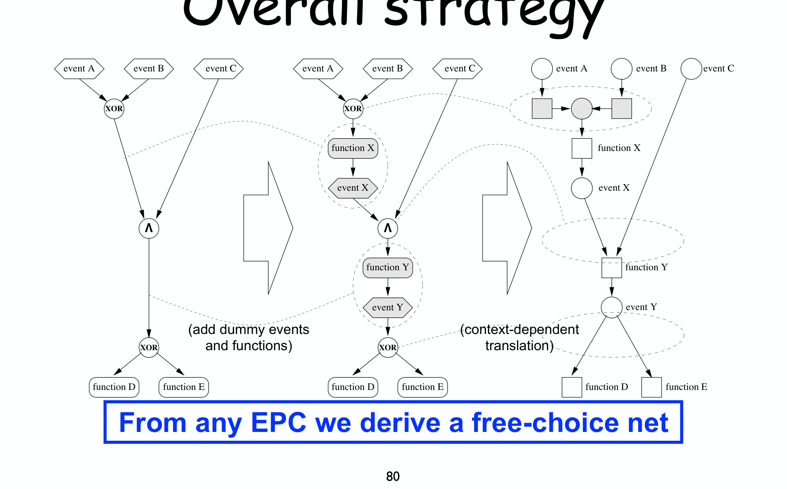

---
tags:
  - università/business-process-modeling
  - epc
  - workflow-nets
  - soundness
  - translation
data: 2026-07-04
lezione: "16a — EPC analysis"
corso: "MPB (6 cfu, 295AA)"
professore: "Roberto Bruni"
fonte: "Weske, *Business Process Management*, Ch.6"
---

# EPC Analysis

Con le lezioni precedenti abbiamo costruito una teoria completa per i Petri net: sappiamo verificare boundedness, liveness e — per i workflow net — la [[12 - Soundness|soundness]]. Ora chiudiamo il cerchio tornando alle notazioni di alto livello: gli **EPC** (Event-driven Process Chain), introdotti in [[07a - EPC e BPMN]]. Il problema è che gli EPC sono nati come linguaggio **informale**, pensato per la comunicazione fra persone: sono semplici e piacciono, ma **non hanno una semantica formale univoca**. Diagrammi ambigui o addirittura scorretti possono nascere già in fase di design.

L'idea di questa lezione è dare agli EPC una semantica precisa **traducendoli in workflow net**, così da poter riusare tutti gli strumenti di verifica:

> [!abstract] La strategia in una frase
>
> Traduciamo l'EPC in un workflow net $N$; diciamo che **l'EPC è sound se il suo net $N$ è sound**. La soundness del net la sappiamo già verificare (liveness + boundedness di $N^\star$, anche con tool come WoPeD). **Attenzione:** *non* esiste un unico modo di tradurre — vedremo tre approcci diversi, con pregi e difetti differenti.

*Fig. — Un tipico EPC: eventi (esagoni), functions (rettangoli), connettori $\wedge$ (AND), $\vee$ (OR), XOR. Vogliamo capire se un processo così è "corretto" — e per farlo lo trasformiamo in un Petri net.*

---

## Gli ingredienti di un EPC e la loro traduzione

Un EPC è fatto di pochi elementi. Il punto di partenza della traduzione è una corrispondenza naturale con i pezzi di un Petri net.

> [!definition] Corrispondenza EPC ↔ net (commonalities)
>
> | Elemento EPC | Frammento di net |
> |---|---|
> | **event** (esagono) | **place** |
> | **function** (rettangolo) | **transition** |
> | **control flow** (arco tratteggiato) | **arco** |
> | **connector** ($\wedge$, $\vee$, XOR) | piccolo **frammento** di net (vedi sotto) |
>
> L'intuizione è coerente con la semantica dei net: un event è uno *stato* del processo (come un place che "contiene" o meno un token), una function è un *task* che avviene (come una transition che scatta).

La traduzione vera e propria segue **tre step**.

*Fig. — Da EPC a wf net in tre step, verificabili poi con un tool come WoPeD.*

> [!note] I tre step della traduzione
>
> 1. **Step 1 — frammenti locali**: si sostituisce *separatamente* ogni event, function e connector con un piccolo frammento di net.
> 2. **Step 2 — connessione dei frammenti**: si "cuciono" insieme i frammenti. Due stili possibili (vedi sotto): *dummy style* o *fusion style*.
> 3. **Step 3 — unico inizio / unica fine**: un workflow net richiede **un solo** place iniziale $i$ e **un solo** place finale $o$. Se l'EPC ha più eventi start (o più eventi end), li si unifica con un connettore (tipicamente XOR per lo start; XOR/AND/OR per l'end a seconda del significato voluto).

### Step 2: dummy style vs fusion style

Quando si collegano due frammenti, il primo produce un place-di-uscita e il secondo si aspetta un place-di-ingresso: mettendoli insieme rischiamo di avere *due place consecutivi* (o due transition consecutive), che nei Petri net non è ammesso (place e transition devono alternarsi).

- **Dummy style**: si inserisce un elemento "fittizio" di raccordo — una **dummy transition** fra due place, o un **dummy place** fra due transition — per ripristinare l'alternanza.
- **Fusion style**: si **fondono** i due place (o le due transition) adiacenti in un unico nodo. Più compatto, ma va fatto con attenzione.

### Step 1: i frammenti dei connettori

I connettori sono la parte delicata. AND e XOR hanno traduzioni "pulite"; l'OR è il problema centrale di tutta la lezione.

> [!definition] Frammenti dei connettori (traduzione base)
>
> - **AND split** ($\wedge$): un place che entra in una **transition**, che a sua volta mette un token in *tutti* gli output place → esegue **tutti** i rami in parallelo.
> - **AND join** ($\wedge$): una transition che richiede un token da *tutti* gli input place → **sincronizza** i rami.
> - **XOR split**: un place che alimenta **più transition** in conflitto → se ne sceglie **una sola** (scelta esclusiva).
> - **XOR join**: **più transition** che confluiscono in un unico place → il flusso prosegue non appena arriva **uno** dei rami.
> - **OR split** ($\vee$): "**xor + and**" → può attivare **uno, alcuni o tutti** i rami. Si realizza combinando una scelta XOR con una diramazione AND (vedi figura).
> - **OR join** ($\vee$): dovrebbe attendere e sincronizzare **solo i rami che sono stati effettivamente attivati** — ed è qui che nascono le ambiguità.

*Fig. — L'**OR split** ($\vee$) come "xor + and": lo strato XOR sceglie *quale sottoinsieme* di rami attivare, lo strato AND li lancia. Così si coprono tutti i casi "uno, alcuni o tutti".*

*Fig. — L'**OR join** ($\vee$): dovrebbe sincronizzare *solo* i rami attivati. Ma il frammento "non sa" quanti rami sono stati attivati dallo split corrispondente — da qui l'ambiguità semantica che rende difficile l'analisi.*

---

## Tre approcci alla traduzione

Il cuore della lezione è che **non c'è una traduzione unica**: si presentano tre approcci, con un compromesso diverso fra facilità, applicabilità e qualità del risultato.

> [!abstract] I tre approcci a confronto
>
> | | Difficoltà | Stile | Applicabilità | Risultato |
> |---|---|---|---|---|
> | **1°** | facile | fusion | **qualsiasi** EPC | probabilmente **unsound** → si ripiega su *relaxed soundness* |
> | **2°** | media (dipende dal contesto) | dummy | EPC **semplificato**: alternanza event/function, **niente OR** | **free-choice net** |
> | **3°** | difficile (dipende dal contesto) | dummy | EPC **decorato**: join-split corrispondenti, policy per gli OR | **analisi accurata** |
>
> In breve: o accetti *qualsiasi* diagramma ma ottieni poca garanzia; o restringi la sintassi (via gli OR) e ottieni una bella classe di net; o chiedi all'utente di *decorare* il diagramma e ottieni l'analisi migliore.

---

## Primo approccio: traduzione diretta (e la relaxed soundness)

Il primo approccio traduce **qualsiasi** EPC alla lettera, in fusion style. Il vantaggio è la generalità; lo svantaggio è che il net risultante è **quasi sempre non sound**, soprattutto per colpa degli OR.

Il razionale (Dehnert & Rittgen, 2001) è pragmatico: l'EPC va usato *fin dalle prime fasi* del design, quando il modello è ancora impreciso. Serve allora una rappresentazione formale che **preservi le ambiguità** invece di nasconderle, così da poter scovare i difetti presto.

*Fig. — L'esempio guida: EPC (sinistra) e la sua traduzione in wf net (destra) dopo gli step 1+2+3. La domanda è "**Sound?**". La risposta, ahimè, è **no**.*

Perché non è sound? Il colpevole è l'**OR join**. Semanticamente vorremmo che, arrivato un token da un ramo, la join "capisca" se aspettarne un altro. Ma il net non ha questa informazione:

> [!warning] Il difetto dell'OR join
>
> - Quando arriva un token, "la cosa giusta da fare" sarebbe scattare *una* certa transition… ma **anche altre transition risultano abilitate** (è la semantica dell'OR!).
> - Il risultato: la **proper completion non è garantita** — restano token pendenti, e la rete $N^\star$ è **unbounded**. Difetto di tipo *proper completion* (cond. 3 della soundness).

Provare a "riparare" sostituendo l'OR join con un **AND join** non funziona: si passa dall'avere troppi token all'avere un **deadlock** (l'AND join aspetta un token da un ramo che non arriverà mai). Difetto opposto: **option to complete** violata, $N^\star$ **non-live**.

> [!warning] Il problema di riparare sul net
>
> Con aggiustamenti *ad hoc* sul flusso si arriva anche a un net sound — **ma abbiamo riparato il workflow net, non l'EPC originale!** Il diagramma corrispondente sarebbe più complesso e meno leggibile dell'originale, e non è affatto detto che la sua *ri-traduzione* dia lo stesso net sound: bisognerebbe **rifare l'analisi da capo**. È un vicolo cieco metodologico.

Poiché la soundness piena è troppo esigente in fase iniziale, si introduce una nozione più debole.

> [!definition] Relaxed soundness
>
> Un workflow net è **relaxed sound** se **ogni transition partecipa ad almeno una esecuzione corretta**, cioè compare in qualche firing sequence che va da $i$ a $o$:
> $$\forall t \in T.\; \exists \sigma \in L(N).\; \vec{\sigma}(t) > 0$$
> dove $L(N) = \{\sigma \mid i \xrightarrow{\sigma} o\}$ è il [[12 - Soundness|linguaggio del net]] (l'insieme dei comportamenti "buoni").

L'idea: non pretendiamo che *tutti* i comportamenti siano corretti, ma che **ogni task abbia almeno un modo di essere usato bene**. Se una transition non compare in *nessuna* esecuzione buona, il suo controparte EPC è sospetto e va migliorato. Attenzione a un dettaglio: un net può *non* essere relaxed sound come net, ma esserlo come EPC — perché un connector EPC si traduce in più transition, e basta che *l'intero connector* (non ogni singola transition) sia coinvolto in un'esecuzione buona.

> [!note] Limite pratico
>
> La relaxed soundness si può dimostrare **solo per enumerazione** di abbastanza firing sequence di $L(N)$. Non si conosce una caratterizzazione equivalente più comoda da verificare: è un **problema aperto**.

---

## Secondo approccio: EPC semplificati (niente OR)

Il secondo approccio (van der Aalst) rinuncia alla generalità in cambio di una traduzione pulita. Si restringe l'analisi a una **sotto-classe** di EPC:

> [!definition] Simplified EPC
>
> Un EPC è **semplificato** se:
> - vale l'**alternanza event / function** (anche lungo i cammini fra due connettori) — così non servono fusion né dummy per l'alternanza place/transition;
> - **non ci sono connettori OR** — si evitano alla radice i problemi intrinseci dell'OR join.
>
> Se un EPC non alterna, si aggiungono **dummy event e function** (Step 0) per forzare l'alternanza.

Il prezzo è che la traduzione dei connettori diventa **dipendente dal contesto**: un connector si traduce diversamente a seconda che colleghi *functions → events* oppure *events → functions* (equivalentemente, *transitions → places* oppure *places → transitions*). Ma il guadagno è notevole:

> [!tip] Il risultato: free-choice net
>
> Da **qualsiasi** EPC semplificato si ottiene un **free-choice net** — una classe di Petri net con proprietà strutturali molto forti (la trattiamo nella prossima lezione, [[17 - Free Choice]]). Per queste reti la soundness è verificabile in modo efficiente.

*Fig. — La strategia complessiva del secondo approccio: dall'EPC (con dummy aggiunti) a un **free-choice net** tramite traduzione dipendente dal contesto.*

Il limite resta: se l'EPC contiene OR "essenziali", non si può semplificare senza cambiarne il significato. E anche un EPC semplificato può risultare **non sound** — ma almeno ora l'analisi è affidabile e trattabile.

---

## Terzo approccio: EPC decorati

Il terzo approccio (Rittgen) è il più potente: si applica a **qualsiasi** EPC, a patto che il progettista aggiunga delle **informazioni** (decorazioni) che risolvano le ambiguità. Due requisiti:

> [!definition] Decorated EPC
>
> - ogni **(X)OR join** è **abbinato a uno split corrispondente** (dello stesso tipo o compatibile) — l'implicit start split conta come match valido;
> - ogni **OR join** è **decorato con una policy**, che dice come comportarsi.

Il senso delle decorazioni è chiarire *quando* una join deve procedere. Il caso pulito è quando la join ha uno **split corrispondente**: la join sa quanti rami aspettarsi. Quando invece non c'è corrispondenza diretta, serve una policy esplicita.

> [!definition] Le policy dell'OR join
>
> - **wfa — wait-for-all**: aspetta il completamento di *tutti* i cammini attivati. È la semantica naturale quando c'è uno split corrispondente; funziona bene con qualsiasi split.
> - **et — every-time**: attiva il ramo in uscita a *ogni* input che arriva (possono comparire più token nel target). Adatta a uno split XOR corrispondente.
> - **fc — first-come**: aspetta il *primo* input e ignora il secondo (possono restare token pendenti). Adatta a uno split XOR corrispondente.

Per lo **XOR join** l'assunzione è più rigida: deve **sempre** avere uno split corrispondente. Nessuna policy (wfa/et/fc) è compatibile con l'esclusività dello XOR — un token da un ramo si può accettare solo se si è certi che dall'altro ramo non ne arriverà mai un secondo, e questa certezza la dà solo lo split corrispondente.

A livello di traduzione, le join decorate diventano frammenti di net specifici (in **dummy style**, con dummy transition/place dove serve). Anche qui, tuttavia, un EPC decorato può risultare **non sound**: la decorazione rende l'analisi *accurata*, non garantisce la correttezza.

---

## Il messaggio finale

Nessuno dei tre approcci è "la" soluzione: ciascuno paga un prezzo diverso. È il classico trade-off fra libertà del linguaggio e possibilità di analisi.

> [!abstract] EPC: pros and cons
>
> - Lasci **libertà completa** (1° approccio) → la maggior parte dei diagrammi **non sarà sound**.
> - **Vincoli** la sintassi (2° approccio) → ma alle persone piace la flessibilità e **ignorano le linee guida**.
> - Chiedi **decorazioni** (3° approccio) → ma le persone sono pigre o **fraintendono le policy**.

La lezione mostra così, con un caso reale, che dare semantica formale a un linguaggio informale è tutt'altro che gratuito: l'ambiguità che rende gli EPC comodi da disegnare è la stessa che ne rende difficile la verifica. Nella prossima lezione applichiamo lo stesso spirito d'analisi al BPMN. → [[16b - BPMN Analysis]]
