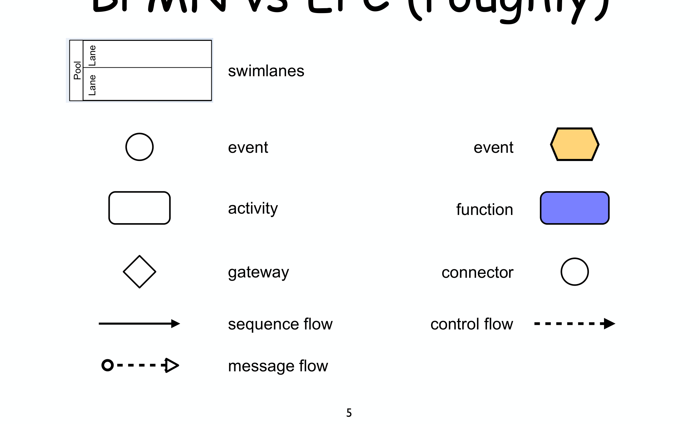
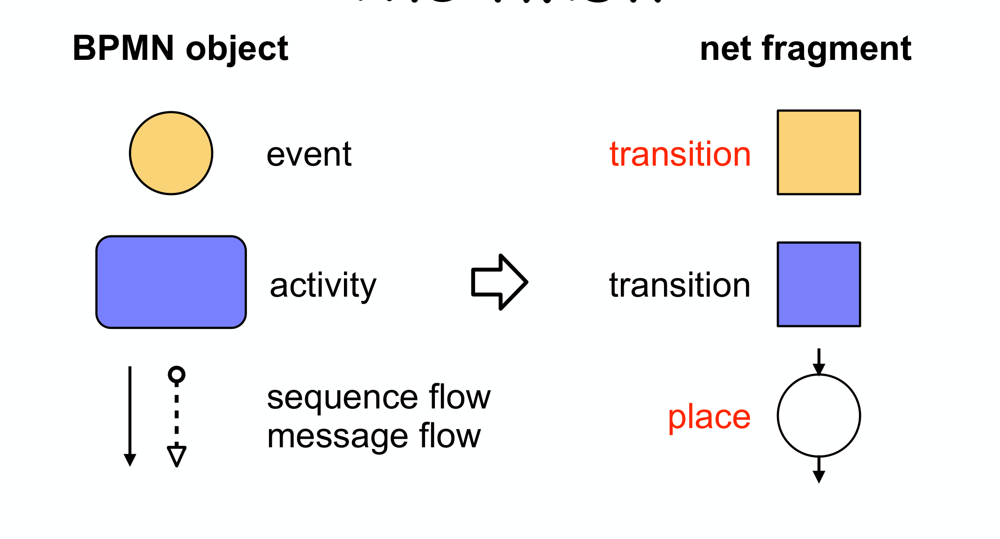
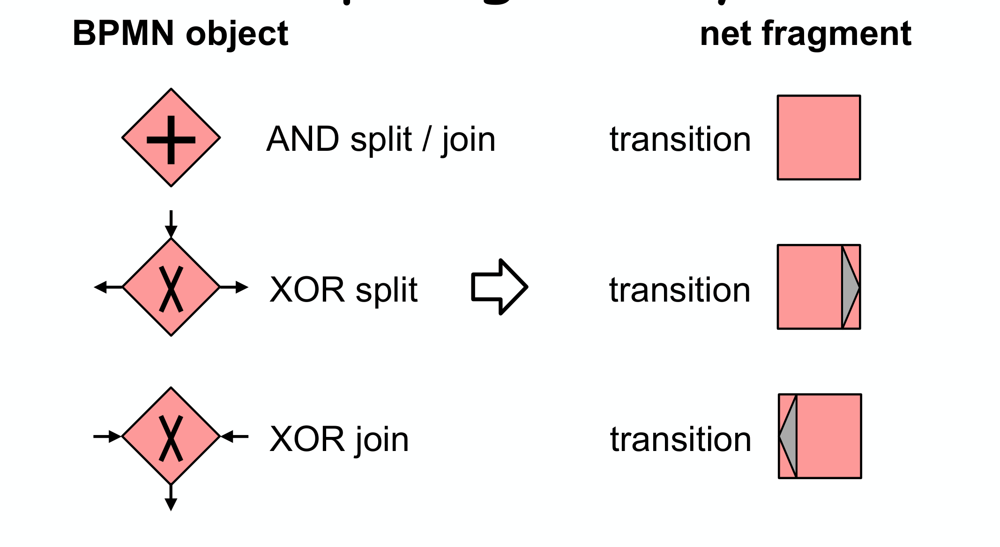
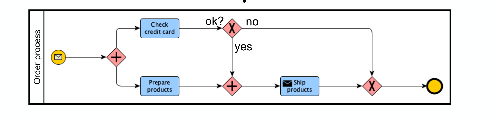
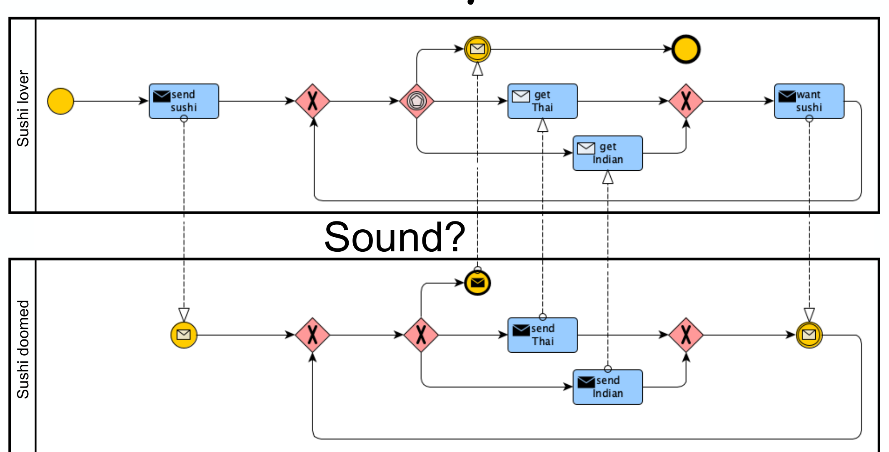
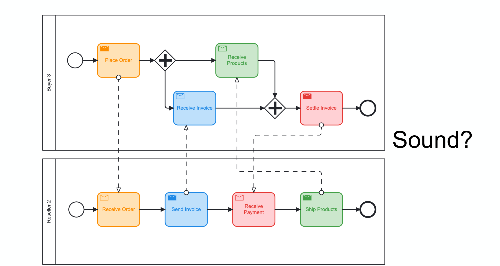

---
tags:
  - università/business-process-modeling
  - bpmn
  - workflow-nets
  - soundness
  - collaboration
  - translation
data: 2026-07-04
lezione: "16b — BPMN analysis"
corso: "MPB (6 cfu, 295AA)"
professore: "Roberto Bruni"
fonte: "Weske, *Business Process Management*, Ch.5.7"
---

# BPMN Analysis

Dopo aver dato semantica formale agli [[16a - EPC Analysis|EPC]], facciamo lo stesso con il **BPMN** (visto in [[07a - EPC e BPMN]] e [[07b - More BPMN]]). Il programma è identico: tradurre il diagramma in un net e dichiararlo *sound* se il net lo è. Ma ci sono due novità importanti — un "twist" nella traduzione, e il fatto che il BPMN gestisce anche le **collaboration**, che si traducono in **workflow system** (più process che comunicano).

> [!abstract] Il piano
>
> - I **BPMN process diagram** si traducono in **workflow net** → si verifica la soundness con gli strumenti soliti (liveness + boundedness di $N^\star$).
> - I **BPMN collaboration diagram** si traducono in **workflow system** (più net che si scambiano messaggi).
> - Un diagramma BPMN è **sound** se il suo net/system è sound.
>
> Come per gli EPC, le difficoltà maggiori vengono dagli **OR-gateway**: la raccomandazione pratica è **evitarli** (tutti i problemi visti con gli EPC valgono identici anche qui).

Va detto che dare una semantica formale al BPMN è stato oggetto di **molti tentativi** (Abstract State Machines, term/graph rewriting, process algebra, temporal logic, …): noi seguiamo la via dei Petri net (Dijkman, Dumas, Ouyang, 2008).

---

## Richiamo: BPMN vs EPC

I due linguaggi hanno elementi in corrispondenza abbastanza diretta, con in più le **swimlane** (pool e lane) e il **message flow**, che nel BPMN servono a modellare la comunicazione fra partecipanti.

*Fig. — BPMN vs EPC "roughly": activity ↔ function, gateway ↔ connector, sequence flow ↔ control flow. In più il BPMN ha **swimlane** (pool/lane) e **message flow** per la comunicazione fra partecipanti.*

---

## La semplificazione dei diagrammi

Come per gli EPC, ci si restringe a una classe "ben formata" di diagrammi, i **simplified BPMN**, per rendere la traduzione uniforme.

> [!definition] Simplified BPMN
>
> - uno **start / exception event** ha **un solo** flusso uscente e **nessuno** entrante;
> - un **end event** ha **un solo** flusso entrante e **nessuno** uscente;
> - tutte le **activity** e gli **intermediate event** hanno **esattamente un** flusso entrante e **uno** uscente;
> - ogni **gateway** ha *o* un flusso entrante (e più uscenti), *o* un flusso uscente (e più entranti) — mai molti-a-molti.

Questi vincoli **non sono una vera limitazione**: qualsiasi diagramma si può normalizzare con piccole trasformazioni meccaniche (un "desugaring").

> [!note] Come normalizzare (desugar)
>
> - elemento con **più flussi entranti** → si inserisce prima un **XOR-join**;
> - elemento con **più flussi uscenti** → si inserisce dopo un **AND-split**;
> - gateway **molti-a-molti** → si **decompone in due** gateway (uno join, uno split);
> - si aggiungono start/end event dove mancano.
>
> Restano fuori: **OR-gateway** (da evitare), forme limitate di sub-processing, niente transaction né compensation.

---

## Il "twist" della traduzione

Ed ecco la sorpresa. Negli EPC la corrispondenza era: event → **place**, function → **transition**, arco → arco. Nel BPMN è **diversa**, e a prima vista controintuitiva:

> [!warning] The twist! (attenzione, è diverso dagli EPC)
>
> | Oggetto BPMN | Frammento di net |
> |---|---|
> | **event** | **transition** |
> | **activity** | **transition** |
> | **sequence flow** / **message flow** | **place** |
>
> Cioè: **sia gli event sia le activity diventano transition**, e sono gli **archi** (i flussi) a diventare **place**! È il contrario dell'intuizione EPC, dove erano gli eventi a diventare place.

Il motivo è che nel BPMN un event è un *accadimento istantaneo* (come uno scatto di transition), mentre lo "stato" del processo è catturato dal *flusso* in cui si trova il token — quindi sono gli archi a fare da place.

*Fig. — Il "twist": event **e** activity diventano **transition**; sequence flow e message flow diventano **place**. Opposto alla convenzione EPC.*

> [!note] In pratica
>
> - un **place** per ogni arco;
> - una **transition** per ogni event e per ogni activity;
> - **una o due** transition per ogni gateway;
> - con qualche **eccezione** (start/end event, event-based gateway, loop, …) e **senza oggetti dummy** (a differenza degli EPC!).

### La traduzione in tre step

> [!note] Strategia (3 step)
>
> 1. **Step 1 — flussi**: si inserisce un **place** per ogni sequence flow e message flow.
> 2. **Step 2 — flow object**: si inseriscono le **transition** per event, activity e gateway.
> 3. **Step 3 — unico start / unico end**: si forza un solo place iniziale e un solo place finale (con un gateway XOR per lo start; XOR — talvolta AND — per l'end).

I gateway si traducono così:

*Fig. — I gateway: **AND split/join** → una singola transition (sincronizza/dirama tutti i rami); **XOR split** e **XOR join** → transition che realizzano la scelta esclusiva. L'**event-based gateway** si tratta invece con una **place fusion**.*

---

## Esempi di analisi

Il bello del metodo è che, tradotto il diagramma, la soundness si legge sul net. Vediamo qualche caso.

### Order process — non sound

*Fig. — Order process. Un **AND split** avvia in parallelo "check credit card" e "prepare products"; poi uno **XOR** decide ok?/no.*

Questo diagramma **non è sound**. Il difetto è il classico **mismatch AND/XOR**: l'AND split lancia *due* rami paralleli, ma il ramo "no" dello XOR salta direttamente alla fine **senza sincronizzare** con l'altro ramo. Risultato: o restano token pendenti (proper completion violata) o si crea un deadlock all'AND join. La combinazione "split di un tipo, join di un altro" è la sorgente di errori più comune nei diagrammi di flusso.

### Sushi lover / Sushi doomed — sound perché S-net

Due process singoli, "Sushi lover" e "Sushi doomed", risultano invece **safe & sound**. La ragione è elegante e collega tutto il percorso sui net: le loro traduzioni sono **S-net** (ogni transition ha un input e un output place). E come sappiamo da [[15 - S-T Systems]], **ogni workflow net che sia un S-net è automaticamente safe e sound** — un solo token che scorre, nessuna sincronizzazione da sbagliare.

### Sushi system — la collaboration

*Fig. — Sushi system: la **collaboration** dei due process, che si scambiano messaggi (frecce tratteggiate). Ciascun pool diventa un workflow net; il tutto è un **workflow system**.*

Mettendo insieme i due partecipanti in una **collaboration** (i message flow diventano place condivisi), si ottiene un **workflow system**. In questo caso l'analisi dice: **sound!** I due process comunicano in modo coerente.

### Buyer / Reseller — la sorpresa: sound + sound ≠ sound

*Fig. — Buyer 3 e Reseller 2. Presi **singolarmente**, entrambi i process sono **safe & sound**. Ma la loro **collaboration** è… ?*

Questo è il messaggio più importante della lezione. Presi da soli:

- **Buyer 3** → safe & sound;
- **Reseller 2** → safe & sound.

Ma la loro **collaboration** (Buyer 3 + Reseller 2) è **NON sound**! I due partner, corretti individualmente, si bloccano a vicenda quando devono coordinarsi via messaggi — tipicamente una **dipendenza circolare** fra gli scambi (ciascuno aspetta un messaggio che l'altro invierà solo dopo aver ricevuto il primo).

> [!warning] La soundness non composizionale
>
> La composizione di process **sound** può dare un system **non sound**. La correttezza dei singoli partecipanti **non garantisce** la correttezza della loro collaboration: la comunicazione introduce nuove possibilità di deadlock. Verificare i pezzi separatamente **non basta** — va analizzato il **sistema completo**.

---

## Preprocessing e costrutti avanzati

Prima della traduzione, alcuni costrutti BPMN richiedono un **Step 0** di preprocessing, perché non hanno una resa diretta come net "piatto":

> [!note] Costrutti che richiedono preprocessing
>
> - **activity looping** (un'attività ripetuta);
> - **multiple instances** (istanze multiple, limitate a design-time perché il net deve restare finito);
> - **sub-process** (annidamento);
> - **exception handling**, su singolo task o su sub-process (l'exception handling su sub-process serve a gestire l'esecuzione separata di più istanze).

Questi costrutti si "srotolano" in frammenti di net equivalenti prima di applicare i tre step standard.

---

## Il messaggio finale

Il BPMN, come gli EPC, guadagna una semantica precisa solo pagando un prezzo: si semplifica il diagramma, si evitano gli OR-gateway, e si accetta che la traduzione richieda un "twist" non intuitivo (event e activity → transition, archi → place). Due lezioni chiave:

- la **soundness** dei singoli process spesso si ottiene "gratis" quando la traduzione è un **S-net** (un solo token che scorre);
- per le **collaboration** non vale la composizionalità: **sound + sound ≠ sound**, e va analizzato il workflow system completo.

Nella prossima lezione approfondiamo la classe di net che è emersa da queste traduzioni — i **free-choice net** — e le loro proprietà strutturali. → [[17 - Free Choice]]
