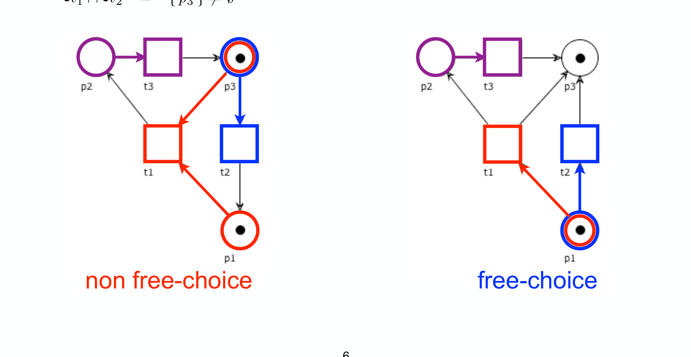
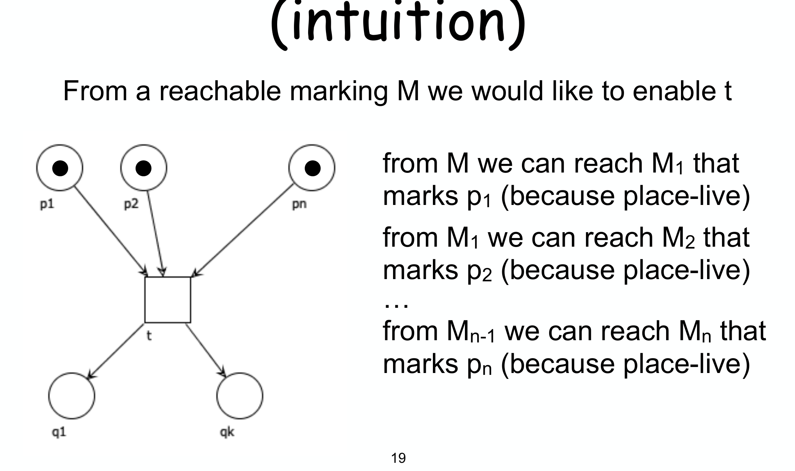
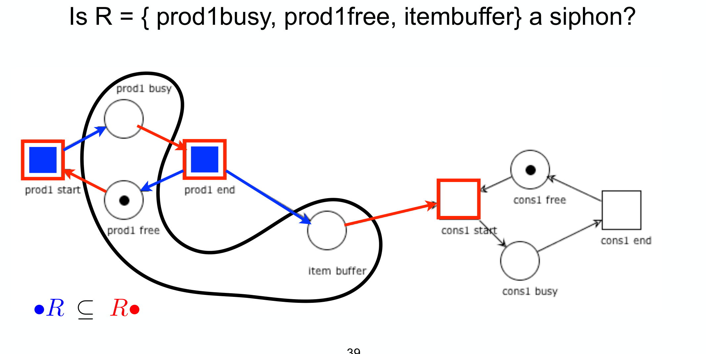
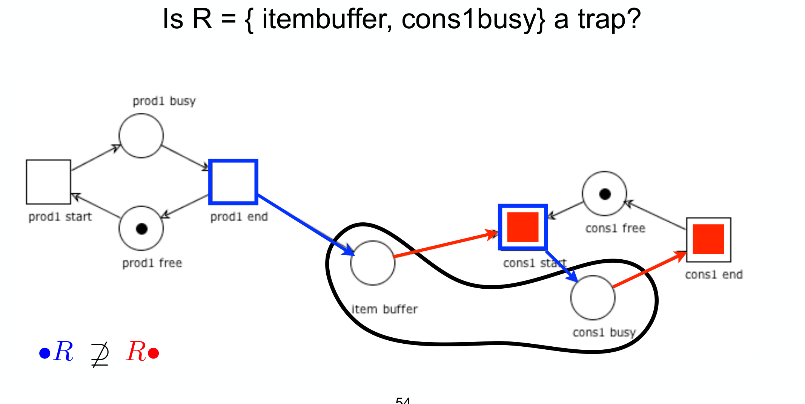
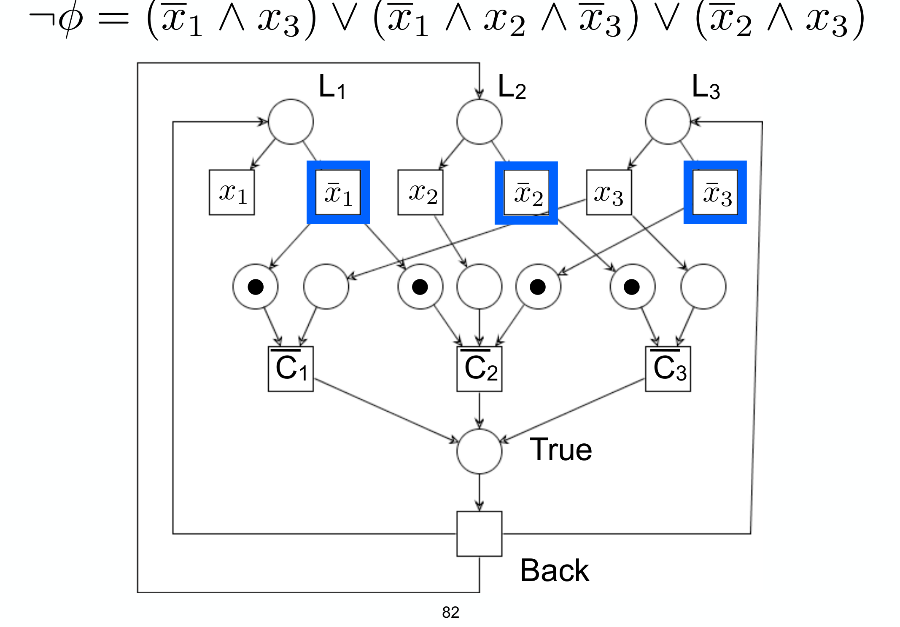
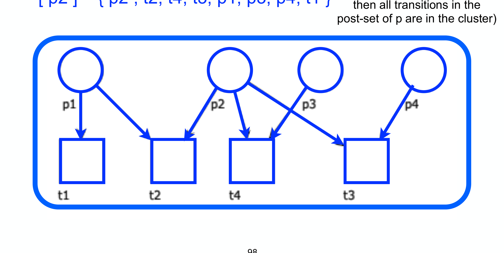

---
tags:
  - università/business-process-modeling
  - petri-nets
  - free-choice
  - siphon
  - trap
  - liveness
  - rank-theorem
data: 2026-07-04
lezione: "17 — Free-choice nets"
corso: "MPB (6 cfu, 295AA)"
professore: "Roberto Bruni"
fonte: "Esparza, *Free Choice Petri Nets*"
---

# Free-Choice Nets

Nelle traduzioni di [[16a - EPC Analysis|EPC]] e [[16b - BPMN Analysis|BPMN]] è emersa una classe ricorrente: i **free-choice net**. Sono più generali degli [[15 - S-T Systems|S-net e T-net]] ma conservano proprietà strutturali bellissime. Questa lezione le studia, arrivando a due risultati profondi: la **liveness** di un free-choice net è caratterizzabile con siphon e trap (**teorema di Commoner**), ma è **NP-complete** da decidere; mentre **liveness + boundedness** insieme si decidono in **tempo polinomiale** (**Rank Theorem**). Sono i concetti di [[17aux - P and NP]] applicati alle reti.

---

## La motivazione: separare scelta e sincronizzazione

Il problema che vogliamo eliminare è l'**interferenza fra conflitto e sincronizzazione**. In una rete qualsiasi due transizioni $t_1, t_2$ possono essere inizialmente indipendenti e diventare in conflitto dopo che una *terza* transizione $t_3$ scatta — e lo scatto di $t_3$ non è controllabile. La scelta fra $t_1$ e $t_2$ finisce così per dipendere dal resto del sistema.

L'idea dei free-choice è **impedire** che una scelta fra transizioni sia influenzata da altro. Il modo più semplice: tenere **separati** i place con più transizioni uscenti dalle transizioni con più place entranti.

> [!definition] Free-choice net — idea intuitiva (versione forte)
>
> Il modo più semplice per capire l'obiettivo: per ogni arco $(p,t)$, deve valere almeno una di:
> - $t$ è l'**unica** transizione uscente da $p$ ($|p\bullet| = 1$, nessun conflitto su $p$), **oppure**
> - $p$ è l'**unico** place entrante in $t$ ($|\bullet t| = 1$, nessuna sincronizzazione su $t$).
>
> Questa è solo l'idea guida, **non** la definizione ufficiale: è più restrittiva di quella che useremo (esclude anche casi che vorremmo ammettere, come due transizioni che condividono *più* place di input).

> [!definition] Free-choice net (definizione ufficiale)
>
> Un Petri net è **free-choice** se, per ogni coppia di **transizioni**, i loro **pre-set** sono **disgiunti oppure uguali**:
> $$\forall t, t' \in T.\quad \bullet t \cap \bullet t' = \emptyset \;\lor\; \bullet t = \bullet t'$$
> Equivalentemente (dualmente), per ogni coppia di **place**, i loro **post-set** sono disgiunti oppure uguali.
>
> Un system $(N, M_0)$ è free-choice se $N$ lo è.
>
> Questa condizione è **più debole** (ammette più reti) della versione intuitiva sopra: qui due transizioni possono benissimo condividere *due o più* place di input, purché li condividano *tutti* — non serve che il pre-set sia un singoletto.

L'intuizione della definizione ufficiale: se due transizioni condividono *anche un solo* place di input, allora devono condividerli *tutti* — così sono sempre abilitate insieme, e la scelta fra loro è davvero **libera** (dipende solo dai token in quei place comuni, non da altro).

*Fig. — Sinistra: **non** free-choice, perché $\bullet t_1 = \{p_1,p_3\}$ e $\bullet t_2 = \{p_3\}$ si intersecano in $p_3$ ma non coincidono. Destra: free-choice, perché $\bullet t_1 = \bullet t_2$ e $\bullet t_3$ è disgiunto da entrambi.*

> [!note] S-net e T-net sono free-choice
>
> - Ogni **S-net** è free-choice: in un S-net ogni $\bullet t$ è un **singoletto**, quindi due pre-set o coincidono o sono disgiunti.
> - Ogni **T-net** è free-choice: in un T-net ogni $p\bullet$ è un singoletto, stesso ragionamento sui post-set.
>
> I free-choice sono dunque una **super-classe** comune di S-net e T-net (e la contengono strettamente: esistono free-choice che non sono né l'uno né l'altro).

La proprietà che dà il nome alla classe:

> [!theorem] Proprietà fondamentale dei free-choice
>
> Se $M$ abilita $t$ e $t \in p\bullet$, allora $M$ abilita **ogni** $t' \in p\bullet$.
>
> *Perché:* in un free-choice $t, t' \in p\bullet$ implica $\bullet t = \bullet t'$, quindi se i place comuni bastano per $t$ bastano anche per $t'$. La scelta fra le transizioni che escono da $p$ è **libera**: o sono tutte abilitate, o nessuna lo è.

Come per la soundness, ci interessa la trasformata $N^\star$ (che aggiunge la transizione reset $o \to i$):

> [!note] $N$ free-choice $\iff$ $N^\star$ free-choice
>
> $N$ e $N^\star$ differiscono solo per la transizione **reset**, il cui pre-set $\{o\}$ è disgiunto dal pre-set di ogni altra transizione. Aggiungere reset non rompe la proprietà free-choice.

---

## Liveness = place-liveness

Un primo regalo dei free-choice riguarda la liveness. In *qualsiasi* rete, la liveness implica la **place-liveness** (nessun place può diventare "morto", cioè permanentemente inutilizzabile): se un place $p$ è dead, ogni transizione nel suo pre/post-set è dead. Nei free-choice vale anche il **viceversa**.

> [!theorem] Liveness = place-liveness (free-choice)
>
> In un free-choice system: **place-live $\iff$ live**.
>
> *Intuizione ($\Rightarrow$):* per abilitare una transizione $t$ con $\bullet t = \{p_1, \dots, p_n\}$ partendo da una marcatura $M$, si costruisce la catena, sfruttando ogni volta la place-liveness:
>
> $$
> M \ \leadsto\ M_1 \ (\text{marca } p_1) \ \leadsto\ M_2 \ (\text{marca } p_2) \ \leadsto\ \dots \ \leadsto\ M_n \ (\text{marca } p_n)
> $$
>
> Il punto delicato è che **i token già messi non si perdono**: per la proprietà fondamentale, se una $t'$ potesse togliere il token da $p_1$, avrebbe lo stesso pre-set di $t$ — ma allora abiliterebbe direttamente $t$. Alla fine $M_n$ marca tutti i $p_i$ e **abilita $t$**.

*Fig. — La costruzione passo-passo: si marca **un place di input alla volta** ($p_1$, poi $p_2$, …, poi $p_n$), sfruttando ogni volta la place-liveness. Il passaggio delicato (non visibile nel disegno, ma cruciale) è che marcare $p_2$ non deve "svuotare" $p_1$: qui interviene la proprietà fondamentale dei free-choice, che impedisce a un'altra transizione di rubare il token da $p_1$ senza condividerne l'intero pre-set con $t$.*

---

## Siphon e trap

Il cuore tecnico della lezione sono due strutture duali sui place: i **siphon** (che, una volta svuotati, restano vuoti) e i **trap** (che, una volta marcati, restano marcati). Servono a fissare le "trappole" strutturali della liveness. Conviene prima l'idea, poi la formula.

> [!definition] Siphon (o deadlock)
>
> Un insieme di place $R$ è un **siphon** se ogni transizione che può **produrre** token in $R$ richiede anche un place di $R$ come input: $\;\bullet R \subseteq R\bullet$.
>
> **Conseguenza:** se $R$ è **vuoto** (nessun token), nessuna transizione potrà mai rimetterci token → **resta vuoto per sempre**. È **proper** se $R \ne \emptyset$.

> [!definition] Trap
>
> Un insieme di place $R$ è un **trap** se ogni transizione che può **consumare** token da $R$ produce anche un token in $R$: $\;R\bullet \subseteq \bullet R$ (scritto anche $\bullet R \supseteq R\bullet$).
>
> **Conseguenza:** se $R$ è **marcato** (almeno un token), non potrà mai svuotarsi → **resta marcato per sempre**. È **proper** se $R \ne \emptyset$.

La lettura "meccanica" è comoda: un siphon controlla che $\bullet R$ (frecce *entranti* in $R$) sia coperto da $R\bullet$ (frecce *uscenti*); un trap è l'inclusione opposta.

*Fig. — Verifica siphon: si colora $\bullet R$ (transizioni che entrano in $R$) e $R\bullet$ (transizioni che escono). $R$ è un siphon sse $\bullet R \subseteq R\bullet$.*

*Fig. — Verifica trap: qui $R\bullet \not\subseteq \bullet R$, quindi $R = \{\text{itembuffer}, \text{cons1busy}\}$ **non** è un trap.*

Queste "conseguenze" si formalizzano con la nozione di **stable set of markings**: un insieme $\mathcal{M}$ di marcature è **stable** se, partendo da una qualsiasi marcatura in $\mathcal{M}$, non si può raggiungere una marcatura fuori da $\mathcal{M}$. Le proprietà fondamentali di siphon e trap dicono esattamente che certi insiemi sono stable:

> [!theorem] Proprietà fondamentali
>
> - **Siphon vuoto resta vuoto**: $\{M \mid M(R) = 0\}$ è stable. *Corollario:* se un siphon è marcato in una marcatura raggiungibile, era marcato in $M_0$.
> - **Trap marcato resta marcato**: $\{M \mid M(R) > 0\}$ è stable. *Corollario:* se un trap è vuoto in una marcatura raggiungibile, era vuoto in $M_0$.
> - **I trap sono chiusi per unione**: l'unione di due trap è un trap. Quindi ogni siphon contiene un **unico trap massimale** (eventualmente vuoto).

Il legame con la liveness, valido in **ogni** rete:

> [!theorem] Siphon e liveness (reti qualsiasi)
>
> Se un system è **live**, allora ogni proper siphon $R$ è **marcato**.
>
> *Perché:* preso $p \in R$ e una $t \in \bullet p \cup p\bullet$, per liveness esiste uno scatto raggiungibile
>
> $$M \xrightarrow{t} M'$$
>
> quindi $p$ (e dunque $R$) è marcato in $M$ o in $M'$; per il corollario, era già marcato in $M_0$.
>
> **Contronominale (test rapido):** se esiste un proper siphon **non marcato**, il system **non è live**.

---

## Il teorema di Commoner

Per i free-choice, la condizione sui siphon diventa **esatta** grazie ai trap. È il risultato centrale sulla liveness.

> [!theorem] Teorema di Commoner (free-choice)
>
> Un free-choice system è **live** $\iff$ **ogni proper siphon include un trap inizialmente marcato**.
>
> Equivalentemente ($\iff$ il trap **massimale** di ogni proper siphon è marcato). Contronominale:
>
> Un free-choice system è **non-live** $\iff$ **esiste un proper siphon il cui trap massimale è non marcato**.

L'idea: un siphon non marcato è una condanna (resta vuoto e blocca le transizioni), *a meno che* contenga un trap marcato che gli "inietta" token per sempre. La caratterizzazione via trap massimale è comoda perché il trap massimale è unico e calcolabile.

---

## Complessità 1: la liveness da sola è NP-complete

Commoner suggerisce subito un algoritmo **non-deterministico**:

> [!note] Algoritmo non-deterministico per la non-liveness
>
> 1. **Guess** un insieme di place $R$ *(passo non-deterministico, poly)*;
> 2. verifica che $R$ sia un siphon ($\bullet R \subseteq R\bullet$) *(poly)*;
> 3. calcola il trap massimale $Q \subseteq R$ *(poly, con un semplice ciclo che rimuove i place "cattivi")*;
> 4. se $M_0(Q) = 0$ rispondi **"non-live"**, altrimenti "live" *(poly)*.
>
> Tutti i passi sono polinomiali → **la non-liveness dei free-choice è in NP**.

Ma è anche **NP-hard**, e quindi NP-complete, tramite una **riduzione da CNF-SAT** (il problema NP-complete di [[17aux - P and NP]]). Dato $\varphi$, si costruisce un free-choice system tale che **$\varphi$ è soddisfacibile $\iff$ il net è non-live** (equivalentemente, $\neg\varphi$ insoddisfacibile $\iff$ net live).

*Fig. — Il net di una formula. **Fissare un'assegnazione** = scegliere, per ogni variabile, se scattare $x_i$ o $\bar{x_i}$ (scelta free-choice sul place $L_i$). Se l'assegnazione soddisfa $\neg\varphi$, qualche clausola-transition $\overline{C_i}$ resta bloccata e **Back diventa dead** → net non-live.*

> [!warning] Conseguenza principale
>
> Decidere la liveness di un free-choice system è **NP-complete**. L'algoritmo deterministico dovrebbe esplorare tutti i $2^{|P|}$ sottoinsiemi di place. **Non esiste** (a oggi) un algoritmo polinomiale per la sola liveness — **a meno che P = NP**.

---

## Complessità 2: liveness + boundedness è polinomiale (Rank Theorem)

Ed ecco la sorpresa. Se si chiede **liveness E boundedness insieme** (esattamente ciò che serve per la [[12 - Soundness|soundness]]: $N$ sound $\iff$ $N^\star$ live e bounded), il problema diventa **polinomiale**. Serve prima la nozione di **cluster**.

> [!definition] Cluster
>
> Il **cluster** di un nodo $x$, scritto $[x]$, è il più piccolo insieme tale che:
> 1. $x \in [x]$;
> 2. se un **place** $p \in [x]$, allora $p\bullet \subseteq [x]$ (tutte le sue transizioni uscenti);
> 3. se una **transition** $t \in [x]$, allora $\bullet t \subseteq [x]$ (tutti i suoi place entranti).
>
> Intuitivamente si "chiude" alternando: da un place prendi le transizioni che ne escono, da una transizione i place che vi entrano. I cluster **partizionano** i nodi della rete; $C_N$ è l'insieme dei cluster.

*Fig. — Costruzione di $[p_2]$: si alterna "place → sue transizioni uscenti" e "transizione → suoi place entranti" fino a chiusura. In un free-choice, un cluster è una "zona di scelta libera".*

> [!theorem] Rank Theorem (risultato principale, dim. omessa)
>
> Un free-choice system $(P,T,F,M_0)$ è **live e bounded** $\iff$ valgono tutte:
> 1. ha almeno un place e una transition;
> 2. è **connesso**;
> 3. $M_0$ marca **ogni proper siphon**;
> 4. ha un **S-invariant positivo** (tutte componenti $>0$);
> 5. ha un **T-invariant positivo**;
> 6. $\text{rank}(N) = |C_N| - 1$ (il rango della [[11 - Net Matrices|matrice di incidenza]] è il numero di cluster meno uno).

Il punto cruciale è che **ognuna** di queste sei condizioni si verifica in **tempo polinomiale**:

- connessione, invarianti positivi e rango: algebra lineare / visita del grafo, tutti poly;
- "$M_0$ marca ogni proper siphon" si controlla calcolando il **massimo siphon non marcato** partendo dai place vuoti e togliendo iterativamente i place che violano la condizione: se resta vuoto, ogni proper siphon è marcato. Poly.

> [!tip] Il contrasto (take-home)
>
> - **Liveness da sola** su free-choice → **NP-complete** (riduzione da SAT).
> - **Liveness + boundedness** su free-choice → **polinomiale** (Rank Theorem).
>
> Aggiungere un vincolo (la boundedness) *semplifica* il problema invece di complicarlo! E poiché la soundness di un workflow net è proprio "$N^\star$ live e bounded", per i workflow net **free-choice** la soundness si decide in **tempo polinomiale**. È la giustificazione teorica del perché tool come WoPeD funzionano bene sui processi reali (che sono quasi sempre free-choice).

---

## Recap

> [!abstract] Free-choice net: il quadro
>
> - **free-choice**: pre-set delle transizioni disgiunti o uguali → la scelta è *libera*, non influenzata dal resto;
> - place-liveness $\iff$ liveness;
> - **non-live** $\iff$ esiste un proper siphon il cui trap massimale è non marcato (**Commoner**);
> - decidere la sola **liveness** è **NP-complete**;
> - decidere **liveness + boundedness** è **polinomiale** (**Rank Theorem**) → soundness poly per WF net free-choice.

Con questi strumenti chiudiamo l'analisi strutturale del singolo processo. La prossima lezione estende il discorso ai **workflow system**, dove più processi comunicano — riprendendo il problema "sound + sound ≠ sound" visto con Buyer/Reseller. → [[18 - Workflow Systems]]
