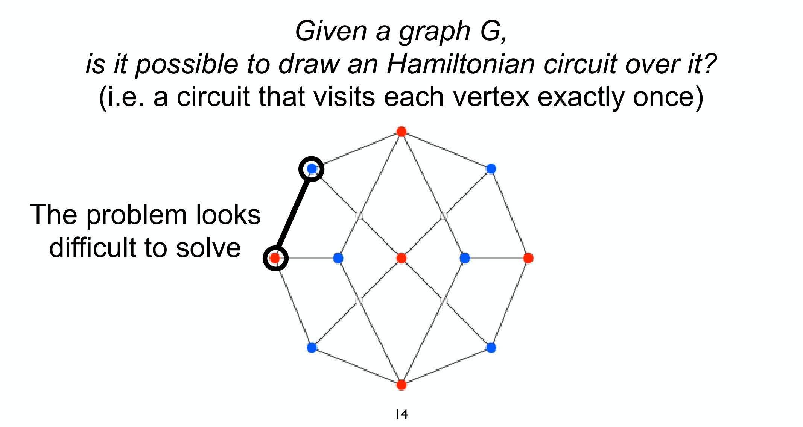

---
tags:
  - università/business-process-modeling
  - complexity
  - p-np
  - np-completeness
data: 2026-07-04
lezione: "17aux — P and NP problems"
corso: "MPB (6 cfu, 295AA)"
professore: "Roberto Bruni"
fonte: "Computational complexity (materiale ausiliario)"
---

# P and NP

Questa è una **lezione ausiliaria**: un ripasso di teoria della complessità che ci serve come sfondo per capire *quanto costa* verificare le proprietà dei Petri net. Molte domande sulle reti (raggiungibilità, soundness, liveness) sono computazionalmente difficili, e per parlarne con precisione servono le classi **P** e **NP**. L'obiettivo qui è solo fissare il vocabolario.

---

## Problemi, istanze, problemi di decisione

Prima di parlare di difficoltà, distinguiamo bene tre cose.

> [!definition] Problema, istanza, problema di decisione
>
> - Un **problem** definisce una *famiglia* di domande collegate. Es. il *factorization problem*: «dato un numero $n$, restituisci tutti i suoi fattori primi».
> - Un **problem instance** è *una singola* di quelle domande. Es. «restituisci i fattori primi di 18».
> - Un **decision problem** è un problema la cui risposta è solo **booleana** (sì/no). Es. «dato $n$, è primo?»; istanza: «18 è primo?».

Le classi di complessità si definiscono sui **decision problem**. La **Computational Complexity Theory** studia le *risorse* necessarie a risolverli: quante operazioni di base (**time**) o quanta memoria (**space**) servono, in funzione della **dimensione dell'input**.

---

## La classe P: risolvibili in modo efficiente

> [!definition] Classe P
>
> **P** è l'insieme dei decision problem risolvibili da un algoritmo **deterministico** in un numero di passi **polinomiale** rispetto alla dimensione dell'input.
>
> Intuizione: i problemi in P si possono **risolvere effettivamente** (e, di conseguenza, anche verificare) — "polinomiale" è la nozione tecnica di *trattabile*.

Un esempio classico è il circuito euleriano.

> [!example] Eulerian circuit (in P)
>
> «Dato un grafo $G$, esiste un **circuito euleriano**?» (un circuito che percorre **ogni arco esattamente una volta**).
>
> Si dimostra che equivale a chiedere: «il **grado** di ogni vertice è **pari**?» — condizione controllabile in **tempo lineare** nel numero di archi. Quindi il problema si risolve effettivamente: sta in **P**.

---

## La classe NP: verificabili in modo efficiente

> [!definition] Classe NP
>
> **NP** è l'insieme dei decision problem risolvibili da un algoritmo **non-deterministico** in tempo polinomiale.
>
> Equivalentemente (e più utile da immaginare): NP è l'insieme dei problemi le cui **soluzioni si possono verificare** da un algoritmo deterministico in tempo polinomiale.
>
> Intuizione: le soluzioni dei problemi in NP si possono **controllare effettivamente** — se qualcuno ti dà una candidata risposta, la sai validare in fretta, anche se *trovarla* potrebbe essere costoso.

L'esempio speculare all'euleriano è il circuito hamiltoniano — apparentemente simile, ma di tutt'altra difficoltà.

> [!example] Hamiltonian circuit (in NP)
>
> «Dato un grafo $G$, esiste un **circuito hamiltoniano**?» (un circuito che **visita ogni vertice esattamente una volta**).
>
> Se qualcuno ti *propone* un circuito, verificare che sia hamiltoniano è facile (**checked effectively**). Ma **trovarlo** sembra difficile: non si conosce un algoritmo polinomiale. Il problema **sembra** difficile da risolvere, pur essendo facile da controllare.

*Fig. — Hamiltonian circuit: verificare una soluzione data è immediato, ma costruirla richiede (per quanto si sa) di esplorare un numero enorme di combinazioni.*

> [!note] P ⊆ NP
>
> Ogni problema in P sta anche in NP: se lo sai *risolvere* in fretta, in particolare sai *verificare* una soluzione in fretta (basta risolverlo e confrontare). Il viceversa è il grande interrogativo.

---

## Il problema P vs NP

> [!abstract] La domanda da un milione di dollari
>
> Se **P = NP**, allora "risolvere" un problema non sarebbe più difficile che "controllarne" una soluzione. Se **P ≠ NP**, esistono problemi facili da verificare ma intrinsecamente difficili da risolvere.
>
> **P = NP?** è la **più importante questione aperta** dell'informatica. La nostra esperienza quotidiana suggerisce che risolvere sia molto più arduo che verificare (correggere un compito è più facile che svolgerlo), da cui la congettura diffusa **P ≠ NP** — ma nessuno l'ha dimostrata.

---

## NP-completeness e SAT

All'interno di NP ci sono i problemi "più difficili di tutti": gli **NP-complete**.

> [!definition] NP-completeness
>
> Un problema $Q \in$ NP è **NP-complete** se **ogni altro** problema in NP si può **ridurre** a $Q$ in tempo polinomiale.
>
> Conseguenza: trovare un modo *efficiente* di risolvere **un solo** problema NP-complete permetterebbe di risolvere efficientemente **tutti** i problemi in NP — cioè dimostrerebbe P = NP. Gli NP-complete sono quindi i candidati naturali per attaccare la domanda P vs NP.

Il capostipite storico è **SAT**, la soddisfacibilità booleana.

> [!definition] SAT decision problem (NP-complete)
>
> Ingredienti:
> - **Variables**: un insieme di variabili booleane
>
> $$x_1, x_2, \dots, x_n$$
>
> - **Literals**: una variabile o la sua negazione
>
> $$x_i \quad \text{oppure} \quad \bar{x_i}$$
>
> - **Clause**: una **disgiunzione** di literal (un OR), es.
>
> $$(x_1 \vee \bar{x_3})$$
>
> - **Formula**: una **congiunzione** di clause (un AND di OR — forma normale congiuntiva).
>
> Esempio:
>
> $$\varphi = (x_1 \vee \bar{x_3}) \wedge (x_1 \vee \bar{x_2} \vee x_3) \wedge (x_2 \vee \bar{x_3})$$
>
> **Domanda**: esiste un'assegnazione di valori booleani alle variabili tale che $\varphi = \text{true}$?
>
> Per l'esempio, questa assegnazione funziona:
>
> $$x_1 = x_2 = x_3 = \text{true}$$

SAT è stato il **primo** problema dimostrato NP-complete (teorema di Cook–Levin): verificare un'assegnazione è banale, ma *trovarne* una soddisfacente è, per quanto si sa, difficile.

Con questo vocabolario in mano, nella prossima lezione possiamo apprezzare perché i **free-choice net** sono così importanti: sono una classe per cui proprietà altrimenti costose diventano verificabili in modo trattabile. → [[17 - Free Choice]]
