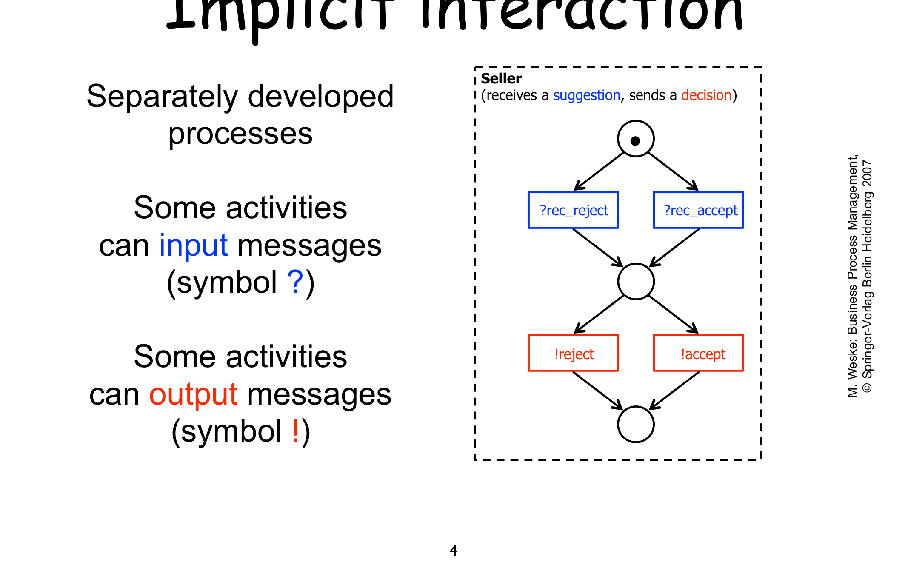
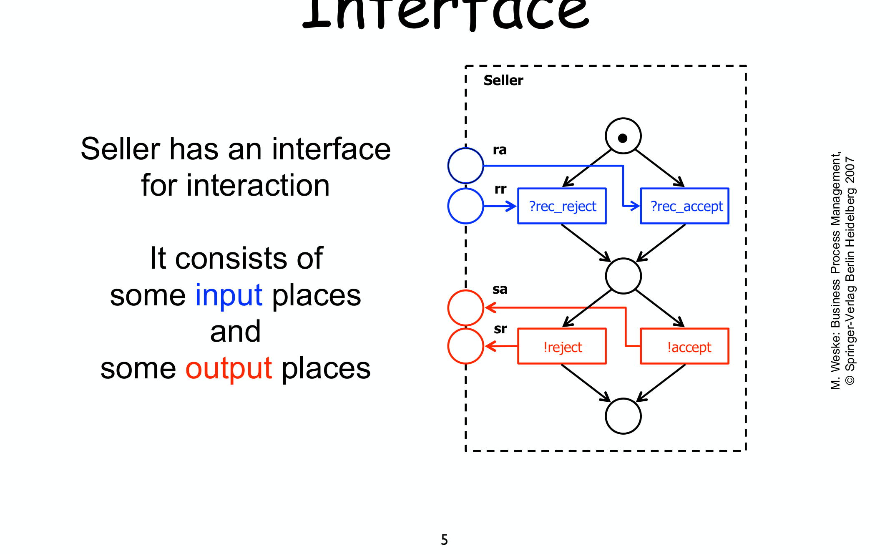
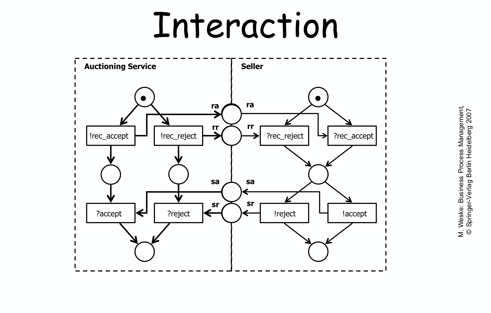
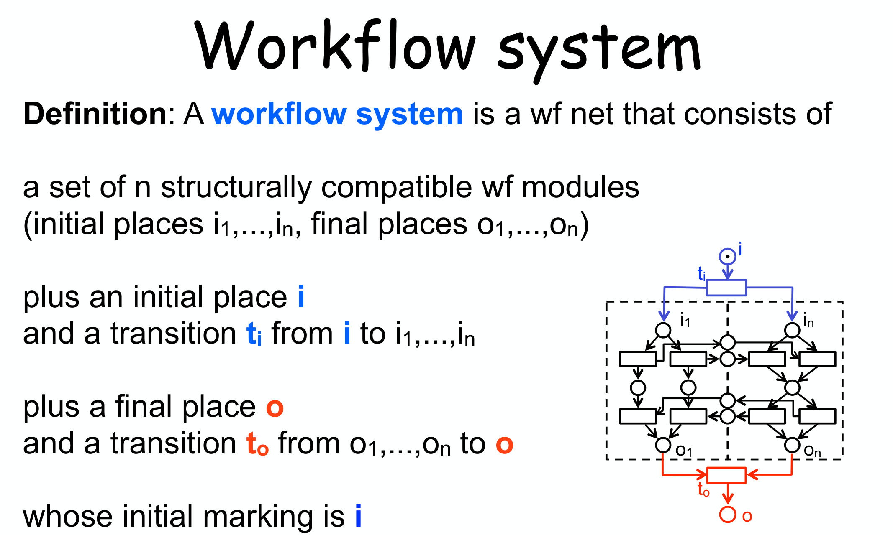

---
tags:
  - università/business-process-modeling
  - workflow-nets
  - workflow-modules
  - workflow-systems
  - soundness
  - collaboration
data: 2026-07-04
lezione: "18 — Workflow modules and systems"
corso: "MPB (6 cfu, 295AA)"
professore: "Roberto Bruni"
fonte: "Weske, *Business Process Management*, Ch.6"
---

# Workflow Modules and Systems

Nella lezione su [[16b - BPMN Analysis|BPMN]] abbiamo visto un caso sorprendente: due workflow **sound** presi singolarmente (Buyer 3 e Reseller 2) diventavano **non sound** una volta messi in comunicazione. Questa lezione formalizza *perché* succede e *come* analizzarlo: introduciamo i **workflow module** (un workflow net con un'interfaccia di comunicazione) e i **workflow system** (più moduli composti insieme), per poi mostrare che la soundness composta va verificata sul **sistema completo**, non sui pezzi.

---

## Il problema: interazione fra processi

Un workflow net, per come l'abbiamo definito finora, è un mondo chiuso: nessun task dipende da eventi esterni. Ma nella realtà **non tutti i task sono automatici**: alcuni sono innescati da un **messaggio** in arrivo, altri **inviano** un messaggio per innescare un task altrove.

> [!note] Interazione implicita
>
> Le attività di un processo possono:
> - **ricevere** un messaggio (simbolo **?**, es. `?rec_accept`);
> - **inviare** un messaggio (simbolo **!**, es. `!accept`).
>
> Finché il processo è visto da solo, questi simboli sono solo un'annotazione — un promemoria che quell'attività interagisce con l'esterno.

*Fig. — Il process **Seller**: riceve un suggerimento (`?rec_accept`/`?rec_reject`) e invia una decisione (`!accept`/`!reject`). I simboli `?`/`!` segnano dove il processo comunica con l'esterno, ma finché resta isolato non sappiamo *con chi*.*

---

## Workflow module: dare forma all'interfaccia

Per rendere l'interazione **esplicita** (e quindi analizzabile con i Petri net), i punti di ricezione e invio diventano dei **place di interfaccia**: un place di input per ogni possibile messaggio ricevuto, uno di output per ogni messaggio inviato.

> [!warning] Attenzione: non è più un workflow net!
>
> Se il workflow net di partenza era **validato** (sound, magari safe), aggiungere i place di interfaccia lo trasforma in qualcosa di diverso: un workflow net ha *un solo* place iniziale e *uno* finale, ma ora ci sono **più punti di ingresso/uscita** (uno per ogni place di interfaccia). Serve un nuovo nome per questo oggetto: **workflow module**.

> [!definition] Workflow module
>
> Un workflow module consiste di:
> - un workflow net **sound**:
>
> $$(P, T, F)$$
>
> - un insieme di **place di input** $P_I$ e archi di input:
>
> $$F_I \subseteq (P_I \times T)$$
>
> - un insieme di **place di output** $P_O$ e archi di output:
>
> $$F_O \subseteq (T \times P_O)$$
>
> con il vincolo che **ogni transizione ha al più un arco** verso l'interfaccia ($P_I \cup P_O$) — una transizione non può scambiare più di un messaggio alla volta.

*Fig. — L'**interfaccia** di Seller: i place $P_I = \{ra, rr\}$ (input, blu) alimentano le transizioni `?rec_reject`/`?rec_accept`; i place $P_O = \{sa, sr\}$ (output, rosso) sono riempiti da `!reject`/`!accept`. L'interfaccia è la "presa" con cui il modulo si collega ad altri.*

---

## Compatibilità strutturale e composizione

Un modulo da solo non fa nulla — descrive solo cosa può inviare/ricevere. Per farlo *funzionare* bisogna collegarlo ad altri moduli che si scambiano gli stessi messaggi. Prima di collegarli, si controlla che le "prese" combacino.

> [!definition] Structural compatibility
>
> Un insieme di workflow module è **structurally compatible** se:
> - per ogni messaggio che **può essere inviato**, c'è **esattamente un** modulo che può riceverlo;
> - per ogni messaggio che **può essere ricevuto**, c'è **esattamente un** modulo che può inviarlo.
>
> (si assume che i formati dei dati scambiati combacino). In pratica: ogni place di output di un modulo deve corrispondere a **uno e un solo** place di input di un altro modulo, e viceversa — nessun messaggio "orfano".

Una volta verificata la compatibilità, la **composizione** è semplicissima: si **fondono** (identificano) i place di output di un modulo con i corrispondenti place di input dell'altro. Non serve nessuna transizione aggiuntiva — i place condivisi *sono* il canale di comunicazione.

*Fig. — Compatibilità e composizione. **Auctioning Service** invia `!rec_accept`/`!rec_reject` sui place `ra`/`rr`, che **Seller** riceve come `?rec_accept`/`?rec_reject`; simmetricamente per `sa`/`sr`. Fondendo i place di interfaccia condivisi (la colonna centrale del disegno) si ottiene un'unica rete: i due moduli sono ora **collegati**.*

Dopo aver fuso le interfacce resta però una domanda aperta, la stessa di [[16b - BPMN Analysis|Buyer/Reseller]]: **il sistema risultante si comporta bene?** E che relazione c'è con la soundness dei singoli moduli?

---

## Workflow system: chiudere il cerchio

La composizione di moduli compatibili non è ancora un workflow net "pulito": mancano ancora un unico inizio e un'unica fine globali. Si chiudono aggiungendo, come nella [[12 - Soundness|costruzione di $N^\star$]], un place e una transizione iniziali/finali che avvolgono l'intero sistema.

> [!definition] Workflow system
>
> Un **workflow system** è un workflow net ottenuto da $n$ workflow module **structurally compatible** (con place iniziali $i_1,\dots,i_n$ e finali $o_1,\dots,o_n$), aggiungendo:
> - un place iniziale $i$ e una transizione $t_i$ da $i$ a **tutti** gli $i_1,\dots,i_n$:
>
> $$i \ \xrightarrow{\ t_i\ }\ i_1,\dots,i_n \qquad \text{(avvia tutti i moduli in parallelo)}$$
>
> - un place finale $o$ e una transizione $t_o$ da **tutti** gli $o_1,\dots,o_n$ a $o$:
>
> $$o_1,\dots,o_n \ \xrightarrow{\ t_o\ }\ o \qquad \text{(attende che tutti i moduli terminino)}$$
>
> La marcatura iniziale è un token in $i$.

*Fig. — Struttura di un workflow system: $t_i$ "lancia" simultaneamente tutti i moduli, $t_o$ aspetta che **tutti** abbiano finito. È esattamente l'analogo multi-modulo del singolo workflow net $i \to o$.*

Il punto cruciale — e la ragione per cui tutta questa macchina serve — è che **un workflow system è, a tutti gli effetti, un ordinario workflow net**. Quindi la sua soundness si verifica **esattamente come sempre**: liveness e boundedness di $(N^\star)$, nessuno strumento nuovo.

> [!example] Sound + Sound può dare non sound
>
> Componendo **Auctioning Service** e **Seller** (entrambi sound singolarmente) si ottiene un workflow system che, controllato, risulta **non sound** — la comunicazione introduce un deadlock che non esisteva nei singoli moduli. Modificando leggermente uno dei due moduli (**Auctioning Service'**), il sistema composto torna **sound**. La morale, già anticipata in [[16b - BPMN Analysis]], si dimostra ora con lo strumento giusto: **la soundness dei singoli moduli non implica quella del sistema**; va sempre controllata sul workflow system risultante dalla composizione.

---

## Il problema della soundness "piena": weak soundness

C'è però un disagio pratico nell'esigere la soundness piena sul sistema composto. I workflow module sono pensati per essere **sviluppati separatamente** e **riusati** in sistemi diversi: è normale che, in un dato system, **non tutte** le funzionalità offerte da un modulo vengano usate. Un task del modulo che in *questo* particolare sistema non serve mai risulterebbe **dead** — e la soundness piena lo vieterebbe categoricamente (condizione "no dead task").

> [!warning] Perché la soundness piena è troppo esigente qui
>
> Pretendere **zero task dead** nel sistema composto è irrealistico quando i moduli sono generici e riusabili: alcune loro funzionalità restano naturalmente inutilizzate in un contesto specifico, senza che questo comprometta la correttezza dell'interazione.

Si introduce quindi una nozione più permissiva, che rilassa **solo** la condizione sui dead task:

> [!definition] Weak soundness
>
> Un workflow net è **weak sound** se soddisfa **option to complete** e **proper completion** ([[12 - Soundness|le condizioni 2 e 3]] della soundness) — ma **ammette task dead** (rilassa la condizione 1).
>
> Si verifica sul reachability graph esattamente come la soundness piena. Garantisce comunque **deadlock-freedom** e la **corretta terminazione** di tutti i moduli — solo non garantisce che ogni singolo task venga mai eseguito.

> [!tip] Sound + Sound = weak sound (nell'esempio)
>
> Nell'esempio del sistema *non sound* visto sopra: il difetto non era un deadlock o una terminazione sporca, ma la presenza di **task dead** nel sistema composto (funzionalità di un modulo non attivate in questo particolare abbinamento). Il sistema **non è sound**, ma **è weak sound**: nessun blocco, nessun token pendente — solo qualche task inutilizzato, che è accettabile per moduli pensati per essere generici.

---

## Riepilogo

> [!abstract] Il quadro
>
> - Un **workflow module** = workflow net sound + interfaccia (place di input/output per i messaggi).
> - Più moduli **structurally compatible** si compongono fondendo i place di interfaccia condivisi.
> - Chiudendo con $i,t_i$ e $o,t_o$ si ottiene un **workflow system** — un workflow net a tutti gli effetti, verificabile con gli strumenti soliti.
> - **Sound + sound non implica sound**: la composizione va sempre controllata sul sistema intero.
> - La **weak soundness** (option to complete + proper completion, senza "no dead task") è il criterio realistico per sistemi fatti di moduli riusabili.

Con moduli e sistemi possiamo modellare processi che comunicano; resta però aperta la questione opposta: dato un log di eventi reali, **quanto bene** il modello descrive ciò che accade davvero? Se ne occupa la prossima lezione. → [[19 - Conformance]]
