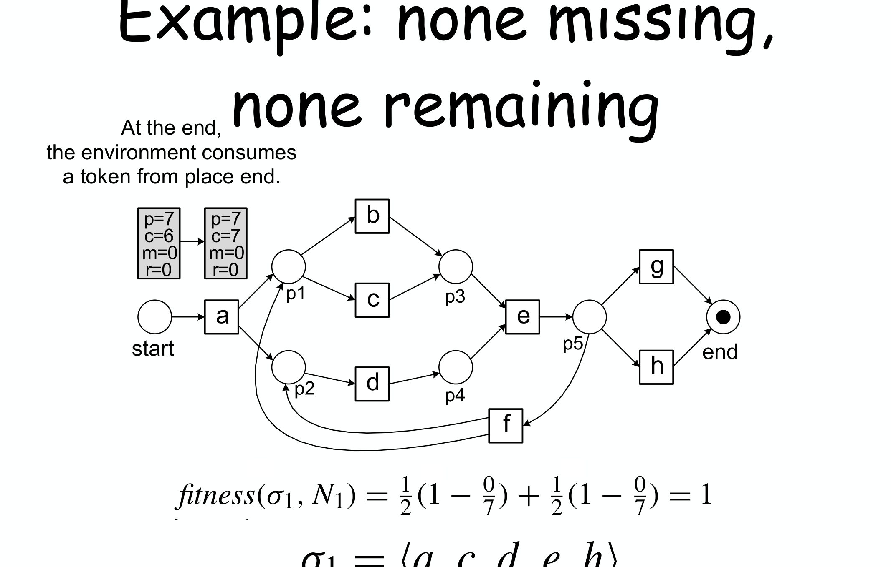
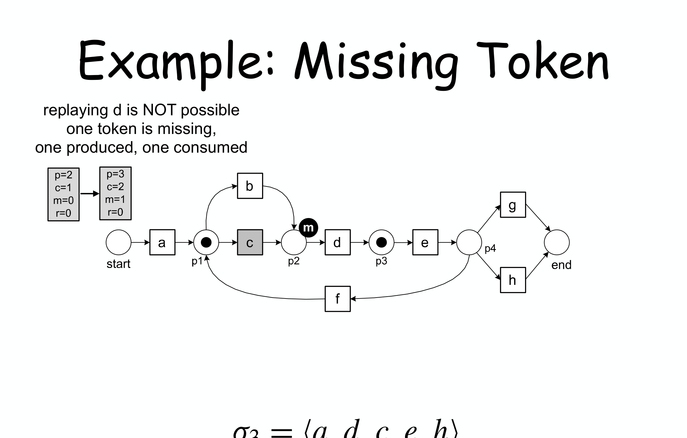
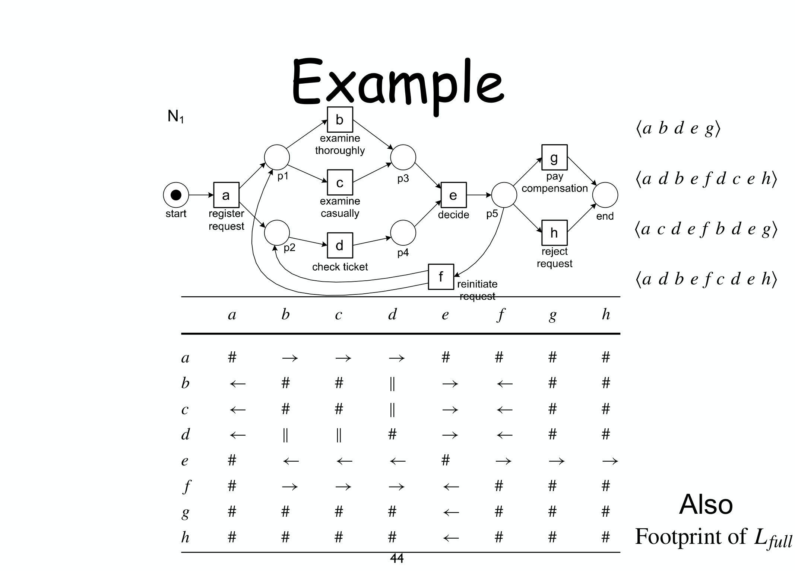

---
tags:
  - università/business-process-modeling
  - process-mining
  - conformance-checking
  - fitness
  - token-replay
  - footprint
data: 2026-07-04
lezione: "19 — Conformance checking"
corso: "MPB (6 cfu, 295AA)"
professore: "Roberto Bruni"
fonte: "van der Aalst, *Process Mining*, Ch.1, 6"
---

# Conformance Checking

Con il [[05 - Process Mining|process mining]] avevamo visto come **scoprire** un modello a partire da un event log (l'α-algorithm). Questa lezione affronta la domanda complementare: dato un modello (magari scoperto, magari disegnato a mano) e un log **reale**, **quanto bene il modello descrive ciò che è realmente accaduto**? È il problema della **conformance checking**.

> [!abstract] Il quadro
>
> Si confrontano due fonti indipendenti di informazione: il **modello** (comportamento *previsto*) e il **log** (comportamento *osservato*). Il confronto produce due tipi di risultato: **misure globali** (un numero che quantifica quanto il modello e il log si somigliano) e **diagnostica locale** (dove esattamente, nel modello, log e realtà divergono).

*Fig. 7.1 — Conformance checking: si confronta il comportamento *osservato* (log) con quello *modellato*. Le **misure globali** riassumono in un numero quanto i due concordano; la **diagnostica locale** indica *dove* nel modello (o quali casi nel log) causano il disaccordo.*

---

## Un primo tentativo: la fitness ingenua

La **fitness** misura "la proporzione di comportamento nel log ammessa dal modello" — fra i vari criteri di qualità di un modello (fitness, precision, generalization, simplicity), è quella più vicina all'idea intuitiva di conformance.

Il modo più ovvio per calcolarla: contare quante **trace** del log corrispondono a una **firing sequence** completa del net (dal place iniziale a quello finale).

> [!definition] Ability to replay
>
> Chiedersi se il net $N$ può **"riprodurre" (replay)** una trace $\sigma$ equivale a chiedere se $\sigma \in L(N)$, il [[12 - Soundness|linguaggio del net]]. Se $\sigma \notin L(N)$, diciamo che $\sigma$ è **non-fitting** per $N$.
>
> **Fitness ingenua**: la frazione di casi del log la cui trace sta in $L(N)$.

Il problema di questa metrica "tutto o niente" emerge subito su un esempio concreto: un log con 1391 casi confrontato con quattro modelli diversi ($N_1$, $N_2$, $N_3$, $N_4$) dà fitness ingenue molto diverse — $1$, $0.68$, $0.45$, $1$ — ma i due modelli con fitness $1$ sono agli antipodi: uno è un modello sensato che effettivamente cattura tutto il comportamento osservato, l'altro è un **flower model** (un modello degenerato, permissivo al punto da accettare qualsiasi sequenza, e quindi banalmente "conforme" a tutto — ma inutile).

> [!warning] Il difetto della fitness ingenua
>
> Una trace che il modello non riesce a riprodurre viene scartata **appena si trova il primo problema**, senza distinguere fra "quasi conforme" (manca un solo evento su cento) e "completamente diversa" (ne mancano novanta). Entrambe finiscono etichettate allo stesso modo: **non-fitting**. Serve una misura più **granulare**.

---

## Token replay: contare i token mancanti e residui

L'idea per raffinare la misura: invece di fermarsi al primo problema, si **continua** a "riprodurre" la trace sul net **forzando** le transizioni a scattare anche quando non sono abilitate, e si **contano gli errori** invece di limitarsi a segnalarli.

> [!definition] I quattro contatori del token replay
>
> Per ogni trace $\sigma$ riprodotta su un net $N$ si tengono quattro contatori:
> - $p$ — token **prodotti** in totale durante la riproduzione;
> - $c$ — token **consumati** in totale;
> - $m$ — token **mancanti** (*missing*): ogni volta che una transizione deve scattare ma un place di input non ha il token, si registra il "buco" e si forza comunque lo scatto;
> - $r$ — token **residui** (*remaining*): quelli che restano nella rete alla fine, invece di essere consumati dall'ambiente al termine del caso.

> [!theorem] Formula della fitness
>
> $$\text{fitness}(\sigma, N) = \frac{1}{2}\left(1 - \frac{m}{c}\right) + \frac{1}{2}\left(1 - \frac{r}{p}\right)$$
>
> Le due metà sono **pesate ugualmente** e misurano due difetti distinti:
>
> $$\frac{m}{c} = \text{proporzione di consumi "forzati" (mancava il token)}$$
>
> $$\frac{r}{p} = \text{proporzione di produzioni "sprecate" (token che restano inutilizzati)}$$
>
> Il caso **ideale** è $m = r = 0$, che dà fitness $= 1$.

### Esempio: nessun token mancante né residuo

*Fig. — Riprodurre $\sigma_1 = \langle a,c,d,e,h\rangle$: ogni transizione trova sempre il token che le serve. Alla fine $m=r=0$ e $\text{fitness}(\sigma_1,N_1) = \frac12(1-0) + \frac12(1-0) = 1$: riproduzione perfetta.*

### Esempio: un token mancante

*Fig. — Riprodurre $\sigma_3 = \langle a,d,c,e,h\rangle$: qui l'ordine è invertito rispetto al modello (si tenta $d$ prima di $c$). $d$ ha bisogno del token che solo $c$ produce: **manca**, si forza comunque lo scatto (contatore $m$ aumenta di 1) e si prosegue. Fitness scende a $\frac12(1-\frac16)+\frac12(1-\frac16) = 0.833$: non conforme, ma "quasi" — molto più informativo del semplice non-fitting.*

Un dettaglio tecnico da tenere a mente: se la trace contiene un evento che **non compare affatto** nel modello, quell'evento va semplicemente **rimosso** prima di riprodurla (non genera né token mancanti né residui — è solo "invisibile" al modello).

### Dalla singola trace alla fitness dell'intero log

La stessa formula si estende a un log completo sommando i contatori di tutte le trace, **pesate per la loro frequenza** (multiplicità) nel log:

$$\text{fitness}(L,N) = \frac{1}{2}\left(1 - \frac{\sum_{\sigma \in L} L(\sigma) \cdot m_{N,\sigma}}{\sum_{\sigma \in L} L(\sigma) \cdot c_{N,\sigma}}\right) + \frac{1}{2}\left(1 - \frac{\sum_{\sigma \in L} L(\sigma) \cdot r_{N,\sigma}}{\sum_{\sigma \in L} L(\sigma) \cdot p_{N,\sigma}}\right)$$

dove $L(\sigma)$ è quante volte la trace $\sigma$ compare nel log. Su questa base, i quattro modelli dell'esempio iniziale si separano finalmente in modo sensato:

$$\text{fitness}(N_1) = 1$$

$$\text{fitness}(N_2) = 0.9504$$

$$\text{fitness}(N_3) = 0.8797$$

$$\text{fitness}(N_4) = 1$$

Il flower model $N_4$ resta (giustamente) fuori discussione come "buon modello" per altri motivi (la sua precision è pessima), ma qui vediamo che la fitness da sola non basta a giudicare la qualità complessiva.

---

## Diagnostica locale: dove sta il problema

Il token replay non dà solo un numero: annotando su **ogni place** quanti token sono mancati o rimasti, si ottiene una mappa visiva di **dove** il modello e la realtà divergono.

*Fig. 7.6 — Diagnostica su $N_2$ (fitness $=0.9504$): le etichette sugli archi mostrano quante volte ciascun percorso è stato realmente seguito; i due callout individuano **esattamente il place** ($p_2$) dove il modello si aspettava un ordine diverso da quello osservato. Non serve leggere l'intero log: il difetto è localizzato.*

Questa diagnostica apre la porta a ulteriori analisi: si può **spezzare** il log in due sotto-log (i casi *fitting* e quelli *non-fitting*) e applicare tecniche diverse a ciascuno — ad esempio scoprire un modello *separato* per i casi anomali, oppure incrociare i dati con altre informazioni (chi ha gestito i casi devianti, se sono costati di più, se richiedono più tempo — e nei casi di sospetta frode, persino costruire una rete sociale sui casi devianti).

---

## Un'alternativa più leggera: i footprint

Il token replay richiede di eseguire davvero il modello, evento per evento. Un'alternativa più economica (e sufficiente per confronti rapidi) è basata sui **footprint** — la stessa matrice di relazioni causali vista nell'[[05 - Process Mining|α-algorithm]] ($\to$, $\leftarrow$, $\parallel$, $\#$), ma calcolata **sia dal log sia dal modello**, per poi confrontarle.

> [!definition] Footprint da un net (play-out)
>
> Dato un workflow net, la tecnica del **play-out** ne estrae un **insieme completo locale** di trace (cioè abbastanza trace da coprire ogni relazione di causalità presente nel modello). Trattando queste trace come un log (senza multiplicità), se ne deriva la stessa relazione $>$ dell'α-algorithm, e quindi il **footprint** del modello.
>
> Un log si dice **completo** (rispetto al footprint) se ogni coppia di attività che *può* susseguirsi lo fa **almeno una volta** nel log.

Avere footprint sia per log sia per modelli apre a tre tipi di confronto:

> [!note] Usi del confronto fra footprint
>
> - **log vs modello**: il log e il modello concordano?
> - **modello vs modello**: quantifica quanto due modelli si somigliano;
> - **log vs log**: rileva il **concept drift** — come cambia il modo di lavorare fra sotto-log diversi (es. prima e dopo una riorganizzazione)?

La metrica di conformance basata sui footprint è semplicissima: si contano le celle **discordanti** fra le due matrici.

> [!theorem] Conformance basata su footprint
>
> $$\text{conformance} = 1 - \frac{d}{n}$$
> dove $n$ è il numero totale di celle della matrice footprint e $d$ è il numero di celle nella **stessa posizione** ma con **contenuto diverso** fra le due matrici confrontate.

*Fig. — Due footprint a confronto: **12 celle su 64** hanno un simbolo diverso (es. dove una matrice segna $\to$ e l'altra $\#$), dando conformance $1 - 12/64 = 0.8125$. Un calcolo puramente combinatorio, molto più leggero del token replay — ma anche più grossolano, perché non tiene conto delle frequenze reali delle trace.*

---

## Riepilogo

> [!abstract] Il quadro
>
> - La **fitness ingenua** (trace interamente riprodotta o scartata) è troppo grezza: non distingue "quasi conforme" da "completamente diverso".
> - Il **token replay** con i quattro contatori $p,c,m,r$ dà una fitness **granulare**, calcolabile per singola trace e aggregabile sull'intero log (pesata per frequenza).
> - La stessa riproduzione dà **diagnostica locale**: individua *dove* nel modello nascono le discrepanze.
> - I **footprint** offrono un confronto più leggero (log vs modello, modello vs modello, log vs log), utile anche per rilevare il **concept drift**.

Con la conformance chiudiamo il ciclo completo del process mining: **discovery** (dai log al modello, [[05 - Process Mining]]), **enhancement** (migliorare il modello) e ora **conformance** (verificare che modello e realtà coincidano). Le prossime lezioni tornano sull'analisi quantitativa e sulla diagnosi dei workflow net. → [[20 - Quantitative Analysis]]
