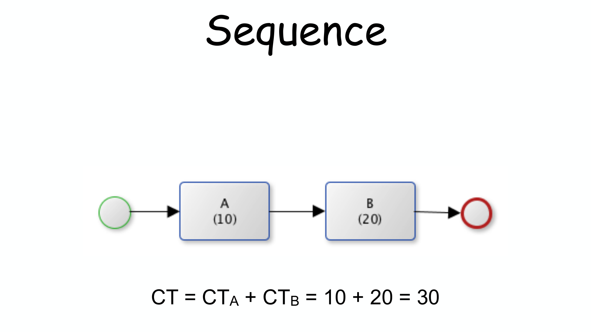
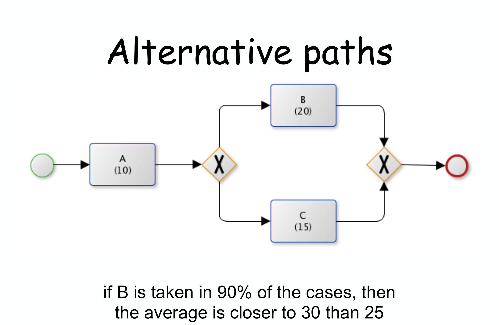
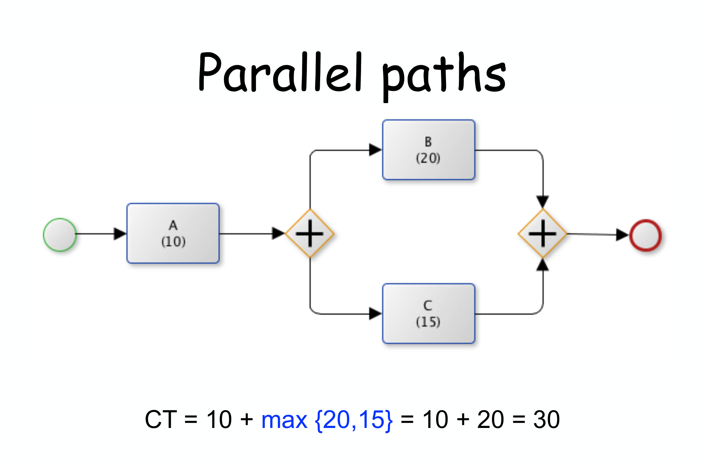
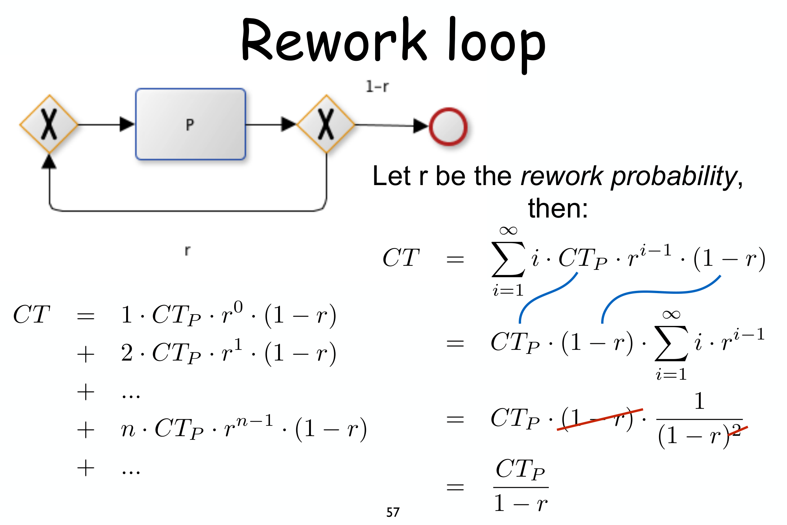

---
tags:
  - università/business-process-modeling
  - performance-analysis
  - flow-analysis
  - cycle-time
  - littles-law
  - cost-analysis
data: 2026-07-04
lezione: "20 — Quantitative analysis"
corso: "MPB (6 cfu, 295AA)"
professore: "Roberto Bruni"
fonte: "Dumas et al., *Fundamentals of Business Process Management*, Ch.7"
---

# Quantitative Analysis

Fin qui ci siamo chiesti se un processo fosse **corretto** (soundness, verification): domande qualitative come "c'è un deadlock?", "tutti i casi terminano?". Questa lezione cambia registro e affronta le domande **quantitative**: quanto è **veloce**, quanto **costa**, quanti casi si riescono a gestire in un'ora? È il campo della **performance analysis**.

> [!note] Verification vs performance analysis
>
> - **Validation**: il modello rispecchia la realtà?
> - **Verification**: domande *qualitative* — c'è un deadlock possibile? un caso specifico può sempre essere gestito con successo? due task si possono eseguire in qualsiasi ordine?
> - **Performance analysis**: domande *quantitative* — quanti casi si gestiscono in un'ora? qual è il tempo medio di attraversamento? quante risorse extra servono?

---

## Le dimensioni della performance

Qualunque azienda vuole processi più **veloci**, più **economici** e **migliori**. Questi tre aggettivi corrispondono a tre dimensioni misurabili.

> [!definition] Le tre dimensioni
>
> - **Time** (veloce): quanto tempo richiede il processo.
> - **Finance** (economico): quanto costa eseguirlo.
> - **Quality** (migliore): quanto è soddisfacente per chi lo vive, dentro e fuori l'azienda.

Per misurare una dimensione serve una quantità *precisa e univoca*: un **Key Performance Indicator (KPI)**.

### Time

> [!definition] Le tre componenti del tempo
>
> - **Cycle time**: il tempo totale per gestire un caso, dall'inizio alla fine.
> - **Processing time** (o *service time*): il tempo che le risorse spendono **effettivamente** lavorando sul caso.
> - **Waiting time**: il tempo che il caso passa **in attesa** (in coda, per l'indisponibilità di una risorsa, ecc.), senza che nessuno vi lavori sopra.
>
> Gli obiettivi tipici riguardano il cycle time: ridurne la **media**, ridurne il **massimo**, oppure rispettare un tempo **concordato** col cliente.

### Finance

> [!note] Tipi di costo
>
> - **Fixed cost**: costi fissi, indipendenti dall'intensità di lavorazione (infrastruttura, manutenzione).
> - **Variable cost**: correlati positivamente a qualche quantità (volume di vendite, nuove assunzioni).
> - **Operational cost**: legati direttamente all'**output** del processo (es. costo del lavoro per produrre un bene). È spesso il bersaglio principale del process redesign — anche se automatizzare un task, pur riducendo il costo del lavoro, introduce costi incidentali di sviluppo e manutenzione dell'applicazione.

### Quality

> [!note] Due prospettive
>
> - **External quality**: dal punto di vista del **cliente** (soddisfazione per il prodotto, per come è stato gestito il processo — quantità, rilevanza e tempestività delle informazioni ricevute).
> - **Internal quality**: dal punto di vista di **chi esegue** il processo (controllo sul proprio lavoro, varietà, sfide).
>
> Spesso la external quality si misura *in termini di tempo* (es. percentuale di scadenze rispettate): per questo, in pratica, una misura di qualità legata al tempo viene classificata sotto la dimensione **time**.

### Derivare i KPI

Un metodo pratico per passare da un obiettivo generico a un KPI misurabile:

> [!note] Tre passi
>
> 1. Formulare l'obiettivo ad **alto livello** (uno stato desiderabile);
> 2. per ogni obiettivo, individuare **dimensione** e **funzione di aggregazione** (count, average, variance, min, max, …) e derivarne uno o più KPI;
> 3. fissare un **target** per ciascun KPI.

> [!example] Un ristorante che vuole migliorare il servizio
>
> Obiettivo: "i clienti dovrebbero essere serviti entro 30 minuti". KPI: **ST30** = percentuale di clienti serviti entro 30 minuti, target $\ge 97\%$. Oppure, più ambizioso: **ST15** (serviti entro 15 minuti, target $\ge 85\%$), o direttamente **AMDT** = tempo medio di consegna del pasto, target $\le 15'$.

---

## Flow analysis: dai tempi delle attività al tempo del processo

La **flow analysis** è una famiglia di tecniche per stimare la performance **complessiva** di un processo a partire dalla performance **delle singole attività** — analogamente si può calcolare il costo medio del processo dal costo di ogni attività, o il tasso d'errore complessivo dai tassi d'errore locali. Qui ci concentriamo sul caso più istruttivo: il **cycle time**.

> [!definition] Cycle time analysis
>
> Il **cycle time** (CT) di un'attività o processo è la differenza fra l'istante di completamento e quello in cui il caso è pronto per essere eseguito. L'assunzione di base: sono note le **medie** dei tempi di ciascuna attività coinvolta (activity time = waiting time + processing time).

Si analizzano quattro **pattern di flusso** ricorrenti, componendoli via via su strutture più complesse: **sequenza**, **cammini alternativi** (XOR), **cammini paralleli** (AND), **rework** (cicli). Notazione: $CT$ indica il cycle time medio; $CT_A, CT_B, \dots$ quello delle singole attività.

### Sequenza

> [!theorem] Sequenza
>
> Il cycle time di un frammento puramente sequenziale è la **somma** dei cycle time delle attività:
> $$CT = \sum_{i=1}^n CT_i$$

*Fig. — Sequenza: $CT = CT_A + CT_B = 10+20=30$. Ovvio, ma è il mattone su cui si costruiscono gli altri pattern.*

### Cammini alternativi (XOR)

Con uno XOR-split/join il processo segue **un solo** ramo per caso, ma rami diversi in casi diversi: il cycle time medio dipende da **quanto spesso** ciascun ramo viene preso.

> [!definition] Branching probability
>
> La **branching probability** $p_i$ di un ramo è la frequenza con cui quel ramo viene scelto in un dato gateway. Vale sempre $\sum_i p_i = 1$.

> [!theorem] XOR-block
>
> Il cycle time di uno **XOR-block** (il frammento fra uno XOR-split e il corrispondente join) è la **media pesata** dei cycle time dei rami:
> $$CT = \sum_{i=1}^n p_i \cdot CT_i$$

*Fig. — Se **B** ($CT_B=20$) è preso nel 90% dei casi e **C** ($CT_C=15$) nel 10%, la media pesata è $0.9\cdot20+0.1\cdot15=19.5$, vicina a 30 (=$CT_A+CT_B$) proprio perché il ramo lento è quello più frequente.*

### Cammini paralleli (AND)

Con un AND-split i rami partono **insieme**; il caso prosegue solo quando **tutti** sono completati — quindi conta il ramo più lento, non la somma.

> [!theorem] AND-block
>
> Il cycle time di un **AND-block** è il cycle time del ramo **più lento**:
> $$CT = \max_i \{CT_i\}$$

*Fig. — $CT = CT_A + \max\{CT_B,CT_C\} = 10+\max\{20,15\}=30$: **non** $10+20+15=45$, perché B e C avvengono **contemporaneamente**, non uno dopo l'altro.*

Sequenza, XOR e AND si combinano liberamente in un processo strutturato a blocchi, sommando/mediando/massimizzando via via ogni sotto-blocco.

### Rework loop: cicli

Il pattern più delicato è il **rework**: un frammento $P$ che può essere ripetuto, con una certa probabilità $r$ di tornare indietro invece di uscire. Ci sono due varianti, a seconda che $P$ venga eseguito **almeno una volta** oppure anche **zero volte**.

> [!definition] Rework probability
>
> La **rework probability** $r$ è la frequenza con cui, dopo aver eseguito $P$, si decide di **ripeterlo** invece di procedere (probabilità complementare $1-r$ di uscire).

Il ragionamento è lo stesso della [[14 - Invariants|serie geometrica]]: $P$ viene eseguito $1$ volta con probabilità $(1-r)$, $2$ volte con probabilità $r(1-r)$, $3$ volte con probabilità $r^2(1-r)$, e così via — sommando il contributo di ognuna di queste possibilità pesata per la sua probabilità si ottiene una serie che converge a una forma chiusa sorprendentemente semplice.

> [!theorem] Rework loop (1 o più volte)
>
> Se $P$ viene eseguito **almeno una volta** (esce solo dopo il primo tentativo, con probabilità $1-r$ di fermarsi ogni volta):
> $$CT = \sum_{i=1}^{\infty} i \cdot CT_P \cdot r^{i-1}(1-r) = \frac{CT_P}{1-r}$$

*Fig. — Derivazione di $CT = CT_P/(1-r)$: si somma $i \cdot CT_P \cdot r^{i-1}(1-r)$ su tutti i possibili numeri di ripetizioni $i$; la serie $\sum i\, r^{i-1}$ è quella nota dell'analisi (converge a $1/(1-r)^2$), e i due fattori $(1-r)$ si semplificano.*

> [!theorem] Rework loop (0 o più volte)
>
> Se invece $P$ può essere **saltato del tutto** (eseguito 0 volte con probabilità $1-r$, e così via):
> $$CT = \frac{r \cdot CT_P}{1-r}$$
>
> *Intuizione:* è esattamente il caso "1 o più volte" **meno** una singola esecuzione di $P$ già "scontata":
> $$\frac{CT_P}{1-r} - CT_P = \left(1-(1-r)\right)\cdot\frac{CT_P}{1-r} = \frac{r\cdot CT_P}{1-r}$$

---

## Oltre il cycle time: waiting vs processing, e Little's law

Il cycle time da solo non dice **dove** si nasconde il tempo perso. Separarlo in waiting e processing chiarisce dove intervenire.

> [!note] Waiting time vs processing time
>
> - **Waiting time**: la parte del cycle time in cui **nessuno lavora** sul caso (es. documenti in transito, attesa di un attore libero).
> - **Processing time**: il tempo in cui qualcuno **lavora davvero** sul caso.
>
> In molti processi reali il waiting time è la parte **dominante** del cycle time (lavorazione a lotti, attori non disponibili, approvazioni che aspettano una firma).

> [!definition] Theoretical cycle time e Cycle Time Efficiency
>
> Il **theoretical cycle time (TCT)** si calcola con le **stesse formule** del CT, ma usando i **processing time** al posto dei cycle time — è il tempo che il processo impiegherebbe se non ci fosse **mai** attesa.
>
> La **Cycle Time Efficiency**:
> $$CTE = \frac{TCT}{CT}$$
>
> - $CTE$ vicino a $1$: poco margine di miglioramento (a meno di cambiamenti radicali del processo).
> - $CTE$ vicino a $0$: **molto** margine, riducendo il waiting time.

Un secondo strumento, indipendente dalla struttura del processo, lega il cycle time a due grandezze osservabili senza bisogno di conoscere i tempi delle singole attività.

> [!definition] Arrival rate e Work-In-Process
>
> - **Arrival rate** $\lambda$: numero medio di **nuovi casi** creati per unità di tempo.
> - **Work-In-Process (WIP)**: numero medio di casi **attivi** (non ancora completati) in un dato istante.

> [!theorem] Little's law
>
> In un sistema **stabile** (il numero di casi attivi non cresce all'infinito):
> $$WIP = \lambda \cdot CT$$
> equivalentemente:
> $$CT = \frac{WIP}{\lambda}$$
>
> Formulata da John Little nel 1954 (dimostrata nel 1961), è universale: non serve sapere **nulla** della struttura interna del processo, bastano due grandezze **osservabili dall'esterno** (contare i casi attivi, contare gli arrivi).

> [!example] Uso pratico di Little's law
>
> Se in un anno (250 giorni lavorativi) arrivano 2500 domande, $\lambda = 10$/giorno. Campionando nel tempo si osservano in media $WIP=200$ domande attive contemporaneamente. Allora $CT = 200/10 = 20$ giorni — calcolato **senza mai** aver misurato il tempo di una singola domanda.

> [!tip] La lettura operativa
>
> Dalla relazione $WIP = \lambda \cdot CT$: se $\lambda$ **aumenta** (più richieste in arrivo) e non si vuole far crescere il $WIP$ (cioè non si vuole più personale/spazio impegnato), l'**unica leva** è ridurre il $CT$ — lavorare più in fretta, snellendo il processo.

---

## Cost analysis

Le stesse idee della flow analysis si applicano al **costo** invece che al tempo: le formule per sequenza, XOR-block e rework restano **identiche**; cambia solo l'AND-block, dove — a differenza del tempo — i costi dei rami paralleli si **sommano** (il lavoro *costa* comunque, anche se avviene in parallelo).

> [!note] Cost = human resource cost + other cost
>
> - **Human resource cost**: costo orario della risorsa $\times$ processing time del task.
> - **Other cost**: costi fissi legati all'esecuzione del task, indipendenti dal tempo di lavoro umano (es. una fee fissa per un controllo esterno).

*Fig. — Applicare le stesse regole di flow analysis al costo: il **rework** su "check completeness" (20%) si tratta come nel cycle time ($/(1-0.2)$); i due rami paralleli "check credit history"/"check income sources" si **sommano** (non si prende il massimo, perché i costi si accumulano anche se il tempo no); lo XOR finale granted/denied si pesa con le rispettive probabilità (60%/40%). Costo medio totale: $\approx 321$€.*

---

## Limiti della flow analysis

La flow analysis è potente ma ha ipotesi forti, da tenere a mente prima di applicarla.

> [!warning] Pitfall
>
> - Le formule valgono solo per processi **block-structured** (sequenza/XOR/AND/rework ben annidati): non si applicano a un grafo qualsiasi.
> - Servono **stime affidabili** dei tempi medi delle attività (da interviste o dai log) — l'intera analisi eredita l'incertezza di queste stime.
> - Non tiene conto del **carico**: quando il carico di lavoro sale e le risorse restano costanti, il waiting time **cresce** — un effetto che la flow analysis, basata su medie statiche, non cattura (servirebbero modelli di code).

---

## Riepilogo

> [!abstract] Il quadro
>
> - Tre dimensioni di performance: **time**, **finance**, **quality** — misurate da KPI concreti.
> - **Flow analysis**: cycle time di sequenza (somma), XOR-block (media pesata), AND-block (massimo), rework loop ($CT_P/(1-r)$ o $r\cdot CT_P/(1-r)$).
> - **CTE** = TCT/CT misura quanto margine di miglioramento resta riducendo le attese.
> - **Little's law** ($WIP = \lambda \cdot CT$) collega arrival rate, work-in-process e cycle time **senza** bisogno della struttura interna del processo.
> - Le stesse regole (tranne l'AND-block, che diventa una somma) valgono per il **costo**.

Con la performance analysis chiudiamo la cassetta degli attrezzi *quantitativa* del corso. Nell'ultima lezione torniamo ai workflow net per affrontare un problema pratico: cosa fare quando un processo **non** è sound — come **diagnosticarlo** e **ripararlo**. → [[21 - WFnets Diagnosis]]
