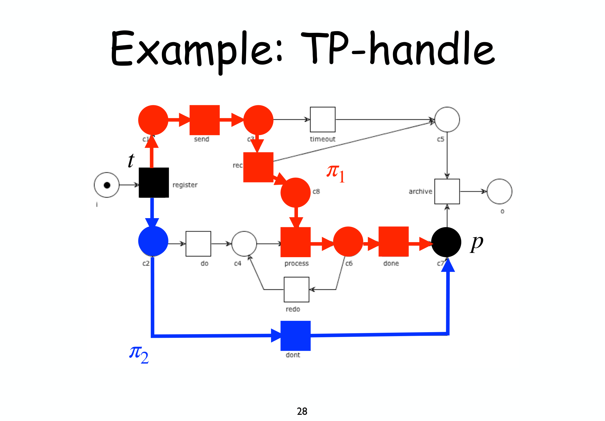
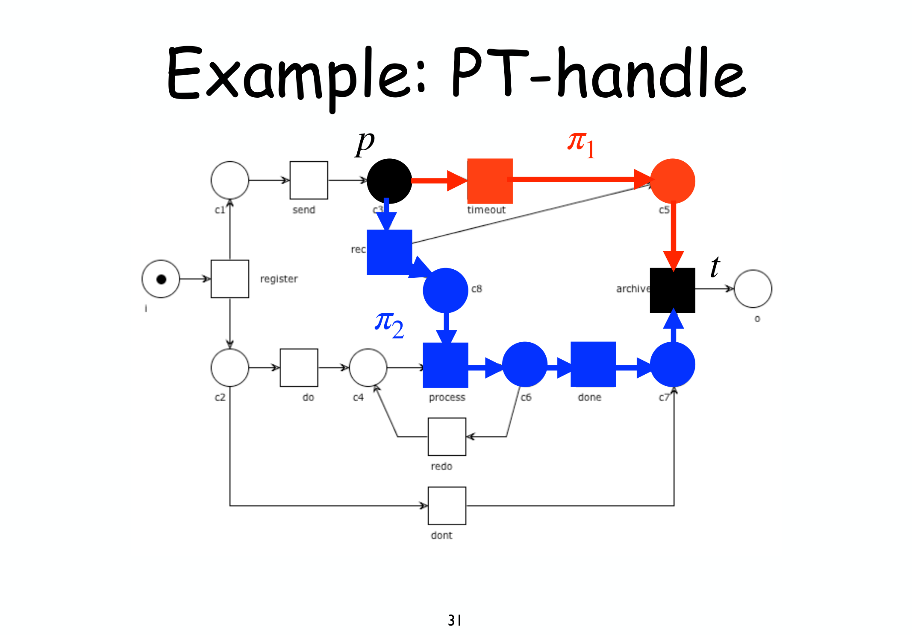
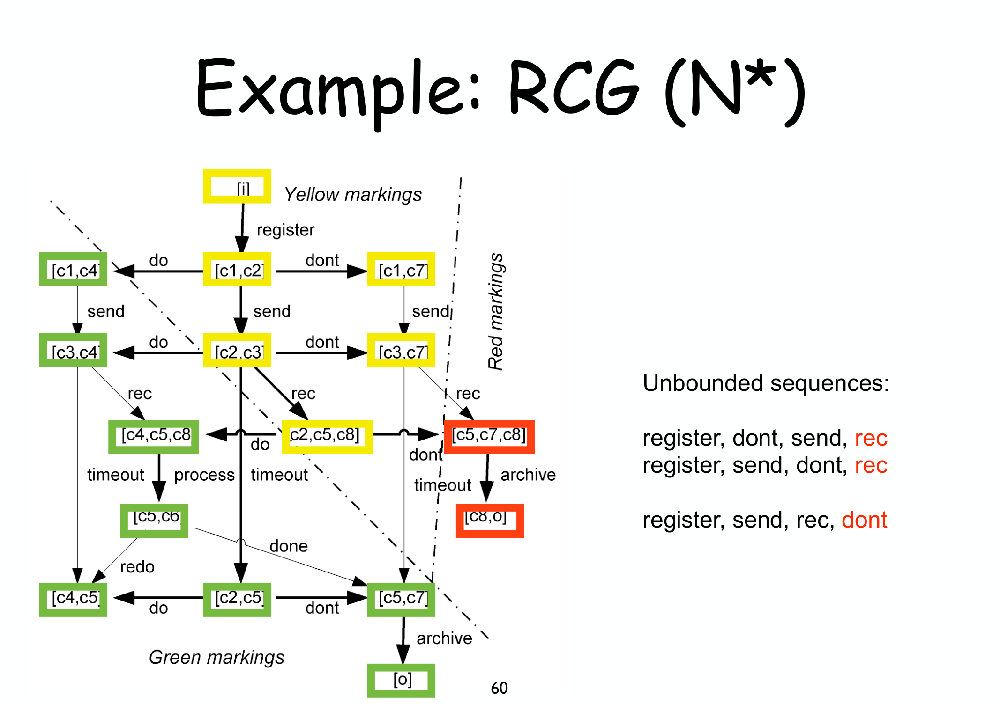

---
tags:
  - università/business-process-modeling
  - workflow-nets
  - free-choice
  - siphon
  - diagnosis
  - woped
  - woflan
data: 2026-07-04
lezione: "21 — Diagnosis for WF nets"
corso: "MPB (6 cfu, 295AA)"
professore: "Roberto Bruni"
fonte: "van der Aalst, *Diagnosing workflow processes using Woflan* (articolo, opzionale)"
---

# Diagnosis for Workflow Nets

Sappiamo ormai **verificare** se un workflow net è sound (liveness + boundedness di $N^\star$, [[12 - Soundness]]) e conosciamo classi di reti — [[15 - S-T Systems|S-net/T-net]], [[17 - Free Choice|free-choice]] — dove questa verifica è più semplice o addirittura strutturale. L'ultima lezione del corso completa il quadro con l'altra metà del problema: quando un net **non** è sound, come lo **diagnostichiamo**? Non basta un verdetto "non sound" — un progettista ha bisogno di sapere **dove** e **perché**. Vedremo tre strumenti, dal più strutturale (S-coverability) al più comportamentale (error sequences), così come implementati in tool reali (WoPeD, Woflan).

---

## S-coverability: certificare l'S-invariant positivo "a pezzi"

Ricordiamo il [[17 - Free Choice|Rank Theorem]]: un free-choice system è live e bounded sse valgono sei condizioni, fra cui "*ha un S-invariant positivo*". Il problema pratico è: **come si trova** un tale invariante, in modo intuitivo e non solo risolvendo un sistema lineare?

> [!tip] L'idea: decomporre in filoni paralleli
>
> Un caso reale è spesso composto da **filoni di controllo paralleli** (thread), ciascuno dei quali impone un ordine sui propri task. L'idea è decomporre la rete in **sotto-reti S-net** (una per filone) tali che **ogni place** della rete appartenga ad almeno una di esse (un place può comparire in più filoni). Ogni S-net induce, come sappiamo da [[15 - S-T Systems]], un **S-invariant uniforme**; sommandoli si ottiene un **S-invariant positivo** sull'intera rete.

Per formalizzare "sotto-rete S-net che si comporta bene", serve prima il concetto generale di **sottorete**, poi la nozione più specifica di **S-component**.

> [!definition] Subnet
>
> Dato $N=(P,T,F)$ e un insieme di nodi $X \subseteq P \cup T$, la **subnet** indotta da $X$ è $N' = (P\cap X,\, T\cap X,\, F\cap(X\times X))$: si prende un sottoinsieme di nodi e si **dimenticano** tutti gli archi verso l'esterno.

> [!definition] S-component
>
> Una subnet $N'$ indotta da $X$ è un **S-component** se:
> 1. è uno **S-net strongly connected** ([[15 - S-T Systems|S-net]]: ogni transizione ha esattamente un place in ingresso e uno in uscita);
> 2. per ogni place $p \in X \cap P$, **tutte** le transizioni collegate a $p$ (sia $\bullet p$ sia $p\bullet$) sono in $X$ — "se prendi un place, devi prendere anche tutte le sue transizioni".
>
> La condizione 2 è cruciale: evita di "tagliare a metà" le scelte di un place, garantendo che la subnet catturi *fedelmente* il comportamento locale di quel filone.

*Fig. — Un S-component (in blu): un ciclo **S-net strongly connected** dove, per ogni place incluso, **tutte** le transizioni ad esso collegate sono incluse a loro volta — altrimenti non sarebbe un S-net valido (si perderebbe l'alternanza "un solo arco in ingresso/uscita per transizione").*

Un solo S-component copre solo *alcuni* place; per coprirli tutti serve una **collezione**.

> [!definition] S-cover
>
> Un **S-cover** di $N$ è un insieme $C$ di S-component tale che **ogni place** di $N$ appartenga ad almeno uno di essi. $N$ è **S-coverable** se ammette un S-cover.

![Stessa rete con due S-component evidenziati (uno in blu su s1-t1-s3-t3-s7, uno in rosso su s2-t2-s6-t6-s8), che insieme coprono tutti i place; a fianco i vettori I1=[1 0 1 0 1 0 1 0] e I2=[0 1 0 1 0 1 0 1] la cui somma [1 1 1 1 1 1 1 1] è un S-invariant positivo](assets/21-wfnets-diagnosis_p19_s-cover-example.png)
*Fig. — Un S-cover con due S-component. Ciascuno induce un S-invariant uniforme (peso 1 sui place coperti, 0 altrove); **sommandoli** ($I_1+I_2$) si ottiene un S-invariant **positivo** su tutta la rete — la ricetta pratica per certificare uno dei sei ingredienti del Rank Theorem.*

Questa costruzione dà due teoremi — nella direzione contronominale, entrambi diventano test di **non-soundness**:

> [!theorem] S-coverability theorem 1
>
> Se un free-choice system è **live e bounded**, allora è **S-coverable**.
>
> **Conseguenza pratica** (contronominale):
>
> $$\text{free-choice} \ \wedge\ \neg\,\text{S-coverable} \ \Rightarrow\ \neg(\text{live} \wedge \text{bounded})$$
>
> In particolare:
>
> $$N \text{ free-choice} \ \wedge\ N^\star \text{ non S-coverable} \ \Rightarrow\ N \text{ non è sound}$$

> [!warning] Attenzione con WoPeD
>
> Il tool WoPeD gestisce la transizione reset **implicitamente**: gli S-component che mostra sono quelli di $N^\star$, **non** di $N$. Va tenuto a mente per non fraintendere il diagramma.

---

## Well-structuredness: PT/TP-handle

La S-coverability copre un caso, ma esiste un secondo teorema — utile quando la rete **non** è free-choice, o quando si vuole un criterio complementare. Si basa su due configurazioni strutturali "sospette": i **TP-handle** e i **PT-handle**.

> [!definition] TP-handle
>
> Una transizione $t$ e un place $p$ formano un **TP-handle** se esistono **due cammini elementari distinti** $\pi_1$ e $\pi_2$ da $t$ a $p$ i cui **unici nodi in comune** sono $t$ e $p$ (gli "estremi").
>
> Il caso tipico è un **AND-split** ($t$) i cui due rami paralleli confluiscono in un **XOR-join** ($p$): ciascun ramo, terminando in $p$, può depositarvi un token **indipendentemente** dall'altro — con il rischio di **token multipli** nello stesso place.

*Fig. — Un TP-handle: due cammini paralleli da `register` (AND-split, $t$) confluiscono nello stesso place $p$ senza una vera sincronizzazione — sintomo tipico di un **AND-split seguito da un XOR-join**, che può produrre token multipli.*

Il difetto duale riguarda l'ordine opposto: uno XOR-split i cui rami vengono poi **sincronizzati** come se fossero paralleli.

> [!definition] PT-handle
>
> Un place $p$ e una transizione $t$ formano un **PT-handle** se esistono due cammini elementari distinti $\pi_1,\pi_2$ da $p$ a $t$ con soli $p,t$ in comune.
>
> Il caso tipico è uno **XOR-split** ($p$) i cui due rami alternativi vengono poi sincronizzati da un **AND-join** ($t$): siccome i due rami sono **mutuamente esclusivi**, l'AND-join aspetterà per sempre il ramo non scelto — **deadlock**.

*Fig. — Un PT-handle: due cammini da $p$ (c3, uno XOR-split implicito) a $t$ (`archive`) condividono solo gli estremi — se i due rami sono in realtà **alternativi**, la sincronizzazione in $t$ può bloccarsi in attesa del ramo scartato.*

> [!definition] Well-handled e well-structured
>
> Una rete è **well-handled** se **non** ha né TP-handle né PT-handle. Un workflow net $N$ è **well-structured** se $N^\star$ è well-handled.

> [!theorem] S-coverability theorem 2
>
> Se $N$ è **sound** e **well-structured**, allora $N^\star$ è **S-coverable**.
>
> **Conseguenza pratica** (contronominale):
>
> $$N \text{ well-structured} \ \wedge\ N^\star \text{ non S-coverable} \ \Rightarrow\ N \text{ non è sound}$$
>
> Anche qui, come per il teorema 1, WoPeD calcola gli handle su $N^\star$ (reset implicito), non su $N$.

---

## Error sequences: individuare lo scenario minimo del difetto

I due criteri precedenti sono **strutturali**: dicono che qualcosa non va, ma non sempre indicano *la sequenza di eventi* che porta al problema. Le **error sequence** colmano questo buco: sono le **scene del crimine** più brevi possibili.

> [!definition] Error sequence (idea generale)
>
> Una error sequence è una firing sequence tale che:
> 1. **ogni continuazione** porta a un errore (option to complete o proper completion violate);
> 2. è **minimale**: nessun prefisso proprio ha già questa proprietà.
>
> Cattura l'essenza dell'errore di design nel modo più compatto possibile — uno "scenario minimo" da mostrare al progettista.

Le due varianti corrispondono ai due modi di rompere la soundness: la liveness (option to complete) e la boundedness (proper completion).

### Non-live sequences

> [!definition] Non-live sequence
>
> Una **non-live sequence** è una firing sequence più corta possibile dopo la quale **completare il caso non è più possibile** — cioè un testimone del fatto che la transizione **reset** è non-live in $N^\star$.

> [!theorem] Proprietà fondamentale
>
> Se $N^\star$ è **bounded** e $N$ **non ha task dead**, allora:
>
> $$N^\star \text{ è live} \quad\iff\quad N \text{ non ha non-live sequence}$$

L'analisi è possibile solo su sistemi **bounded** (altrimenti il reachability graph non è nemmeno finito) e si visualizza colorando gli stati del RG:

> [!note] Colorazione del reachability graph
>
> - **verde**: da questo stato, **ogni** cammino porta a $o$ (tutto bene);
> - **rosso**: da questo stato, **nessun** cammino porta a $o$ (condannato);
> - **giallo**: **alcuni** cammini portano a $o$, altri no (ancora recuperabile, ma rischioso).
>
> Le non-live sequence sono i cammini più corti che portano da uno stato giallo a uno **rosso**.

*Fig. — Il reachability graph colorato: dagli stati **gialli** (ancora recuperabili) alcuni scatti portano al **verde** (`[o]`, tutto bene) e altri al **rosso** (condannato). Le non-live sequence — `register,do`; `register,send,do`; `register,send,timeout`; … — sono gli scenari **più corti** che finiscono nel rosso: mostrano al progettista esattamente quale sequenza di scelte porta al blocco.*

### Unbounded sequences

Il difetto duale riguarda la boundedness: invece di bloccarsi, la rete potrebbe accumulare **infiniti token**.

> [!definition] Unbounded sequence
>
> Una **unbounded sequence** è una firing sequence di lunghezza minima tale che **ogni continuazione invalida la proper completion** — un testimone dell'unboundedness. Le marcature "indesiderate" sono quelle con peso infinito o quelle **strettamente maggiori** di $o$ (token in eccesso oltre al solo place finale).

> [!theorem] Proprietà fondamentale
>
> $$N^\star \text{ è bounded} \quad\iff\quad N \text{ non ha unbounded sequence}$$

La visualizzazione usa lo stesso schema a tre colori, ma sul **coverability graph** (CG, che rappresenta anche le marcature "infinite" con un simbolo $\omega$):

> [!note] Colorazione del coverability graph
>
> - **verde**: da qui le marcature indesiderate **non sono raggiungibili**;
> - **rosso**: da qui **nessuna** marcatura verde è raggiungibile (le indesiderate sono inevitabili);
> - **giallo**: le indesiderate sono raggiungibili ma **evitabili**.

Poiché il CG può diventare enorme (ogni marcatura $\omega$ genera altre marcature $\omega$, tutte rosse), conviene evitare di espanderle: nasce così una versione più economica.

> [!tip] Restricted Coverability Graph (RCG)
>
> Osservazione chiave: una marcatura a peso infinito genera **solo altre** marcature a peso infinito, e saranno **tutte rosse**. Si può quindi evitare del tutto di calcolarle, marcando direttamente come rosso il nodo che le genererebbe — risparmiando gran parte dell'esplorazione senza perdere informazione utile.

*Fig. — L'RCG evita di espandere gli stati a peso infinito (subito rossi), riducendo drasticamente lo spazio esplorato. Le unbounded sequence — es. `register,send,rec,dont` — sono gli scenari minimi che portano a un accumulo di token.*

---

## Woflan e ProM: gli strumenti in pratica

Questi criteri sono implementati in tool reali, pensati per dare diagnosi utilizzabili senza dover leggere a mano il reachability graph.

> [!note] Woflan (WOrkFLow ANalyzer)
>
> Verifica se $N$ è un sound workflow net rispondendo a tre domande in sequenza: *è $N$ un workflow net?* *è $N^\star$ bounded?* *è $N^\star$ live?* In caso negativo, fornisce diagnostica (place unbounded, transizioni dead o non-live). Nato come tool standalone per Windows, oggi è un **plugin di ProM** (promtools.org).

> [!warning] Il limite della diagnostica "a insiemi"
>
> Sapere *quali* place sono unbounded o *quali* transizioni sono dead è utile ma spesso **non basta** a capire la causa esatta dell'errore. Le **error sequence** (sopra) sono il complemento che localizza il problema in uno **scenario concreto**, invece che in un insieme statico di nodi sospetti.

---

## Chiusura del corso

Con questa lezione si chiude il percorso su Petri net e workflow: dalla costruzione ([[04 - Petri Nets]]) alla verifica strutturale (S/T-system, free-choice), dalla soundness alla sua **diagnosi pratica**. Il messaggio finale del corso, esplicito nelle ultime slide, è che quanto visto è solo **la punta dell'iceberg** del Business Process Management: dietro restano ancora notazione, teoria, tecnologia, strumenti, metodologia, encoding, validazione e verifica — un intero campo di ricerca sotto la superficie, lasciato all'esplorazione di chi vuole andare oltre.
