---
tags:
  - università/business-process-modeling
  - esercizi
  - petri-nets
  - workflow-nets
  - pratica
data: 2026-07-04
lezione: "Esercizi guidati (trasversale a tutto il corso)"
corso: "MPB (6 cfu, 295AA)"
professore: "Roberto Bruni"
fonte: "Rielaborazione degli esempi delle slide del corso"
---

# Esercizi Guidati

Le lezioni teoriche di questo vault evitano deliberatamente gli esercizi, per restare concentrate su concetti e dimostrazioni. Ma questo esame — e soprattutto il **progetto** — richiede di *saper fare*, non solo di sapere. Questo file è il complemento pratico: per ogni tecnica che richiede manualità (costruire, calcolare, verificare) trovi **un solo esempio**, risolto **passo dopo passo**, con la rappresentazione grafica a fianco di ogni passaggio.

> [!tip] Come usarlo
>
> Per ogni sezione: prova a fare il passo **prima** di leggere la soluzione, poi confronta. Ogni sezione rimanda alla lezione teorica corrispondente (link in testa) per i dettagli formali — qui c'è solo "come si fa".

---

## 1. Il token game: simulare gli scatti di un Petri net

*Teoria: [[04 - Petri Nets]].*

Regola dello scatto: una transition $t$ è **enabled** se ogni suo input place ha almeno un token. Quando scatta:

$$
t \text{ consuma un token da ogni place in } \bullet t \qquad\qquad t \text{ produce un token in ogni place di } t\bullet
$$

Prendiamo una rete con 4 place e 4 transition, dove $t_1$ è un **AND-split** (un input, due output) e $t_3$ un **AND-join** (due input, un output):

> [!note] La rete
>
> $$
> \begin{aligned}
> \bullet t_1 &= \{p_1\} & t_1\bullet &= \{p_2,p_3\} \\[4pt]
> \bullet t_2 &= \{p_3\} & t_2\bullet &= \{p_1\} \\[4pt]
> \bullet t_3 &= \{p_2,p_3\} & t_3\bullet &= \{p_4\} \\[4pt]
> \bullet t_4 &= \{p_4\} & t_4\bullet &= \{p_3\}
> \end{aligned}
> $$
>
> $p_3$ è conteso fra $t_2$ e $t_3$: appena $p_3$ ha un token, **entrambe** possono scattare — è un punto di scelta. Come vedremo nella sezione 4, qui la rete **non è free-choice**, perché
>
> $$
> \bullet t_2 = \{p_3\} \qquad\text{e}\qquad \bullet t_3 = \{p_2,p_3\}
> $$
>
> si intersecano ($\{p_3\}$) senza coincidere.

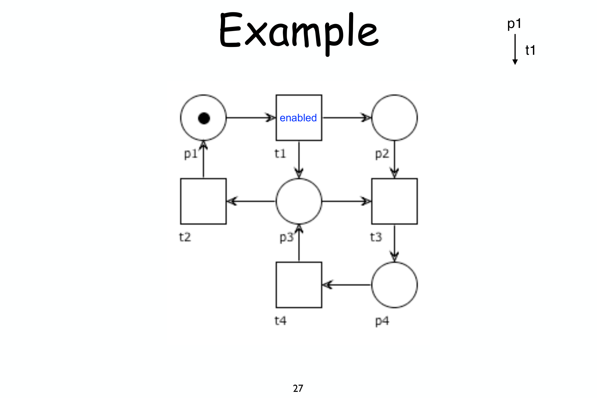
*Fig. — Stato iniziale $M_0 = p_1$: solo $t_1$ è enabled (il suo unico input $p_1$ ha il token).*

Seguiamo lo scatto passo-passo:

> [!example] La sequenza di scatti
>
> **Passo 1** — enabled: $t_1$ (unico input $p_1$ marcato).
>
> $$M_0 = p_1 \ \xrightarrow{\ t_1\ }\ M_1 = p_2+p_3$$
>
> **Passo 2** — enabled: $t_2$ (via $p_3$) e $t_3$ (via $p_2,p_3$). Scatta $t_2$.
>
> $$M_1 = p_2+p_3 \ \xrightarrow{\ t_2\ }\ M_2 = p_1+p_2$$
>
> **Passo 3** — enabled: $t_1$. $p_2$ aveva già un token, ora ne ha due.
>
> $$M_2 = p_1+p_2 \ \xrightarrow{\ t_1\ }\ M_3 = 2p_2+p_3$$
>
> **Passo 4** — enabled: $t_3$ (consuma un token da $p_2$ e uno da $p_3$).
>
> $$M_3 = 2p_2+p_3 \ \xrightarrow{\ t_3\ }\ M_4 = p_2+p_4$$
>
> **Passo 5** — enabled: $t_4$.
>
> $$M_4 = p_2+p_4 \ \xrightarrow{\ t_4\ }\ M_5 = p_2+p_3$$
>
> Da qui il gioco continua: $M_5$ è già lo stato visto al passo 2, il ciclo si ripete.

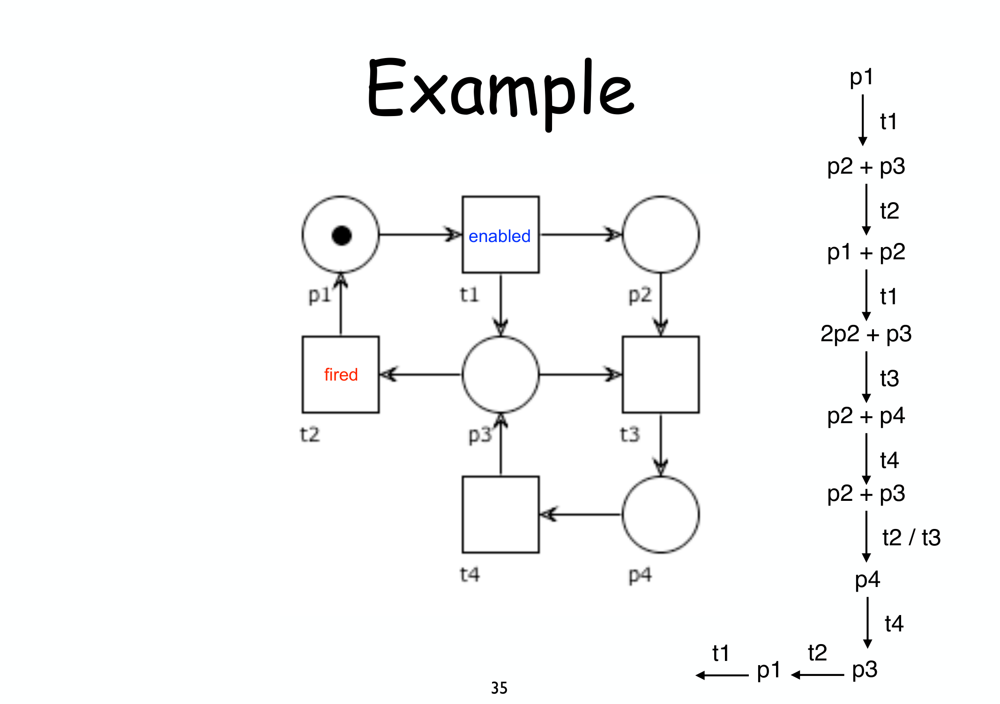
*Fig. — L'intera traccia in un colpo d'occhio: ogni riga è "marcatura → scatto → marcatura successiva". Nota come al passo `t2/t3` la marcatura $p_2+p_3$ riabiliti **entrambe** le transizioni: nel disegno si segue il ramo di $t_3$, ma $t_2$ era ugualmente possibile.*

> [!warning] Occhio alla molteplicità
>
> Al passo 3:
>
> $$M_2 = p_1+p_2 \ \xrightarrow{\ t_1\ }\ M_3$$
>
> $t_1$ produce **un** token in $p_2$ e **uno** in $p_3$, che si sommano a quelli già presenti — $p_2$ passa da 1 a 2 token. Il token game **non sostituisce** i contenuti dei place, li **somma/sottrae**.

---

## 2. Costruire il reachability graph (algoritmo BFS)

*Teoria: [[09 - Occurrence Graph]].*

L'algoritmo è una visita in ampiezza (BFS) sull'insieme delle marcature raggiungibili:

> [!note] Algoritmo
>
> 1. `Todo = {M0}`, `Nodes = {}`, `Arcs = {}`.
> 2. Estrai una marcatura $M$ da `Todo`, aggiungila a `Nodes`.
> 3. Per **ogni** transition enabled in $M$, calcola la marcatura successiva $M'$ e registra l'arco $(M,t,M')$.
> 4. Le $M'$ **mai viste prima** (né in `Nodes` né in `Todo`) vanno aggiunte a `Todo`.
> 5. Ripeti finché `Todo` non è vuoto.

Applichiamolo a un semaforo singolo: 3 place (`red`, `green`, `yellow`), 3 transition (`go-green`, `go-yellow`, `go-red`), $M_0=\text{red}$.

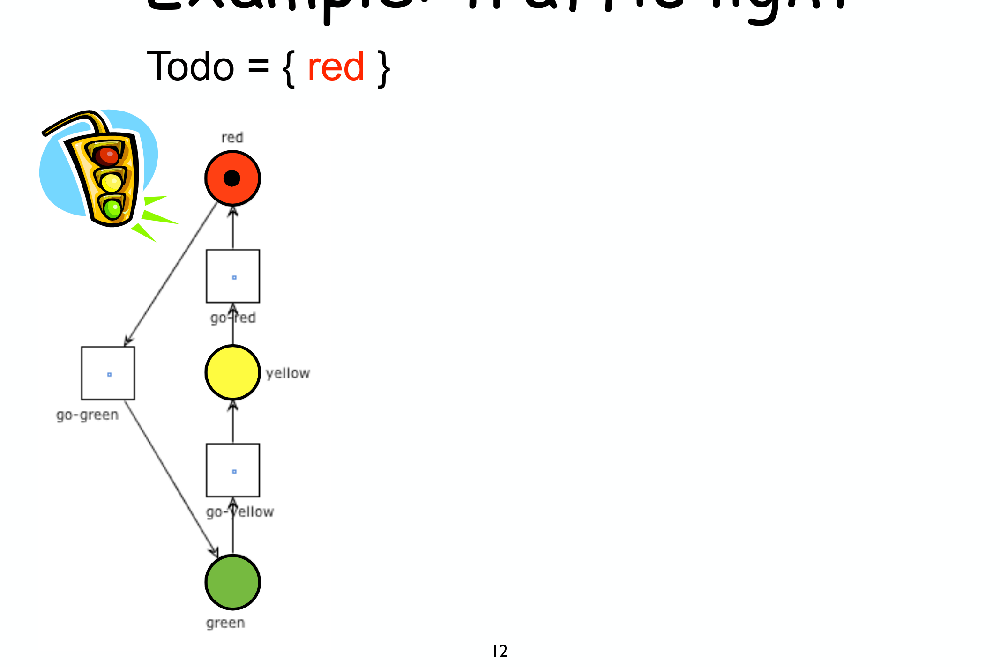
*Fig. — Passo 1: si esplora `red`, l'unica marcatura in `Todo`. È enabled solo `go-green` (il suo unico input è `red`), che porta a `green` — nuova, va aggiunta a `Todo`.*

> [!example] Il resto della BFS
>
> - `Todo={green}`: esploro `green` → enabled `go-yellow` → produce `yellow` (nuova) → `Todo={yellow}`.
> - `Todo={yellow}`: esploro `yellow` → enabled `go-red` → produce `red` (**già in Nodes**, non si riaggiunge) → `Todo={}`.
> - `Todo` vuoto: **fine**. Il reachability graph ha 3 nodi e 3 archi, ed è esso stesso un ciclo.

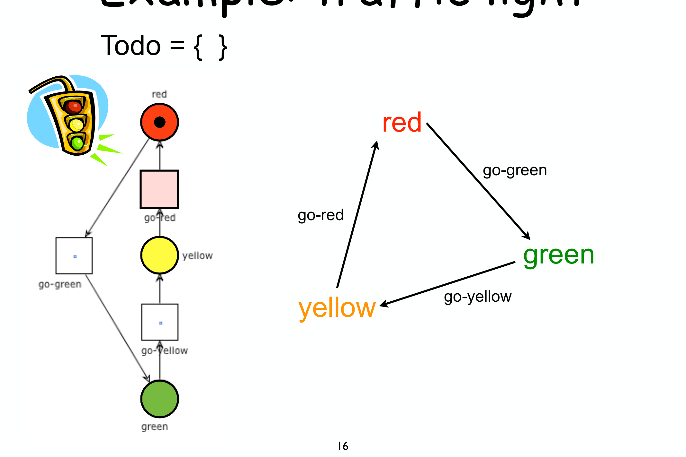
*Fig. — Il reachability graph completo: un triangolo orientato. Da qualunque stato si può tornare a `red` — la rete è ciclica, e (essendo un solo token che gira) anche live e safe.*

> [!tip] La regola pratica
>
> Ogni volta che generi una nuova marcatura, **controllala contro tutte quelle già viste** (in `Nodes` *e* in `Todo`) prima di aggiungerla: è l'unico modo per evitare di esplorare la stessa marcatura due volte (e per accorgersi che il grafo è finito, se lo è).

---

## 3. Matrice di incidenza e marking equation

*Teoria: [[11 - Net Matrices]].*

Costruiamo la **incidence matrix** $\mathbf{N}$ di una rete (righe = place, colonne = transition):

$$
\mathbf{N}(p,t) =
\begin{cases}
-1 & \text{se } p\in\bullet t\setminus t\bullet \\[4pt]
+1 & \text{se } p\in t\bullet\setminus\bullet t \\[4pt]
\phantom{+}0 & \text{altrimenti}
\end{cases}
$$

sul distributore automatico con 5 place e 5 transition.

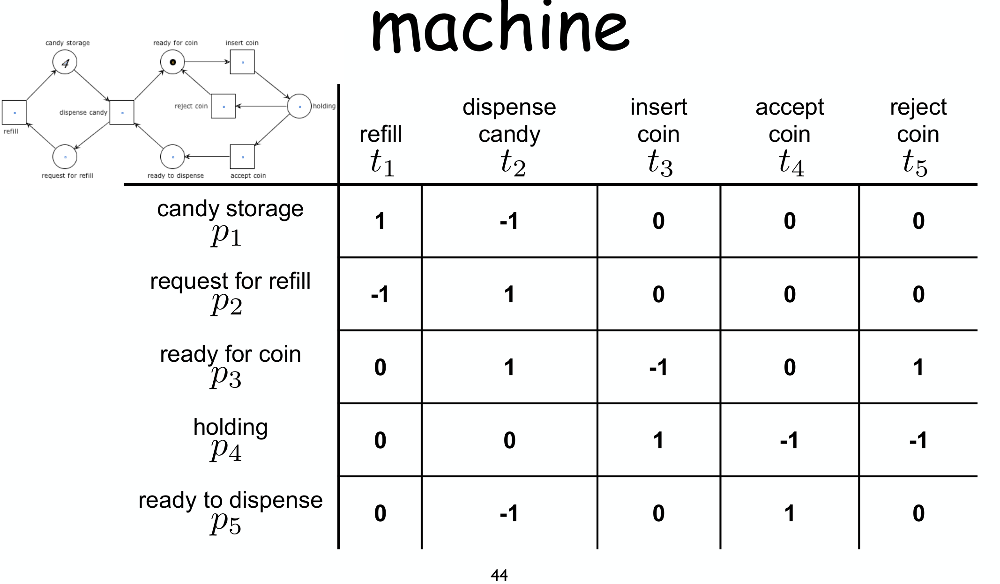
*Fig. — La matrice si legge colonna per colonna: la colonna di `dispense candy` ($t_2$) ha $-1$ su `candy storage` (consuma candy) e $+1$ su `request for refill` e $-1$ su `ready to dispense`... ogni colonna è il "bilancio" di quella transition su ogni place.*

La **marking equation** dice che, dopo una firing sequence $\sigma$ con Parikh vector $\vec\sigma$ (quante volte compare ogni transition), la marcatura finale si calcola **senza simulare passo-passo**:

$$M' = M_0 + \mathbf{N}\cdot\vec\sigma$$

> [!example] Applicarla
>
> Marcatura iniziale e sequenza da riprodurre:
>
> $$
> M_0 = [4,0,1,0,0] \qquad\qquad \sigma = t_3\,t_5\,t_3\,t_4\,t_2
> $$
>
> Il Parikh vector conta quante volte compare ciascuna transition ($t_1$ zero volte, $t_2$ una volta, $t_3$ due volte, $t_4$ una volta, $t_5$ una volta):
>
> $$\vec\sigma = [0,1,2,1,1]$$
>
> Si calcola $M_0 + \mathbf{N}\cdot\vec\sigma$ moltiplicando la matrice per il vettore colonna e sommando a $M_0$.

![Calcolo completo: M0=[4,0,1,0,0] + N (matrice 5x5 con i valori) · σ⃗=[0,1,2,1,1] = [3,1,1,0,0], mostrato come somma di matrici/vettori con tutti i numeri](assets/11-net-matrices_p74_marking-equation.png)
*Fig. — Il conto fatto fino in fondo.*

$$M_0 + \mathbf{N}\vec\sigma = [3,1,1,0,0]$$

> [!warning] Nota bene
>
> Questo calcolo **non dice se $\sigma$ è davvero eseguibile** (per quello serve verificare passo passo che ogni transition trovi i token) — dice solo *dove si arriverebbe se lo fosse*. È lo strumento perfetto per il **test negativo**: se il risultato non torna con una marcatura attesa, quella marcatura **di sicuro non è raggiungibile** con quel $\vec\sigma$.

---

## 4. Calcolare S-invariant e T-invariant risolvendo un sistema lineare

*Teoria: [[14 - Invariants]].*

Riprendiamo la rete della sezione 1 e cerchiamone gli invarianti **a mano**:

$$
\begin{aligned}
t_1&: p_1\to p_2,p_3 \\[4pt]
t_2&: p_3\to p_1 \\[4pt]
t_3&: p_2,p_3\to p_4 \\[4pt]
t_4&: p_4\to p_3
\end{aligned}
$$

*Fig. — La rete da analizzare algebricamente.*

**Passo 1 — matrice di incidenza** (righe $p_1..p_4$, colonne $t_1..t_4$):

| | $t_1$ | $t_2$ | $t_3$ | $t_4$ |
|---|---|---|---|---|
| $p_1$ | $-1$ | $+1$ | $0$ | $0$ |
| $p_2$ | $+1$ | $0$ | $-1$ | $0$ |
| $p_3$ | $+1$ | $-1$ | $-1$ | $+1$ |
| $p_4$ | $0$ | $0$ | $+1$ | $-1$ |

### S-invariant: risolvere $I\cdot\mathbf{N}=\mathbf{0}$

**Passo 2** — imponi, per ogni **colonna** (transition), "peso consumato = peso prodotto": con $I=[I_1,I_2,I_3,I_4]$,

$$
\begin{cases}
t_1:\ -I_1+I_2+I_3=0\\
t_2:\ I_1-I_3=0\\
t_3:\ -I_2-I_3+I_4=0\\
t_4:\ I_3-I_4=0
\end{cases}
$$

**Passo 3** — risolvi: da $t_2$, $I_1=I_3$; da $t_4$, $I_3=I_4$; sostituendo in $t_1$:

$$-I_3+I_2+I_3=0 \ \Longrightarrow\ I_2=0$$

(e $t_3$ è automaticamente soddisfatta). Soluzione generale:

$$I = [k,\ 0,\ k,\ k]$$

> [!example] Risultato
>
> Prendendo $k=1$:
>
> $$I = [1,\ 0,\ 1,\ 1]$$
>
> è un S-invariant. È **semi-positive** ($I\ge 0$, non tutto zero) ma **non positive** (il peso su $p_2$ è $0$).

> [!warning] Il punto sottile: cosa NON certifica un invariante semi-positive
>
> Da [[14 - Invariants]]: solo un S-invariant **positive** certifica la boundedness di **tutti** i place. Qui $p_2$ ha peso $0$, quindi $I$ **non dice nulla** su $p_2$. E infatti $p_2$ è **davvero unbounded**: basta scattare ripetutamente $t_1,t_2,t_1,t_2,\dots$ (mai $t_3$) per accumulare in $p_2$ un token in più a ogni giro, senza che nulla lo consumi. L'esempio mostra bene perché la teoria richiede *positive* e non solo *semi-positive*.

### T-invariant: risolvere $\mathbf{N}\cdot J=\mathbf{0}$

**Passo 2** — imponi, per ogni **riga** (place), "prodotto = consumato": con $J=[J_1,J_2,J_3,J_4]$,

$$
\begin{cases}
p_1:\ -J_1+J_2=0\\
p_2:\ J_1-J_3=0\\
p_3:\ J_1-J_2-J_3+J_4=0\\
p_4:\ J_3-J_4=0
\end{cases}
$$

**Passo 3** — risolvi: $J_1=J_2$ (da $p_1$), $J_1=J_3$ (da $p_2$), $J_3=J_4$ (da $p_4$); sostituendo in $p_3$:

$$J_1-J_1-J_1+J_1=0 \qquad\checkmark\ \text{sempre vera}$$

Soluzione:

$$J = [k,\ k,\ k,\ k]$$

> [!example] Risultato
>
> Con $k=1$:
>
> $$J = [1,\ 1,\ 1,\ 1] \qquad \textbf{positive}$$
>
> Significa: esiste una sequenza che usa **ogni transition esattamente una volta** e riporta la rete alla marcatura di partenza (nell'esempio: $t_1,t_3,t_4,t_2$ in un ordine compatibile fa proprio questo).

---

## 5. Verificare la soundness: costruire $N^\star$ e leggere il reachability graph a tre colori

*Teoria: [[12 - Soundness]], [[21 - WFnets Diagnosis]].*

Prendiamo il workflow net "register → send/dont → rec/timeout → process/redo/done → archive" già visto in [[21 - WFnets Diagnosis]] (place $i, c_1, c_2, c_3, c_4, c_5, c_6, c_7, c_8, o$).

> [!note] Passo 1 — costruire $N^\star$
>
> Aggiungi la transition **reset**:
>
> $$\bullet\,\text{reset} = \{o\} \qquad\qquad \text{reset}\,\bullet = \{i\}$$
>
> Ora la rete è ciclica e puoi costruire il reachability graph **finito** (assumendo che sia bounded — altrimenti serve il coverability graph, vedi [[21 - WFnets Diagnosis]]).

> [!note] Passo 2 — colorare gli stati del RG
>
> - **verde**: da qui *ogni* cammino arriva a $o$;
> - **rosso**: da qui *nessun* cammino arriva a $o$;
> - **giallo**: *alcuni sì, altri no* — ancora recuperabile.

![Reachability graph colorato: dallo stato iniziale [i] (giallo) si diramano vari cammini; alcuni finiscono in stati rossi (es. [c1,c4] raggiunto scattando "do" subito dopo "register"), altri in [c5,c7,c8] verde che porta a [o]; a fianco la lista delle non-live sequences: register+do, register+send+do, ecc.](assets/21-wfnets-diagnosis_p49_rg-nonlive.png)
*Fig. — Applicato al nostro esempio: dallo stato iniziale (giallo) alcune scelte (es. `register` poi subito `do`) portano dritte al **rosso** — quella diramazione non potrà **mai più** completare il caso. Basta **una** non-live sequence per concludere che $N^\star$ **non è live**, quindi $N$ **non è sound**.*

> [!example] Come si legge in pratica
>
> 1. Parti dallo stato iniziale $[i]$ (sempre giallo, a meno che la rete sia banale).
> 2. Segui gli scatti uno a uno; **appena** trovi uno stato da cui *nessuno* dei successori porta al verde, coloralo **rosso**.
> 3. La sequenza di scatti che ti ha portato lì (es. `register, do`) è una **non-live sequence**: lo scenario più corto e concreto che mostra il difetto.
> 4. Se **non** trovi mai uno stato rosso (tutti gli stati sono verdi o gialli-che-diventano-verdi), allora $N^\star$ è live; controlla poi la boundedness per concludere sulla soundness.

---

## 6. Tradurre un EPC in Petri net, passo dopo passo

*Teoria: [[16a - EPC Analysis]].*

Prendiamo l'EPC "goods arrived → check goods → (ok / not ok → complaint → data revised) → store goods" con un ramo parallelo "record receipts of goods", e applichiamo i tre step.

*Fig. — Il piano in tre mosse, da applicare in ordine.*

> [!example] Step 1 — frammenti locali
>
> - Ogni **event** → un place; ogni **function** → una transition (regola base, ricordando che per il **secondo/terzo approccio** la corrispondenza dipende dal contesto — vedi [[16a - EPC Analysis]]).
> - Il connettore **AND** dopo "check goods" (che porta sia a "ok/not ok" sia in parallelo a "record receipts") diventa una transition che produce **due** token, uno per ramo.
> - Il connettore **OR** finale (che riceve da "store goods" oppure da "record receipts", o da entrambi) si traduce come **xor + and** — la combinazione vista in dettaglio più sotto.

*Fig. — Se il tuo EPC ha un OR-**split**, il frammento è: uno strato XOR che sceglie **quale sottoinsieme** di rami attivare, poi uno strato AND che li lancia tutti insieme.*

*Fig. — L'OR-**join** duale: il frammento dovrebbe sincronizzare *solo* i rami attivati — è il punto dove nascono le ambiguità (vedi la sezione "OR join" in [[16a - EPC Analysis]]).*

> [!example] Step 2 e 3 — connettere e chiudere
>
> - **Step 2**: dove due frammenti si toccano lasciando due place (o due transition) consecutivi, inserisci un **dummy** di raccordo (o **fondi** i due nodi, a seconda dello stile scelto).
> - **Step 3**: se ci sono più eventi di start (qui solo uno, "goods arrived") o più eventi finali, aggiungi un connettore XOR/AND/OR che li unifica in un solo place iniziale $i$ e uno finale $o$.

*Fig. — Il prodotto finito dei tre step. Ora puoi applicare direttamente la sezione 5 (costruire $N^\star$ e leggerne il RG a colori) per rispondere a "è sound?". In questo caso specifico la risposta è **no**, proprio per colpa dell'OR-join (vedi [[16a - EPC Analysis]] per il perché).*

---

## 7. Tradurre un BPMN in Petri net (il "twist")

*Teoria: [[16b - BPMN Analysis]].*

Attenzione: nel BPMN la corrispondenza è **diversa** da quella EPC.

*Fig. — Da tenere sempre a mente prima di tradurre: **event** e **activity** → **transition**; gli **archi** (flow) → **place**. Il contrario dell'EPC.*

Traduciamo l'**Order process**: un evento iniziale, un AND-split che avvia "check credit card" e "prepare products" in parallelo, poi uno XOR ok?/no che nel ramo "yes" passa per un AND-join con "ship products", mentre il ramo "no" salta direttamente alla fine.

*Fig. — Il diagramma da tradurre.*

> [!example] Applicare il twist passo-passo
>
> 1. **Step 1 (flussi → place)**: metti un place su **ogni freccia** del diagramma (fra l'evento iniziale e l'AND-split, fra l'AND-split e ciascuna attività, ecc.).
> 2. **Step 2 (flow object → transition)**: metti una transition per l'evento iniziale, una per ciascuna attività, una per l'AND-split (con **due** output place, uno per ramo), una per l'AND-join (con **due** input place), due per lo XOR-split (una per il ramo "yes", una per il "no"), una per lo XOR-join.
> 3. **Step 3 (unico inizio/fine)**: qui c'è già un solo evento iniziale e uno finale, quindi non serve altro.

*Fig. — Il frammento da usare per ciascun gateway nello Step 2.*

> [!warning] Il difetto, visibile già nella traduzione
>
> L'AND-split lancia **due** token (uno per "check credit card", uno per "prepare products"). Il ramo "no" dello XOR-join, però, **non aspetta** l'altro ramo prima di andare alla fine: risultato, un token del ramo "prepare products" resta **pendente** nella rete (proper completion violata) — esattamente il difetto "mismatch AND/XOR" spiegato in [[16b - BPMN Analysis]]. Costruendo $N^\star$ e il suo RG (sezione 5) lo si vede subito come non-live/non-bounded.

---

## 8. Free-choice, siphon, trap: applicare il teorema di Commoner

*Teoria: [[17 - Free Choice]].*

### Passo 1 — verificare la proprietà free-choice

> [!example] Controllo diretto sui pre-set
>
> Regola: per ogni coppia di transition,
>
> $$\bullet t_1 \cap \bullet t_2 = \emptyset \qquad\text{oppure}\qquad \bullet t_1 = \bullet t_2$$

*Fig. — A sinistra: $\bullet t_1=\{p_1,p_3\}$, $\bullet t_2=\{p_3\}$. L'intersezione è $\{p_3\}\ne\emptyset$ ma $\bullet t_1\ne\bullet t_2$ → **non** free-choice. A destra: $\bullet t_1=\bullet t_2$ (uguali) e $\bullet t_3$ è disgiunto da entrambi → free-choice.*

### Passo 2 — trovare un siphon (e verificarlo)

Sulla rete produttore/consumatore, candidato:

$$R=\{\text{prod1busy},\ \text{prod1free},\ \text{itembuffer}\}$$

Si controlla:

$$\bullet R \subseteq R\bullet$$

(ogni transition che *entra* in $R$ deve essere coperta da quelle che *escono*).

*Fig. — Ogni transition blu ($\bullet R$) coincide con una rossa ($R\bullet$): **sì**, $R$ è un siphon. Se restasse vuoto, non riceverebbe mai più token.*

### Passo 3 — trovare un trap che lo "salva"

Se $R$ contenesse un **trap** inizialmente marcato, per il teorema di Commoner la liveness sarebbe salva su quel fronte. Proviamo prima un candidato troppo piccolo, poi quello giusto:

*Fig. — Con $R=\{\text{itembuffer},\text{cons1busy}\}$: $R\bullet \not\subseteq \bullet R$ → **non** è un trap (manca un pezzo).*

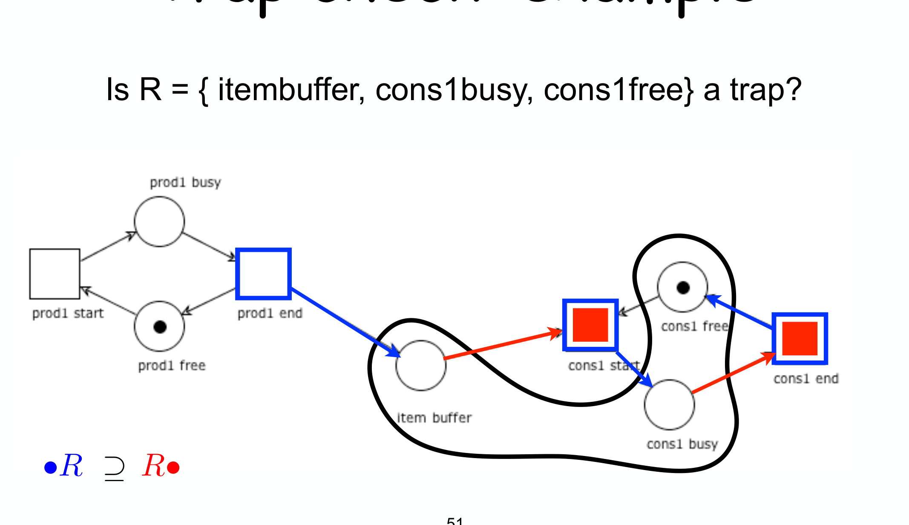
*Fig. — Allargando a $R=\{\text{itembuffer},\text{cons1busy},\text{cons1free}\}$: ora $R\bullet \subseteq \bullet R$ → **è un trap**. Se è marcato in $M_0$ (basta un token in uno dei tre place), il teorema di Commoner garantisce che questo particolare siphon **non condanna** la liveness.*

> [!tip] Il procedimento generale
>
> 1. Trova un siphon non ovviamente marcato (candidato "sospetto").
> 2. Cerca il **trap massimale** contenuto in quel siphon (si parte dal siphon e si tolgono i place che rompono la condizione di trap, come nel passaggio sopra).
> 3. Se il trap massimale è **marcato** in $M_0$ → quel siphon non è un problema. Se **tutti** i proper siphon superano questo test → la rete free-choice è **live** (Commoner).

---

## 9. Comporre due workflow module in un workflow system

*Teoria: [[18 - Workflow Systems]].*

> [!example] Passo 1 — costruire l'interfaccia di un modulo
>
> Il process **Seller** riceve un suggerimento (`?rec_accept`/`?rec_reject`) e invia una decisione (`!accept`/`!reject`). Le sue attività di ricezione/invio diventano **place di interfaccia**.

*Fig. — $P_I=\{ra,rr\}$ alimentano `?rec_reject`/`?rec_accept`; $P_O=\{sa,sr\}$ sono riempiti da `!reject`/`!accept`.*

> [!example] Passo 2 — verificare compatibilità e comporre
>
> **Auctioning Service** invia su `ra`/`rr` esattamente ciò che Seller riceve, e viceversa su `sa`/`sr`: sono **structurally compatible**. Si compongono **fondendo** i place di interfaccia condivisi (nessuna transition aggiuntiva).

*Fig. — Dopo la fusione, i due moduli condividono i place centrali: è un'unica rete.*

> [!example] Passo 3 — chiudere e verificare la soundness
>
> Aggiungi un place iniziale $i$ e finale $o$ comuni:
>
> $$
> i \ \xrightarrow{\ t_i\ }\ (i_1,\dots,i_n) \qquad\qquad (o_1,\dots,o_n) \ \xrightarrow{\ t_o\ }\ o
> $$
>
> (come in [[18 - Workflow Systems]]): il risultato è un workflow net ordinario, verificabile con la sezione 5.

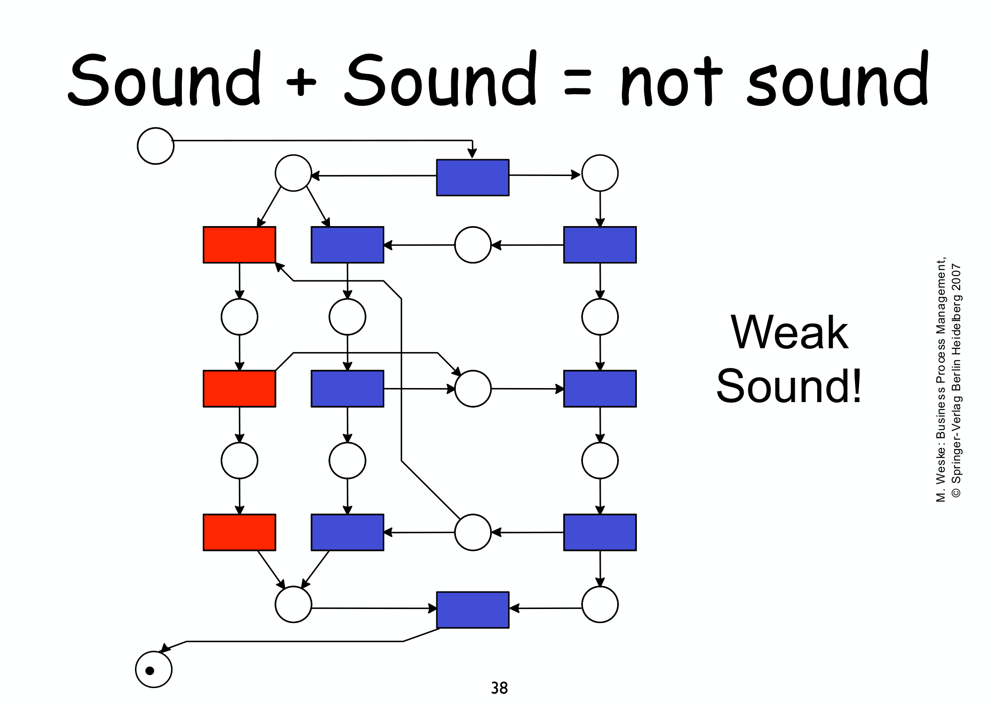
*Fig. — Il risultato sorprendente: Auctioning Service e Seller sono **entrambi sound** presi da soli, ma il sistema composto **non lo è**. È comunque **weak sound** (nessun deadlock, solo qualche task inutilizzato) — la lezione pratica: **verifica sempre il sistema composto**, mai solo i pezzi.*

---

## 10. Conformance checking: token replay passo-passo

*Teoria: [[19 - Conformance]].*

Riproduciamo la trace $\sigma_3=\langle a,d,c,e,h\rangle$ su un modello dove l'ordine atteso sarebbe $a,c,d,e,h$ (cioè $c$ prima di $d$), contando **produced** ($p$), **consumed** ($c$), **missing** ($m$), **remaining** ($r$).

> [!note] I quattro contatori
>
> $$\text{fitness}(\sigma,N) = \frac12\left(1-\frac{m}{c}\right) + \frac12\left(1-\frac{r}{p}\right)$$

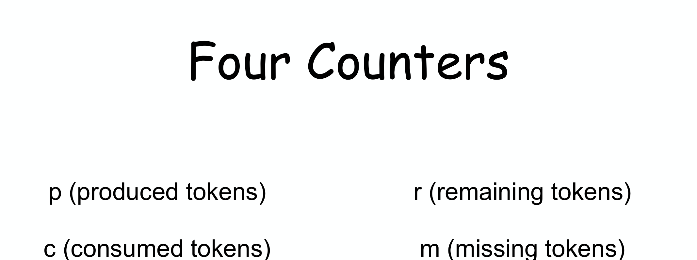
*Fig. — La rete di riferimento e la formula.*

> [!example] Riproduzione passo-passo di $\sigma_3=\langle a,d,c,e,h\rangle$
>
> 1. `a`: consuma da `start`, produce due token (uno per il ramo b/c, uno per il ramo d) → nessun problema.
> 2. `d`: **dovrebbe** consumare da p2 (prodotto da `c`) — ma `c` non è ancora scattata! Il token **manca**: si forza comunque lo scatto e si incrementa $m$.
> 3. `c`: ora scatta regolarmente (il suo place di input aveva comunque il token dal passo 1).
> 4. `e`, `h`: proseguono regolarmente.

*Fig. — Il momento esatto del problema: uno solo dei quattro contatori si muove ($m$ passa da 0 a 1), il resto della riproduzione **continua** invece di fermarsi — a differenza della fitness ingenua, che avrebbe scartato l'intera trace al primo intoppo.*

$$\text{fitness}(\sigma_3,N) = \frac12\left(1-\frac16\right) + \frac12\left(1-\frac16\right) \approx 0.83$$

Non perfetta, ma quantificata.

> [!tip] La procedura in breve
>
> Per ogni evento della trace, nell'ordine: (a) se il place di input ha il token, consumalo normalmente e produci in output ($p$ e $c$ crescono insieme); (b) se **manca**, forza comunque lo scatto e incrementa $m$; alla fine della trace, ogni token rimasto **nei place** (invece che consumato dall'ambiente) incrementa $r$.

---

## 11. Flow analysis: calcolare il cycle time end-to-end

*Teoria: [[20 - Quantitative Analysis]].*

Le quattro regole: **sequenza** (somma), **XOR** (media pesata), **AND** (massimo), **rework** ($CT_P/(1-r)$). Componiamole su un unico processo:

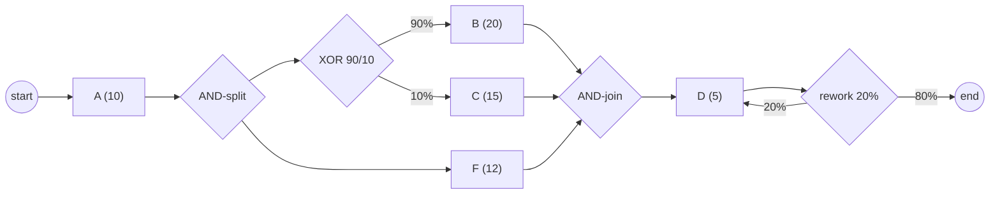

> [!example] Calcolo passo-passo (dal blocco più interno all'esterno)
>
> **1. XOR-block** (B/C, un ramo dell'AND-split):
>
> $$CT_{XOR} = 0.9\cdot20 + 0.1\cdot15 = 19.5$$
>
> **2. AND-block** (i due rami paralleli aperti dall'AND-split: lo XOR-block appena calcolato e il singolo task $F$) — vince il ramo più lento:
>
> $$CT_{AND} = \max\{CT_{XOR},\, CT_F\} = \max\{19.5,\ 12\} = 19.5$$
>
> **3. Rework loop su D** (0.2 di probabilità di ripetere):
>
> $$CT_D = \frac{5}{1-0.2}=6.25$$
>
> **4. Sequenza completa**:
>
> $$CT = CT_A + CT_{AND} + CT_D = 10+19.5+6.25 = 35.75$$

> [!tip] L'ordine di lavoro
>
> Risolvi sempre **dal blocco più interno verso l'esterno**: prima i rework loop e gli XOR/AND-block "foglia", poi sostituiscili con un singolo numero e tratta il resto come una sequenza. È lo stesso principio con cui si valuta un'espressione aritmetica annidata.

---

## 12. S-coverability: costruire un S-cover per certificare la soundness

*Teoria: [[21 - WFnets Diagnosis]].*

Vogliamo trovare, per una rete con 8 place ($s_1..s_8$) e 7 transition, un **S-invariant positivo** senza risolvere un sistema lineare — decomponendo in **S-component**.

> [!example] Passo 1 — trovare un S-component
>
> Un S-component è un ciclo **S-net strongly connected** dove, se includi un place, devi includere **tutte** le sue transition.

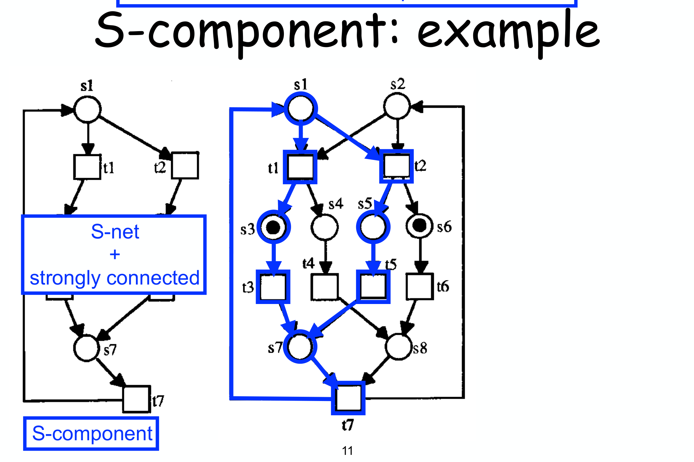
*Fig. — Il primo filone di controllo: $s_1 \to t_1 \to s_3 \to t_3 \to s_7 \to t_7 \to s_1$. Copre $s_1,s_3,s_7$ (e le transition associate) ma **non** $s_2,s_4,s_5,s_6,s_8$.*

> [!example] Passo 2 — trovare un secondo S-component che copra il resto
>
> Un secondo filone, simmetrico al primo, copre $s_2,s_4,s_5,s_6,s_8$.

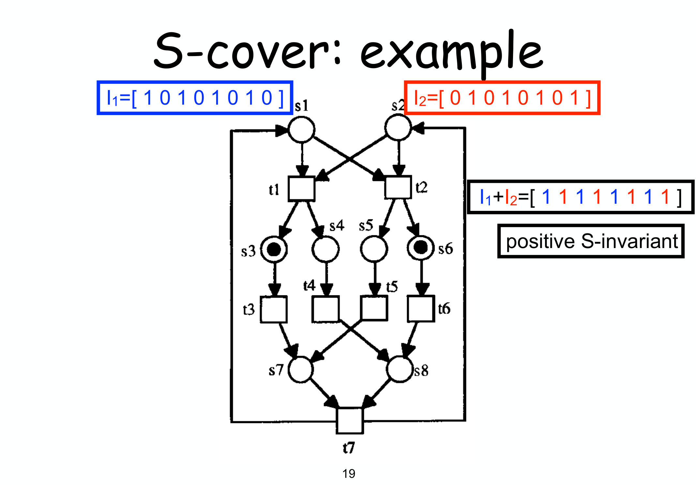
*Fig. — Insieme, i due S-component formano un **S-cover** (ogni place coperto da almeno uno). Ciascuno induce un S-invariant uniforme, con peso 1 sui place coperti e 0 altrove (vettori sotto).*

> [!example] Passo 3 — sommare per ottenere un invariante positivo
>
> $$
> \begin{array}{rcl}
> I_1 &=& [1,0,1,0,1,0,1,0] \\
> I_2 &=& [0,1,0,1,0,1,0,1] \\
> \hline
> I_1+I_2 &=& [1,1,1,1,1,1,1,1]
> \end{array}
> $$
>
> **Tutti** i pesi sono positivi → **S-invariant positivo**, ottenuto senza risolvere alcun sistema lineare — solo disegnando due cicli e sommando due vettori 0/1.

> [!tip] A cosa serve in pratica
>
> Se **riesci** a trovare un S-cover, hai certificato uno dei sei ingredienti del Rank Theorem con un disegno. Se **non ci riesci** (e la rete è free-choice), per il primo teorema di S-coverability concludi che la rete **non è live e bounded** — quindi il workflow net **non è sound** — senza nemmeno costruire il reachability graph.
