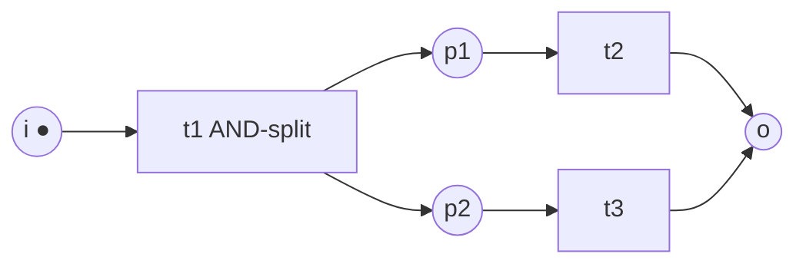
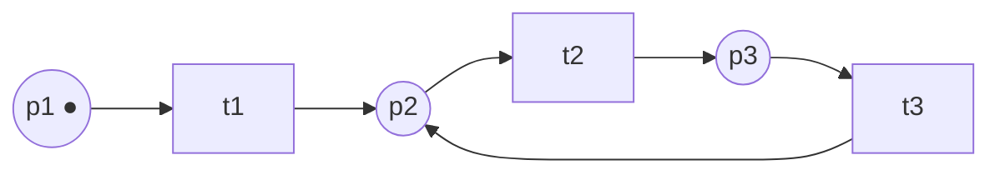
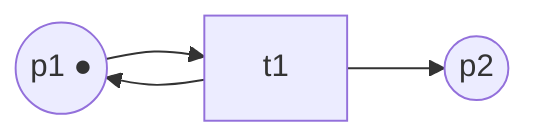

---
tags:
  - università/business-process-modeling
  - esame
  - risposte
data: 2026-07-04
corso: "MPB (6 cfu, 295AA)"
professore: "Roberto Bruni"
fonte: "Risposte elaborate dagli appunti del corso, una per ogni domanda della [[Raccolta domande esami passati]]"
---

# Raccolta risposte esami passati

Questo file contiene una **risposta modello discorsiva** per ogni domanda della [[Raccolta domande esami passati]], scritta come la diresti all'orale: prima l'**intuizione**, poi la **formalizzazione**, e dove serve lo **sketch di dimostrazione** o il **disegno**. Le sezioni seguono lo stesso ordine del file delle domande.

> [!tip] Come usarlo
>
> Non memorizzare le risposte parola per parola: leggile, chiudi il file e **ripetile ad alta voce** con parole tue. All'orale il prof vuole sentire che capisci *perché* le cose sono vere, non una recita.

---

## 1. Workflow net e soundness

### Le tre condizioni di soundness (+notazione) — ×3

Un workflow net è **sound** se il processo che modella è "corretto a prescindere dal suo scopo": nessuna attività inutile, ogni caso può sempre finire, e quando finisce non lascia nulla in sospeso. Formalmente sono tre condizioni:

**1. No dead task** — nessuna transizione è dead: ogni attività è eseguibile in *qualche* esecuzione.

$$\forall t \in T.\; \exists M \in [i\rangle.\; M \xrightarrow{t}$$

**2. Option to complete** — da *ogni* marcatura raggiungibile si può ancora arrivare a marcare $o$: vieta livelock e casi che non terminano più.

$$\forall M \in [i\rangle.\; \exists M' \in [M\rangle.\; M'(o) \ge 1$$

**3. Proper completion** — nell'istante in cui $o$ è marcato, non c'è nessun altro token in giro: vieta token e attività pendenti dopo la fine del caso.

$$\forall M \in [i\rangle.\; M(o) \ge 1 \Rightarrow M = o$$

All'orale conviene abbinare ogni condizione al difetto che esclude: (1) task dead, (2) livelock, (3) token pendenti. E notare la struttura dei quantificatori: la 1 è $\forall t\,\exists M$, la 2 è $\forall M\,\exists M'$, la 3 è $\forall M.(\ldots \Rightarrow \ldots)$.

> [!warning] Cosa NON dice l'option to complete
>
> Non vieta i cicli e non impone un numero massimo di iterazioni: chiede solo che da ogni marcatura raggiungibile *esista* una via verso $o$ (assumendo fairness: uno scatto non può essere rimandato per sempre).

### La short-circuit net $N^\star$ — ×1

Data $N : i \to o$, la rete $N^\star$ si ottiene aggiungendo la transizione **reset** con:

$$\bullet\text{reset} = \{o\} \qquad \text{reset}\bullet = \{i\}$$

Il senso: un workflow net è un processo che *termina*, e le proprietà classiche dei Petri net (liveness) parlano di comportamenti *che continuano per sempre*. Reset trasforma il processo terminante in uno **ciclico** — ogni volta che il caso finisce, riparte — e rende $N^\star$ **strongly connected** (ogni nodo di $N$ sta su un cammino $i \to o$, e reset chiude l'anello). È il ponte che permette il main theorem.

### Il main theorem, con dimostrazione — ×2

> [!theorem] Main theorem
>
> $$N \text{ è sound} \iff N^\star \text{ è live e bounded}$$

È il risultato centrale del corso, perché riconduce la soundness (proprietà specifica dei workflow) a due proprietà generali per cui esistono algoritmi e tool (WoPeD, Woflan).

**Sketch della dimostrazione** (direzione $\Leftarrow$, legando le proprietà di $N^\star$ alle tre condizioni):

- **$N^\star$ live ⟹ no dead task**: se ogni transizione può sempre riscattare, in particolare nessuna è dead.
- **$N^\star$ live ⟹ option to complete**: la liveness vale anche per reset, e reset scatta solo con un token in $o$ — quindi da ogni marcatura raggiungibile si può arrivare a marcare $o$.
- **$N^\star$ bounded ⟹ proper completion**: per assurdo. Se la proper completion fallisse, quando $o$ è marcato resterebbe qualche token extra; reset riporta il token in $i$ e a ogni "giro" i token extra si accumulano → unbounded. La boundedness lo vieta.

Per la direzione $\Rightarrow$, il pezzo tipicamente richiesto è **sound ⟹ $N^\star$ bounded**, per assurdo con gli strumenti algebrici: se $N^\star$ fosse unbounded esisterebbero

$$i \xrightarrow{\ast} M \xrightarrow{\ast} M' \quad \text{con } M \subsetneq M'$$

Detto $L = M' - M > 0$ il surplus, per **monotonicità** la stessa sequenza si può ripetere accumulando $L$ a ogni giro; per l'option to complete da $M$ si raggiunge $o$, quindi da $M' = M + L$ si raggiunge

$$o + L$$

cioè un token in $o$ *più* token extra — violando la proper completion. Assurdo. $\blacksquare$

### Disegna una rete che viola proper completion — ×2

L'esempio minimo è un **AND-split seguito da uno XOR-join**: i due rami paralleli depositano token indipendenti, e uno dei due arriva in $o$ mentre l'altro resta in giro.

Da $i$, lo scatto di $t_1$ produce token in $p_1$ **e** $p_2$. Scattando $t_2$ si marca $o$, ma resta il token in $p_2$: la marcatura raggiunta è $o + p_2 \ne o$, quindi

$$M(o) \ge 1 \;\wedge\; M \ne o$$

e la proper completion è violata. (Poi $t_3$ può scattare e portare a $2o$: anche peggio.) Il fix sarebbe un AND-join che sincronizza i due rami prima di $o$.

---

## 2. Invarianti

### S-invariant: definizione, notazione, significato, i due teoremi — ×3

L'idea intuitiva è quella delle **monete**: assegno un "valore" a ogni place in modo che ogni transizione consumi esattamente tanto valore quanto ne produce. Se ci riesco, la **somma pesata dei token è costante** per sempre — un invariante calcolato dalla sola struttura, senza esplorare gli stati.

> [!definition] S-invariant
>
> Un **S-invariant** di $N = (P,T,F)$ è un vettore $I$ di lunghezza $|P|$, a valori razionali, tale che
>
> $$I \cdot \mathbf{N} = \mathbf{0}$$
>
> dove $\mathbf{N}$ è l'incidence matrix. Caratterizzazione equivalente, leggibile sul disegno: per ogni transizione $t$,
>
> $$\sum_{p \in \bullet t} I(p) = \sum_{p \in t\bullet} I(p)$$

È un sistema lineare **omogeneo**: la soluzione nulla esiste sempre, e ogni combinazione lineare di S-invariant è ancora un S-invariant. Classificazione utile: $I$ è **semi-positive** se $I \ge 0$ e $I \ne 0$; è **positive** se $I(p) > 0$ per *ogni* place; il **support** $\langle I \rangle$ è l'insieme dei place con peso positivo.

**I due teoremi** (gli usi principali):

> [!theorem] 1) S-invariant positive ⟹ bounded
>
> Se esiste un S-invariant positive, la rete è **bounded**, con limite esplicito per ogni place:
>
> $$I(p)\,M(p) \le I \cdot M = I \cdot M_0 \quad\implies\quad M(p) \le \frac{I \cdot M_0}{I(p)}$$
>
> Basta *esibire* l'invariante per certificare la boundedness, senza esplorare gli stati.

> [!theorem] 2) Test di non-liveness
>
> Se la rete è **live**, ogni S-invariant semi-positive ha $I \cdot M_0 > 0$. Contronominale: se trovo un S-invariant semi-positive con
>
> $$I \cdot M_0 = 0$$
>
> la rete **non è live** (i place del support restano vuoti per sempre → le transizioni collegate sono dead).

C'è anche un terzo uso: **disprovare la raggiungibilità** — se $I \cdot M \ne I \cdot M_0$ per qualche S-invariant, allora $M$ non è raggiungibile. Attenzione: sono tutte implicazioni **in un solo verso** (condizioni sufficienti per la proprietà negativa, mai equivalenze).

### Proprietà fondamentale degli S-invariant, con dimostrazione — ×2

> [!theorem] Proprietà fondamentale
>
> Se $I$ è un S-invariant, per **ogni** $M \in [M_0\rangle$:
>
> $$I \cdot M = I \cdot M_0$$

*Dimostrazione* (tre righe, dalla marking equation). Se $M$ è raggiungibile, esiste $\sigma$ con $M_0 \xrightarrow{\sigma} M$. Per il marking equation lemma:

$$M = M_0 + \mathbf{N} \cdot \vec{\sigma}$$

Moltiplico entrambi i membri per $I$:

$$I \cdot M = I \cdot M_0 + \underbrace{I \cdot \mathbf{N}}_{=\,\mathbf{0}} \cdot\, \vec{\sigma} = I \cdot M_0$$

perché $I \cdot \mathbf{N} = \mathbf{0}$ per definizione di S-invariant. $\blacksquare$

---

## 3. Liveness e boundedness

### Boundedness: definizione, notazione, legame con gli S-invariant — ×2

Un place è **k-bounded** se nessuna marcatura raggiungibile gli dà più di $k$ token; **safe** = 1-bounded; **bounded** = k-bounded per qualche $k$. Una rete è bounded se tutti i suoi place lo sono:

$$\exists k \in \mathbb{N}.\;\; \forall M \in [M_0\rangle.\;\; \forall p \in P.\;\; M(p) \le k$$

Il significato pratico: un place unbounded è un accumulo di risorse senza limite, quasi sempre un bug del processo.

**Due legami da citare:**

1. **Con il reachability graph**: una rete è bounded $\iff$ il suo RG è **finito**. ($\Rightarrow$: se k-bounded, al più $(k+1)^{|P|}$ marcature. $\Leftarrow$: se il grafo è finito, prendo $k = \max$ dei token per place sui nodi.)
2. **Con gli S-invariant**: un S-invariant **positive** certifica la boundedness, con il limite esplicito $M(p) \le (I \cdot M_0)/I(p)$ — vedi sezione 2.

### Tutto su liveness — ×1

Il quadro completo, come lo racconterei. Per una transizione $t$:

- **live**: da *ogni* marcatura raggiungibile si può sempre tornare a poterla abilitare —

$$\forall M \in [M_0\rangle.\; \exists M' \in [M\rangle.\; M' \xrightarrow{t}$$

- **dead**: non è abilitata in *nessuna* marcatura raggiungibile —

$$\forall M \in [M_0\rangle.\; M \not\xrightarrow{t}$$

- **non-live** (negazione di live): *esiste* una marcatura da cui $t$ non torna mai più abilitabile — cioè $t$ *può diventare* dead;
- **non-dead**: scatta almeno una volta.

Una rete è **live** se tutte le transizioni sono live. Il punto delicato: live è molto più forte di "scatta almeno una volta" — una transizione può scattare all'inizio e poi morire per sempre (non-dead ma non-live).

Per i **place**: $p$ è live se da ogni marcatura raggiungibile si può sempre tornare a marcarlo ($\forall M\, \exists M'.\; M'(p) > 0$); la rete è **place-live** se tutti i place sono live.

**Le implicazioni** (nessuna si inverte in generale):

$$\text{live} \implies \text{place-live} \implies \text{deadlock-free}$$

**I legami con le classi strutturali:**

- **S-system**: live $\iff$ strongly connected e $M_0(P) \ge 1$ (basta un token, che si può portare ovunque);
- **T-system**: live $\iff$ **ogni circuito è marcato** in $M_0$ (un circuito vuoto resta vuoto per sempre);
- **free-choice**: live $\iff$ **place-live** (l'implicazione inversa, falsa in generale, qui vale); e per Commoner, live $\iff$ ogni proper siphon include un trap inizialmente marcato.

### Disegna una rete deadlock-free ma non live — ×1

Da $M_0 = p_1$: scatta $t_1$ (una volta sola), poi il token gira per sempre nel ciclo $p_2 \to t_2 \to p_3 \to t_3 \to p_2$.

- **Deadlock-free**: in ogni marcatura raggiungibile ($p_1$, $p_2$ o $p_3$) c'è sempre una transizione abilitata.
- **Non live**: $t_1$ scatta una volta e poi è dead per sempre ($p_1$ non viene mai rimarcato). La condizione $\forall M\,\exists M'$ fallisce già su $M = p_2$.

È il controesempio standard per "deadlock-freedom non implica liveness": il sistema gira all'infinito, ma un'attività è morta.

### Disegna una rete non bounded — ×1

$t_1$ consuma il token da $p_1$ ma lo **rimette** in $p_1$ e ne aggiunge uno in $p_2$: è sempre abilitata, e ogni scatto incrementa $p_2$. Dopo $n$ scatti la marcatura è $p_1 + n\,p_2$: nessun $k$ limita $p_2$, la rete è **unbounded**. (Algebricamente: $M' = M_0 + L$ con $L = p_2 > 0$, e per monotonicità si raggiunge $M_0 + kL$ per ogni $k$.)

---

## 4. Matrici e marking equation

### La matrice di incidenza: righe, colonne, valori — ×1

> [!definition] Incidence matrix
>
> Per $N = (P,T,F)$, la matrice $\mathbf{N}$ ha una **riga per place** ($n = |P|$) e una **colonna per transizione** ($m = |T|$), con valori in $\{-1, 0, +1\}$:
>
> $$\mathbf{N}(p,t) = \begin{cases} -1 & \text{se } (p,t) \in F \wedge (t,p) \notin F \quad (p \text{ solo input: token consumato}) \\ +1 & \text{se } (p,t) \notin F \wedge (t,p) \in F \quad (p \text{ solo output: token prodotto}) \\ 0 & \text{altrimenti (scollegati, oppure self-loop)} \end{cases}$$

Ogni cella dice **come lo scatto di $t$ cambia i token in $p$** — e questa variazione non dipende dalla marcatura corrente, per questo si può pre-calcolare. Ogni **colonna** è il vettore $\vec{t}$ (effetto di $t$ su tutti i place); ogni **riga** l'effetto di tutte le transizioni su un place.

> [!warning] Il caso 0 e i self-loop
>
> Il valore $0$ copre due situazioni diverse: place e transizione **scollegati**, oppure **self-loop** ($p$ input *e* output di $t$: variazione netta zero). La matrice quindi **perde informazione** — non distingue un self-loop da nessun collegamento — ed è il motivo per cui l'approccio algebrico non cattura tutto il comportamento.

### Il Parikh vector — ×1

Data una sequenza $\sigma \in T^\star$, il suo **Parikh vector** $\vec{\sigma} : T \to \mathbb{N}$ conta **quante volte ogni transizione occorre** in $\sigma$, dimenticando l'ordine. Definizione ricorsiva:

$$\vec{\epsilon} = \mathbf{0} \qquad \overrightarrow{\sigma t} = \vec{\sigma} + \vec{t}$$

Esempio: per $\sigma = t_3\,t_5\,t_3\,t_4\,t_2$ si ha $\vec{\sigma} = [0,1,2,1,1]$. "Dimenticare l'ordine" è esattamente quello che serve alla marking equation: la marcatura raggiunta dipende solo dai conteggi.

### Marking equation lemma, con dimostrazione — ×2

> [!theorem] Marking equation lemma
>
> Se $M \xrightarrow{\sigma} M'$, allora
>
> $$M' = M + \mathbf{N} \cdot \vec{\sigma}$$

*Dimostrazione (induzione sulla lunghezza di $\sigma$).*

**Base** ($\sigma = \epsilon$): $\vec{\sigma} = \mathbf{0}$, quindi $M' = M$. Banale.

**Passo** ($\sigma = \sigma' t$): sia $M \xrightarrow{\sigma'} M'' \xrightarrow{t} M'$. Allora

$$
\begin{aligned}
M' &= M'' + \mathbf{N}\cdot\vec{t} && \text{(scatto singolo)} \\
&= (M + \mathbf{N}\cdot\vec{\sigma'}) + \mathbf{N}\cdot\vec{t} && \text{(ipotesi induttiva)} \\
&= M + \mathbf{N}\cdot(\vec{\sigma'} + \vec{t}) && \text{(linearità)} \\
&= M + \mathbf{N}\cdot\vec{\sigma} && \text{(def. Parikh)}
\end{aligned}
$$

$\blacksquare$

Due osservazioni che il prof apprezza: (1) conseguenza sorprendente — la marcatura finale dipende solo dal *numero* di occorrenze, non dall'ordine; (2) il lemma è una condizione **necessaria**, non sufficiente: il calcolo $M + \mathbf{N}\vec{\sigma}$ si può fare per qualsiasi $\vec{\sigma}$, e se dà una componente negativa la sequenza *non* è eseguibile, ma un risultato $\ge 0$ non garantisce l'eseguibilità.

---

## 5. Free-choice net

### Tutto sulle free-choice, e il teorema di Commoner — ×1

**La motivazione**: eliminare l'interferenza fra **scelta** e **sincronizzazione** — in una rete qualsiasi, la scelta fra due transizioni può dipendere da cosa ha fatto il resto del sistema; nei free-choice la scelta è sempre "libera".

> [!definition] Free-choice net (definizione ufficiale)
>
> Per ogni coppia di transizioni, i pre-set sono **disgiunti oppure uguali**:
>
> $$\forall t, t' \in T.\quad \bullet t \cap \bullet t' = \emptyset \;\lor\; \bullet t = \bullet t'$$

Conseguenza (la **proprietà fondamentale** che dà il nome): se $M$ abilita $t$ e $t' $ condivide un place di input con $t$, allora $\bullet t = \bullet t'$ e $M$ abilita anche $t'$ — le transizioni in conflitto sono **sempre abilitate insieme**, la scelta è libera. Ogni S-net e ogni T-net è free-choice (pre-set o post-set singoletti); i free-choice sono la super-classe comune. E $N$ è free-choice $\iff$ $N^\star$ lo è (il pre-set di reset, $\{o\}$, è disgiunto dagli altri).

**Siphon e trap**, le due strutture chiave (duali):

> [!definition] Siphon e trap
>
> - $R \subseteq P$ è un **siphon** se $\bullet R \subseteq R\bullet$: ogni transizione che produce in $R$ consuma anche da $R$. Conseguenza: un siphon **vuoto resta vuoto** per sempre.
> - $R$ è un **trap** se $R\bullet \subseteq \bullet R$: ogni transizione che consuma da $R$ produce anche in $R$. Conseguenza: un trap **marcato resta marcato** per sempre.
>
> Entrambi sono **proper** se $R \ne \emptyset$. I trap sono chiusi per unione → ogni siphon contiene un **unico trap massimale**.

In *qualsiasi* rete: se il sistema è live, ogni proper siphon è marcato (contronominale: un proper siphon non marcato ⟹ non live). Nei free-choice la condizione diventa **esatta**:

> [!theorem] Teorema di Commoner
>
> Un free-choice system è **live** $\iff$ **ogni proper siphon include un trap inizialmente marcato** (equivalentemente: il trap massimale di ogni proper siphon è marcato).

L'intuizione: un siphon non marcato è una condanna (resta vuoto e uccide le transizioni collegate), *a meno che* contenga un trap marcato che gli garantisce token per sempre.

Da citare anche il quadro di complessità: decidere la **sola liveness** di un free-choice è **NP-complete** (riduzione da CNF-SAT: si costruisce un net che è non-live sse la formula è soddisfacibile), mentre **liveness + boundedness insieme** è **polinomiale** (Rank Theorem) — aggiungere un vincolo *semplifica* il problema.

### Il Rank Theorem: condizioni + algoritmo — ×2

> [!theorem] Rank Theorem
>
> Un free-choice system $(P,T,F,M_0)$ è **live e bounded** $\iff$ valgono **tutte e sei**:
>
> 1. ha almeno un place e una transizione;
> 2. è **connesso**;
> 3. $M_0$ marca **ogni proper siphon**;
> 4. esiste un **S-invariant positive**;
> 5. esiste un **T-invariant positive**;
> 6. $\text{rank}(\mathbf{N}) = |C_N| - 1$, dove $C_N$ è l'insieme dei **cluster**.

(Il **cluster** $[x]$ di un nodo si costruisce chiudendo: se un place è dentro, tutte le sue transizioni uscenti pure; se una transizione è dentro, tutti i suoi place entranti pure. I cluster partizionano i nodi.)

Il punto cruciale: **ogni condizione si verifica in tempo polinomiale**. Le 1-2 sono visite del grafo, le 4-5-6 algebra lineare. La condizione 3 — quella su cui il prof chiede l'algoritmo — si verifica calcolando il **massimo siphon non marcato**:

> [!note] Algoritmo per il massimo siphon non marcato (condizione 3)
>
> 1. Parti da $R$ = insieme dei place **non marcati** in $M_0$;
> 2. rimuovi iterativamente da $R$ ogni place che **viola la condizione di siphon** (cioè un place con una transizione entrante che non consuma da $R$: $\bullet R \not\subseteq R\bullet$ per colpa sua);
> 3. ripeti finché $R$ non è stabile.
>
> Se alla fine $R = \emptyset$, ogni proper siphon è marcato (condizione 3 soddisfatta); altrimenti $R$ è il massimo siphon non marcato — un **testimone** della violazione. Ogni passo è polinomiale.

Chiusura da fare all'orale: poiché la soundness di un WF net è "$N^\star$ live e bounded", per i workflow net **free-choice** la soundness si decide in **tempo polinomiale** — è la giustificazione teorica del perché WoPeD funziona bene sui processi reali (quasi sempre free-choice).

---

## 6. S-system e T-system

### La proprietà fondamentale degli S-system — ×1

Un **S-net** è una rete dove ogni transizione ha esattamente un input e un output place:

$$\forall t.\;\; |\bullet t| = 1 = |t\bullet|$$

La sincronizzazione è **vietata**: ogni scatto si limita a *spostare* un token. Da qui la legge di conservazione:

> [!theorem] Proprietà fondamentale degli S-system
>
> Il **numero totale di token** $M(P) = \sum_{p} M(p)$ è invariante: per ogni $M \in [M_0\rangle$
>
> $$M(P) = M_0(P)$$
>
> *Perché:* ogni scatto fa $M'(P) = M(P) - |\bullet t| + |t\bullet| = M(P) - 1 + 1 = M(P)$.

### Boundedness e liveness degli S-system — ×1

Dalla conservazione segue tutto, in cascata:

- **Sempre bounded**: $M(p) \le M(P) = M_0(P)$ — un S-system è k-bounded con $k = M_0(P)$, qualunque sia la struttura.
- **Liveness strutturale**:

$$\text{live} \iff N \text{ strongly connected} \;\wedge\; M_0(P) \ge 1$$

(basta un token: per abilitare qualunque transizione lo si trasporta fino a lei lungo un cammino, che esiste per la strong connectedness).

- **Raggiungibilità esatta** (rarissima in generale, dove è EXPSPACE-hard): in un S-system live, $M$ è raggiungibile $\iff M(P) = M_0(P)$ — basta contare i token.
- **Take-home per i workflow**: *ogni workflow net che è un S-net è safe e sound* (il singolo token che scorre garantisce automaticamente la correttezza).

Se il prof chiede il **duale** (T-system): un T-net vieta la scelta ($\forall p.\; |\bullet p| = 1 = |p\bullet|$), la conservazione vale **sui circuiti** ($M(\gamma) = M_0(\gamma)$ per ogni circuito $\gamma$), e la liveness è: live $\iff$ ogni circuito è marcato in $M_0$.

---

## 7. S-coverability

### S-coverability: definizione e relazione con S-net, liveness, boundedness — ×1

Il contesto: il Rank Theorem chiede un **S-invariant positive**, e la S-coverability è il modo *intuitivo* di costruirlo — decomporre la rete in "filoni di controllo" paralleli, ciascuno un S-net.

> [!definition] S-component e S-cover
>
> - Una **subnet** indotta da $X \subseteq P \cup T$ è un **S-component** se: (1) è uno **S-net strongly connected**; (2) per ogni place $p \in X$, **tutte** le transizioni collegate a $p$ ($\bullet p \cup p\bullet$) sono in $X$ — "se prendi un place, prendi anche tutte le sue transizioni".
> - Un **S-cover** è un insieme di S-component tale che **ogni place** della rete appartenga ad almeno uno di essi. La rete è **S-coverable** se ammette un S-cover.

Il legame con gli invarianti: ogni S-component induce un S-invariant **uniforme** (peso 1 sui suoi place, 0 altrove); sommando quelli di un S-cover si ottiene un **S-invariant positive** sull'intera rete — la ricetta pratica per l'ingrediente 4 del Rank Theorem.

**I due teoremi**, che usati in contronominale diventano test di non-soundness:

> [!theorem] S-coverability theorem 1
>
> Free-choice + live + bounded ⟹ **S-coverable**. Contronominale:
>
> $$N \text{ free-choice} \;\wedge\; N^\star \text{ non S-coverable} \implies N \text{ non sound}$$

> [!theorem] S-coverability theorem 2
>
> Sound + **well-structured** ⟹ $N^\star$ S-coverable. (Well-structured = $N^\star$ senza TP-handle né PT-handle: niente AND-split chiuso da XOR-join, né XOR-split chiuso da AND-join.) Contronominale:
>
> $$N \text{ well-structured} \;\wedge\; N^\star \text{ non S-coverable} \implies N \text{ non sound}$$

Nota pratica da citare: WoPeD gestisce il reset **implicitamente** — gli S-component che mostra sono quelli di $N^\star$, non di $N$.

---

## 8. Reachability graph vs coverability graph — ×1

Il **reachability graph** (o occurrence graph) è la rappresentazione **esatta** del comportamento: un nodo per ogni marcatura raggiungibile, un arco $(M, t, M')$ per ogni scatto $M \xrightarrow{t} M'$. Il problema: è **finito se e solo se la rete è bounded** — su una rete unbounded l'algoritmo di costruzione non termina.

Il **coverability graph** è la risposta: una **sovra-approssimazione finita** che rappresenta i place illimitati col simbolo $\omega$. I nodi sono **extended bag** $B : P \to \mathbb{N} \cup \{\omega\}$; quando durante la costruzione si trova un antenato $M \subset M'$, i place del surplus vengono marcati $\omega$ (per monotonicità la sequenza si può ripetere accumulando token all'infinito).

Le differenze da elencare:

| | Reachability graph | Coverability graph |
|---|---|---|
| Esattezza | **esatto** | sovra-approssimazione |
| Finitezza | finito $\iff$ bounded | **sempre finito** |
| Unicità | unico | **non unico** (dipende dall'ordine di esplorazione) |
| Cammini | = firing sequence | ogni firing sequence ha un cammino, ma **non viceversa** (può suggerire comportamenti non reali; i cammini su marcature tutte finite sono però veri) |

E il raccordo: se il RG è finito, i due grafi **coincidono**. WoPeD calcola un coverability graph.

---

## 9. BPMN vs EPC, con la notazione — ×2

Le due notazioni si corrispondono quasi elemento per elemento; la differenza è di **status e ricchezza**: EPC è una notazione accademico-gestionale (mondo ARIS/SAP) essenziale, BPMN è lo **standard industriale de facto** (OMG, BPMN 2.0 nel 2011), molto più ricco (oltre 100 elementi grafici) e con un formato di scambio (`.bpmn`).

**EPC** — tre elementi, in alternanza evento-funzione:

- **Event** (esagono): stato passivo, "qualcosa è accaduto"; al più un arco entrante e uno uscente;
- **Function** (rettangolo arrotondato): attività attiva; esattamente un arco entrante e uno uscente;
- **Connector** (cerchio): $\wedge$ (AND), $\vee$ (OR), $\times$ (XOR); o split (1 in, molti out) o join (molti in, 1 out).

**BPMN** — le quattro categorie: **flow objects** (i tre core), **connecting objects**, **swimlanes**, **artefacts**:

- **Event** (cerchio): il *bordo* ne dà il tipo — start (sottile), intermediate (doppio), end (spesso) — e il marker interno il sottotipo (message, timer, error...);
- **Activity** (rettangolo arrotondato): task atomico o sub-process;
- **Gateway** (rombo): XOR (data-based/event-based), AND, OR, complex;
- **Sequence flow** (freccia piena, dentro un pool) vs **message flow** (tratteggiata, tra pool diversi) — questa distinzione **non esiste in EPC**;
- **Pool e lane**: partecipanti e responsabilità; due pool comunicano *solo* via message flow.

La tabella di corrispondenza da disegnare/citare:

| EPC | BPMN |
|---|---|
| Event (esagono) | Event (cerchio) |
| Function (rettangolo) | Activity (rettangolo arrotondato) |
| Connector (cerchio ∧/∨/×) | Gateway (rombo) |
| Control flow (freccia tratteggiata) | Sequence flow (freccia piena) |
| Organization unit | Pool / lane |
| — | **Message flow** (specifico BPMN) |

Punti di contatto da menzionare: entrambe hanno il problema dell'**OR-join** (semantica non-locale: "aspetta o no?" dipende da cosa *non* arriverà mai); BPMN copre in più collaboration e choreography; EPC impone l'alternanza evento-funzione, BPMN no.

---

## 10. Footprint e α-algorithm

### La footprint matrix e le relazioni d'ordine — ×2

Tutto parte dal **directly-follows** letto dal log: $a >_L b$ se in qualche trace $a$ è immediatamente seguito da $b$. Da questa si derivano tre relazioni:

$$
\begin{aligned}
a \to_L b &\quad \text{(causality): } a >_L b \text{ ma non } b >_L a \\
a \,\#_L\, b &\quad \text{(mutual exclusion): né } a >_L b \text{ né } b >_L a \\
a \parallel_L b &\quad \text{(concurrency): } a >_L b \text{ e anche } b >_L a
\end{aligned}
$$

La **footprint matrix** raccoglie tutte le relazioni in una tabella con una riga/colonna per attività: ogni cella contiene $\to$, $\leftarrow$, $\#$ o $\parallel$. È antisimmetrica per le causali (se $(a,b) = \to$ allora $(b,a) = \leftarrow$), simmetrica per $\#$ e $\parallel$. L'intuizione: **l'ordine (o il disordine) di adiacenza nel log rivela la relazione strutturale** — sempre stesso ordine = causalità, entrambi gli ordini = parallelismo, mai adiacenti = esclusione.

### L'α-algorithm — ×2

L'α-algorithm è un algoritmo di **discovery**: dal log a un Petri net, senza informazioni a priori. Fu uno dei primi a gestire correttamente la **concorrenza**. Gli otto passi, raggruppati per senso:

1. **$T_L$**: una transizione per attività del log;
2. **$T_I$** / 3. **$T_O$**: le attività iniziali (first di qualche trace) e finali (last);
4. **$X_L$**: le coppie di insiemi $(A,B)$ con ogni $a \in A$ in causalità con ogni $b \in B$, e $A$, $B$ internamente in mutua esclusione — i candidati "punti di decisione";
5. **$Y_L$**: solo le coppie **massimali** di $X_L$;
6. **$P_L$**: un place $p_{(A,B)}$ per ogni coppia massimale, più $i_L$ e $o_L$;
7. **$F_L$**: archi $a \to p_{(A,B)} \to b$, più $i_L \to T_I$ e $T_O \to o_L$;
8. la rete $\alpha(L) = (P_L, T_L, F_L, i_L)$.

Il cuore sono i passi 4-5: cercare ogni "gruppo di cause → gruppo di effetti" compatibile con la footprint, e tenere solo i gruppi più grandi. **I limiti** (sempre da citare): non ricostruisce le dipendenze **non-locali** (guarda solo adiacenze), si confonde con gli **short loop** (cicli di lunghezza 1-2), e **ignora le frequenze** (il rumore pesa quanto il comportamento comune).

---

## 11. Little's law e Cycle Time Efficiency

### Little's law — ×2

> [!theorem] Little's law
>
> In un sistema **stabile** (il numero di casi attivi non esplode):
>
> $$WIP = \lambda \cdot CT$$
>
> dove $\lambda$ è l'**arrival rate** (nuovi casi per unità di tempo), $WIP$ il **work-in-process** (casi attivi in media), $CT$ il **cycle time** medio.

Il punto da sottolineare all'orale: è **universale** — non serve sapere *nulla* della struttura interna del processo, bastano due grandezze osservabili dall'esterno. Esempio: 2500 domande in 250 giorni ⟹ $\lambda = 10$/giorno; osservo in media $WIP = 200$ casi attivi ⟹

$$CT = \frac{WIP}{\lambda} = \frac{200}{10} = 20 \text{ giorni}$$

senza aver mai cronometrato una singola domanda. Lettura operativa: se $\lambda$ cresce e non voglio far crescere il $WIP$, l'unica leva è **ridurre il CT**.

### Cycle Time Efficiency e il suo range — ×2

Il cycle time si divide in **processing time** (qualcuno lavora sul caso) e **waiting time** (il caso aspetta). Il **theoretical cycle time (TCT)** si calcola con le stesse formule della flow analysis (sequenza = somma, XOR = media pesata, AND = massimo, rework = $CT_P/(1-r)$) ma usando i **soli processing time**: è il tempo del processo se non ci fosse *mai* attesa.

$$CTE = \frac{TCT}{CT}$$

**Range**: poiché $0 < TCT \le CT$, la CTE varia in $(0, 1]$ — in pratica si dice "da 0 a 1". Interpretazione:

- $CTE \approx 1$: quasi niente attese, poco margine di miglioramento (servirebbero cambiamenti radicali);
- $CTE \approx 0$: il tempo è quasi tutto attesa — **molto** margine, riducendo il waiting time.

---

> [!abstract] Ultima dritta
>
> Le domande "con dimostrazione" (proprietà fondamentale S-invariant, marking equation, main theorem) hanno tutte dimostrazioni **corte** che poggiano su un solo strumento (marking equation o monotonicità): se all'orale ti blocchi, riparti da lì — "per la marking equation..." è quasi sempre la prima mossa giusta.
