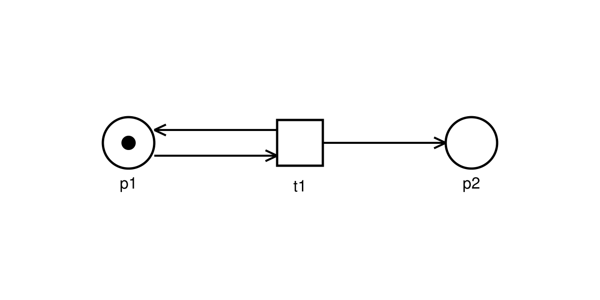
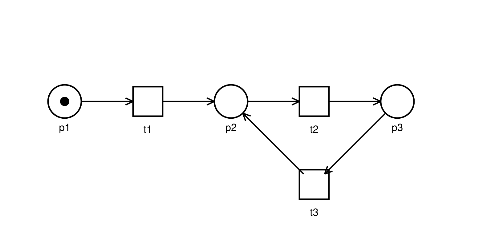
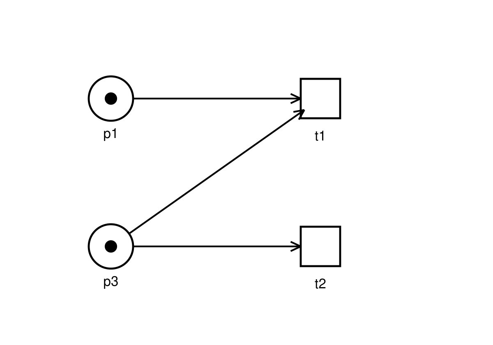
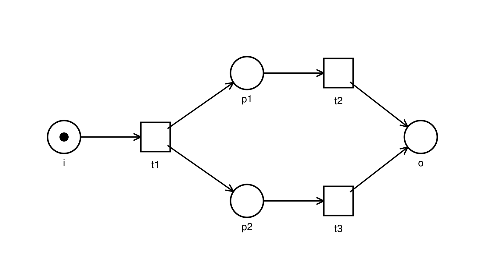
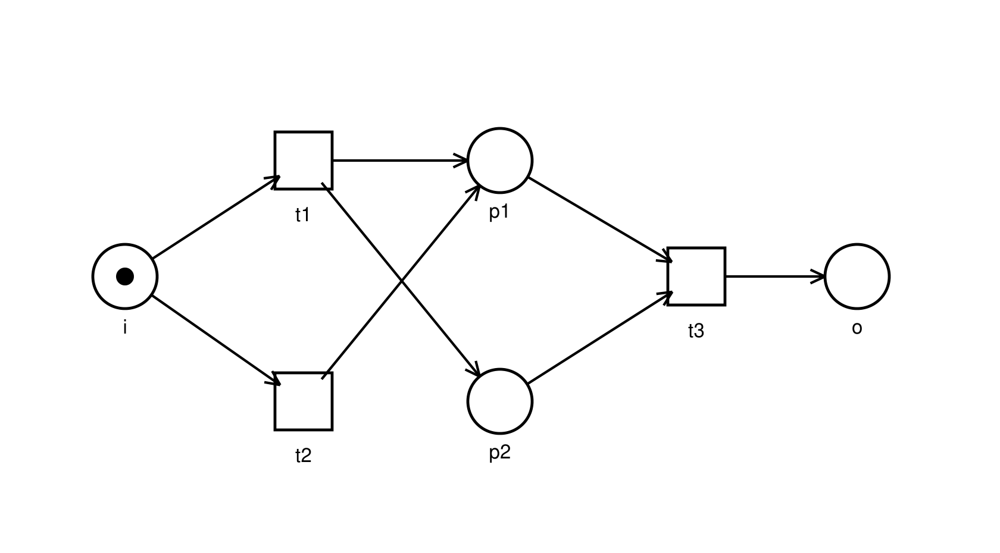
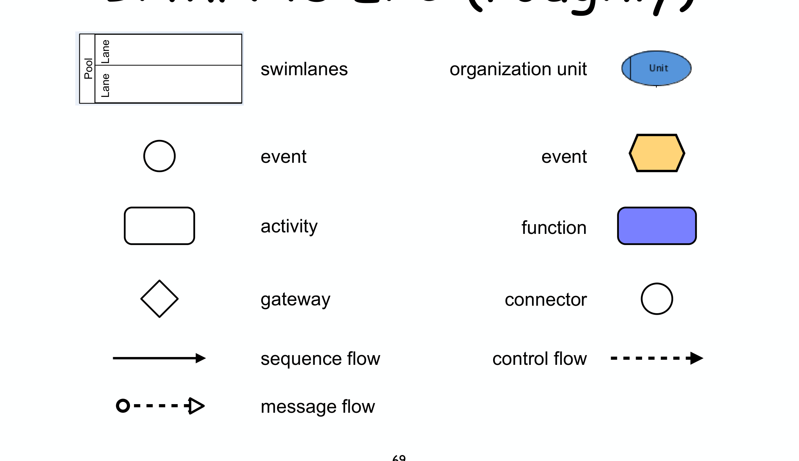
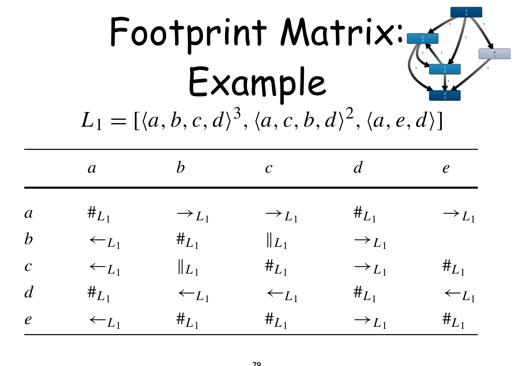

---
tags:
  - università/business-process-modeling
  - esame
  - simulazione
  - risposte
data: 2026-07-10
corso: "MPB (6 cfu, 295AA)"
professore: "Roberto Bruni"
fonte: "Risposte da studente modello alle domande di [[Simulazione orale - Domande]], elaborate dagli appunti del corso"
---

# Simulazione orale — Risposte

Per ogni domanda di [[Simulazione orale - Domande]], la risposta **come la darei io all'esame**: in prima persona, discorsiva, con la formalizzazione al punto giusto e — dove il prof chiede di disegnare — il disegno corretto. Gli incalzi (→) sono risolti dentro la risposta o subito dopo.

---

## 1. Reti di Petri: fondamenti

> **«Mi dia la definizione formale di Petri net, e mi spieghi come funziona la regola di scatto.»**

Un Petri net è una quadrupla $(P, T, F, M_0)$ dove $P$ è un insieme finito di place, $T$ un insieme finito di transition con

$$P \cap T = \emptyset$$

$F \subseteq (P \times T) \cup (T \times P)$ è la flow relation, e $M_0 : P \to \mathbb{N}$ è la marcatura iniziale, che assegna a ogni place un numero di token. Graficamente: cerchi per i place, quadrati per le transition, frecce per gli archi, pallini per i token.

La dinamica è il *token game*. Una transizione $t$ è **enabled** in $M$ se ogni suo input place contiene almeno un token:

$$M \xrightarrow{t} \quad\iff\quad \forall p \in \bullet t.\; M(p) \ge 1$$

Quando scatta, $t$ **consuma** un token da ogni place di $\bullet t$ e **produce** un token in ogni place di $t\bullet$. Importante: i token si sommano e sottraggono, non si "sostituiscono" — se il place di output aveva già token, il nuovo si aggiunge.

*Se un place è input di due transizioni abilitate?* È un **conflitto**: entrambe sono abilitate ma il token basta per una sola — la scelta è non-deterministica, ed è così che i Petri net modellano le decisioni. *Un AND-split?* È semplicemente una transizione con più output place: a ogni scatto produce **un token in ciascuno**, attivando rami paralleli.

> **«Cosa sono pre-set e post-set?»**

Per un nodo $x$ (place o transition):

$$\bullet x = \{y \mid (y,x) \in F\} \qquad x\bullet = \{y \mid (x,y) \in F\}$$

cioè i nodi da cui arrivano archi e verso cui escono archi. La notazione si estende agli **insiemi di place**: $\bullet R = \bigcup_{p \in R} \bullet p$ e $R\bullet = \bigcup_{p \in R} p\bullet$ — sono le transizioni che *producono in* $R$ e che *consumano da* $R$, ed è la notazione con cui si definiscono siphon e trap.

> **«Che cos'è un workflow net?»**

È un Petri net con tre condizioni **strutturali**: esiste un place iniziale $i$ senza archi entranti ($\bullet i = \emptyset$), un place finale $o$ senza archi uscenti ($o\bullet = \emptyset$), e ogni altro nodo sta su un cammino da $i$ a $o$ (niente parti "morte" fuori dal flusso). Si studia sempre con la marcatura iniziale = **un token in $i$**.

La definizione è puramente strutturale: dipende solo dalla forma del grafo. Per questo **non cattura** i difetti comportamentali — deadlock, task mai eseguibili, token pendenti alla fine — che emergono solo *eseguendo* la rete: per quelli serve la soundness.

---

## 2. Reachability graph, coverability, boundedness

> **«Che differenza c'è fra reachability graph e coverability graph?»** 🔥

Il **reachability graph** (o occurrence graph) è la rappresentazione **esatta** del comportamento: un nodo per ogni marcatura raggiungibile, un arco $(M, t, M')$ per ogni scatto $M \xrightarrow{t} M'$. Il suo limite è che è **finito se e solo se la rete è bounded** — su una rete unbounded l'algoritmo non termina.

Il **coverability graph** serve esattamente in quel caso: è una **sovra-approssimazione sempre finita**, i cui nodi sono *extended bag* $B : P \to \mathbb{N} \cup \{\omega\}$, dove $\omega$ marca un place illimitato. L'idea: se durante la costruzione trovo un antenato $M \subset M'$, per monotonicità posso ripetere quella sequenza all'infinito accumulando il surplus — quindi i place del surplus li marco $\omega$ una volta per tutte, invece di enumerare infinite marcature.

Agli incalzi rispondo: **non è unico** (dipende dall'ordine di esplorazione); **ogni firing sequence ha un cammino nel CG ma non viceversa** — è una sovra-approssimazione e può suggerire comportamenti non reali, però i cammini che toccano solo marcature finite sono veri; e **se il RG è finito, i due grafi coincidono**. WoPeD, il tool che usiamo, calcola un coverability graph.

> **«Mi definisca la boundedness, anche in formula.»** 🔥

Un place è **k-bounded** se nessuna marcatura raggiungibile gli dà più di $k$ token; **safe** significa 1-bounded. La rete è **bounded** se ogni place è k-bounded per qualche $k$:

$$\exists k \in \mathbb{N}.\;\; \forall M \in [M_0\rangle.\;\; \forall p \in P.\;\; M(p) \le k$$

Il legame col reachability graph è un'equivalenza:

$$\text{bounded} \iff \text{RG finito}$$

*Dimostrazione*: ($\Rightarrow$) se la rete è k-bounded, ogni place ha al più $k$ token, quindi le marcature possibili sono al più $(k+1)^{|P|}$ — un numero finito. ($\Leftarrow$) se il grafo è finito, per ogni nodo $M$ prendo $k_M$ = massimo numero di token in un place; il massimo $k = \max_M k_M$ esiste perché i nodi sono finiti, e la rete è k-bounded. $\blacksquare$

Il legame con gli invarianti: un **S-invariant positive certifica la boundedness** (lo dimostro in sezione 5).

> **«Mi disegni una rete non bounded.»** 🔥

$t_1$ ha $\bullet t_1 = \{p_1\}$ e $t_1\bullet = \{p_1, p_2\}$: consuma il token da $p_1$ ma lo **rimette**, e ne aggiunge uno in $p_2$. Quindi è sempre abilitata, e dopo $n$ scatti la marcatura è

$$p_1 + n\,p_2$$

Nessun $k$ limita $p_2$: la rete è unbounded. *Algebricamente, senza costruire il grafo*: dopo un solo scatto raggiungo $M = M_0 + L$ con $L = p_2 > 0$; per il **boundedness lemma** (via monotonicità) una marcatura raggiungibile strettamente maggiore dell'iniziale implica che posso raggiungere $M_0 + kL$ per ogni $k$ — unbounded.

> **«Come si costruisce il reachability graph?»**

È una visita a worklist: tengo `Todo` (marcature da esplorare), `Nodes`, `Arcs`. Estraggo $M$ da `Todo`, la metto in `Nodes`, calcolo **tutti** gli scatti $M \xrightarrow{t} M'$, registro gli archi, e aggiungo a `Todo` le $M'$ mai viste (né in `Nodes` né in `Todo`). Ripeto finché `Todo` è vuoto. Termina esattamente quando la rete è bounded. Il coverability graph fa lo stesso, ma prima di aggiungere $B'$ controlla se sul cammino c'è un antenato $B'' \subset B'$: se sì, mette $\omega$ nei place dove $B'' < B'$.

---

## 3. Liveness

> **«Mi parli di liveness e place-liveness.»** 🔥

Una transizione $t$ è **live** se, da qualunque marcatura raggiungibile, resta sempre possibile riabilitarla in futuro:

$$\forall M \in [M_0\rangle.\;\; \exists M' \in [M\rangle.\;\; M' \xrightarrow{t}$$

La struttura dei quantificatori è il cuore: *per ogni* punto in cui posso essere finito, *esiste* un modo di proseguire che riabilita $t$. La rete è live se tutte le transizioni lo sono.

Attenzione a non confonderla con la proprietà molto più debole "scatta almeno una volta" ($\exists M.\; M \xrightarrow{t}$, cioè **non-dead**): una transizione può scattare all'inizio e poi morire per sempre — non-dead ma non-live. **Dead** invece è il contrario forte: non scatta in nessuna marcatura raggiungibile. E **non-live** = può *diventare* dead: esiste una marcatura raggiungibile da cui $t$ non sarà mai più abilitabile.

Un **place** $p$ è live se da ogni marcatura raggiungibile si può sempre tornare a marcarlo:

$$\forall M \in [M_0\rangle.\;\; \exists M' \in [M\rangle.\;\; M'(p) > 0$$

e la rete è **place-live** se tutti i place sono live.

La relazione fra le due: **live ⟹ place-live**, e la dimostrazione è carina — dato un place $p$, prendo una transizione $t$ collegata a $p$ (esiste, se non ci sono nodi isolati); per liveness da ogni $M$ raggiungo uno scatto di $t$; ma $p$ è marcato *prima* dello scatto (se $t$ consuma da $p$) o *dopo* (se produce in $p$): in entrambi i casi ho trovato la marcatura che rimarca $p$. Il **viceversa non vale** in generale: esistono reti place-live con una transizione morta. *Quando vale l'equivalenza?* **Nei free-choice**: lì place-live ⟺ live — è uno dei regali della classe, e la dimostrazione sfrutta la proprietà fondamentale (nessuna transizione può "rubare" un token già piazzato senza condividere l'intero pre-set).

Completo il quadro: live ⟹ place-live ⟹ **deadlock-free** (da ogni marcatura raggiungibile scatta *qualcosa*), e nessuna freccia si inverte.

> **«Mi disegni una rete deadlock-free ma non live.»** 🔥

Da $M_0 = p_1$: scatta $t_1$ (una volta sola), poi il token gira per sempre nel ciclo $p_2 \to t_2 \to p_3 \to t_3 \to p_2$.

- **Deadlock-free**: in ogni marcatura raggiungibile ($p_1$, $p_2$, $p_3$) c'è sempre una transizione abilitata — il sistema non si blocca mai.
- **Non live**: $t_1$ è la transizione incriminata — scatta una volta e poi $p_1$ non viene mai più rimarcato. La marcatura che la "uccide" è $p_2$: da lì in poi $t_1$ è dead.

Deadlock-freedom è più debole perché chiede solo che *qualche* transizione sia sempre abilitata; la liveness pretende che *ogni singola* transizione resti riabilitabile.

> **«Cosa significa dead? Come si verifica sull'occurrence graph?»**

$t$ è dead se $\forall M \in [M_0\rangle.\; M \not\xrightarrow{t}$ — equivalentemente, **nessun arco** dell'occurrence graph è etichettato $t$. Mentre $t$ è live sse da ogni nodo del grafo si raggiunge un nodo con arco uscente etichettato $t$. E l'insieme dei nodi dead può solo **crescere** durante l'esecuzione: non si "resuscita" — per questo la non-liveness si testimonia con una singola marcatura raggiunta.

---

## 4. Matrici, marking equation, Parikh vector

> **«Mi definisca la matrice di incidenza.»** 🔥

La matrice $\mathbf{N}$ ha una **riga per place** e una **colonna per transizione**, e la cella $(p,t)$ dice come lo scatto di $t$ cambia i token in $p$ — una variazione che non dipende dalla marcatura corrente, per questo si può pre-calcolare:

$$\mathbf{N}(p,t) = \begin{cases} -1 & (p,t) \in F \wedge (t,p) \notin F \quad\text{($p$ solo input: consuma)} \\ +1 & (p,t) \notin F \wedge (t,p) \in F \quad\text{($p$ solo output: produce)} \\ 0 & \text{altrimenti} \end{cases}$$

Il caso $0$ copre due situazioni: nodi **scollegati** e **self-loop** ($p$ input *e* output di $t$: variazione netta nulla). Qui la matrice **perde informazione** — non distingue le due cose — ed è il motivo per cui l'approccio algebrico non cattura tutto. Una **colonna** è il vettore $\vec{t}$, l'effetto di $t$ su tutti i place.

> **«Che cos'è il Parikh vector?»** 🔥

Data una sequenza $\sigma \in T^\star$, il Parikh vector $\vec{\sigma} : T \to \mathbb{N}$ conta le **occorrenze** di ogni transizione in $\sigma$:

$$\vec{\epsilon} = \mathbf{0} \qquad \overrightarrow{\sigma t} = \vec{\sigma} + \vec{t}$$

Esempio: $\sigma = t_3 t_5 t_3 t_4 t_2$ ha $\vec{\sigma} = [0,1,2,1,1]$. **Dimentica l'ordine** — e va bene così, perché la marcatura raggiunta dipende solo dai conteggi: è esattamente ciò che la marking equation formalizza.

> **«Mi enunci e dimostri il marking equation lemma.»** 🔥

$$M \xrightarrow{\sigma} M' \quad\implies\quad M' = M + \mathbf{N} \cdot \vec{\sigma}$$

*Dimostrazione per induzione sulla lunghezza di $\sigma$.*

**Base** ($\sigma = \epsilon$): $\vec{\epsilon} = \mathbf{0}$, quindi la tesi è $M' = M$, vero perché con la sequenza vuota non mi muovo.

**Passo** ($\sigma = \sigma' t$): sia $M \xrightarrow{\sigma'} M'' \xrightarrow{t} M'$. Allora

$$
\begin{aligned}
M' &= M'' + \mathbf{N}\cdot\vec{t} && \text{(scatto singolo: } \mathbf{N}\vec{t} \text{ estrae la colonna di } t\text{)} \\
&= (M + \mathbf{N}\cdot\vec{\sigma'}) + \mathbf{N}\cdot\vec{t} && \text{(ipotesi induttiva su } \sigma'\text{)} \\
&= M + \mathbf{N}\cdot(\vec{\sigma'} + \vec{t}) = M + \mathbf{N}\cdot\vec{\sigma} && \blacksquare
\end{aligned}
$$

Agli incalzi: è una condizione **necessaria**, non sufficiente. Il calcolo $M + \mathbf{N}\vec{\sigma}$ si può fare per qualunque $\vec{\sigma}$: se esce una componente **negativa**, la sequenza sicuramente **non è eseguibile**; se esce tutto $\ge 0$, *non* è garantito che lo sia (l'ordine potrebbe non funzionare). E la conseguenza notevole: la marcatura finale dipende solo dal numero di occorrenze, non dall'ordine — ogni permutazione *eseguibile* delle stesse transizioni arriva nello stesso punto.

> **«Il monotonicity lemma e i suoi corollari.»**

$$M \xrightarrow{\sigma} M' \quad\implies\quad M + L \xrightarrow{\sigma} M' + L \quad \text{per ogni } L$$

Intuizione: risorse in più non tolgono possibilità, e restano lì alla fine. I tre corollari che ne derivano:

- **Ripetibilità**: se $M \xrightarrow{\sigma} M'$ con $M \subseteq M'$, allora $\sigma$ si può ripetere all'infinito — il surplus $L = M' - M \ge 0$ del primo giro basta per il secondo, e così via.
- **Boundedness lemma**: in un sistema bounded, se $M \in [M_0\rangle$ e $M \supseteq M_0$, allora $M = M_0$ — altrimenti accumulerei $M_0 + kL$ senza limite. In contronominale: trovare $M \supset M_0$ raggiungibile **prova l'unboundedness** (è il criterio dietro il coverability graph).
- **Repetition lemma**: se $\sigma$ è ripetibile all'infinito da $M$, allora $M \subseteq M'$ — cioè una sequenza ripetibile all'infinito produce almeno quanto consuma. Con la ripetibilità: $\sigma$ ripetibile all'infinito $\iff M \subseteq M'$.

---

## 5. Invarianti

> **«Mi parli degli S-invariant: definizione e intuizione.»** 🔥

L'intuizione è quella delle **monete**: assegno un "valore" $I(p)$ a ogni place, e chiedo che ogni transizione consumi esattamente tanto valore quanto ne produce. Se ci riesco, la somma pesata dei token non cambia mai.

Formalmente: un S-invariant di $N = (P,T,F)$ è un vettore $I$ di lunghezza $|P|$, a valori razionali, con

$$I \cdot \mathbf{N} = \mathbf{0}$$

*La definizione alternativa*, che si legge direttamente sul disegno senza calcolare la matrice: $I$ è un S-invariant se e solo se, **per ogni transizione** $t$,

$$\sum_{p \in \bullet t} I(p) = \sum_{p \in t\bullet} I(p)$$

— la condizione "monete in = monete out", transizione per transizione. Le due definizioni sono equivalenti perché la colonna $t$-esima di $I \cdot \mathbf{N}$ è proprio la differenza fra peso prodotto e peso consumato da $t$.

È un sistema lineare **omogeneo**: la soluzione nulla c'è sempre, e le soluzioni formano uno **spazio vettoriale** (ogni combinazione lineare di S-invariant è un S-invariant). Terminologia: $I$ è **semi-positive** se $I \ge 0$ e $I \ne 0$; **positive** se $I(p) > 0$ per ogni place; il **support** $\langle I \rangle$ è l'insieme dei place a peso positivo.

> **«Mi enunci e dimostri la proprietà fondamentale.»** 🔥

$$I \text{ S-invariant} \quad\implies\quad \forall M \in [M_0\rangle.\;\; I \cdot M = I \cdot M_0$$

*Dimostrazione.* $M$ raggiungibile significa che esiste $\sigma$ con $M_0 \xrightarrow{\sigma} M$. Per la marking equation:

$$M = M_0 + \mathbf{N} \cdot \vec{\sigma}$$

Moltiplico a sinistra per $I$:

$$I \cdot M = I \cdot M_0 + \underbrace{(I \cdot \mathbf{N})}_{=\;\mathbf{0}} \cdot\, \vec{\sigma} = I \cdot M_0 \qquad\blacksquare$$

Vale per le marcature **raggiungibili** — è proprio questo che la rende utile: una quantità conservata lungo *ogni* esecuzione.

> **«Che relazione c'è fra S-invariant e boundedness?»** 🔥

Se esiste un S-invariant **positive**, la rete è **bounded**, e il limite è esplicito. Per ogni place $p$ e marcatura raggiungibile $M$:

$$I(p)\,M(p) \;\le\; I \cdot M \;=\; I \cdot M_0 \quad\implies\quad M(p) \le \frac{I \cdot M_0}{I(p)}$$

(posso "buttare via" gli altri addendi perché i pesi sono tutti positivi). Quindi per certificare la boundedness basta **esibire** un invariante positive, senza esplorare stati.

*È un'equivalenza?* **No**: se non trovo un S-invariant positive non posso concludere che la rete sia unbounded. Tutti gli usi degli invarianti valgono "in un verso solo". Gli altri due usi: se la rete è live, ogni S-invariant semi-positive ha $I \cdot M_0 > 0$ — quindi un semi-positive con $I \cdot M_0 = 0$ **disprova la liveness** (i place del support restano vuoti per sempre); e poiché $I \cdot M$ è conservato, una marcatura con $I \cdot M \ne I \cdot M_0$ **non è raggiungibile**.

> **«E i T-invariant?»**

Il duale: $J$ di lunghezza $|T|$ con

$$\mathbf{N} \cdot J = \mathbf{0}$$

La proprietà fondamentale: se $M \xrightarrow{\sigma} M'$, allora $\vec{\sigma}$ è un T-invariant **se e solo se** $M' = M$ — immediata dalla marking equation ($M' = M \iff \mathbf{N}\vec{\sigma} = \mathbf{0}$). Intuitivamente, un T-invariant è **una ricetta di scatti che riporta la rete esattamente dov'era** (l'ordine non conta).

Il legame con liveness e boundedness passa per il pigeonhole: in un sistema **bounded e live** c'è una sequenza infinita su stati finiti, quindi una marcatura si ripete, e il Parikh vector del tratto ripetuto è un T-invariant; con la liveness lo si costruisce **positive**. In contronominale: **niente T-invariant positive ⟹ non (live e bounded)** — se so che è live, è unbounded; se so che è bounded, è non-live.

---

## 6. S-system e T-system

> **«Cos'è un S-net? La proprietà fondamentale degli S-system.»** 🔥

Un S-net è una rete dove ogni transizione ha esattamente un input e un output place:

$$\forall t.\;\; |\bullet t| = 1 = |t\bullet|$$

La **sincronizzazione è vietata**: ogni scatto si limita a spostare un token da un place a un altro. Da qui la legge di conservazione — il **numero totale di token** $M(P) = \sum_p M(p)$ è invariante:

$$M(P) = M_0(P) \quad \text{per ogni } M \in [M_0\rangle$$

*Dimostrazione in una riga*: ogni scatto fa $M'(P) = M(P) - |\bullet t| + |t\bullet| = M(P) - 1 + 1 = M(P)$. $\blacksquare$

*Gli S-invariant di un S-net connesso?* Solo i vettori **uniformi** $[k, k, \dots, k]$ — coerente con "ogni token vale uguale, il totale si conserva".

> **«Boundedness e liveness degli S-system.»** 🔥

Tutto discende dalla conservazione:

- **Sempre bounded**: $M(p) \le M(P) = M_0(P)$, quindi k-bounded con $k = M_0(P)$, qualunque sia la struttura.
- **Liveness puramente strutturale**:

$$\text{live} \iff N \text{ strongly connected} \;\wedge\; M_0(P) \ge 1$$

Basta un token: per abilitare qualsiasi transizione lo trasporto fino a lei lungo un cammino, che esiste per la strong connectedness — e in un S-net spostare il token è tutto ciò che serve.

- **Raggiungibilità esatta** (rarità assoluta, in generale è EXPSPACE-hard): in un S-system live, $M$ è raggiungibile $\iff M(P) = M_0(P)$ — basta contare.
- **Take-home per i workflow**: se un workflow net è un S-net, è automaticamente **safe e sound** — $N^\star$ resta S-net, è bounded per conservazione, strongly connected col reset e con $M_0(P) = 1$, quindi live; live + bounded = sound.

> **«Il duale: T-system.»**

Un T-net vieta la **scelta**: ogni place ha esattamente una transizione in ingresso e una in uscita ($\forall p.\; |\bullet p| = 1 = |p\bullet|$). Non si conserva il totale, ma si conserva il **conteggio di ogni circuito** $\gamma$:

$$M(\gamma) = M_0(\gamma)$$

perché una transizione che tocca il circuito consuma da esattamente un place di $\gamma$ e produce in esattamente uno. E la liveness:

$$\text{live} \iff \text{ogni circuito è marcato in } M_0$$

Il verso interessante è il contronominale: un circuito **vuoto resta vuoto per sempre** (per la conservazione), e le transizioni con input in quel circuito muoiono. *Un workflow net può essere un T-net?* No: $i$ non ha transizioni in ingresso e $o$ non ne ha in uscita. Ma **$N^\star$ può esserlo**, e allora: $N$ safe e sound $\iff$ ogni circuito di $N^\star$ è marcato.

---

## 7. Free-choice, siphon/trap, Commoner, Rank Theorem

> **«Mi definisca i free-choice net. Perché si chiamano così?»** 🔥

Un net è free-choice se, per ogni coppia di transizioni, i pre-set sono **disgiunti oppure uguali**:

$$\forall t, t' \in T.\quad \bullet t \cap \bullet t' = \emptyset \;\lor\; \bullet t = \bullet t'$$

Il nome viene dalla **proprietà fondamentale**: se $M$ abilita $t$ e $t'$ esce dallo stesso place, allora $\bullet t = \bullet t'$, quindi $M$ abilita anche $t'$ — le transizioni in conflitto sono **sempre abilitate insieme**, e la scelta fra loro è davvero *libera*, non condizionata dal resto del sistema. È esattamente l'interferenza scelta/sincronizzazione che la classe elimina.

*Esempio di rete NON free-choice:*

Qui $\bullet t_1 = \{p_1, p_3\}$ e $\bullet t_2 = \{p_3\}$: si intersecano (su $p_3$) ma non coincidono. Il difetto pratico: con un token in $p_3$ ma non in $p_1$, $t_2$ è abilitata e $t_1$ no — la "scelta" fra le due dipende da cosa è successo altrove ($p_1$), non è libera.

*S-net e T-net sono free-choice?* Sì entrambi: negli S-net ogni $\bullet t$ è un singoletto, nei T-net ogni $p\bullet$ lo è — in entrambi i casi due pre-set o coincidono o sono disgiunti. I free-choice sono la super-classe comune. *E $N^\star$?* Resta free-choice: il pre-set di reset è $\{o\}$, disgiunto da tutti gli altri (nessun'altra transizione consuma da $o$ in un WF net).

> **«Siphon e trap.»** 🔥

Sono i due oggetti duali sui place, definiti dalle due inclusioni opposte:

$$\text{siphon: } \bullet R \subseteq R\bullet \qquad\qquad \text{trap: } R\bullet \subseteq \bullet R$$

Un **siphon** è un insieme di place dove ogni transizione che ci *produce* deve anche *consumarci*: quindi, se il siphon si svuota, nessuno può più rimetterci token — **vuoto resta vuoto per sempre**. Un **trap** è l'opposto: ogni transizione che ci *consuma* deve anche *produrci* — **marcato resta marcato per sempre**. "Proper" = non vuoto come insieme. I trap sono chiusi per unione, quindi ogni siphon contiene un **unico trap massimale** (eventualmente vuoto).

*Esempio a memoria*: in un workflow net, $\{i\}$ è un proper siphon ($\bullet i = \emptyset \subseteq i\bullet$) ma non un trap; $\{o\}$ è un trap ma non un siphon. 

*Se il sistema è live?* In **qualsiasi** rete: ogni proper siphon è **marcato** in ogni marcatura raggiungibile (e quindi in $M_0$) — se fosse vuoto, le transizioni collegate ai suoi place sarebbero dead. Contronominale utile come test rapido: un proper siphon non marcato ⟹ non live.

> **«Il teorema di Commoner.»** 🔥

Per i free-choice la condizione sui siphon diventa **esatta**, grazie ai trap:

$$\text{free-choice live} \quad\iff\quad \text{ogni proper siphon include un trap marcato in } M_0$$

Il trap dev'essere marcato **inizialmente** — poi resta marcato per sempre, per la sua proprietà fondamentale, e "inietta" token nel siphon impedendogli di svuotarsi. Conviene guardare il **trap massimale** perché è unico e calcolabile con un semplice ciclo. E no, per reti generali vale solo il verso "live ⟹ siphon marcati": l'equivalenza è un privilegio free-choice.

> **«L'algoritmo per il massimo siphon non marcato.»** 🔥

1. Parto da $R$ = tutti i place **non marcati** in $M_0$;
2. rimuovo iterativamente da $R$ ogni place che viola la condizione di siphon — cioè un place con una transizione entrante che non consuma da $R$;
3. ripeto fino a stabilità.

Se resta $R = \emptyset$, ogni proper siphon è marcato; altrimenti $R$ **è** il massimo siphon non marcato, un testimone concreto. Ogni passo è **polinomiale**. Serve alla condizione 3 del Rank Theorem.

> **«Il Rank Theorem: tutte le condizioni.»** 🔥

Un free-choice system è **live e bounded** $\iff$ valgono tutte e sei:

1. ha almeno un place e una transizione;
2. è **connesso**;
3. $M_0$ marca **ogni proper siphon**;
4. ha un **S-invariant positive**;
5. ha un **T-invariant positive**;
6. $\text{rank}(\mathbf{N}) = |C_N| - 1$, con $C_N$ l'insieme dei **cluster**.

Il cluster $[x]$ si costruisce chiudendo: se un place entra, entrano tutte le sue transizioni *uscenti*; se una transizione entra, entrano tutti i suoi place *entranti*. I cluster partizionano i nodi — in un free-choice sono le "zone di scelta libera".

Il punto forte è la **complessità**: ogni condizione è verificabile in tempo polinomiale (grafi + algebra lineare + l'algoritmo del siphon). E qui c'è il contrasto da sottolineare: la **sola liveness** dei free-choice è **NP-complete**, mentre **liveness + boundedness insieme** è **polinomiale** — aggiungere un vincolo *semplifica* il problema. Per la soundness è la notizia perfetta: $N$ sound $\iff N^\star$ live e bounded, quindi per i workflow net free-choice **la soundness si decide in tempo polinomiale**. È la giustificazione teorica di WoPeD sui processi reali, che sono quasi sempre free-choice.

> **«Perché la sola liveness è NP-complete?»**

In NP: per decidere la *non*-liveness "indovino" un insieme $R$ (guess non-deterministico), verifico in tempo polinomiale che sia un siphon, ne calcolo il trap massimale, controllo che sia non marcato — Commoner contronominale. NP-hard: **riduzione da CNF-SAT** — data una formula, si costruisce un free-choice net dove *fissare un'assegnazione di verità* corrisponde a una catena di scelte free-choice (per ogni variabile: scattare $x_i$ oppure $\bar{x}_i$), e la formula è soddisfacibile $\iff$ il net è non-live (l'assegnazione che la soddisfa blocca le transizioni-clausola della negazione e uccide la transizione di ritorno).

---

## 8. Workflow net e soundness

> **«Le tre condizioni di soundness, anche in notazione.»** 🔥

Un workflow net è sound se il processo è "corretto a prescindere dallo scopo", e questo si scompone in tre condizioni — ognuna vieta un difetto tipico:

**1. No dead task** (vieta le attività inutili, mai eseguibili):

$$\forall t \in T.\; \exists M \in [i\rangle.\; M \xrightarrow{t}$$

**2. Option to complete** (vieta livelock e casi che non terminano più):

$$\forall M \in [i\rangle.\; \exists M' \in [M\rangle.\; M'(o) \ge 1$$

**3. Proper completion** (vieta token/attività pendenti alla fine):

$$\forall M \in [i\rangle.\; M(o) \ge 1 \Rightarrow M = o$$

*L'option to complete vieta i cicli?* No: chiede solo che da ogni marcatura raggiungibile la fine *resti raggiungibile* — un loop va benissimo purché abbia sempre una via d'uscita, assumendo fairness. *A forza bruta sul RG?* Costruisco il grafo e controllo: ogni transizione etichetta almeno un arco (cond. 1); il grafo ha un unico stato "finale" = solo un token in $o$, raggiungibile da ogni nodo, e nessun altro stato marca $o$ (cond. 2+3). Ma è costoso, non ripara nulla, e può essere infinito — per questo serve il teorema.

> **«Cos'è $N^\star$ e perché la introduciamo?»** 🔥

$N^\star$ = $N$ più la transizione **reset** con $\bullet\text{reset} = \{o\}$ e $\text{reset}\bullet = \{i\}$. Trasforma il processo terminante in uno **ciclico**: ogni volta che arrivo in $o$, riparto. Strutturalmente rende la rete **strongly connected** — ogni nodo di $N$ sta su un cammino $i \to o$, e reset chiude l'anello — ed è ciò che permette di applicare a un workflow le proprietà "cicliche" per eccellenza: liveness e boundedness.

> **«Main theorem, con dimostrazione.»** 🔥

$$N \text{ sound} \iff N^\star \text{ live e bounded}$$

Lego le proprietà di $N^\star$ alle tre condizioni:

- **live ⟹ no dead task**: se ogni transizione di $N^\star$ può sempre riscattare, nessuna è dead in $N$.
- **live ⟹ option to complete**: la liveness vale anche per **reset**, che scatta solo con un token in $o$ — quindi da ogni marcatura raggiungibile posso arrivare a marcare $o$.
- **bounded ⟹ proper completion**: se fallisse, una marcatura $o + L$ (con $L \ne \mathbf{0}$) sarebbe raggiungibile; reset riporta il token in $i$ lasciando $L$ in giro, e a ogni giro il surplus si accumula → unbounded. Assurdo.

La direzione documentata all'orale è **sound ⟹ $N^\star$ bounded**, per assurdo: se $N^\star$ fosse unbounded, esisterebbero

$$i \xrightarrow{\ast} M \xrightarrow{\ast} M' \qquad M \subsetneq M'$$

Chiamo $L = M' - M > 0$ il surplus. Per l'**option to complete** (che vale, perché $N$ è sound) da $M$ raggiungo $o$; per il **monotonicity lemma**, da $M' = M + L$ raggiungo allora

$$o + L$$

— un token in $o$ più token pendenti: viola la **proper completion**, contraddicendo la soundness. $\blacksquare$ Gli strumenti algebrici sotto il cofano: marking equation e monotonicità.

> **«Mi disegni una rete senza dead task, con option to complete, ma senza proper completion.»** 🔥

$t_1$ è un **AND-split** ($t_1\bullet = \{p_1, p_2\}$), ma $o$ raccoglie i due rami con uno **XOR-join implicito** (due transizioni distinte $t_2$, $t_3$ che producono in $o$) invece di un AND-join. Verifico le tre condizioni:

- **No dead task** ✓: la sequenza $t_1 t_2 t_3$ le scatta tutte.
- **Option to complete** ✓: da ogni marcatura raggiungibile ($i$; $p_1+p_2$; $o+p_2$; $p_1+o$; $2o$) si può marcare $o$ — anzi da $p_1 + p_2$ in poi è già marcato o lo sarà.
- **Proper completion** ✗: scattando $t_1$ poi $t_2$ raggiungo

$$M = o + p_2 \qquad M(o) \ge 1 \;\wedge\; M \ne o$$

il token in $p_2$ è **pendente**. (Continuando con $t_3$ arrivo addirittura a $2o$.)

*Come la riparo?* Sostituendo le due transizioni finali con **un unico AND-join**: una sola transizione $t$ con $\bullet t = \{p_1, p_2\}$ e $t\bullet = \{o\}$, che sincronizza i rami prima di $o$.

*Variante: viola l'option to complete ma non le altre.*

Qui su $i$ c'è una **scelta** fra $t_1$ (che produce $p_1$ **e** $p_2$) e $t_2$ (che produce **solo** $p_1$); $t_3$ è un **AND-join** che aspetta entrambi. Nel run "buono" ($t_1$ poi $t_3$) arrivo in $o$ — quindi nessuna transizione è dead e quando $o$ è marcato la rete è pulita (proper completion ✓). Ma nel run $t_2$ resto in $p_1$: $t_3$ aspetterà per sempre $p_2$ — **deadlock**, l'option to complete è violata. È il classico **XOR-split richiuso da un AND-join**.

> **«Strong connectedness, liveness, boundedness.»**

Teorema: un sistema **weakly connected, live e bounded è strongly connected**. In contronominale è un test rapidissimo: se $N^\star$ (o una rete qualsiasi) è weakly ma **non** strongly connected, non può essere live e bounded insieme — quindi il workflow non è sound. Si controlla con una visita del grafo, prima di qualsiasi analisi comportamentale.

> **«Workflow net sound per costruzione.»**

L'idea di [[13 - WFnets Construction]]: partire da blocchi elementari sound e comporli con operazioni che **preservano la soundness** — sequenza, scelta ben bilanciata (XOR-split richiuso da XOR-join), parallelismo ben bilanciato (AND-AND), iterazione con uscita. Il principio generale: ogni split richiuso dal **join dello stesso tipo**. Componendo così, la soundness è garantita senza doverla verificare a posteriori.

---

## 9. Diagnosi dei workflow net

> **«S-coverability: S-component e S-cover.»** 🔥

Il contesto: il Rank Theorem chiede un S-invariant positive, e la S-coverability è il modo *costruttivo* di trovarlo — decomporre la rete nei suoi "filoni di controllo" paralleli.

Un **S-component** è una subnet indotta da un insieme di nodi $X$ che: (1) è uno **S-net strongly connected**; (2) rispetta la regola "se prendi un place, prendi **tutte** le sue transizioni" ($\bullet p \cup p\bullet \subseteq X$ per ogni place $p \in X$). La condizione 2 è quella "in più" rispetto a essere solo un S-net: evita di tagliare a metà le scelte di un place, così la subnet cattura fedelmente il comportamento locale del filone.

Un **S-cover** è una collezione di S-component che copre **ogni place** della rete (un place può stare in più componenti); la rete è **S-coverable** se ammette un S-cover.

*Legame con gli invarianti*: ogni S-component induce un S-invariant **uniforme** (1 sui suoi place, 0 altrove); sommando quelli di un S-cover ottengo un **S-invariant positive** su tutta la rete.

*I due teoremi, in contronominale (test di non-soundness)*:

$$\text{(1)}\quad N \text{ free-choice} \;\wedge\; N^\star \text{ non S-coverable} \implies N \text{ non sound}$$

$$\text{(2)}\quad N \text{ well-structured} \;\wedge\; N^\star \text{ non S-coverable} \implies N \text{ non sound}$$

(diretti: free-choice live+bounded ⟹ S-coverable; sound + well-structured ⟹ $N^\star$ S-coverable). *WoPeD lavora su $N$ o $N^\star$?* Su $N^\star$ — il reset è implicito, e gli S-component che mostra sono di $N^\star$: va ricordato per non fraintendere i diagrammi.

> **«TP-handle e PT-handle.»**

Un **TP-handle** è una coppia (transizione $t$, place $p$) con **due cammini disgiunti** da $t$ a $p$ (in comune solo gli estremi): il prototipo è un **AND-split richiuso da uno XOR-join** — i due rami paralleli depositano token indipendenti nello stesso place → **token multipli**, violazione di proper completion/boundedness. Un **PT-handle** è il duale, da $p$ a $t$: **XOR-split richiuso da un AND-join** — i rami sono alternativi ma la sincronizzazione aspetta entrambi → **deadlock**, violazione dell'option to complete. (Sono esattamente i due difetti dei miei disegni della sezione 8.)

Una rete senza handle di nessuno dei due tipi è **well-handled**; $N$ è **well-structured** se $N^\star$ è well-handled.

> **«Le error sequence.»**

I criteri strutturali dicono *che* qualcosa non va, non *quale scenario* lo produce. Una error sequence è una firing sequence (1) dopo la quale **ogni continuazione** porta all'errore e (2) **minimale** — nessun prefisso proprio basta già. È la "scena del crimine" più corta da mostrare al progettista, molto più utile di un elenco di place unbounded o transizioni dead.

Le **non-live sequence** (testimoni che reset è non-live, cioè manca l'option to complete) si trovano colorando il **reachability graph**: **verde** = da qui ogni cammino arriva a $o$; **rosso** = nessun cammino ci arriva (condannato); **giallo** = recuperabile ma rischioso. Le non-live sequence sono i cammini minimi giallo → rosso. Serve $N^\star$ bounded (altrimenti il RG è infinito).

Le **unbounded sequence** (testimoni dell'unboundedness) usano la stessa colorazione ma sul **coverability graph**. E siccome una marcatura con $\omega$ genera solo altre marcature $\omega$, tutte rosse, conviene il **Restricted Coverability Graph**: non le espande affatto, marca subito rosso il nodo che le genererebbe — stessa informazione, esplorazione molto più piccola.

---

## 10. EPC

> **«Simboli e regole dell'EPC.»** 🔥

Tre tipi di nodo: **event** (esagono — stato passivo, "qualcosa è accaduto"), **function** (rettangolo arrotondato — attività attiva, trasforma input in output), **connector** (cerchio con $\wedge$, $\vee$, $\times$ — AND, OR, XOR), collegati da archi di controllo (tratteggiati). Più le annotazioni: organization unit, information object, supporting system.

**Regole obbligatorie** (buona formazione):

- grafo **weakly connected**, niente nodi isolati;
- **eventi**: al più un arco entrante e uno uscente; esistono almeno uno start (senza entranti) e un end (senza uscenti);
- **funzioni**: **esattamente** un arco entrante e uno uscente;
- **connettori**: o split (1 in, molti out) o join (molti in, 1 out), mai molti-a-molti.

**Linee guida opzionali** (spesso rilassate): start/end **unici**, **alternanza** rigorosa evento→funzione→evento, nessun (X)OR-split subito dopo un evento (gli eventi non decidono). Studi empirici mostrano che, prese alla lettera, producono diagrammi contorti — e in pratica la gente le ignora; i nodi dummy mancanti si possono sempre reinserire automaticamente. Con start multipli si assume uno **XOR-split implicito** (mutuamente esclusivi); con end multipli un join implicito.

> **«I tre approcci di traduzione EPC → Petri net.»** 🔥

Premessa comune: la corrispondenza naturale è **evento → place**, **funzione → transizione**, connettori → frammenti di rete; e si dice che l'EPC è sound se il workflow net tradotto è sound. Il punto della lezione è che **non esiste la traduzione**: tre approcci, tre compromessi.

**1° approccio — traduzione diretta** (fusion style): traduce **qualsiasi** EPC alla lettera. Pregio: generalità. Difetto: il risultato è **quasi sempre non sound**, soprattutto per colpa degli OR-join (che nel net diventano scelte locali senza l'informazione non-locale che servirebbe). Riparare *il net* a mano è un vicolo cieco metodologico: avrei riparato la traduzione, non l'EPC — e la ri-traduzione del diagramma corretto non è detto dia lo stesso net. Per questo si ripiega su una nozione più debole, la **relaxed soundness**: non "ogni esecuzione finisce bene", ma "**ogni transizione partecipa ad almeno un'esecuzione che finisce bene**" — ogni attività ha almeno uno scenario sensato.

**2° approccio — EPC semplificati** (van der Aalst): si **vieta l'OR** e ci si restringe a una sotto-classe di EPC. La traduzione diventa **context-dependent** — un connettore si traduce diversamente a seconda che colleghi funzioni→eventi o eventi→funzioni — ma il premio è grosso: il risultato è un **free-choice net**, dove la soundness si decide in tempo polinomiale (Rank Theorem). Prezzo: meno espressività.

**3° approccio — EPC decorati** (Rittgen): si applica a **qualsiasi** EPC, ma il progettista deve **decorare** i join ambigui legandoli allo split di provenienza (candidate → corresponding → **matching** split, quando i tipi coincidono) e assegnando una **policy** agli OR-join: *wait-for-all* se c'è un matching split, altrimenti *every-time* o *first-come*. Le join decorate si traducono in frammenti specifici (dummy style). Attenzione: la decorazione rende l'analisi **accurata**, non garantisce la soundness.

*Il trade-off di fondo*: libertà completa → quasi nulla è sound; sintassi vincolata → la gente ignora i vincoli; decorazioni → la gente è pigra o le fraintende. Non c'è pasto gratis fra espressività del linguaggio e analizzabilità.

> **«Perché l'OR-join è così problematico?»**

Perché la sua semantica è **non-locale**: per decidere se rilasciare il flusso o aspettare, l'OR-join deve sapere se sull'altro ramo *arriverà mai* qualcosa — un'informazione che non sta nei suoi input, ma nella storia globale del processo (quale split ha attivato quali rami). Le policy per disambiguare: **wait-for-all** quando c'è un **matching split** (uno split dello stesso tipo, associato al join, che dice quanti rami sono partiti), altrimenti **every-time** (rilancia a ogni input) o **first-come** (il primo passa, il secondo si ignora).

---

## 11. BPMN

> **«BPMN vs EPC: elementi, notazione, differenze.»** 🔥

La corrispondenza è quasi uno-a-uno: event EPC (esagono) ↔ event BPMN (**cerchio**); function (rettangolo) ↔ activity (**rettangolo arrotondato**); connector (cerchio ∧/∨/×) ↔ gateway (**rombo** con marker); control flow tratteggiato ↔ **sequence flow** pieno; organization unit ↔ **pool/lane**. In BPMN gli start/intermediate/end event si distinguono dal **bordo** del cerchio: sottile, doppio, spesso — e il marker interno dà il sottotipo (message, timer, error...).

Le differenze vere: (1) BPMN ha il **message flow** (freccia tratteggiata) per la comunicazione **fra pool diversi**, che EPC non ha — due pool comunicano *solo* così; (2) BPMN copre orchestration, **collaboration e choreography**, EPC solo orchestration; (3) EPC impone l'alternanza evento-funzione, BPMN no; (4) status: EPC è mondo accademico/ARIS, BPMN è lo **standard OMG** (2.0 nel 2011), con formato di scambio `.bpmn`, ma anche 100+ elementi e una specifica di 500 pagine che i vendor implementano in modi diversi.

> **«Come si traduce BPMN in workflow net? Il "twist"?»**

Nella traduzione EPC la coppia era evento→place / funzione→transizione. In BPMN il **twist** è che **sia gli eventi sia le attività diventano transizioni** (sono entrambe "cose che accadono/si fanno"), mentre i **place vengono dai sequence flow**: ogni arco del diagramma diventa un place che rappresenta lo "stato di attesa" fra un elemento e il successivo. I gateway diventano i soliti frammenti (AND = una transizione con più output/input; XOR = più transizioni in conflitto su un place).

*Sound + sound = sound?* **No** — è la lezione dell'esempio Buyer/Reseller: due processi separatamente sound, composti via message flow, possono dare una collaboration **non sound** (il Buyer aspetta un messaggio che il Reseller, in certi run, non manda mai). La composizione richiede l'analisi del sistema intero — motivazione dei workflow system.

> **«Pool, lane, collapsed pool, event-based gateway.»**

Un **pool** è un partecipante (organizzazione, ruolo, sistema): contiene 0 o 1 processo; le **lane** sono sotto-partizioni di responsabilità dentro il pool. Un **collapsed pool** nasconde il processo interno — black-box di cui vedo solo i messaggi. L'**event-based gateway** è la scelta **deferred**: è seguito solo da eventi "catching" (o receive task) e instrada sul ramo del **primo evento che accade** — la decisione non la prende il processo, la prende l'ambiente.

---

## 12. Workflow system e composizione

> **«Workflow module e workflow system.»**

Un **workflow module** è un processo con un'**interfaccia di messaggi**: oltre alla struttura interna, ha place di input $P_I$ (messaggi che riceve: archi solo verso transizioni interne) e place di output $P_O$ (messaggi che manda: archi solo dalle transizioni interne). Due moduli sono **strutturalmente compatibili** quando le interfacce combaciano — l'output dell'uno è l'input dell'altro con lo stesso nome — e si compongono per **fusione** dei place di interfaccia.

Un **workflow system** chiude la composizione in un workflow net: un place iniziale globale $i$ con una transizione $t_i$ che avvia **tutti** i moduli, e una transizione $t_o$ che li attende tutti verso il place finale globale $o$:

$$i \xrightarrow{t_i} (i_1 + i_2 + \dots) \qquad\qquad (o_1 + o_2 + \dots) \xrightarrow{t_o} o$$

*Sound + sound = sound?* No — la composizione può bloccarsi sui messaggi anche se ogni modulo da solo è perfetto. E per i sistemi composti spesso ci si accontenta della **weak soundness**: dal marking iniziale si arriva sempre a quello finale (niente deadlock/livelock globali), ma si tollera che qualche transizione sia dead — un partner può avere rami previsti per conversazioni che con *questo* partner non avvengono mai.

---

## 13. Process mining

> **«La footprint matrix.»** 🔥

Si parte dal log e dalla relazione **directly-follows**: $a >_L b$ se in qualche trace $a$ è **immediatamente seguito** da $b$. Da lì tre relazioni derivate:

$$
\begin{aligned}
a \to_L b &\quad \text{(causality): } a >_L b \text{ e non } b >_L a \\
a \,\#_L\, b &\quad \text{(exclusion): né } a >_L b \text{ né } b >_L a \\
a \parallel_L b &\quad \text{(concurrency): } a >_L b \text{ e } b >_L a
\end{aligned}
$$

La logica: se due attività compaiono adiacenti **sempre nello stesso ordine**, c'è dipendenza causale; se compaiono **in entrambi gli ordini**, sono in parallelo; se **mai adiacenti**, si escludono. La footprint matrix raccoglie tutto: una tabella attività × attività con una delle quattro relazioni ($\to$, $\leftarrow$, $\#$, $\parallel$) in ogni cella — antisimmetrica sulle causali, simmetrica su $\#$ e $\parallel$.

> **«L'α-algorithm, passo per passo.»** 🔥

È discovery pura: dal log a un Petri net, nessuna informazione a priori, primo algoritmo a gestire bene la concorrenza. Gli otto passi:

1. **$T_L$**: una transizione per ogni attività del log;
2. **$T_I$**: le attività che aprono almeno una trace;
3. **$T_O$**: quelle che ne chiudono almeno una;
4. **$X_L$**: tutte le coppie $(A, B)$ di insiemi di attività con ogni $a \in A$ in **causalità** con ogni $b \in B$, e $A$, $B$ internamente in **mutua esclusione** — i candidati place;
5. **$Y_L$**: solo le coppie **massimali** di $X_L$;
6. **$P_L$**: un place $p_{(A,B)}$ per ogni coppia massimale + $i_L$ e $o_L$;
7. **$F_L$**: archi $a \to p_{(A,B)} \to b$, più $i_L \to T_I$ e $T_O \to o_L$;
8. output: $\alpha(L) = (P_L, T_L, F_L, i_L)$.

Il cuore sono i passi 4-5: un place è un "punto di decisione" fra un gruppo di cause e un gruppo di effetti; si tengono solo i gruppi **massimali** perché un place che collega insiemi più ampi cattura più struttura di tanti place piccoli separati. **I limiti**: non ricostruisce le **dipendenze non-locali** (vede solo adiacenze); si confonde con gli **short loop** (lunghezza 1-2, dove $a \parallel_L a$ non distingue loop da parallelismo); **ignora le frequenze**, quindi il rumore pesa quanto il comportamento sistematico.

> **«I tre tipi di process mining.»**

**Discovery** (play-in): dal log al modello, senza informazioni a priori. **Conformance**: confronto un modello *esistente* col log per misurare quanto la realtà vi si conforma — rileva, localizza e quantifica le deviazioni. **Enhancement**: uso il log per *modificare* il modello (es. model repair). Sull'enhancement, il punto di vista decide chi ha torto: se il modello è **descrittivo**, la divergenza dice che il modello è sbagliato (lo correggo); se è **normativo**, dice che la realtà sta deviando dal dovuto (controllo l'esecuzione).

> **«I quattro criteri di qualità.»**

**Fitness** (il modello riproduce le trace del log?), **precision** (non ammette troppo comportamento estraneo — anti-underfitting), **generalization** (non si incolla ai campioni — anti-overfitting), **simplicity** (rasoio di Occam). La **flower net** è l'esempio limite: dopo l'attività iniziale tutte le altre girano attorno a un unico place, in qualsiasi ordine — fitness perfetta, **precision nulla**: riproduce tutto e non dice niente. Overfitting = modello che ha imparato a memoria il log; underfitting = modello che ammette anche ciò che col log non c'entra.

---

## 14. Conformance

> **«Token replay e fitness.»**

Il token replay "gioca" ogni trace del log sul modello, forzando gli scatti nell'ordine della trace, e conta quattro quantità: **p** (produced) e **c** (consumed), i token prodotti e consumati durante il replay; **m** (missing), i token che ho dovuto *aggiungere artificialmente* perché una transizione della trace non era abilitata; **r** (remaining), i token *rimasti* nella rete a fine trace (oltre a $o$). La fitness:

$$fitness = \frac{1}{2}\left(1 - \frac{m}{c}\right) + \frac{1}{2}\left(1 - \frac{r}{p}\right)$$

Le due metà misurano i due modi di sbagliare: la prima penalizza i token **mancati** (il modello non spiegava un evento del log), la seconda i token **avanzati** (il log non ha completato ciò che il modello prevedeva). Vale 1 sse la trace si rigioca perfettamente. A livello di log si aggregano i contatori su tutte le trace.

*Fitness 1 = modello giusto?* No: la **flower net** ha fitness 1 su qualsiasi log e non dice nulla — serve bilanciare con precision/generalization/simplicity. *Footprint-based conformance*: si calcolano le footprint matrix di log e modello (quella del modello dal suo comportamento simulato) e si **confrontano cella per cella**: ogni differenza è una deviazione localizzata — es. "nel modello $a \to b$, nel log $a \parallel b$".

---

## 15. Analisi quantitativa

> **«La legge di Little.»** 🔥

In un sistema **stabile** (i casi attivi non crescono all'infinito):

$$WIP = \lambda \cdot CT$$

dove $\lambda$ è l'**arrival rate** (nuovi casi per unità di tempo), $WIP$ il numero medio di casi attivi, $CT$ il cycle time medio. È utile perché è **universale**: non chiede nulla sulla struttura interna del processo — bastano due grandezze osservabili dall'esterno. Esempio: 2500 pratiche in 250 giorni lavorativi dà $\lambda = 10$/giorno; se campionando osservo in media $WIP = 200$ pratiche aperte, allora

$$CT = \frac{WIP}{\lambda} = \frac{200}{10} = 20 \text{ giorni}$$

senza aver cronometrato una sola pratica. *Se $\lambda$ cresce e non voglio più WIP (più personale, più spazio)?* L'unica leva che resta è **ridurre il CT** — snellire il processo.

> **«La Cycle Time Efficiency.»** 🔥

Il cycle time si spezza in **processing time** (qualcuno lavora sul caso) e **waiting time** (il caso giace in attesa — spesso la parte dominante). Il **theoretical cycle time** (TCT) si calcola con le stesse formule della flow analysis ma sui **soli processing time**: è il tempo del processo in un mondo senza attese. Quindi:

$$CTE = \frac{TCT}{CT} \qquad CTE \in (0, 1]$$

(da 0 a 1: $TCT \le CT$ sempre). Vicino a **1**: processo già "denso", per migliorare servono cambiamenti radicali. Vicino a **0**: il tempo è quasi tutto attesa — grande margine riducendo il waiting time.

> **«Le formule del cycle time per i quattro pattern.»**

- **Sequenza**: somma —

$$CT = \sum_i CT_i$$

- **XOR-block**: media **pesata** con le branching probability ($\sum_i p_i = 1$) —

$$CT = \sum_i p_i \cdot CT_i$$

- **AND-block**: il ramo **più lento** —

$$CT = \max_i \{CT_i\}$$

perché i rami corrono *contemporaneamente*: il join aspetta l'ultimo, non la somma.

- **Rework loop** con probabilità di ripetizione $r$: se il blocco $P$ si esegue **almeno una volta**,

$$CT = \sum_{i=1}^{\infty} i \cdot CT_P \cdot r^{i-1}(1-r) = \frac{CT_P}{1-r}$$

— è la serie geometrica: $P$ eseguito $i$ volte con probabilità $r^{i-1}(1-r)$, e $\sum i\,r^{i-1} = 1/(1-r)^2$ si semplifica con il fattore $(1-r)$. La variante "**0 o più volte**" (il blocco si può saltare):

$$CT = \frac{r \cdot CT_P}{1-r}$$

cioè il caso precedente meno un'esecuzione già scontata.

*Per il costo?* Stesse formule per sequenza, XOR e rework; cambia **solo l'AND-block**: i costi dei rami paralleli si **sommano** — il lavoro costa comunque, anche se avviene in parallelo (il tempo no, il denaro sì). *I limiti della flow analysis*: vale solo su processi **block-structured**; eredita l'incertezza delle **stime** dei tempi medi; e ragiona su **medie statiche** — non cattura l'effetto del carico (code che crescono quando le risorse saturano: servirebbero modelli di code).

---

## 16. Complessità

> **«P, NP, NP-completo — con esempi dal corso.»**

**P**: i problemi decidibili in tempo **polinomiale** nella dimensione dell'input — i "trattabili". **NP**: quelli per cui una soluzione *indovinata* si **verifica** in tempo polinomiale (equivalentemente: risolvibili in poly da una macchina non-deterministica). **NP-completo**: i più difficili di NP — ogni problema di NP vi si riduce in tempo polinomiale; se uno solo di essi fosse in P, allora P = NP.

**SAT** (soddisfacibilità di formule CNF) è il problema NP-completo di riferimento (teorema di Cook): è il "metro" con cui si dimostra l'NP-hardness per riduzione. Gli esempi del corso: **liveness + boundedness di un free-choice** → **P** (Rank Theorem); **sola liveness di un free-choice** → **NP-completo** (riduzione da SAT); **raggiungibilità in un Petri net generale** → **EXPSPACE-hard**, ben oltre NP. La morale del corso: la classe giusta di reti (free-choice) e la domanda giusta (live *e* bounded, cioè la soundness) rendono trattabile ciò che in generale non lo è.

---

## 17. Esercizi lampo — riepilogo disegni

| Richiesta | Disegno | Perché funziona |
|---|---|---|
| Rete non bounded |  | $t_1$ rimette il token in $p_1$ e accumula in $p_2$: $p_1 + n\,p_2$ |
| Deadlock-free non live |  | il ciclo gira per sempre, ma $t_1$ scatta una volta sola |
| No proper completion (con no-dead-task e option ✓) |  | AND-split $t_1$ + XOR-join su $o$: raggiungo $o + p_2$ |
| No option to complete (altre ✓) |  | XOR su $i$ + AND-join $t_3$: il run di $t_2$ muore in $p_1$ |
| Non free-choice minima |  | $\bullet t_1 = \{p_1,p_3\}$ e $\bullet t_2 = \{p_3\}$: intersezione senza uguaglianza |
| Siphon non trap | — | in un WF net: $\{i\}$ (siphon: $\bullet i = \emptyset$; non trap). Viceversa $\{o\}$: trap, non siphon |
| Simboli EPC/BPMN |  | tabella di corrispondenza |
| $N^\star$ |  | reset da $o$ a $i$ |

---

> [!abstract] Chiusura
>
> All'orale la prima parte è il **progetto**: ognuna di queste risposte deve saper "atterrare" sul tuo modello. Preparati a rifare gli stessi ragionamenti sulla *tua* rete: è free-choice? che S-invariant ha? cosa ha detto WoPeD e quale teorema stava applicando?
