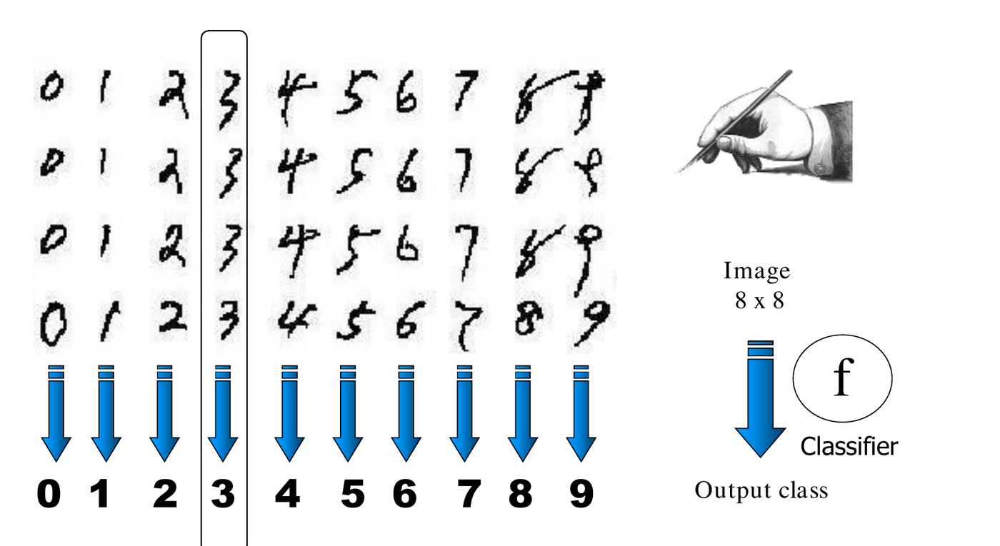
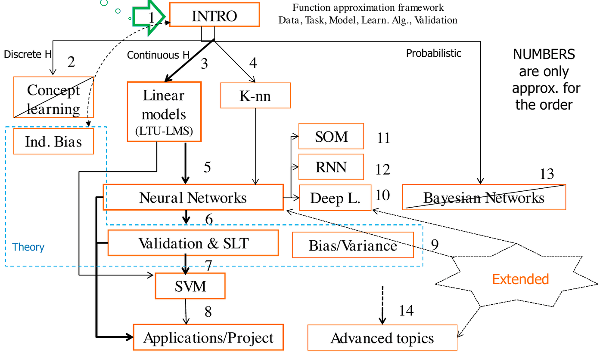
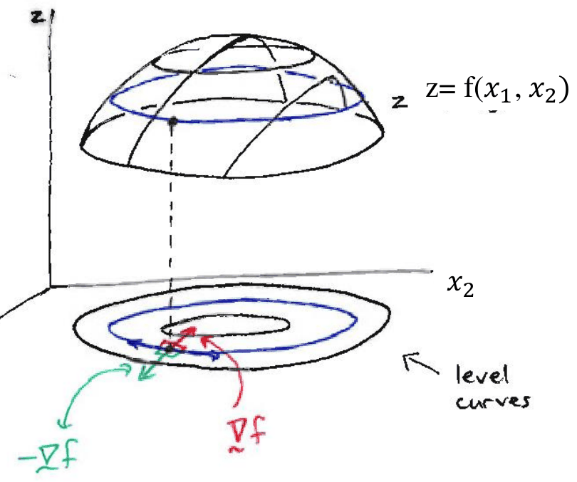
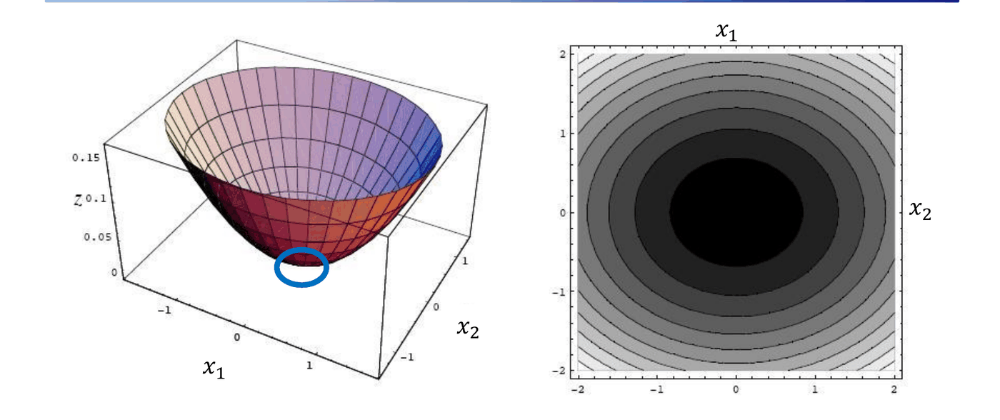
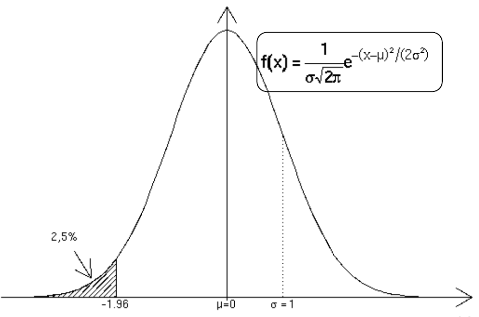

# Introduzione al Machine Learning

*Appunti di Fabio Piscitelli — Machine Learning (654AA), Prof. Alessio Micheli, Università di Pisa, a.a. 2026/27*

La prima lezione ha un doppio scopo: motivare lo studio del **Machine Learning** (ML, in italiano *apprendimento automatico*) collocandolo nel panorama dell'informatica e dell'intelligenza artificiale, e fornire le informazioni pratiche sul corso (prerequisiti, struttura, esame, materiale). In chiusura vengono richiamati i concetti matematici di base che serviranno per tutto il corso.

## Che cos'è il Machine Learning

### L'apprendimento come principio universale

L'apprendimento è un principio che accomuna esseri viventi, società e — oggi — macchine. Come osservano Poggio e Shelton (*AI Magazine*, 1999), *il problema dell'apprendimento è probabilmente il cuore stesso del problema dell'intelligenza, sia biologica che artificiale*. Capire come si impara significa quindi capire una parte fondamentale di cosa vuol dire essere intelligenti.

> [!definition] Machine Learning
>
> Il **Machine Learning** è un'area teorica e applicativa dell'informatica che unisce due obiettivi: quello dell'intelligenza artificiale di costruire **computer capaci di apprendere**, e quello di disporre di **strumenti adattivi e statistici potenti**, con fondamenti rigorosi nelle scienze computazionali. Operativamente, è l'apprendimento automatico, da parte di un sistema, a partire dall'**esperienza** (un insieme di esempi), finalizzato a risolvere un compito computazionale.

### Perché far apprendere le macchine: lusso o necessità?

Il ML non è un vezzo tecnologico ma una **necessità**, per due ragioni principali:

1. **Disponibilità crescente di dati empirici** e bisogno di analizzarli. La scienza stessa sta cambiando paradigma verso un approccio *data-driven*, in cui la conoscenza si estrae dai dati; il ML ha un ruolo centrale e metodologico in questo cambiamento.
2. **È difficile programmare esplicitamente l'adattività e l'intelligenza**. Già Alan Turing lo aveva intuito: per molti compiti scrivere a mano le regole è impraticabile, e l'apprendimento diventa l'unica strada per dotare i sistemi di comportamenti intelligenti.

La combinazione di **grandi quantità di dati**, **potenza di calcolo** (HPC, GPU) e **flessibilità dei modelli di ML** ha aperto una nuova era dell'intelligenza artificiale.

### Quando serve il ML

Il ML è la scelta giusta quando per un problema c'è **poca o nessuna conoscenza a priori** (non sappiamo scrivere le regole della soluzione), ma è relativamente **facile disporre di esperienza**, cioè di dati di cui conosciamo il risultato corretto. Esempi classici sono la classificazione delle email come *spam*, il riconoscimento di caratteri, volti o parlato.

> [!example] Riconoscimento di cifre scritte a mano
>
> Ogni cifra è un'immagine di $8 \times 8$ pixel. Scrivere a mano le regole che distinguono un "3" da un "8" per tutte le possibili calligrafie è di fatto impossibile. Si raccolgono invece molti esempi di cifre già etichettate e si lascia che il sistema **apprenda un classificatore** $f$ che associa a ogni immagine la classe corretta ($0, 1, \dots, 9$).

*Fig. 1.1 — Riconoscimento di cifre manoscritte: il classificatore $f$ mappa un'immagine 8×8 nella classe di output.*

### Aree applicative

Il ML è ormai pervasivo nei sistemi reali (dall'OCR alle interfacce uomo-macchina, ai motori di ricerca) ed è il nucleo di un'area interdisciplinare che dagli anni '80 comprende:

- **Pattern Recognition** (riconoscimento di volti e parlato), **Computer Vision**, **Natural Language Processing** (dalla classificazione di testi all'elaborazione del parlato fino all'AI generativa);
- **Robotica**, sistemi e filtri adattivi, reti di sensori intelligenti, componenti personalizzati;
- **Knowledge Discovery e Data Mining**, Information Retrieval, analisi di dati complessi (medicina, biologia, chimica, web, marketing), previsioni finanziarie.

In alcuni campi — NLP, Pattern Recognition, Computer Vision — l'impatto è stato rivoluzionario, tanto da parlare di una "nuova AI".

### Alcuni successi recenti

Il professore mostra alcuni risultati emblematici:

- **Riconoscimento facciale (DeepFace, CVPR 2014)**: combinando reti neurali profonde e altre tecniche di ML, addestrato su quattro milioni di immagini di oltre 4000 persone, il sistema stabilisce se due foto ritraggono la stessa persona con un'accuratezza del 97,25%, appena sotto quella umana (97,53%).
- **AlphaGo (DeepMind, marzo 2016)**: sconfigge il campione mondiale di Go.
- **Medicina**: una rete neurale profonda per la classificazione dei tumori della pelle, addestrata su 130.000 casi (più di quanti un medico ne veda "in molte vite"), raggiunge l'accuratezza di dermatologi certificati (*Nature*, 2017). Al CIML di Pisa, il progetto BrAID applica l'AI alla diagnosi della sindrome di Brugada.
- **Traduzione automatica**: Google Neural Machine Translation (dal 2016) e DeepL (dal 2017), interamente basati su reti neurali.
- **Large Language Models e AI generativa**: ChatGPT (OpenAI, novembre 2022), Bard/LaMDA (Google), modelli open source come Dolly, e sistemi che generano immagini (Stable Diffusion), video, musica.
- Guida autonoma, analisi di dati da sensori, IoT.

Il ML fornisce la base teorica e metodologica della cosiddetta *rivoluzione dell'AI*, con enormi investimenti industriali. Viene considerato una **GPT** (*General-Purpose Technology*): una tecnologia capace di trasformare profondamente le strutture economiche e sociali preesistenti. La figura del "*ML scientist*" è tra le più richieste nel mercato del lavoro.

> [!note] Premio Turing 2018
>
> Il 27 marzo 2019 l'ACM ha assegnato il Premio Turing (il "Nobel dell'informatica") a **Yoshua Bengio, Geoffrey Hinton e Yann LeCun** "per le scoperte concettuali e ingegneristiche che hanno reso le reti neurali profonde una componente critica dell'informatica".

> [!note] Premi Nobel 2024
>
> Nel 2024 il ML è arrivato anche ai Nobel:
> - **Fisica**: a **John Hopfield** e **Geoffrey Hinton** per le scoperte e invenzioni fondamentali che permettono il machine learning con le reti neurali artificiali (la rete di Hopfield come memoria associativa, la macchina di Boltzmann).
> - **Chimica**: a **Demis Hassabis** e **John Jumper** (Google DeepMind) per la predizione della struttura delle proteine con **AlphaFold**, e a **David Baker** per la progettazione computazionale di proteine. Hassabis: *"Ho sempre pensato che, se riuscissimo a costruire l'AI nel modo giusto, potrebbe essere lo strumento definitivo per aiutare gli scienziati a esplorare l'universo che ci circonda."*

### Lo scopo ultimo

Tutto ciò che è potente può essere pericoloso se usato male, ma lo scopo ultimo di AI e ML è **portare benefici alle persone** risolvendo problemi grandi e piccoli, **accelerare il progresso umano** e fornire intelligenza a ogni altro campo scientifico: aumentare le nostre capacità, esaltando la nostra umanità (P. Domingos, *Scientific American*, 2018).

---

## Perché studiare il Machine Learning

Nel percorso di laurea magistrale il ML serve a:

- conoscere i **principi di base dei processi di apprendimento**, dal punto di vista computazionale;
- conoscere **nuovi paradigmi di calcolo**, come le **reti neurali**: studiate come paradigma computazionale dagli anni '40 con ispirazione neurobiologica, oggi sono un insieme di modelli potenti per l'**approssimazione di funzioni** con capacità predittive, supportati da una solida teoria (la *learning theory*), e sono alla base del **Deep Learning**;
- saper **applicare questi modelli con rigore**;
- avere le basi per tutti i corsi successivi di AI.

### Il ML moderno

Il ML è passato dall'essere una **collezione di metodi euristici** (trucchi provenienti da biologia, statistica, reti neurali, logica fuzzy...) alla costruzione di **quadri concettuali generali**. È emersa una nuova comprensione dei principi che governano i processi di apprendimento, con tre conseguenze importanti:

- esprimere modelli diversi in "linguaggi" matematici o informatici diversi **non cambia i principi**;
- campi applicativi diversi **non cambiano i principi**;
- nuovi avanzamenti tecnologici **non cambiano i principi**.

> [!tip] Il filo conduttore del corso
>
> Il "Machine Learning" in senso proprio è il **nucleo di principi e metodi** per costruire modelli computazionali flessibili e potenti a partire dai dati. I singoli modelli cambiano, i principi restano: è questo che conviene imparare davvero.

### Tre punti di vista sul ML

1. **Come metodologia di AI** → costruire sistemi adattivi e intelligenti.
2. **Come apprendimento statistico** (inferenza di ipotesi secondo principi matematici) → costruire potenti sistemi predittivi per l'analisi intelligente dei dati.
3. **Come metodo informatico per aree applicative innovative** → usare i modelli come strumenti per problemi complessi e interdisciplinari.

Il corso li considera tutti, con un **approccio critico**: dei vari metodi si discutono i limiti e l'appropriatezza d'uso, con attenzione ai principi sottostanti. Gli obiettivi pratici sono due: imparare a **sviluppare nuovi modelli** di ML e imparare ad **applicare le metodologie allo stato dell'arte** a problemi di altri campi.

---

## Informazioni sul corso

### Prerequisiti e obiettivi

Nessun corso è strettamente necessario: si parte da zero. Servono però le basi tipiche di una laurea triennale scientifica: **analisi matematica** (funzioni, calcolo differenziale), **notazione e calcolo matriciale**, **elementi di probabilità e statistica**, **algoritmi**.

Il corso introduce i principi e l'analisi critica dei principali paradigmi (modelli e algoritmi, con focus sulle reti neurali) per l'apprendimento dai dati. I concetti vengono introdotti progressivamente, dagli approcci più semplici fino ai modelli allo stato dell'arte, all'interno del quadro concettuale del ML moderno: l'**apprendimento di funzioni a partire da esempi**. L'attenzione è su:

- analisi critica delle caratteristiche per la progettazione e l'uso del ML;
- **valutazione sperimentale rigorosa**: c'è una grande differenza tra *usare* strumenti di ML e usarli *correttamente*;
- aspetti computazionali dei sistemi di apprendimento.

### Struttura del corso

Il corso ha una struttura forte: si parte dai modelli semplici per arrivare allo stato dell'arte, e i concetti fondamentali vengono introdotti attraverso modelli diversi. Il consiglio pratico è duplice: (1) studiare i singoli metodi, (2) cercare le **connessioni e i confronti** tra di essi, così da astrarre i concetti. Il filo rosso è la comprensione del rapporto tra **flessibilità del modello** e **controllo della complessità**, concetto fondamentale per la capacità di **generalizzazione**.

*Fig. 1.2 — La mappa del corso. I numeri indicano approssimativamente l'ordine delle lezioni; il riquadro tratteggiato "Theory" raccoglie le parti teoriche.*

La mappa non è solo un ordine delle lezioni: descrive il percorso. Si introducono dei **"mattoni"** (concetti e modelli intermedi) che poi vengono composti per costruire i modelli di ML — ad esempio le reti neurali si costruiscono dai modelli lineari, e un sistema di ML completo si costruisce dalle tecniche di validazione. Per questo i modelli intermedi vanno visti come pezzi di un puzzle che si ricompone alla fine.

> [!note] Ordine delle lezioni secondo la mappa
>
> 1. Introduzione (dati, task, modello, algoritmo di apprendimento, validazione) — nel quadro dell'**approssimazione di funzioni**.
> 2. Concept learning e bias induttivo (spazio delle ipotesi discreto).
> 3. Modelli lineari (LTU, LMS) (spazio delle ipotesi continuo).
> 4. K-nearest neighbors.
> 5. Reti neurali.
> 6. Validazione e Statistical Learning Theory.
> 7. Support Vector Machines.
> 8. Applicazioni e progetto.
> 9. Bias/Varianza.
> 10. Deep Learning (e, in estensione, SOM, RNN).
> 11–14. SOM, RNN, (Reti Bayesiane — rimosse dal programma), argomenti avanzati (dati strutturati).

La densità del corso non è uniforme: l'introduzione è lenta e "morbida", il nucleo (reti neurali, SVM, validazione) è denso e consequenziale, la parte avanzata è veloce ma meno densa. Il progetto (opzionale) viene annunciato circa a metà corso.

### Organizzazione pratica

- **Docente**: Prof. Alessio Micheli (Dipartimento di Informatica), professore ordinario, responsabile del gruppo CIML (*Computational Intelligence & Machine Learning*) con oltre 25 anni di ricerca in ML/AI, **presidente della European Neural Network Society** (conferenza annuale ICANN), co-fondatore della IEEE Task Force on Reservoir Computing, associate editor di IEEE TNNLS e *Neural Networks*. Obiettivo del corso: introdurre in 3 mesi al ML attuale, ripercorrendone anche le basi e la storia.
- **Lezioni** (a.a. 2026/27): martedì, mercoledì e giovedì 16–18, Aula E. L'inizio è puntuale per poter fare una pausa.
- **Q&A** con il docente: il martedì dopo la lezione (tempo facoltativo, non parte della lezione) più alcune lezioni speciali di Q&A. Per domande personali si scrive una mail con il tag **[ML-26-Q]** nell'oggetto (obbligatorio).
- **Comunicazioni**: tramite Teams e/o le news di Moodle. Le **registrazioni** delle lezioni sono su Teams (scheda *Shared* → *Recordings*); le lezioni ufficiali sono solo in presenza, lo streaming è informale e senza interazione garantita.
- **Recuperi**: il lunedì pomeriggio (annunciati quando servono) e nel periodo di recupero dal 9 al 18 dicembre 2026 (da considerare prima di programmare le vacanze di Natale). Le lezioni del 15–17 settembre 2026 non si sono tenute e saranno recuperate.

> [!note] Chi arriva in ritardo al corso
>
> Tutte le informazioni sono sul **Moodle** del corso (elearning.di.unipi.it, con iscrizione autonoma tramite account Unipi): slide, bibliografia e sezione **FAQ**. Conviene usare anche Teams (news e registrazioni) e gli appunti dei colleghi. Progetto e test di esercizio **non sono obbligatori** per l'esame. Non chiedere al docente ciò che è già nelle FAQ o nella prima lezione.

### Esame

> [!warning] Regole aggiornate (a.a. 2026/27)
>
> Le modalità d'esame sono cambiate rispetto agli anni precedenti: il **progetto non è più obbligatorio** e l'esame si basa su uno **scritto obbligatorio**, con orale solo se necessario.

L'esame si articola, in ordine cronologico, in quattro fasi.

**1. Test di esercizio durante il corso (opzionali).** Alla fine di ogni ciclo di lezioni vengono proposti su Moodle brevi e semplici test di esercizio. Servono per l'**autovalutazione** (come esercizi per casa, con un punteggio che però **non vale per l'esame**), tengono al passo con le lezioni e sono una testimonianza della partecipazione attiva. Hanno una scadenza (tipicamente una settimana), ma se se ne perde qualcuno si può continuare la serie. Preparano allo scritto, anche se formato, contenuti e profondità sono diversi. Vengono annunciati solo in aula e con un breve messaggio su Teams.

**2. Progetto (opzionale).** Alla fine del corso (dicembre) si può svolgere un progetto:

- lavoro di gruppo di **2 studenti**, senza eccezioni;
- contenuto: implementazione, applicazione e/o analisi di un metodo o di una tecnica di ML/reti neurali con **valutazione sperimentale** (possibili progetti coordinati con il corso di CM);
- formato: presentazione pubblica di un **poster** in aula (una delle ultime lezioni), più la consegna del materiale sviluppato; è previsto un premio per il miglior poster;
- dopo la presentazione si può sostenere l'esame in qualunque sessione, ma per discutere il progetto i due membri del gruppo devono fare l'esame **nella stessa sessione**.

Il consiglio è di non candidarsi al progetto prima di aver studiato a fondo i contenuti del corso. I dettagli verranno dati in una lezione dedicata.

**3. Scritto (obbligatorio).** Si svolge dopo il corso, nelle sessioni d'esame (da gennaio e febbraio):

- è obbligatorio **iscriversi** all'appello su esami.unipi.it entro la scadenza (verificarla con largo anticipo) e cancellare l'iscrizione se si decide di non partecipare;
- si svolge **solo in presenza**, in aula, nella data, ora e aula indicate su esami.unipi.it; non presentarsi equivale a ritirarsi da quella sessione;
- le domande vanno risposte su **fogli prestampati** con spazio per la risposta libera; bisogna portare penna o matita;
- le risposte richiedono **equazioni, disegni e/o parti descrittive** (quiz e domande aperte);
- non si può usare alcun materiale del corso o esterno, né alcun ausilio elettronico (assistenti virtuali, chatbot...): è vietato l'uso di qualunque dispositivo (portatili, smartphone, braccialetti smart, auricolari, occhiali smart...), pena l'esclusione.

**4. Orale (solo se necessario) e verbalizzazione.** Per accedere all'orale serve un livello sufficiente nello scritto (la lista degli ammessi è comunicata su Moodle). L'orale si tiene nella stessa sessione dello scritto, in presenza, tipicamente nello studio del docente: nei giorni successivi alla correzione il docente assegna uno slot a ogni studente o gruppo. Se serve (in base all'esito dello scritto), l'orale è un colloquio su **tutto il programma** e può includere la discussione dello scritto e del progetto. Esigenze particolari (priorità, impossibilità di essere in presenza...) si valutano caso per caso su richiesta.

> [!abstract] Riepilogo delle regole
>
> La valutazione tiene conto di: **risultato dello scritto** + partecipazione attiva (inclusi i test durante il corso) + attività extra facoltative (progetto, presentazioni volontarie a fine corso) + eventuale orale completo, se richiesto dal docente.
>
> - Scritto **sufficiente** → in uno slot pochi giorni dopo: eventuale orale e **proposta di voto** → se accettata, verbalizzazione.
> - Scritto **insufficiente** o voto non accettato → si ripete in una sessione successiva, a scelta tra le molte dell'anno.
>
> Completare l'80% dei test online e un progetto molto buono possono dare un **piccolo bonus** (se lo scritto è già sufficiente o buono), ma **non sono necessari** né per sostenere l'esame né per ottenere il voto massimo. L'indicatore chiave è la **conoscenza finale del ML e la sua profondità**.

> [!tip] I consigli del professore
>
> - Seguire le lezioni usando le slide come guida e studiare progressivamente durante il corso; le lezioni di Q&A sono un forum di discussione: è una classe, non un insieme di registrazioni.
> - Prima **studiare i contenuti** del corso, poi dedicarsi al progetto: aumenta sia l'efficacia sia l'efficienza del lavoro.
> - Se qualcosa non è chiaro: niente panico, chiedere al docente (Q&A), collaborare con i colleghi, usare libri e articoli (bibliografia e ricerca personale) e i supporti del corso. Il ML è un campo in continua evoluzione: va studiato!

### Materiale e bibliografia

Il riferimento principale sono le slide del corso (su Moodle, spesso pubblicate in anticipo; attenzione a usare l'ultima versione dei file `ML-26…-v*`), che però vanno integrate con i propri appunti (le slide da sole possono non bastare a ricostruire il filo della lezione) e con i libri. Il docente è disponibile a condividere su Moodle gli appunti degli studenti. I testi principali sono:

- S. Haykin, *Neural Networks and Learning Machines*, Prentice Hall, 3ª ed., 2008;
- T. M. Mitchell, *Machine Learning*, McGraw-Hill, 1997;
- I. Goodfellow, Y. Bengio, A. Courville, *Deep Learning*, MIT Press, 2016 (gratuito online).

Altri riferimenti utili: Russell–Norvig (*AIMA*), Hastie–Tibshirani–Friedman (*The Elements of Statistical Learning*, copia gratuita online), Cherkassky–Mulier, Bishop (*Pattern Recognition and Machine Learning*, ora **gratuito** dal sito dell'editore; e *Neural Networks for Pattern Recognition*), Duda–Hart–Stork, Shalev-Shwartz–Ben-David (*Understanding Machine Learning*, gratuito online).

Per le **librerie software**: F. Chollet, *Deep Learning with Python*; A. Géron, *Hands-on Machine Learning with Scikit-Learn, Keras & TensorFlow*; A. Zhang, Z. Lipton, M. Li, A. Smola, *Dive into Deep Learning* (Cambridge University Press, 2023, gratuito online, con esempi in PyTorch, NumPy/MXNet, JAX e TensorFlow). Le librerie principali verranno introdotte più avanti dall'assistente del corso. Attenzione: esistono moltissimi libri e blog tecnici, bisogna badare alla qualità scientifica.

> [!note] Supporti al corso
>
> - Un **assistente del corso** per aiutare nello sviluppo del progetto (da confermare).
> - Un **chatbot tutor** (basato su ChatGPT), sperimentale, per il corso ML 2026: serve a chiarire dubbi, approfondire concetti e avere indicazioni su slide, definizioni ed esercizi, sempre sulla base dei materiali ufficiali del corso. Dettagli e link saranno pubblicati nelle news di Moodle.

In parallelo è molto utile il corso di **Computational Mathematics for Learning and Data Analysis** (CM), che fornisce le basi matematiche profonde dei metodi di apprendimento (non è però obbligatorio per seguire ML).

---

## Richiami matematici

Per seguire il corso servono alcuni concetti di base: calcolo in più variabili (derivate parziali, gradiente), probabilità (densità, media, varianza, normale, probabilità condizionate e congiunte), calcolo matriciale (prodotto scalare, inversa, norme). Argomenti come il problema dei minimi quadrati lineari con la SVD e i moltiplicatori di Lagrange possono essere approfonditi in parallelo. Riferimenti consigliati: appendice A di AIMA, capitoli 2–4 del *Deep Learning book*, e *Mathematics for Machine Learning* (2020).

La notazione usata è: $x$ scalare, $\mathbf{x}$ vettore, $X$ matrice.

### Prodotto scalare e norme

> [!definition] Prodotto scalare (*inner/dot product*)
>
> $$
> \mathbf{a} \cdot \mathbf{b} = a_1 b_1 + a_2 b_2 + \dots + a_n b_n = \sum_{i=1}^{n} a_i b_i = |\mathbf{a}|\,|\mathbf{b}| \cos\theta
> $$
>
> Notazioni equivalenti: $\mathbf{a}\cdot\mathbf{b} = \mathbf{a}^T\mathbf{b} = \mathbf{a}^t\mathbf{b} = \langle \mathbf{a}, \mathbf{b}\rangle$, e anche solo $\mathbf{ab}$ se il contesto è chiaro.

La relazione con il coseno dà l'intuizione geometrica: il prodotto scalare misura **quanto due vettori puntano nella stessa direzione**. È massimo quando sono paralleli, nullo quando sono ortogonali, negativo quando puntano in versi opposti. Questa lettura tornerà di continuo (ad esempio nei modelli lineari, dove $\mathbf{w}^T\mathbf{x}$ misura l'"allineamento" dell'input con i pesi).

La **norma euclidea** (modulo, lunghezza) di un vettore è
$$
\|\mathbf{x}\|_2 = \sqrt{\mathbf{x}^T\mathbf{x}} = \sqrt{\sum_i x_i^2} = d(\mathbf{x}, \mathbf{0}),
$$
spesso scritta semplicemente $\|\mathbf{x}\|$ o $|\mathbf{x}|$. Altre norme utili sono la **norma $L^1$**, $\|\mathbf{x}\|_1 = \sum_i |x_i|$, e la **norma del massimo**, $\|\mathbf{x}\|_\infty = \max_i |x_i|$.

Più in generale, un **prodotto interno** $\langle \cdot,\cdot \rangle$ è una forma bilineare simmetrica che associa a una coppia di vettori uno scalare:
$$
\langle v, w\rangle = \langle w, v\rangle, \qquad \langle v+w, u\rangle = \langle v,u\rangle + \langle w,u\rangle, \qquad \langle kv, w\rangle = k\langle v, w\rangle.
$$
Vale la **disuguaglianza di Cauchy-Schwarz**: $|\langle x, y\rangle| \le \|x\|\cdot\|y\|$ per ogni $x, y \in V$.

> [!note] Tensori
>
> Un **tensore**, nella visione semplificata usata in ML, è un array multidimensionale di numeri disposti su una griglia regolare con un numero variabile di assi (ad esempio $X_{i,j,k}$ ha 3 indici). In ML si usa soprattutto come comodità di notazione e per ragionare sul calcolo su GPU; in matematica i tensori hanno proprietà più ricche (legate ai cambi di base).

### Derivate parziali e gradiente

La **derivata parziale** generalizza la derivata a funzioni di più variabili: è la derivata rispetto a una sola variabile tenendo fisse tutte le altre. Per $f(x_1, x_2, x_3)$ si calcolano $\frac{\partial f}{\partial x_1}$, $\frac{\partial f}{\partial x_2}$, $\frac{\partial f}{\partial x_3}$.

> [!definition] Gradiente
>
> Il **gradiente** di $f$ è il vettore delle sue derivate parziali:
> $$
> \nabla f = \operatorname{grad} f = \left( \frac{\partial f}{\partial x_1}, \dots, \frac{\partial f}{\partial x_n} \right) = \sum_{i=1}^{n} \frac{\partial f}{\partial x_i}\, \mathbf{e}_i
> $$
> dove gli $\mathbf{e}_i$ sono i versori ortogonali lungo le direzioni coordinate.

Il significato geometrico è fondamentale per tutto il corso: in un punto, il gradiente è un vettore che **punta nella direzione di massima pendenza**, e la sua norma indica **quanto è ripida** la pendenza. Il gradiente indica quindi dove la funzione cresce più rapidamente, mentre il suo opposto $-\nabla f$ indica la direzione in cui **decresce** più rapidamente. È esattamente questa l'idea alla base della **discesa del gradiente** (*gradient descent*), che useremo per addestrare i modelli minimizzando una funzione di errore.

*Fig. 1.3 — Gradiente su una superficie: $\nabla f$ punta verso la crescita di $f$, $-\nabla f$ verso la decrescita; entrambi sono perpendicolari alle curve di livello.*

Un punto in cui il gradiente è nullo si dice **punto stazionario**. Può essere un minimo locale, un massimo locale o un punto di sella: il gradiente nullo da solo non basta a dire di quale caso si tratta.

*Fig. 1.4 — Un minimo: nel punto più basso del paraboloide il gradiente è zero.*

### Densità di probabilità: la gaussiana

La **distribuzione normale** con media $\mu$ e varianza $\sigma^2$ ha densità di probabilità (la "funzione gaussiana")
$$
f(x) = \frac{1}{\sigma\sqrt{2\pi}}\, e^{-(x-\mu)^2 / (2\sigma^2)}.
$$
Con $\mu = 0$ e $\sigma^2 = 1$ si ottiene la **normale standard**.

*Fig. 1.5 — Densità della normale standard: l'area a sinistra di $-1{,}96$ vale il 2,5%.*

---

## Sintesi e prossimi passi

> [!abstract] Sintesi
>
> Il ML è l'apprendimento automatico di un compito a partire da esempi: è necessario quando i dati abbondano ma le regole esplicite mancano. Il corso lo affronta come **approssimazione di funzioni a partire da esempi**, costruendo i modelli per "mattoni" successivi, con attenzione ai principi (che non cambiano al variare dei modelli) e alla valutazione rigorosa. Il concetto chiave che attraversa tutto il corso è il compromesso tra **flessibilità del modello** e **controllo della complessità**, da cui dipende la **generalizzazione**.

Le lezioni successive completano l'introduzione: nelle lezioni 2–3 si vedono l'utilità del ML, l'apprendimento come approssimazione di funzioni con un esempio guida, e le componenti di progetto di un sistema di ML (task, spazio delle ipotesi, bias induttivo, funzione di loss, generalizzazione); nella lezione 4 si approfondiscono generalizzazione e validazione.

> [!question] Possibili domande d'esame
>
> - Perché il ML è una necessità e non un lusso? In quali condizioni è appropriato usarlo?
> - Che cos'è il gradiente e perché $-\nabla f$ indica la direzione di massima decrescita?
> - Che cos'è un punto stazionario? È sempre un minimo?
