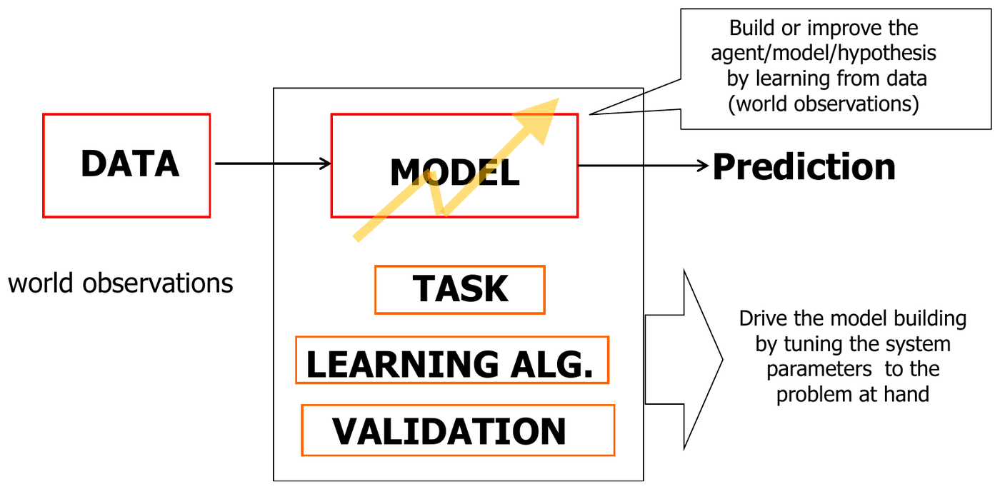
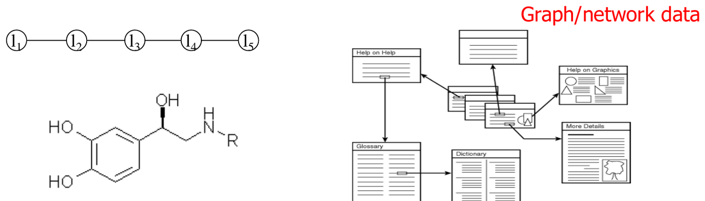
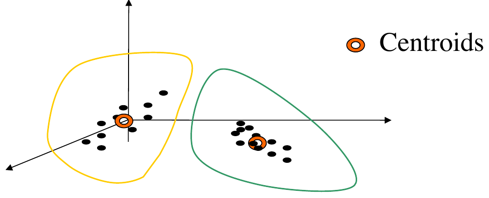
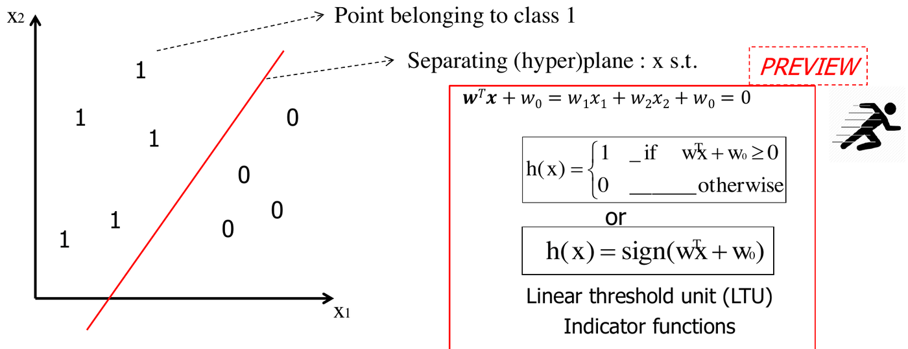
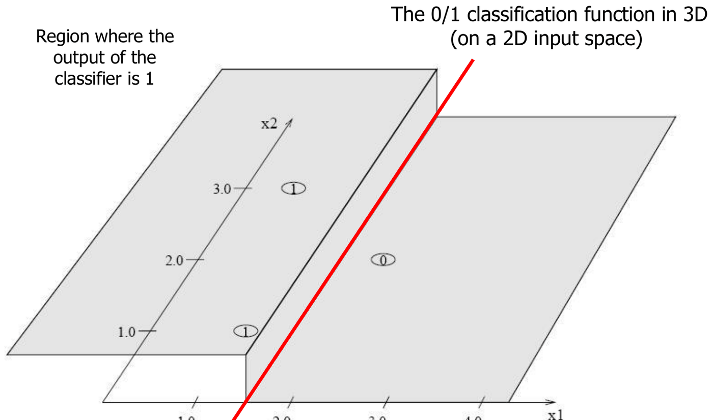
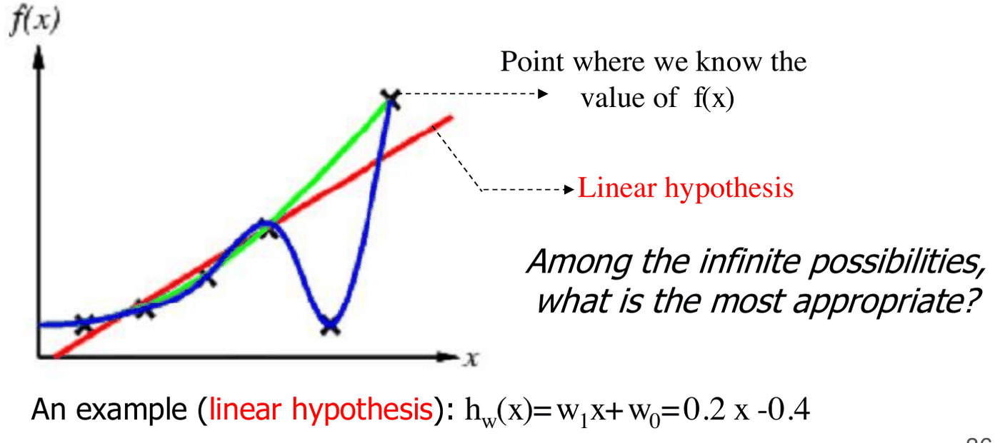
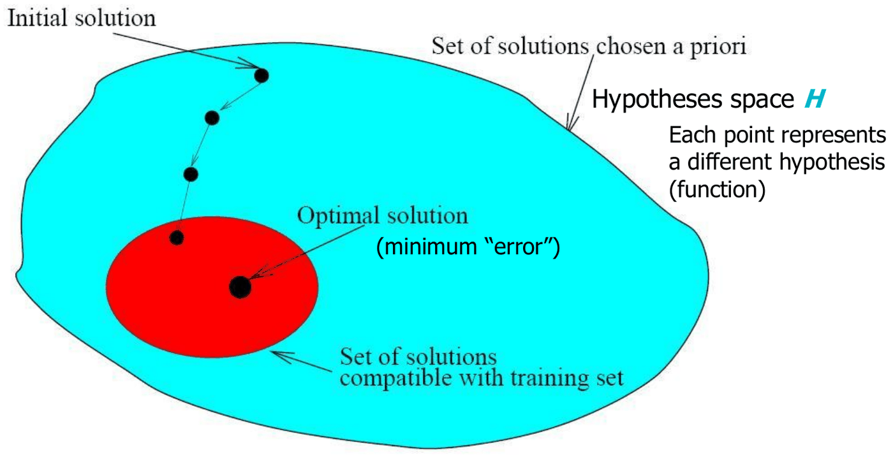
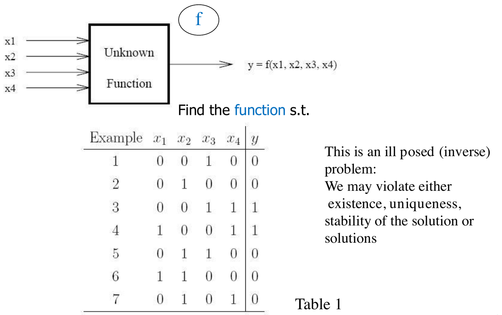
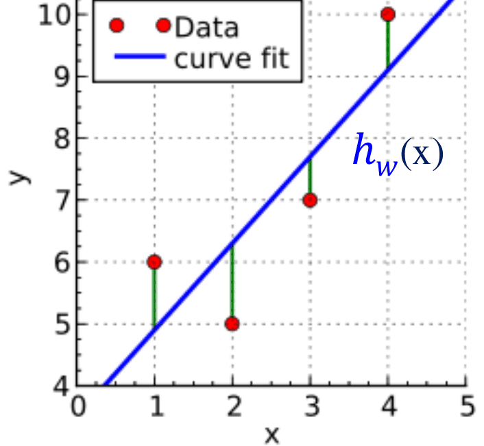

# Concetti fondamentali del ML

*Appunti di Fabio Piscitelli — Machine Learning (654AA), Prof. Alessio Micheli, Università di Pisa, a.a. 2026/27*

Le lezioni 2 e 3 forniscono la **panoramica e la terminologia** del Machine Learning prima di entrare nei modelli veri e propri. Si parte dal quadro generale — l'apprendimento come approssimazione di una funzione sconosciuta a partire da esempi — per poi descrivere gli "ingredienti" di un sistema di ML (dati, task, modello, algoritmo di apprendimento, validazione) e tre concetti cruciali: il **bias induttivo**, la **funzione di loss** e la **generalizzazione**. Molti concetti qui solo accennati verranno ripresi e approfonditi nel resto del corso.

## Il Machine Learning in ambito computazionale

Restringendoci al quadro computazionale, il ML studia **principi, metodi e algoritmi per l'apprendimento e la predizione**: il sistema apprende dall'esperienza (dati noti) per affrontare un compito computazionale, costruendo un **modello** (o **ipotesi**) da usare per fare predizioni.

Il quadro specifico più diffuso, e quello adottato dal corso, è il seguente: **inferire un modello, cioè una funzione, a partire da un insieme di esempi, in modo che sia capace di generalizzare**, ovvero di dare risposte accurate su dati nuovi.

### Quando usare il ML

Il ML va usato con **opportunità** (quando serve davvero) e **consapevolezza** (dei suoi requisiti e limiti). I modelli predittivi sono utili quando:

- non c'è una teoria (o c'è poca conoscenza) che spieghi il fenomeno;
- i dati sono **incerti, rumorosi o incompleti**, e questo ostacola la formalizzazione di una soluzione esatta.

In cambio, il ML richiede due cose: una **fonte di esperienza** per l'addestramento (dati *rappresentativi*) e una certa **tolleranza sulla precisione** dei risultati, che non saranno mai garantiti esatti.

Il ML è complementare alle tecniche tradizionali (modelli analitici basati su conoscenza pregressa, algoritmi e programmazione imperativa, AI classica). È particolarmente adatto quando:

- **la conoscenza è troppo difficile da formalizzare** a mano: gli esseri umani riconoscono i volti ma non sanno descrivere *come* lo fanno; lo stesso vale per il riconoscimento vocale;
- **la conoscenza umana non basta**: ad esempio prevedere la forza di legame di molecole con proteine;
- serve un **comportamento personalizzato**: filtrare email o pagine web secondo le preferenze dell'utente, interfacce uomo-macchina individualizzate.

Le grandi sfide del ML sono costruire **sistemi autonomi intelligenti** (robotica, interazione uomo-robot, motori di ricerca), fornire **strumenti potenti per l'analisi dei dati** (gli strumenti del *data scientist*) e aprire **nuove aree applicative** interdisciplinari, in un'epoca in cui il progresso scientifico è sempre più *data-driven*.

---

## L'apprendimento come approssimazione di funzioni

Il corso adotta una visione specifica ma molto diffusa: **l'apprendimento è l'approssimazione di una funzione sconosciuta a partire da esempi**. Il vantaggio è che task diversi (classificazione, regressione, ...) vengono trattati in un quadro uniforme — matematicamente, quello degli spazi di funzioni (spazi di Hilbert) — che permette una formulazione rigorosa.

### L'esempio guida: riconoscimento di cifre

Riprendiamo l'esempio della prima lezione. L'input è una collezione di immagini di cifre scritte a mano (matrici $8\times 8$ di valori); il problema è costruire un modello che, ricevuta un'immagine, **predica** la cifra. Si tratta di un **problema di classificazione** con dieci classi.

È un caso tipico di successo del ML: è **difficile formalizzare esattamente** la soluzione (le calligrafie variano, ci sono rumore e dati ambigui), mentre è **relativamente facile raccogliere esempi etichettati**.

> [!definition] Machine Learning (definizione estesa)
>
> Il ML studia e propone metodi per costruire (**inferire**) dipendenze, funzioni o ipotesi a partire da esempi di dati osservati, che:
> - si **adattino** agli esempi noti (*fit*);
> - siano in grado di **generalizzare**, con accuratezza ragionevole, su dati nuovi;
>
> secondo risultati **verificabili**, sotto condizioni e criteri statistici e computazionali, tenendo conto dell'**espressività** e della **complessità algoritmica** dei modelli e degli algoritmi di apprendimento.

### Esempi di coppie $x \to f(x)$

In tutti i casi seguenti si vuole inferire una funzione generale partendo da dati noti, cioè da un **training set** (TR) di coppie $\langle x, f(x)\rangle$:

| Problema | Input $x$ | Output $f(x)$ |
|---|---|---|
| Riconoscimento della scrittura | dati del movimento della penna | lettera dell'alfabeto |
| Diagnosi medica | proprietà del paziente (sintomi, esami) | malattia o terapia consigliata |
| Riconoscimento facciale | bitmap del volto | nome della persona |
| Rilevamento spam | messaggio email | spam / non spam |
| *Protein folding* | sequenza di amminoacidi (stringa di lunghezza variabile) | coordinate 3D degli atomi (sequenza di vettori) |
| *Drug design* | molecola (grafo di atomi e legami) | forza di legame con la proteasi dell'HIV (numero reale) |

Gli ultimi due esempi mostrano che input e output possono essere **dati complessi**: stringhe, sequenze, grafi.

---

## Gli ingredienti di un sistema di ML

Un sistema di ML predittivo si può descrivere attraverso i suoi componenti, che costituiscono anche una **guida alle scelte progettuali chiave**.

*Fig. 3.1 — Panoramica di un sistema di ML predittivo e dei suoi "ingredienti".*

- **Dati**: le osservazioni del mondo, cioè l'esperienza disponibile.
- **Task**: lo scopo dell'applicazione, che definisce cosa vogliamo ottenere.
- **Modello**: l'agente/ipotesi che viene costruito o migliorato apprendendo dai dati.
- **Algoritmo di apprendimento**: guida la costruzione del modello regolando i parametri del sistema sul problema.
- **Validazione**: valuta la qualità del modello ottenuto.

### Dati

I dati rappresentano i fatti disponibili. Il primo problema è quello della **rappresentazione**: come catturare la struttura degli oggetti analizzati.

Nel caso **piatto** (*flat*, linguaggio attributo-valore) ogni oggetto è un **vettore di dimensione fissa di proprietà** (*feature*), e l'intero dataset è una tabella di tuple. Gli attributi possono essere **categorici/discreti** (colore: giallo, rosso) o **continui** (peso, costo), e possono esserci **dati mancanti** (indicati con "?").

> [!note] Terminologia sui dati
>
> - Ogni riga $\mathbf{x}$ (vettore, in grassetto) è un **esempio**, *pattern*, istanza, campione.
> - La **dimensione del dataset** è il numero di esempi, indicato con $l$.
> - La **dimensione dell'input** è il numero di feature, indicato con $n$.
> - $x_i$ (o $x_j$) è tipicamente la $i$-esima feature (attributo, componente) di $\mathbf{x}$.
> - $\mathbf{x}_p$ è tipicamente il $p$-esimo pattern (riga) del dataset.
> - $x_{p,i}$ è l'attributo $i$ del pattern $p$.

I dati possono essere **pre-elaborati**: scalatura delle variabili, codifica, selezione delle feature.

#### Codifica delle variabili categoriche

Per usare variabili categoriche in modelli numerici bisogna codificarle:

- per **due classi** si usa $0/1$ oppure $-1/+1$;
- per **più classi** si può usare $1, 2, 3, \dots$, ma questa codifica introduce un **grado di somiglianza** artificiale (la classe 1 risulta "più vicina" alla 2 che alla 3). È adatta solo per variabili **categoriche ordinate** (es. piccolo, medio, grande);
- per simboli senza ordine si usa la codifica **1-of-k** (o **one-hot**): ogni simbolo diventa un vettore con un solo 1, ad esempio $A = (1,0,0)$, $B = (0,1,0)$, $C = (0,0,1)$. Tutti i simboli sono così equidistanti tra loro. Si usa sia per l'input sia per l'output, ed è utile per il progetto.

#### Dati strutturati

Molti dati non sono naturalmente vettori: **sequenze** (liste), **alberi**, **grafi**, dati multi-relazionali. Esempi: immagini, serie temporali, stringhe di un linguaggio, DNA e proteine, relazioni gerarchiche, molecole, la rete di link delle pagine web. Il problema è trovare una rappresentazione naturale per essi (se ne parlerà nella parte avanzata del corso).

*Fig. 3.2 — Dati strutturati: sequenze, molecole e grafi.*

#### Rumore, outlier e feature selection

- Il **rumore** (*noise*) è l'aggiunta di fattori esterni al segnale informativo: è dovuto alla casualità delle misure, non alla legge sottostante (es. rumore gaussiano).
- Gli **outlier** sono valori insoliti, incoerenti con la maggior parte delle osservazioni (es. errori di misura anomali). Si gestiscono rilevandoli e rimuovendoli in pre-elaborazione oppure usando metodi di modellazione **robusti**.
- La **feature selection** seleziona un piccolo numero di feature informative, fornendo una rappresentazione ottimale dell'input per il problema.

### Task

Il task definisce lo scopo dell'applicazione: quale conoscenza vogliamo ottenere, qual è la natura utile del risultato, quali informazioni sono disponibili. Distinguiamo:

- **task predittivi** (classificazione, regressione): approssimazione di funzioni — sono il focus del corso;
- **task descrittivi** (cluster analysis, regole di associazione): trovare sottoinsiemi o gruppi di dati non classificati.

#### Apprendimento supervisionato

> [!definition] Apprendimento supervisionato
>
> **Dati**: esempi di training nella forma $\langle \text{input}, \text{output}\rangle = \langle \mathbf{x}, d\rangle$ (esempi **etichettati**) per una funzione sconosciuta $f$, nota solo nei punti degli esempi. Il **target** $d$ (indicato anche con $t$ o $y$) è fornito da un "insegnante" secondo $f(\mathbf{x})$.
>
> **Obiettivo**: trovare una buona approssimazione di $f$, cioè un'**ipotesi** $h$ utilizzabile per predire su dati mai visti $\mathbf{x}'$ — un'ipotesi che **generalizzi**.

Il target può essere:

- **categorico** → **classificazione**: $f(\mathbf{x}) \in \{1, 2, \dots, K\}$ (funzione a valori discreti);
- **numerico** → **regressione**: $f(\mathbf{x}) \in \mathbb{R}$ o $\mathbb{R}^K$ (funzione a valori reali continui).

Grazie al formalismo dell'approssimazione di funzioni, classificazione e regressione hanno una **visione unificata**. In terminologia statistica gli input sono le **variabili indipendenti** e gli output le **variabili dipendenti** o **risposte**.

#### Apprendimento non supervisionato

Nell'apprendimento **non supervisionato** non c'è insegnante: il training set contiene solo dati **non etichettati** $\langle \mathbf{x}\rangle$. L'obiettivo è ad esempio trovare **raggruppamenti naturali** nei dati (**clustering**, cioè partizionare i dati in sottoinsiemi di elementi "simili"), fare **riduzione di dimensionalità**, visualizzazione o pre-elaborazione, oppure **modellare la densità** dei dati.

*Fig. 3.3 — Clustering: partizione dei dati in gruppi, ognuno rappresentato dal suo centroide.*

#### Classificazione

Nella classificazione i pattern sono visti come membri di una classe, e l'obiettivo è assegnare a ogni pattern la classe corretta. Se le classi sono **due**, $f(\mathbf{x})$ è una **funzione booleana**: si parla di **classificazione binaria** o **concept learning** (vero/falso, $0/1$, $-1/+1$, negativo/positivo). Con **più di due** classi si ha un problema **multi-classe**.

Geometricamente, la classificazione può essere vista come la **suddivisione dello spazio degli input in regioni di decisione**. L'esempio più semplice è il separatore lineare in $\mathbb{R}^2$: una retta (in generale un iperpiano) che divide i punti della classe 1 da quelli della classe 0.

*Fig. 3.4 — Un separatore lineare nel piano: anticipazione della Linear Threshold Unit.*

L'iperpiano separatore è l'insieme dei punti $\mathbf{x}$ tali che
$$
\mathbf{w}^T\mathbf{x} + w_0 = w_1 x_1 + w_2 x_2 + w_0 = 0,
$$
e il classificatore è
$$
h(\mathbf{x}) = \begin{cases} 1 & \text{se } \mathbf{w}^T\mathbf{x} + w_0 \ge 0 \\ 0 & \text{altrimenti} \end{cases}
\qquad \text{oppure} \qquad h(\mathbf{x}) = \operatorname{sign}(\mathbf{w}^T\mathbf{x} + w_0).
$$
Questo modello si chiama **Linear Threshold Unit** (LTU) e sarà studiato in dettaglio più avanti. Funzioni di questo tipo, a valori in $\{0,1\}$, sono dette **funzioni indicatrici**. L'insieme $H$ di tutte le dicotomie (divisioni in due classi) indotte dagli iperpiani è il suo spazio delle ipotesi.

*Fig. 3.5 — La stessa funzione di classificazione vista in 3D: è una funzione "a gradino" che vale 1 in una regione e 0 nell'altra.*

#### Regressione

La **regressione** è la stima di una funzione a valori reali sulla base di un insieme finito di **campioni rumorosi**: si conoscono coppie $(\mathbf{x}, f(\mathbf{x}) + \text{rumore})$. È una forma di *curve fitting* (in una dimensione nell'esempio, a $k$ dimensioni in generale).

> [!example] Esercizio di regressione
>
> Dati i punti $(1;\,2{,}1)$, $(2;\,3{,}9)$, $(3;\,6{,}1)$, $(4;\,8{,}4)$, $(5;\,9{,}8)$, qual è $f$? Viene spontaneo ipotizzare $f(x) = 2x$, che ha errori piccoli su tutti i punti. Ma come abbiamo fatto a sceglierla? E come lo farebbe una macchina (ad esempio una rete neurale)? È esattamente ciò che l'algoritmo di apprendimento deve formalizzare.

*Fig. 3.6 — Tra le infinite funzioni compatibili con i dati, qual è la più appropriata?*

La figura pone la domanda chiave: tra le infinite possibilità, quale funzione scegliere? La curva blu passa esattamente per tutti i punti ma oscilla in modo innaturale; la retta rossa ($h_\mathbf{w}(x) = w_1 x + w_0 = 0{,}2x - 0{,}4$) commette piccoli errori ma è molto più semplice. Questo dilemma è il cuore del problema della **generalizzazione**.

#### Altri paradigmi

- **Semi-supervised learning**: combina esempi etichettati e non etichettati.
- **Self-supervised learning**: è un apprendimento supervisionato in cui le etichette vengono **generate automaticamente dalla struttura stessa dei dati**, senza etichettatura manuale. Il modello viene **pre-addestrato** su grandi quantità di dati non etichettati, imparando rappresentazioni generali, che poi si adattano a task specifici con il **fine-tuning**. Esempi attuali, alla base degli LLM:
  - la **predizione della parola successiva** in un testo, cioè l'apprendimento self-supervised **autoregressivo** della famiglia GPT (*Generative Pre-trained Transformer*, OpenAI);
  - la ricostruzione di **parole mascherate** (BERT, Google);
  - per le immagini, i **masked autoencoder** (Meta), che ricostruiscono porzioni nascoste dell'immagine.
- **Reinforcement learning**: apprendimento con un "critico" che dice giusto/sbagliato. L'algoritmo apprende una **politica** su come agire date le osservazioni del mondo; ogni azione ha un impatto sull'ambiente, che fornisce un feedback. Non ci sono esempi passo-passo; l'obiettivo è il *decision-making*, ed è molto usato nella AI moderna.

### Modello

Il **modello** cattura le relazioni tra i dati (in base al task) attraverso un "linguaggio" (numerico, simbolico, ...), legato alla rappresentazione usata. Soprattutto, **il modello definisce la classe di funzioni che la macchina può implementare**: lo **spazio delle ipotesi**. Ad esempio, l'insieme delle funzioni $h(\mathbf{x}, \mathbf{w})$ al variare del parametro $\mathbf{w}$.

> [!definition] Terminologia di base
>
> - **Esempio di training** (supervisionato): coppia $(\mathbf{x}, f(\mathbf{x}) + \text{rumore})$, dove $\mathbf{x}$ è il vettore delle feature e $d = f(\mathbf{x}) + \text{rumore}$ è il **target**.
> - **Funzione target** $f$: la vera funzione (sconosciuta).
> - **Ipotesi** $h$: una funzione proposta, che si ritiene simile a $f$; un'espressione in un dato linguaggio che descrive le relazioni tra i dati.
> - **Spazio delle ipotesi** $H$: l'insieme di tutte le ipotesi che l'algoritmo di apprendimento può, in linea di principio, produrre.

Alcuni esempi di rappresentazioni diverse:

- **Modelli lineari**: $H$ è uno spazio parametrizzato in modo **continuo**, e ogni assegnamento di $\mathbf{w}$ è un'ipotesi diversa. Esempi: il classificatore binario $h(\mathbf{x}) = \operatorname{sign}(\mathbf{w}^T\mathbf{x} + w_0)$ o la regressione lineare semplice $h_\mathbf{w}(x) = w_1 x + w_0$ (es. $2x + 150$).
- **Regole simboliche**: $H$ è **discreto**, ad esempio "se $x_1 = 0$ e $x_2 = 1$ allora $h(\mathbf{x}) = 1$, altrimenti $0$".
- **Modelli probabilistici**: stimano $p(\mathbf{x}, y)$.
- **K-nearest neighbors** (regressione): predice la media dei valori $y$ dei vicini più prossimi (modello basato sulla memoria).
- **Reti neurali**: al di là dell'ispirazione biologica, sono un modello computazionale capace di approssimare relazioni complesse e **non lineari** tra input e output. Anche esse, ancora una volta, definiscono una **classe di funzioni**.

I principali paradigmi (linguaggi per $H$) sono:

| Paradigma | Esempi |
|---|---|
| **Simbolici / a regole** ($H$ discreto) | congiunzioni di letterali, alberi di decisione, grammatiche induttive, algoritmi evolutivi, Inductive Logic Programming |
| **Sub-simbolici** ($H$ continuo) | analisi discriminante lineare, regressione lineare multipla, LTU, reti neurali, metodi kernel (SVM) |
| **Probabilistici / generativi** | modelli parametrici tradizionali, reti bayesiane, Naïve Bayes, modelli di Markov, HMM |
| **Instance-based** | nearest neighbor |

Alcuni modelli possono essere espressi in più linguaggi diversi.

> [!theorem] No Free Lunch Theorem
>
> Non esiste un metodo di apprendimento universalmente "migliore" (senza alcuna conoscenza, per tutti i problemi): se un algoritmo ottiene risultati superiori su alcuni problemi, deve pagarlo con risultati inferiori su altri (Devroye 1982; Wolpert e Macready 1997).

Per questo il corso fornisce sia un **insieme di modelli** sia gli **strumenti critici per confrontarli**. Tuttavia i modelli *non* sono tutti equivalenti: differiscono molto per **flessibilità** (capacità, in linea di principio, di approssimare funzioni arbitrarie, non solo lineari) e per il **controllo della complessità**. Modelli flessibili e principi per controllarne la complessità sono il nucleo del ML.

### Algoritmo di apprendimento

L'algoritmo di apprendimento, sulla base di dati, task e modello, esegue una **ricerca (euristica) nello spazio delle ipotesi $H$** per trovare l'ipotesi migliore, cioè la migliore approssimazione della funzione target sconosciuta. Tipicamente cerca la $h$ con **errore minimo**: i parametri liberi del modello vengono adattati al task (il miglior $\mathbf{w}$ nei modelli lineari, le migliori regole nei modelli simbolici...). Nell'esempio di regressione, la scelta $w_1 = 2$, $w_0 = 0$ è il risultato di questa ricerca.

*Fig. 3.7 — L'apprendimento come ricerca nello spazio delle ipotesi: ogni punto è una funzione diversa; si parte da una soluzione iniziale e si procede, tipicamente con ricerca locale, verso quella a errore minimo.*

$H$ può non coincidere con l'insieme di tutte le funzioni possibili e la ricerca non può essere esaustiva: servono delle **assunzioni**, e qui entra in gioco il **bias induttivo**.

A seconda del contesto, "apprendimento" prende nomi diversi: **inferenza** (statistica), **abduzione/induzione** (logica), **adattamento** (biologia, sistemi), **ottimizzazione** (matematica), **addestramento/training** (reti neurali), **approssimazione di funzioni** (matematica), regressione, *curve fitting*.

Dopo questi quattro ingredienti restano tre concetti da discutere: il **bias induttivo**, la **loss** e la **generalizzazione**.

---

## Il bias induttivo

Per costruire un modello e un algoritmo di apprendimento dobbiamo fare **assunzioni** sulla natura della funzione target. Queste possono riguardare:

- **vincoli sul modello**, cioè sullo spazio delle ipotesi $H$ (l'insieme delle ipotesi che possiamo esprimere): è il **language bias**;
- **vincoli o preferenze nell'algoritmo di apprendimento**, cioè nella strategia di ricerca: è il **search bias**;
- entrambi.

Vedremo che queste assunzioni sono **indispensabili** per ottenere un modello utile, cioè capace di generalizzare. Lo studiamo con esempi in spazi di ipotesi discreti, imparando un **concetto** (una funzione booleana), come in Mitchell cap. 2 (es. $h_{cat}(\mathbf{x}) = 1$ se l'animale $\mathbf{x}$ è un gatto, $0$ altrimenti).

### Imparare funzioni booleane: un problema mal posto

Supponiamo di voler imparare una funzione booleana sconosciuta $y = f(x_1, x_2, x_3, x_4)$ da 7 esempi.

*Fig. 3.8 — Apprendere una funzione booleana di quattro variabili da sette esempi.*

Si tratta di un **problema (inverso) mal posto**: la soluzione può violare esistenza, unicità o stabilità. Con 4 input binari esistono $2^4 = 16$ possibili istanze di input e quindi $2^{16} = 65536$ possibili funzioni booleane. Non possiamo sapere quale sia quella corretta finché non vediamo **tutte** le coppie input-output: dopo 7 esempi restano ancora $2^9 = 512$ possibilità (le 9 istanze non viste possono avere output qualsiasi).

In generale, per input e output binari con dimensione dell'input $n$:
$$
|H| = 2^{\#\text{istanze di input}} = 2^{2^n}.
$$

Un modello che usa tutto questo spazio è una **lookup table**: un *rote learner* che memorizza gli esempi e classifica $\mathbf{x}$ solo se coincide con un esempio già visto (altrimenti "nessuna risposta"). **Nessun bias induttivo → nessuna generalizzazione.**

### Restringere lo spazio: le regole congiuntive

Introduciamo un **language bias**: consideriamo solo **regole congiuntive**, cioè congiunzioni (AND) di letterali, come $h_1 = l_2$, $h_2 = l_1 \wedge l_2$, $h_3 = \text{true}$, $h_4 = \neg l_1 \wedge l_2$. Ad esempio "se $x_2 = 1$ allora $h(\mathbf{x}) = 1$, altrimenti $0$".

Il numero di ipotesi semanticamente distinte crolla: per ognuna delle $n$ posizioni possiamo avere $l_i$, $\neg l_i$ oppure "non importa", da cui $3^n$ ipotesi, più 1 perché tutte le congiunzioni che contengono $l_i \wedge \neg l_i$ equivalgono a "false". Con $n = 4$ si passa da 65536 a $3^4 + 1 = 82$ ipotesi.

> [!definition] Consistenza e Version Space
>
> Un'ipotesi $h$ è **consistente** con il training set TR se $h(\mathbf{x}) = d(\mathbf{x})$ per ogni esempio $\langle \mathbf{x}, d(\mathbf{x})\rangle \in TR$.
>
> Il **version space** $VS_{H,TR}$ è il sottoinsieme delle ipotesi di $H$ consistenti con tutti gli esempi di training.

In questo spazio ridotto esistono algoritmi efficienti (Mitchell cap. 2) che trovano il version space senza enumerare tutte le ipotesi.

### L'unbiased learner

L'assunzione congiuntiva è però troppo restrittiva: se il concetto target non è in $H$ non può essere rappresentato. Ad esempio "se $x_1 = 1$ **oppure** $x_2 = 1$ allora 1" non è una congiunzione.

L'idea opposta è scegliere un $H$ capace di esprimere **ogni concetto insegnabile**: l'insieme di tutti i sottoinsiemi dello spazio degli input $X$, cioè l'insieme delle parti $\mathcal{P}(X)$ (disgiunzioni, congiunzioni, negazioni). Con $n = 10$ input binari, $|X| = 2^{10} = 1024$ e $|\mathcal{P}(X)| = 2^{1024} \approx 10^{308}$ concetti — più degli atomi dell'universo. $H$ contiene sicuramente il concetto target. Ma cosa succede alla generalizzazione?

> [!theorem] Un learner senza bias non può generalizzare
>
> Con un *unbiased learner*, le uniche istanze classificate in modo non ambiguo dal version space sono gli esempi di training stessi: si ottiene di nuovo una **lookup table**.
>
> **Dimostrazione.** Sia $x_i$ un'istanza non vista (di test) e sia $h \in VS$. Consideriamo $h'$ identica a $h$ ovunque tranne che in $x_i$, dove $h'(x_i) \ne h(x_i)$. Poiché $H$ contiene *tutte* le funzioni, $h' \in H$; e poiché $h$ e $h'$ coincidono sul training set, anche $h' \in VS$. Quindi per ogni ipotesi del VS che classifica $x_i$ come positivo ce n'è un'altra che lo classifica negativo: ogni istanza non vista è classificata 1 da esattamente metà delle ipotesi del VS e 0 dall'altra metà. Il VS non può dare alcuna risposta.

> [!example] Esempio banale
>
> Un solo input binario $x$, $H = \{x, \neg x, 0, 1\}$ (tutte le funzioni possibili). Il TR contiene solo $x = 0 \mapsto d = 0$. Il version space è $\{x, 0\}$: entrambe valgono 0 in $x = 0$. Per il test $x = 1$, però, $x$ risponde 1 e $0$ risponde 0. Non c'è modo di decidere, a meno di usare tutto $X$ come training set.

> [!tip] Futilità dell'apprendimento senza bias
>
> Un learner che non fa **alcuna assunzione a priori** sull'identità del concetto target **non ha alcuna base razionale** per classificare istanze non viste. Il bias (di restrizione o di preferenza) non serve solo per l'efficienza: è **necessario per la generalizzazione**. Per imparare senza bias bisognerebbe mostrare ogni singola istanza di $X$ come esempio. Il bias però non ci dice ancora *quale* soluzione generalizza meglio.

### Sistemi induttivi e deduttivi equivalenti

Un modo elegante di vedere il ruolo del bias: un sistema induttivo (algoritmo di apprendimento che, usando lo spazio delle ipotesi $H$, riceve esempi e una nuova istanza e produce una classificazione o "non so") è **equivalente a un sistema deduttivo** — un dimostratore di teoremi — che riceve gli stessi esempi e la stessa istanza **più il bias induttivo come assioma aggiuntivo**. Il bias induttivo è quindi esattamente l'insieme di assunzioni che rende "logicamente deducibile" la classificazione prodotta dal learner.

*Fig. 3.9 — Il bias induttivo rende un sistema induttivo equivalente a un sistema deduttivo.*

### Language bias o search bias?

Nel ML moderno si preferisce in genere il **search bias**. Si usano approcci flessibili, con spazi di ipotesi molto espressivi e capacità di approssimazione universale (reti neurali, alberi di decisione), evitando il language bias e quindi **senza escludere a priori** la funzione target. Il bias induttivo resta, ma è affidato alla **strategia di ricerca** dell'algoritmo di apprendimento, in pratica usando una ricerca **incompleta** (che privilegia certe soluzioni rispetto ad altre).

> [!abstract] Conclusioni sul bias induttivo
>
> - Apprendere senza bias non permette di estrarre regolarità dai dati: si ottiene una lookup table, senza generalizzazione.
> - **Ogni approccio di ML allo stato dell'arte ha un bias induttivo.**
> - Il problema è caratterizzare il bias dei diversi modelli e algoritmi.

*Fig. 3.10 — Il triangolo di Kanizsa: un esempio di bias percettivo del nostro sistema visivo, che "completa" forme non presenti.*

---

## Task e funzioni di loss

Abbiamo detto di voler trovare una "buona" approssimazione di $f$. Ma come si misura la qualità dell'approssimazione? Il modello produce $h(\mathbf{x})$ per l'input $\mathbf{x}$, e vogliamo misurare la "distanza" tra $h(\mathbf{x})$ e il target $d$. Si usa una **funzione di loss** ("interna") $L(h_\mathbf{w}(\mathbf{x}), d)$ calcolata sul singolo pattern: un valore alto indica un'approssimazione scarsa.

> [!definition] Errore (Rischio, Loss)
>
> L'**errore** è un valore atteso della loss $L$, ad esempio la sua media sugli $l$ campioni:
> $$
> \text{Loss}(h_\mathbf{w}) = E(\mathbf{w}) = \frac{1}{l} \sum_{p=1}^{l} L\big(h_\mathbf{w}(\mathbf{x}_p), d_p\big).
> $$
> Serve come **funzione obiettivo** da minimizzare durante il training e come misura di controllo dell'errore in fase di test. Per ora Errore, Rischio e Loss sono considerati sinonimi; le differenze verranno precisate più avanti.

La funzione $L$ cambia a seconda del task. Vediamo i casi principali (utili come riferimento futuro).

### Regressione: errore quadratico

- **Output**: $d_p = f(\mathbf{x}_p) + e$ (funzione reale più errore casuale).
- **$H$**: un insieme di funzioni a valori reali.
- **Loss**: l'**errore quadratico** $L(h_\mathbf{w}(\mathbf{x}_p), d_p) = \big(d_p - h_\mathbf{w}(\mathbf{x}_p)\big)^2$.
- La media sul dataset è il **Mean Squared Error** (MSE).

*Fig. 3.11 — L'MSE è la media dei quadrati dei segmenti verdi, cioè delle distanze verticali tra i dati (in rosso) e la retta $h_w(x) = w_1x + w_0$ (in blu).*

$$
E(\mathbf{w}) = \frac{1}{l} \sum_{p=1}^{l} \big(y_p - h_\mathbf{w}(\mathbf{x}_p)\big)^2
$$
dove $\mathbf{w}$ sono i parametri liberi del modello lineare (nella figura i target sono indicati con $y$).

### Classificazione: loss 0/1

- **Output**: ad esempio $\{0, 1\}$.
- **$H$**: un insieme di funzioni indicatrici.
- **Loss 0/1**:
$$
L(h_\mathbf{w}(\mathbf{x}_p), d_p) = \begin{cases} 0 & \text{se } h_\mathbf{w}(\mathbf{x}_p) = d_p \\ 1 & \text{altrimenti} \end{cases}
$$
- La media sul dataset è la **percentuale di pattern classificati male**: se 20 pattern su 100 sono sbagliati si ha il 20% di errore, cioè l'80% di **accuratezza**.

### Clustering e vector quantization (anticipazione)

- **Obiettivo**: partizionare in modo ottimo una distribuzione sconosciuta nello spazio degli input in regioni (cluster), ognuna approssimata da un **centro** o **prototipo**.
- **$H$**: un insieme di *vector quantizer* $\mathbf{x} \mapsto c(\mathbf{x})$, che mappano lo spazio continuo in uno discreto.
- **Loss**: la **distorsione quadratica**, che misura la vicinanza del pattern al centroide del suo cluster:
$$
L(h(\mathbf{x}_p)) = \big(\mathbf{x}_p - h(\mathbf{x}_p)\big) \cdot \big(\mathbf{x}_p - h(\mathbf{x}_p)\big) = \|\mathbf{x}_p - h(\mathbf{x}_p)\|^2.
$$

### Stima di densità (anticipazione)

- **Obiettivo**: stimare una densità da una classe assunta (metodi generativi, parametrici).
- **Output**: una densità, ad esempio una normale $p(\mathbf{x} \mid \mu, \sigma^2)$.
- **$H$**: un insieme di densità (qui $\mu$ e $\sigma^2$ sono i due parametri sconosciuti).
- **Loss**: $L(h(\mathbf{x}_p)) = -\ln h(\mathbf{x}_p)$, legata alla **massimizzazione della (log-)verosimiglianza**: minimizzare la somma dei $-\ln$ equivale a massimizzare il prodotto delle probabilità dei dati osservati.

---

## Generalizzazione e validazione

Questo è il **concetto fondamentale del corso**.

- L'**apprendimento** è la ricerca di una buona funzione in uno spazio di funzioni a partire da dati noti, tipicamente minimizzando un errore/loss.
- "Buona" rispetto all'**errore di generalizzazione**: quanto accuratamente il modello predice su **dati nuovi** (loss misurata su dati nuovi).

> [!warning] La generalizzazione è il punto cruciale
>
> È facile *usare* strumenti di ML; è molto più difficile usarli *bene*. La differenza sta tutta nella generalizzazione.

Si distinguono due fasi:

1. **Fase di apprendimento** (*training*, *fitting*): si costruisce il modello dai dati noti (i dati di training, più il bias).
2. **Fase predittiva o di test** (*deployment*, uso del modello in inferenza): si applica il modello a nuovi esempi. Si prendono nuovi input $\mathbf{x}'$, si calcola la risposta del modello e la si confronta con il target $d'$ che il modello **non ha mai visto**: così si valuta la capacità di generalizzazione.

> [!note] Performance nel ML
>
> Nel ML, "prestazione" significa **accuratezza di generalizzazione** (o accuratezza predittiva), stimata dall'errore calcolato su un **test set** tenuto da parte (*hold out*).

La **Statistical Learning Theory** (Vapnik) studia le condizioni matematiche sotto cui un modello è in grado di generalizzare; se ne vedranno le basi nella prossima lezione.

La valutazione delle prestazioni di un sistema di ML coincide con la valutazione della sua accuratezza predittiva: in una parola, **validazione! validazione! validazione!** Le tecniche di validazione servono sia a **valutare** la generalizzazione (*model assessment*) sia a **gestirla** (*model selection*), e saranno l'oggetto della prossima lezione.

> [!note] Il costo dell'inferenza
>
> Anche la sola fase di inferenza (il *mapping* input → output) può essere costosa quando le richieste sono milioni, come nei servizi di Google: per questo sono stati progettati chip dedicati come le **Tensor Processing Unit** (TPU), pensate originariamente per TensorFlow.

---

> [!abstract] Sintesi
>
> Il ML costruisce un'ipotesi $h$ che approssima una funzione sconosciuta $f$ a partire da esempi. I suoi ingredienti sono **dati** (rappresentazione, codifica, rumore), **task** (supervisionato: classificazione e regressione; non supervisionato: clustering, densità), **modello** (che definisce lo spazio delle ipotesi $H$), **algoritmo di apprendimento** (ricerca in $H$ dell'ipotesi a errore minimo) e **validazione**. Senza **bias induttivo** non c'è generalizzazione; nel ML moderno si preferisce il *search bias* con modelli molto espressivi. La qualità si misura con una **loss** che dipende dal task (quadratica, 0/1, distorsione, $-\ln$), ma ciò che conta davvero è l'errore sui **dati nuovi**.

> [!question] Possibili domande d'esame
>
> - Che cos'è il bias induttivo? Qual è la differenza tra language bias e search bias?
> - Dimostrare che un *unbiased learner* non può generalizzare.
> - Quante sono le ipotesi con $n$ input binari senza vincoli? E con sole regole congiuntive?
> - Che cos'è il version space?
> - Quali loss si usano per regressione, classificazione, clustering e stima di densità?
> - Cosa si intende per generalizzazione e come si stima?
