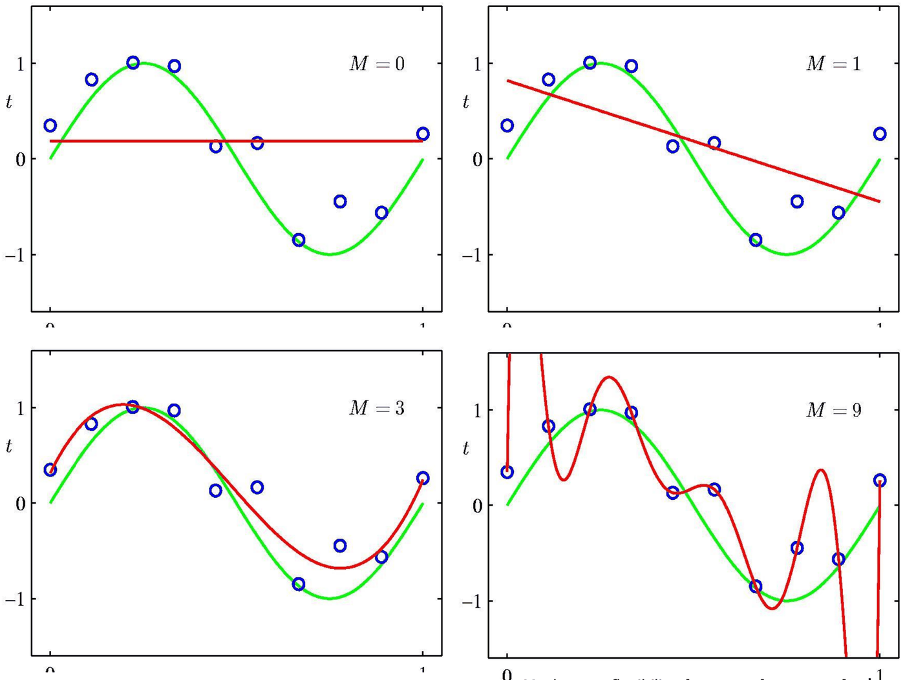
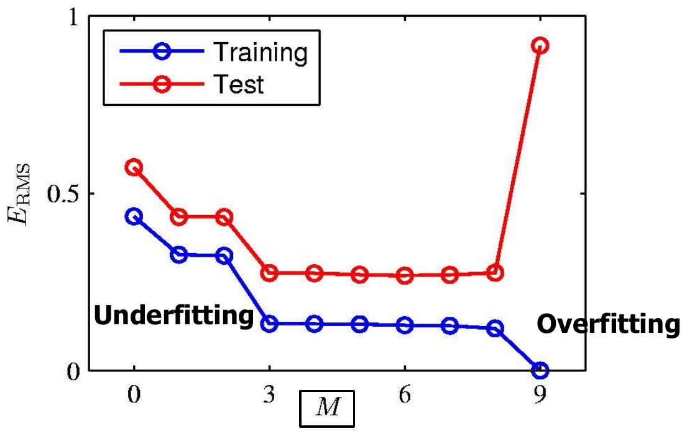
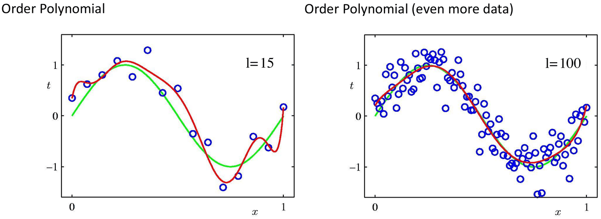
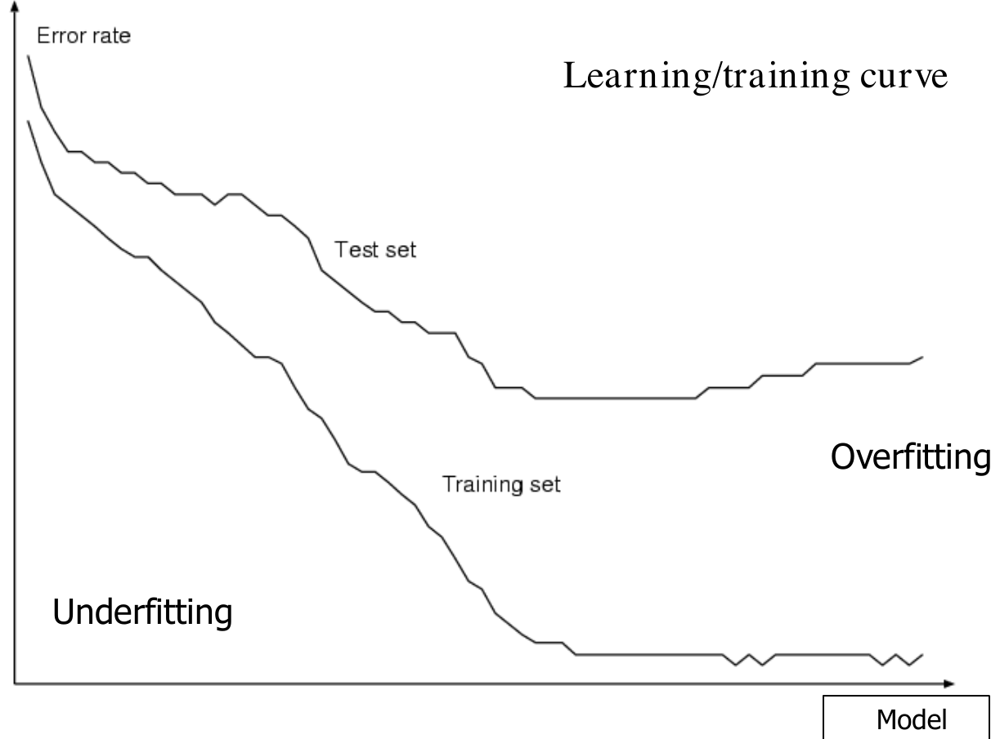
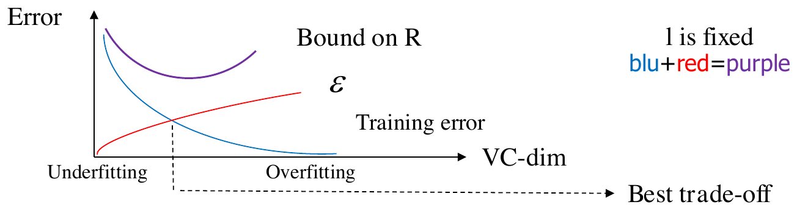
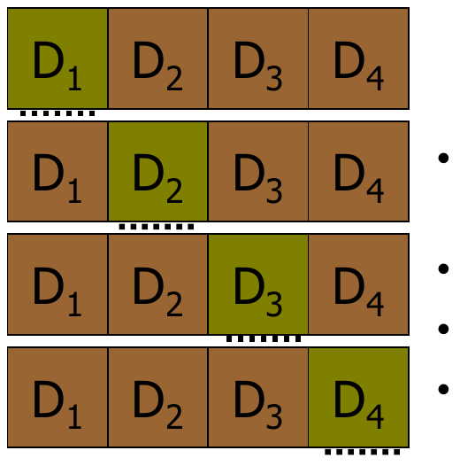
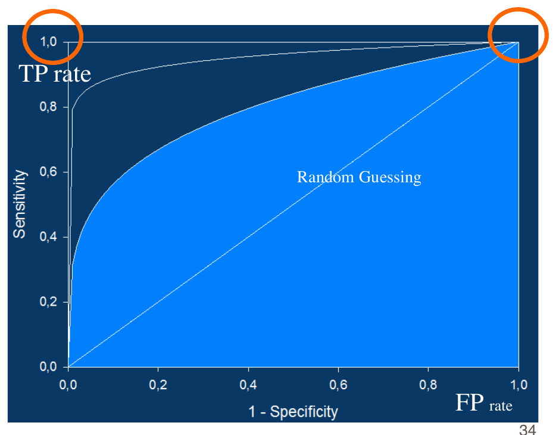
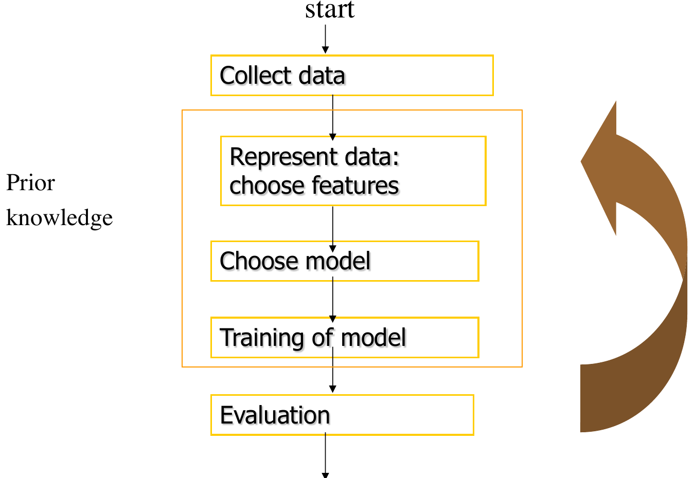

# Generalizzazione e validazione (introduzione)

*Appunti di Fabio Piscitelli — Machine Learning (654AA), Prof. Alessio Micheli, Università di Pisa, a.a. 2026/27*

La quarta lezione conclude l'introduzione al ML affrontando il tema centrale del corso: la **generalizzazione**. Attraverso un esempio concreto (il fitting di polinomi) si vedono i fenomeni di **underfitting** e **overfitting**, si dà una prima formalizzazione con la **Statistical Learning Theory** e la **VC-dimension**, e si introducono le tecniche di base di **validazione**, le misure di accuratezza per la classificazione e il ciclo di progettazione di un sistema di ML.

## Il ML in breve

Riepiloghiamo gli ingredienti visti nelle lezioni precedenti:

- **Dati**: l'esperienza disponibile, rappresentata come vettori, strutture, ecc.
- **Task**: supervisionato (classificazione, regressione), non supervisionato, ... Ad esempio, dati esempi etichettati, trovare una buona approssimazione della $f$ sconosciuta.
- **Modello**: descrive le relazioni tra i dati e definisce la classe di funzioni che la macchina può implementare (lo spazio delle ipotesi).
- **Algoritmo di apprendimento**: dati task e modello, esegue una ricerca (euristica) nello spazio delle ipotesi valide sui dati, adattando i parametri liberi del modello.
- **Validazione**: valuta la capacità di generalizzazione dell'ipotesi trovata.

Il messaggio di fondo resta: *facile usare strumenti di ML* contro *uso corretto e consapevole del ML*.

## I problemi fondamentali del ML

### Un problema mal posto

Inferire funzioni generali da dati noti è un **problema mal posto**: in linea di principio la soluzione non è unica, e con dati finiti non possiamo aspettarci di trovare la soluzione esatta. Per questo si lavora con uno **spazio delle ipotesi ristretto** (ricordiamo il bias induttivo). Due domande guidano lo studio dei modelli:

- **Cosa possiamo rappresentare?** (se una funzione non è rappresentabile, non può nemmeno essere appresa);
- **Cosa possiamo apprendere?** (domanda secondaria rispetto alla prima).

### Generalizzazione e overfitting

Distinguiamo la **fase di apprendimento**, in cui si costruisce il modello (incluso il training), dalla **fase di predizione**, in cui si valuta la funzione appresa su campioni nuovi (la capacità di generalizzazione).

> [!definition] Ipotesi dell'apprendimento induttivo
>
> *Qualsiasi ipotesi $h$ che approssima bene $f$ sugli esempi di training approssimerà bene $f$ anche su istanze nuove, mai viste.*

Il punto interrogativo che il professore mette accanto a questa ipotesi è voluto: **non è sempre vera**, ed è proprio qui che nasce l'overfitting.

> [!definition] Overfitting
>
> Un learner fa **overfitting** sui dati se restituisce un'ipotesi $h \in H$ con errore vero (di generalizzazione, *rischio*) $R$ ed errore empirico (di training) $E$, quando esiste un'altra $h' \in H$ con
> $$
> E' > E \qquad \text{ma} \qquad R' < R.
> $$
> In altre parole, $h'$ si adatta *peggio* ai dati di training ma è *migliore* sui dati nuovi.

L'aspetto critico diventa quindi la **stima dell'accuratezza**, che si può affrontare in modo **teorico** (Statistical Learning Theory) o **empirico** (errore su training e test, tecniche di cross-validation).

---

## Un caso di studio: il fitting polinomiale

Per vedere concretamente il ruolo della complessità del modello si usa un esempio di regressione con un modello parametrico: lo spazio delle ipotesi sono i **polinomi di grado $M$**,
$$
h_\mathbf{w}(x) = w_0 + w_1 x + w_2 x^2 + \dots + w_M x^M = \sum_{j=0}^{M} w_j x^j.
$$
La complessità dell'ipotesi cresce con il grado $M$; $l$ è il numero di esempi.

> [!warning] Esempio artificiale
>
> È un task semplificato e irrealistico: una sola variabile di input, e conosciamo in anticipo la funzione target. Serve solo a visualizzare i concetti.

La funzione target è $\sin(2\pi x)$ a cui si aggiunge **rumore gaussiano**: per questo i campioni non stanno esattamente sulla curva verde "vera".

![Curva verde del seno su [0,1] e dieci campioni blu rumorosi, vicini ma non esattamente sulla curva|380](assets/04-l4_target-seno.png)
*Fig. 4.1 — La funzione target $\sin(2\pi x)$ (in verde) e i campioni rumorosi di training (in blu).*

Per trovare i parametri migliori si minimizza la **somma degli errori quadratici**:
$$
E(\mathbf{w}) = \sum_{p=1}^{l} \big(y_p - h_\mathbf{w}(x_p)\big)^2,
$$
dove $p$ indica l'esempio, $y_p$ il suo target, $h_\mathbf{w}(x_p)$ l'uscita del modello nel punto $x_p$ (qui $x$ è una sola variabile, $n = 1$).

### Effetto del grado del polinomio

*Fig. 4.2 — Fitting con polinomi di grado $M = 0, 1, 3, 9$ (in rosso) rispetto alla funzione vera (in verde).*

- **$M = 0$** (costante) e **$M = 1$** (retta): il modello è **troppo semplice** rispetto alla funzione target e non riesce a coglierne l'andamento. È l'**underfitting**.
- **$M = 3$**: più flessibilità è utile, e la curva approssima bene il seno.
- **$M = 9$**: con 10 punti e 10 parametri il polinomio passa **esattamente** per tutti i dati: $E(\mathbf{w}) = 0$ sul training! Ma la curva oscilla violentemente tra i punti e rappresenta malissimo la funzione vera: il modello è troppo complesso e **impara anche il rumore**. È l'**overfitting**. E l'errore sul test set?

### Errore di training e di test al variare di $M$

Per confrontare i modelli si usa il **Root-Mean-Square error**, $E_{RMS} = \sqrt{2E(\mathbf{w}^*)/l}$, dove $E(\mathbf{w}^*)$ è l'errore del modello addestrato. La divisione per $l$ permette di confrontare dataset di dimensione diversa, e la radice riporta l'errore sulla stessa scala del target.

*Fig. 4.3 — Errore RMS di training e di test al variare del grado $M$: zona di underfitting a sinistra, di overfitting a destra.*

L'errore di training **decresce sempre** all'aumentare di $M$, perché un modello più flessibile può adattarsi meglio ai dati. L'errore di test invece prima decresce, poi resta stabile e infine **esplode** per $M = 9$: è la firma dell'overfitting.

Anche i **coefficienti** ottimi $\mathbf{w}^*$ sono rivelatori:

| | $M=0$ | $M=1$ | $M=3$ | $M=9$ |
|---|---|---|---|---|
| $w_0^*$ | 0,19 | 0,82 | 0,31 | 0,35 |
| $w_1^*$ | | −1,27 | 7,99 | 232,37 |
| $w_2^*$ | | | −25,43 | −5321,83 |
| $w_3^*$ | | | 17,37 | 48568,31 |
| $w_4^*$ | | | | −231639,30 |
| $w_5^*$ | | | | 640042,26 |
| $w_6^*$ | | | | −1061800,52 |
| $w_7^*$ | | | | 1042400,18 |
| $w_8^*$ | | | | −557682,99 |
| $w_9^*$ | | | | 125201,43 |

> [!tip] Pesi enormi = overfitting
>
> Nel polinomio di grado 9 i coefficienti diventano **enormi** e di segno alterno: si compensano a vicenda per far passare la curva esattamente per ogni punto, producendo oscillazioni fortissime. Questa osservazione è alla base della **regolarizzazione** (che vedremo con i modelli lineari e le reti neurali): penalizzare pesi grandi è un modo per controllare la complessità.

### Effetto della quantità di dati

Cosa succede se, a parità di modello ($M = 9$), aumentiamo i dati?

*Fig. 4.4 — Polinomio di grado 9 con $l = 15$ e $l = 100$ esempi: con più dati l'overfitting si riduce.*

Con 15 esempi il polinomio di grado 9 oscilla ancora, ma molto meno; con 100 esempi segue quasi perfettamente il seno. **Con più dati si possono usare modelli più complessi** senza cadere nell'overfitting.

> [!abstract] Cosa abbiamo imparato
>
> La capacità di generalizzazione (misurata come rischio o errore di test) va studiata in relazione a:
> - l'**errore di training** e le zone di underfitting e overfitting;
> - la **complessità del modello**;
> - il **numero di dati**.
>
> La **Statistical Learning Theory** è la teoria generale che lega questi tre elementi.

---

## Verso la Statistical Learning Theory

### Il setting formale (semplificato)

Vogliamo approssimare una funzione sconosciuta $f(\mathbf{x})$, dove il target è $d = f(\mathbf{x}) + \text{rumore}$.

Idealmente vorremmo minimizzare la **funzione di rischio** (errore vero), calcolata su **tutti** i dati possibili:
$$
R = \int L\big(d, h(\mathbf{x})\big)\, dP(\mathbf{x}, d),
$$
dove $P(\mathbf{x}, d)$ è la distribuzione di probabilità (sconosciuta) dei dati e $L$ è una loss, ad esempio $L(h(\mathbf{x}), d) = (d - h(\mathbf{x}))^2$. Si cerca quindi $h \in H$ che minimizzi $R$.

Ma abbiamo solo un dataset finito $TR = \{(\mathbf{x}_p, d_p)\}_{p=1}^{l}$. Allora si minimizza il **rischio empirico** (errore di training), trovando i valori migliori dei parametri liberi:
$$
R_{emp}(h, TR) = \frac{1}{l} \sum_{p=1}^{l} \big(d_p - h(\mathbf{x}_p)\big)^2.
$$
Questo è il principio induttivo di **Empirical Risk Minimization** (ERM). La domanda cruciale è: **possiamo usare $R_{emp}$ per approssimare $R$?**

*Fig. 4.5 — Comportamento tipico dell'apprendimento al crescere della complessità del modello.*

### VC-dimension e bound sul rischio

La **VC-dimension** (Vapnik-Chervonenkis) è una misura della **complessità** di $H$, cioè della sua flessibilità nell'adattarsi ai dati (per modelli lineari o polinomi è legata al numero di parametri; sarà definita formalmente più avanti).

> [!theorem] VC-bound
>
> Con probabilità $1 - \delta$ vale:
> $$
> \underbrace{R}_{\text{rischio garantito}} \;\le\; R_{emp} + \underbrace{\varepsilon\left(\frac{1}{l}, VC, \frac{1}{\delta}\right)}_{\text{VC-confidence}}
> $$
> dove la **VC-confidence** $\varepsilon$ è una funzione che **cresce con la VC-dimension** e **decresce con il numero di dati $l$** (e con $\delta$).

Il parametro $\delta$ è la **confidenza**: regola la probabilità che il bound valga (ad esempio $\delta = 0{,}01$ significa che il bound vale con probabilità $0{,}99$).

Questo bound **spiega** underfitting e overfitting:

- **più dati** ($l$ alto) → VC-confidence più bassa, e il bound si avvicina a $R$: il rischio empirico diventa una buona stima di quello vero;
- **modello troppo semplice** (VC-dim bassa) → $\varepsilon$ piccolo, ma $R_{emp}$ alto: **underfitting**;
- **modello troppo complesso** (VC-dim alta, $l$ fissato) → $R_{emp}$ basso, ma $\varepsilon$ cresce, e con esso il bound su $R$: **overfitting**.

*Fig. 4.6 — Structural Risk Minimization: il bound su $R$ (viola) è la somma dell'errore di training (blu) e della VC-confidence (rossa); il suo minimo è il miglior compromesso.*

> [!definition] Structural Risk Minimization (SRM)
>
> Invece di minimizzare solo $R_{emp}$, si **minimizza il bound**, cioè la somma di errore di training e VC-confidence. Questo formalizza il concetto di **controllo della complessità del modello**: un compromesso tra complessità (VC-dim) e accuratezza sul training (fitting).

Un esempio concreto di bound è
$$
R \le R_{emp} + \varepsilon\left(\frac{VC}{l}, -\frac{\ln\delta}{l}\right),
$$
e ne esistono diverse formulazioni per diverse classi di funzioni e task. In parole semplici: **si può approssimare bene $f$ dagli esempi purché si abbia un buon numero di dati e la complessità del modello sia adatta al problema**. Bisogna adattarsi ai dati il più possibile per evitare l'underfitting (alto $R_{emp}$), ma non troppo, per evitare l'overfitting (dovuto alla crescita della VC-confidence).

> [!note] Oltre il compromesso classico
>
> Fenomeni più recenti come la **double descent**, la sovra-parametrizzazione e il *benign overfitting* (tipici delle reti profonde) sembrano sfidare questa visione e verranno discussi più avanti nel corso.

### Perché la SLT è importante

La SLT permette di inquadrare formalmente il problema della generalizzazione e dell'overfitting, fornendo **upper bound analitici** al rischio $R$ indipendentemente dal tipo di algoritmo o dai dettagli del modello. Mostra che il ML è **ben fondato**: il rischio si può limitare analiticamente, e pochi concetti sono fondamentali. Ha inoltre portato a nuovi modelli (le **SVM**) che considerano direttamente il controllo della complessità, e spiega la differenza principale tra il ML e i metodi di ottimizzazione puri (che forniscono le tecniche per fare *fitting*): nel ML l'obiettivo non è minimizzare l'errore sui dati, ma sui dati *futuri*.

Restano aperte domande pratiche: come misurare la complessità? Come trovare il miglior compromesso tra fitting e complessità?

> [!question] Esercizi proposti dal professore
>
> - Perché un errore di training nullo non implica necessariamente una buona soluzione?
> - Collegare underfitting e overfitting all'interpretazione della disuguaglianza della SLT e all'esempio dei polinomi.
> - Guardando la definizione di overfitting, individuare $h$ e $h'$ sul grafico del bound SLT. *(Suggerimento: $h$ sta a destra del minimo, con $R_{emp}$ più basso ma bound più alto; $h'$ sta vicino al minimo.)*
> - Il rumore è la causa dell'overfitting, o lo è il compromesso di complessità? Si può avere overfitting anche con dati perfettamente puliti? *(Sì: anche senza rumore, un polinomio di grado molto alto interpolando pochi punti di una funzione liscia può oscillare molto tra un punto e l'altro; il problema è la complessità eccessiva rispetto ai dati disponibili.)*

---

## Validazione

La valutazione delle prestazioni di un sistema di ML è la valutazione della sua **accuratezza predittiva**. Attenzione: **le prestazioni sui dati di training danno una valutazione troppo ottimistica**. Da qui il mantra "validazione, validazione, validazione". Qui si dà un'introduzione; la validazione sarà ripresa in lezioni dedicate.

### I due obiettivi della validazione

> [!definition] Model selection e model assessment
>
> - **Model selection**: stimare le prestazioni (errore di generalizzazione) di **diversi modelli** per scegliere il migliore. Include la ricerca dei migliori **iperparametri** (es. il grado del polinomio). *Restituisce un modello.*
> - **Model assessment**: scelto il modello finale, stimarne l'errore di predizione (rischio) su **nuovi dati di test**, come misura della qualità del modello scelto. *Restituisce una stima.*

> [!warning] Regola d'oro
>
> Tenere **separati gli obiettivi** e usare **insiemi di dati separati** per ciascuno. Se il test set viene usato per scegliere il modello, la stima finale non è più affidabile (è ottimistica).

Nel mondo ideale avremmo un grande training set (per trovare l'ipotesi migliore), un grande validation set per la model selection e un test set esterno molto grande. Con dataset finiti, spesso piccoli, si può solo **stimare** la generalizzazione.

### Hold-out

Nella tecnica di base, **hold-out**, il dataset $D$ viene partizionato in tre insiemi **disgiunti**:

- **Training set (TR)**: usato per eseguire l'algoritmo di apprendimento;
- **Validation set (VL)** o *selection set*: usato per scegliere il modello migliore (es. tuning degli iperparametri);
- **Test set (TS)**: usato **solo** per la model assessment, mai per scegliere o regolare $h$.

TR e VL insieme formano il **development/design set**; il test set (ad esempio il 25–30% dei dati) viene tenuto da parte.

*Fig. 4.7 — Ruolo di TR, VL e TS: sviluppo del modello lato sviluppatore, uso in inferenza lato cliente.*

### K-fold cross-validation (anticipazione)

L'hold-out può sfruttare male i dati, soprattutto se sono pochi. Nella **K-fold cross-validation**:

1. si divide $D$ in $k$ sottoinsiemi mutuamente esclusivi $D_1, \dots, D_k$;
2. per ogni $i$ si addestra su $D \setminus D_i$ e si valuta su $D_i$;
3. si combinano i $k$ risultati.

*Fig. 4.8 — 4-fold cross-validation: a turno ogni fold fa da insieme di validazione.*

Così tutti i dati vengono usati sia per l'addestramento sia per la validazione (o il test). Si può applicare sia per lo split di validazione sia per quello di test. Le questioni aperte sono quante fold usare (3, 5, 10, fino a *leave-one-out*), il costo computazionale spesso elevato e la combinazione con altri schemi (validation set, doppia K-fold). Sarà ripresa in dettaglio più avanti.

---

## Accuratezza nella classificazione

### Matrice di confusione

Per un classificatore binario si confrontano classe reale e classe predetta:

| Reale \ Predetto | Positivo | Negativo |
|---|---|---|
| **Positivo** | TP (veri positivi) | FN (falsi negativi) |
| **Negativo** | FP (falsi positivi) | TN (veri negativi) |

Da cui:

- **Accuratezza** $= \dfrac{TP + TN}{\text{totale}}$: percentuale di pattern classificati correttamente;
- **Sensibilità** (*True Positive rate*, *Recall*) $= \dfrac{TP}{TP + FN}$: quanti positivi veri vengono riconosciuti;
- **Specificità** (*True Negative rate*) $= \dfrac{TN}{FP + TN} = 1 - FPR$: quanti negativi veri vengono riconosciuti;
- **Precisione** $= \dfrac{TP}{TP + FP}$: quanti dei predetti positivi sono davvero positivi.

Un falso positivo equivale a un **falso allarme**.

> [!warning] Attenzione all'accuratezza
>
> - Per la classificazione binaria, un'accuratezza del 50% è quella di un predittore **casuale** (lancio di una moneta).
> - Con **dati sbilanciati** (es. 99% di positivi) esiste un classificatore banale che risponde sempre "positivo" e ha il 99% di accuratezza senza aver imparato nulla. In questi casi l'accuratezza da sola è fuorviante.

### Curva ROC

La **curva ROC** mostra il *True Positive rate* (sensibilità) in funzione del *False Positive rate* ($1 -$ specificità) al variare della soglia di decisione del classificatore.

*Fig. 4.9 — Curva ROC: la diagonale corrisponde al classificatore casuale; curve migliori hanno un'area sottesa (AUC) maggiore.*

La **diagonale** corrisponde al classificatore peggiore (casuale). Le curve migliori salgono rapidamente verso l'angolo in alto a sinistra (TPR alto con FPR basso) e hanno un'**AUC** (*Area Under the Curve*) più alta: il classificatore ideale ha AUC $= 1$, quello casuale $0{,}5$.

---

## Il ciclo di progettazione

*Fig. 4.10 — Il ciclo di progettazione di un sistema di ML: un processo iterativo guidato dalla conoscenza a priori.*

1. **Raccolta dei dati**: selezione, integrazione, pulizia. Serve un insieme di esempi abbastanza **grande e rappresentativo** per training e test.
2. **Rappresentazione dei dati**: dipende dal dominio e sfrutta la conoscenza a priori dell'esperto; comprende feature selection, rilevamento degli outlier, scalatura delle variabili, gestione dei dati mancanti. **Spesso è la fase più critica** per il successo complessivo.
3. **Scelta del modello**: formulazione del problema e delle ipotesi. Bisogna conoscere i **limiti di applicabilità** del modello e controllarne la complessità.
4. **Costruzione del modello** (il cuore del ML): tramite l'algoritmo di apprendimento sui dati di training.
5. **Valutazione**: la prestazione è l'**accuratezza predittiva**; si aggiungono l'interpretazione dei risultati, la spiegazione dei dati e l'estrazione di conoscenza.
6. **Deployment**.

Il ciclo è iterativo: i risultati della valutazione possono richiedere di tornare alle fasi precedenti.

## Errori di interpretazione

Per ogni modello statistico (inclusi Data Mining e ML):

- si assume (spesso) una **causalità** e serve un insieme di dati **rappresentativo** del fenomeno. Il ML non funziona con variabili scorrelate o fenomeni casuali (lotterie); input non informativi portano a modelli e risultati scadenti;
- **la causalità non si può inferire dalla sola analisi dei dati**: in Florida le persone sono in media più anziane che negli altri stati USA, ma non è il clima a farle vivere più a lungo (ci si trasferisce lì da pensionati). La dipendenza statistica può avere ragioni esterne ai dati.

Specifico per il ML: **modelli potenti aumentano il rischio**, perché si adattano anche a dati "spazzatura"; e risultati **non validati bene** possono portare a predizioni e interpretazioni fuorvianti.

> [!abstract] Sintesi
>
> La generalizzazione dipende dal compromesso tra **complessità del modello** e **quantità di dati**. Modelli troppo semplici fanno **underfitting**, troppo complessi fanno **overfitting** (errore di training basso, di test alto). La SLT formalizza tutto con il **VC-bound** $R \le R_{emp} + \varepsilon(1/l, VC, 1/\delta)$ e suggerisce la **Structural Risk Minimization**. In pratica la generalizzazione si stima con la **validazione**: *model selection* (su VL) e *model assessment* (su TS), sempre su dati separati.

> [!question] Possibili domande d'esame
>
> - Definire formalmente l'overfitting.
> - Descrivere l'esempio del fitting polinomiale: cosa succede al variare di $M$ e di $l$?
> - Scrivere il VC-bound e spiegare come giustifica underfitting e overfitting.
> - Differenza tra rischio $R$ e rischio empirico $R_{emp}$; cos'è il principio ERM?
> - Differenza tra model selection e model assessment; perché servono insiemi separati?
> - Definire accuratezza, sensibilità, specificità, precisione; cos'è la curva ROC?
