# Modelli lineari e K-nearest neighbors

*Appunti di Fabio Piscitelli — Machine Learning (654AA), Prof. Alessio Micheli, Università di Pisa, a.a. 2026/27*

Dopo l'introduzione si passa ai primi modelli veri e propri, che occupano due estremi opposti del panorama del ML. Da una parte i **modelli lineari**: rigidi, con pochi parametri, fondati sulla matematica classica ma già ricchi di concetti moderni (funzione di loss, discesa del gradiente, regolarizzazione). Dall'altra il **K-nearest neighbors**: estremamente flessibile, locale, senza un vero modello da addestrare. Il confronto tra i due mostra concretamente il compromesso tra flessibilità e controllo della complessità.

Con i modelli lineari si passa da uno spazio delle ipotesi discreto (concept learning) a uno **continuo**, ancora ristretto ma parametrizzato da numeri reali.

## Notazione sui dati

I dati sono organizzati in una matrice $X$ di dimensione $l \times n$: $l$ righe (i pattern, $p = 1,\dots,l$) e $n$ colonne (le feature, $i = 1,\dots,n$).

- $\mathbf{x}$ (in grassetto) è un generico pattern, cioè una riga della tabella: esempio, istanza, campione, vettore di input;
- $x_i$ o $x_j$ (scalare) è la componente $i$ o $j$ di un pattern $\mathbf{x}$ (omettendo l'indice del pattern);
- $\mathbf{x}_p$ è il $p$-esimo pattern (riga);
- $x_{p,i}$, scritto anche $(\mathbf{x}_p)_i$, è la componente $i$ del pattern $p$;
- per il target si usa $y_p$ (o $d_p$, $t_p$), con $p = 1,\dots,l$.

Quando il contesto è chiaro alcuni indici vengono omessi.

---

## Modelli lineari

Il modello lineare è stato il pilastro della statistica. Come scrive Hastie: *"nonostante i grandi progressi delle moderne tecniche di regressione non parametrica, i modelli lineari restano importanti, e dobbiamo capirli bene"*. Si parte dalla forma più semplice, lineare nelle variabili di input. Il modello lineare è anche una **baseline** naturale: la prima domanda davanti a un problema è "è un problema lineare?".

### Regressione lineare univariata

Riprendiamo l'esercizio dell'introduzione: dati i punti $(1;\,2{,}1)$, $(2;\,3{,}9)$, $(3;\,6{,}1)$, $(4;\,8{,}4)$, $(5;\,9{,}8)$ avevamo "indovinato" $h(x) = 2x$. Ora vogliamo trovare i parametri in modo **sistematico**.

Nel caso univariato (una variabile di input $x$, una di output $y$) si assume il modello
$$
h_\mathbf{w}(x) = w_1 x + w_0,
$$
dove $w_0, w_1$ sono coefficienti reali detti **pesi** (*weights*) o parametri liberi. Si tratta di adattare ai dati una retta. Lo spazio delle ipotesi è infinito (i $\mathbf{w}$ sono continui), ma la matematica classica fornisce una soluzione elegante che risale a Gauss e Legendre (circa 1795). Sorprendentemente, con questo strumento di base si può già "apprendere", e contiene molti concetti rilevanti del ML moderno.

#### Apprendimento tramite Least Mean Squares

Addestrare significa trovare $\mathbf{w}$ che **minimizza l'errore empirico** sui dati di training: per ora ci concentriamo solo su $R_{emp}$ (il controllo della complessità verrà dopo). Dato un insieme di $l$ esempi $(x_p, y_p)$, cerchiamo $h_\mathbf{w}(x) = w_1 x + w_0$ che minimizza la **somma dei quadrati dei residui**:
$$
\text{Loss}(h_\mathbf{w}) = E(\mathbf{w}) = \sum_{p=1}^{l} \big(y_p - h_\mathbf{w}(x_p)\big)^2 = \sum_{p=1}^{l} \big(y_p - (w_1 x_p + w_0)\big)^2.
$$
Per avere la media si divide per $l$. È il metodo dei **minimi quadrati** (*Least (Mean) Squares*, LMS), cioè $\arg\min_\mathbf{w} E(\mathbf{w})$ in norma $L^2$.

> [!tip] Perché i minimi quadrati?
>
> Ogni retta candidata produce dei **residui**, cioè le distanze verticali tra i punti $(x_p, y_p)$ e la retta. Rette diverse hanno residui diversi: minimizzare la somma dei loro quadrati è un modo naturale di trovare la retta che meglio approssima i dati. In generale, i minimi quadrati sono l'approccio standard per risolvere in modo approssimato i **sistemi sovradeterminati**, cioè con più equazioni (gli esempi) che incognite (i parametri).

#### Come si risolve

Un minimo locale è un **punto stazionario**, dove il gradiente è nullo:
$$
\frac{\partial E(\mathbf{w})}{\partial w_i} = 0, \qquad i = 1, \dots, n+1.
$$
Nel caso semplice con due parametri si cercano $w_0, w_1$ tali che $\frac{\partial E}{\partial w_0} = 0$ e $\frac{\partial E}{\partial w_1} = 0$. Poiché la loss è **convessa** (una parabola in due dimensioni), non ci sono minimi locali spuri e la soluzione esiste in forma chiusa:
$$
w_1 = \frac{\sum_p x_p y_p - \frac{1}{l}\sum_p x_p \sum_p y_p}{\sum_p x_p^2 - \frac{1}{l}\left(\sum_p x_p\right)^2} = \frac{\operatorname{Cov}[x,y]}{\operatorname{Var}[x]}, \qquad w_0 = \bar{y} - w_1 \bar{x},
$$
dove $\bar{x} = \frac{1}{l}\sum_p x_p$ e $\bar{y} = \frac{1}{l}\sum_p y_p$ sono le medie.

#### Calcolo del gradiente per un pattern

Per un singolo pattern $(x, y)$, usando le regole di derivazione ($\frac{\partial k}{\partial w} = 0$, $\frac{\partial w}{\partial w} = 1$, $\frac{\partial f(w)^2}{\partial w} = 2 f(w) \frac{\partial f(w)}{\partial w}$, e "la derivata della somma è la somma delle derivate"):
$$
\frac{\partial E(\mathbf{w})}{\partial w_i} = \frac{\partial (y - h_\mathbf{w}(x))^2}{\partial w_i} = 2\big(y - h_\mathbf{w}(x)\big) \frac{\partial \big(y - (w_1 x + w_0)\big)}{\partial w_i},
$$
da cui
$$
\frac{\partial E(\mathbf{w})}{\partial w_0} = -2\big(y - h_\mathbf{w}(x)\big), \qquad \frac{\partial E(\mathbf{w})}{\partial w_1} = -2\big(y - h_\mathbf{w}(x)\big)\, x.
$$
La quantità $\delta = y - h(x)$, l'errore sul pattern, verrà chiamata **delta**. Per $l$ pattern basta sommare; poi si estende a input multidimensionali.

> [!example] Esercizio svolto
>
> Con i dati $(1;2{,}1), (2;3{,}9), (3;6{,}1), (4;8{,}4), (5;9{,}8)$: $\bar x = 3$, $\bar y = 6{,}06$; $\sum x_p y_p = 2{,}1 + 7{,}8 + 18{,}3 + 33{,}6 + 49 = 110{,}8$; $\sum x_p^2 = 55$. Quindi $w_1 = \frac{110{,}8 - 5 \cdot 3 \cdot 6{,}06}{55 - 45} = \frac{110{,}8 - 90{,}9}{10} = 1{,}99$ e $w_0 = 6{,}06 - 1{,}99 \cdot 3 = 0{,}09$. La retta trovata, $h(x) \approx 1{,}99x + 0{,}09$, conferma l'intuizione $h(x) = 2x$.

### Notazione per input multidimensionali

Con $\mathbf{x}$ e $\mathbf{w}$ vettori colonna, il modello lineare è
$$
\mathbf{w}^T\mathbf{x} + w_0 = w_0 + w_1 x_1 + w_2 x_2 + \dots + w_n x_n = w_0 + \sum_{i=1}^{n} w_i x_i.
$$
$w_0$ si chiama **intercetta**, soglia, **bias** o offset. Conviene includere una componente costante $x_0 = 1$ nell'input, così che
$$
\mathbf{x}^T = [1, x_1, \dots, x_n], \qquad \mathbf{w}^T = [w_0, w_1, \dots, w_n], \qquad h(\mathbf{x}_p) = \mathbf{x}_p^T\mathbf{w} = \sum_{i=0}^{n} x_{p,i} w_i.
$$
Il modello lineare è quindi semplicemente un **prodotto scalare** tra input e pesi. (Nelle reti neurali la trasposta viene spesso omessa.)

---

## Classificazione con modelli lineari

### Il problema

Consideriamo 200 punti in $\mathbb{R}^2$, generati da una distribuzione sconosciuta, 100 per ciascuna di due classi. Possiamo costruire una regola che predica il colore di punti futuri? I dati potrebbero essere generati da una gaussiana per classe (con medie diverse), oppure da una miscela di tante gaussiane a bassa varianza.

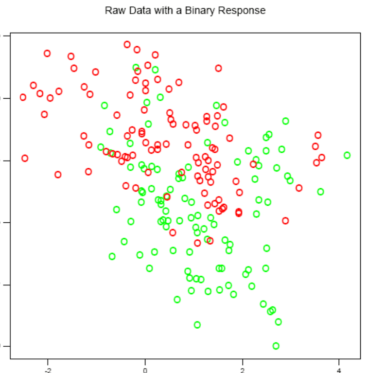
*Fig. 5.1 — Il problema di esempio (Hastie-Tibshirani-Friedman): 200 punti di due classi.*

### Iperpiani e regioni di decisione

Gli stessi modelli usati per la regressione possono essere usati per la **classificazione**, con target categorici ($0/1$ o $-1/+1$). L'espressione $\mathbf{w}^T\mathbf{x}$ definisce un **iperpiano**; si sfrutta il fatto che $\mathbf{w}^T\mathbf{x}$ assume valori positivi da un lato e negativi dall'altro per decidere a quale classe appartiene un punto. L'obiettivo è trovare, tramite l'apprendimento, un $\mathbf{w}$ che dia una buona accuratezza.

In due dimensioni, $\mathbf{w}^T\mathbf{x} = w_0 + w_1 x_1 + w_2 x_2 = 0$ è una retta: il **confine di decisione** (*decision boundary*).

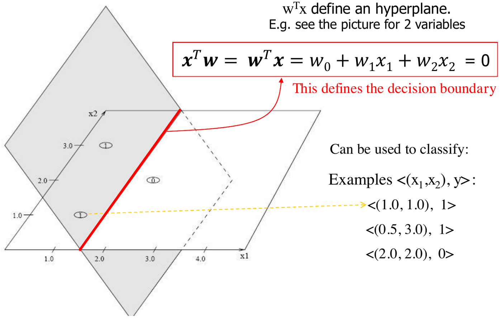
*Fig. 5.2 — L'iperpiano $\mathbf{w}^T\mathbf{x}$ e la sua intersezione con il piano degli input: il confine di decisione.*

Per ottenere un classificatore si applica una **funzione soglia**:
$$
h(\mathbf{x}) = \begin{cases} 1 & \text{se } \mathbf{w}^T\mathbf{x} + w_0 \ge 0 \\ 0 & \text{altrimenti} \end{cases} \quad \text{(output in } [0,1]\text{)}, \qquad h(\mathbf{x}) = \operatorname{sign}(\mathbf{w}^T\mathbf{x} + w_0) \quad \text{(output in } [-1,+1]\text{)}.
$$
Includendo $w_0$ in $\mathbf{w}$: $h(\mathbf{x}_p) = \operatorname{sign}(\mathbf{x}_p^T\mathbf{w}) = \operatorname{sign}\left(\sum_{i=0}^{n} x_{p,i} w_i\right)$. È la **Linear Threshold Unit** (LTU).

> [!note] Il bias come soglia
>
> Dire $\mathbf{w}^T\mathbf{x} + w_0 \ge 0$ equivale a dire $\mathbf{w}^T\mathbf{x} \ge -w_0$. Le due forme individuano la stessa regione positiva, ma la seconda mette in evidenza il ruolo del bias: $-w_0$ è il **valore di soglia** che la combinazione pesata degli input deve superare per "attivare" l'uscita $+1$.

### Usare il modello: due esempi

> [!example] Terremoti o esplosioni nucleari? (AIMA)
>
> Dati sismici (1982–1990, Asia): $x_1$ è la magnitudo delle onde di volume, $x_2$ quella delle onde di superficie. Un algoritmo di apprendimento trova il confine $-4{,}9 + 1{,}7x_1 - x_2 = 0$. Per classificare un nuovo evento $(6, 3)$:
> $$
> h(6,3) = \operatorname{sign}(-4{,}9 + 1{,}7 \cdot 6 - 1 \cdot 3) = \operatorname{sign}(2{,}3) = +1 \;\Rightarrow\; \text{esplosione nucleare.}
> $$
> (Ottenere nuovi esempi di training, in questo caso, è decisamente costoso.)

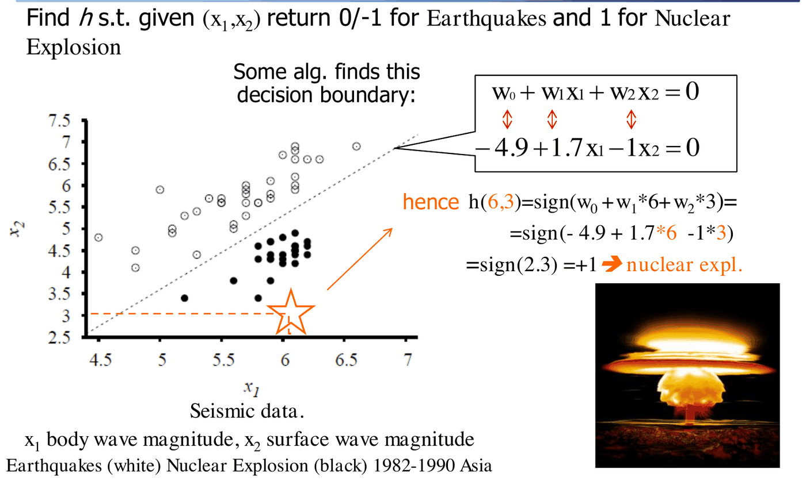
*Fig. 5.3 — Classificazione di dati sismici con un confine di decisione lineare.*

> [!example] Filtro antispam
>
> Si vuole $h(\text{mail}) = +1$ per lo spam e $-1$ altrimenti. Le feature $\phi_k(\text{mail})$ sono ad esempio la presenza ($0/1$) di parole o frasi ("free money") o la lunghezza (intero): è la rappresentazione *bag of words*. Ogni peso $w_k$ esprime il contributo della feature alla predizione: positivo per "free money", negativo per ".edu" o "unipi". La classificazione è $h_\mathbf{w}(\mathbf{x}) = \operatorname{sign}\left(\sum_k w_k \phi_k(\mathbf{x})\right)$: se la combinazione pesata è positiva, è spam.

### Proprietà utili dell'iperpiano

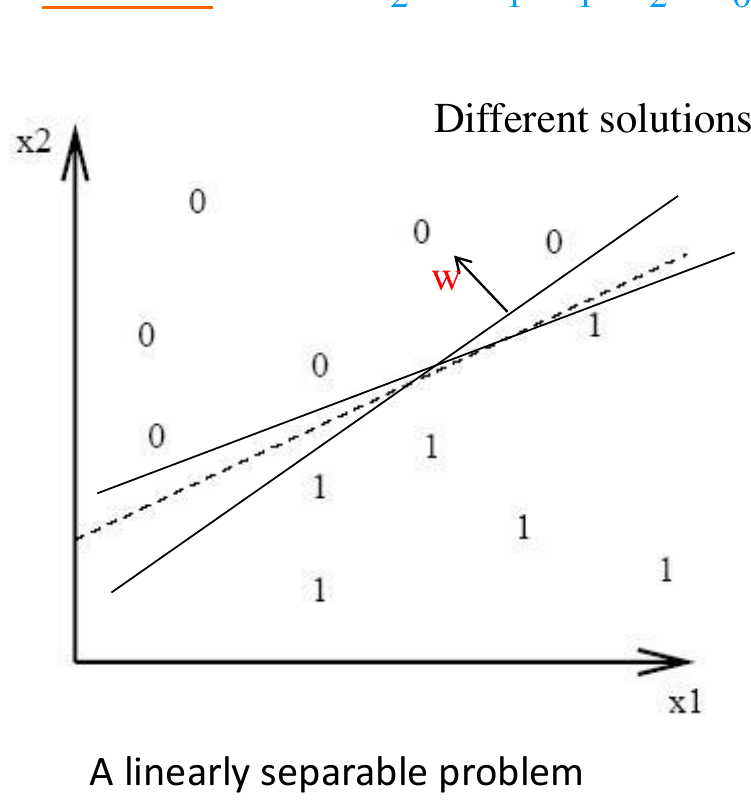
*Fig. 5.4 — Un problema linearmente separabile ammette molti iperpiani separatori; $\mathbf{w}$ è ortogonale all'iperpiano.*

- Se $w_0 = 0$ la retta passa per l'**origine**.
- Se $n > 2$ il confine è un **iperpiano**.
- **Libertà di scala**: moltiplicando $\mathbf{w}$ per una costante $K$ il confine non cambia.
- **$\mathbf{w}$ è ortogonale all'iperpiano**: presi due punti $\mathbf{x}_a, \mathbf{x}_b$ sull'iperpiano, $\mathbf{w}^T\mathbf{x}_a + w_0 = 0$ e $\mathbf{w}^T\mathbf{x}_b + w_0 = 0$; sottraendo si ha $\mathbf{w}^T(\mathbf{x}_a - \mathbf{x}_b) = 0$, cioè $\mathbf{w}$ è ortogonale a ogni vettore che giace sull'iperpiano.
- Se esiste un iperpiano separatore, **ne esistono molti**, e quindi anche molti algoritmi per trovarli.

L'equazione della retta si può riscrivere come $x_2 = -x_1 \frac{w_1}{w_2} - \frac{w_0}{w_2}$: provare a disegnarla con valori diversi di $\mathbf{w}$ è un buon esercizio.

---

## Il problema di apprendimento

### Formulazione

Dati $l$ esempi $(\mathbf{x}_p, y_p)$ con $y_p \in \{0,1\}$ o $\{-1,+1\}$ e una loss $L$, si cerca $\mathbf{w}$ che minimizzi il rischio empirico
$$
R_{emp} = \frac{1}{l}\sum_{p=1}^{l} L\big(h(\mathbf{x}_p), y_p\big).
$$
Per la classificazione, usare direttamente la loss 0/1 su $\operatorname{sign}(\mathbf{w}^T\mathbf{x})$ rende il problema difficile: la funzione è **costante a tratti**, quindi il gradiente è zero quasi ovunque e non dà indicazioni su come muoversi, e si finisce in problemi combinatori.

### Sostituire la loss con una funzione liscia

L'idea è sostituire la loss 0/1 con una funzione **liscia e differenziabile**, come l'errore quadratico, applicata direttamente all'uscita lineare $\mathbf{w}^T\mathbf{x}$ (non a $h(\mathbf{x})$, che contiene il segno):
$$
E(\mathbf{w}) = \sum_{p=1}^{l}(y_p - \mathbf{x}_p^T\mathbf{w})^2 = \|\mathbf{y} - X\mathbf{w}\|^2.
$$

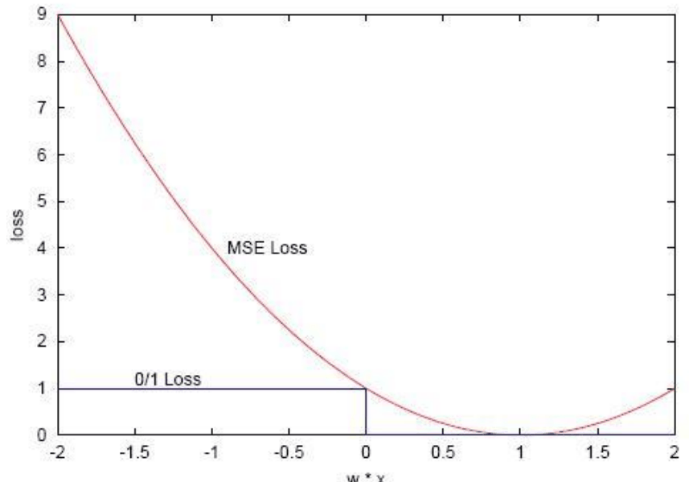
*Fig. 5.5 — Loss 0/1 e loss quadratica per un pattern con target $y = 1$: entrambe sono minimizzate nella zona $\mathbf{w}^T\mathbf{x} > 0$.*

Perché funziona? Con target $y_p = 1$, minimizzare $(1 - \mathbf{x}_p^T\mathbf{w})^2$ spinge $\mathbf{x}_p^T\mathbf{w}$ verso $1$, quindi positivo: niente errore di classificazione. Con $y_p = -1$ lo spinge verso $-1$. Entrambe le loss sono minimizzate nella stessa zona (a destra nel grafico). La funzione è **quadratica**, quindi un minimo esiste sempre (ma non è necessariamente unico). Lo stesso approccio vale identico per la regressione.

Si vedono ora due algoritmi di apprendimento, entrambi basati su LMS e validi sia per regressione sia per classificazione:

1. un **approccio diretto** basato sulle **equazioni normali**;
2. un **approccio iterativo** basato sulla **discesa del gradiente**.

### Approccio diretto: le equazioni normali

Derivando $E(\mathbf{w})$ rispetto alla componente $w_j$:
$$
\frac{\partial E(\mathbf{w})}{\partial w_j} = \sum_{p=1}^{l} 2(y_p - \mathbf{x}_p^T\mathbf{w}) \frac{\partial (y_p - \mathbf{x}_p^T\mathbf{w})}{\partial w_j}.
$$
Nel prodotto scalare $\mathbf{x}_p^T\mathbf{w} = x_{p,1}w_1 + x_{p,2}w_2 + \dots$ l'unico termine che dipende da $w_j$ è $x_{p,j}w_j$, la cui derivata è $x_{p,j}$. Quindi:
$$
\frac{\partial E(\mathbf{w})}{\partial w_j} = -2\sum_{p=1}^{l} (y_p - \mathbf{x}_p^T\mathbf{w})\, x_{p,j} = -2\sum_{p=1}^{l} \delta_p\, x_{p,j},
$$
dove $\delta_p = y_p - \mathbf{x}_p^T\mathbf{w}$ è l'errore sul pattern $p$. Questa forma tornerà nelle reti neurali.

Imponendo il gradiente nullo e passando in notazione matriciale si ottengono le **equazioni normali**:
$$
(X^T X)\,\mathbf{w} = X^T \mathbf{y}.
$$

> [!theorem] Soluzione ai minimi quadrati
>
> Se $X^TX$ è non singolare, la soluzione è unica:
> $$
> \mathbf{w} = (X^TX)^{-1}X^T\mathbf{y} = X^+\mathbf{y},
> $$
> dove $X^+$ è la **pseudoinversa di Moore-Penrose** (definita anche se $X$ non è invertibile). Altrimenti le soluzioni sono infinite, e si può scegliere quella a **norma minima** di $\mathbf{w}$.

In pratica si usa la **decomposizione ai valori singolari** (SVD): $X = U\Sigma V^T$ implica $X^+ = V\Sigma^+U^T$, dove $\Sigma^+$ si ottiene sostituendo ogni elemento diagonale non nullo con il suo reciproco. Applicando la SVD si calcola direttamente $\mathbf{w} = X^+\mathbf{y}$, ottenendo la soluzione a norma minima. **Questo è l'algoritmo di apprendimento** dell'approccio diretto; è implementato in tutte le librerie numeriche (Numerical Recipes, Armadillo, NumPy, R, Matlab...), con molte varianti per efficienza e stabilità.

### Approccio iterativo: la discesa del gradiente

Perché cercare altri approcci se esiste la soluzione diretta? Un approccio iterativo permette di ottenere:

- soluzioni **più efficienti** (quella diretta è cubica nella dimensione della matrice);
- **regolarizzazione** (per ridurre la complessità del modello);
- migliore approssimazione con dati rumorosi, fermando la ricerca **prima del minimo**;
- soprattutto, un metodo applicabile anche a **modelli non lineari**. È la base degli approcci fondamentali che vedremo (reti neurali).

#### L'idea

Il gradiente $\frac{\partial E}{\partial w_j} = -2\sum_p (y_p - \mathbf{x}_p^T\mathbf{w})\, x_{p,j}$ indica la direzione di **salita** dell'errore. Muovendosi nel verso opposto ($\Delta\mathbf{w} = -\nabla E(\mathbf{w})$) si scende verso il minimo. È una **ricerca locale**: si parte da un vettore di pesi iniziale e lo si modifica iterativamente per diminuire l'errore (*steepest descent*).

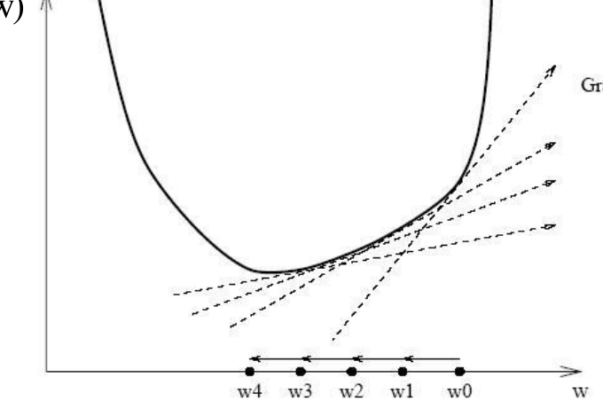
*Fig. 5.6 — Discesa del gradiente in una dimensione: a ogni passo il peso si sposta nel verso opposto alla pendenza.*

Con due pesi, la superficie d'errore $E([w_0, w_1]^T)$ è un **paraboloide** (funzione quadratica convessa), e il gradiente negativo è la nostra "bussola" per trovare il minimo.

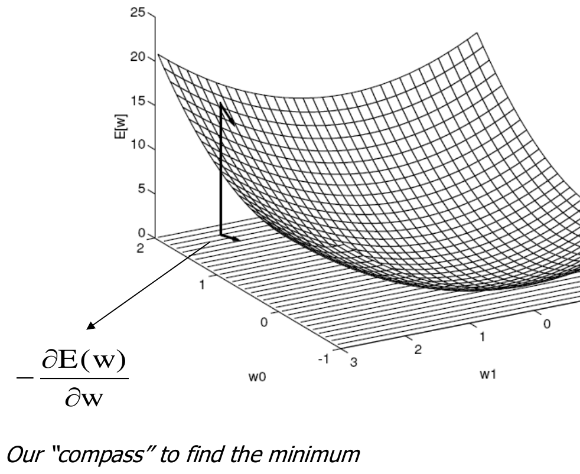
*Fig. 5.7 — La superficie d'errore di un modello lineare con due pesi: ogni punto del piano $(w_0, w_1)$ è un'ipotesi.*

In generale il vettore $\Delta\mathbf{w}$ ha una componente per ogni peso:
$$
\Delta\mathbf{w} = -\frac{\partial E(\mathbf{w})}{\partial \mathbf{w}} = \left( -\frac{\partial E}{\partial w_0}, -\frac{\partial E}{\partial w_1}, \dots, -\frac{\partial E}{\partial w_n} \right)^T,
$$
e si può lavorare in spazi multidimensionali senza bisogno di visualizzarli.

#### La regola di apprendimento (delta rule)

Ci si muove iterativamente con una **regola di apprendimento**:
$$
\mathbf{w}_{new} = \mathbf{w} + \eta\, \Delta\mathbf{w},
$$
dove $\eta$ (eta) è il **learning rate** (*step size*), che regola la velocità della discesa.

> [!abstract] Algoritmo di discesa del gradiente
>
> 1. Inizializzare $\mathbf{w}$ con valori piccoli; fissare $0 < \eta < 1$.
> 2. Calcolare $\Delta\mathbf{w} = -\frac{\partial E(\mathbf{w})}{\partial \mathbf{w}}$.
> 3. Aggiornare $\mathbf{w}_{new} = \mathbf{w} + \eta\,\Delta\mathbf{w}$.
> 4. Ripetere dal passo 2 fino a convergenza o finché $E(\mathbf{w})$ è "abbastanza piccolo".

Note:

- usare $\Delta\mathbf{w}/l$ corrisponde al *least mean squares* (dividere per $l$ sarà il caso standard);
- $\eta$ regola un compromesso **velocità/stabilità**; può essere ridotto gradualmente verso zero per garantire la convergenza evitando oscillazioni attorno al minimo (molte varianti verranno viste più avanti).

#### Batch e on-line

- **Versione batch**: il gradiente è la somma su **tutti** gli $l$ pattern, e i pesi si aggiornano dopo aver visto tutto il training set (un'**epoca**). La stima del gradiente è più "precisa".
- **Versione on-line** (o **stocastica**, SGD): i pesi si aggiornano dopo **ogni** pattern, con il gradiente del singolo pattern:
$$
\frac{\partial E_p(\mathbf{w})}{\partial w_j} = -2(y_p - \mathbf{x}_p^T\mathbf{w})\, x_{p,j} = -\Delta_p w_j.
$$
L'output del secondo pattern è quindi calcolato con pesi già aggiornati dal primo, e così via. Fa progressi a ogni esempio, può essere più veloce, ma richiede un $\eta$ più piccolo.

Esistono casi intermedi (**mini-batch**), che vedremo più avanti.

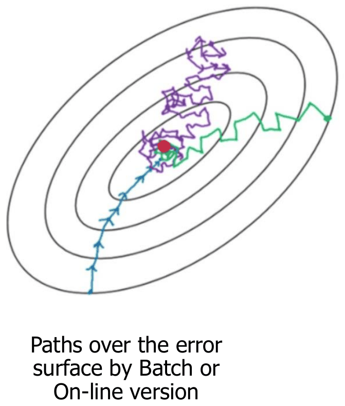
*Fig. 5.8 — Percorsi sulla superficie d'errore: batch (blu, regolare) e on-line (viola e verde, più irregolari).*

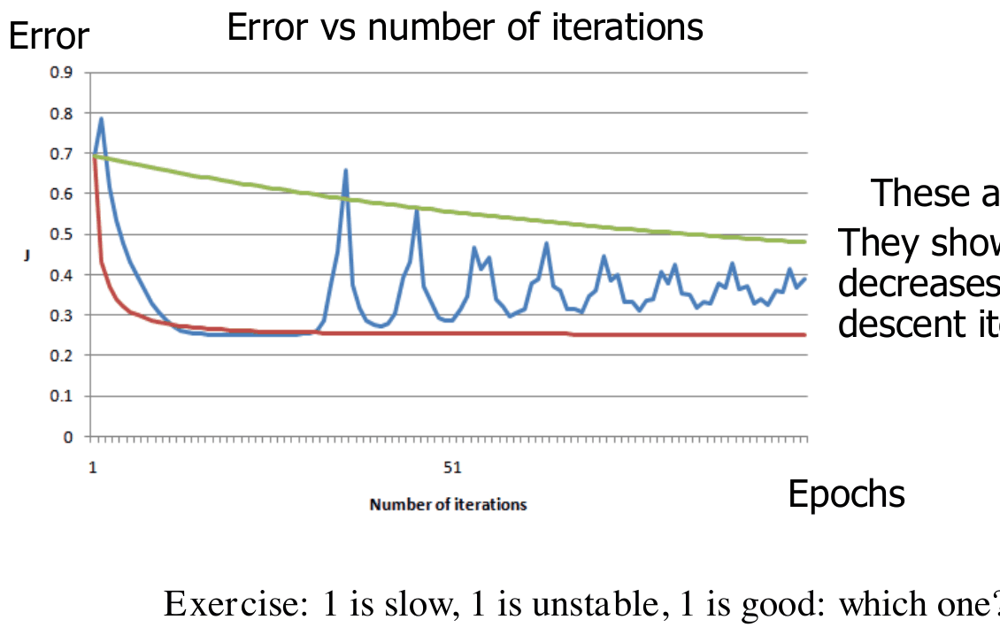
*Fig. 5.9 — Curve di apprendimento: l'errore in funzione delle iterazioni (epoche).*

> [!question] Esercizio: quale curva è lenta, quale instabile, quale buona?
>
> La curva **verde** scende molto lentamente (learning rate troppo piccolo); la **blu** presenta picchi e oscillazioni (learning rate troppo grande, instabile); la **rossa** scende rapidamente e si stabilizza (buona).

#### Interpretazione: una regola di correzione dell'errore

Ricapitolando,
$$
\Delta w_j = 2\sum_{p=1}^{l} \underbrace{(y_p - \mathbf{x}_p^T\mathbf{w})}_{\delta_p}\, x_{p,j}, \qquad \mathbf{w}_{new} = \mathbf{w} + \eta\,\Delta\mathbf{w}
$$
(la costante 2 si può omettere, assorbendola in $\eta$). È una regola di **correzione dell'errore**, detta **regola di Widrow-Hoff** o **delta rule**: ogni $w_j$ cambia **in proporzione all'errore** (target − output).

- Se l'errore è 0, non c'è correzione.
- Con input $x_j > 0$: se l'errore è positivo (output troppo basso), delta positivo → $w_j$ aumenta → l'output aumenta → l'errore diminuisce.
- Con input $x_j > 0$: se l'errore è negativo (output troppo alto), delta negativo → $w_j$ diminuisce → l'output diminuisce → l'errore diminuisce.
- Con input negativo i segni si invertono, con input nullo il peso non cambia: l'input "decide" quanto e in che verso ogni peso è responsabile dell'errore.

Si impara dagli errori precedenti: *"cercando e sbagliando si impara"* (Goethe).

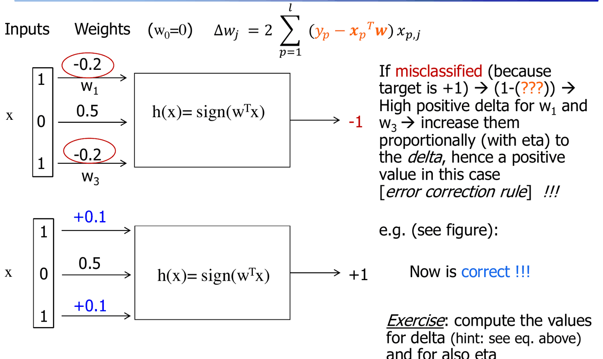
*Fig. 5.10 — La delta rule all'opera: i pesi degli input attivi vengono aumentati finché il pattern viene classificato correttamente.*

Nell'esempio, l'input è $(1, 0, 1)$ con pesi $(-0{,}2;\ 0{,}5;\ -0{,}2)$ e $w_0 = 0$: $\mathbf{w}^T\mathbf{x} = -0{,}4$, quindi l'uscita è $-1$ ma il target è $+1$. Il delta è positivo: $w_1$ e $w_3$ (i cui input valgono 1) vengono aumentati, mentre $w_2$ (input 0) resta invariato. Dopo la correzione ($w_1 = w_3 = +0{,}1$) si ha $\mathbf{w}^T\mathbf{x} = 0{,}2 > 0$ e l'uscita è corretta.

> [!tip] Perché la discesa del gradiente è così importante
>
> È un metodo di ricerca locale semplice ed efficace che permette di esplorare uno spazio delle ipotesi **infinito e continuo**. Si applica sempre quando $H$ è continuo e la loss è differenziabile, **non solo ai modelli lineari**: sarà la base dell'addestramento di reti neurali e deep learning. Esistono molti miglioramenti (metodi di Newton e quasi-Newton, gradiente coniugato...).

### Riepilogo per la classificazione

- Il modello viene addestrato sul TR con LMS applicato a $\mathbf{w}^T\mathbf{x}$, tramite la stessa discesa del gradiente usata per la regressione.
- Il modello viene **usato** per classificare applicando la soglia: $h(\mathbf{x}) = \operatorname{sign}(\mathbf{w}^T\mathbf{x})$.
- L'errore si può valutare come **errore di classificazione** (loss 0/1, numero di pattern sbagliati), non solo come MSE:
$$
\text{mean\_err} = \frac{1}{l}\sum_{p=1}^{l} L\big(h(\mathbf{x}_p), d_p\big) = \frac{\text{num\_err}}{l}, \qquad \text{accuratezza} = \frac{l - \text{num\_err}}{l}.
$$

### Torniamo al problema: è una buona soluzione?

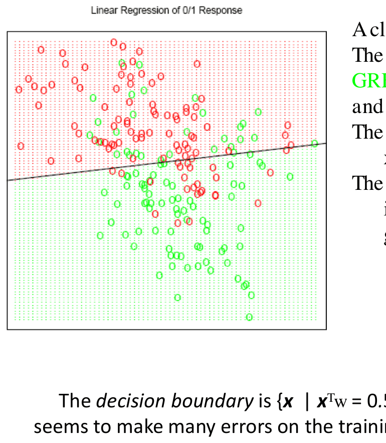
*Fig. 5.11 — Soluzione lineare al problema di esempio: classi codificate come GREEN = 0, RED = 1, confine $\mathbf{x}^T\mathbf{w} = 0{,}5$.*

Il confine $\{\mathbf{x} \mid \mathbf{x}^T\mathbf{w} = 0{,}5\}$ è lineare e sembra commettere molti errori sul training. È una cattiva soluzione? Dipende da come sono stati generati i dati:

- **Scenario 1**: ogni classe è generata da una gaussiana con componenti scorrelate, stessa varianza e medie diverse. In questo caso la regola lineare è **quasi ottima**: la sovrapposizione tra le classi è inevitabile (dovuta al rumore nei dati).
- **Scenario 2**: ogni classe è una miscela di 10 gaussiane. In questo caso il modello lineare è **troppo rigido**, e servono i modelli successivi.

> [!note] Minimi quadrati e massima verosimiglianza
>
> I minimi quadrati corrispondono al criterio di **massima verosimiglianza** se gli errori sperimentali hanno distribuzione normale.

### Bias induttivo del modello lineare

- **Language bias**: $H$ è l'insieme delle funzioni lineari, che può essere molto restrittivo e rigido.
- **Search bias**: ricerca ordinata guidata dalla minimizzazione dei minimi quadrati. Si potrebbe preferire un metodo diverso, che ad esempio restringa i valori dei parametri, ottenendo soluzioni con proprietà diverse (in particolare rispetto alla generalizzazione).

Anche per un modello "semplice" le possibilità sono molte: serve un approccio fondato su principi (la teoria del ML).

---

## Limiti dei modelli lineari

### Regressione di problemi non lineari

Se la funzione target non è lineare (come il seno dell'esempio polinomiale), una retta è una soluzione **troppo povera**: è il caso $M = 1$ già visto, in piena zona di underfitting.

### Classificazione: separabilità lineare

> [!definition] Separabilità lineare
>
> Due insiemi di punti nel piano sono **linearmente separabili** se possono essere separati completamente da una singola retta. In generale, due gruppi sono linearmente separabili in uno spazio $n$-dimensionale se possono essere separati da un iperpiano di dimensione $n-1$.

Il confine di decisione lineare fornisce soluzioni esatte **solo** per insiemi linearmente separabili.

Il modello lineare può rappresentare ad esempio le **congiunzioni**. La congiunzione $x_1 \wedge x_2 \wedge x_4$ si realizza con $1 \cdot x_1 + 1 \cdot x_2 + 0 \cdot x_3 + 1 \cdot x_4 \ge 2{,}5$ (vale solo se tutti e tre sono 1); l'AND a due variabili con $x_1 + x_2 \ge 1{,}5$. I pesi $\mathbf{w}$ di queste soluzioni possono essere appresi.

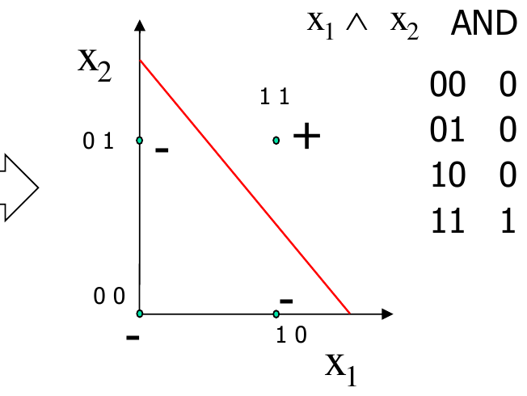
*Fig. 5.12 — L'AND è linearmente separabile.*

Ma non tutto è separabile:

- **3 punti**: si può sempre trovare un iperpiano per ogni assegnamento delle etichette? Sì, **se non sono allineati**. Se sono allineati, l'etichettatura "1–0–1" (0 in mezzo) non è separabile.
- **4 punti**: no. Esiste un'etichettatura per cui nessun classificatore lineare è perfetto: lo **XOR** ($00 \mapsto 0$, $01 \mapsto 1$, $10 \mapsto 1$, $11 \mapsto 0$), in cui i positivi stanno su una diagonale e i negativi sull'altra.

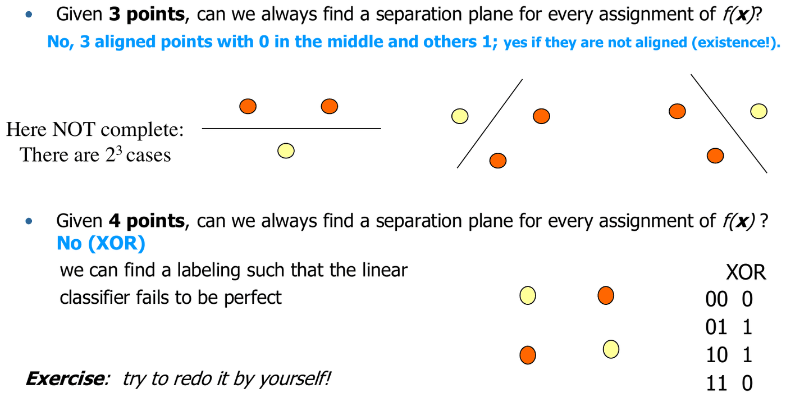
*Fig. 5.13 — Limiti della separazione lineare: tre punti non allineati sono sempre separabili, lo XOR su quattro punti no.*

> [!note] Anticipazione
>
> Questo "contare quante etichettature si riescono a separare" è esattamente l'idea della **VC-dimension**: un iperpiano nel piano separa tutte le etichettature di 3 punti (non allineati), ma non di 4. La VC-dimension delle rette nel piano è quindi 3.

---

## Estendere il modello lineare

### "Lineare" nei parametri, non negli input

Nei modelli statistici parametrici, **"lineare" non si riferisce alla retta**, ma al modo in cui i **coefficienti $\mathbf{w}$** compaiono nell'equazione. Si possono quindi usare input trasformati come $x, x^2, x^3, \dots$ per modellare relazioni non lineari tra input e output, mantenendo **la stessa macchina di apprendimento** (minimi quadrati). È proprio la regressione polinomiale dell'introduzione:
$$
h_\mathbf{w}(x) = w_0 + w_1 x + w_2 x^2 + \dots + w_M x^M = \sum_{j=0}^{M} w_j x^j.
$$

### Linear Basis Expansion (LBE)

> [!definition] Espansione in basi lineare
>
> $$
> h_\mathbf{w}(\mathbf{x}) = \sum_{k=0}^{K} w_k\, \phi_k(\mathbf{x})
> $$
> dove le $\phi_k: \mathbb{R}^n \to \mathbb{R}$ sono trasformazioni fissate dell'input. Si aumenta il vettore di input con nuove variabili derivate da $\mathbf{x}$.

Esempi di $\phi$:

- rappresentazione **polinomiale**: $\phi(\mathbf{x}) = x_j^2$, $\phi(\mathbf{x}) = x_j x_i$, ...;
- trasformazioni non lineari di singoli input: $\log(x_j)$, $\sqrt{x_j}$, ...;
- trasformazioni di più input: $\phi(\mathbf{x}) = \|\mathbf{x}\|$;
- spline, ...

Ad esempio: $h(\mathbf{x}) = w_1x_1 + w_2x_2 + w_3\log(x_2) + w_4\log(x_3) + w_5(x_2x_3) + w_0$.

Tipicamente il numero di parametri diventa $K > n$. Il modello è **lineare nei parametri** (e nelle $\phi$), non in $\mathbf{x}$: si usa lo stesso algoritmo di apprendimento. Vale per la regressione e anche per la classificazione (basta applicare la soglia a $\sum_k w_k\phi_k(\mathbf{x})$).

> [!warning] Pro e contro della basis expansion
>
> **Pro**: modella relazioni più complesse, è più espressivo.
>
> **Contro**:
> - con molte funzioni di base si rischia facilmente l'**overfitting**, quindi servono metodi di controllo della complessità (intesa come flessibilità, cioè VC-dim, non come costo computazionale);
> - la **maledizione della dimensionalità** (*curse of dimensionality*): il volume dello spazio cresce così in fretta che i dati disponibili diventano sparsi e non bastano più a sostenere la complessità del modello;
> - le $\phi$ sono **fissate prima** di vedere i dati. L'alternativa sono modelli adattivi, non lineari nei parametri, come le **reti neurali** (che imparano le $\phi$) e le **SVM**.
>
> Resta poi aperta la domanda: quali $\phi$ scegliere? (approcci "a dizionario").

---

## Regolarizzazione: il controllo della complessità

Come controllare la complessità del modello? Tra i molti approcci c'è il **coefficient shrinkage** ("restringimento" dei coefficienti).

### Ridge regression (regolarizzazione di Tikhonov)

Si aggiunge alla loss un termine che **penalizza i pesi grandi**:
$$
\text{Loss}(\mathbf{w}) = \underbrace{\sum_{p=1}^{l}(y_p - \mathbf{x}_p^T\mathbf{w})^2}_{\text{termine d'errore (} R_{emp}\text{)}} + \underbrace{\lambda\,\|\mathbf{w}\|^2}_{\text{termine di penalità}}, \qquad \|\mathbf{w}\|^2 = \sum_j w_j^2.
$$
$\lambda$ è l'**iperparametro di regolarizzazione**, un piccolo valore positivo scelto in fase di **model selection**. Il modello risultante è più "liscio" (*smooth*): si favoriscono modelli con pesi piccoli o nulli, cioè che usano meno termini, quindi meno complessi.

> [!note] Loss ed Errore non sono più sinonimi
>
> Da qui in poi **Loss** indica la funzione obiettivo usata per l'addestramento (errore + penalità), mentre **Errore** $E$ indica la misura dell'errore del modello (il termine sui dati). Finora li avevamo trattati come equivalenti.

#### Soluzione

- **Approccio diretto**: $\mathbf{w} = (X^TX + \lambda I)^{-1}X^T\mathbf{y}$. La matrice $X^TX + \lambda I$ è **sempre invertibile** (per $\lambda > 0$): un vantaggio anche numerico.
- **Approccio a gradiente**: si segue ancora il gradiente negativo della loss. La derivata del termine di penalità rispetto a $w_j$ è $2\lambda w_j$, quindi la nuova regola è
$$
\mathbf{w}_{new} = \mathbf{w} + \eta\,\Delta\mathbf{w} - 2\lambda\mathbf{w},
$$
dove $\Delta\mathbf{w}$ è il gradiente negativo del solo termine d'errore (moltiplicato per $\eta$), mentre la penalità è moltiplicata direttamente per $\lambda$. È la tecnica del **weight decay**: anche con gradiente d'errore nullo, a ogni passo ogni peso si riduce di una frazione del suo valore.

#### Il compromesso governato da $\lambda$

- **$\lambda$ piccolo**: minimizzando la loss conta soprattutto il termine d'errore; si ottiene un modello troppo complesso (pesi di norma alta), con rischio di **overfitting**.
- **$\lambda$ grande**: conta soprattutto la penalità; l'errore sui dati può crescere troppo, e si va verso l'**underfitting**.

Il grande vantaggio è che si ha una **realizzazione concreta del controllo della complessità**, facile da implementare e di applicabilità generale.

> [!tip] Tikhonov e SLT
>
> La penalità spinge tutti i pesi verso valori piccoli (alcuni anche a zero), realizzando un controllo della complessità: si ottiene un modello con VC-dimension più bassa (o più adatta), e il compromesso è regolato da **un solo parametro**, $\lambda$. Nel grafico del bound SLT, aumentare $\lambda$ equivale a spostarsi verso sinistra (meno complessità): un $\lambda$ ben scelto porta vicino al minimo del bound su $R$.

#### Effetto sul polinomio di grado 9

Riprendiamo il polinomio di grado 9 con 10 punti, che senza regolarizzazione ($\lambda = 0$) aveva errore di training nullo e overfitting fortissimo.

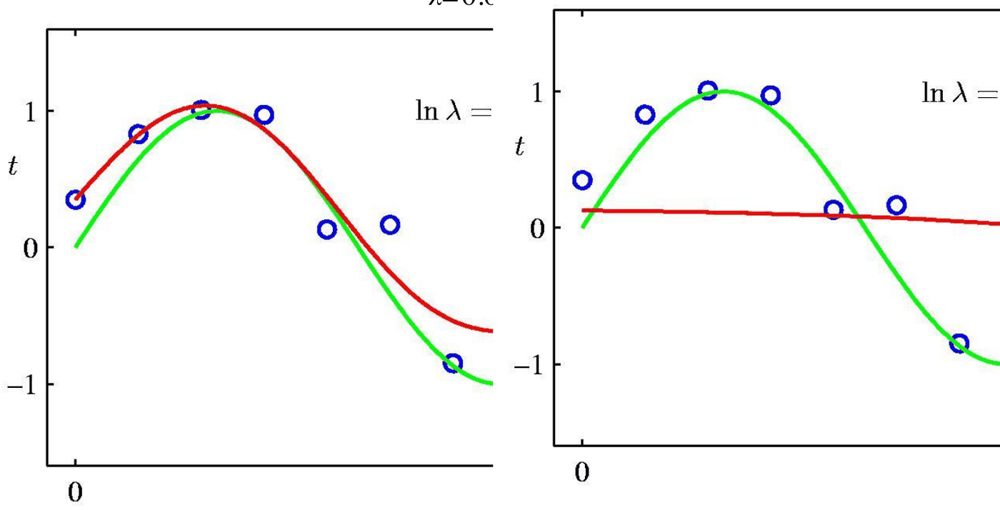
*Fig. 5.14 — Polinomio di grado 9 regolarizzato: con $\ln\lambda = -18$ (sinistra) la curva è liscia e segue bene la funzione vera; con $\ln\lambda = 0$ (destra) è troppo piatta.*

Con un $\lambda$ adatto ($\ln\lambda = -18$, cioè $\lambda \approx 1{,}5 \cdot 10^{-8}$) il modello funziona bene: è **peggiore sul training** ma riduce l'overfitting. Con $\lambda$ troppo alto ($\ln\lambda = 0$, cioè $\lambda = 1$) si finisce in underfitting.

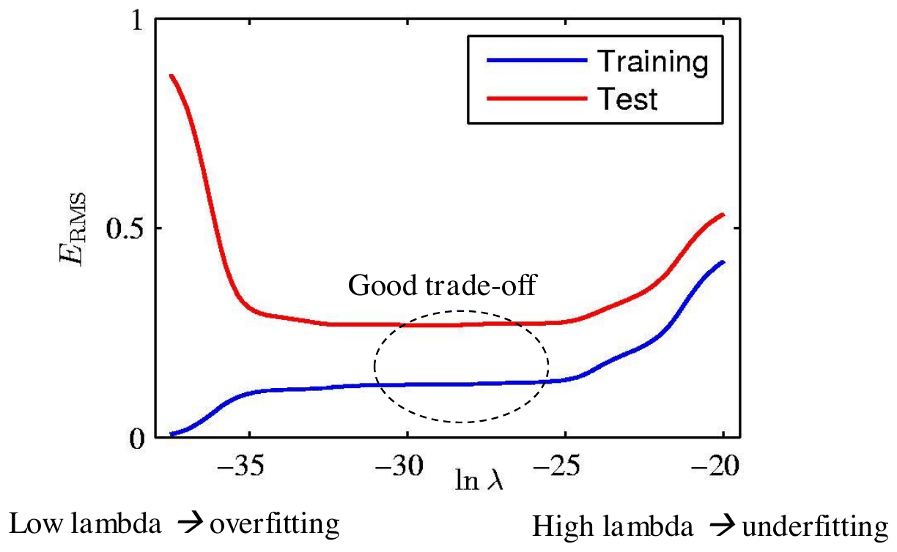
*Fig. 5.15 — $E_{RMS}$ di training e test al variare di $\ln\lambda$: a sinistra overfitting, a destra underfitting, al centro il buon compromesso.*

Anche i coefficienti mostrano l'effetto della regolarizzazione:

| | $\ln\lambda = -\infty$ ($\lambda = 0$) | $\ln\lambda = -18$ | $\ln\lambda = 0$ |
|---|---|---|---|
| $w_0^*$ | 0,35 | 0,35 | 0,13 |
| $w_1^*$ | 232,37 | 4,74 | −0,05 |
| $w_2^*$ | −5321,83 | −0,77 | −0,06 |
| $w_3^*$ | 48568,31 | −31,97 | −0,05 |
| $w_4^*$ | −231639,30 | −3,89 | −0,03 |
| $w_5^*$ | 640042,26 | 55,28 | −0,02 |
| $w_6^*$ | −1061800,52 | 41,32 | −0,01 |
| $w_7^*$ | 1042400,18 | −45,95 | −0,00 |
| $w_8^*$ | −557682,99 | −91,53 | 0,00 |
| $w_9^*$ | 125201,43 | 72,68 | 0,01 |

I pesi enormi del caso non regolarizzato si riducono drasticamente: la regolarizzazione "doma" le oscillazioni.

### Altre tecniche di regolarizzazione

- **Ridge regression** (norma $\|\cdot\|_2$): penalizza il quadrato dei pesi e tende a rendere **tutti** i pesi più piccoli.
- **Lasso** (norma $\|\cdot\|_1$): penalizza il valore assoluto e tende a portare **alcuni pesi esattamente a zero** (lasciandone altri grandi) → una forma di **feature selection**. Purtroppo il valore assoluto rende la loss non differenziabile (in zero), e servono altri approcci.
- **Elastic net**: usa entrambe le norme.

> [!tip] Perché L1 azzera i pesi e L2 no?
>
> Il gradiente di $\lambda w^2$ è $2\lambda w$: diventa piccolissimo quando $w$ è vicino a zero, quindi la spinta verso zero si attenua e il peso resta piccolo ma non nullo. Il gradiente (sub-gradiente) di $\lambda|w|$ è invece $\lambda\operatorname{sign}(w)$: una spinta **costante** verso zero, anche per pesi già piccoli, che li porta esattamente a zero se il termine d'errore non li "difende".

### Altri miglioramenti (opzionali)

- **Data augmentation**: aggiungere rumore agli input insegna al modello a ignorare variazioni irrilevanti (robustezza e regolarizzazione); l'oversampling aiuta con dataset sbilanciati.
- **Input derivati**: si usa un piccolo numero di nuove variabili, combinazioni lineari degli input (Principal Component Regression, Partial Least Squares).

### Classificazione multi-classe (opzionale)

Due approcci semplici:

- codifica **1-of-K** delle classi (es. rosso, verde, blu → $(0,0,1), (0,1,0), (1,0,0)$) e un modello lineare per ciascuna componente;
- **OVA** (*one-vs-all*): si addestrano $K$ classificatori binari, ognuno distingue una classe da tutte le altre; per classificare si sceglie quello con l'uscita più alta (più positiva);
- **AVA** (*all-vs-all*, *one-vs-one*): un classificatore per ogni coppia di classi ($K(K-1)/2$ classificatori distinti); vince la classe con la massima somma di uscite o con più voti. Ogni classificatore si addestra su meno dati.

Con molte classi possono verificarsi fenomeni di **mascheramento** (una classe "nascosta" dalle altre). Esistono approcci più sofisticati e modelli con uscite multiple native. Altri classificatori lineari noti sono la **Linear Discriminant Analysis** e la **regressione logistica** (che modella direttamente $P(y \mid \mathbf{x})$).

### Uno sguardo avanti

- Il **Perceptron** (Rosenblatt, 1958, di ispirazione biologica) minimizza solo le classificazioni errate ed è la base delle **reti neurali**: più unità organizzate in strati, che realizzano un'**espansione in basi adattiva** (le $\phi$ vengono apprese), cioè *representation learning*, addestrate con la discesa del gradiente.
- Le **SVM** (Vapnik, 1996) regolarizzano tramite la **massimizzazione del margine** tra le classi e allargano lo spazio delle feature con basis expansion (es. polinomi).

Entrambe realizzano un'approssimazione non lineare flessibile per classificazione e regressione.

> [!abstract] Lezioni apprese dai modelli lineari
>
> - È possibile **apprendere regolando parametri liberi** $\mathbf{w}$, cercando in uno spazio continuo guidati da una funzione di loss.
> - Si formula il problema come **LMS** e si derivano due algoritmi: **diretto** (equazioni normali, SVD) e **iterativo** (discesa del gradiente, delta rule).
> - I modelli lineari hanno un forte **language bias** (solo problemi linearmente separabili).
> - Due concetti chiave del filo rosso del corso: la **basis expansion** (più **flessibilità**) e la **regolarizzazione** (**controllo della complessità**). Li ritroveremo, in forme diverse, nelle reti neurali e nelle SVM.

---

## K-nearest neighbors

Ora ci si sposta all'estremo opposto: da un approccio rigido a uno **molto flessibile** (e locale).

### Apprendimento eager e lazy

Rispetto al *timing* dell'apprendimento distinguiamo:

- **eager** ("avido"): si analizzano i dati di training e si costruisce un'**ipotesi esplicita** (come il modello lineare);
- **lazy** ("pigro"): si memorizzano i dati e si aspetta un punto di test; solo allora si costruisce un'ipotesi ad hoc per classificare quel punto.

### 1-nearest neighbor

> [!definition] Algoritmo 1-NN
>
> 1. Memorizzare i dati di training $\langle \mathbf{x}_p, y_p\rangle$, $p = 1,\dots,l$.
> 2. Dato un input $\mathbf{x}$ (di dimensione $n$), trovare l'esempio di training più vicino:
> $$
> i(\mathbf{x}) = \arg\min_p d(\mathbf{x}, \mathbf{x}_p),
> $$
> ad esempio con la distanza euclidea $d(\mathbf{x}, \mathbf{x}_p) = \sqrt{\sum_{t=1}^{n}(x_t - x_{p,t})^2} = \|\mathbf{x} - \mathbf{x}_p\|$.
> 3. Restituire $y_i$.

Il 1-NN è **molto flessibile**: sul training set commette **zero errori** (ogni punto è il vicino più prossimo di sé stesso). Il confine di decisione non è lineare ed è molto irregolare, forse inutilmente rumoroso (ad esempio nello scenario 1, dove sappiamo che la soluzione ottima è quasi lineare). E sui dati di test?

### K-nearest neighbors

Un modo naturale di classificare un nuovo punto è guardare i suoi **vicini** e farne la media:
$$
\text{avg}_k(\mathbf{x}) = \frac{1}{k}\sum_{\mathbf{x}_i \in N_k(\mathbf{x})} y_i,
$$
dove $N_k(\mathbf{x})$ è l'insieme dei $k$ pattern più vicini a $\mathbf{x}$ secondo la distanza $d$. Se nell'intorno di $\mathbf{x}$ una classe domina chiaramente, è probabile che anche $\mathbf{x}$ vi appartenga: la regola di classificazione è il **voto a maggioranza** tra i membri di $N_k(\mathbf{x})$. Per target in $\{0,1\}$:
$$
h(\mathbf{x}) = \begin{cases} 1 & \text{se } \text{avg}_k(\mathbf{x}) > 0{,}5 \\ 0 & \text{altrimenti.} \end{cases}
$$
Per la **regressione** si usa direttamente la media dei target dei $k$ vicini.

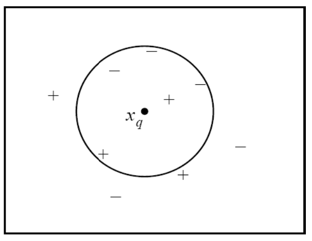
*Fig. 5.16 — 1-NN restituisce "+" per $x_q$, 5-NN restituisce "−": aumentare $k$ "liscia" la decisione, utile con dati rumorosi.*

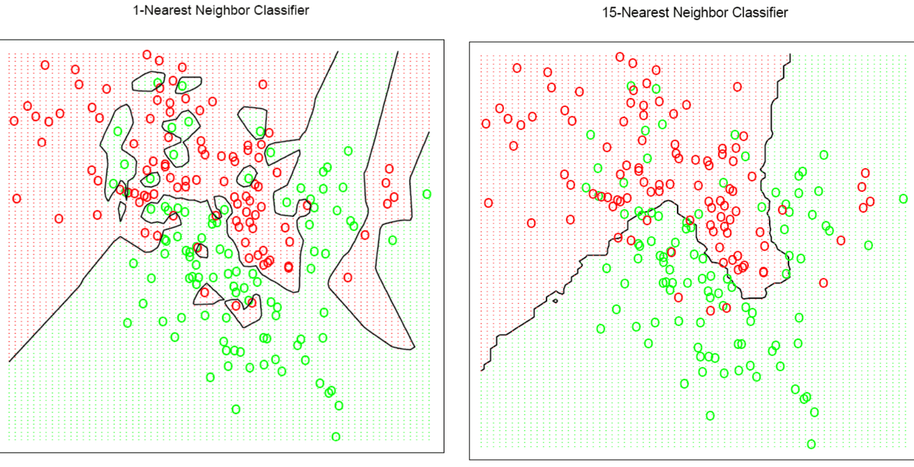
*Fig. 5.17 — Confini di decisione del 1-NN (sinistra) e del 15-NN (destra) sullo stesso problema.*

Con $k = 15$ il modello è ancora molto flessibile, ma commette qualche errore sul training; il confine è ancora irregolare ma meno, e si **adatta alle densità locali** delle classi.

Il K-NN usa implicitamente il **diagramma di Voronoi**: ogni cella contiene tutti i punti più vicini a un certo pattern che a qualsiasi altro, e i lati delle celle sono i punti equidistanti da due pattern. Il 1-NN assegna a ogni cella l'etichetta del suo pattern.

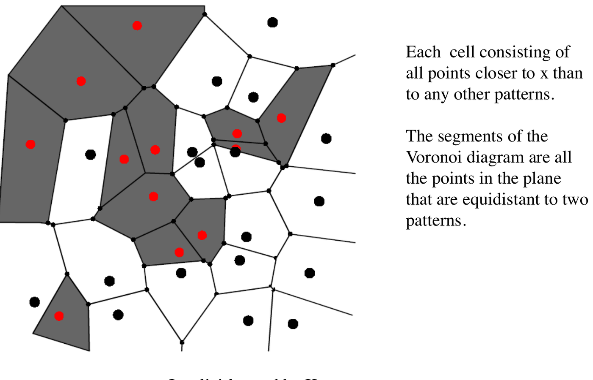
*Fig. 5.18 — Diagramma di Voronoi: il confine del 1-NN segue i lati delle celle tra punti di classi diverse.*

### Varianti

**Multi-classe**: si restituisce la classe più frequente tra i $k$ vicini:
$$
h(\mathbf{x}) = \arg\max_v \sum_{\mathbf{x}_i \in N_k(\mathbf{x})} \mathbb{1}_{v, y_i}, \qquad \mathbb{1}_{v, y_i} = \begin{cases} 1 & \text{se } v = y_i \\ 0 & \text{altrimenti.} \end{cases}
$$

**Distanza pesata**: i vicini più vicini contano di più:
$$
h(\mathbf{x}) = \arg\max_v \sum_{\mathbf{x}_i \in N_k(\mathbf{x})} \frac{\mathbb{1}_{v, y_i}}{d(\mathbf{x}, \mathbf{x}_i)^2},
$$
e se $d = 0$ per qualche $\mathbf{x}_i$ si restituisce direttamente $y_i$.

### Un estremo del ML

Il K-NN non costruisce un'ipotesi globale valida per tutte le istanze: **non c'è un modello da addestrare**, ma bisogna memorizzare gli esempi. Fa stime **locali** (con funzioni localmente costanti) invece di un'approssimazione lineare globale. È un metodo *lazy*, basato su memoria, sulle istanze, sulle distanze.

### K-NN contro modello lineare

| | Lineare | K-NN |
|---|---|---|
| Flessibilità | rigido (**bassa varianza**) | flessibile (**alta varianza**) |
| Timing | eager | lazy |
| Tipo | parametrico | instance-based |
| Parametri | $n+1$ (3 nell'esempio) | circa $l/k$ "parametri effettivi" |

Con $k$ piccolo bastano pochi punti per cambiare il confine: la flessibilità si paga. Si potrebbe pensare che il K-NN abbia un solo parametro ($k$), ma realisticamente ha circa **$l/k$ parametri effettivi** (Hastie-Tibshirani-Friedman): è come se dividesse lo spazio in $l/k$ regioni, ognuna con la sua "media".

*Fig. 5.19 — Curve di errore del K-NN al variare di $k$ (training di 200 punti, test di 10000). I quadratini sono il modello lineare, la linea viola l'errore ottimo di Bayes.*

Spostandosi da $k$ grande a $k = 1$ (cioè aumentando $l/k$) si passa dall'**underfitting** all'**overfitting**: l'errore di training scende fino a zero, quello di test ha un minimo per valori intermedi. È di nuovo il grafico del bound SLT, con $k$ nel ruolo del controllo della complessità: più flessibilità permette di trovare il risultato migliore, **se** la complessità viene controllata.

### Il classificatore ottimo di Bayes

> [!definition] Classificatore di Bayes ed errore di Bayes
>
> Se si conosce la densità $P(\mathbf{x}, y)$, la scelta ottima è assegnare la classe più probabile:
> $$
> h(\mathbf{x}) = \arg\max_v P(v \mid \mathbf{x}), \qquad v \in \{C_1, \dots, C_K\}.
> $$
> Il suo tasso d'errore, detto **Bayes rate**, è il **minimo errore raggiungibile** data la distribuzione dei dati (assumendo nota la densità generatrice).

Il K-NN approssima direttamente questa soluzione: il voto a maggioranza in un intorno è esattamente una stima di $\arg\max_v P(v \mid \mathbf{x})$, con due rilassamenti: la probabilità condizionata **in un punto** diventa probabilità condizionata **in un intorno** del punto (approssimazione locale), e le probabilità sono stimate con le **proporzioni** nel campione di training.

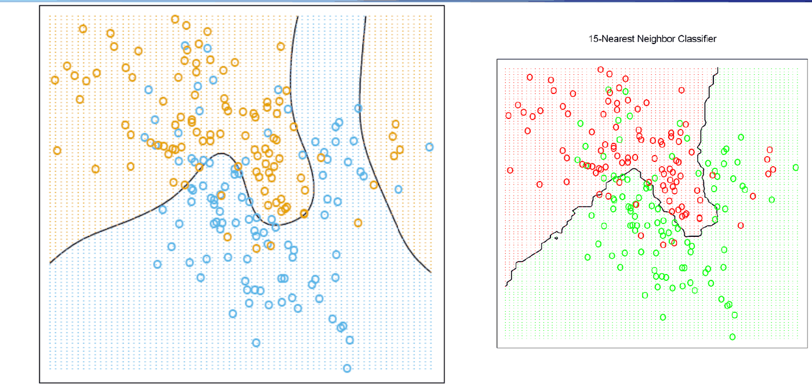
*Fig. 5.20 — Confine di Bayes ottimo (sinistra) e confine del 15-NN (destra): il 15-NN è molto vicino all'ottimo, coerentemente con il minimo dell'errore di test nella figura precedente.*

### Bias induttivo del K-NN

1. **La distanza assunta** stabilisce quali esempi sono simili: si assume che la classificazione di un punto sia simile a quella dei vicini **secondo la metrica scelta**. Si possono usare metriche diverse dall'euclidea; dati simbolici richiedono metriche ad hoc (es. la **distanza di Hamming** tra stringhe della stessa lunghezza: il numero di posizioni in cui differiscono).
2. **Località**: approssimazione locale, con un'assunzione di *smoothness* locale (da confrontare più avanti con il bias del deep learning).

Il bias legato alla metrica è spesso sottovalutato nei libri, ma è cruciale.

### Limiti del K-NN

#### Scala delle variabili e metrica

La scelta della scala dipende dalla conoscenza del dominio. Se le variabili devono contribuire allo stesso modo, bisogna fare attenzione alle differenze di range: **riscalare i dati** (es. media zero e varianza unitaria) equivale a **cambiare la metrica**. La scalatura può cambiare del tutto quale sia il vicino più prossimo: il K-NN è fragile anche rispetto a un pre-processing elementare.

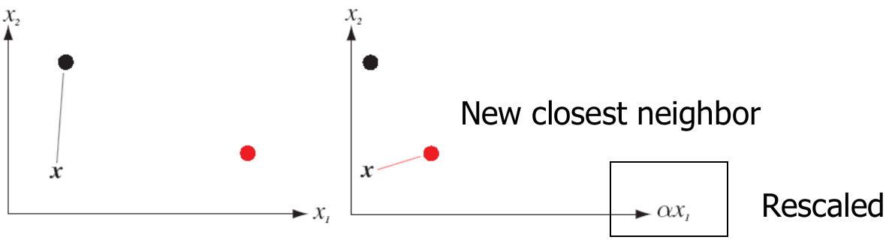
*Fig. 5.21 — Riscalando una variabile cambia il vicino più prossimo.*

#### Costo computazionale

Il K-NN costruisce l'approssimazione locale **per ogni nuovo esempio** da predire: il costo computazionale è **spostato nella fase di predizione**. Per ogni input si calcolano le distanze da tutti i vettori memorizzati (tempo proporzionale al numero di pattern), anche se esistono algoritmi di ricerca di prossimità e indicizzazione ad hoc. Anche il costo in **spazio** è alto (tutti i dati di training).

#### Interpretabilità

I modelli K-NN offrono poca interpretazione, soggettiva e dipendente dalla metrica.

#### La maledizione della dimensionalità

Il K-NN funziona bene se si trova un insieme significativo di dati vicini a ogni $\mathbf{x}$, cioè con un **campionamento denso**. Quando ci sono molte variabili di input (dimensione $n$ alta) fallisce spesso per la **curse of dimensionality**, che ha molte manifestazioni. Tre in particolare influenzano direttamente la generalizzazione.

**1. In alta dimensione è difficile trovare punti vicini.** Diventa difficile raccogliere $k$ osservazioni "vicine" (cioè simili) a un punto di query: gli intorni tendono a essere spazialmente grandi e le stime non sono più locali; ridurre la dimensione dell'intorno significa ridurre $k$, e la varianza della stima aumenta (overfitting).

Consideriamo dati uniformi nel cubo unitario e un sottocubo che deve contenere una frazione $r$ dei dati. Il suo lato deve essere $r^{1/n}$ (perché volume $=$ lato$^n$).

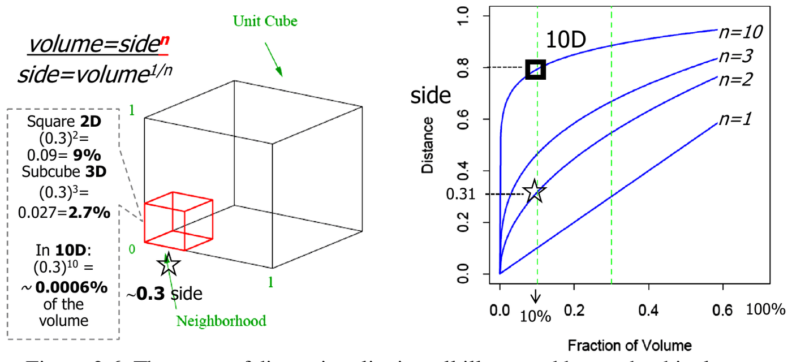
*Fig. 5.22 — Maledizione della dimensionalità: lato del sottocubo necessario per catturare una frazione $r$ del volume, al variare della dimensione $n$.*

- Per catturare il 10% dei dati: in 2D basta un lato di $0{,}1^{1/2} \approx 0{,}32$ (il 30% del range di ogni variabile); in 10D serve $0{,}1^{1/10} \approx 0{,}8$, cioè l'**80% del range** di ogni coordinata! Anche per l'1% del volume in 10D serve il 63% del range. L'intorno non è più "locale" e i vicini non sono più simili.
- Viceversa, fissato il lato a 0,3: in 1D si cattura il 30% dei dati, in 2D il 9%, in 3D il 2,7%, in 10D circa lo **0,0006%**. Quel lato può non bastare a trovare $k$ dati, a meno di usare $k$ piccolo (e quindi rischiare overfitting).

**2. Bassa densità di campionamento.** La densità di campionamento è proporzionale a $l^{1/n}$. Se 100 punti bastano a stimare una funzione in $\mathbb{R}^1$, per ottenere un'accuratezza simile in $\mathbb{R}^{10}$ ne servono $100^{10} = 10^{20}$.

**3. Feature irrilevanti** (*curse of noisy*). Se il target dipende solo da poche delle molte feature (es. 2 su 20), la somiglianza tra pattern può essere dominata dal gran numero di feature irrilevanti, e il "vicino" trovato non è davvero simile. Il problema cresce con la dimensionalità. Rimedi: **pesare le feature** secondo la loro rilevanza (allungando gli assi lungo alcune dimensioni; i pesi si possono cercare con una costosa model selection o altri metodi) oppure fare **feature selection** (eliminare variabili, riducendo la dimensione dell'input).

### Scelte di progetto del K-NN

- La **metrica** $d$ (euclidea, Hamming, Manhattan, pesi sulle feature...): spesso è la chiave del successo di un'applicazione.
- Il valore di **$k$**, che controlla underfitting e overfitting.
- Spesso è necessario selezionare un **sottoinsieme dei dati** (un insieme di prototipi, ad esempio tramite clustering) e un **sottoinsieme delle feature**.

Estensioni ad altri modelli locali: *kernel smoothers*, regressione lineare locale, metodi a prototipi, *case-based reasoning*.

> [!abstract] Lezioni generali dal K-NN
>
> - Una varianza troppo bassa è povera (modelli lineari rigidi), una troppo alta è pericolosa (K-NN).
> - **Smoothing**: nel K-NN si ottiene aumentando $k$.
> - **Curse of dimensionality**: il volume dello spazio cresce così in fretta che i dati diventano sparsi.
> - Le curve di errore al variare di $k$ sono un'altra istanza del grafico del bound SLT.
> - Il bias induttivo del K-NN è legato alla metrica.

### E adesso?

Il K-NN non costruisce un vero "modello appreso": non estrae regolarità né sintetizza conoscenza, e non soddisfa l'obiettivo dell'apprendimento (poter "dimenticare" gli esempi dopo aver costruito il modello). Nelle prossime lezioni si cercano modelli **compatti** come la LTU (tutta la conoscenza in pochi parametri) ma **flessibili** come il K-NN, con un adeguato supporto al controllo della complessità: le **reti neurali**.

> [!question] Possibili domande d'esame
>
> - Formulare il problema di apprendimento per un modello lineare con LMS, per regressione e classificazione.
> - Derivare il gradiente dell'errore quadratico e le equazioni normali.
> - Descrivere l'algoritmo di discesa del gradiente; differenza tra batch e on-line; ruolo di $\eta$.
> - Spiegare la delta rule come regola di correzione dell'errore.
> - Perché per la classificazione si usa l'errore quadratico su $\mathbf{w}^T\mathbf{x}$ invece della loss 0/1?
> - Cos'è la separabilità lineare? Perché lo XOR non è linearmente separabile?
> - Cos'è la linear basis expansion? Pro e contro.
> - Scrivere la loss di Tikhonov, la soluzione diretta e la regola di weight decay; ruolo di $\lambda$.
> - Differenza tra regolarizzazione L1 e L2.
> - Descrivere il K-NN; confrontarlo con il modello lineare; cos'è il classificatore di Bayes?
> - Spiegare la maledizione della dimensionalità.
