# Reti neurali (parte 1): dal neurone al MLP

*Appunti di Fabio Piscitelli — Machine Learning (654AA), Prof. Alessio Micheli, Università di Pisa, a.a. 2026/27*

Con le reti neurali si entra nel cuore del corso. Questa prima parte parte dall'ispirazione biologica, introduce il neurone artificiale e il **Perceptron** con il suo algoritmo di apprendimento e il **teorema di convergenza**, confronta il Perceptron con l'LMS, introduce le funzioni di attivazione sigmoidali e arriva al **Multi-Layer Perceptron** (MLP), analizzato come funzione flessibile, come espansione in basi adattiva e come approssimatore universale. Si chiude con i problemi che l'apprendimento in una rete pone e che saranno risolti dalla **backpropagation**.

## Le reti neurali come strumento di ML

Le reti neurali si studiano con due obiettivi diversi:

- **modellare sistemi biologici** e processi di apprendimento (filosofia, psicologia, neurobiologia, scienze cognitive, neuroscienze computazionali): qui il **realismo biologico** è essenziale;
- **costruire sistemi e algoritmi di ML efficaci** (statistica, AI, fisica, matematica, ingegneria), spesso perdendo lo stretto realismo biologico: qui contano le proprietà **computazionali e algoritmiche**.

Nel corso ci interessano le **ANN** (*Artificial Neural Networks*) come **strumento flessibile di ML**, nel senso dell'approssimazione di funzioni: una rete realizza una funzione matematica $h(\mathbf{x})$ con proprietà speciali.

Pur essendo una "macchina storica", le reti neurali restano un approccio potente:

- apprendono da esempi;
- sono **approssimatori universali** (teorema di Cybenko): approcci flessibili per funzioni arbitrarie, anche non lineari;
- gestiscono rumore e dati incompleti, con prestazioni che **degradano gradualmente** in condizioni avverse;
- trattano dati reali e discreti, per regressione e classificazione;
- non sono un singolo modello ma un **paradigma** (nella classe degli approcci sub-simbolici).

La "filosofia" di fondo è il **connessionismo**: comportamenti complessi (mentali, comportamentali) che **emergono** dall'interazione di molte unità computazionali semplici interconnesse.

---

## L'ispirazione biologica

Il cervello umano ha più di $10^{10}$ neuroni, ciascuno con $10^4$–$10^5$ connessioni. Un neurone risponde in circa un millisecondo, eppure riconosciamo un'immagine in circa 0,1 secondi: al massimo un centinaio di passi di calcolo **seriali**. Ne segue che il cervello deve eseguire una computazione **massicciamente parallela**. (Si noti che il riconoscimento facciale, così facile per noi, è complesso per i computer convenzionali.)

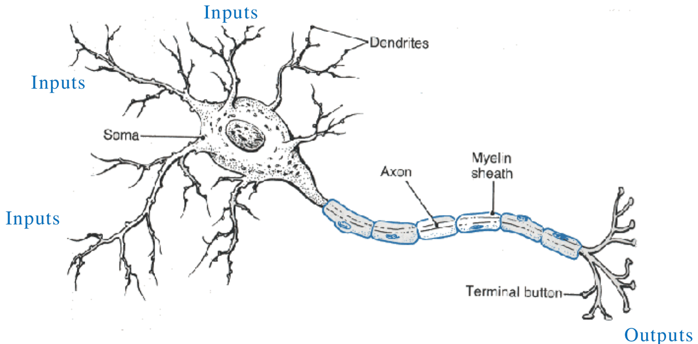
*Fig. 6.1 — Il neurone biologico: dendriti (input), soma, assone e terminali (output).*

Il funzionamento, in sintesi: il neurone attraversa cicli di carica e scarica (ioni sodio e potassio); gli input dai dendriti modificano il potenziale della cellula; superata una **soglia**, viene generato uno **spike** (un impulso di tensione), e l'informazione è codificata anche negli intervalli di tempo tra gli spike.

Il segnale si propaga lungo l'assone fino alle **sinapsi**, dove passa (in forma chimica, tramite **neurotrasmettitori**) al neurone successivo. Le sinapsi possono essere **eccitatorie** o **inibitorie**, e soprattutto cambiano con l'apprendimento: la loro forza (il "peso") si rinforza in risposta agli stimoli. È la **plasticità** del sistema nervoso.

> [!definition] Apprendimento hebbiano (Hebb, 1949)
>
> Una sinapsi si rafforza quando gli input del neurone (e gli output correlati) si ripetono. Lo stimolo in ingresso rinforza la sinapsi, quindi **i pesi si avvicinano agli input**.

---

## Il neurone artificiale

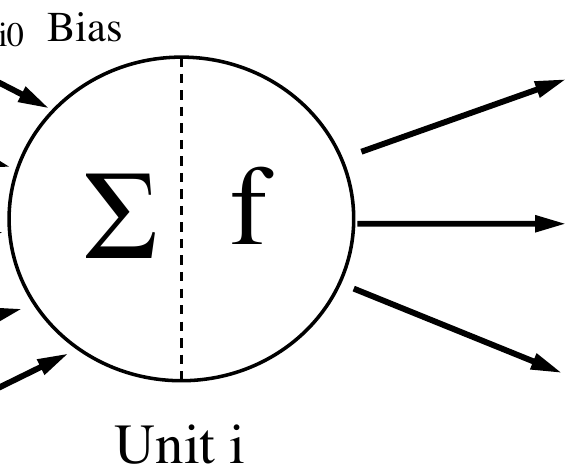
*Fig. 6.2 — L'unità di elaborazione (neurone artificiale).*

Un'**unità** (nodo, neurone) riceve input da sorgenti esterne o da altre unità. Ogni connessione ha un **peso** $w$, parametro libero modificabile dall'apprendimento (l'analogo della forza sinaptica). L'unità $i$ calcola:
$$
net_i(\mathbf{x}) = \sum_j w_{ij}\, x_j, \qquad o_i(\mathbf{x}) = f\big(net_i(\mathbf{x})\big).
$$

- La somma pesata $net_i$ è l'**input netto** (*net input*) dell'unità $i$; include il bias $w_{i0}$ tramite l'input costante $x_0 = 1$.
- $f$ è la **funzione di attivazione** (lineare, a soglia, sigmoidale...).

> [!warning] Notazione dei pesi
>
> $w_{ij}$ è il peso **dell'unità $i$**, cioè della connessione **dall'input/unità $j$ verso l'unità $i$** (non il contrario). Alcune fonti (ad esempio Wikipedia nella sezione sulla backpropagation, e alcune librerie) usano la convenzione opposta; nel corso si usa sempre quella tradizionale: il primo indice è l'unità che riceve.

Tre funzioni di attivazione classiche:

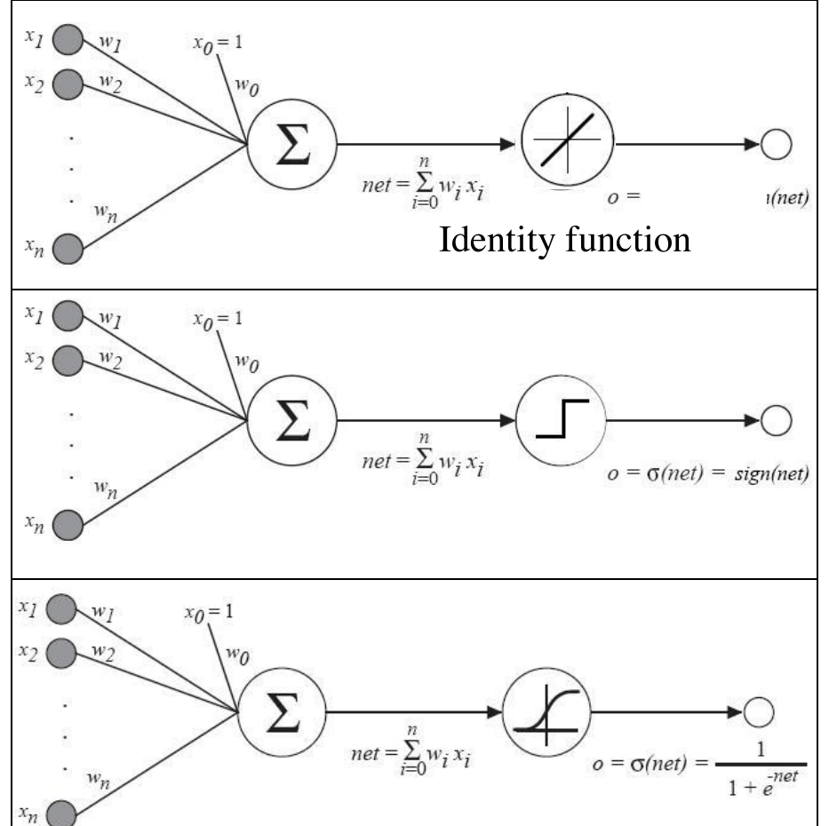
*Fig. 6.3 — Funzione di attivazione lineare (identità), a soglia (Perceptron) e logistica (sigmoide).*

1. **lineare** (identità): $h(\mathbf{x}) = \sum_i w_i x_i$;
2. **a soglia** (gradino): è il **Perceptron**, cioè la LTU già vista;
3. **logistica** (sigmoide): vedi più avanti.

---

## Il Perceptron

Il **Perceptron** fu proposto da Frank Rosenblatt (1957–1960) per la classificazione di pattern, simulando la percezione umana: un "occhio" di fotocellule collegato a unità che calcolano una combinazione pesata con soglia.

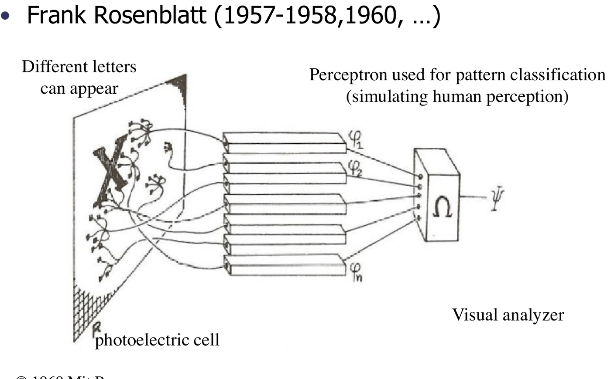
*Fig. 6.4 — Il Perceptron originale, usato per riconoscere lettere.*

Il singolo neurone è un'unità computazionale semplicissima. Minsky: *"per il tipo di riconoscimento che sa fare, è una macchina così semplice che sarebbe sorprendente se la natura non la usasse da qualche parte"*. Il Perceptron è un modello di importanza storica e **paradigmatico** per il passaggio dai modelli lineari a quelli non lineari: componendo e collegando perceptron si ottengono le reti **MLP** (*Multi-Layer Perceptron*).

### Le reti di McCulloch e Pitts (1943)

Il primo modello, *"A logical calculus of the ideas immanent in nervous activity"* (1943), si chiedeva cosa calcola una rete data e se una rete può calcolare una data formula logica.

- I neuroni hanno due stati: attivo (1) e non attivo (0).
- Tutte le sinapsi sono equivalenti e caratterizzate da un numero reale (la forza $w$), positivo per connessioni **eccitatorie** e negativo per **inibitorie**.
- Un neurone $i$ si attiva quando la somma dei pesi $w_{ij}$ provenienti dai neuroni $j$ attivi, più un bias, supera zero.

Input e output binari: sostanzialmente è la LTU/Perceptron.

#### Rappresentare funzioni booleane

Con $net = \mathbf{w}^T\mathbf{x} = \sum_{i=0}^n w_i x_i$ e uscita $1$ se $net > 0$, $0$ (o $-1$) altrimenti:

- **AND**: $w_1 = w_2 = 1$, $w_0 = -1{,}5$ (serve che entrambi gli input valgano 1 per superare $1{,}5$);
- **OR**: $w_1 = w_2 = 1$, $w_0 = -0{,}5$ (basta un input a 1).

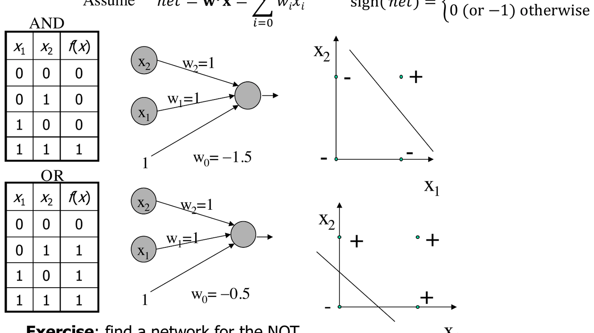
*Fig. 6.5 — AND e OR realizzati da un singolo perceptron.*

(Esercizio: il NOT si ottiene con $w_1 = -1$, $w_0 = 0{,}5$: per $x_1 = 0$ il net è $0{,}5 > 0$, per $x_1 = 1$ è $-0{,}5$.)

#### Lo XOR e le reti a due strati

Lo **XOR** non è linearmente separabile: nessun singolo perceptron lo può rappresentare (Minsky e Papert, 1969). Si può però scomporre:
$$
x_1 \oplus x_2 = x_1\bar{x}_2 + \bar{x}_1 x_2 = \bar{h}_1 \cdot h_2, \qquad \text{con } h_1 = x_1 \cdot x_2 \text{ (AND)}, \quad h_2 = x_1 + x_2 \text{ (OR)}.
$$

> [!theorem] XOR come composizione di AND e OR
>
> Per De Morgan, $\overline{h_1} = \overline{a \wedge b} = \bar a \vee \bar b$. Quindi
> $$
> \bar h_1 \wedge h_2 = (\bar a \vee \bar b) \wedge (a \vee b) = (\bar a \wedge a) \vee (\bar a \wedge b) \vee (a \wedge \bar b) \vee (b \wedge \bar b) = (\bar a \wedge b) \vee (a \wedge \bar b) = a \oplus b.
> $$

Si costruisce così una rete a **due strati**: due unità nascoste calcolano $h_1$ (AND) e $h_2$ (OR), e un'unità di uscita calcola $\bar h_1 \wedge h_2$ (pesi $-1$ da $h_1$ e $+1$ da $h_2$, bias $-0{,}5$).

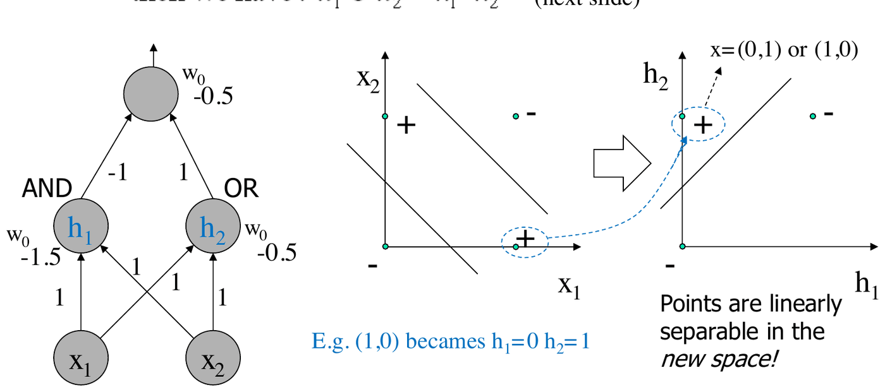
*Fig. 6.6 — Lo XOR con una rete a due strati: nello spazio delle unità nascoste $(h_1, h_2)$ i punti diventano linearmente separabili.*

### Lo strato nascosto come rappresentazione

La figura mostra il concetto chiave: lo strato nascosto produce una **ri-rappresentazione interna** degli input. Il punto $(1,0)$, che nello spazio originale sta nell'angolo in basso a destra, diventa $h_1 = 0$, $h_2 = 1$: i due punti positivi $(0,1)$ e $(1,0)$ vengono mappati **nello stesso punto** $(0,1)$ dello spazio nascosto, e il problema diventa linearmente separabile per l'unità di uscita.

> [!tip] Il concetto più importante delle reti neurali
>
> Sviluppare **feature di alto livello** negli strati nascosti è il fattore chiave delle reti neurali: la rappresentazione nello strato nascosto rende più facile il compito dello strato di uscita. Questa composizione di operazioni intermedie può essere estesa su **molti strati di astrazione**, e — a differenza di quanto visto qui, dove i pesi sono scelti a mano — nelle reti neurali queste rappresentazioni **si apprendono**. È l'idea alla base del *representation learning* e del **deep learning**.

> [!abstract] Proprietà delle reti di perceptron
>
> - I perceptron rappresentano AND, OR, NOT (e quindi NAND, NOR) → **ogni funzione booleana** può essere rappresentata da una rete di perceptron.
> - **Due livelli** bastano (più livelli possono essere più efficienti).
> - Un singolo strato non basta (Minsky e Papert, 1969): limiti dovuti alla separabilità lineare.
> - Finora però **non abbiamo alcun algoritmo di apprendimento**, nemmeno per una singola unità.

---

## Apprendimento per una singola unità

Storicamente ci sono due famiglie di metodi:

1. **Adaline** (*Adaptive Linear Neuron*, Widrow e Hoff): durante il training l'unità è **lineare**; si usano la soluzione diretta LMS o la discesa del gradiente (esattamente come nella lezione sui modelli lineari). Serve per regressione e, con la soglia, classificazione. È l'approccio che generalizzeremo agli MLP.
2. **Perceptron** (Rosenblatt): durante il training l'unità è **non lineare** (con funzione a soglia). Solo classificazione; se ne studiano le capacità e la convergenza.

Per costruire un classificatore lineare abbiamo quindi tre algoritmi: LMS diretto, LMS a gradiente e ora l'algoritmo del Perceptron (e altri verranno, come le SVM).

### L'algoritmo di apprendimento del Perceptron

L'obiettivo è **minimizzare il numero di pattern classificati male**: trovare $\mathbf{w}$ tale che $\operatorname{sign}(\mathbf{w}^T\mathbf{x}) = d$. È un algoritmo **on-line** (un passo per ogni pattern).

> [!abstract] Perceptron Learning Algorithm
>
> 1. Inizializzare i pesi (a zero o a piccoli valori casuali).
> 2. Scegliere un learning rate $\eta \in (0, 1)$.
> 3. Finché non è soddisfatta la condizione di arresto (es. i pesi non cambiano più), per ogni pattern $(\mathbf{x}, d)$ con $d \in \{+1, -1\}$:
>    - calcolare $out = \operatorname{sign}(\mathbf{w}^T\mathbf{x})$;
>    - se $out = d$, **non cambiare i pesi**;
>    - se $out \ne d$, aggiornare: $\mathbf{w}_{new} = \mathbf{w} + \eta\, d\, \mathbf{x}$.

In pratica si aggiunge $\eta\mathbf{x}$ se $\mathbf{w}^T\mathbf{x} \le 0$ e $d = +1$ (falso negativo), si sottrae $\eta\mathbf{x}$ se $\mathbf{w}^T\mathbf{x} > 0$ e $d = -1$ (falso positivo). In forma equivalente:
$$
\mathbf{w}_{new} = \mathbf{w} + \tfrac{1}{2}\eta\,(d - out)\,\mathbf{x},
$$
perché $d - out$ vale $0$ se la classificazione è corretta e $\pm 2$ se è sbagliata.

> [!warning] Differenza con LMS
>
> La formula sembra quella dell'LMS, ma qui $out$ contiene il **segno**: $out = \operatorname{sign}(\mathbf{w}^T\mathbf{x})$, mentre nell'LMS l'errore era calcolato su $\mathbf{w}^T\mathbf{x}$ (senza soglia).

#### Vista geometrica

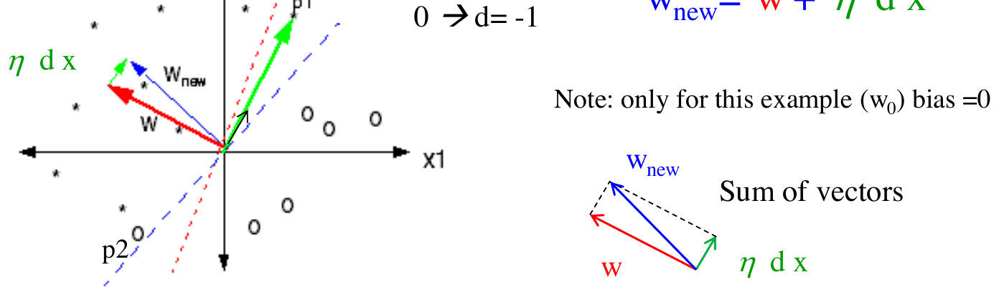
*Fig. 6.7 — Aggiornamento del Perceptron: $\mathbf{w}$ viene spostato nella direzione del pattern $p_1$ mal classificato.*

Prima dell'aggiornamento $\mathbf{w}$ (che punta verso la regione positiva) classifica male sia $p_1$ sia $p_2$. Scegliendo $p_1$, che ha target $d = +1$, $\mathbf{w}$ viene spostato di un po' nella direzione di $p_1$ (somma vettoriale $\mathbf{w} + \eta d\mathbf{x}$), e il nuovo confine è migliore. (Esercizio: se si sceglie $p_2$, con $d = -1$, $\mathbf{w}$ viene allontanato da $p_2$.)

### Delta rule: due letture

- La forma $\mathbf{w}_{new} = \mathbf{w} + \eta\, d\,\mathbf{x}$ si può leggere come **apprendimento hebbiano**: $\mathbf{w}$ si muove verso $\mathbf{x}$.
- La forma $\mathbf{w}_{new} = \mathbf{w} + \eta\,(d - out)\,\mathbf{x} = \mathbf{w} + \eta\,\delta\,\mathbf{x}$ è una regola di **correzione dell'errore** (delta rule, Widrow-Hoff): il peso cambia in proporzione all'errore.

In termini di neuroni: *la modifica di un peso sinaptico è proporzionale al prodotto del segnale d'errore per il segnale di input che eccita la sinapsi*. Il calcolo è facile quando il segnale d'errore $\delta$ è **direttamente misurabile**, cioè quando conosciamo la risposta desiderata per l'unità. (Questo sarà il problema nelle reti con strati nascosti.)

### Rappresentare e apprendere

Il Perceptron può **rappresentare** confini di decisione lineari, quindi risolve i problemi linearmente separabili. Ma riesce sempre a **imparare** la soluzione? Sì: il Perceptron con il suo algoritmo è sempre in grado di apprendere ciò che può rappresentare.

> [!note] Un risultato storico
>
> Il teorema di convergenza è una pietra miliare: un modello **ispirato alla biologia**, con capacità computazionali ben definite e **dimostrate matematicamente**.

### Il teorema di convergenza del Perceptron

> [!theorem] Teorema di convergenza del Perceptron
>
> Se il problema è **linearmente separabile**, l'algoritmo del Perceptron converge (classificando correttamente tutti i pattern) in un **numero finito di passi**, indipendentemente dal punto di partenza (anche se la soluzione finale non è unica e dipende dal punto di partenza).
>
> Se il problema non è separabile, l'algoritmo può essere instabile: sviluppa **cicli**, con pesi non necessariamente ottimali.

Nella dimostrazione omettiamo la $T$ nei prodotti scalari tra vettori.

#### Preliminari 1: ridursi a pattern tutti positivi

Siano $(\mathbf{x}_i, d_i)$ gli esempi di training, $d_i \in \{+1, -1\}$, $i = 1,\dots,l$. Se il problema è linearmente separabile esiste una soluzione $\mathbf{w}^*$ tale che
$$
d_i(\mathbf{w}^*\mathbf{x}_i) \ge \alpha, \qquad \text{con } \alpha = \min_i d_i(\mathbf{w}^*\mathbf{x}_i) > 0.
$$
Quindi $\mathbf{w}^*(d_i\mathbf{x}_i) \ge \alpha$. Definendo $\mathbf{x}'_i = d_i\mathbf{x}_i$, **$\mathbf{w}^*$ è una soluzione del problema originale se e solo se è soluzione del problema $(\mathbf{x}'_i, +1)$** con tutti i target positivi:

- (se) $\mathbf{w}^*$ risolve il problema originale $\Rightarrow d_i(\mathbf{w}^*\mathbf{x}_i) \ge \alpha \Rightarrow \mathbf{w}^*\mathbf{x}'_i \ge \alpha \Rightarrow \mathbf{w}^*$ risolve $(\mathbf{x}'_i, +1)$;
- (solo se) il ragionamento inverso.

Basta quindi dimostrare il teorema per un problema con **soli pattern positivi**: "ribaltare" i pattern negativi non cambia nulla.

#### Preliminari 2: forma dei pesi dopo $q$ errori

Assumiamo $\mathbf{w}(0) = \mathbf{0}$, $\eta = 1$ e definiamo $\beta = \max_i \|\mathbf{x}_i\|^2$. Con soli pattern positivi, la regola diventa $\mathbf{w}(j) = \mathbf{w}(j-1) + \mathbf{x}_{i_j}$ a ogni errore. Dopo $q$ errori (tutti falsi negativi):
$$
\mathbf{w}(q) = \sum_{j=1}^{q} \mathbf{x}_{i_j},
$$
dove $i_j$ indica i pattern classificati male (ad esempio gli indici 2, 8, 9, 14 del training set; lo stesso pattern può comparire più volte).

#### Idea della dimostrazione

Si trovano un **limite inferiore** a $\|\mathbf{w}(q)\|^2$ che cresce come $q^2$ e un **limite superiore** che cresce come $q$. Poiché una funzione quadratica supera prima o poi una lineare, i due limiti sono compatibili solo per $q$ fino a un certo valore massimo: il numero di errori (e quindi di aggiornamenti) è finito.

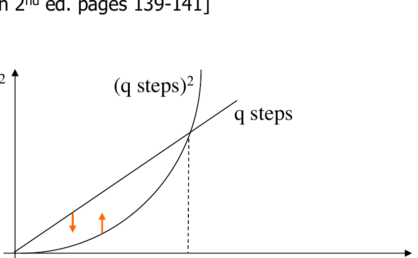
*Fig. 6.8 — Idea della dimostrazione: il limite inferiore quadratico e il limite superiore lineare si incontrano in $q_{max}$.*

#### Limite inferiore

$$
\mathbf{w}^{*T}\mathbf{w}(q) = \mathbf{w}^{*T}\sum_{j=1}^{q}\mathbf{x}_{i_j} \ge q\alpha,
$$
perché ogni termine $\mathbf{w}^{*T}\mathbf{x}_{i_j}$ è almeno $\alpha$. Per la **disuguaglianza di Cauchy-Schwarz**, $\|\mathbf{a}\|^2\|\mathbf{b}\|^2 \ge (\mathbf{a}^T\mathbf{b})^2$; con $\mathbf{a} = \mathbf{w}^*$ e $\mathbf{b} = \mathbf{w}(q)$:
$$
\|\mathbf{w}^*\|^2\,\|\mathbf{w}(q)\|^2 \ge \big(\mathbf{w}^{*T}\mathbf{w}(q)\big)^2 \ge (q\alpha)^2 \quad\Rightarrow\quad \|\mathbf{w}(q)\|^2 \ge \frac{(q\alpha)^2}{\|\mathbf{w}^*\|^2}.
$$

#### Limite superiore

Usando $\|\mathbf{a} + \mathbf{b}\|^2 = \|\mathbf{a}\|^2 + 2\mathbf{a}\mathbf{b} + \|\mathbf{b}\|^2$:
$$
\|\mathbf{w}(q)\|^2 = \|\mathbf{w}(q-1) + \mathbf{x}_{i_q}\|^2 = \|\mathbf{w}(q-1)\|^2 + 2\,\mathbf{w}(q-1)\,\mathbf{x}_{i_q} + \|\mathbf{x}_{i_q}\|^2.
$$
Poiché $\mathbf{x}_{i_q}$ è stato classificato male (è il $q$-esimo errore), $\mathbf{w}(q-1)\,\mathbf{x}_{i_q} \le 0$: eliminando questo termine non positivo si ottiene
$$
\|\mathbf{w}(q)\|^2 \le \|\mathbf{w}(q-1)\|^2 + \|\mathbf{x}_{i_q}\|^2,
$$
e iterando (con $\mathbf{w}(0) = \mathbf{0}$):
$$
\|\mathbf{w}(q)\|^2 \le \sum_{j=1}^{q}\|\mathbf{x}_{i_j}\|^2 \le q\beta.
$$

#### Conclusione

Mettendo insieme i due limiti:
$$
q\beta \;\ge\; \|\mathbf{w}(q)\|^2 \;\ge\; \frac{(q\alpha)^2}{\|\mathbf{w}^*\|^2} \quad\Rightarrow\quad q \le \frac{\beta\,\|\mathbf{w}^*\|^2}{\alpha^2}.
$$
Il numero di errori (e quindi di aggiornamenti) è limitato da una costante: l'algoritmo converge in un **numero finito di passi**. $\blacksquare$

> [!tip] Interpretazione del bound
>
> Il numero di passi cresce con $\beta$ (quanto sono "grandi" i pattern) e decresce con $\alpha^2$: $\alpha$ misura quanto il problema è "ben separato" (il margine minimo della soluzione $\mathbf{w}^*$). Problemi con classi vicine all'iperpiano separatore richiedono più passi. L'idea di **margine** tornerà centrale nelle SVM.

---

## Perceptron contro LMS

Le due regole sembrano simili ($\mathbf{w}_{new} = \mathbf{w} + \eta\,\delta\,\mathbf{x}$), ma:

- l'LMS è derivato (tramite il gradiente) **senza** funzione a soglia, minimizzando l'errore dell'unità lineare: $\delta = d - \mathbf{w}^T\mathbf{x}$;
- il Perceptron usa l'uscita con soglia: $\delta = d - \operatorname{sign}(\mathbf{w}^T\mathbf{x})$.

Naturalmente il modello addestrato con LMS si può usare per classificare applicando la soglia ($h(\mathbf{x}) = \operatorname{sign}(\mathbf{w}^T\mathbf{x})$, LTU).

Una conseguenza importante: **l'LMS può classificare male anche problemi linearmente separabili**. L'LMS non minimizza il numero di errori della LTU, ma l'errore quadratico, e modifica i pesi **anche per i pattern già classificati correttamente**. Un pattern corretto ma "lontano" dall'iperpiano (con $\mathbf{w}^T\mathbf{x}$ molto maggiore di 1) produce comunque un errore quadratico grande che "tira" l'iperpiano.

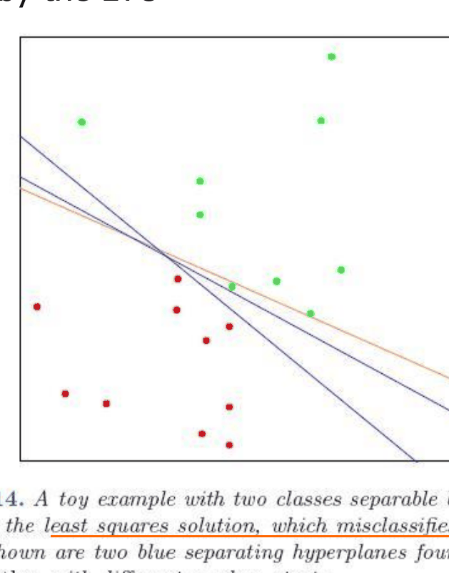
*Fig. 6.9 — Un problema separabile: la soluzione LMS (arancione) sbaglia un punto, il Perceptron (blu, due diverse inizializzazioni) separa tutto (Hastie et al., Fig. 4.14).*

| Perceptron Learning Algorithm | LMS |
|---|---|
| Minimizza le classificazioni errate ($out = \operatorname{sign}(\mathbf{w}^T\mathbf{x})$) | Minimizza $E(\mathbf{w})$ con $out = \mathbf{w}^T\mathbf{x}$ |
| Converge sempre per problemi separabili, in un numero finito di passi, a un classificatore perfetto | Convergenza **asintotica**, anche per problemi non separabili |
| Non converge se il problema non è separabile | Non sempre zero errori di classificazione, anche su problemi separabili |
| Difficile da estendere a reti di unità | **Estendibile a reti** con l'approccio a gradiente |

L'ultima riga è decisiva: per costruire reti neurali serve un approccio basato sul **gradiente**, che richiede funzioni differenziabili.

---

## Funzioni di attivazione sigmoidali

Oltre alla lineare e alla soglia, si usano funzioni **non lineari "a schiacciamento"** (*squashing*) come la **sigmoide logistica**, che assume valori continui nell'intervallo limitato $[0,1]$:
$$
f_\sigma(x) = \frac{1}{1 + e^{-ax}}.
$$
È una **versione liscia e differenziabile della funzione soglia**. Il parametro $a$ è la **pendenza** (*slope*).

![A sinistra la sigmoide logistica con pendenze a = 0.5 (verde), 1 (rossa), 2 (blu), con valori in [0,1]; a destra la tangente iperbolica con valori in [−1,+1]|640](assets/06-nn1_sigmoidi.png)
*Fig. 6.10 — Sigmoide logistica (sinistra) per diversi valori di $a$ e tangente iperbolica (destra).*

La versione simmetrica è la **tangente iperbolica**, con valori in $[-1, +1]$:
$$
f_{symm}(x) = 2f_\sigma(x) - 1 = \tanh(ax/2).
$$

Vicino a zero la sigmoide è quasi lineare (**semi-linearità**). Al variare di $a$:

- per $a \to 0$ la funzione tende a una funzione **lineare** (molto piatta);
- per $a \to \infty$ tende alla funzione **a gradino** (LTU).

Per la classificazione, con la logistica un'uscita $\ge 0{,}5$ corrisponde alla classe positiva e $< 0{,}5$ alla classe zero/negativa (per la tanh la soglia è 0). La soglia si può spostare (studiando l'effetto su falsi positivi/negativi o con una curva ROC), e si può anche definire una **zona di rifiuto** attorno alla soglia per evitare decisioni fragili.

### Altre funzioni di attivazione

- **Funzioni a base radiale** (RBF): $f(x) = e^{-ax^2}$ applicata a $\|\mathbf{w} - \mathbf{x}_{input}\|$, cioè una gaussiana centrata sui pesi → **reti RBF**.
- **Softmax**: per il caso con uscite multiple (vedi lezioni successive).
- **Neuroni stocastici**: uscita $+1$ con probabilità $P(net)$, $-1$ altrimenti → **macchine di Boltzmann** e modelli della meccanica statistica.
- Approssimazioni **lineari a tratti** della tanh, per calcoli efficienti (anche con shift binari).
- **ReLU** (*Rectified Linear Unit*): $f(x) = \max(0, x)$. È diventata la scelta predefinita per i modelli profondi; se ne parlerà nel deep learning.
- **Softplus**, la sua approssimazione liscia: $f(x) = \ln(1 + e^x)$.

Molte funzioni di attivazione hanno prestazioni simili in pratica.

### Derivate

- La derivata dell'identità è 1.
- La derivata della funzione a gradino **non è definita** (in zero) ed è nulla altrove: è esattamente il motivo per cui non si usa con LMS.
- Per le sigmoidi (con $a = 1$):
$$
\frac{df_\sigma(x)}{dx} = f_\sigma(x)\big(1 - f_\sigma(x)\big), \qquad \frac{d\tanh(x)}{dx} = 1 - \tanh^2(x).
$$
(Con $a$ generico: $\frac{df_\sigma}{dx} = a\,f_\sigma(x)(1 - f_\sigma(x))$.)

> [!note] Derivazione della derivata della logistica
>
> $f_\sigma(x) = (1 + e^{-x})^{-1}$, quindi $f'_\sigma(x) = \frac{e^{-x}}{(1 + e^{-x})^2} = \frac{1}{1 + e^{-x}} \cdot \frac{e^{-x}}{1 + e^{-x}} = f_\sigma(x)\big(1 - f_\sigma(x)\big)$, perché $\frac{e^{-x}}{1 + e^{-x}} = 1 - \frac{1}{1 + e^{-x}}$. È comodo: la derivata si calcola dal valore della funzione stessa.

### LMS con un'unità sigmoidale

Poiché la logistica è una soglia liscia e differenziabile, possiamo derivare un algoritmo LMS calcolando il gradiente dell'errore quadratico come per le unità lineari: si passa da $o(\mathbf{x}) = \mathbf{x}^T\mathbf{w}$ a $o(\mathbf{x}) = f_\sigma(\mathbf{x}^T\mathbf{w})$, e si minimizza
$$
E(\mathbf{w}) = \sum_{p=1}^{l}\big(d_p - f_\sigma(\mathbf{x}_p^T\mathbf{w})\big)^2.
$$

Il gradiente si ottiene con la **regola della catena**, $\frac{\partial f}{\partial x} = \frac{\partial f}{\partial g}\frac{\partial g}{\partial x}$, usando come variabili ausiliarie $g = net$ e poi $g = out$. Per un pattern $p$ con $net_p = \mathbf{x}_p^T\mathbf{w}$:
$$
\frac{\partial E_p}{\partial w_j} = \frac{\partial E_p}{\partial o_p}\cdot\frac{\partial o_p}{\partial net_p}\cdot\frac{\partial net_p}{\partial w_j} = -2(d_p - o_p)\cdot f'_\sigma(net_p)\cdot x_{p,j}.
$$
Sommando su tutti i pattern:
$$
\frac{\partial E(\mathbf{w})}{\partial w_j} = -2\sum_{p=1}^{l}\big(d_p - o(\mathbf{x}_p)\big)\, f'_\sigma(net(\mathbf{x}_p))\; x_{p,j} = -2\sum_{p=1}^{l}\delta_p\, x_{p,j}.
$$
Questa derivata risponde alla domanda: **quanto una variazione di $w_j$ influenza la variazione di $E$?**

La discesa del gradiente è identica a quella per l'unità lineare, con un nuovo delta:
$$
\mathbf{w}_{new} = \mathbf{w} + \eta\,\delta_p\,\mathbf{x}_p, \qquad \delta_p = \big(d_p - o(\mathbf{x}_p)\big)\, f'_\sigma(net(\mathbf{x}_p)).
$$

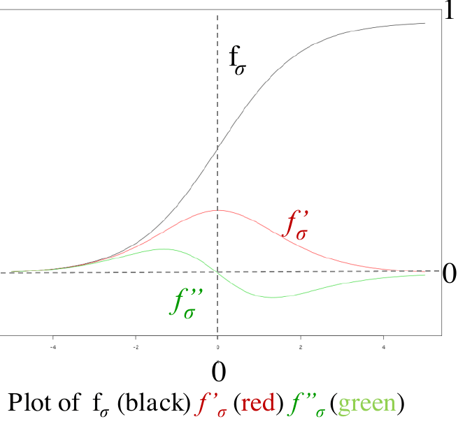
*Fig. 6.11 — La logistica $f_\sigma$ (nero), la sua derivata $f'_\sigma$ (rosso) e la derivata seconda $f''_\sigma$ (verde).*

È ancora una regola di **correzione dell'errore**, con alcune osservazioni:

- la pendenza $a$ influenza l'ampiezza del passo di discesa;
- $f'_\sigma$ è **massima per $net$ vicino a 0** (zona quasi lineare): lì i delta possono essere grandi;
- $f'_\sigma$ è **minima nei casi saturi** ($f$ vicino a 0 o 1): delta piccoli, pesi che cambiano lentissimamente. Bisogna **evitare una saturazione prematura**, ad esempio **partendo con pesi piccoli**.

> [!tip] Un ponte tra LMS e Perceptron
>
> Quando un pattern è classificato correttamente "con decisione" (uscita saturata vicino al target), $f'_\sigma \approx 0$ e la correzione è quasi nulla, proprio come nel Perceptron, che non corregge i pattern corretti. Usando $f_\sigma$ si approssima quindi non solo la LTU, ma anche l'algoritmo del Perceptron.

---

## Le reti neurali: il Multi-Layer Perceptron

Tutti gli ingredienti sono pronti. Un **MLP** si può vedere in due modi:

- **A.** come una **rete di unità interconnesse**;
- **B.** come una **funzione flessibile** $h(\mathbf{x})$, composta da funzioni non lineari annidate.

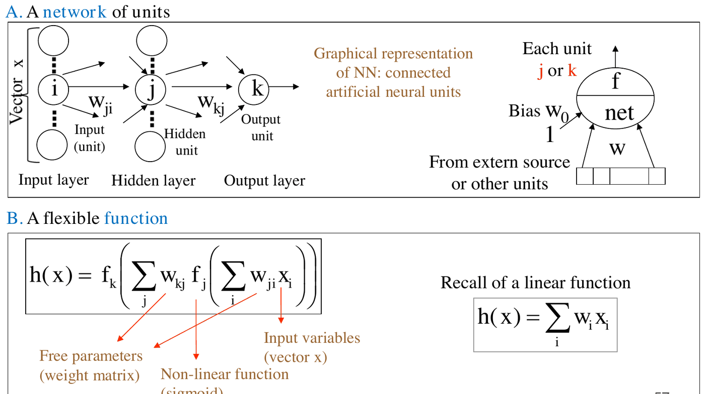
*Fig. 6.12 — Le due viste di una rete feedforward con uno strato nascosto: rete di unità (A) e funzione flessibile (B).*

### Vista A: una rete di unità

In un'architettura MLP:

- le unità sono connesse da collegamenti pesati e organizzate in **strati** (*layer*);
- lo **strato di input** è solo la sorgente dell'input $\mathbf{x}$: carica (copia) il pattern, senza calcolare $net$ né $f$;
- lo **strato nascosto** (*hidden*) proietta sullo strato di uscita (o su un altro strato nascosto);
- lo **strato di uscita** produce $h(\mathbf{x})$.

### Vista B: una funzione flessibile

Una rete a due strati (uno nascosto e uno di uscita) calcola
$$
h(\mathbf{x}) = f_k\left(\sum_j w_{kj}\, f_j\left(\sum_i w_{ji}\, x_i\right)\right),
$$
dove $x_i$ sono le variabili di input, $w$ i parametri liberi (matrici dei pesi) e $f$ funzioni non lineari (sigmoidi). Si confronti con la funzione lineare $h(\mathbf{x}) = \sum_i w_i x_i$: la rete è una composizione di funzioni lineari e non lineari.

### Componenti di una rete neurale

Una rete si descrive tradizionalmente con:

- il tipo di **unità** (net e funzione di attivazione);
- l'**architettura** (numero di unità, topologia, numero di strati);
- l'**algoritmo di apprendimento**.

### Notazione uniforme per le unità

Per una generica unità $t$ (che può essere nascosta, $j$, o di uscita, $k$):
$$
net_t(\mathbf{x}) = \sum_u w_{tu}\, o_u, \qquad o_t(\mathbf{x}) = f_t\big(net_t(\mathbf{x})\big),
$$
dove $u$ indica una generica sorgente di input (che può essere $i$ o $j$). Caricando il pattern nello strato di input, si può usare il simbolo $o$ sia per gli input sia per le uscite delle unità nascoste: l'input all'unità $t$ dalla sorgente $u$ (attraverso la connessione $w_{tu}$) è $o_u$. Questa notazione sarà usata nella derivazione della backpropagation.

> [!example] Esercizio (dalla lezione)
>
> 1. Per i pesi $w_{ji}$ (input → nascosta), l'input $o_u$ è $o_i = x_i$, la componente del pattern.
> 2. Per i pesi $w_{kj}$ (nascosta → uscita), l'input $o_u$ è $o_j$, l'uscita dell'unità nascosta $j$.
> 3. $w_{t0}$ è il **bias** di ciascuna unità $t$, con input costante $o_0 = 1$.
> 4. Unità nascosta: $o_j = f_j\left(\sum_i w_{ji}\,x_i\right)$; unità di uscita: $o_k = f_k\left(\sum_j w_{kj}\,o_j\right)$.

### Architettura e processing feedforward

L'**architettura** definisce la topologia delle connessioni. La rete a due strati descritta sopra è l'MLP standard, **completamente connesso**; si possono avere più strati nascosti e anche connessioni che "saltano" strati.

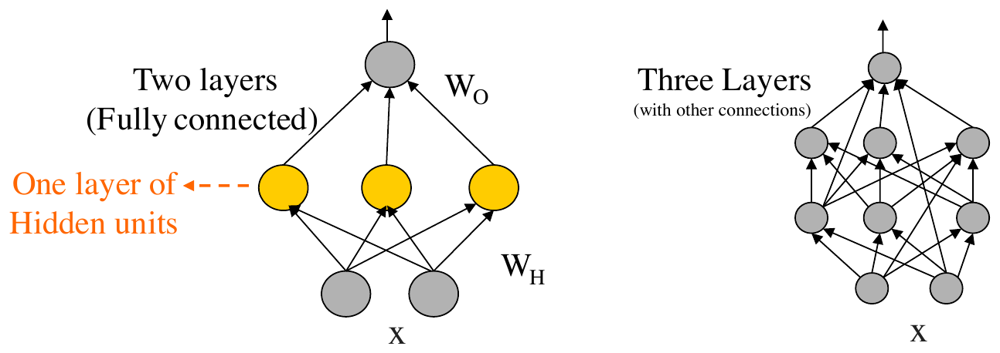
*Fig. 6.13 — Architetture MLP: due strati completamente connessi (sinistra), tre strati con altre connessioni (destra).*

L'elaborazione **feedforward** di un pattern procede dall'input all'uscita:

1. si carica il pattern $\mathbf{x}$ nello strato di input;
2. si calcolano le uscite di tutte le unità del primo strato nascosto;
3. poi del secondo strato nascosto, e così via;
4. si calcolano le uscite dello strato di uscita, cioè $h(\mathbf{x})$;
5. si può ora calcolare l'errore (delta) in uscita.

> [!note] Reti ricorrenti
>
> Le reti **feedforward** hanno un'unica direzione input → output. Le **reti ricorrenti** aggiungono connessioni di feedback (cicli): i self-loop danno alla rete proprietà dinamiche e una **memoria** delle computazioni passate, estendendo il modello all'elaborazione di **sequenze** (e dati strutturati). Saranno trattate in una lezione dedicata.

---

## Perché le reti neurali sono flessibili

Tre domande guidano l'analisi: perché le reti sono un modello flessibile (e si possono vedere come LBE)? La flessibilità è teoricamente fondata? Come si apprendono i pesi?

### Quali task

Lo spazio delle ipotesi è lo **spazio continuo di tutte le funzioni** rappresentabili assegnando valori ai pesi di un'architettura data. A seconda delle unità di uscita, la rete tratta:

- **classificazione**, con uscita sigmoidale;
- **regressione**, con uscita lineare.

Con **più unità di uscita** si ottengono regressione multipla o classificatori multi-classe (ad esempio tre uscite che danno $0{,}2;\ 0{,}7;\ 0{,}1$ per tre classi).

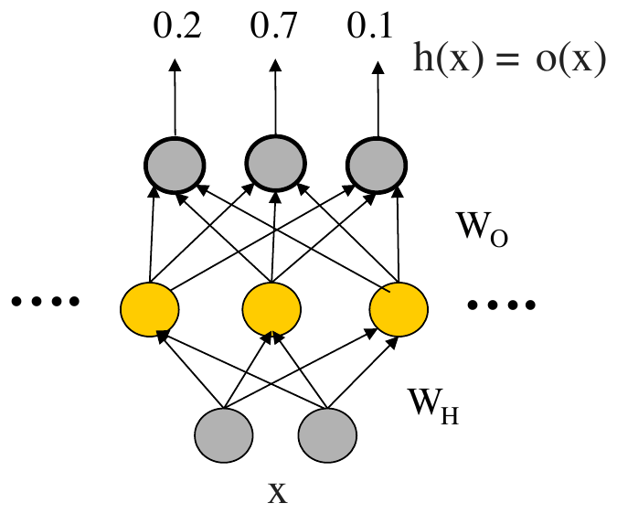
*Fig. 6.14 — Una rete con uscite multiple per un problema multi-classe.*

### La rete come espansione in basi adattiva

La rete calcola $h(\mathbf{x}) = f_k\left(\sum_j w_{kj}\,f_j\left(\sum_i w_{ji}x_i\right)\right)$. Unità e architettura sono solo una rappresentazione grafica del flusso dei dati. Ogni termine
$$
\phi_j(\mathbf{x}, \mathbf{w}) = f_j\left(\sum_i w_{ji}\,x_i\right)
$$
può essere visto come calcolato da un'unità nascosta indipendente, oppure come una **funzione di base $\phi$ di una LBE**. Confrontiamo:

- **LBE**: $h(\mathbf{x}) = \sum_j w_j\,\phi_j(\mathbf{x})$ (regressione) o $h(\mathbf{x}) = f\left(\sum_j w_j\,\phi_j(\mathbf{x})\right)$ (classificazione), con le $\phi$ **fissate a priori** e il modello lineare nei parametri.
- **Rete neurale**: $h(\mathbf{x}) = f_k\left(\sum_j w_{kj}\,\phi_j(\mathbf{x}, \mathbf{w})\right)$, dove ora **le $\phi$ dipendono dai pesi** e quindi **si adattano ai dati** durante l'addestramento.

> [!tip] Le reti neurali come basi adattive
>
> Le reti neurali sono un approccio a **funzioni di base adattive**: le basi stesse vengono adattate ai dati (apprendendo i $\mathbf{w}$ dentro le $\phi$). Tutte le basi hanno lo stesso tipo (dato dalla funzione di attivazione). $h(\mathbf{x})$ è una funzione non lineare di somme pesate di modelli lineari trasformati in modo non lineare, con il miglioramento cruciale dell'**adattività**. (Da confrontare più avanti con le SVM, un'altra forma di LBE.)

Ogni unità nascosta calcola una nuova **feature derivata non lineare**, in modo adattivo. In altre parole: la capacità rappresentativa del modello è legata alla presenza di uno **strato nascosto con attivazioni non lineari**, che trasforma l'input nella **rappresentazione interna** della rete. L'apprendimento definisce una rappresentazione interna adatta, cioè nuove feature nascoste dei dati, che permettono al modello di estrarre le **statistiche di ordine superiore** rilevanti per approssimare la funzione target.

> [!warning] Le unità nascoste devono essere non lineari
>
> Un MLP con unità **lineari** equivale a una rete a **un solo strato**: la composizione di funzioni lineari è lineare. Con $f$ identità, $h(\mathbf{x}) = \sum_j w_{kj}\sum_i w_{ji}x_i = \sum_i\left(\sum_j w_{kj}w_{ji}\right)x_i = \sum_i w'_i x_i$.
>
> Il prezzo della non linearità: il modello è **non lineare nei parametri** $\mathbf{w}$, e l'addestramento diventa un problema di **ottimizzazione non lineare** (non convesso).

### L'approssimazione universale

> [!theorem] Teorema di approssimazione universale (Cybenko 1989, Hornik et al.)
>
> Una rete con **un solo strato nascosto** (con attivazioni logistiche) e uscita lineare può approssimare arbitrariamente bene **ogni funzione continua** (su ipercubi), purché ci siano abbastanza unità nascoste: dati $f$ ed $\varepsilon > 0$, esiste $h$ tale che $|f(\mathbf{x}) - h(\mathbf{x})| < \varepsilon$ per ogni $\mathbf{x}$ nell'ipercubo. Più in generale, un MLP può approssimare arbitrariamente bene ogni mappatura input-output, con abbastanza unità nascoste.

(Si può pensare a una generalizzazione dell'approssimazione con serie di Fourier finite.)

> [!warning] È un teorema di esistenza
>
> Il teorema dice che la rete **esiste**, ma non fornisce né l'**algoritmo** per trovarla né il **numero di unità** necessario.

Restano quindi due questioni fondamentali: **come apprendere** (la backpropagation, prossima lezione) e **come scegliere l'architettura**.

### Potere espressivo e VC-dimension

Il potere espressivo di una rete dipende dal **numero di unità** e dalla loro **configurazione**. Il numero di unità è legato alla VC-dimension: le capacità della rete dipendono dal numero di parametri (in un MLP completamente connesso, circa il numero di input per il numero di unità nascoste, più le unità nascoste per le uscite), ma anche dal **valore** dei pesi:

- pesi $= 0$ → VC-dim minima;
- pesi piccoli → si lavora nella parte lineare della sigmoide → VC-dim piccola;
- pesi grandi → modello più complesso.

Poiché l'addestramento parte da pesi vicini a 0 e i pesi crescono durante il training, la rete è uno **spazio delle ipotesi di dimensione variabile**: la VC-dim effettiva cresce durante l'apprendimento. (Questo sarà la base dell'*early stopping*.)

### Quanti strati? (anticipazione)

Il teorema di approssimazione universale dice che uno strato nascosto basta, ma non garantisce che basti un numero **piccolo** di unità. Esistono risultati di tipo "*no flattening*" (sull'efficienza, non sull'espressività): funzioni che con un solo strato nascosto richiederebbero un numero **esponenziale** di unità (rispetto alla dimensione dell'input), mentre con più strati ne bastano molte meno. Ma è facile addestrare un MLP con molti strati? Lo vedremo nel deep learning.

### Il bias induttivo delle reti neurali

Per le reti addestrate con backpropagation, il bias induttivo è legato alle proprietà di **smoothness** delle funzioni: piccole variazioni dell'input producono piccole variazioni dell'output (ad esempio, derivata prima localmente limitata). È un'assunzione molto comune nel ML, ed è ragionevole: se la funzione target non è liscia (ad esempio un generatore di numeri casuali), la generalizzazione è comunque impossibile.

---

## Verso l'algoritmo di apprendimento

L'algoritmo di apprendimento adatta i pesi della rete per ottenere la migliore approssimazione della funzione target, minimizzando come sempre una funzione d'errore (o loss) sui dati di training.

### Il problema del credit assignment

- Il Perceptron ha un algoritmo di apprendimento, ma non rappresenta tutte le funzioni booleane.
- Una rete di perceptron rappresenta ogni funzione booleana, ma serve un algoritmo per addestrarla.

Cosa cambia? Il **problema del credit assignment**: quanta "responsabilità" dell'errore attribuire alle unità nascoste? Per le unità di uscita conosciamo la risposta desiderata e quindi l'errore; per le unità nascoste **non sappiamo quale dovrebbe essere la loro uscita**, quindi il segnale d'errore non è direttamente misurabile. In più, il modello è non lineare nei pesi.

Minsky e Papert (1969) ritenevano il problema troppo difficile; fu risolto da diversi ricercatori con l'algoritmo di **backpropagation**, reso popolare da Rumelhart, Hinton e Williams nel libro *PDP* (1986): fu il **rinascimento** delle reti neurali.

### Il loading problem

> [!definition] Loading problem
>
> Data una rete e un insieme di esempi, esiste un insieme di pesi per cui la rete è consistente con gli esempi? ("Caricare" i dati di training nei parametri liberi della rete.)

Il loading problem è **NP-completo** (Judd, 1990): non è noto un algoritmo polinomiale. In pratica, però, le reti si addestrano in tempi ragionevoli con la backpropagation, anche se la soluzione ottima non è garantita.

### L'idea chiave: estendere la discesa del gradiente

La discesa del gradiente che minimizza una loss **si estende agli MLP**, purché loss e funzioni di attivazione siano **differenziabili**: si tratta di trovare il delta per **ogni** unità della rete. Il problema resta lo stesso: dati $l$ esempi $(\mathbf{x}_p, d_p)$ e una loss $L$ (ad esempio $L(h(\mathbf{x}_p), d_p) = (d_p - h_\mathbf{w}(\mathbf{x}_p))^2$), trovare $\mathbf{w}$ che minimizzi
$$
E(\mathbf{w}) = R_{emp} = \frac{1}{l}\sum_{p=1}^{l}\big(d_p - h(\mathbf{x}_p)\big)^2
$$
calcolandone il gradiente. Servono: loss differenziabile, attivazioni differenziabili e una rete per seguire il flusso dell'informazione.

Proprietà della backpropagation:

- è semplice grazie alla **forma composizionale** del modello;
- usa solo quantità **locali** a ogni unità, preservandone la modularità;
- è **efficiente**: $O(\#W)$ invece di $O(\#W^2)$, grazie alla fattorizzazione dei delta;
- sulla plausibilità biologica il dibattito è aperto (si è ipotizzato che il cervello usi un'approssimazione locale subottima della BP).

La derivazione completa è nella prossima lezione (e nelle note [[07 - Note sulla backpropagation]]).

### Questioni pratiche nell'addestramento

Il modello è spesso **sovra-parametrizzato** e l'ottimizzazione è **non convessa** e potenzialmente instabile. Le questioni da affrontare (dopo la backpropagation) sono: valori iniziali dei pesi, learning rate, on-line/batch; overfitting e regolarizzazione; scalatura dell'input e rappresentazione dell'output; numero di unità nascoste; minimi multipli; criteri di arresto.

> [!abstract] Sintesi
>
> Il neurone artificiale calcola $o = f(\sum_j w_j x_j)$. Il **Perceptron** (soglia) ha un algoritmo di apprendimento che **converge in un numero finito di passi** per problemi linearmente separabili, ma non rappresenta lo XOR. Reti di perceptron a due strati rappresentano ogni funzione booleana grazie alla **ri-rappresentazione interna** dello strato nascosto. Sostituendo la soglia con una **sigmoide** differenziabile si può usare la discesa del gradiente. L'**MLP** è una funzione annidata $h(\mathbf{x}) = f_k(\sum_j w_{kj} f_j(\sum_i w_{ji} x_i))$, interpretabile come **espansione in basi adattiva**, ed è un **approssimatore universale**. Per addestrarlo bisogna risolvere il **credit assignment** delle unità nascoste: lo fa la backpropagation.

> [!question] Possibili domande d'esame
>
> - Descrivere il neurone artificiale e le principali funzioni di attivazione.
> - Come si rappresentano AND, OR, NOT con un perceptron? Come si risolve lo XOR?
> - Scrivere l'algoritmo di apprendimento del Perceptron.
> - Enunciare e dimostrare il teorema di convergenza del Perceptron.
> - Differenze tra algoritmo del Perceptron e LMS; perché l'LMS può sbagliare su problemi separabili?
> - Derivare la regola di aggiornamento per una singola unità sigmoidale.
> - Perché le unità nascoste devono essere non lineari?
> - In che senso una rete neurale è una LBE adattiva?
> - Enunciare il teorema di approssimazione universale e discuterne i limiti.
> - Cos'è il problema del credit assignment? E il loading problem?
