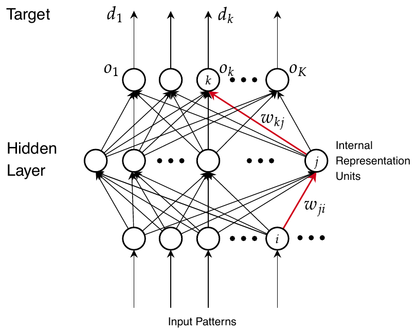
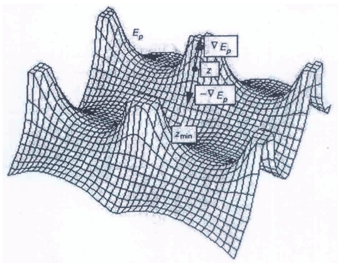
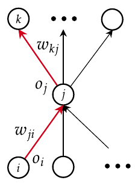
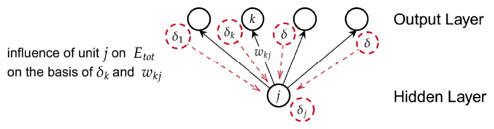

# Note sulla backpropagation

*Appunti di Fabio Piscitelli — Machine Learning (654AA), Prof. Alessio Micheli, Università di Pisa, a.a. 2024/25*

Queste note contengono la **derivazione completa dell'algoritmo di backpropagation**, l'algoritmo che risolve il problema del *credit assignment* nelle reti multistrato introdotto in [[06 - Reti neurali (parte 1) - dal neurone al MLP]]. Il professore insiste su un punto: **la derivazione va rifatta da sé, non memorizzata**. Solo così si è in grado di ricalcolarla per loss, attivazioni o architetture diverse — ed è questo il vero obiettivo. Implementarla nel progetto è il modo migliore per capirla a fondo.

Riferimenti: Rumelhart, Hinton, Williams, *Parallel Distributed Processing* (1986), cap. 8; Mitchell, *Machine Learning*, cap. 4; Haykin, *Neural Networks*.

## Strumenti di calcolo differenziale

La discesa del gradiente richiede derivate di funzioni composte. Servono tre regole:
$$
\frac{\partial f}{\partial x} = \frac{\partial f}{\partial g}\cdot\frac{\partial g}{\partial x} \quad \text{(regola della catena)}, \qquad D[f(g(x))] = f'(g(x))\cdot g'(x), \qquad D[f\cdot g] = f'\cdot g + f\cdot g'.
$$
La regola della catena è utile perché **scompone** il calcolo, mettendo in evidenza ciò che si può calcolare immediatamente senza perdere il filo generale.

## Il problema

L'architettura di base è una rete feedforward completamente connessa (MLP). Si usano indici diversi per gli strati: $i$ per l'input, $j$ per lo strato nascosto, $k$ per l'uscita.

*Fig. 7.1 — La rete di riferimento: input $i$, unità nascoste $j$, unità di uscita $k$.*

> [!definition] Il problema della backpropagation
>
> Stimare il **contributo delle unità nascoste all'errore** in uscita. Lo si fa calcolando la **regola delta generalizzata** (*Generalized Delta Rule*).

Il training set è $TR = \{(\mathbf{x}^1, \mathbf{d}^1), \dots, (\mathbf{x}^l, \mathbf{d}^l)\}$ (apprendimento supervisionato). Ogni unità di input $i$ carica la componente $x_i$ del pattern: $o_i = x_i$.

L'**errore totale** della rete sul training set è
$$
E_{tot} = \sum_p E_p, \qquad E_p = \frac{1}{2}\sum_{k=1}^{K}(d_k - o_k)^2,
$$
dove $E_p$ è l'errore sul pattern $p$ calcolato su tutte le $K$ unità di uscita. (Il fattore $\frac{1}{2}$ serve solo a semplificare la derivata.) Per alleggerire la notazione, d'ora in poi l'indice $p$ viene omesso: $o_k$ sta per $o_k(\mathbf{x}_p)$ e $d_k$ per $d_{p,k}$.

**Obiettivo**: trovare i pesi $\mathbf{w}$ che minimizzano $E_{tot}$ (per ora solo il termine sui dati). È ancora una minimizzazione ai minimi quadrati (LMS). **Idea**: scendere lungo la superficie di $E_{tot}$ seguendo il gradiente.

*Fig. 7.2 — Un paesaggio di $E_{tot}$ nello spazio di due pesi: seguendo $-\nabla E$ dal punto $Z$ si raggiunge $Z_{min}$. A differenza del modello lineare, la superficie non è convessa.*

## L'algoritmo iterativo

Si calcola la loss, se ne calcola il gradiente, si aggiornano tutti i pesi; si ripete fino a convergenza o a un altro criterio di arresto.

> [!abstract] Algoritmo 1 — Backpropagation
>
> Inizializzare tutti i pesi $\mathbf{w}$ della rete e $\eta$.
> Calcolare le uscite delle unità ed $E_{tot}$.
> **Finché** $E_{tot} > \epsilon$ (o altro criterio):
> - per ogni $w \in \mathbf{w}$: $\Delta w = -\dfrac{\partial E_{tot}}{\partial w}$ **(passo 1)**;
> - $w_{new} = w + \eta\,\Delta w + \dots$ **(passo 2)**;
> - ricalcolare le uscite ed $E_{tot}$.

Esistono le versioni stocastica (on-line) e batch. Bisogna distinguere due aspetti:

1. il **calcolo del gradiente** $\partial E_{tot}/\partial w$, per ogni peso della rete: è ciò che fa la backpropagation;
2. la **regola di aggiornamento** dei pesi: backprop standard, Quickprop, R-prop, ...

Ci concentriamo sul passo 1:
$$
\Delta w = -\frac{\partial E_{tot}}{\partial w} = -\sum_p \frac{\partial E_p}{\partial w} \overset{def}{=} \sum_p \Delta_p w.
$$

## La derivazione

### Il gradiente per un peso generico

Consideriamo un peso generico $w_{tu}$, che collega l'input proveniente da un'unità generica $u$ (che può essere $i$ o $j$) all'unità generica $t$. Poiché
$$
net_t = \sum_s w_{ts}\,o_s, \qquad o_t = f_t(net_t),
$$
applicando la regola della catena attraverso $net_t$:
$$
\Delta_p w_{tu} = -\frac{\partial E_p}{\partial w_{tu}} = \underbrace{-\frac{\partial E_p}{\partial net_t}}_{\delta_t}\cdot\underbrace{\frac{\partial net_t}{\partial w_{tu}}}_{o_u} = \delta_t\cdot o_u.
$$
Infatti $\frac{\partial net_t}{\partial w_{tu}} = \frac{\partial \sum_s w_{ts} o_s}{\partial w_{tu}} = o_u$: tutti i termini della somma sono costanti rispetto a $w_{tu}$ tranne quello con $s = u$. (Gli $o_s$ sono gli input dell'unità $t$.)

Abbiamo definito il **delta dell'unità $t$**:
$$
\delta_t = -\frac{\partial E_p}{\partial net_t}.
$$
Espandiamolo ancora con la regola della catena, passando per $o_t = f_t(net_t)$:
$$
\delta_t = -\frac{\partial E_p}{\partial net_t} = -\frac{\partial E_p}{\partial o_t}\cdot\frac{\partial o_t}{\partial net_t} = -\frac{\partial E_p}{\partial o_t}\cdot f'_t(net_t).
$$
Resta da calcolare $-\frac{\partial E_p}{\partial o_t}$, e qui si distinguono due casi: $t$ è un'**unità di uscita** $k$, oppure un'**unità nascosta** $j$.

### Caso 1: unità di uscita ($t = k$)

L'uscita $o_k$ compare direttamente in $E_p$:
$$
-\frac{\partial E_p}{\partial o_k} = -\frac{\partial\,\frac{1}{2}\sum_{r=1}^{K}(d_r - o_r)^2}{\partial o_k} = (d_k - o_k),
$$
perché solo il termine $r = k$ dipende da $o_k$, e la sua derivata è $\frac{1}{2}\cdot 2(d_k - o_k)\cdot(-1)$. Quindi:
$$
\boxed{\delta_k = (d_k - o_k)\cdot f'_k(net_k)}
$$
È esattamente il delta già visto per la singola unità sigmoidale: l'errore è direttamente misurabile perché conosciamo il target.

### Caso 2: unità nascosta ($t = j$)

Per un'unità nascosta non c'è un target: $o_j$ non compare direttamente in $E_p$. Però $o_j$ influenza $E_p$ **attraverso tutte le unità di uscita** a cui è collegata: ogni $net_k$ dipende da $o_j$. Applicando la regola della catena con una somma su tutte le $k$:
$$
-\frac{\partial E_p}{\partial o_j} = \sum_{k=1}^{K}\underbrace{-\frac{\partial E_p}{\partial net_k}}_{\delta_k}\cdot\frac{\partial net_k}{\partial o_j} = \sum_{k=1}^{K}\delta_k\, w_{kj},
$$
poiché $\frac{\partial net_k}{\partial o_j} = \frac{\partial \sum_s w_{ks}\,o_s}{\partial o_j} = w_{kj}$. Quindi:
$$
\boxed{\delta_j = \left(\sum_{k=1}^{K}\delta_k\, w_{kj}\right)\cdot f'_j(net_j)}
$$

> [!tip] Il punto cruciale
>
> Il termine $-\frac{\partial E_p}{\partial net_k}$ **lo abbiamo già calcolato**: è $\delta_k$! Il delta di un'unità nascosta si ottiene quindi **propagando all'indietro** i delta delle unità di uscita, pesati con gli stessi pesi $w_{kj}$ usati nella propagazione in avanti. Da qui il nome **back-propagation**: l'errore "risale" la rete. Questo risolve il credit assignment: la "colpa" di un'unità nascosta è la somma delle colpe delle unità a cui contribuisce, pesata da quanto contribuisce.

*Fig. 7.3 — Usare il grafo della rete per localizzare il calcolo: ogni termine coinvolge solo unità e pesi adiacenti.*

Alcune osservazioni sul caso 2:

- esprime la variazione di $E_p$ considerando **tutte** le unità di uscita $o_k$;
- ogni $o_k$ (e $net_k$) dipende da $o_j$: per questo compare la somma su $k$;
- lo stesso risultato si può ottenere direttamente dalla definizione di $E_p$ (per esercizio), ma questa forma è più istruttiva perché mostra il flusso delle derivate parziali **sulla rete**.

## Sintesi delle formule

Per due strati abbiamo derivato:
$$
\Delta_p w_{tu} = \delta_t\cdot o_u,
$$
dove $\delta_t$ è il **segnale d'errore** disponibile all'unità $t$ e $o_u$ è l'input a $t$ proveniente da $u$ (attraverso la connessione $w_{tu}$). In particolare:

| Peso | Aggiornamento | Delta |
|---|---|---|
| $w_{kj}$ (nascosta → uscita) | $\Delta_p w_{kj} = \delta_k\cdot o_j$ | $\delta_k = (d_k - o_k)\,f'_k(net_k)$ |
| $w_{ji}$ (input → nascosta) | $\Delta_p w_{ji} = \delta_j\cdot o_i$ | $\delta_j = \left(\sum_{k}\delta_k\,w_{kj}\right) f'_j(net_j)$ |

*Fig. 7.4 — Retropropagazione dei delta: l'influenza dell'unità nascosta $j$ su $E_{tot}$ si calcola dai $\delta_k$ dello strato superiore e dai pesi $w_{kj}$.*

### Generalizzazione a $m$ strati nascosti

La derivazione vale per **qualsiasi numero di strati nascosti**: i delta non arrivano solo dallo strato di uscita, ma da qualsiasi strato superiore $h$ a cui l'unità è collegata. In generale, **i delta arrivano da tutte le unità a cui l'unità corrente è connessa**:
$$
\delta_j = \left(\sum_{h \in \text{successori}(j)}\delta_h\,w_{hj}\right) f'_j(net_j).
$$
La regola di aggiornamento per ogni pattern (omettendo $p$) è
$$
w_{tu}^{new} = w_{tu} + \eta\,\delta_t\,o_u.
$$
Usando $\Delta_p w$ per ogni pattern si ottiene la versione **on-line**; per la versione **batch** si sommano i contributi su tutti i pattern prima di aggiornare.

## Il ciclo di addestramento completo

1. **Calcolo in avanti** (*forward*): uscite di tutte le unità, strato per strato.
2. Calcolo degli **errori e dei delta nello strato di uscita**.
3. **Propagazione all'indietro** dei delta dallo strato di uscita agli strati nascosti.
4. **Aggiornamento dei pesi**.
5. Si ricomincia, fino al criterio di arresto.

> [!warning] Non dimenticare i bias
>
> Calcolo e aggiornamento vanno applicati anche ai **bias** di tutte le unità: si assume la prima componente dell'input di ogni unità pari a 1, con il bias come peso $w_{t0}$. Quindi $\Delta w_{t0} = \delta_t \cdot 1$.

## Proprietà e interpretazione

- **Calcoli solo locali**: ogni unità usa direttamente solo informazioni vicine (le unità sotto e sopra), non strati lontani; il resto arriva indirettamente tramite il flusso dei delta. In altre parole: nonostante il calcolo sia locale, la modifica di un peso ha un **effetto globale** sulla rete. Qual è l'influenza di ciascun $w_{tu}$ sull'errore globale? Questo effetto complesso è stato **scomposto** in componenti semplici tramite i delta locali a ogni unità.
- **Visione come processo di diffusione**: la backpropagation è una propagazione locale spazio-temporale dai "genitori" dell'unità all'unità e dall'unità ai suoi "figli".
- **Efficienza — la "fattorizzazione magica"**: il delta $\delta_t$ di ogni unità si calcola **una sola volta** e si riusa per **tutti** i suoi pesi $w_{tu}$. Il costo è quindi proporzionale al **numero di pesi**, non al suo quadrato. Con modelli da miliardi di pesi la differenza è enorme: $10^9$ contro $(10^9)^2 = 10^{18}$ operazioni, che sarebbe infattibile.

> [!tip] Tre livelli di lettura della derivazione
>
> 1. I singoli **passaggi matematici**.
> 2. L'**interpretazione** delle variazioni locali di una quantità rispetto alle altre (il significato delle derivate parziali).
> 3. Il **quadro generale**: la scomposizione serve a trovare i valori delta di ogni livello, scomponendo l'errore **sulla rete** che si ha davanti.

> [!warning] Terminologia corretta
>
> Non si dice "rete backprop": la rete neurale è il **modello**. La backpropagation è un **algoritmo di addestramento** basato sulla retropropagazione degli errori, cioè sul calcolo diretto del gradiente attraverso la rete.

> [!example] Esempio numerico (per verificare la comprensione)
>
> Rete con un input $x = 1$, una unità nascosta sigmoidale e una di uscita lineare, senza bias; pesi $w_{ji} = 0{,}5$, $w_{kj} = 1$, target $d = 1$, $\eta = 0{,}1$.
> - Forward: $net_j = 0{,}5$, $o_j = \sigma(0{,}5) \approx 0{,}622$; $o_k = 1 \cdot 0{,}622 = 0{,}622$.
> - Delta di uscita (lineare, $f' = 1$): $\delta_k = (1 - 0{,}622)\cdot 1 = 0{,}378$.
> - Delta nascosto: $\delta_j = (\delta_k w_{kj})\,\sigma'(net_j) = 0{,}378 \cdot 0{,}622 \cdot (1 - 0{,}622) \approx 0{,}089$.
> - Aggiornamenti: $\Delta w_{kj} = \eta\,\delta_k\,o_j \approx 0{,}1 \cdot 0{,}378 \cdot 0{,}622 \approx 0{,}0235$; $\Delta w_{ji} = \eta\,\delta_j\,x \approx 0{,}0089$.
>
> Entrambi i pesi aumentano, facendo crescere l'uscita verso il target.

> [!question] Possibili domande d'esame
>
> - Derivare la backpropagation per un MLP a due strati con errore quadratico.
> - Cos'è $\delta_t$? Come si calcola per un'unità di uscita e per un'unità nascosta?
> - Perché la backpropagation ha costo lineare nel numero dei pesi?
> - Come cambia la derivazione con una loss diversa o con più strati nascosti?
