# Reti neurali (parte 2): addestramento in pratica

*Appunti di Fabio Piscitelli — Machine Learning (654AA), Prof. Alessio Micheli, Università di Pisa, a.a. 2026/27*

Con la backpropagation ([[07 - Note sulla backpropagation]]) sappiamo calcolare il gradiente per ogni peso della rete. Questa lezione affronta tutte le questioni pratiche che servono per addestrare davvero un MLP: inizializzazione, minimi multipli, versioni on-line/batch/mini-batch, learning rate e momentum, criteri di arresto, overfitting e regolarizzazione, numero di unità (con il Cascade Correlation), rappresentazione di input e output. Chiude una sintesi di pregi e difetti delle reti neurali e i primi consigli per il progetto (benchmark MONK).

*Fig. 8.1 — Zoom sul blocco "reti neurali" del corso.*

## Filosofia

Il ML si è evoluto da una collezione di trucchi euristici a quadri concettuali generali: il professore preferisce non introdurre troppi dettagli euristici. Molte delle tecniche che seguono si possono esplorare sperimentalmente nel progetto; alcune hanno un fondamento teorico (la regolarizzazione) e si applicano in un quadro più generale. Quelle indicate con **(!)** sono molto comuni e **vanno usate** nel progetto.

> [!warning] Diffidare delle "regole empiriche"
>
> Evitare le *rules of thumb* trovate sui blog, a meno che non siano dimostrate in articoli scientifici o non se ne sia verificato sperimentalmente il vantaggio.

> [!tip] Un'interpretazione utile
>
> La backpropagation è un **percorso nello spazio dei pesi** (sulla superficie della loss). Il percorso dipende da: i dati, il modello, il **punto di partenza** (pesi iniziali), la **velocità di convergenza** e il **punto finale** (regola di arresto). Tutte queste scelte costituiscono un **controllo della ricerca** nello spazio delle ipotesi.

L'algoritmo di base resta la discesa del gradiente: pesi iniziali piccoli, $\Delta\mathbf{w} = -\partial E/\partial\mathbf{w}$ (calcolato con la backprop: fase forward fino alle uscite, poi fase backward per i delta), $\mathbf{w}_{new} = \mathbf{w} + \eta\,\Delta\mathbf{w}$, ripetere. Il modello è spesso **sovra-parametrizzato** e l'ottimizzazione è **non convessa** e potenzialmente instabile: da qui le questioni che seguono. Gli **iperparametri** sono i valori che bisogna fissare per eseguire l'addestramento.

---

## Valori iniziali dei pesi

> [!tip] (!) Inizializzazione
>
> Inizializzare i pesi con **valori casuali vicini a zero**, ad esempio nell'intervallo $[-0{,}7;\ +0{,}7]$ (per dati standardizzati).

Da evitare:

- **tutti zero**: i delta delle unità nascoste sarebbero tutti nulli (dipendono dai pesi verso l'uscita) e la rete non imparerebbe;
- **valori alti**: le sigmoidi partono **saturate**, con derivate quasi nulle e apprendimento lentissimo;
- **tutti uguali**: le unità nascoste restano **simmetriche** (ricevono gli stessi aggiornamenti e calcolano tutte la stessa cosa). La casualità serve a **rompere la simmetria**.

Si può tenere conto del **fan-in** (numero di input di un'unità), ad esempio con un intervallo pari a $\text{range}\cdot 2/\text{fan-in}$, ma non se il fan-in è troppo grande e non per le unità di uscita (altrimenti i delta partono vicini a zero). Molto popolare è l'inizializzazione di **Glorot e Bengio** (2010): bias a 0 e pesi da una distribuzione uniforme in $[-1/a, +1/a]$ con $a = \sqrt{\text{fan-in}}$ (o, in risultati successivi, $a$ dipendente anche dal fan-out).

> [!note] (!) Per il progetto
>
> Una rete molto piccola (pochissime unità) può dipendere fortemente dall'inizializzazione.

## Minimi multipli

La loss **non è convessa**: ci sono molti minimi locali, e il risultato dipende dai pesi iniziali. Quindi:

> [!tip] (!) Più inizializzazioni
>
> Provare diverse configurazioni iniziali casuali (ad esempio 5–10 o più *trial*). Per valutare il modello si riporta la **media** dei risultati (media degli errori) e la **varianza**. Se si vuole un'unica risposta, si può scegliere la soluzione con il più basso errore di validazione (o la mediana), oppure sfruttare i diversi punti finali con una risposta **di comitato** (media delle uscite o voto). Più avanti si vedrà perché gli *ensemble* sono vantaggiosi in generale.

Fermarsi in un minimo locale con errore troppo alto non è un grosso problema: si vede l'errore finale e si può ricominciare. Spesso un **"buon" minimo locale è sufficiente**.

### Serve davvero il minimo globale?

Due osservazioni fondamentali:

1. Nel ML **non cerchiamo né il minimo locale né quello globale di $R_{emp}$**, ma il minimo di $R$, che non possiamo calcolare. Spesso ci si ferma in un punto che non ha nemmeno gradiente nullo.
2. La rete è uno **spazio delle ipotesi di dimensione variabile**: durante l'addestramento la VC-dim cresce, l'errore di training scende verso zero (o il minimo globale) mentre la rete diventa troppo complessa. Bisogna fermarsi **prima** di questa condizione di *overtraining* (e quindi overfitting), indipendentemente dalla questione minimi locali/globali.

---

## On-line, batch e mini-batch

Ricordiamo (vedi i modelli lineari):

- **Batch**: si sommano i gradienti di tutti i pattern di un'**epoca** (un ciclo completo di presentazione del training set) e poi si aggiornano i pesi.
- **On-line/stocastico**: si aggiorna $\mathbf{w}$ dopo ogni pattern $p$ con $\Delta_p\mathbf{w}$, senza aspettare la somma. Progredisce a ogni esempio, può essere più veloce, ma richiede $\eta$ più piccolo.

In formule, per il peso $w_{tu}$:
$$
\text{batch: } -\frac{\partial E}{\partial w_{tu}} = -\sum_{p=1}^{l}\frac{\partial E_p}{\partial w_{tu}} = \sum_{p=1}^{l}\delta_{p,t}\,o_{p,u}, \qquad \text{on-line: } -\frac{\partial E_p}{\partial w_{tu}} = \delta_{p,t}\,o_{p,u}.
$$

> [!abstract] Batch e on-line a confronto
>
> **Batch** — 1) fissare $\mathbf{w}_{init}$ ed $\eta$; 2) calcolare $\Delta\mathbf{w}$ sull'intero training set (la somma su $p$ è dentro questo passo); 3) $\mathbf{w}_{new} = \mathbf{w} + \eta\,\Delta\mathbf{w}$; 4) ripetere fino a convergenza.
>
> **On-line** — 1) fissare $\mathbf{w}_{init}$ ed $\eta$; per ogni pattern $p$: 2) calcolare $\Delta_p\mathbf{w}$; 3) $\mathbf{w}_{new} = \mathbf{w} + \eta\,\Delta_p\mathbf{w}$; 4) ripetere (epoca dopo epoca) fino a convergenza.

Il batch dà una stima **più accurata** del gradiente. Nell'on-line il gradiente di un singolo pattern è un'approssimazione **rumorosa** del gradiente complessivo, da cui il nome *stochastic gradient descent*: la discesa procede a zig-zag, il che **può aiutare a sfuggire ai minimi locali**.

> [!tip] (!) Shuffling
>
> Nella versione on-line bisogna presentare i pattern in **ordine diverso** a ogni epoca (di solito **mescolandoli casualmente**), per evitare una deriva sistematica nella discesa.

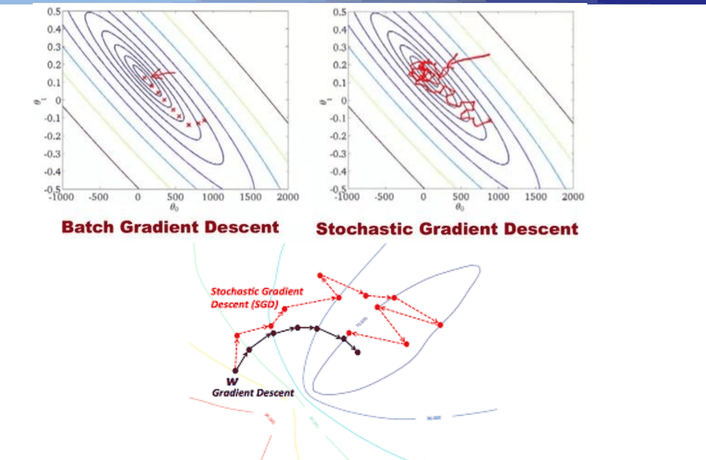
*Fig. 8.2 — Discesa del gradiente batch e stocastica.*

### Mini-batch

Nel **mini-batch** si divide ogni epoca in parti: si sommano i gradienti di $mb$ pattern ($1 < mb < l$) prima di aggiornare i pesi, e si ripete finché tutti i dati dell'epoca sono stati usati. L'aggiornamento avviene quindi a ogni mini-batch invece che a ogni pattern o a ogni epoca.

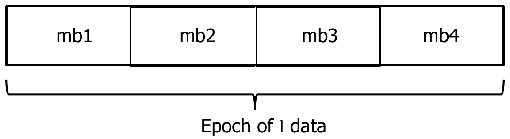
*Fig. 8.3 — Un'epoca suddivisa in mini-batch.*

| On-line | Mini-batch (SGD) | Batch |
|---|---|---|
| non sfrutta il parallelismo tra esempi | compromesso; si adatta alla memoria della GPU | stima più accurata del gradiente |
| può essere instabile | | più lento (aspetta tutti i dati) |
| il rumore può avere un **effetto regolarizzante** | | |

Il **mini-batch SGD** usa campionamento casuale (shuffling) per una stima non distorta del gradiente. Con training set enormi o dati in streaming si può anche fare a meno delle epoche. Poiché il costo di un aggiornamento dipende da $mb$ e non da $l$, lo SGD con mini-batch è un fattore chiave per estendere l'apprendimento a dataset di milioni di esempi.

---

## Il learning rate $\eta$

- **Batch**: gradiente più accurato → si può usare $\eta$ più alto.
- **On-line**: più veloce ma più instabile → $\eta$ più piccolo.
- In generale: $\eta$ **alto** è veloce ma può essere instabile; $\eta$ **basso** è stabile ma può essere troppo lento. Tipicamente si cerca in $[0{,}01;\ 0{,}5]$ con LMS.

> [!tip] (!) Guardare sempre la curva di apprendimento
>
> Il grafico dell'errore durante l'addestramento permette di verificare il comportamento nelle prime fasi di progettazione. Qui si valuta la **qualità** della curva e la **velocità** di convergenza (il valore assoluto dell'errore dipende anche dalla capacità del modello e dagli altri iperparametri).

*Fig. 8.4 — Effetto del learning rate sulle curve di apprendimento (errore di training).*

Una curva irregolare può dipendere da batch troppo piccoli o da $\eta$ troppo alto: va evitata. Si cerca una curva che scende rapidamente **e in modo liscio**. (Qui si guardano solo i "fallimenti" dell'ottimizzazione sul training set, non l'errore di generalizzazione.)

### LMS: dividere per $l$

> [!tip] (!) Usare la media dei gradienti
>
> Conviene usare la **media** dei gradienti sull'epoca (somma diviso $l$): rende l'approccio uniforme rispetto al numero di dati (è il *least mean squares*). Equivale a usare $\eta/l$ con $0 < \eta < 1$.
>
> Attenzione: confrontando on-line e batch con LMS, l'on-line richiede un $\eta$ **molto più piccolo** (dello stesso fattore $1/l$) per essere comparabile. Per il mini-batch (se si divide per $mb$) va ritarato $\eta$, oppure si divide sempre per $l$.

### Migliorare la discesa

#### Momentum (!)

$$
\Delta\mathbf{w}_{new} = -\eta\,\frac{\partial E(\mathbf{w})}{\partial\mathbf{w}} + \alpha\,\Delta\mathbf{w}_{old}, \qquad \mathbf{w}_{new} = \mathbf{w} + \Delta\mathbf{w}_{new},
$$
con $0 < \alpha < 1$ (ad esempio $0{,}5$–$0{,}9$). Qui $\eta$ è incluso in $\Delta\mathbf{w}$, e dopo ogni passo si salva $\Delta\mathbf{w}_{old} = \Delta\mathbf{w}_{new}$.

È il **metodo della "palla pesante"** (*heavy ball*): a ogni passo si aggiunge una frazione dello spostamento precedente, come se i pesi avessero un'inerzia.

- **Più veloce nei plateau**: se il gradiente ha lo stesso segno in iterazioni consecutive, il momentum aumenta il passo.
- **Smorza le oscillazioni**: nelle direzioni in cui il gradiente cambia segno i contributi si compensano.
- **Effetto inerzia**: permette di usare $\eta$ più alti.

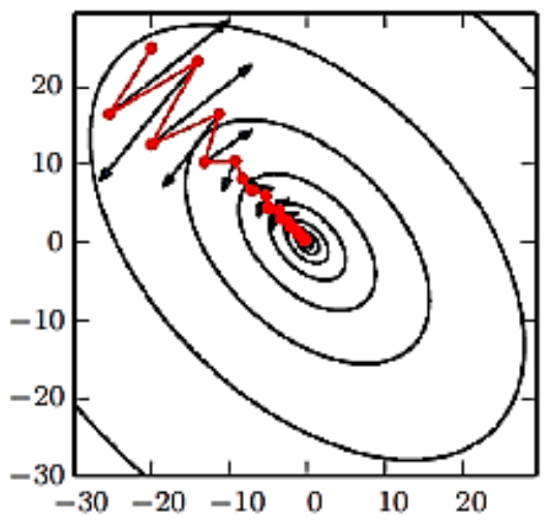
*Fig. 8.5 — Effetto del momentum in un "canyon" della superficie d'errore (Hessiana mal condizionata): il percorso rosso attraversa la valle invece di rimbalzare tra le pareti.*

Il momentum nasce per il batch. Nell'on-line $\Delta\mathbf{w}_{old}$ è quello del **pattern precedente**, e il momentum diventa una **media mobile dei gradienti passati** che liscia i gradienti stocastici all'interno dell'epoca (analogamente per il mini-batch). Il significato è quindi diverso dal batch, dove si combinano gradienti calcolati sugli stessi esempi in epoche diverse.

**Nesterov momentum**: si applica prima il momentum ($\mathbf{w} + \alpha\Delta\mathbf{w}_{old}$), si valuta il gradiente in questo punto intermedio, e poi si applica il $\Delta\mathbf{w}$ (momentum più nuovo gradiente) ai pesi originali. Migliora la velocità di convergenza nel batch (non nel caso stocastico).

#### Learning rate variabile

Con il mini-batch il gradiente **non tende a zero** vicino al minimo (per via del rumore di campionamento), quindi un $\eta$ fisso va evitato. Ad esempio si decresce linearmente fino all'iterazione $\tau$:
$$
\eta_s = \left(1 - \frac{s}{\tau}\right)\eta_0 + \frac{s}{\tau}\,\eta_\tau, \qquad s \le \tau,
$$
e poi si usa $\eta = \eta_\tau$ costante e piccolo (ad esempio $\eta_\tau \approx 1\%$ di $\eta_0$, $\tau$ qualche centinaio di passi). $\eta_0$ si sceglie con il compromesso instabilità/blocco (prove preliminari o grid search).

#### Learning rate adattivi

Algoritmi che adattano automaticamente il learning rate durante l'addestramento, anche separatamente **per ogni parametro**: **AdaGrad**, **RMSProp**, **Adam** (molto popolare e spesso robusto con i valori di default, ma con cautela). Si combinano con il momentum. Nelle reti con molti strati, $\eta$ può anche dipendere dallo strato o dal fan-in.

### Oltre lo SGD di base

Lo SGD è efficiente (lineare nel numero di parametri) ma dipende dal numero di dati e di epoche. Esistono molte euristiche: **Quickprop** (salta al minimo di una parabola che approssima localmente la loss), **R-prop** (usa solo il **segno** del gradiente, non il suo valore, utile quando il gradiente svanisce negli strati profondi).

I **metodi del secondo ordine** usano l'Hessiana (derivate seconde) per avere informazioni sulla curvatura e scendere meglio (metodo di Newton), ma l'Hessiana è costosissima. Ci sono versioni approssimate: Gauss-Newton, Levenberg-Marquardt, metodi *Hessian-free* come il **gradiente coniugato**, metodi quasi-Newton come **BFGS**.

> [!note] Punti di sella
>
> Un punto di sella ha gradiente (quasi) nullo ma non è un minimo. In spazi ad alta dimensione i punti di sella crescono esponenzialmente rispetto ai minimi locali. Il metodo di Newton cerca (e "salta verso") i punti a gradiente nullo, quindi è più sensibile ai punti di sella: questo può spiegare perché i metodi del secondo ordine non hanno sostituito la discesa del gradiente per le reti neurali, mentre la discesa del gradiente empiricamente riesce a sfuggire ai punti di sella. In pratica troviamo abbastanza in fretta valori bassi della loss, utili soprattutto per generalizzare.

> [!tip] In pratica
>
> Per l'ottimizzazione gli approcci di base (quelli con (!)), se applicati correttamente, di solito bastano. L'esperienza con tecniche note conta più di metodi sofisticati che non si sanno gestire. La tecnica di ottimizzazione è rilevante solo se ci sono ostacoli all'addestramento: **la validazione conta più dell'ottimizzazione sul training set**, perché ottimizzare sui dati di training non è il nostro obiettivo. Il punto di partenza (anche didattico) è **SGD con momentum** (e regolarizzazione).

---

## Criteri di arresto

- Il criterio base è l'errore usato (errore medio $< \epsilon$): è il migliore se si conosce la tolleranza dei dati (conoscenza dell'esperto), ma spesso non è così. Varianti: tolleranza massima invece che media; per la classificazione, il numero di errori.
- Criteri "interni": pesi che non cambiano più, gradiente quasi nullo (norma euclidea $< \epsilon$), errore che non diminuisce più in modo significativo in un'epoca (es. meno dello 0,1%). Attenzione: possono essere **prematuri** (ad esempio con $\eta$ troppo piccolo), quindi si osservano $k$ epoche (**patience**).
- **(!)** Fermarsi comunque dopo un numero eccessivo di epoche, per sfuggire a convergenze troppo lente, ma **non** fermarsi a un numero arbitrario di epoche fissato a priori.
- E non necessariamente fermarsi con un errore di training molto basso...

---

## Overfitting e regolarizzazione

### Fermarsi al minimo?

Tipicamente **non** vogliamo il minimizzatore globale di $R_{emp}(\mathbf{w})$, perché è probabilmente una soluzione in overfitting: è una differenza fondamentale rispetto ai metodi di ottimizzazione (CM). Il nostro scopo principale è il **controllo della complessità** per ottenere la migliore generalizzazione, tramite regolarizzazione (esplicita con un termine di penalità, o implicita con l'early stopping), più la model selection (cross-validation) per trovare il compromesso.

### Come nasce l'overfitting in una rete

- Si parte con **pesi piccoli e casuali** (rottura di simmetria).
- La mappatura input→output è quasi **lineare** (le sigmoidi lavorano nella zona lineare): il numero effettivo di parametri liberi (e la VC-dim) è quasi quello di un perceptron.
- Man mano che l'ottimizzazione procede, le unità nascoste tendono a **saturare**, aumentando il numero effettivo di parametri e le non linearità: la VC-dim cresce.

È di nuovo lo **spazio delle ipotesi di dimensione variabile**.

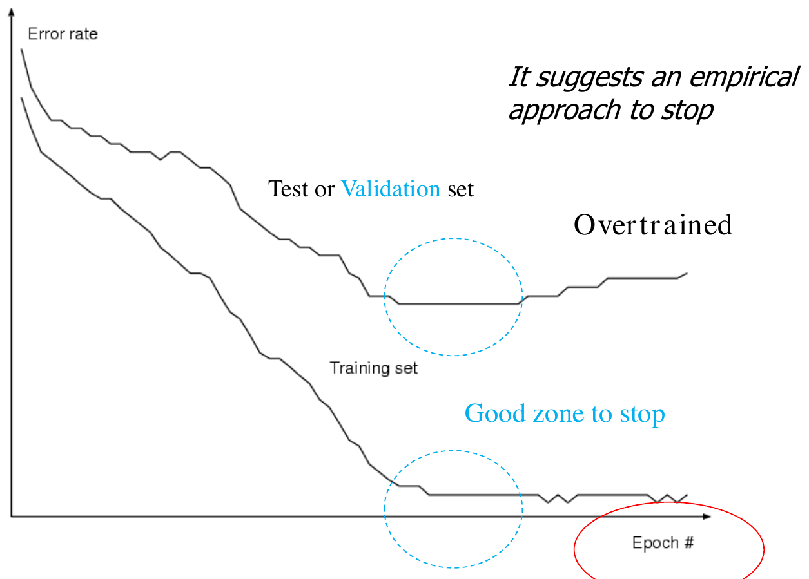
*Fig. 8.6 — Comportamento tipico della backpropagation: suggerisce un criterio empirico per fermarsi.*

La curva va letta insieme al grafico del VC-bound (fondamento teorico). Come intervenire:

1. **Early stopping**: usare un **validation set** per decidere quando fermarsi, cioè quando l'errore di validazione inizia a salire. È vago: bisogna osservare più epoche prima di decidere (*patience*) ed eventualmente tornare indietro (*backtracking*). Poiché il numero effettivo di parametri cresce durante l'addestramento, **fermarsi prima equivale a limitare la complessità effettiva**.
2. **Regolarizzazione** della loss: il nostro strumento principale.
3. Metodi di **pruning** (più avanti).

### Regolarizzazione (!)

Durante l'addestramento i pesi crescono: possiamo ottimizzare la loss tenendo conto del loro valore. L'approccio fondato (di nuovo Tikhonov) aggiunge un termine di penalità:
$$
\text{Loss}(\mathbf{w}) = \sum_p\big(d_p - o(\mathbf{x}_p)\big)^2 + \lambda\,\|\mathbf{w}\|^2, \qquad \|\mathbf{w}\|^2 = \sum_i w_i^2 \text{ su tutti i pesi della rete.}
$$
L'effetto è il **weight decay**: si aggiunge circa $2\lambda w$ al gradiente di ogni peso,
$$
\mathbf{w}_{new} = \mathbf{w} + \eta\,\Delta\mathbf{w} - 2\lambda\mathbf{w}
$$
(il 2 si può omettere). $\lambda$ è in genere molto piccolo (es. $0{,}01$) e si sceglie in **model selection** (cross-validation). Applicata a un modello lineare è la ridge regression; esistono penalità più sofisticate (ad esempio per la *weight elimination*).

> [!note] Errore e Loss
>
> Con un termine di penalità conviene distinguere: **Loss** è la funzione obiettivo usata per l'addestramento (MSE + penalità); **Errore/Rischio** è il termine sui dati (MSE), che misura l'errore del modello. **(!)** È l'errore che va riportato in tabelle e grafici, perché è la misura utile per chi usa il modello.

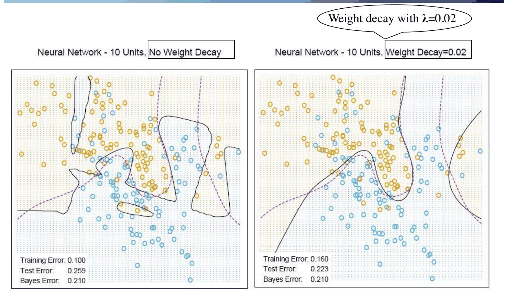
*Fig. 8.7 — Effetto del weight decay su una rete da 10 unità (Hastie-Tibshirani-Friedman): il confine diventa più regolare e l'errore di test si avvicina a quello di Bayes (0,210).*

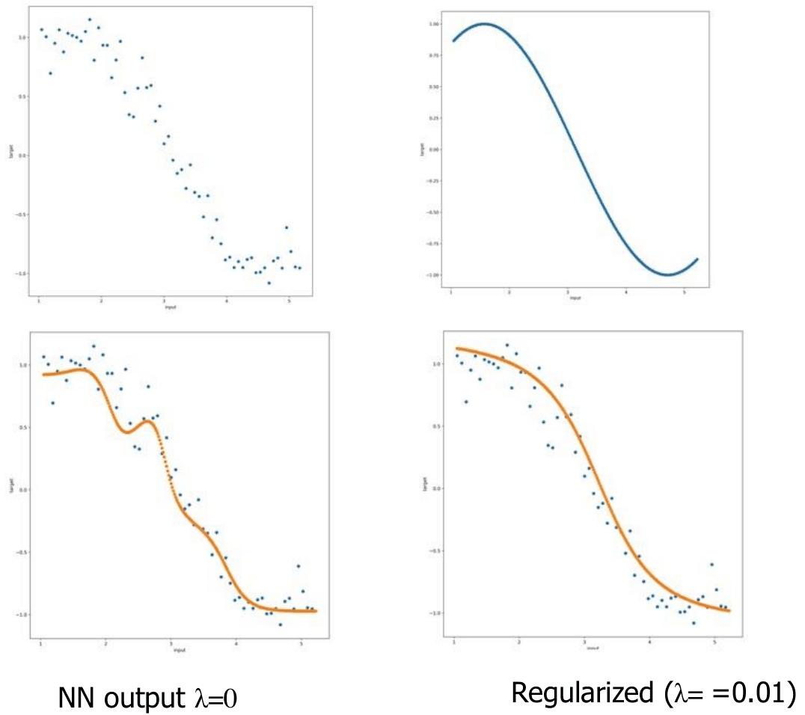
*Fig. 8.8 — Regressione univariata: rete senza regolarizzazione ($\lambda = 0$) e regolarizzata ($\lambda = 0{,}01$).*

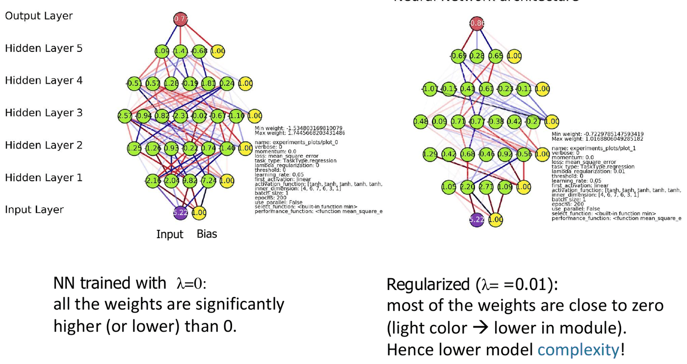
*Fig. 8.9 — I pesi della rete senza regolarizzazione (sinistra) e con regolarizzazione (destra): con $\lambda = 0{,}01$ la maggior parte dei pesi è vicina a zero, quindi la complessità del modello è minore.*

#### Fraintendimenti frequenti

> [!warning] La regolarizzazione non serve a stabilizzare la convergenza
>
> La regolarizzazione **non** è una tecnica per rendere più stabile la curva di apprendimento: serve a **controllare la complessità** del modello (misurata dalla VC-dim, legata al numero e al valore dei pesi). Se la curva è instabile, il problema è altrove (learning rate, batch...).

> [!question] Meglio early stopping o regolarizzazione?
>
> L'early stopping è un approccio **empirico** che richiede un validation set per decidere quando fermarsi, sacrificando una parte dei dati. La regolarizzazione nella loss è un approccio **fondato**: permette alla curva di validazione di seguire quella di training (purché non si abbia underfitting per un $\lambda$ troppo alto), e in quel caso non serve (strettamente) l'early stopping e ci si può fermare a convergenza. Si possono anche usare entrambi: l'early stopping non interviene se l'errore di validazione non sale.

#### Dettagli

- Spesso il **bias $w_0$ è escluso** dal regolarizzatore (includerlo renderebbe i risultati dipendenti da traslazioni/scalature del target), oppure ha un proprio coefficiente.
- Tipicamente si applica nella versione batch. Nell'on-line/mini-batch la penalità viene applicata a ogni passo, quindi molte volte per epoca: per un confronto equo col batch si userebbe $\lambda\cdot mb/l$. (Se $\lambda$ si sceglie con la model selection, questo avviene automaticamente.)
- Un'altra tecnica è il **dropout** (più avanti).

### Mettere tutto insieme: momentum e weight decay

Con la loss regolarizzata, la regola con momentum diventa (separando i due termini della loss e usando $\eta$ solo per il termine d'errore, come già fatto nei modelli lineari):
$$
\Delta w_{tu} = -\eta\,\frac{\partial\,\text{Loss}}{\partial w_{tu}} + \alpha\,\Delta w_{tu}^{old} \;\doteq\; \eta\,\delta_t\,o_u - \lambda\,w_{tu} + \alpha\,\Delta w_{tu}^{old}, \qquad w_{tu}^{new} = w_{tu} + \Delta w_{tu}.
$$
Così $\eta$ non moltiplica $\lambda$: cambiando uno non si cambia l'altro.

Il momentum deve includere anche la parte di $\lambda$? Spesso sì (Matlab, Caffe...). Ma per rendere **indipendenti tutti e tre gli iperparametri** $\eta$, $\alpha$, $\lambda$ si può scrivere:
$$
\Delta w_{tu} = \eta\,\delta_t\,o_u + \alpha\,\Delta w_{tu}^{old}, \qquad w_{tu}^{new} = w_{tu} + \Delta w_{tu} - \lambda\,w_{tu},
$$
separando il weight decay dalla memoria del momentum. Si divide per $l$ solo il gradiente di $E$ (dove c'è la somma sui pattern).

---

## Numero di unità nascoste

Il numero di unità è legato al **controllo della complessità**, alla dimensione dell'input e alla dimensione del training set. In generale è un problema di **model selection**: il numero di unità, insieme a $\lambda$, si sceglie con la cross-validation.

- Troppe poche unità → underfitting; troppe → overfitting (può verificarsi).
- Il numero di unità può essere più alto se si usa un'adeguata regolarizzazione.

Alternative alla ricerca manuale:

- **approcci costruttivi**: l'algoritmo decide il numero di unità partendo da una rete piccola e aggiungendone;
- **metodi di pruning**: si parte da reti grandi e si eliminano progressivamente pesi o unità.

### Cascade Correlation

Tra gli approcci costruttivi (Tower, Tiling, Upstart per la classificazione) il più noto è il **Cascade Correlation** (CC) di Fahlman e Lebiere (1990), per regressione e classificazione. Apprende **sia i pesi sia la topologia** (numero di unità): lo spazio delle ipotesi ha dimensione flessibile, decisa dall'algoritmo, e a ogni passo si addestra una sola unità.

> [!abstract] Algoritmo Cascade Correlation
>
> 1. Si parte da una rete $N_0$ **senza unità nascoste** e la si addestra. Se non risolve il problema, si passa a $N_1$.
> 2. In $N_1$ si aggiunge un'unità nascosta i cui pesi vengono addestrati per **massimizzare la correlazione** tra la sua uscita e l'**errore residuo** della rete $N_0$.
> 3. Dopo l'addestramento, i pesi in ingresso della nuova unità vengono **congelati**; si riaddestrano i pesi rimanenti (strato di uscita).
> 4. Se la rete non risolve il problema si aggiungono altre unità, ciascuna collegata a **tutti gli input e a tutte le unità nascoste precedenti** (da qui "a cascata").
> 5. Si continua finché l'errore residuo soddisfa il criterio di arresto.

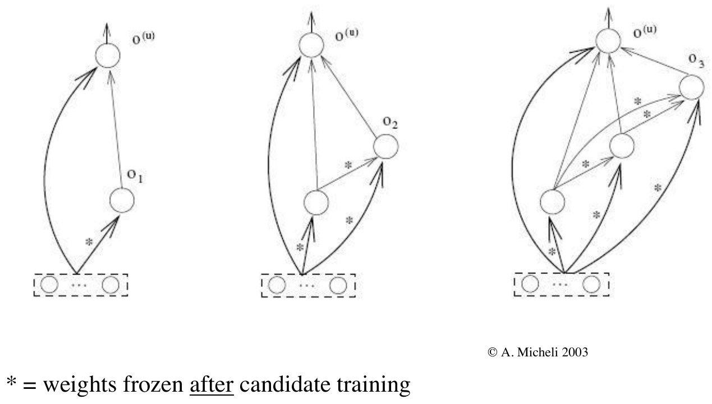
*Fig. 8.10 — Costruzione di una rete Cascade Correlation con fino a 3 unità nascoste.*

L'algoritmo alterna la minimizzazione dell'errore totale (LMS, ad esempio backprop sullo strato di uscita) e la **massimizzazione della covarianza** $S$ tra l'uscita $o_p$ della candidata e l'errore residuo $E_{p,k} = o_{p,k} - d_{p,k}$:
$$
S = \sum_k\left|\sum_p\big(o_p - \bar{o}\big)\big(E_{p,k} - \bar{E}_k\big)\right|.
$$
Il gradiente (con $d|f|/dx = \operatorname{sign}(f)\,df/dx$ e trascurando la dipendenza delle medie da $o_p$) è
$$
\frac{\partial S}{\partial w_j} = \sum_k \operatorname{sgn}(S_k)\sum_p\big(E_{p,k} - \bar{E}_k\big)\,f'(net_{p,h})\,I_{p,j},
$$
dove $h$ è la candidata e $I_{p,j}$ il suo input $j$. Si fa **ascesa** del gradiente (si massimizza $S$).

Note sul CC:

- il ruolo delle unità nascoste è **ridurre l'errore residuo**: ogni unità risolve un sotto-problema e diventa un **rilevatore di feature permanente**;
- **pool di candidate**: la superficie di $S$ ha molti massimi, quindi si addestra un gruppo di candidate e si sceglie la migliore, evitando massimi locali;
- è un algoritmo **greedy**: converge facilmente e può trovare un numero minimo di unità, ma può andare in overfitting (serve regolarizzazione);
- la loss non deve essere necessariamente "max $S$" (per la regressione si può usare LMS).

---

## Input e output

**Input**: il pre-processing ha grande effetto.

- **Standardizzazione** (spesso utile): per ogni feature media 0 e deviazione standard 1, $(v - \text{media})/\text{dev. std}$.
- **Rescaling** in $[0,1]$: $(v - \min)/(\max - \min)$.
- Input categorici: codifica **1-of-K** ($A \to 100$, $B \to 010$, $C \to 001$).
- Dati mancanti: attenzione, **0 non significa "nessun input"** se 0 è nel range dei valori.

**Output**:

- **(!) Regressione**: unità di uscita **lineari** (una o più).
- **Classificazione**: una unità (binaria) o 1-of-K con più uscite. Con la sigmoide si sceglie la soglia per assegnare la classe (con eventuale zona di rifiuto); con 1-of-K vince l'uscita più alta. Spesso la **tanh** (simmetrica) apprende più in fretta. Come target si può usare $0{,}9$ invece di 1 (e $-0{,}9$ o $0{,}1$ invece di $-1$ o $0$) per evitare la convergenza asintotica verso la saturazione. Ovviamente il range dei target deve stare nel range delle uscite.
- **Softmax** per targets 0/1 multi-classe: le uscite sommano a 1 e si possono interpretare come probabilità $p(\text{classe} = k \mid \mathbf{x})$:
$$
o_k(\mathbf{x}) = \frac{e^{net_k}}{\sum_{j=1}^{K} e^{net_j}}.
$$
- Si può usare la **cross-entropy** come loss alternativa (stima di massima verosimiglianza); per un'unità:
$$
-\sum_{i \in TR}\big\{d_i\log(out(\mathbf{x}_i)) + (1 - d_i)\log(1 - out(\mathbf{x}_i))\big\}.
$$

> [!question] Esercizio per il progetto
>
> Riflettere sul ruolo dei diversi iperparametri e collegarli alla teoria: ad esempio collegare la loss con penalità al VC-bound, per capire come numero di unità, $\lambda$ e gli altri controllano underfitting e overfitting. Quali sono i più rilevanti per il progetto (e per vincere la competizione)?

---

## Pregi e difetti delle reti neurali

> [!abstract] Pregi
>
> - Metodo flessibile: estende i metodi lineari alla stima di funzioni arbitrarie e costruisce un'**ipotesi esplicita** (a differenza del K-NN).
> - Potere espressivo dato da numero di unità, architettura e addestramento.
> - Spazio delle ipotesi continuo e ricco, loss differenziabile → addestramento con discesa del gradiente.
> - Approssimatori universali; gestiscono rumore e dati incompleti con degrado graduale; dati continui e discreti, regressione e classificazione.
> - Un **paradigma** ampio (anche apprendimento non supervisionato, memorie associative, approcci stocastici).
> - Plausibilità neurale; **rappresentazione distribuita** della conoscenza (compatta in matrici di pesi); **tolleranza ai guasti**; adattamento a ambienti non stazionari con apprendimento on-line (*continual learning*, con il dilemma stabilità-plasticità).

> [!warning] Punti critici
>
> - **Problema della black box**: è difficile interpretare la conoscenza acquisita ed estrarla per gli esperti umani. È legato al tema attuale della **explainable AI** (XAI). Approcci: proiezione/clustering delle rappresentazioni interne, analisi di sensitività, **Layer-wise Relevance Propagation** (LRP, 2015, anche per reti profonde, che produce mappe di calore sulle parti dell'input rilevanti per la decisione), estrazione di regole simboliche.
> - **Progettazione dell'architettura**: servono metodi costruttivi/pruning o approcci diversi (SVM).
> - **Dipendenza dal processo di addestramento**: le molte varianti e iperparametri influenzano la soluzione finale.
> - Non ideali con **dati mancanti** (si usano rimozione, imputazione...).

Le reti neurali sono indicate quando: l'input è ad alta dimensione (discreto o reale), il task è di classificazione o regressione, i dati possono essere rumorosi, il tempo di addestramento non è critico, la forma della funzione target è sconosciuta, la leggibilità del risultato non è critica, e il calcolo dell'uscita deve essere veloce.

> [!note] Note storiche
>
> McCulloch e Pitts (1943), Hebb (1949), Minsky (1954, 1969), von Neumann (1956), Rosenblatt (1958), Widrow e Hoff (1960), Kohonen (1972, 1982), Grossberg (ART, 1980), Hopfield (1982), Rumelhart, Hinton, Williams, Werbos, Parker, LeCun (1975–1985, backprop), Poggio e Girosi (teoria RBF, 1990), Vapnik (SVM, anni '90), deep learning (Hinton, Bengio, LeCun, dal 2007). **Hopfield e Hinton** hanno ricevuto il **Premio Nobel per la Fisica 2024**; Hinton, Bengio e LeCun il Premio Turing 2018.

---

## Verso il progetto: il benchmark MONK

Non si è ancora pronti per il progetto (mancano la **validazione** e la lezione dedicata), ma si può iniziare a implementare la rete (backprop e regole di aggiornamento) o a esplorare i simulatori.

Verificare la correttezza di un'implementazione è difficile: una rete spesso "funziona" (anche se male) nonostante piccoli errori. Il primo collaudo è il dataset **MONK** (UCI), i cui risultati vanno riportati nel report:

- 3 task di classificazione binaria, piccoli e artificiali, "non difficili": una piccola rete con poche unità raggiunge accuratezze altissime (fino al 100%) in poco tempo;
- esiste un report con risultati precedenti di MLP e altri modelli;
- **input**: 6 variabili con 2, 3 o 4 valori simbolici ciascuna → codifica **1-of-k** → **17 unità di input**;
- il test set include il training set (cattiva pratica, ma qui irrilevante).

> [!tip] Consigli per le prime prove sul MONK
>
> - Un'unità di uscita per la classificazione (target e uscite coerenti, $0/1$ o $-1/+1$); si suggerisce la **tanh** in uscita.
> - **Codifica one-hot degli input**: errore frequentissimo se dimenticata!
> - Batch con gradiente diviso per il numero di pattern: converge in qualche centinaio di epoche.
> - Poche unità nascoste (2–5), come nel manuale: il test funziona se si raggiungono i risultati dello stato dell'arte con poche unità.
> - Il MONK è sensibile all'inizializzazione (poche unità): provare intervalli iniziali piccoli (o basati sul fan-in).
> - Con approcci on-line usare lo **shuffling** (i pattern sono ordinati per classe).

Buoni risultati sul MONK **non garantiscono** la correttezza del simulatore; risultati cattivi indicano **sicuramente** che codice o impostazioni vanno rivisti. Nei grafici conta la **forma** delle curve (lisce, convergenti), non i valori.

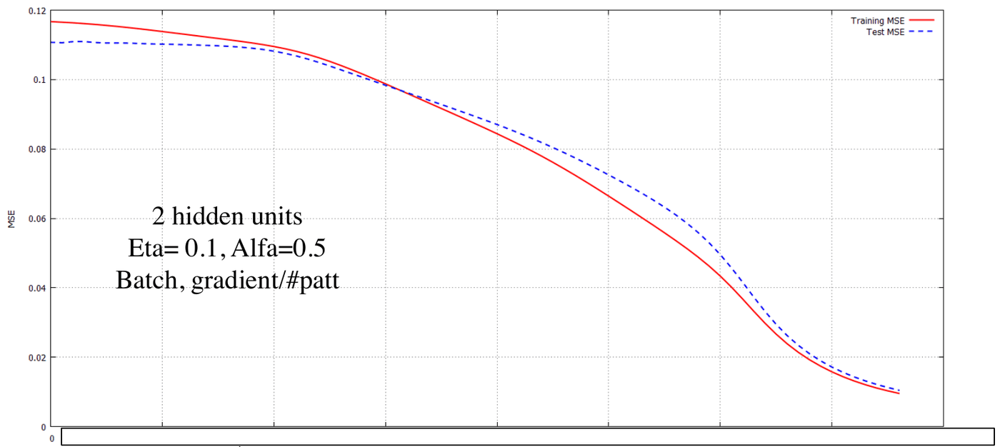
*Fig. 8.11 — MONK2: MSE di training (rosso) e test (blu tratteggiato) con 2 unità nascoste, $\eta = 0{,}1$, $\alpha = 0{,}5$.*

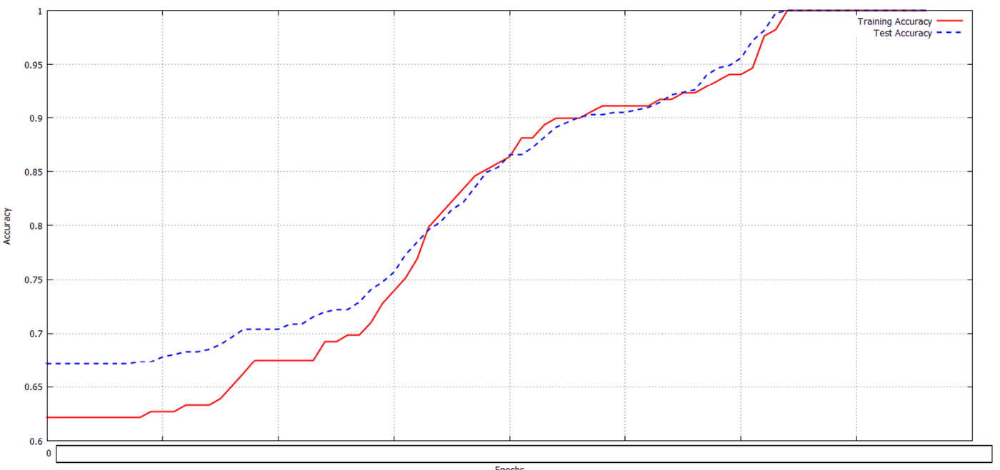
*Fig. 8.12 — MONK2: l'accuratezza raggiunge il 100% anche sul test (caso insolito in generale).*

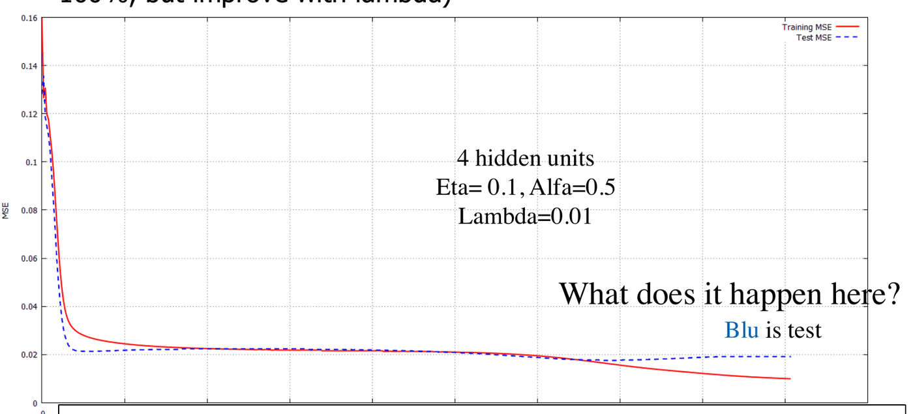
*Fig. 8.13 — MONK3 con regolarizzazione ($\lambda = 0{,}01$): il MONK3 contiene rumore e può andare in overfitting; il test non arriva al 100%.*

> [!question] Cosa succede nella Fig. 8.13?
>
> Nella parte finale l'errore di training continua a scendere mentre quello di test risale leggermente: è l'inizio dell'**overfitting** (MONK3 ha etichette rumorose). La regolarizzazione lo attenua; un $\lambda$ scelto con la model selection o l'early stopping aiuterebbero.

Per verificare la backpropagation si può usare un esempio passo-passo (attenzione se omette i bias) o una libreria affidabile come "oracolo" (Keras, scikit-learn, PyTorch...). Altri dataset utili si trovano nell'UCI Machine Learning Repository.

> [!note] Anteprima del progetto (regole a.a. 2026/27)
>
> Negli anni passati il progetto era obbligatorio (gruppi di 2–3, tipo A con simulatore implementato da zero o tipo B con librerie, competizione ML-CUP). Dall'a.a. 2026/27 il progetto è **opzionale**: gruppi di **2 studenti**, implementazione/applicazione/analisi di un metodo di ML con valutazione sperimentale, presentato come **poster** in una delle ultime lezioni (dicembre). Può dare un piccolo bonus ma non è necessario per l'esame, che si basa sullo scritto (vedi [[01 - Introduzione al Machine Learning]]). I consigli sul MONK restano validi come collaudo di qualsiasi implementazione.

> [!question] Possibili domande d'esame
>
> - Come si inizializzano i pesi e perché?
> - Differenze tra on-line, batch e mini-batch.
> - Ruolo del learning rate; cos'è il momentum e perché funziona?
> - Serve trovare il minimo globale? Perché?
> - Come si manifesta l'overfitting in una rete neurale? Cos'è l'early stopping?
> - Scrivere la loss con weight decay e la regola di aggiornamento con momentum.
> - La regolarizzazione migliora la stabilità della convergenza?
> - Descrivere il Cascade Correlation.
> - Come si rappresentano input e output per regressione e classificazione?
