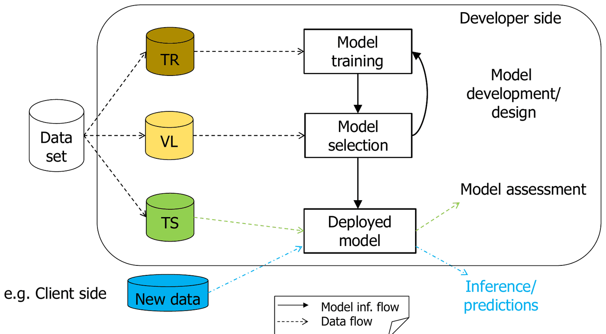

# Validazione (parte 1): model selection e model assessment

*Appunti di Fabio Piscitelli — Machine Learning (654AA), Prof. Alessio Micheli, Università di Pisa, a.a. 2026/27*

La validazione è stata introdotta in [[04 - Generalizzazione e validazione (introduzione)]]; queste lezioni la approfondiscono, perché è indispensabile per il progetto e per ogni applicazione seria del ML. Si ribadiscono i due obiettivi (model selection e model assessment), si vede un controesempio che mostra quanto è facile ottenere stime sbagliate, si introducono la **grid search** e la **K-fold cross-validation**, e si discutono campionamento, pochi dati e misure d'errore.

## Premessa: bias e varianza

La decomposizione **bias-varianza** (che avrà una lezione dedicata) è un quadro utile per capire perché stimare le prestazioni di un modello è difficile: mostra il ruolo delle diverse **realizzazioni del training set** e, ancora una volta, il compromesso tra capacità di adattamento (bias) e flessibilità del modello (varianza).

*Fig. 9.1 — Errore di training (azzurro) e di test (rosso) su 100 training set diversi al crescere della complessità (Hastie et al., Fig. 7.1). Con un modello complesso il bias è basso ma la varianza alta: a seconda del campione si può essere "fortunati" o "sfortunati".*

La figura mostra un fatto importante: a parità di complessità, l'errore di test varia molto tra un training set e l'altro, soprattutto per modelli complessi. Una singola misura può essere fortunata o sfortunata.

## Motivazioni

Cerchiamo la soluzione con il minimo errore di predizione (di test), bilanciando **adattamento ai dati di training** e **complessità del modello**. L'errore di training **non è una buona stima** dell'errore di test: all'inizio c'è troppo bias (underfitting, errore di training alto), poi troppa varianza (errore di training basso ma overfitting).

Supponendo di avere un iperparametro $\theta$ (implicito o esplicito) che regola la complessità del modello, vogliamo il valore di $\theta$ che minimizza l'errore di test. Servono quindi metodi per **stimare l'errore atteso** di un modello (o di ciascun modello di una classe, o di un insieme di modelli).

### Come stimare

- **Analiticamente**: criteri AIC e BIC (*Akaike/Bayesian Information Criterion*, limitati a modelli lineari nei parametri), MDL (*Minimum Description Length*), **SRM** (*Structural Risk Minimization*) con la VC-dimension (vedi la lezione sulla SLT).
- **Empiricamente**, sui dati, tramite **ricampionamento** (stima diretta dell'errore fuori campione): **cross-validation** (hold-out, K-fold, ...) e **bootstrap**.

---

## I due obiettivi della validazione

> [!warning] La slide più importante del corso
>
> Dopo aver addestrato i modelli sul training set:
>
> - **Model selection**: stimare le prestazioni (errore di generalizzazione) di diversi modelli per **scegliere il migliore**. Include la ricerca dei migliori **iperparametri** (grado del polinomio, numero di unità di una rete, $\lambda$, $\eta$, ...). *Restituisce un modello.*
> - **Model assessment**: scelto il modello finale (o una classe di modelli), **stimarne l'errore di predizione** (rischio) su dati di test nuovi, come misura della qualità del modello scelto. *Restituisce una stima.*
>
> **Regola d'oro**: tenere separati gli obiettivi e usare **insiemi di dati separati** in ogni fase.

### Hold-out

Se i dati sono sufficienti si divide il dataset in tre insiemi **disgiunti**, ad esempio 50% TR, 25% VL, 25% TS:

- **TR** (*training set*): per adattare il modello, cioè minimizzare $R_{emp}$ della SLT [**training**];
- **VL** (*validation* o *selection set*): per scegliere il modello migliore tra modelli e configurazioni di iperparametri diversi [**model selection**];
- **TS** (*test set*): per stimare l'errore di generalizzazione del modello finale, cioè stimare $R$ della SLT [**model assessment**].

TR e VL insieme formano il **development/design set**, usato per costruire il modello finale.

> [!note] Due precisazioni
>
> 1. La stima fatta sul VL serve **solo** alla model selection: non è una buona stima per l'assessment.
> 2. I risultati sul TS **non** si possono usare per la model selection. Se lo si fa, quello non è più un test set: chiamiamolo validation set.

### Test o model selection?

Cosa succede se il test set viene usato in un ciclo di progettazione ripetuto (provo, guardo il test, cambio, riprovo)? Si sta facendo **model selection**, non una valutazione affidabile, e non potremmo farlo sugli esempi futuri. L'errore sul test così usato è una **stima troppo ottimistica** dell'errore vero. È come un esercizio d'esame di cui si sono viste le soluzioni: non è più un test! Da qui il concetto di **blind test set** (test cieco), usato nelle competizioni di ML.

*Fig. 9.2 — Ruolo di TR, VL e TS (ripresa dalla lezione 4).*

---

## Un controesempio istruttivo

> [!example] Il controesempio del target casuale
>
> - 20–30 esempi, **1000 variabili di input** a valori casuali;
> - target **casuale** 0/1.
>
> Si seleziona un modello che usa **una sola** variabile di input, quella che per puro caso "indovina" il target al 99% (o 100%) su qualsiasi successiva suddivisione in TR, VL e TS. Risultato perfetto? Cosa c'è di sbagliato?
>
> Il 99–100% **non** è una buona stima dell'errore di test: quella vera è il **50%** (il target è casuale, nessun modello può fare meglio di una moneta). Su un test set esterno davvero nuovo si otterrebbe il 50%.

Gli errori sono due:

1. la stima dell'errore su TR e VL **non è** una buona stima del rischio;
2. usare **l'intero dataset** per la selezione delle feature o del modello **pregiudica la stima** (stima distorta, detta *subset selection bias*): il test set è stato usato **implicitamente** all'inizio, nella scelta della variabile. Il test set va separato **in anticipo**, prima di **qualsiasi** model selection, inclusa la **feature selection**.

Con 1000 variabili casuali e soli 20 pattern, è quasi certo che una variabile coincida per caso con il target sulla maggior parte dei pattern. Poiché la scelta è fatta guardando **tutti** i dati, quella variabile "funziona" su qualunque partizione successiva. Su pattern davvero nuovi (TS1, TS2, TS3 nella tabella della slide) la stessa variabile ha accuratezze del 100%, 33%, 66%: puro caso.

> [!warning] Attenzione
>
> Qui si discute la **correttezza della stima**, non la possibilità di risolvere il task. La K-fold CV e altre tecniche **non** risolvono il problema se la selezione è fatta prima della suddivisione (anzi, possono confondere ancora di più).

---

## Grid search

Gli **iperparametri** sono parametri non appresi direttamente dall'algoritmo; si fissano cercando nello **spazio degli iperparametri**, naturalmente tramite model selection su un validation set.

La **grid search esaustiva** genera tutti i candidati da una griglia di valori. Esempio banale con numero di unità e $\lambda$:

| Unità \ $\lambda$ | 0,1 | 0,01 | 0,001 |
|---|---|---|---|
| 1 unità | Res1 | Res4 | Res7 |
| 10 unità | Res2 | Res5 | Res8 |
| 100 unità | **Res3** | Res6 | Res9 |

Se il migliore risultato (sul validation) è Res3, vince la configurazione (100 unità, $\lambda = 0{,}1$). Va **automatizzata**, ed è facile da **parallelizzare** (le prove sono indipendenti).

Il costo può essere alto: è il prodotto cartesiano dei valori, cioè $(\#\text{valori})^{\#\text{iperparametri}}$. Con 3 valori per 2 iperparametri sono $3^2 = 9$ prove; con 5–6 iperparametri da 10 valori ciascuno diventa proibitivo. Per questo:

- si possono fissare alcuni iperparametri in una fase sperimentale preliminare, se si mostrano poco rilevanti (con cautela, vedi l'errore della selezione sequenziale nella parte 3);
- si usano **due (o più) livelli di grid search annidate**: prima una ricerca **grossolana** su tutte le combinazioni (ad esempio con valori a crescita esponenziale) per trovare le regioni buone, poi ricerche **più fini** su intervalli sempre più piccoli, sempre considerando **tutti** gli iperparametri significativi insieme.

### Alternative alla grid search

La grid search è molto utile per **osservare il comportamento** del modello al variare degli iperparametri (fondamentale per capire), ma è costosa e scala male con il numero di iperparametri. Alternative:

- **ricerca casuale** (Bergstra e Bengio, 2012): evita di ricampionare gli stessi valori di un iperparametro influente quando altri non lo sono, e permette di fissare il **budget** di prove indipendentemente dal numero di iperparametri;
- ricerca **automatica**: approcci bayesiani, evolutivi, metodi di valutazione delle configurazioni (es. Hyperband).

Librerie come Keras Tuner e scikit-learn includono molte alternative (verso l'**AutoML**), ma non vanno usate acriticamente: la grid search insegna di più al primo approccio.

*Fig. 9.3 — Grid search e random search con 100 prove ciascuna: la ricerca casuale esplora molti più valori distinti di ciascun iperparametro (barre verdi).*

> [!tip] Perché la random search funziona
>
> Se uno solo dei due iperparametri conta davvero, la grid 10×10 ne prova solo **10 valori distinti** (le altre 90 prove ripetono gli stessi valori variando l'iperparametro inutile), mentre la ricerca casuale ne prova **100**.

---

## K-fold cross-validation

### Quanti dati servono?

L'hold-out richiede dati sufficienti per tre partizioni significative. Quanti? Dipende dalla complessità del modello e dal rapporto segnale/rumore (ne servono pochi per un modello lineare su un task linearmente separabile senza rumore). Come fare se i dati non bastano? E come evitare di dipendere dalla **particolare partizione** scelta? La K-fold CV aiuta.

> [!note] Terminologia
>
> "Cross-validation" indica sia un **approccio** alla model selection basato sulla stima diretta dell'errore tramite ricampionamento (anziché analitica), sia più specificamente le **implementazioni** che stabiliscono come dividere i dati per la selezione e per la valutazione (ad esempio la K-fold CV).

### Richiamo

Si divide $D$ in $K$ sottoinsiemi mutuamente esclusivi $D_1,\dots,D_K$; per ogni $i$ si addestra su $D \setminus D_i$ e si valuta su $D_i$. Così tutti i dati vengono usati sia per l'addestramento sia per la valutazione. Non si ottiene un **unico modello** (ce n'è uno per fold), ma si ottiene anche una **varianza** (deviazione standard) sui fold per la propria classe di modelli: il risultato si riporta come **media ± deviazione standard**. Si può usare sia per il validation set sia per il test set.

Questioni: quanti fold (3, 5, 10, ..., *leave-one-out*)? Il costo computazionale è spesso alto. Si può combinare con un validation set o fare una doppia K-fold CV.

### Un esempio completo di selezione e valutazione

1. Dividere i dati in **TR** e **TS** (qui con hold-out, ma potrebbe essere una K-fold).
2. **Model selection**: usare una K-fold CV **interna** al TR (che in ogni fold produce nuovi TR e VL) per trovare i migliori iperparametri con una **grid search**. Per ogni cella della griglia (es. $\lambda = 0{,}1$, 20 unità) si esegue un'intera K-fold CV; si sceglie la configurazione con il **miglior errore medio di validazione** sui fold.
3. Riaddestrare il modello finale sull'**intero TR** originale.
4. **Model assessment**: valutarlo sul **TS esterno**.

(Si può poi riaddestrare di nuovo su tutti i dati? Lo vedremo nella prossima parte.)

---

## Casi particolari

### Campionamento fortunato o sfortunato

Per non dipendere dalla particolare partizione:

- **Stratificazione**: raggruppare la popolazione in sottogruppi omogenei prima di campionare. Per la classificazione: in ogni partizione (TR e TS in hold-out o CV) ogni classe è rappresentata circa nelle stesse proporzioni del dataset completo.
- Controllare la composizione dei fold: l'**ordine dei dati** potrebbe avere un significato (es. dati ordinati per classe o per tempo).
- **Hold-out o CV ripetuti**: ripetere la suddivisione con campionamenti casuali diversi (es. ripetere 10 volte la CV) e mediare i risultati. Utile soprattutto per **confrontare modelli diversi**.

### Pochissimi dati

Con pochissimi dati è difficile dire se un campione è rappresentativo. Oltre alla stratificazione, evitare (o tenere in conto nella valutazione): classi o feature mancanti nei dati di training; classi speciali non campionate in TR o TS; outlier noti che influenzano la media dei risultati di test; all'opposto, la selezione di soli casi "facili".

Anche un **blind test set** può essere fuorviante se proviene da una distribuzione diversa, è misurato con scale o tolleranze diverse, non è pulito o pre-elaborato, o richiede **estrapolazione** (dati fuori range).

---

## Misure d'errore per la valutazione

**Classificazione** (vedi le prime lezioni): accuratezza (o tasso d'errore, spesso in %), matrice di confusione, specificità, sensibilità, curva ROC.

**Regressione**, con residuo $r_i = y_i - o_i$ ($y$ target, $o$ uscita):

- **MSE** $= \text{mean}_i[r_i^2]$ e la sua radice **RMS** (o $S$);
- **errore assoluto medio** (MAE) $= \text{mean}_i[|r_i|]$;
- **errore assoluto massimo** $= \max_i |r_i|$;
- **coefficiente di correlazione** $R$ (e **coefficiente di determinazione** $R^2$), ad esempio $R = \sqrt{1 - S^2/S_y^2}$, con $S_y^2 = \text{mean}_i[(y_i - \bar y)^2]$ varianza del target: misura il grado di dipendenza lineare tra $y$ e $o$, in $[0,1]$, dove 1 è il meglio;
- grafici **uscite contro target**;
- test statistici e analisi di significatività.

> [!note] Bootstrap
>
> Un altro approccio è il **bootstrap**: ricampionamento casuale **con reinserimento**, ripetuto per ottenere sottoinsiemi diversi (di validazione o di test).

---

> [!abstract] Le due regole d'oro
>
> - Il risultato sul **TR** non è una buona stima di quello su VL e TS.
> - Il risultato sul **VL** non è una buona stima di quello sul TS.
>
> Quindi: **non usare i risultati del validation set per la stima del rischio** (model assessment), e **non usare i risultati del test set per la model selection**, in nessuna forma. In una sola regola: *tenere separati gli obiettivi e usare insiemi separati in ogni fase.*

> [!question] Possibili domande d'esame
>
> - Differenza tra model selection e model assessment; perché servono insiemi separati?
> - Descrivere il controesempio del target casuale: quali sono i due errori?
> - Cos'è la grid search? Come si riduce il suo costo? Vantaggi della random search.
> - Descrivere la K-fold CV e un esempio completo di selezione e valutazione.
> - Cos'è la stratificazione?
> - Quali misure d'errore si usano per la regressione?
