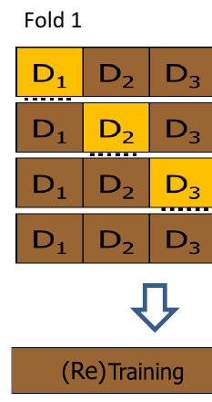
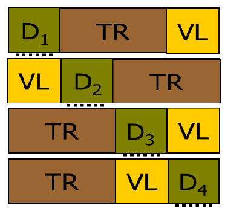
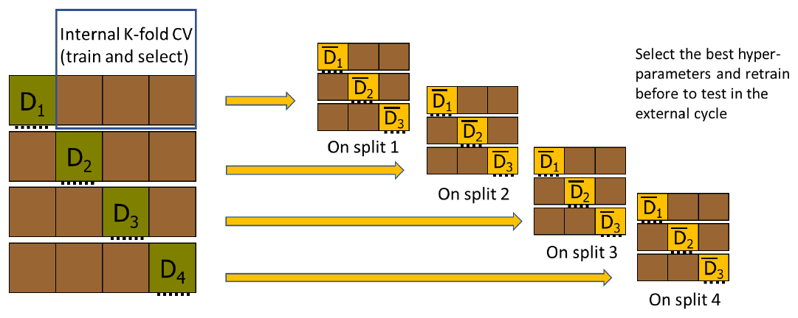
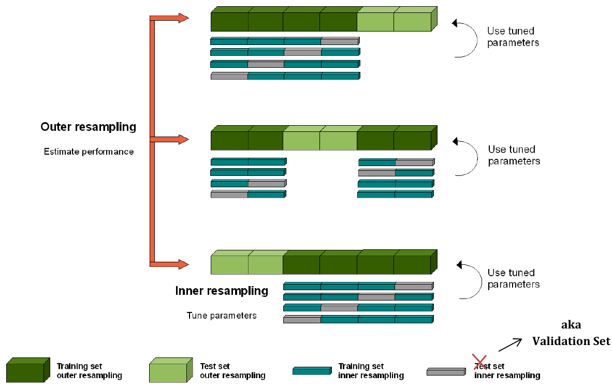
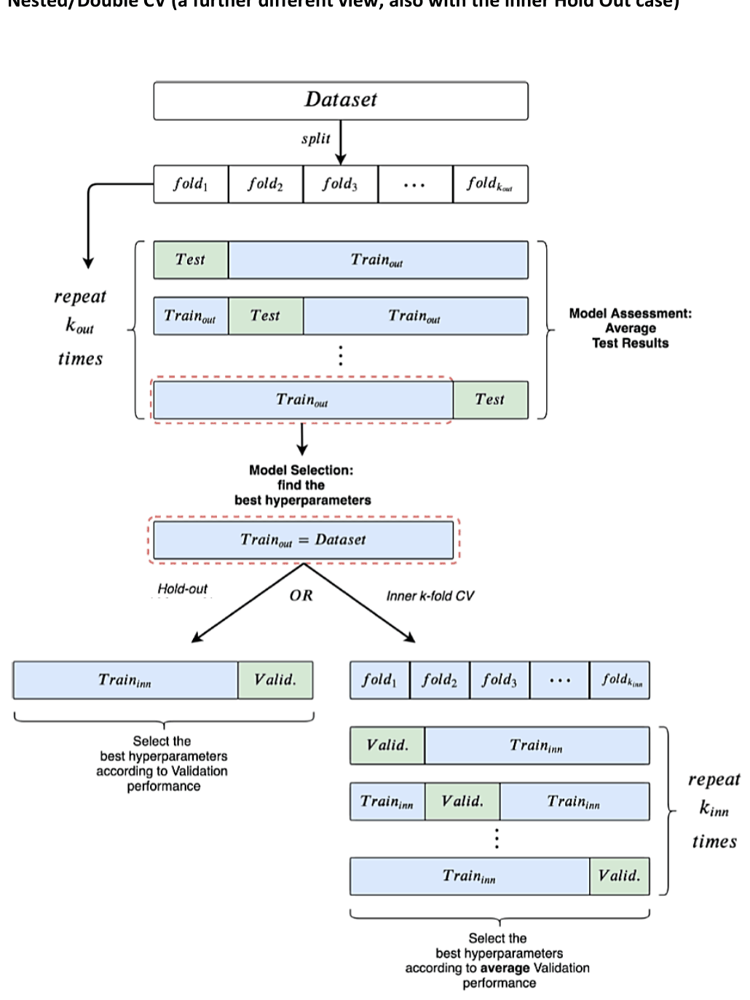

# Validazione (parte 2): schemi formali

*Appunti di Fabio Piscitelli — Machine Learning (654AA), Prof. Alessio Micheli, Università di Pisa, a.a. 2026/27*

Questa seconda parte formalizza l'uso corretto della cross-validation per la model selection e/o la stima del rischio, con una notazione precisa (adattata dalle slide di S. Bengio). Sono concetti semplici, ma una notazione rigorosa evita ambiguità. Non è un ricettario: serve a **razionalizzare** e capire in modo sistematico un approccio rigoroso, per poi essere ragionevoli. Il tempo per eseguire gli esperimenti dipende soprattutto dalle scelte di validazione: bisogna evitare sia una valutazione troppo grossolana sia un processo di valutazione infinito. In caso di dubbi, questi schemi sono comunque meglio della fantasia.

Si parla di selezione tra configurazioni di iperparametri (indicate con $\theta$), ma gli stessi schemi valgono per scegliere tra **modelli diversi** ($\theta$ può rappresentare anche il tipo di modello).

> [!tip] Tenere a mente il controesempio
>
> Dalla parte 1: (1) le stime d'errore su TR e/o VL **non** sono buone stime del rischio; (2) usare l'intero dataset per la selezione di feature o modelli **pregiudica** la stima. Negli schemi che seguono si vede esattamente dove questi errori verrebbero commessi.

## Notazione

**Dati**: $Z_1, \dots, Z_l$ è un campione casuale di una distribuzione sconosciuta $p(z)$, con tutti gli $Z_i$ **indipendenti e identicamente distribuiti** (i.i.d.). $D_r = \{z_1, \dots, z_r\}$ è una particolare istanza con $r$ elementi.

**Task**: classificazione, $Z = (X, Y) \in \mathbb{R}^n \times \{-1, +1\}$; regressione, $Z = (X, Y) \in \mathbb{R}^n \times \mathbb{R}$.

**Loss** ("interna"): classificazione $L((x,y), h) = 0$ se $h(x) = y$, $1$ altrimenti; regressione $L((x,y), h) = (h(x) - y)^2$.

**Obiettivo**: minimizzare il **rischio atteso** (errore vero) su $H$:
$$
R(h) = \mathbb{E}_Z[L(z, h)] = \int_Z L(z, h)\,p(z)\,dz, \qquad h^* = \arg\min_{h \in H} R(h).
$$
Il problema: $p(z)$ è sconosciuta e non abbiamo accesso a tutti gli $L(z,h)$.

**Rischio empirico** su un insieme finito $D_r$:
$$
R_{emp}(h, D_r) = \frac{1}{r}\sum_{i=1}^{r} L(z_i, h).
$$

> [!warning] Uso generale di $R_{emp}$
>
> Qui $R_{emp}$ è inteso in senso generale, come **surrogato di $R$** su un insieme finito di dati, usato per il training, la model selection o l'assessment a seconda della partizione. Da non confondere con il $R_{emp}$ della SLT, che è specificamente l'errore di training: in questa notazione è $R_{emp}(h, D_{TR})$.

## Metodologia: identificare l'obiettivo

1. Dare il **miglior modello** ottenibile da un dataset? → serve la **model selection**.
2. Dare le **prestazioni attese** di un modello ottenuto per minimizzazione del rischio empirico? → serve la **model assessment** (stima del rischio).
3. Dare **entrambi**? → servono tutte e due.

Il dataset originale $D_l$ verrà usato per questi diversi scopi.

---

## Model selection

### Hold-out

> [!abstract] Model selection con hold-out
>
> - Scegliere uno spazio delle ipotesi con iperparametro $\theta$.
> - Dividere $D_l$ in $D_{TR} = \{z_1, \dots, z_{tr}\}$ e $D_{VL} = \{z_{tr+1}, \dots, z_{tr+vl}\}$, con $tr + vl = l$.
> - Per ogni valore $\theta_m$ [**grid search**]:
>   - $h^*_{\theta_m}(D_{TR}) = \arg\min_{h \in H_{\theta_m}} R_{emp}(h, D_{TR})$ [**training**];
>   - stimare $R(h^*_{\theta_m})$ con $R_{emp}(h^*_{\theta_m}, D_{VL}) = \frac{1}{vl}\sum_{z_i \in D_{VL}} L(z_i, h^*_{\theta_m}(D_{TR}))$.
> - Scegliere $\theta^*_m = \arg\min_{\theta_m} R(h^*_{\theta_m})$ [miglior risultato sul VL].
> - Restituire $h^*(D_l) = \arg\min_{h \in H_{\theta^*_m}} R_{emp}(h, D_l)$ [**riaddestramento** su tutti gli $l$ dati].

La stima di $R$ sul VL serve **solo** alla model selection e **non viene restituita** come stima del rischio: restituirla sarebbe esattamente l'errore (1) del controesempio.

### K-fold cross-validation

> [!abstract] Model selection con K-fold CV
>
> - Scegliere uno spazio delle ipotesi con iperparametro $\theta$.
> - Dividere $D_l$ in $K$ parti distinte e uguali $D_1, \dots, D_K$; sia $\bar D_k$ il complementare di $D_k$.
> - Per ogni valore $\theta_m$ [**grid search**]:
>   - per ogni parte $D_k$ [**ciclo sui fold**]:
>     - $h^*_{\theta_m}(\bar D_k) = \arg\min_{h \in H_{\theta_m}} R_{emp}(h, \bar D_k)$ [training];
>     - stimare $R(h^*_{\theta_m}(\bar D_k))$ con $R_{emp}(h^*_{\theta_m}(\bar D_k), D_k) = \frac{1}{|D_k|}\sum_{z_i \in D_k} L(z_i, h^*_{\theta_m}(\bar D_k))$;
>   - stimare $R(h^*_{\theta_m}(D_l))$ con la media $\frac{1}{K}\sum_k R(h^*_{\theta_m}(\bar D_k))$.
> - Scegliere $\theta^*_m = \arg\min_{\theta_m} R(h^*_{\theta_m}(D_l))$ [migliore su tutte le CV].
> - Restituire $h^*(D_l) = \arg\min_{h \in H_{\theta^*_m}} R_{emp}(h, D_l)$ [riaddestramento].

*Fig. 10.1 — K-fold CV per la model selection, seguita dal riaddestramento.*

> [!warning] Attenzione all'ordine
>
> Ogni iterazione **riparte da zero**, con addestramento e stima locali alla suddivisione. Se ad esempio si usasse un modello addestrato nello split 1 per valutare lo split 2, si userebbe come validazione dello split 2 una parte ($D_2$) che era stata usata per addestrare nello split 1.

---

## Stima del rischio (model assessment)

### Hold-out

> [!abstract] Model assessment con hold-out
>
> - Dividere $D_l$ in $D_{TR}$ e $D_{TS}$, con $tr + ts = l$. **Il test set va separato ADESSO** (non dopo): altrimenti si commette l'errore (2) del controesempio.
> - $h^*(D_{TR}) = \arg\min_{h \in H} R_{emp}(h, D_{TR})$ [training; può includere una model selection interna su $D_{TR}$].
> - Stimare $R(h^*(D_{TR}))$ con $R_{emp}(h^*(D_{TR}), D_{TS}) = \frac{1}{ts}\sum_{z_i \in D_{TS}} L(z_i, h^*(D_{TR}))$ [**errore di test**].

### K-fold cross-validation

> [!abstract] Model assessment con K-fold CV
>
> - Dividere $D_l$ in $K$ parti distinte e uguali.
> - Per ogni parte $D_k$ [ciclo sui fold]:
>   - $h^*(\bar D_k) = \arg\min_{h \in H} R_{emp}(h, \bar D_k)$ [training; può includere una model selection];
>   - stimare $R(h^*(\bar D_k))$ con $R_{emp}(h^*(\bar D_k), D_k)$ [errore di test di ogni iterazione].
> - Stimare $R(h^*(D_l))$ con la media $\frac{1}{K}\sum_k R(h^*(\bar D_k))$.

Con $K = l$ si ha la **leave-one-out CV**. Non si violano i principi: i risultati di test non vengono mai usati per addestrare o selezionare, in nessuna iterazione.

---

## Combinare model selection e model assessment

Quando si vogliono sia il modello migliore sia il suo rischio atteso, bisogna combinare i metodi. Ad esempio:

- **hold-out** con training–validation–test (servono tre insiemi separati);
- **K-fold CV + test**: cross-validation sul training set, poi test su un insieme separato;
- **K-fold CV esterna per il test**, con hold-out interno per la model selection;
- **double (nested) cross-validation**: per ogni fold esterno, una cross-validation annidata sugli altri $K-1$.

Altri aspetti: considerare le **diverse prove** (inizializzazioni diverse di una rete) nel calcolo delle medie su TR, VL, TS. Più in generale: confrontare i risultati con altri metodi, usare **test statistici** per verificarne la significatività, verificare il modello su più dataset.

### Hold-out training–validation–test

> [!abstract] Schema TR–VL–TS
>
> - Dividere $D_l$ in $D_{TR}$, $D_{VL}$, $D_{TS}$.
> - Per ogni $\theta_m$: addestrare $h^*_{\theta_m}(D_{TR})$ e calcolare $R_{emp}(h^*_{\theta_m}(D_{TR}), D_{VL})$.
> - Scegliere $\theta^*_m$ con il miglior risultato sul VL.
> - Riaddestrare $h^*(D_{TR} \cup D_{VL})$ con $\theta^*_m$.
> - Stimare $R$ con $\frac{1}{ts}\sum_{z_i \in D_{TS}} L(z_i, h^*(D_{TR} \cup D_{VL}))$.

Il riaddestramento può usare una parte dei dati come VL per l'early stopping.

> [!question] Si può riaddestrare ancora su tutto $D_l$?
>
> Il riaddestramento finale su tutti i dati (TR+VL+TS) **non usa** i risultati del test per alcuna scelta: il modello finale avrà in generale prestazioni pari o migliori della stima (più dati), che resta valida come stima (leggermente pessimistica) del rischio della procedura. L'importante è che il test non abbia influenzato nessuna decisione.

### K-fold CV per la selezione + hold-out per il test

> [!abstract] Schema CV + test
>
> - Dividere $D_l$ in $D_{TR}$ (il *design set*) e $D_{TS}$.
> - Per ogni $\theta_m$: stimare $R(h^*_{\theta_m}(D_{TR}))$ con una K-fold CV su $D_{TR}$ (errore di validazione medio sui fold).
> - Scegliere $\theta^*_m$ con la migliore stima.
> - Riaddestrare $h^*(D_{TR})$.
> - Stimare $R$ con l'errore su $D_{TS}$.

### K-fold CV per il test con hold-out interno per la selezione

In ogni riga della K-fold esterna, un fold fa da test e il resto viene diviso (arbitrariamente e con shuffling) in TR e VL per la model selection. La descrizione in meta-algoritmo è lasciata per esercizio.

*Fig. 10.2 — K-fold CV esterna per il test, con hold-out TR/VL interno per la model selection (il riaddestramento non è mostrato).*

> [!note] Nessun modello unico
>
> Questo processo **non fornisce un modello finale**: dà solo una stima del rischio della **classe** di modelli considerata, perché potenzialmente ogni riga seleziona un modello diverso.

### Double (nested) K-fold CV

> [!abstract] Double K-fold CV
>
> - Dividere $D_l$ in $K$ parti distinte e uguali.
> - Per ogni parte $D_k$ [**ciclo esterno**]:
>   - scegliere $h^*(\bar D_k)$ con una **K-fold CV interna** su $\bar D_k$ (con $K'$ eventualmente diverso da $K$) [**ciclo interno**];
>   - stimare $R(h^*(\bar D_k))$ con $R_{emp}(h^*(\bar D_k), D_k)$ [errore di test per ogni split esterno].
> - Stimare $R(h^*(D_l))$ con la media sui fold di test.

*Fig. 10.3 — Double K-fold CV: in ogni split esterno una CV interna seleziona gli iperparametri.*

Anche qui **non si ottiene un modello finale unico**, perché ogni ciclo esterno può scegliere iperparametri diversi: si ottiene una stima del rischio della classe di modelli/algoritmo, con anche la sua **varianza** (deviazione standard sui fold). Se serve un modello finale unico si esegue una **model selection separata** (hold-out o K-fold CV) e un eventuale riaddestramento finale.

Questo non viola le regole: l'errore di test è già stato stimato e i risultati di test non vengono mai usati per la selezione; il modello finale avrà un errore atteso nell'intervallo stimato. Per questo non è semplicemente vero che "il test viene sempre per ultimo": qui avviene **prima** dell'ultima model selection (anche se può sembrare anti-intuitivo).

La double CV sfrutta meglio **tutti** i dati per addestramento e valutazione (sia per la selezione sia per la valutazione), al prezzo di un costo computazionale elevato.

*Fig. 10.4 — Un'altra vista della double CV: resampling esterno per stimare le prestazioni, interno per regolare i parametri.*

*Fig. 10.5 — Nested CV, anche nella variante con hold-out interno.*

> [!abstract] Sintesi
>
> Prima si identifica l'obiettivo (modello migliore, stima delle prestazioni, o entrambi), poi si sceglie lo schema. In tutti gli schemi corretti: il **test è separato prima** di ogni scelta, le stime sul **VL non vengono restituite** come stime del rischio, ogni iterazione di CV **riparte da zero**. Gli schemi combinati più usati sono TR–VL–TS, CV+test e la double CV.

> [!question] Possibili domande d'esame
>
> - Scrivere l'algoritmo di model selection con K-fold CV.
> - Scrivere l'algoritmo di model assessment con K-fold CV.
> - Descrivere la double (nested) CV. Restituisce un modello?
> - Collegare gli errori (1) e (2) del controesempio agli schemi formali.
