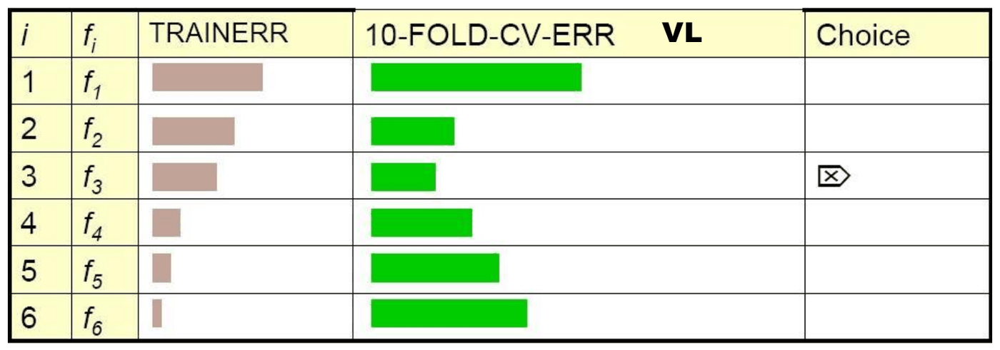
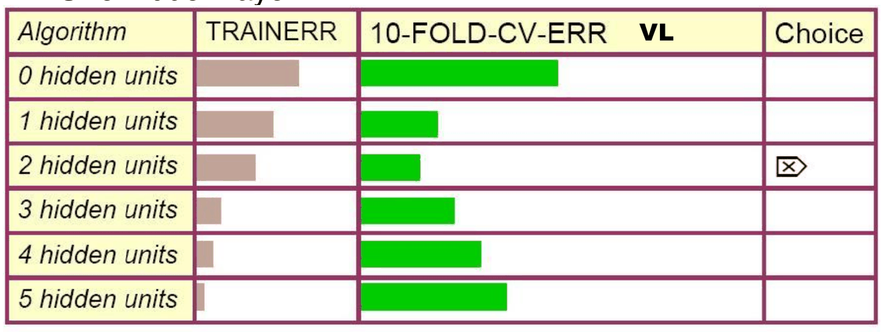
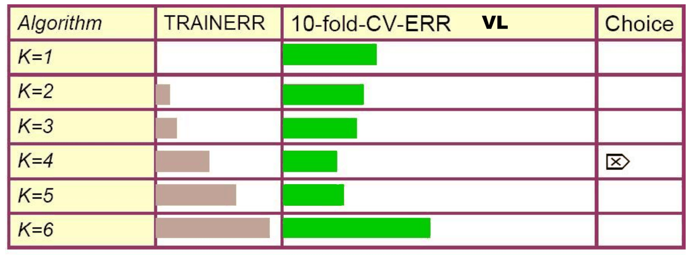

# Validazione (parte 3): errori tipici e FAQ

*Appunti di Fabio Piscitelli — Machine Learning (654AA), Prof. Alessio Micheli, Università di Pisa, a.a. 2024/25*

L'ultima parte sulla validazione raccoglie consigli pratici sull'uso della cross-validation, gli **errori più frequenti** (soprattutto nei progetti) e alcuni esempi di model selection, in parte tratti dalle slide di Andrew W. Moore (CMU).

## Arresto dell'addestramento

### Non fissare un numero arbitrario di epoche

> [!warning] Errore frequente
>
> Evitare di fermare l'addestramento di una rete dopo un **numero fisso e arbitrario di epoche**.

Perché:

- se è piccolo, ci si può fermare **troppo presto** (underfitting, o si favoriscono i learning rate alti che richiedono meno epoche);
- se è grande, ci si può fermare **troppo tardi** (overfitting o tempo perso);
- non può andare bene lo stesso valore per tutte le configurazioni e le iterazioni di una K-fold CV;
- e quale numero usare nel riaddestramento finale?

Anche **selezionare il numero di epoche tramite model selection** non è la pratica migliore: è meglio di un numero fisso ma ancora impreciso (per i problemi con la K-fold CV e perché esistono criteri migliori). Le soluzioni che funzionano bene con un sistema **ben regolarizzato** sono quelle viste in [[08 - Reti neurali (parte 2) - addestramento in pratica]]: guardare la convergenza del training (soglia sulla diminuzione dell'errore o sul gradiente), oppure l'**early stopping** se si può/vuole usare un validation set.

### Early stopping

> [!warning] Early stopping e model selection
>
> Il criterio di early stopping (ES) fa **parte della model selection** (non va applicato sul TS): in linea di principio richiede un **VL set ogni volta** che si addestra il modello.

È delicato: usa parte dei dati solo per decidere quando fermarsi, senza dare un valore concreto di iperparametro, e può diventare complesso dentro una CV. Il problema: come scegliere il punto di arresto per il **riaddestramento finale**, se ogni fold della CV ha un punto di arresto diverso?

- Si potrebbe considerare il numero di epoche come iperparametro e prendere la **media** sui fold. Ma cambiando la quantità di dati nel riaddestramento il punto di arresto ottimo può cambiare (ad esempio con più dati per epoca, e quindi più aggiornamenti per epoca in on-line, servono meno epoche): si rischia sotto- o sovra-addestramento.
- **Molto meglio**: prendere la **media dell'errore di training** nel punto migliore di validazione e usarla come soglia nel riaddestramento, per raggiungere lo stesso livello di fitting (evitando effetti di sotto-addestramento).
- Altrimenti serve un VL set ogni volta: ad esempio CV con ES attivo in ogni fold di validazione (insieme agli altri iperparametri); trovati i migliori iperparametri, si riaddestra sul dataset ricomposto usando ancora una parte dei dati come VL per l'ES.

È una scelta: usare l'ES oppure affidarsi a **modelli regolarizzati** con criteri di arresto standard (es. nessun miglioramento sul training). In ogni caso la regolarizzazione aiuta a evitare un forte sovra-addestramento e riduce la dipendenza dall'ES.

## Inizializzazione casuale e model selection

Inizializzazioni diverse dei pesi portano a **modelli diversi**. Come scegliere quello finale (scelta che va riportata nel report)?

- Si calcolano **media e varianza** dell'errore/accuratezza sulle diverse prove: un caso casuale cadrà in quell'intervallo, quindi il rischio è sotto controllo, a meno di una varianza alta (che comunque è un segnale negativo, vedi la lezione su bias e varianza).
- Si possono usare **tutti** i modelli, con un **ensemble** (media delle uscite o voto).
- Se se ne sceglie **uno**, quella è una **model selection** e serve un VL set: il **migliore** (errore minimo sul VL), la **mediana** (scelta più cauta), oppure uno **casuale** (in questo caso non serve un VL set).
- Si possono anche scartare i casi "sfortunati" guardando solo l'errore di training.

## Selezione sequenziale degli iperparametri

> [!warning] Errore frequente
>
> Selezionare gli iperparametri **uno alla volta**, in sequenza, introduce un **bias legato all'ordine**. Esempio: scegliere il miglior $\eta$ con 10 unità e poi usarlo anche con 100 unità.

Il procedimento corretto:

1. prove iniziali per determinare gli **intervalli** giusti (ad esempio guardando la stabilità del training) e gli iperparametri più **influenti** (ad esempio guardando la varianza dei risultati);
2. ricerca su una **griglia con tutte le combinazioni** degli iperparametri (più iperparametri e valori → tabella più grande);
3. eventuali griglie **annidate**, da grossolane a fini, su intervalli sempre più piccoli, ma considerando **tutti gli iperparametri significativi insieme**, per tenere conto degli effetti incrociati.

Ma: ragionare, selezionare gli aspetti rilevanti, non affidarsi solo ad approcci automatici sistematici e costosi. I vincoli di tempo del progetto dovrebbero spingere verso schemi semplici e veloci, ma corretti e ragionevoli.

## Cosa fare dopo selezione e valutazione?

> [!question] Posso riprogettare il modello in base al risultato sul test?
>
> No: non è il modo corretto e non è davvero vantaggioso (a meno di avere nuovi dati per un nuovo test set). Ripetendo questo procedimento sugli stessi dati si può ottenere qualunque risultato si voglia, adattando il modello a quel dataset: il modello può diventare perfetto su di esso e non nell'uso futuro, e **non si sta più stimando il rischio**.
>
> *Non bisogna regolare il predittore (a mano o automaticamente) sulla base dell'errore di test, perché non potremmo farlo sugli esempi futuri.* Nelle competizioni il blind test impedisce proprio questo. La valutazione su un test interno resta comunque utile per **verificare il proprio approccio**.

La tentazione di decidere in base ai risultati è un problema "psicologico", esterno ai metodi di ML. Almeno esserne consapevoli, oppure meglio:

- per fare un **buon modello** bisogna fare una **buona model selection**;
- per stimare le **prestazioni reali** bisogna fare una stima **rigorosa** sul test.

## La cross-validation può andare in overfitting

Un uso intensivo della cross-validation può portare a overfitting? **Sì**, e conserva i problemi già visti. Esempio con la feature selection:

- dataset con 20–30 record e 1000 attributi;
- si provano 1000 modelli di regressione lineare, ognuno con un solo attributo;
- il migliore dei 1000 sembra buono (sul validation set)... ma sarebbe sembrato buono anche con un output **puramente casuale**!

Oppure (uso sbagliato): approssimando un target casuale si trova, con una K-fold CV per il test, un errore del 3% invece del vero 50%, dopo aver scelto le feature per miglior correlazione con i target. **Perché?** La selezione è stata fatta su **tutti** gli esempi.

Cosa fare? Tenere da parte i campioni **prima** di selezionare:

- tenere un **test set aggiuntivo** prima di qualsiasi model selection e verificare che il modello migliore funzioni bene anche su di esso;
- per la model selection con CV: usare "**CV + test**" o la **double CV** (rifacendo la selezione per ogni fold);
- per l'assessment con CV: fare la **feature selection dentro ogni fold**. Così si ottiene la stima corretta, circa il 50% per il task casuale.

## Quale cross-validation?

| | Svantaggi | Vantaggi |
|---|---|---|
| **Test set (hold-out)** | varianza: stima inaffidabile delle prestazioni future (fortuna/sfortuna) | economico |
| **Leave-one-out** | costoso; ha comportamenti strani | non spreca dati |
| **10-fold** | spreca il 10% dei dati; 10 volte più costoso del test set | spreca solo il 10%; solo 10 volte più costoso invece di $R$ volte |
| **3-fold** | spreca più dati del 10-fold; più costoso del test set | leggermente meglio del test set |
| **R-fold** ($R = l$) | identico al leave-one-out | |

## Esempi di model selection

### Esempio 1: modelli diversi

*Fig. 11.1 — Scelta tra sei classi di modelli con la 10-fold CV.*

Si sceglie la classe di modelli con il **miglior punteggio di CV**, la si riaddestra su tutti i dati, e quello è il modello predittivo da usare. La scelta si fa guardando **solo l'errore di validazione**, **non** l'errore di training (né una media dei due).

### Esempio 2: numero di unità nascoste

*Fig. 11.2 — Scelta del numero di unità nascoste di una rete con uno strato nascosto.*

L'errore di training decresce sempre con il numero di unità, ma l'errore di CV ha un minimo (qui 2 unità). Nella pratica la ricerca si fa su valori come 10, 20, 30... (o con altri passi).

### Esempio 3: K-NN

*Fig. 11.3 — Scelta di $k$ per il K-NN con leave-one-out CV.*

Perché la **leave-one-out** per il K-NN e la 10-fold per le reti? Per ragioni **computazionali**: per il K-NN (e gli altri metodi non parametrici) la LOOCV costa quanto una normale predizione (non c'è un modello da addestrare). E perché fermarsi a $K = 6$? Solo perché le cose sembravano peggiorare al crescere di $K$; e non c'è garanzia che un ottimo locale di $K$ rispetto alla LOOCV sia quello globale (la relazione può essere molto irregolare). Per esplorare molti valori si possono usare valori a crescita esponenziale ($K = 1, 2, 4, 8, 16, \dots$) o una ricerca *hill-climbing* partendo da un valore iniziale.

## Conclusioni pratiche

- L'**hold-out semplice** è molto usato: a volte il test set è già dato separatamente o "preso" da applicazioni precedenti. Attenzione con pochi dati e controllare i tassi d'errore su TR e VL.
- La **5- o 10-fold CV** è raccomandata come buon compromesso (tra bias e varianza della stima) rispetto alla leave-one-out (Hastie et al.).

Nella prossima lezione si torna alla stima **analitica** dell'errore atteso, con la Structural Risk Minimization e la VC-dimension: offre spunti interessanti per la selezione e il confronto tra modelli (dove conta la **dimensione relativa** degli errori), in alternativa alla valutazione puramente empirica.

> [!question] Possibili domande d'esame
>
> - Perché non bisogna fermare l'addestramento dopo un numero fisso di epoche?
> - Come si gestisce l'early stopping con la cross-validation e il riaddestramento finale?
> - Come scegliere il modello finale con più inizializzazioni casuali?
> - Cos'è l'errore della selezione sequenziale degli iperparametri?
> - La cross-validation può andare in overfitting? Come evitarlo?
> - Confrontare hold-out, K-fold e leave-one-out.
