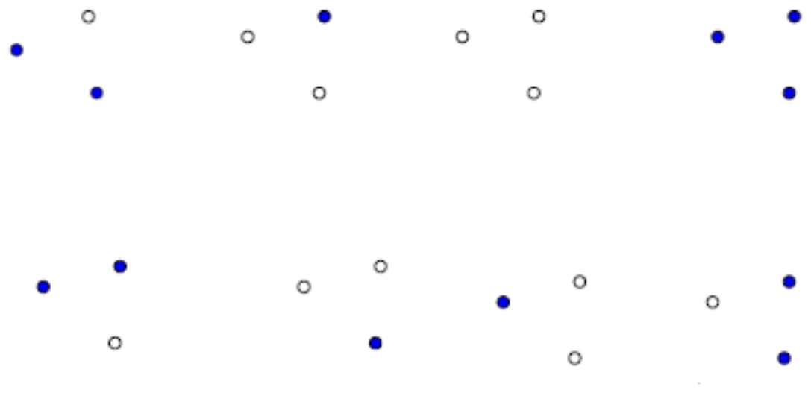
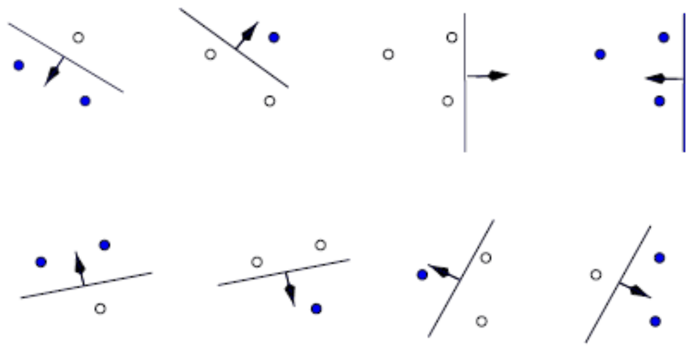
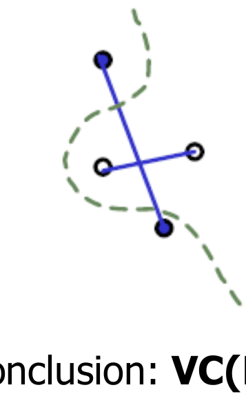
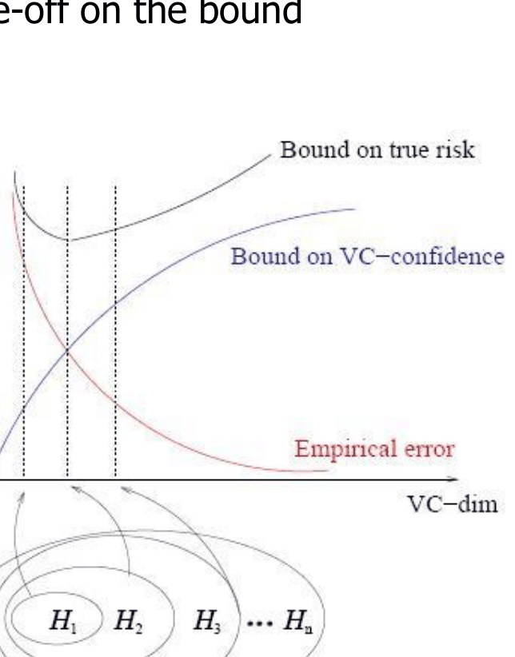
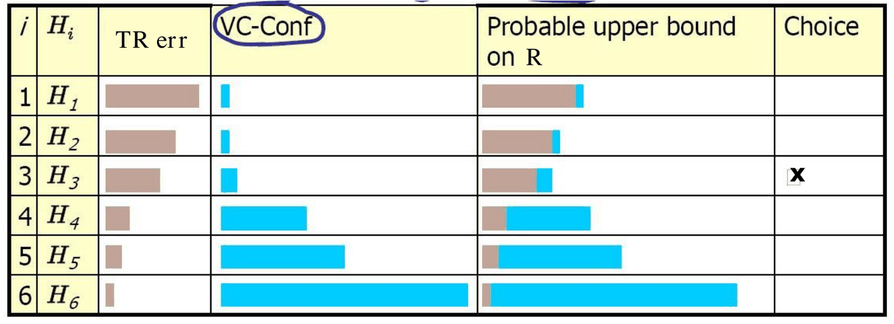

# Statistical Learning Theory e VC-dimension

*Appunti di Fabio Piscitelli — Machine Learning (654AA), Prof. Alessio Micheli, Università di Pisa, a.a. 2026/27*

Dopo le tecniche empiriche di validazione, si torna alla **stima analitica** dell'errore atteso (di validazione, per la model selection, o di test, per l'assessment), introdotta in [[04 - Generalizzazione e validazione (introduzione)]]. Questa lezione definisce formalmente la **VC-dimension**, la calcola per alcune classi di ipotesi, presenta il bound della SLT e il principio della **Structural Risk Minimization** (SRM), che porterà alle SVM.

Ricordiamo le alternative per stimare l'errore:

- **analitiche**: AIC, BIC (limitati ai modelli lineari nei parametri), MDL, **SRM con VC-dimension**;
- **per ricampionamento**: cross-validation, bootstrap.

## La VC-dimension

Per ottenere un bound analitico dobbiamo valutare lo spazio delle ipotesi $H$. Serve una misura della sua **complessità** (capacità, potere espressivo, flessibilità) che funzioni anche per $H$ **infiniti** (come i modelli lineari, con pesi reali): non si può quindi usare $|H|$. L'idea di Vapnik e Chervonenkis è misurare invece **il numero di istanze distinte che $H$ riesce a discriminare completamente**.

Intuitivamente, nel caso della classificazione: *quanto $H$ riesce a discriminare dei punti?* Qual è il **numero massimo di punti che si possono classificare correttamente, senza errori, per tutte le possibili etichettature**?

### Shattering

Sia $X$ lo spazio delle istanze, con $N$ punti (attenzione: $N$ qui è il numero di istanze considerate, che può essere diverso dal numero di dati $l$), e sia $H$ lo spazio delle ipotesi per la classificazione binaria.

- Esistono $2^N$ possibili **dicotomie** (partizioni, o etichettature dei punti con $-1$ o $+1$).
- Una dicotomia è **rappresentata** in $H$ se esiste un'ipotesi $h \in H$ che la realizza.

> [!definition] Shattering (frammentazione)
>
> $H$ **frammenta** (*shatters*) $X$ se e solo se $H$ può rappresentare **tutte** le possibili dicotomie su $X$ (con errore zero): per ogni possibile etichettatura dei punti esiste un'ipotesi $h \in H$ consistente con essa.

> [!example] Tre punti nel piano e le rette
>
> Consideriamo 3 punti in $\mathbb{R}^2$ e come $H$ l'insieme delle rette, $h(\mathbf{x}) = \operatorname{sign}(\mathbf{w}^T\mathbf{x} + w_0)$. Una specifica dicotomia (ad esempio due punti a $-1$ e uno a $+1$) è rappresentabile se esiste una retta che separa correttamente i punti. Le dicotomie possibili sono $2^3 = 8$.

*Fig. 12.1 — Tutte le $2^N = 8$ dicotomie di 3 punti in $\mathbb{R}^2$.*

*Fig. 12.2 — Per ogni dicotomia esiste una retta separatrice: le funzioni lineari frammentano questi 3 punti.*

### Definizione di VC-dimension

> [!definition] VC-dimension
>
> La **VC-dimension** di una classe di funzioni $H$ è la **cardinalità massima di un insieme di punti** (in una qualche configurazione) di $X$ che può essere frammentato da $H$. $VC(H) = p$ significa che:
>
> - $H$ frammenta **almeno un** insieme (configurazione) di $p$ punti;
> - $H$ **non** frammenta **nessun** insieme di $p+1$ punti.
>
> Se si possono frammentare insiemi di dimensione arbitrariamente grande, $VC(H) = \infty$.

Attenzione all'asimmetria: per il limite inferiore basta **una** configurazione frammentabile; per il limite superiore bisogna mostrare che **nessuna** configurazione di $p+1$ punti è frammentabile.

### VC-dimension degli iperpiani nel piano

- **$VC(H) \ge 3$**: l'abbiamo appena mostrato con 3 punti non allineati. Non tutte le configurazioni di 3 punti sono frammentabili: tre punti **allineati** con quello centrale di classe diversa non sono linearmente separabili. Ma basta **una** configurazione frammentabile.
- **$VC(H) < 4$**: dati 4 punti qualsiasi nel piano, si possono sempre tracciare i 6 segmenti che li collegano a coppie, e due di questi si incrociano (se i 4 punti formano un quadrilatero convesso sono le diagonali; se uno è dentro il triangolo degli altri, si sceglie l'etichettatura con il punto interno di classe diversa). Mettendo nella stessa classe i punti collegati dai segmenti che si incrociano, non si possono separare linearmente: è lo **XOR**.

*Fig. 12.3 — Con 4 punti esiste sempre un'etichettatura di tipo XOR non separabile da una retta.*

Conclusione: **$VC(H) = 3$** per gli iperpiani (LTU) in $\mathbb{R}^2$.

> [!theorem] VC-dimension degli iperpiani
>
> La VC-dimension della classe degli iperpiani separatori (LTU) in uno spazio $n$-dimensionale è $n + 1$.

È un limite superiore: vincolando il modello (ad esempio limitando la norma dei pesi, come si vedrà nelle SVM) può diminuire.

### Altri esempi

| Classe $H$ | VC-dim |
|---|---|
| Rette in $\mathbb{R}$ (soglie, $\operatorname{sign}(w_1x + w_0)$) | 2 |
| Intervalli su $\mathbb{R}$ | 2 |
| Cerchi centrati nell'origine in 2D, $\operatorname{sign}(\mathbf{x}\cdot\mathbf{x} - b)$ | 1 |
| Cerchi centrati nell'origine, $\operatorname{sign}(k\,\mathbf{x}\cdot\mathbf{x} - b)$ | 2 |
| Cerchi (raggio e centro liberi) in 2D | 3 |
| Cerchi (raggio fisso, centro libero) in 2D | 3 |

(Per i cerchi centrati nell'origine con un solo parametro $b$, il cerchio include i punti vicini all'origine: con due punti a distanze diverse non si può etichettare "+" il più lontano e "−" il più vicino. Aggiungendo $k$ si può invertire l'interno e l'esterno, e la VC-dim sale a 2.)

La VC-dimension può essere difficile da calcolare per modelli con parametri non lineari.

### VC-dimension e numero di parametri

La VC-dimension è il numero di parametri liberi? **Sono legati ma non coincidono**:

- nell'esempio dei cerchi, classi con lo **stesso** numero di parametri hanno VC-dim diverse, e viceversa;
- si possono aggiungere parametri **ridondanti** senza cambiare nulla;
- esistono modelli con **un solo parametro e VC-dim infinita** (l'esempio classico è $\operatorname{sign}(\sin(\alpha x))$, che con un $\alpha$ abbastanza grande frammenta qualsiasi insieme di punti opportunamente scelti);
- per il **nearest neighbor** la VC-dim è **infinita** (il 1-NN classifica correttamente qualunque etichettatura del training set).

---

## Il bound analitico sul rischio

Sia $N$ il numero di dati ($l$).

> [!theorem] VC-bound
>
> Con probabilità almeno $1 - \delta$, per ogni $h \in H$ (con $VC < N$):
> $$
> R[h] \;\le\; R_{emp}[h] + \varepsilon(VC, N, \delta),
> $$
> dove il membro destro è il **rischio garantito** e $\varepsilon$ è la **VC-confidence**. Ad esempio, per la loss 0/1:
> $$
> \varepsilon(VC, N, \delta) = \sqrt{\frac{VC\left(\ln\frac{2N}{VC} + 1\right) - \ln\frac{\delta}{4}}{N}}.
> $$

Esistono formulazioni diverse per diverse classi di funzioni e task. L'interpretazione è quella già vista: $\varepsilon \to 0$ al crescere di $N$, $\varepsilon$ cresce con la VC-dim, e il bound su $R$ ha un andamento a U al crescere della VC-dim.

Nella formula si vede bene: $\varepsilon$ dipende essenzialmente dal rapporto $VC/N$ (a meno di logaritmi). Raddoppiare i dati ha lo stesso effetto di dimezzare la complessità.

Il bound permette di **stimare l'errore sui dati futuri** basandosi solo sull'errore di training e sulla VC-dimension di $H$, e la VC-confidence si può calcolare **prima** dell'apprendimento.

> [!warning] Bound "nel caso peggiore"
>
> I bound risultanti sono *worst case*: devono valere per tutte le funzioni e tutti i training set, tranne una frazione $\delta$. Per questo sono spesso molto larghi.

> [!tip] Una conseguenza pratica
>
> Per molte classi ragionevoli (es. approssimatori lineari) la VC-dim è **lineare nel numero di parametri liberi**. Quindi, per apprendere "bene", serve un numero di esempi **lineare nella VC-dimension** (e quindi, in questo caso, nel numero di parametri). È una spiegazione teorica di euristiche pratiche come "servono almeno $k$ esempi per parametro".

---

## Structural Risk Minimization

La **SRM** usa la VC-dimension come parametro di controllo per minimizzare il bound sul rischio. Assumendo VC-dim finite, si definisce una **struttura annidata** di spazi delle ipotesi ordinati per VC-dim:
$$
H_1 \subseteq H_2 \subseteq \dots \subseteq H_n, \qquad VC(H_1) \le \dots \le VC(H_n).
$$

Esempi di strutture:

- reti neurali con numero crescente di **unità nascoste** (circa), ma anche con numero crescente di **epoche** (sappiamo che conta anche la grandezza dei pesi: la rete è uno spazio di dimensione variabile);
- polinomi di **grado** $M$ crescente;
- valori crescenti di $c$, dove $\|\mathbf{w}\| < c$ per la **regolarizzazione** (o equivalentemente controllato da $\lambda$);
- alberi di decisione con numero crescente di nodi (circa).

Gli **iperparametri importanti** sono proprio quelli legati alla VC-dimension.

### SRM per la model selection

Al crescere della VC-dim l'errore empirico (di training) **diminuisce** e la VC-confidence **aumenta**. La SRM cerca il compromesso sul bound
$$
R \le R_{emp} + \varepsilon(1/l, VC, 1/\delta),
$$
cioè sceglie il modello $h$ con il **miglior bound sul rischio vero**.

*Fig. 12.4 — Structural Risk Minimization: su una struttura annidata di spazi delle ipotesi si sceglie quello che minimizza il bound sul rischio.*

*Fig. 12.5 — Model selection con SRM: si sceglie $H_3$, con il minimo bound probabile su $R$.*

> [!warning] Attenzione
>
> La VC-confidence può essere **molto conservativa**: anche centinaia di volte più grande dell'effetto di overfitting osservato empiricamente.

### A cosa serve il bound

- Fornisce un **fondamento teorico** al ML basato su principi, indipendente dai dettagli del modello o dell'algoritmo; evidenzia il ruolo del **controllo della complessità**; mostra che la scelta ottima della complessità (sulla struttura) minimizza il rischio atteso: è il **principio induttivo della SRM**.
- Come **stima dell'errore predittivo** è usato raramente:
  - può essere molto largo, ma resta utile per la **model selection**, dove conta la **dimensione relativa** (il *ranking*) degli errori;
  - è un upper bound probabilistico valido per **tutte** le funzioni della classe, quindi si può cercare nella classe;
  - è difficile calcolare la VC-dim di classi specifiche;
  - il bound grezzo (troppo pessimistico) può non essere adeguato per una valutazione affidabile dell'errore di generalizzazione (**model assessment**); si stanno sviluppando bound più stretti.
- Indica una direzione per sviluppare **nuovi modelli** guidati dalla SRM, verso approcci basati su principi e meno su tentativi empirici.

### Due approcci pratici alla SRM

1. **Fissare la struttura/complessità** (e quindi la VC-confidence) e **minimizzare l'errore di training**. Si può usare con le reti neurali. Le euristiche di addestramento possono già realizzare una SRM **implicita** (early stopping, ...); oppure si realizza la SRM con la **regolarizzazione di Tikhonov**, minimizzando una loss $R_{emp}$ + termine di complessità, che considera entrambi i termini.
2. **Fissare l'errore di training** e **minimizzare automaticamente la VC-confidence**. Come? È l'idea delle **SVM** ([[13 - Support Vector Machines]]).

> [!abstract] Sintesi
>
> La **VC-dimension** misura la capacità di $H$ come il massimo numero di punti che $H$ riesce a frammentare (classificare correttamente per ogni etichettatura). Per gli iperpiani in $\mathbb{R}^n$ vale $n+1$; non coincide con il numero di parametri (può essere infinita con un solo parametro, ed è infinita per il NN). Il **VC-bound** $R \le R_{emp} + \varepsilon(VC, N, \delta)$ lega rischio, errore di training, complessità e numero di dati. La **SRM** sceglie, in una struttura annidata di spazi, quello che minimizza il bound. I bound sono spesso larghi, ma forniscono il fondamento teorico del controllo della complessità.

> [!question] Possibili domande d'esame
>
> - Definire shattering e VC-dimension.
> - Dimostrare che la VC-dim delle rette nel piano è 3.
> - La VC-dim coincide con il numero di parametri liberi? Esempi.
> - Scrivere il VC-bound e interpretarne i termini.
> - Cos'è la Structural Risk Minimization? Esempi di strutture annidate.
> - Quali sono i limiti pratici del bound? A cosa serve comunque?
