# Support Vector Machines

*Appunti di Fabio Piscitelli — Machine Learning (654AA), Prof. Alessio Micheli, Università di Pisa, a.a. 2026/27*

Le **Support Vector Machines** (SVM) sono la risposta alla domanda lasciata aperta dalla SLT ([[12 - Statistical Learning Theory e VC-dimension]]): è possibile fissare l'errore di training e minimizzare **automaticamente** la VC-confidence? L'SVM è ancora una macchina lineare (una LTU), ma sceglie tra tutti gli iperpiani separatori quello che **massimizza il margine**, e questo equivale a controllare la VC-dimension. La lezione procede in quattro passi: SVM lineare *hard margin*, SVM *soft margin* per dati non separabili, **kernel** per problemi non lineari, e infine SVM per la **regressione**.

> [!note] Notazione (da Haykin, cap. 6)
>
> $N$ è il numero di esempi (prima $l$), con indici $i$ e $j$ per i pattern; $m$ è la dimensione del vettore di input (prima $n$); si usa $b$ invece di $w_0$ per il bias. Le parti segnate con * nelle slide sono utili per completezza ma non indispensabili per usare il modello (e per un orale standard): in particolare i dettagli della risoluzione con i moltiplicatori di Lagrange.

## Parte I — SVM per la classificazione binaria

Una SVM è:

- una **macchina lineare** (come la LTU o il Perceptron);
- che **massimizza il margine di separazione**;
- e realizza una **Structural Risk Minimization**.

Inizialmente (SVM *hard margin*) si assume che il problema sia **linearmente separabile** e che **non ci siano errori** nei dati.

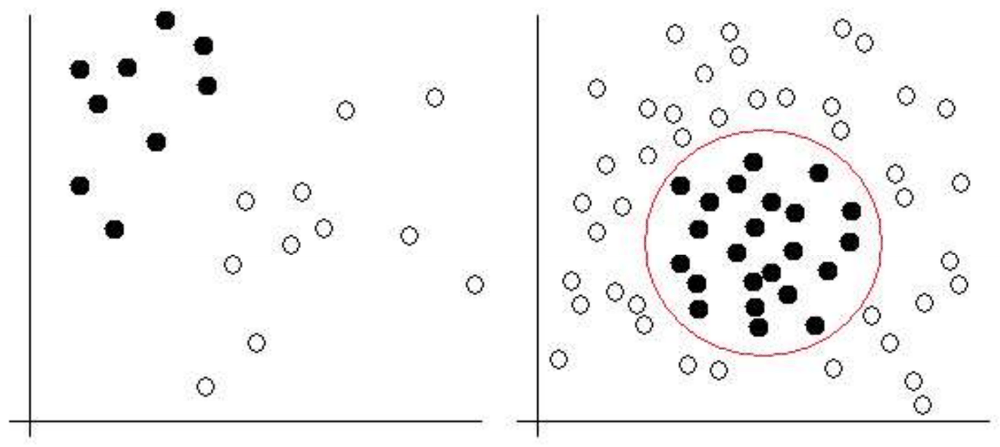
*Fig. 13.1 — Pattern linearmente separabili (sinistra) e non linearmente separabili (destra).*

### L'iperpiano separatore

Dato il training set $T = \{(\mathbf{x}_i, d_i)\}_{i=1}^{N}$, si cerca un iperpiano $\mathbf{w}^T\mathbf{x} + b = 0$ che separi gli esempi:
$$
\mathbf{w}^T\mathbf{x}_i + b \ge 0 \;\text{ se } d_i = +1, \qquad \mathbf{w}^T\mathbf{x}_i + b < 0 \;\text{ se } d_i = -1.
$$
$g(\mathbf{x}) = \mathbf{w}^T\mathbf{x} + b$ è la **funzione discriminante** e $h(\mathbf{x}) = \operatorname{sign}(g(\mathbf{x}))$ è l'**ipotesi**.

### Il margine di separazione

> [!definition] Margine di separazione
>
> Se l'iperpiano è alla stessa distanza dal più vicino esempio positivo e dal più vicino negativo, il **margine di separazione** $\rho$ è il doppio della distanza tra l'iperpiano e il punto più vicino. Lo si può pensare come una **"zona di sicurezza"** attorno al confine.

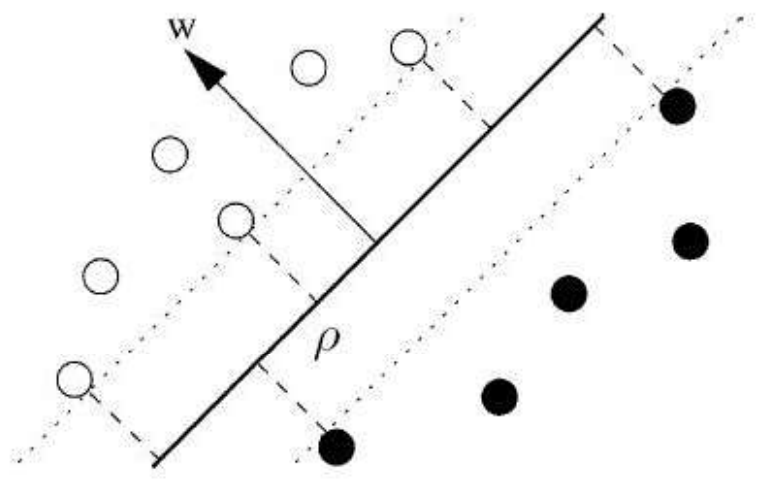
*Fig. 13.2 — Il margine di separazione $\rho$.*

Non tutti gli iperpiani che risolvono il problema sono uguali: al variare dell'iperpiano separatore varia anche il margine.

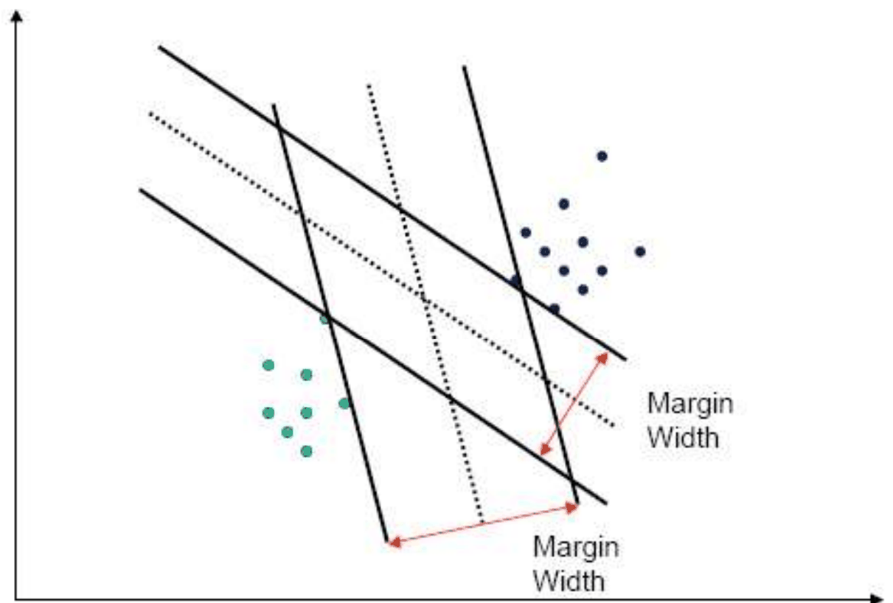
*Fig. 13.3 — Iperpiani separatori diversi hanno margini diversi.*

> [!definition] Iperpiano ottimo
>
> L'**iperpiano ottimo** $\mathbf{w}_o^T\mathbf{x} + b_o = 0$ ("o" sta per *optimal*) è quello che **massimizza il margine** $\rho$. Vedremo che $\rho = \dfrac{2}{\|\mathbf{w}\|}$, quindi
> $$
> \text{massimizzare } \rho \iff \text{minimizzare } \|\mathbf{w}\|.
> $$

### Rappresentazione canonica e support vector

Per la **libertà di scala** (moltiplicando $\mathbf{w}$ e $b$ per una costante l'iperpiano non cambia) possiamo riscalare $\mathbf{w}$ e $b$ in modo che i punti più vicini all'iperpiano soddisfino $|g(\mathbf{x}_i)| = |\mathbf{w}^T\mathbf{x}_i + b| = 1$. Allora:
$$
\mathbf{w}^T\mathbf{x}_i + b \ge 1 \;\text{ se } d_i = +1, \qquad \mathbf{w}^T\mathbf{x}_i + b \le -1 \;\text{ se } d_i = -1,
$$
cioè, in forma compatta:
$$
d_i(\mathbf{w}^T\mathbf{x}_i + b) \ge 1 \qquad \forall i = 1,\dots,N.
$$

> [!definition] Support vector
>
> Un **support vector** $\mathbf{x}^{(s)}$ soddisfa il vincolo **con l'uguaglianza**: $d^{(s)}(\mathbf{w}^T\mathbf{x}^{(s)} + b) = 1$. I support vector sono i punti **più vicini** all'iperpiano, quelli che stanno sul bordo del margine.

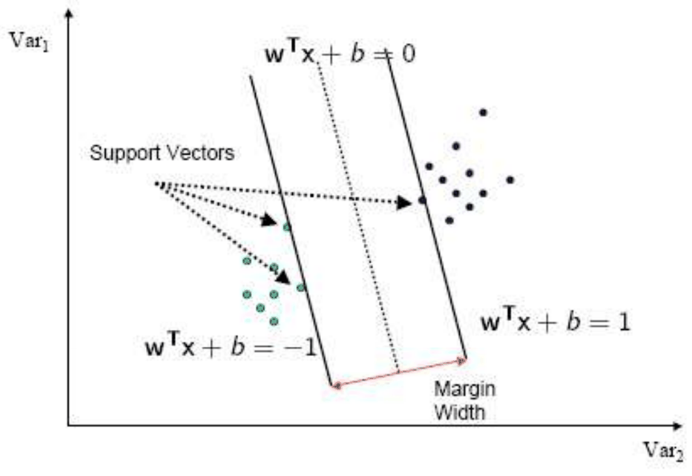
*Fig. 13.4 — I support vector giacciono sulle rette $\mathbf{w}^T\mathbf{x} + b = \pm 1$.*

### Calcolo del margine

**Distanza di un punto dall'iperpiano.** Sia $r$ la distanza tra $\mathbf{x}$ e l'iperpiano ottimo. Poiché $\mathbf{w}_o$ è ortogonale all'iperpiano, possiamo scrivere
$$
\mathbf{x} = \mathbf{x}_p + r\,\frac{\mathbf{w}_o}{\|\mathbf{w}_o\|},
$$
dove $\mathbf{x}_p$ è la proiezione di $\mathbf{x}$ sull'iperpiano.

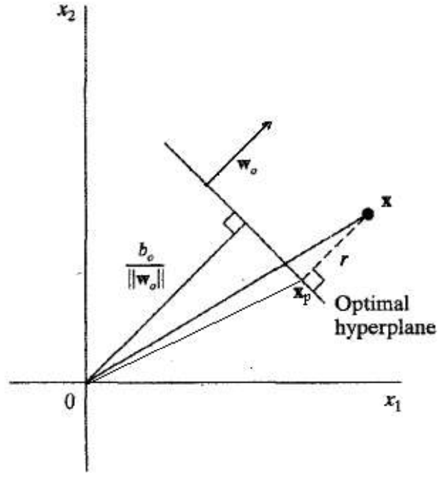
*Fig. 13.5 — Distanza $r$ tra un punto $\mathbf{x}$ e l'iperpiano ottimo.*

Valutando $g(\mathbf{x}) = \mathbf{w}_o^T\mathbf{x} + b_o$:
$$
g(\mathbf{x}) = \mathbf{w}_o^T\mathbf{x}_p + b_o + r\,\mathbf{w}_o^T\frac{\mathbf{w}_o}{\|\mathbf{w}_o\|} = \underbrace{g(\mathbf{x}_p)}_{=0} + r\,\frac{\|\mathbf{w}_o\|^2}{\|\mathbf{w}_o\|} = r\,\|\mathbf{w}_o\|,
$$
perché $\mathbf{x}_p$ sta sull'iperpiano. Quindi
$$
r = \frac{g(\mathbf{x})}{\|\mathbf{w}_o\|}.
$$

**Margine.** Per un support vector positivo $g(\mathbf{x}^{(s)}) = 1$, quindi la sua distanza dall'iperpiano è $r = \frac{1}{\|\mathbf{w}_o\|} = \frac{\rho}{2}$. Da cui:
$$
\rho = \frac{2}{\|\mathbf{w}_o\|}.
$$
L'iperpiano ottimo massimizza $\rho$, cioè **minimizza $\|\mathbf{w}\|$**.

### Il problema di ottimizzazione quadratica (hard margin)

La derivazione formale richiede tecniche di **ottimizzazione vincolata** (assunte note, ad esempio dal corso CM); la programmazione quadratica si considera risolta da pacchetti esistenti. Qui interessa capire come è formulato il problema, la relazione tra support vector e moltiplicatori $\alpha$, e il risultato finale per $\mathbf{w}_o$.

> [!definition] Problema primale — SVM hard margin
>
> Dato $T = \{(\mathbf{x}_i, d_i)\}_{i=1}^N$, trovare $\mathbf{w}$ e $b$ che minimizzano
> $$
> \Psi(\mathbf{w}) = \frac{1}{2}\mathbf{w}^T\mathbf{w} \qquad (\text{cioè } \min \|\mathbf{w}\|)
> $$
> soggetto ai vincoli (zero errori di classificazione)
> $$
> d_i(\mathbf{w}^T\mathbf{x}_i + b) \ge 1 \qquad \forall i = 1,\dots,N.
> $$

- La funzione obiettivo è **quadratica e convessa** in $\mathbf{w}$.
- I vincoli sono **lineari** in $\mathbf{w}$.
- Risolvere questo problema scala con la dimensione dello spazio di input $m$ (il costo effettivo dipende comunque dall'algoritmo del risolutore).

#### Soluzione con i moltiplicatori di Lagrange*

Si costruisce la **lagrangiana**:
$$
J(\mathbf{w}, b, \boldsymbol{\alpha}) = \frac{1}{2}\mathbf{w}^T\mathbf{w} - \sum_{i=1}^{N}\alpha_i\big(d_i(\mathbf{w}^T\mathbf{x}_i + b) - 1\big),
$$
con $\alpha_i \ge 0$ i **moltiplicatori di Lagrange**, uno per ogni vincolo del primale. $J$ va **minimizzata rispetto a $\mathbf{w}$ e $b$** e **massimizzata rispetto ad $\boldsymbol{\alpha}$**: la soluzione è un **punto di sella** di $J$.

Condizioni di ottimalità:
$$
\frac{\partial J}{\partial \mathbf{w}} = 0 \;\Rightarrow\; \mathbf{w} = \sum_{i=1}^{N}\alpha_i d_i\mathbf{x}_i, \qquad \frac{\partial J}{\partial b} = 0 \;\Rightarrow\; \sum_{i=1}^{N}\alpha_i d_i = 0.
$$

**Condizioni di Kuhn-Tucker.** Nel punto di sella vale
$$
\alpha_i\big(d_i(\mathbf{w}^T\mathbf{x}_i + b) - 1\big) = 0 \qquad \forall i.
$$
Quindi:

- se $\alpha_i > 0$, allora $d_i(\mathbf{w}^T\mathbf{x}_i + b) = 1$: $\mathbf{x}_i$ è un **support vector**;
- se $\mathbf{x}_i$ non è un support vector, allora $\alpha_i = 0$.

> [!tip] L'iperpiano dipende solo dai support vector
>
> $\mathbf{w}_o = \sum_{i=1}^{N_s}\alpha_{o,i}\,d_i\,\mathbf{x}_i$: la somma si restringe agli $N_s$ support vector. **L'iperpiano dipende solo dai support vector!** Tutti gli altri punti potrebbero essere rimossi senza cambiare la soluzione.

#### Il problema duale*

Sostituendo le condizioni di ottimalità in $J$ si ottiene il **problema duale**, in cui compaiono solo i moltiplicatori:

> [!definition] Problema duale — SVM hard margin
>
> Trovare $\{\alpha_i\}_{i=1}^N$ che massimizzano
> $$
> Q(\boldsymbol{\alpha}) = \sum_{i=1}^{N}\alpha_i - \frac{1}{2}\sum_{i=1}^{N}\sum_{j=1}^{N}\alpha_i\alpha_j d_i d_j\,\mathbf{x}_i^T\mathbf{x}_j
> $$
> soggetto a $\alpha_i \ge 0$ per ogni $i$ e $\sum_{i=1}^{N}\alpha_i d_i = 0$.

Gli $\alpha$ si trovano risolvendo il problema di **programmazione quadratica** (QP) o con approcci più recenti ed efficienti (ad esempio **SMO**, *Sequential Minimal Optimization*). Il duale scala con il **numero di esempi $N$**, meno con la dimensione dello spazio. Si noti che i dati compaiono **solo tramite prodotti scalari** $\mathbf{x}_i^T\mathbf{x}_j$: sarà la chiave dei kernel.

#### Ottenere $\mathbf{w}_o$ e $b_o$

1. Risolvere il duale ottenendo $\{\alpha_{o,i}\}$.
2. Calcolare $\mathbf{w}_o = \sum_{i=1}^N\alpha_{o,i}d_i\mathbf{x}_i$.
3. Calcolare $b_o = 1 - \mathbf{w}_o^T\mathbf{x}^{(s)}$ per un support vector positivo $\mathbf{x}^{(s)}$, cioè $b_o = 1 - \sum_{i=1}^N\alpha_{o,i}d_i\,\mathbf{x}_i^T\mathbf{x}^{(s)}$.

### Come si usa

Non serve conoscere esplicitamente $\mathbf{w}_o$: bastano i moltiplicatori (dal duale) e il bias. La superficie di decisione è
$$
\mathbf{w}_o^T\mathbf{x} + b_o = 0 \iff \sum_{i=1}^N\alpha_{o,i}\,d_i\,\underbrace{\mathbf{x}_i^T\mathbf{x}}_{\text{prodotto scalare}} + b_o = 0.
$$
Dato un pattern $\mathbf{x}$: (1) calcolare $g(\mathbf{x}) = \sum_{i=1}^N\alpha_{o,i}d_i\,\mathbf{x}_i^T\mathbf{x} + b_o$; (2) classificare con il segno di $g(\mathbf{x})$. La somma si può restringere agli $N_s$ support vector.

### Perché migliora la generalizzazione?

Su problemi linearmente separabili abbiamo **fissato l'errore di training** (a zero). Minimizzare la norma di $\mathbf{w}$ equivale allora a **minimizzare la VC-dimension**, e quindi il termine di capacità (VC-confidence) $\varepsilon$ in
$$
R[h] \le R_{emp}[h] + \varepsilon(VC, N, \delta).
$$

> [!theorem] Teorema di Vapnik
>
> Sia $D$ il diametro della più piccola sfera che contiene i dati $\mathbf{x}_1,\dots,\mathbf{x}_N$. Per la classe degli iperpiani separatori $\mathbf{w}^T\mathbf{x} + b = 0$ con margine $\rho$, la VC-dimension è limitata da
> $$
> VC \le \min\left(\left\lceil\frac{D^2}{\rho^2}\right\rceil, m_0\right) + 1.
> $$

Poiché $\frac{D^2}{\rho^2} \propto \text{Raggio}^2\,\|\mathbf{w}\|^2$, la VC-dim può essere **minore di $m_0 + 1$** (quella degli iperpiani generici) restringendo la ricerca agli iperpiani "regolarizzati" con margine massimo. **Più il margine è grande, più la VC-dim è piccola**, indipendentemente dalla dimensione dello spazio.

### Perché è un approccio elegante

Per dati linearmente separabili ci sono molte soluzioni; Vapnik propone l'**iperpiano separatore ottimo** a margine massimo, che fornisce:

- una **soluzione unica** (a differenza dell'algoritmo iterativo del Perceptron) con **zero errori** (a differenza dell'LMS) per il classificatore binario;
- un'**SRM automatizzata**, che minimizza la VC-confidence (massimizzando il margine) direttamente all'interno del processo di ottimizzazione, **senza iperparametri** nel caso separabile;
- l'uso di risolutori di **programmazione quadratica vincolata** (anziché la discesa del gradiente), con una bella forma duale che mostra i support vector e i prodotti scalari tra pattern;
- una soluzione concentrata su dati di training **"selezionati"**, i support vector: pregio, perché non dipende dai punti lontani dal confine; difetto, perché si spera che i punti sul confine non siano i più rumorosi.

Ma cosa fare con dati **rumorosi** o **non linearmente separabili**?

---

## SVM soft margin: ammettere errori

Se almeno un punto viola la condizione di separazione esatta $d_i(\mathbf{w}^T\mathbf{x}_i + b) \ge 1$, si passa al **soft margin**.

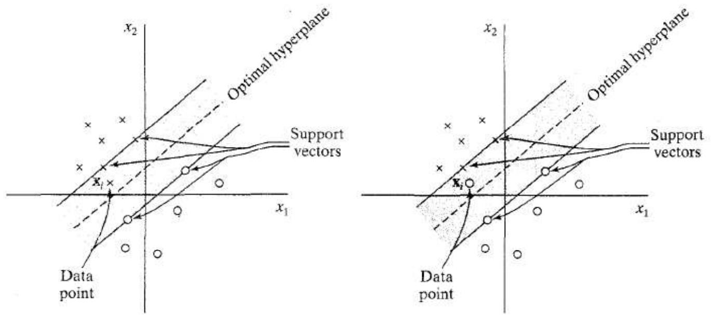
*Fig. 13.6 — Pattern che violano il margine, senza (sinistra) e con (destra) errore di classificazione.*

> [!tip] Il vantaggio del soft margin
>
> Ammettere punti dentro il margine permette di avere un **margine più ampio**: si ottiene tolleranza al rumore e un modello più semplice. (Esercizio: trovare il margine delle figure senza ammettere punti al suo interno.)

### Variabili slack

Si introducono variabili non negative $\xi_i \ge 0$, dette **variabili slack**, e i vincoli diventano
$$
d_i(\mathbf{w}^T\mathbf{x}_i + b) \ge 1 - \xi_i \qquad \forall i.
$$
- $\xi_i = 0$: il punto è fuori dal margine o sul bordo;
- $0 < \xi_i \le 1$: il punto è dentro il margine ma classificato correttamente;
- $\xi_i > 1$: il punto è classificato male.

Un support vector soddisfa ora $d_i(\mathbf{w}^T\mathbf{x}_i + b) = 1 - \xi_i$.

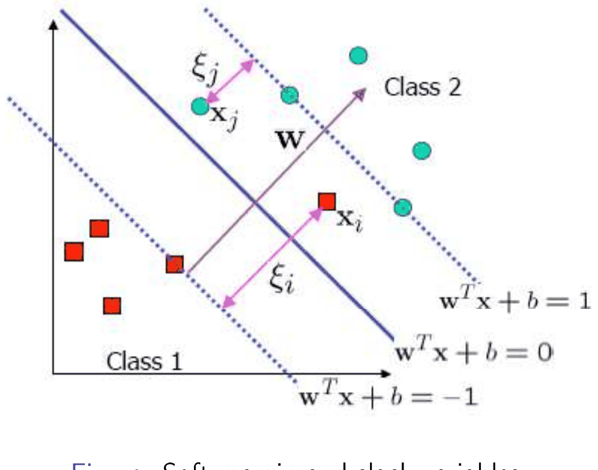
*Fig. 13.7 — Soft margin e variabili slack.*

Attenzione: il **teorema di Vapnik non vale più** (l'hard margin non ammette punti nel margine).

### Il problema primale soft margin

> [!definition] Problema primale — SVM soft margin
>
> Trovare $\mathbf{w}$ e $b$ che minimizzano
> $$
> \Psi(\mathbf{w}, \boldsymbol{\xi}) = \frac{1}{2}\mathbf{w}^T\mathbf{w} + C\sum_{i=1}^{N}\xi_i
> $$
> soggetto a $d_i(\mathbf{w}^T\mathbf{x}_i + b) \ge 1 - \xi_i$ e $\xi_i \ge 0$ per ogni $i$.

$C$ è un **iperparametro di regolarizzazione** (si perde la SRM completamente automatica!): regola il compromesso tra minimizzazione del rischio empirico e minimizzazione del termine di capacità (VC-confidence).

- **$C$ basso**: molti errori di training ammessi → possibile **underfitting**.
- **$C$ alto**: nessun errore ammesso → margine più piccolo → possibile **overfitting**.

(Per $C \to \infty$ si ritrova l'hard margin.)

### Il duale soft margin*

> [!definition] Problema duale — SVM soft margin
>
> Trovare $\{\alpha_i\}$ che massimizzano
> $$
> Q(\boldsymbol{\alpha}) = \sum_{i=1}^{N}\alpha_i - \frac{1}{2}\sum_{i=1}^{N}\sum_{j=1}^{N}\alpha_i\alpha_j d_i d_j\,\mathbf{x}_i^T\mathbf{x}_j
> $$
> soggetto a $\sum_{i=1}^{N}\alpha_i d_i = 0$ e $0 \le \alpha_i \le C$ per ogni $i$.

È **identico** al caso hard margin, tranne il vincolo superiore $\alpha_i \le C$. Le condizioni di Kuhn-Tucker diventano
$$
\alpha_i\big(d_i(\mathbf{w}^T\mathbf{x}_i + b) + \xi_i - 1\big) = 0, \qquad \mu_i\xi_i = 0,
$$
dove i $\mu_i$ sono i moltiplicatori che impongono $\xi_i \ge 0$. Ne segue:

- $0 < \alpha_i < C \Rightarrow \xi_i = 0$: il punto è **sul bordo** del margine;
- $\alpha_i = C \Rightarrow \xi_i \ge 0$: il punto è **dentro** il margine (o dal lato sbagliato).

**Soluzione**: $\mathbf{w}_o = \sum_i \alpha_{o,i}d_i\mathbf{x}_i$ e $b_o = d_j - \sum_i\alpha_{o,i}d_i\,\mathbf{x}_i^T\mathbf{x}_j$ per un pattern $j$ con $0 < \alpha_j < C$ (o la media su tutti questi, per stabilità numerica). I moltiplicatori non nulli corrispondono ai support vector. L'uso è come prima: $g(\mathbf{x}) = \sum_i\alpha_{o,i}d_i\,\mathbf{x}_i^T\mathbf{x} + b_o$, $h(\mathbf{x}) = \operatorname{sign}(g(\mathbf{x}))$.

---

## Kernel: SVM per problemi non lineari

### Mappare in uno spazio ad alta dimensione

> [!definition] Idea
>
> Mappare i dati dallo spazio degli input a uno **spazio delle feature** ad alta dimensione, dove diventano **linearmente separabili**.

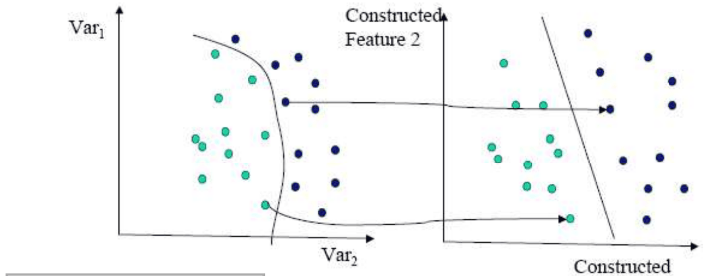
*Fig. 13.8 — Una funzione $\Phi(\mathbf{x})$ mappa i dati in uno spazio in cui sono linearmente separabili (si ricordi la LBE dei modelli lineari).*

> [!example] Da $\mathbb{R}^2$ a $\mathbb{R}^3$
>
> Con $\Phi: \mathbb{R}^2 \to \mathbb{R}^3$, $(x_1, x_2)^T \mapsto (x_1^2, \sqrt{2}x_1x_2, x_2^2)^T$ (monomi di secondo grado), due classi separate da un'ellisse nello spazio di input diventano separabili da un **piano** nello spazio delle feature.

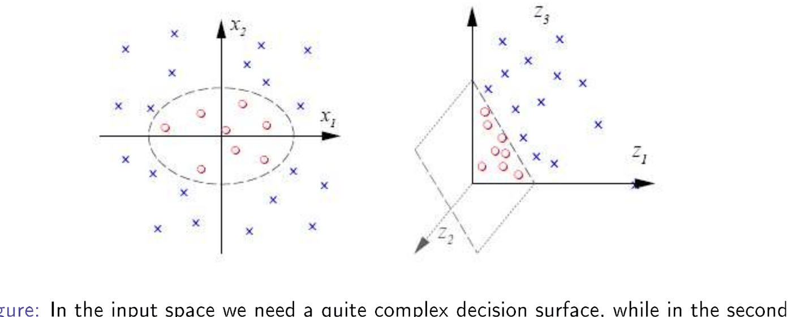
*Fig. 13.9 — Nello spazio di input serve una superficie complessa; nello spazio dei monomi di secondo grado basta una funzione lineare.*

La mappatura dell'esempio è costruita apposta per risolvere il problema (le feature corrispondono a ellissoidi nello spazio originale). Ma trovare la trasformazione "migliore" **non è automatico** (a meno di avere conoscenza a priori); spesso si usano trasformazioni generali. **La scelta di $\Phi$ è il punto critico delle SVM.**

### Spazi di feature ad alta dimensione

Il procedimento è: (1) mappatura non lineare dei pattern in uno spazio delle feature ad alta dimensione (per il **teorema di Cover**, i pattern vi sono linearmente separabili con alta probabilità); (2) ricerca dell'iperpiano ottimo nello spazio delle feature.

Ma sappiamo che spazi delle feature molto grandi (espansioni in basi ampie) possono essere **computazionalmente infattibili** e portare a **overfitting** senza controllare la dimensione dello spazio e la complessità del classificatore. L'**approccio kernel** permette di gestire lo spazio delle feature **implicitamente**, in un contesto regolarizzato (dove è il **margine** a regolare la complessità, non la dimensione dello spazio di input).

Con $\Phi: \mathbb{R}^{m_0} \to \mathbb{R}^{m_1}$, il training set diventa $\{(\Phi(\mathbf{x}_i), d_i)\}$ e l'iperpiano $\mathbf{w}^T\Phi(\mathbf{x}) + b = 0$. Includendo il bias ($w_0 = b$, $\phi_0(\mathbf{x}) = 1$), la superficie di decisione $\mathbf{w}^T\Phi(\mathbf{x}) = 0$ è un'**espansione lineare in basi** in cui la dimensione dello spazio può essere molto grande e la complessità dipende dal **margine**, non dalla dimensione.

Il vettore dei pesi è $\mathbf{w} = \sum_i \alpha_i d_i\Phi(\mathbf{x}_i)$, e l'iperpiano diventa
$$
\sum_{i=1}^{N}\alpha_i d_i\,\underbrace{\Phi^T(\mathbf{x}_i)\Phi(\mathbf{x})}_{\text{prodotto scalare}} = 0.
$$
Il prodotto scalare è ora nello spazio delle feature, e calcolare $\Phi(\mathbf{x})$ potrebbe essere intrattabile.

### Il kernel trick

Sotto certe condizioni **non serve calcolare $\Phi(\mathbf{x})$**, e nemmeno conoscere lo spazio delle feature! Basta una funzione che calcoli direttamente il prodotto scalare nello spazio delle feature:

> [!definition] Kernel (inner product kernel)
>
> $$
> k: \mathbb{R}^{m_0} \times \mathbb{R}^{m_0} \to \mathbb{R}, \qquad k(\mathbf{x}_i, \mathbf{x}) = \Phi^T(\mathbf{x}_i)\,\Phi(\mathbf{x}).
> $$
> Proprietà: è **simmetrica**, $k(\mathbf{x}_i, \mathbf{x}) = k(\mathbf{x}, \mathbf{x}_i)$.

> [!example] Il kernel dell'esempio
>
> Con $\Phi(\mathbf{x}) = (x_1^2, \sqrt{2}x_1x_2, x_2^2)^T$, per $\mathbf{x} = (x_1, x_2)^T$ e $\mathbf{y} = (y_1, y_2)^T$:
> $$
> \Phi^T(\mathbf{x})\Phi(\mathbf{y}) = x_1^2y_1^2 + 2x_1x_2y_1y_2 + x_2^2y_2^2 = (x_1y_1 + x_2y_2)^2 = (\mathbf{x}^T\mathbf{y})^2 = k(\mathbf{x}, \mathbf{y}).
> $$
> **Molto importante**: il prodotto scalare nello spazio delle feature (3D) viene calcolato **senza passare per la mappatura**, direttamente in termini dei pattern di input (2D).

### La matrice kernel

I prodotti scalari tra le immagini dei pattern di training si organizzano in una matrice $N \times N$, la **matrice kernel** (o matrice di Gram):
$$
K = \{k(\mathbf{x}_i, \mathbf{x}_j)\}_{i,j=1}^N,
$$
simmetrica perché il kernel è simmetrico.

**Ogni funzione kernel calcola un prodotto scalare in qualche spazio?** No: la proprietà vale solo per i kernel che producono matrici kernel **semidefinite positive** (**teorema di Mercer**), cioè con autovalori non negativi.

Proprietà di chiusura: se $k_1$ e $k_2$ sono kernel, lo sono anche $k_1 + k_2$, $\alpha k_1$ (con $\alpha > 0$) e $k_1 k_2$.

### SVM con kernel

Il primale nello spazio delle feature è lo stesso del soft margin con $\Phi(\mathbf{x}_i)$ al posto di $\mathbf{x}_i$ (ma $\mathbf{w}$ vive nello spazio delle feature, che può rendere il problema intrattabile). Il **duale** invece è trattabile:

> [!definition] Problema duale nello spazio delle feature
>
> Trovare $\{\alpha_i\}$ che massimizzano
> $$
> Q(\boldsymbol{\alpha}) = \sum_{i=1}^{N}\alpha_i - \frac{1}{2}\sum_{i,j=1}^{N}\alpha_i\alpha_j d_i d_j\,\underbrace{k(\mathbf{x}_i, \mathbf{x}_j)}_{K_{ij}}
> $$
> soggetto a $\sum_i\alpha_i d_i = 0$ e $0 \le \alpha_i \le C$.

Il kernel incorpora la mappatura nello spazio delle feature. La dipendenza da $N$ (anziché dalla dimensione dello spazio) diventa ora un **vantaggio**, perché lo spazio delle feature può avere dimensione altissima o infinita.

> [!abstract] Riepilogo del procedimento
>
> 1. Si ha il training set $T = \{(\mathbf{x}_i, d_i)\}$.
> 2. Si scelgono il parametro $C$ e la funzione kernel $k$.
> 3. Si calcola la matrice kernel $K$.
> 4. Si risolve il problema di ottimizzazione (programmazione quadratica) trovando $\{\alpha_i\}$.
> 5. Si calcola il bias $b$ dai moltiplicatori e dalla matrice kernel.
> 6. Per un nuovo pattern $\mathbf{x}$: $\mathbf{w}^T\Phi(\mathbf{x}) = \sum_i\alpha_i d_i\,k(\mathbf{x}, \mathbf{x}_i) + b$ (senza mai calcolare $\mathbf{w}$!), e si classifica con il segno.
>
> **Sparsità**: la soluzione è sparsa negli $\alpha$, perché tutti i moltiplicatori dei non-support vector sono nulli.

In fase di test: $h(\mathbf{x}) = \operatorname{sign}\left(\sum_i\alpha_i d_i\,k(\mathbf{x}, \mathbf{x}_i) + b\right)$. Si memorizzano gli $\mathbf{x}_i$ (i support vector) per la fase di test: somiglia al K-NN?

### Vista "architetturale" di una SVM

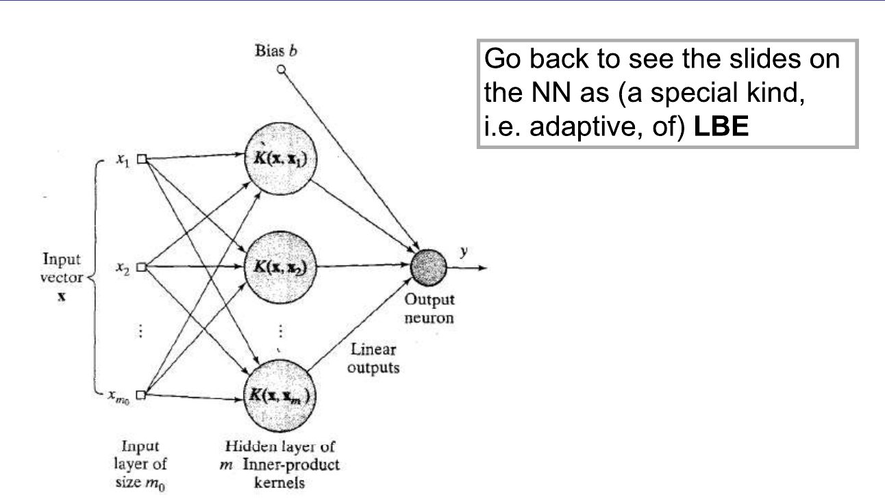
*Fig. 13.10 — "Architettura" di una SVM: numero di unità nascoste = numero di support vector.*

Il numero di "unità nascoste" è pari al **numero di support vector**, ma non sono esattamente le stesse unità di una rete neurale: le unità nascoste di una rete hanno **parametri liberi adattivi**, qui invece i "centri" sono i support vector stessi e la funzione è fissata dal kernel. È solo una vista illustrativa: da confrontare con le reti neurali (una forma adattiva di LBE) in termini di controllo della complessità, efficienza e altre caratteristiche.

### Esempi di kernel

- **Polinomiale**: $k(\mathbf{x}, \mathbf{x}_i) = (\mathbf{x}^T\mathbf{x}_i + 1)^p$, con $p$ scelto dall'utente.
- **RBF** (*Radial Basis Function*, detto anche **kernel gaussiano**): $k(\mathbf{x}, \mathbf{x}_i) = e^{-\frac{1}{2\sigma^2}\|\mathbf{x} - \mathbf{x}_i\|^2}$, con $\sigma^2$ scelto dall'utente. Con kernel molto "stretti" ($\sigma$ piccolo) la risposta su $\mathbf{x}_i$ è solo $d_i$ (somiglia al 1-NN!).
- **Perceptron a due strati**: $k(\mathbf{x}, \mathbf{x}_i) = \tanh(\beta_0\mathbf{x}^T\mathbf{x}_i + \beta_1)$, con $\beta_0 > 0$ e $\beta_1 < 0$.

> [!warning] Importante
>
> Per il kernel polinomiale e l'RBF si ottiene **sempre** un kernel valido (prodotto scalare), mentre per il perceptron a due strati il teorema di Mercer vale solo per alcune scelte di $\beta_0$ e $\beta_1$. Un kernel RBF corrisponde sempre a uno spazio delle feature di **dimensione infinita**.

---

## Parte II — SVM per la regressione non lineare

### Il problema

Si ha $d = f(\mathbf{x}) + v$, con $f$ sconosciuta e rumore $v$ indipendente da $\mathbf{x}$. Si stima $d$ con un'espansione lineare di funzioni non lineari:
$$
y = h(\mathbf{x}) = \mathbf{w}^T\Phi(\mathbf{x}), \qquad \mathbf{w} = (b, w_1, \dots, w_{m_1})^T, \quad \Phi(\mathbf{x}) = (1, \phi_1(\mathbf{x}), \dots, \phi_{m_1}(\mathbf{x}))^T.
$$

### La loss $\varepsilon$-insensitive

$$
L_\varepsilon(d, y) = \begin{cases} |d - y| - \varepsilon & \text{se } |d - y| \ge \varepsilon \\ 0 & \text{altrimenti.} \end{cases}
$$

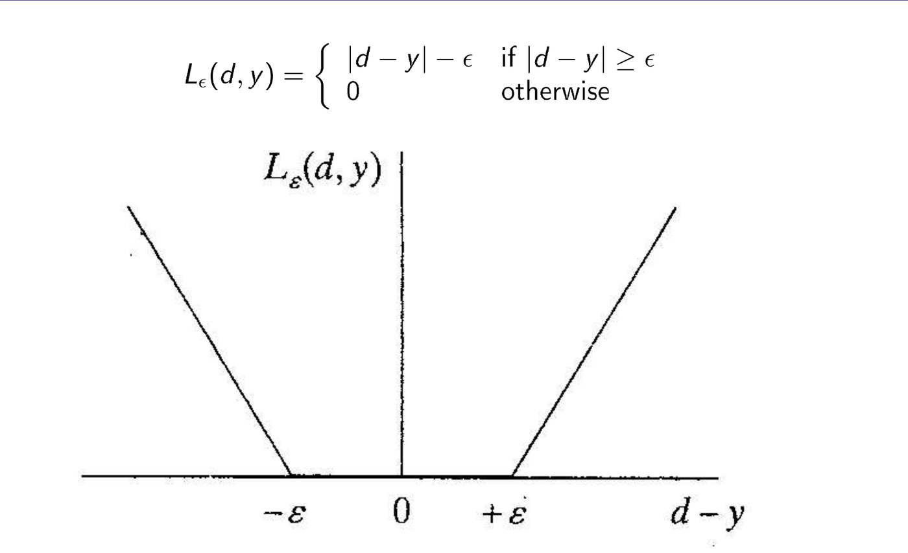
*Fig. 13.11 — La loss $\varepsilon$-insensitive (o *soft margin loss*).*

Gli errori più piccoli di $\varepsilon$ **non costano nulla**: si forma un **tubo** di ampiezza $\varepsilon$ attorno alla predizione, e solo i punti fuori dal tubo contribuiscono alla loss. Di nuovo, **solo i support vector guidano la soluzione**: nella classificazione erano i punti oltre il margine, qui sono i punti fuori dal tubo.

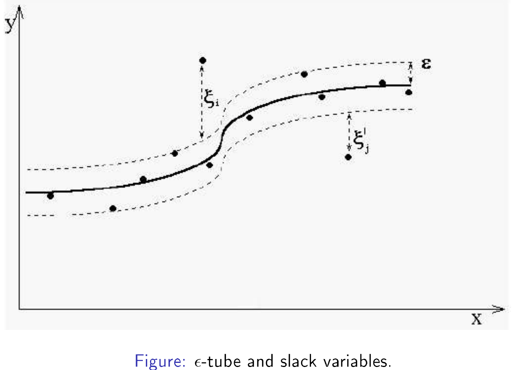
*Fig. 13.12 — Il tubo $\varepsilon$ e le variabili slack per la regressione.*

### Formulazione

Si introducono due insiemi di variabili slack non negative $\xi_i$ e $\xi'_i$ (sopra e sotto il tubo):
$$
-\xi'_i - \varepsilon \le d_i - \mathbf{w}^T\Phi(\mathbf{x}_i) \le \varepsilon + \xi_i.
$$

> [!definition] Problema primale — SVM per la regressione
>
> Minimizzare
> $$
> \Psi(\mathbf{w}, \boldsymbol{\xi}, \boldsymbol{\xi}') = \frac{1}{2}\mathbf{w}^T\mathbf{w} + C\sum_{i=1}^{N}(\xi_i + \xi'_i)
> $$
> soggetto a $d_i - \mathbf{w}^T\Phi(\mathbf{x}_i) \le \varepsilon + \xi_i$, $\;\mathbf{w}^T\Phi(\mathbf{x}_i) - d_i \le \varepsilon + \xi'_i$, $\;\xi_i \ge 0$, $\;\xi'_i \ge 0$.

> [!definition] Problema duale — SVM per la regressione*
>
> Trovare $\{\alpha_i\}$ e $\{\alpha'_i\}$ che massimizzano
> $$
> Q(\boldsymbol{\alpha}, \boldsymbol{\alpha}') = \sum_{i=1}^{N}d_i(\alpha_i - \alpha'_i) - \varepsilon\sum_{i=1}^{N}(\alpha_i + \alpha'_i) - \frac{1}{2}\sum_{i,j=1}^{N}(\alpha_i - \alpha'_i)(\alpha_j - \alpha'_j)\,k(\mathbf{x}_i, \mathbf{x}_j)
> $$
> soggetto a $\sum_i(\alpha_i - \alpha'_i) = 0$ e $0 \le \alpha_i, \alpha'_i \le C$.

Dalla soluzione:
$$
\mathbf{w} = \sum_{i=1}^{N}\underbrace{(\alpha_i - \alpha'_i)}_{\gamma_i}\Phi(\mathbf{x}_i), \qquad h(\mathbf{x}) = \sum_{i=1}^{N}\gamma_i\,\Phi^T(\mathbf{x}_i)\Phi(\mathbf{x}) = \sum_{i=1}^{N}\gamma_i\,k(\mathbf{x}_i, \mathbf{x}).
$$
I **support vector** corrispondono ai $\gamma_i$ non nulli.

> [!abstract] Riepilogo per la regressione
>
> 1. Scegliere i parametri $C$ ed $\varepsilon$.
> 2. Scegliere un kernel $k$.
> 3. Calcolare la matrice kernel $K$.
> 4. Risolvere il duale e ottenere i $\gamma_i$.
> 5. Calcolare il bias ottimo.
> 6. La funzione stimata è una combinazione lineare di prodotti scalari in uno spazio delle feature che possiamo ignorare: $h(\mathbf{x}) = \sum_i\gamma_i\,k(\mathbf{x}_i, \mathbf{x})$.

---

> [!question] Cosa bisogna sapere
>
> - La definizione di classificatore a **margine massimo**.
> - Come il margine massimo si trasforma in un problema di **programmazione quadratica**.
> - Cosa la QP fa per noi (non come lo fa).
> - Perché l'SVM approssima la **SRM**.
> - Come si gestiscono dati **rumorosi** (non separabili): soft margin.
> - Come si ottengono **confini non lineari**: kernel.
> - Come i kernel permettono di lavorare con espansioni in basi di dimensione altissima senza calcolarle.
> - Come funziona la SVM per la regressione ($\varepsilon$-insensitive loss).

Riferimenti: Haykin, *Neural Networks* (2ª ed.), cap. 6 ("necessario e sufficiente"); Burges, *A Tutorial on Support Vector Machines for Pattern Recognition*; Schölkopf e Smola, *Learning with Kernels*; Vapnik, *The Nature of Statistical Learning Theory* e *An Overview of Statistical Learning Theory* (1999).
