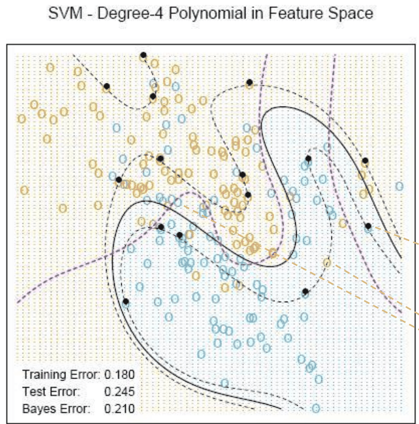
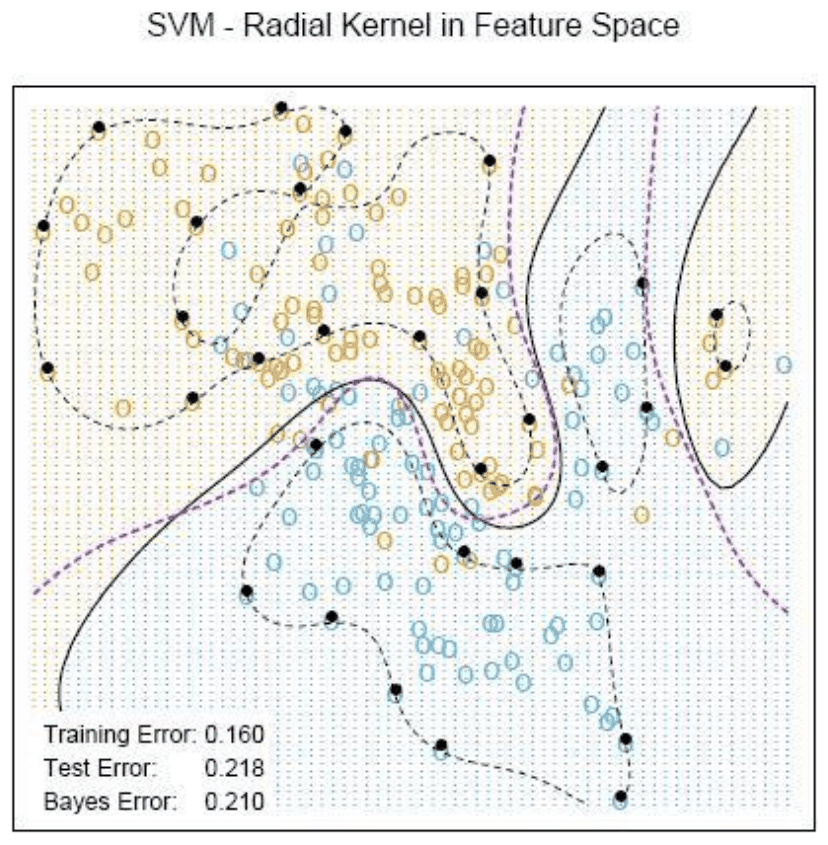
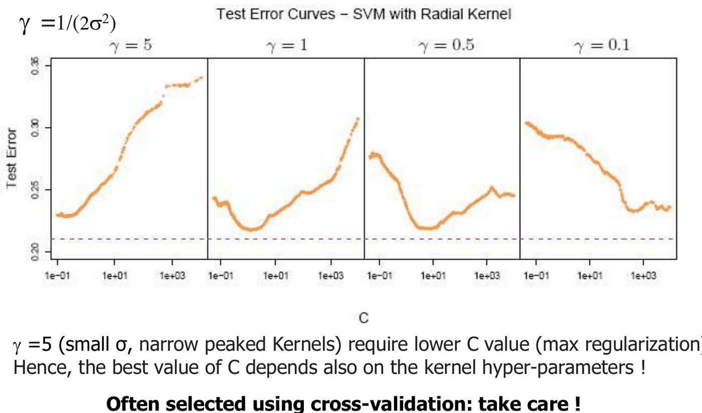
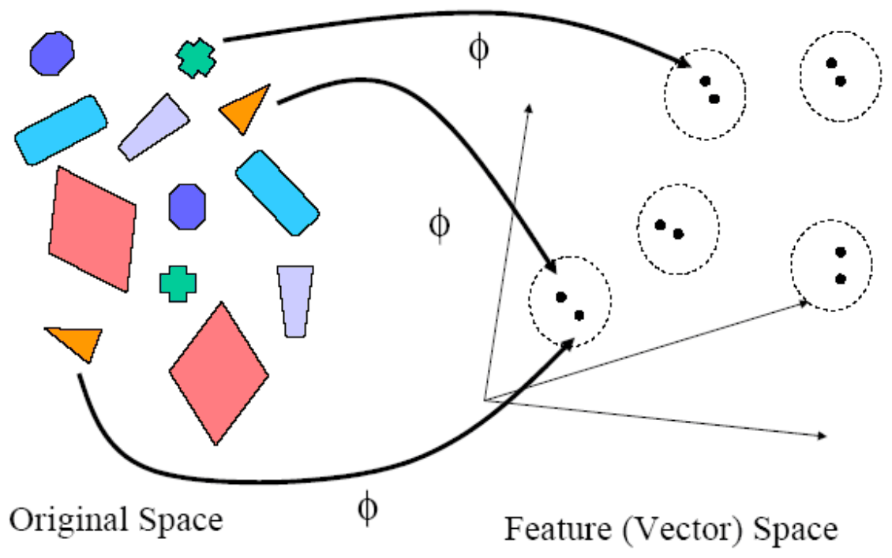

# SVM e kernel: aspetti pratici e visione critica

*Appunti di Fabio Piscitelli — Machine Learning (654AA), Prof. Alessio Micheli, Università di Pisa, a.a. 2026/27*

Questo pacco di slide completa [[13 - Support Vector Machines]] con una visione critica: pregi e difetti delle SVM, esempi di risultati, il ruolo cruciale degli iperparametri, alcuni luoghi comuni da sfatare e la generalizzazione ai **metodi kernel**.

## Caratteristiche principali

> [!abstract] Pregi
>
> - **Regolarizzazione incorporata** nel problema di ottimizzazione (il margine).
> - **Approssimazione della SRM** teorica (il bound sulla VC-dim degli iperpiani viene minimizzato dalla soluzione, nel caso hard margin senza kernel).
> - **Problema convesso**: l'addestramento trova sempre il **minimo globale** (a differenza delle reti neurali).
> - **Trasformazione implicita delle feature** tramite i kernel.

> [!warning] Difetti
>
> - Bisogna **scegliere il kernel e i suoi parametri**.
> - È un algoritmo **batch**.
> - Problemi molto grandi erano computazionalmente intrattabili: oltre circa 20.000 esempi era difficile risolverli esattamente con gli approcci standard (la matrice kernel è $N \times N$). Oggi esistono molte soluzioni, anche basate sulla discesa del gradiente.

In sintesi, i vantaggi:

- un **modello lineare** (semplice, compatto) con un bound sulla complessità in termini di **margine**, che viene ottimizzato direttamente;
- un ricco insieme di **funzioni di decisione non lineari** nello spazio di input tramite i kernel: si fa ancora una separazione lineare, ma in uno spazio diverso, con un trattamento **efficiente** della LBE. Un insieme ricco non implica necessariamente una VC-dim alta, che per le SVM dipende da margine, parametri del kernel, $C$, ecc.;
- il **kernel trick** si estende ad altri modelli: i **metodi kernel**.

## Risultati

### La prima applicazione famosa

Il riconoscimento di cifre manoscritte (**MNIST**) fu un caso storico di successo per le SVM: circa lo 0,8% di errori nel 1998 con una SVM polinomiale di grado 9, un risultato notevole, paragonabile a LeNet e ottenuto senza anni di sviluppo dell'architettura. L'attenzione per SVM e SLT (i cui studi risalivano agli anni '60–'70) crebbe molto: un esempio della rilevanza delle applicazioni, o dell'importanza di una buona teoria per applicazioni di successo.

### L'esempio della miscela di gaussiane

Riprendiamo il problema delle due classi (miscela di gaussiane) già visto con i modelli lineari, il K-NN e le reti neurali.

*Fig. 14.1 — SVM con kernel polinomiale di grado 4 ($C = 1$): il 42% dei dati risulta essere support vector.*

*Fig. 14.2 — SVM con kernel RBF ($\gamma = 1/(2\sigma^2) = 1$): il 45% dei dati sono support vector.*

I support vector sono i punti **sul margine** (slack = 0) o **dalla parte sbagliata** del margine (slack > 0). Il kernel radiale dà il risultato migliore, come ci si può aspettare visto che i dati provengono da miscele di gaussiane. Si confronti con la rete neurale con 10 unità e weight decay 0,02 (errore di test 0,223): risultati simili.

> [!warning] Tanti support vector
>
> Nella teoria si assume che i support vector siano pochi, ma **non è sempre vero**: qui sono più del 40% dei dati. La sparsità della soluzione non è garantita.

## Le SVM nella pratica

> [!note] Nessuna garanzia
>
> *"Attualmente non esiste una teoria che garantisca che una data famiglia di SVM abbia alta accuratezza su un dato problema"* (Burges, 1998).

Le belle proprietà dei classificatori hard margin **non si estendono direttamente** al soft margin e ai kernel: il parametro $C$ e il kernel possono portare a una VC-dim anche **infinita**. Ad esempio:

- una SVM con kernel gaussiano di **larghezza $\sigma$ sufficientemente piccola** può classificare correttamente un numero arbitrariamente grande di punti (come il 1-NN, solo il support vector più vicino a $\mathbf{x}$ contribuisce alla soluzione): VC-dim infinita, a meno di regolarizzare;
- all'opposto, con una larghezza **grande** tutti i support vector contribuiscono e si ottiene una sorta di "media globale", con VC-dim bassa.

Quindi **controllando la larghezza del kernel si controlla la VC-dim**.

### Il ruolo critico degli iperparametri

*Fig. 14.3 — Errore di test in funzione di $C$ per diversi valori di $\gamma = 1/(2\sigma^2)$.*

Con $\gamma = 5$ (piccolo $\sigma$, kernel molto stretti) serve un $C$ basso (massima regolarizzazione); con $\gamma$ piccoli l'ottimo si sposta verso $C$ più alti. **Il miglior valore di $C$ dipende anche dagli iperparametri del kernel**: vanno selezionati **insieme** (grid search), di solito con cross-validation, con attenzione.

Per applicare una SVM bisogna quindi scegliere il **tipo di kernel** (e i suoi parametri) e il valore di **$C$** (e di $\varepsilon$ per la regressione). Una selezione rigorosa richiederebbe una stima della complessità (VC-dim); gli iperparametri che influenzano la complessità sono quelli da usare nella model selection. In pratica si fa, ancora una volta, una **valutazione empirica accurata**: la regolazione degli iperparametri ($C$, $\gamma$...) può introdurre overfitting, quindi validation set + test set, oppure double CV.

Prestazioni: spesso buone, ma il confronto con altri metodi non è sempre favorevole. Dal 2012–2013 le **reti profonde** hanno superato nettamente i record precedenti nel riconoscimento di immagini e parlato.

### Luoghi comuni sulle SVM

> [!question] Esercizio: cosa c'è di sbagliato?
>
> 1. *"La SVM si può usare con i valori di default degli iperparametri."* → No: $C$ e i parametri del kernel sono critici e vanno selezionati.
> 2. *"Scelgo la SVM perché non va in overfitting."* → No: con soft margin e kernel la VC-dim può essere altissima; l'overfitting dipende da $C$ e dal kernel.
> 3. *"La SVM non ha problemi con input ad alta dimensione (risolve la maledizione della dimensionalità?)."* → **No**: la SVM gestisce bene l'alta dimensione dello **spazio delle feature**, non dello **spazio di input**. La curse of dimensionality dell'input resta.
> 4. *"Con la SVM si trova automaticamente il numero di unità."* → Il numero di support vector è determinato dalla soluzione, ma dipende da $C$ e dal kernel, che vanno scelti; e non è detto che sia piccolo.

---

## Metodi kernel

Il **kernel trick** porta ai **metodi kernel**, anche senza SVM: la "**kernelizzazione**" di approcci tradizionali. Ogni volta che in un modello compare un **prodotto scalare** o una **misura di similarità**, lo si può sostituire con un kernel, facendo operare il modello in un nuovo spazio implicito ad alta dimensione semplicemente specificando (e cambiando) il kernel.

- È un'**espansione lineare in basi** fissa e ad alta dimensione, ma molto **efficiente**.
- La scelta delle funzioni di base è **modulare**: si cambia il kernel senza cambiare la macchina di apprendimento.
- Fornisce un quadro teorico unificato per funzioni generali di tipo prodotto scalare.

### Kernel come misura di similarità

Il kernel è legato a una misura di **similarità** tra $\mathbf{s}$ e $\mathbf{t}$; infatti induce la distanza nello spazio delle feature:
$$
d_k(\mathbf{s}, \mathbf{t})^2 = k(\mathbf{s}, \mathbf{s}) - 2k(\mathbf{s}, \mathbf{t}) + k(\mathbf{t}, \mathbf{t}) = \|\Phi(\mathbf{s}) - \Phi(\mathbf{t})\|^2.
$$
Oggetti simili (distanza piccola) → valore alto del kernel.

> [!tip] L'idea dei kernel
>
> Concentrarsi sulla rappresentazione e l'elaborazione dei **confronti tra coppie** di oggetti, anziché sulla rappresentazione di un singolo oggetto. In alcuni domini è più facile confrontare due oggetti che definire uno spazio astratto di feature in cui rappresentarne uno.

Una SVM è caratterizzata in gran parte dalla scelta del kernel. Si confronti con le **reti neurali**, dove le funzioni di base si **adattano** ai dati (apprendendo i pesi delle unità nascoste): nelle SVM la scelta del kernel migliore per un problema è ancora un tema di ricerca.

(Esercizio: ripensare il kernel come nei metodi basati su distanze, tipo K-NN. Quando un kernel è buono? Quando raggruppa nello spazio delle feature gli oggetti della stessa classe, riflettendo la similarità rilevante per il task. Quando è cattivo? Quando la similarità che induce non ha a che fare con il task, ad esempio se tutti gli oggetti risultano ugualmente simili o ugualmente diversi.)

*Fig. 14.4 — Un buon kernel per "oggetti": la mappa $\phi$ porta oggetti simili vicini nello spazio delle feature.*

### Argomenti avanzati

La **progettazione di nuovi kernel** richiede di scegliere una funzione "buona" per il dominio specifico, e si può estendere a **oggetti generici** in input, non solo vettori: kernel per **stringhe, alberi, grafi**; kernel ad hoc per il dominio e il task (ad esempio kernel basati sulla *edit distance* per la bioinformatica, o su *suffix tree* per stringhe nel NLP), con attenzione all'efficienza algoritmica. I **kernel adattivi** sono un tema di ricerca.

Un vantaggio concettuale: la **conoscenza di dominio è separata dal risolutore**, perché sta tutta nel kernel.

> [!abstract] Sintesi
>
> Le SVM uniscono un modello lineare, un problema convesso con minimo globale, la regolarizzazione tramite margine e la potenza dei kernel. Ma non sono "magiche": la scelta di kernel e iperparametri ($C$, $\sigma$, $\varepsilon$) è critica e va fatta con una validazione rigorosa; i support vector possono essere tanti; non risolvono la maledizione della dimensionalità dello spazio di input. Il kernel trick è un'idea generale (metodi kernel) che permette di lavorare con similarità tra oggetti anche strutturati.

> [!question] Possibili domande d'esame
>
> - Pregi e difetti delle SVM rispetto alle reti neurali.
> - Perché la VC-dim di una SVM con kernel RBF può essere infinita? Come si controlla?
> - Perché $C$ e i parametri del kernel vanno selezionati insieme?
> - La SVM risolve la maledizione della dimensionalità?
> - Cosa sono i metodi kernel? Che legame c'è tra kernel e similarità?
