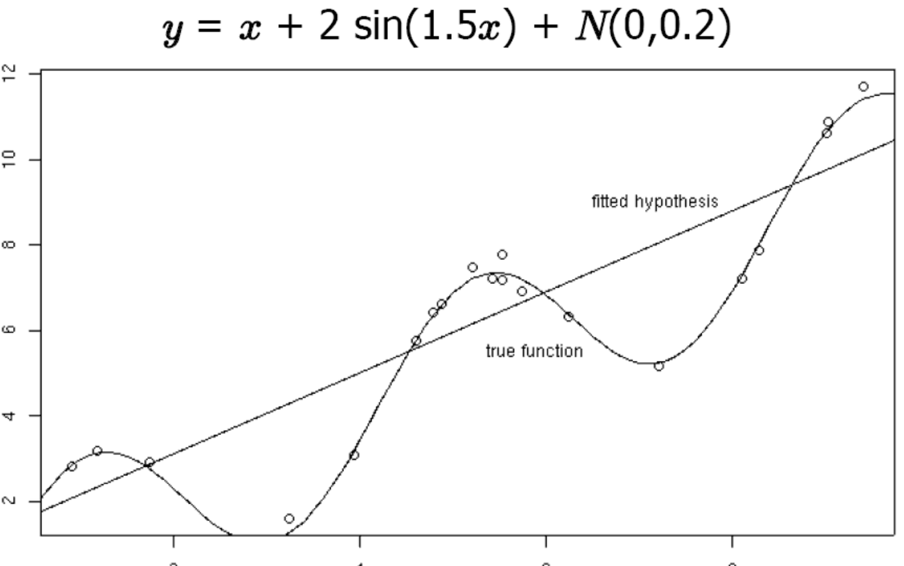
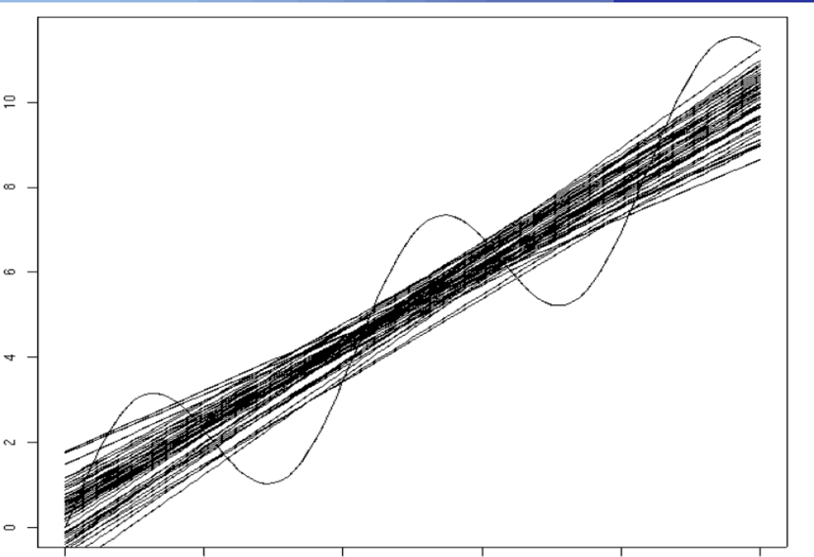
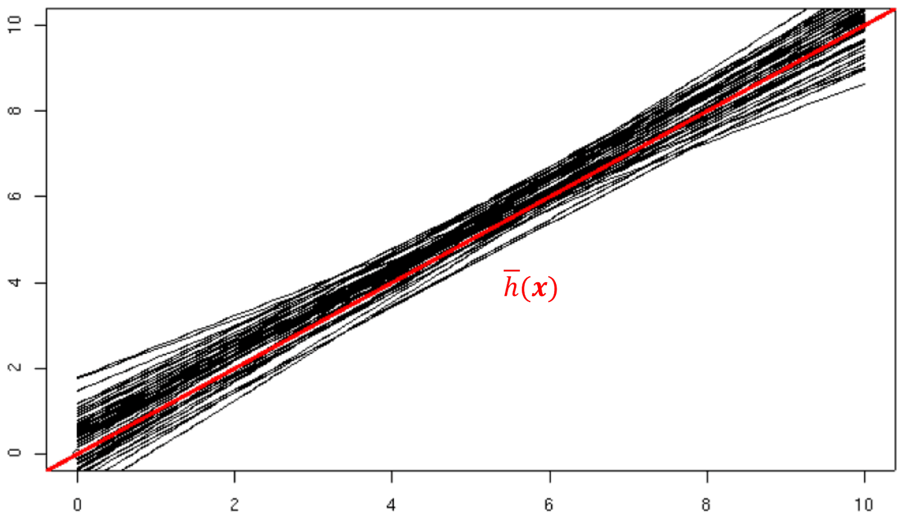
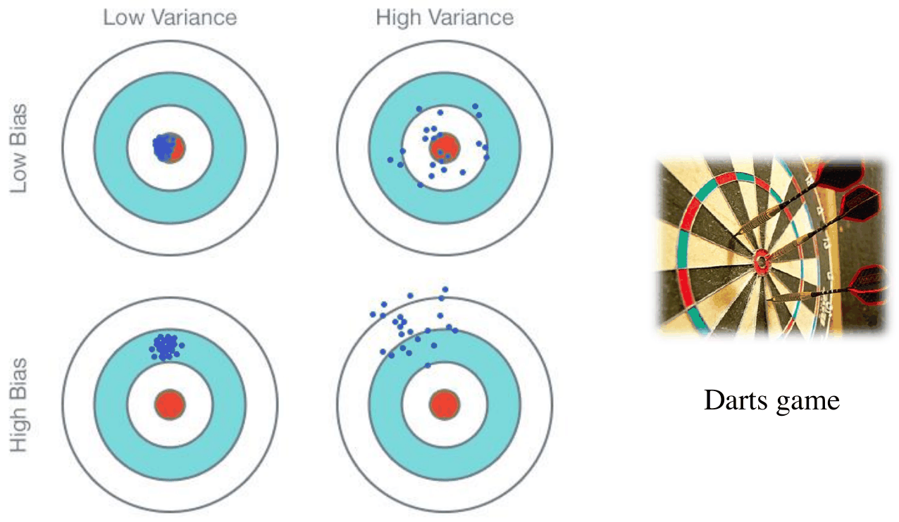
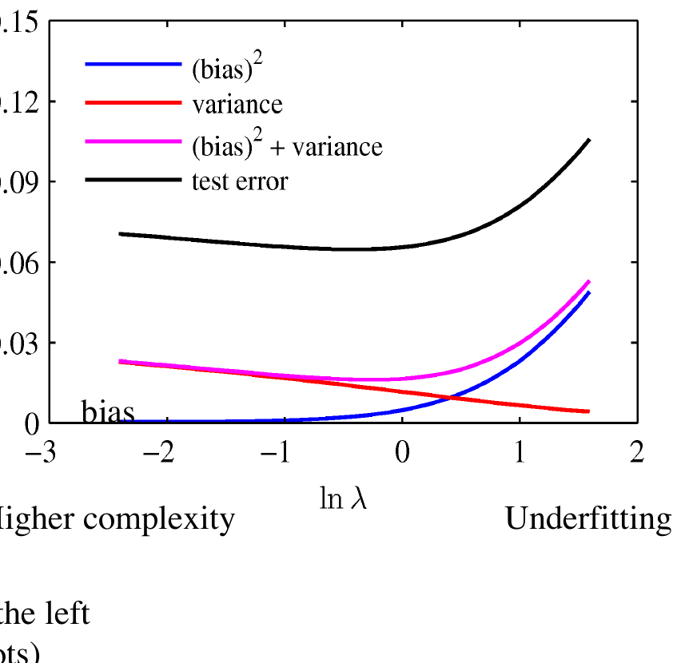

# Bias-varianza ed ensemble

*Appunti di Fabio Piscitelli — Machine Learning (654AA), Prof. Alessio Micheli, Università di Pisa, a.a. 2026/27*

La SLT ha spiegato underfitting e overfitting tramite la complessità del modello e il numero di dati. La **decomposizione bias-varianza** offre un altro punto di vista, complementare: considera il fatto che il training set è **una sola** delle possibili realizzazioni dei dati, e scompone l'errore atteso in tre componenti — **bias**, **varianza** e **rumore**. Da qui si arriva in modo naturale agli **ensemble** (bagging, boosting), che sfruttano proprio la riduzione della varianza.

## L'idea

Un training set è solo una possibile realizzazione dall'universo dei dati: **training set diversi producono stime diverse**. L'errore atteso (sui vari training set) in un punto $\mathbf{x}$ si scompone in:

- **Bias**: quantifica la discrepanza tra la funzione vera e $h(\mathbf{x})$ (mediata sui dati). È alto se $H$ è troppo piccolo (modello troppo rigido).
- **Varianza**: quantifica la variabilità della risposta del modello $h$ per diverse realizzazioni dei dati di training. È dovuta a un'eccessiva flessibilità.
- **Rumore**: le etichette contengono un errore casuale (ad esempio, per un dato $\mathbf{x}$ ci possono essere più valori di $d$ possibili).

Si assume lo scenario della **regressione** con target $y$ e loss quadratica.

## Analisi nella regressione

Supponiamo esempi $\langle \mathbf{x}, y\rangle$ con funzione vera $y = f(\mathbf{x}) + \varepsilon$, dove $\varepsilon$ è rumore gaussiano con media zero e deviazione standard $\sigma$. Con la regressione lineare, dato un insieme di esempi $\langle\mathbf{x}_i, y_i\rangle$, $i = 1..l$, si adatta un'ipotesi lineare $h(\mathbf{x}) = \mathbf{w}\mathbf{x} + w_0$ minimizzando $\sum_{i=1}^l (y_i - h(\mathbf{x}_i))^2$. Due fatti:

1. per la classe di ipotesi scelta (lineari), per alcune $f$ si avrà un **errore di predizione sistematico**;
2. a seconda del dataset, i parametri $\mathbf{w}$ trovati **saranno diversi**.

> [!example] 20 punti e 50 fit
>
> Funzione vera $y = x + 2\sin(1{,}5x) + \mathcal{N}(0; 0{,}2)$. Con 20 punti si adatta una retta. Ripetendo con 50 dataset diversi (ciascuno di 20 punti), si ottengono 50 rette diverse.

*Fig. 15.1 — Un dataset di 20 punti, la funzione vera e l'ipotesi lineare adattata.*

*Fig. 15.2 — 50 fit, ciascuno su 20 punti: le rette variano da un dataset all'altro.*

### L'errore di predizione atteso

Dato un nuovo punto $\mathbf{x}$, qual è l'**errore di predizione atteso**? Si assume che i dati siano estratti in modo **i.i.d.** (indipendenti e identicamente distribuiti) da un'unica distribuzione $P$. L'obiettivo è calcolare, per un $\mathbf{x}$ arbitrario,
$$
E_P\big[(y - h(\mathbf{x}))^2\big],
$$
dove $y$ è il valore di $\mathbf{x}$ che potrebbe comparire in un dataset, e l'aspettativa è **su tutti i training set** estratti secondo $P$. Attenzione: per ogni training set "estratto" c'è una $h$ diversa (e un $y$ diverso).

### Richiamo di statistica

Per una variabile aleatoria discreta $Z$: $\bar Z = E_P[Z] = \sum_i z_i P(z_i)$ e $\operatorname{Var}[Z] = E[(Z - \bar Z)^2]$.

> [!theorem] Lemma della varianza
>
> $$
> \operatorname{Var}[Z] = E[Z^2] - \bar Z^2 \qquad\Longleftrightarrow\qquad E[Z^2] = \bar Z^2 + \operatorname{Var}[Z].
> $$
> **Dimostrazione.** $\operatorname{Var}[Z] = \sum_i (z_i - \bar Z)^2 P(z_i) = \sum_i z_i^2P(z_i) - 2\bar Z\sum_i z_iP(z_i) + \bar Z^2\sum_i P(z_i) = E[Z^2] - 2\bar Z^2 + \bar Z^2 = E[Z^2] - \bar Z^2$.

### La decomposizione

Sviluppando il quadrato e usando la linearità dell'aspettativa (e il fatto che $y$ e $h(\mathbf{x})$ sono indipendenti, perché $y$ è un nuovo dato e $h$ dipende dal training set):
$$
E_P\big[(y - h(\mathbf{x}))^2\big] = E_P\big[h(\mathbf{x})^2 - 2yh(\mathbf{x}) + y^2\big] = E_P\big[h(\mathbf{x})^2\big] + E_P\big[y^2\big] - 2E_P[y]\,E_P[h(\mathbf{x})].
$$

Sia $\bar h(\mathbf{x}) = E_P[h(\mathbf{x})]$ la **predizione media** dell'ipotesi in $\mathbf{x}$, quando $h$ è addestrata su dati estratti da $P$.

- **Primo termine**, con il lemma: $E_P[h(\mathbf{x})^2] = E_P\big[(h(\mathbf{x}) - \bar h(\mathbf{x}))^2\big] + \bar h(\mathbf{x})^2$.
- Si noti che $E_P[y] = E_P[f(\mathbf{x}) + \varepsilon] = f(\mathbf{x})$ (il rumore ha media zero).
- **Secondo termine**, con il lemma: $E_P[y^2] = E_P\big[(y - f(\mathbf{x}))^2\big] + f(\mathbf{x})^2$.

Mettendo tutto insieme:
$$
\begin{aligned}
E_P\big[(y - h(\mathbf{x}))^2\big] &= E_P\big[(h(\mathbf{x}) - \bar h(\mathbf{x}))^2\big] + \underbrace{\bar h(\mathbf{x})^2 - 2f(\mathbf{x})\bar h(\mathbf{x}) + f(\mathbf{x})^2}_{(\bar h(\mathbf{x}) - f(\mathbf{x}))^2} + E_P\big[(y - f(\mathbf{x}))^2\big] \\
&= \underbrace{E_P\big[(h(\mathbf{x}) - \bar h(\mathbf{x}))^2\big]}_{\text{varianza}} + \underbrace{\big(\bar h(\mathbf{x}) - f(\mathbf{x})\big)^2}_{\text{bias}^2} + \underbrace{E_P\big[(y - f(\mathbf{x}))^2\big]}_{\text{rumore}^2} \\
&= \operatorname{Var}[h(\mathbf{x})] + \operatorname{Bias}[h(\mathbf{x})]^2 + E_P[\varepsilon^2] = \operatorname{Var}[h(\mathbf{x})] + \operatorname{Bias}[h(\mathbf{x})]^2 + \sigma^2.
\end{aligned}
$$

> [!theorem] Decomposizione bias-varianza
>
> $$
> \text{Errore di predizione atteso} = \text{Varianza} + \text{Bias}^2 + \text{Rumore}^2.
> $$

### Interpretazione delle tre componenti

- **Bias** $\big(\bar h(\mathbf{x}) - f(\mathbf{x})\big)^2$: la discrepanza tra la funzione vera e la predizione **media** sui diversi training set. È un **errore sistematico**, dovuto ad esempio a uno spazio $H$ troppo piccolo o a un modello troppo rigido.
- **Varianza**: la variabilità della risposta del modello per diverse realizzazioni del training set. È dovuta a una **flessibilità eccessiva**.
- **Rumore**: anche la soluzione ottima può sbagliare (ad esempio se per un dato $\mathbf{x}$ sono possibili più valori di $d$). È **irriducibile**: non dipende dal modello e rappresenta una tolleranza sulla risposta ($\sigma$).

*Fig. 15.3 — Vista grafica: training set diversi producono soluzioni diverse (varianza); la loro media dista dall'ottimo (bias); l'ottimo stesso dista dai dati per il rumore.*

Tornando all'esempio: il **bias** è evidente nella media $\bar h$ delle 50 rette, che resta lontana dalla funzione vera ondulata (il modello lineare è troppo rigido); la **varianza** è la dispersione delle 50 rette attorno a $\bar h$; il **rumore** è la dispersione dei dati attorno alla funzione vera.

*Fig. 15.4 — La varianza: la dispersione delle ipotesi attorno alla predizione media $\bar h(\mathbf{x})$ (in rosso).*

> [!example] L'analogia delle freccette
>
> 
>
> Il centro è la funzione vera, ogni freccetta è un modello addestrato su un training set diverso. **Alto bias e bassa varianza** (in basso a sinistra) corrisponde all'**underfitting**; **basso bias e alta varianza** (in alto a destra) all'**overfitting**. L'analogia non è perfetta per il ML, ma aiuta.

---

## Bias, varianza e regolarizzazione

Ricordiamo la loss regolarizzata:
$$
\text{Loss}(\mathbf{w}) = \underbrace{\sum_p\big(d_p - o(\mathbf{x}_p)\big)^2}_{\text{termine sui dati}} + \underbrace{\lambda\|\mathbf{w}\|^2}_{\text{penalità}}.
$$
Variando $\lambda$ si ottengono soluzioni meno regolarizzate (complesse, $\lambda$ basso) o più regolarizzate (meno complesse, $\lambda$ alto). (L'intercetta è tipicamente esclusa dalla penalità.)

Esempio di Bishop: 25 dataset estratti dalla sinusoide, modello (una rete RBF) addestrato su ciascuno con diversi valori di $\lambda$.

*Fig. 15.5 — Effetto di $\lambda$ su bias e varianza: $\ln\lambda = 2{,}6$ (in alto), $-0{,}31$ (al centro), $-2{,}4$ (in basso). A sinistra le 25 ipotesi, a destra la loro media $\bar h(x)$ (rossa) e la funzione vera (verde).*

- **$\lambda$ alto**: **alto bias, bassa varianza**. La penalità domina, il modello dipende poco dai dati ed è "troppo rigido": le curve si somigliano ma la loro media è lontana dalla sinusoide.
- **$\lambda$ medio**: bias più basso, varianza più alta. Diminuendo $\lambda$ si dipende di più dal particolare training set.
- **$\lambda$ molto basso**: **basso bias, alta varianza**. L'errore di test per un singolo training set può essere alto (per la componente di varianza), ma anche se le curve sono molto diverse tra loro, **in media** sono corrette (grafico a destra).

*Fig. 15.6 — Il compromesso bias-varianza al variare di $\ln\lambda$. Attenzione: qui la complessità è più alta a **sinistra** (al contrario dei grafici usuali).*

Un modello **sovra-regolarizzato** (grande $\lambda$) ha bias alto; uno **sotto-regolarizzato** (piccolo $\lambda$) ha varianza alta. Di nuovo, **il compromesso**: il minimo di bias² + varianza coincide circa con il minimo dell'errore di test.

La stessa figura vista nella validazione ([[09 - Validazione (parte 1) - model selection e assessment]]) mostra, al crescere della complessità, errori di training e test su 100 training set: un modello complesso ha **bias basso e varianza alta**, quindi rischio di overfitting, e a seconda del training set si può essere fortunati o sfortunati.

> [!tip] Il collegamento con la SLT
>
> Bias e varianza sono un'altra faccia del compromesso tra adattamento ai dati e complessità: il bias corrisponde all'incapacità del modello di rappresentare la funzione (alto $R_{emp}$, underfitting), la varianza alla sensibilità ai dati specifici (alta VC-confidence, overfitting).

---

## Ensemble learning

L'idea degli **ensemble** è sfruttare **più modelli** combinandone le risposte.

Nel caso più semplice (**schema a voto**):

- **Regressione**: comitato a media semplice, $o(\mathbf{x}) = \frac{1}{K}\sum_{i=1}^K h_i(\mathbf{x})$.
- **Classificazione**: voto su molti classificatori (purché diano risposte **diversificate**), oppure si classifica dopo aver mediato le uscite continue.

In alternativa (**stacking**) il combinatore è a sua volta un modello di ML.

> [!theorem] Il comitato non è peggiore della media dei suoi membri
>
> Per una loss convessa come l'errore quadratico, l'errore del comitato è minore o uguale alla media degli errori dei singoli modelli:
> $$
> \text{loss}\big(E_i[h_i]\big) \le E_i\big[\text{loss}(h_i)\big].
> $$
> (È la disuguaglianza di Jensen.) Esempio con target $t = 5$ e due modelli che predicono 2 e 4: la media degli errori è $\frac{(5-2)^2 + (5-4)^2}{2} = 5$, mentre l'errore del comitato ($o = 3$) è $(5-3)^2 = 4$. Con predizioni 6 e 4: media degli errori $\frac{1 + 1}{2} = 1$, errore del comitato $(5-5)^2 = 0$.

### Bagging (bootstrap aggregating)

- Si addestrano $K$ classificatori su **sottoinsiemi diversi** del training set, differenziati con il **bootstrap** (ricampionamento con reinserimento).
- Regressione: si usa la media; classificazione: voto dei $K$ classificatori.

Il legame con bias-varianza è diretto (si ricordi il caso "$\lambda$ basso"): modelli ad **alta varianza** e **basso bias** possono funzionare bene **in media**. In altri termini, **la media delle $h$ riduce la varianza** senza aumentare il bias. Inoltre il bagging tende ad aumentare il **margine** di un classificatore: la media di $K$ curve di separazione tende a stare "nel mezzo" (*in medio stat virtus*).

### Boosting (es. AdaBoost)

Se i modelli commettono gli **stessi errori**, combinarli non serve. Il boosting li differenzia di proposito:

1. addestra i classificatori in sequenza concentrandosi sugli **errori**: il secondo dà più peso alle istanze sbagliate dal primo (ad esempio sono più probabili nel suo training set), e così via;
2. combina i risultati con un **voto pesato**, dando più peso ai classificatori con errore più basso.

Se non lo si ferma, il boosting impara a classificare correttamente **tutte** le istanze di training usando **weak learner** (classificatori appena migliori del caso, con errore $< 1/2$ nel binario), costruendo in modo incrementale modelli complessi. Può migliorare molto le prestazioni di learner deboli; riduce il bias senza aumentare la varianza (resiste all'overfitting) e, come il bagging, tende a produrre curve di separazione "nel mezzo" (margine massimo). Però **soffre con dati rumorosi** (che vengono pesati sempre di più), e non risolve di per sé il problema underfitting/overfitting.

## Feature selection (cenni)

Trovare il sottoinsieme delle feature più informative per il problema porta grandi benefici: **riduzione della dimensionalità** (effetti sulla VC-dim delle reti, sulla curse of dimensionality...), filtraggio di informazione irrilevante e rumore (con possibili forti miglioramenti delle prestazioni), **interpretabilità** (trovare descrittori utili). Ma:

- è **computazionalmente difficile** (numero enorme di sottoinsiemi possibili, e ogni valutazione richiede di riaddestrare);
- si usa tipicamente una **ricerca euristica** (greedy, algoritmi genetici o altre tecniche di ottimizzazione), includendo o meno il learner;
- i risultati sono particolarmente sensibili al metodo di validazione: attenzione al **feature subset selection bias**, cioè all'errore di fare la selezione sull'intero dataset (vedi le slide sulla cross-validation).

Altri argomenti collegati: PAC learning; confronto tra principi induttivi (SRM, MDL, inferenza bayesiana, regolarizzazione) rispetto al controllo della complessità.

> [!abstract] Sintesi
>
> L'errore atteso (sui training set) si scompone in **varianza + bias² + rumore**. Modelli rigidi (o molto regolarizzati) hanno alto bias e bassa varianza (underfitting); modelli flessibili (poco regolarizzati) basso bias e alta varianza (overfitting); il rumore è irriducibile. Gli **ensemble** sfruttano la decomposizione: il **bagging** media modelli ad alta varianza riducendola; il **boosting** combina learner deboli concentrandosi sugli errori.

> [!question] Possibili domande d'esame
>
> - Derivare la decomposizione bias-varianza per la loss quadratica.
> - Cosa rappresentano bias, varianza e rumore? Quale componente è irriducibile?
> - Come variano bias e varianza con il parametro di regolarizzazione $\lambda$?
> - Perché un comitato non è peggiore della media dei suoi membri?
> - Differenza tra bagging e boosting; perché il bagging riduce la varianza?
