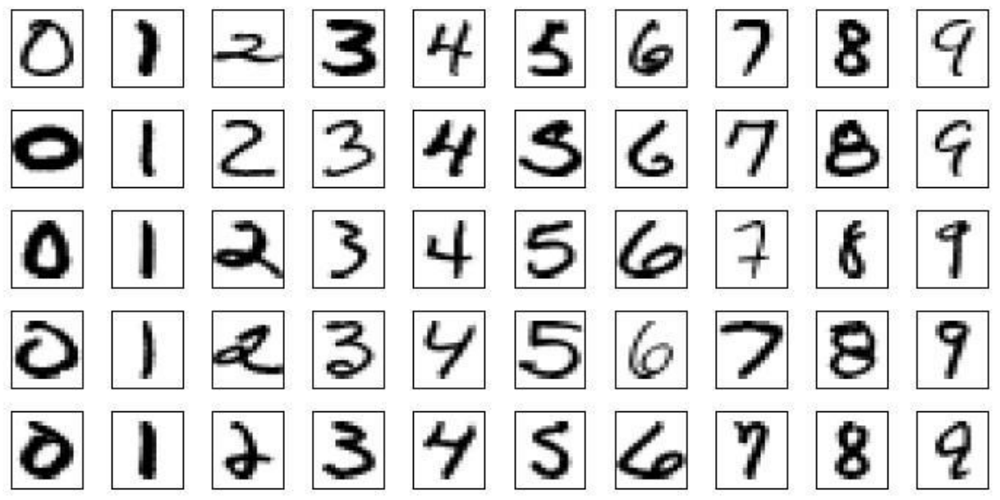
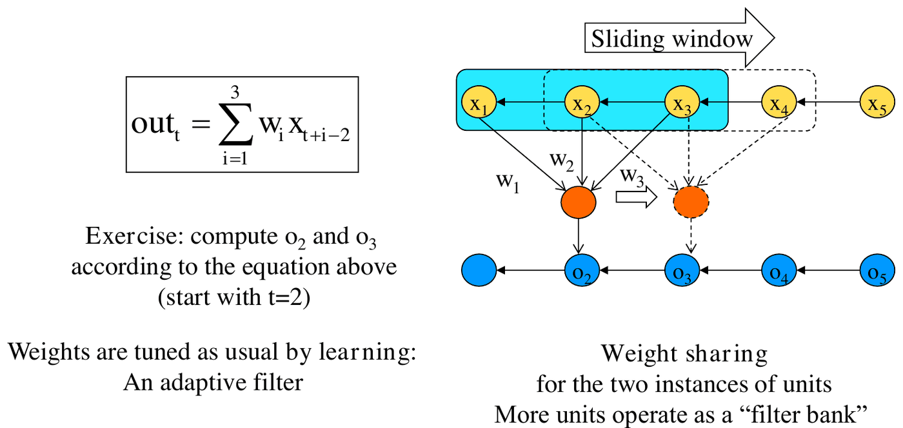
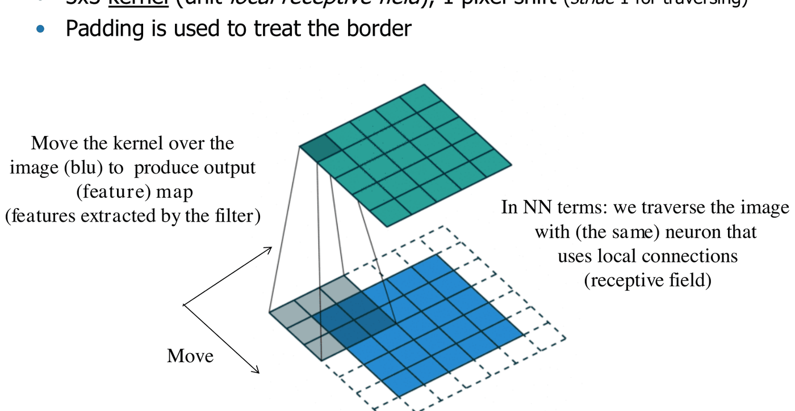
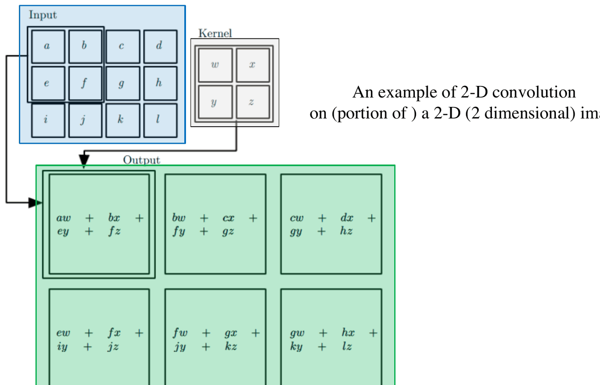
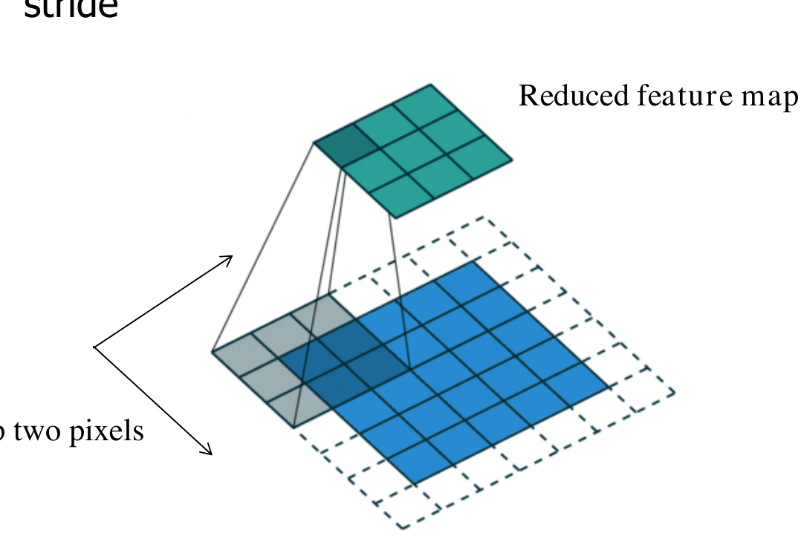
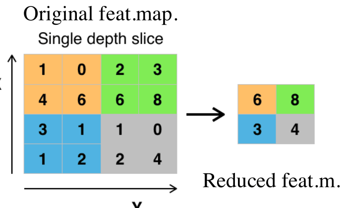
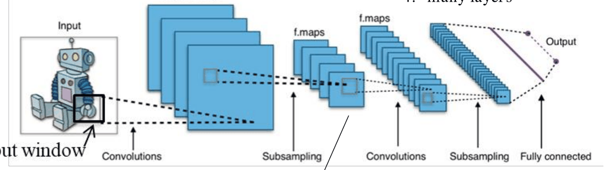
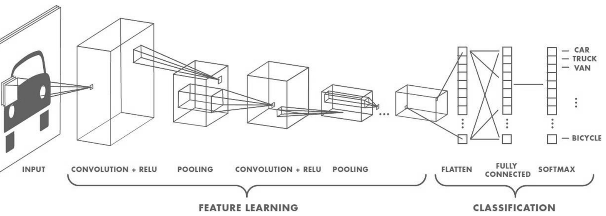
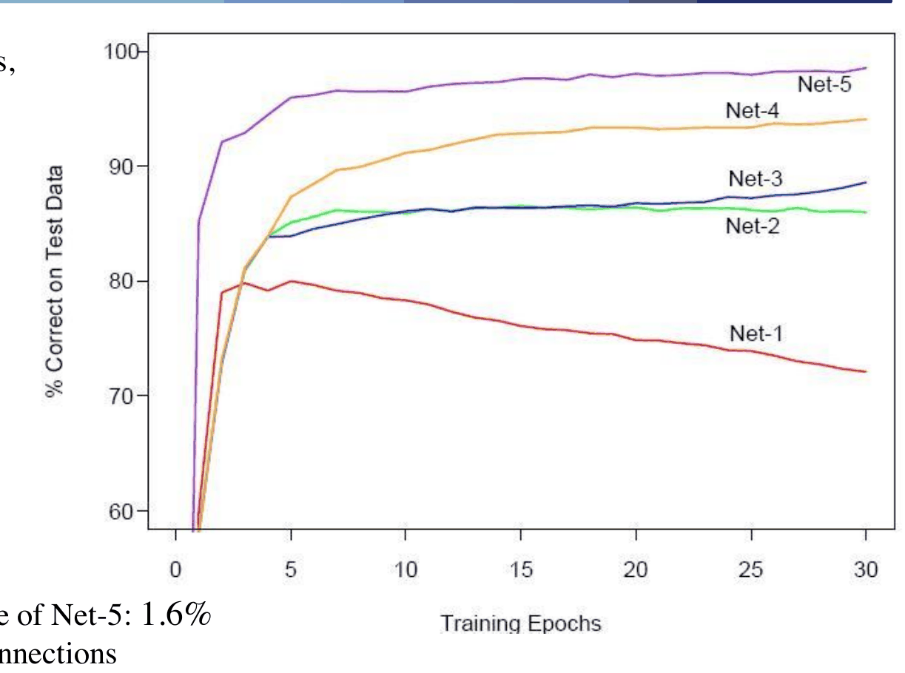
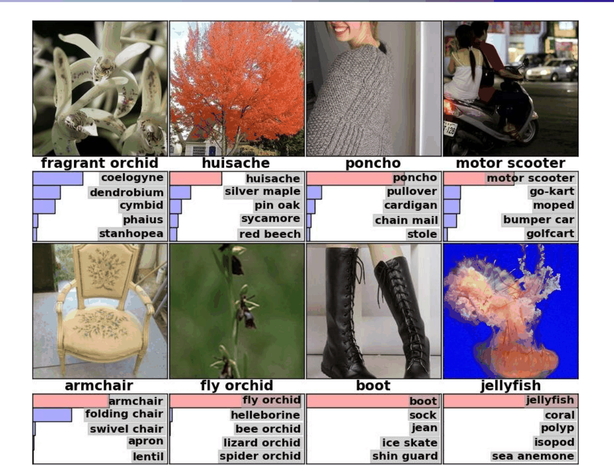

# Reti neurali convoluzionali (CNN)

*Appunti di Fabio Piscitelli — Machine Learning (654AA), Prof. Alessio Micheli, Università di Pisa, a.a. 2026/27*

Le reti neurali hanno un'enorme quantità di applicazioni di successo, grazie alle prestazioni e al fatto che si configurano facilmente come primo approccio per apprendere funzioni arbitrarie di forma ignota, senza assumere un modello statistico a priori. I task **sub-simbolici** (dati sensoriali, controllo motorio, elaborazione visiva) sono il loro cavallo di battaglia.

Questa lezione presenta un esempio storico e paradigmatico: le **reti convoluzionali** (CNN, *ConvNet*, *LeNet*). Mostra la **flessibilità nella progettazione** delle reti, come si cambia il progetto per trattare un'applicazione specifica, e come si realizza una rete feedforward **non completamente connessa** per un problema preciso. Le CNN sono anche un'istanza storica di rete **profonda**, e fanno da ponte verso il deep learning.

## Il problema: riconoscere caratteri

*Fig. 16.1 — Esempi dal dataset ZIP code: immagini normalizzate 16×16 a 8 bit in scala di grigi (Le Cun et al., 1990). Il benchmark MNIST è "la drosofila del ML".*

Un primo approccio è una rete standard con **256 input** (uno per pixel, $16 \times 16$): si ottiene un errore del 5–20%, con molti errori dovuti alla **mancanza di invarianza** a rotazioni, traslazioni, ecc. Una rete completamente connessa tratta ogni pixel come un input indipendente: non "sa" che pixel vicini sono correlati né che uno stesso tratto può comparire in posizioni diverse.

> [!tip] L'idea di base
>
> Sfruttare l'**architettura** per includere **conoscenza a priori** nella rete:
> - **connessioni locali** (campi recettivi locali): ogni unità vede solo una piccola zona dell'immagine, ed estrae **feature locali**;
> - **condivisione dei pesi** (*weight sharing*) tra unità diverse: la **stessa operazione** viene applicata a parti diverse dell'input, perché le feature di un carattere possono comparire ovunque nell'immagine (indipendentemente da posizione, piccole rotazioni...). Si riduce il numero di parametri liberi pur mantenendo una connettività complessa.

## La convoluzione

Il nome viene dall'**operatore di convoluzione**: una media pesata di una funzione $f$, pesata da un'altra funzione $g$ che scorre nel tempo:
$$
(f * g)(t) = \int_{-\infty}^{\infty} f(\tau)\,g(t - \tau)\,d\tau.
$$
L'immagine di $g$ è limitata (non nulla solo su un intervallo): $g$ agisce come una **finestra scorrevole**.

### Convoluzione 1D: una unità su uno stream

Un'unità con tre pesi che scorre su una sequenza di input:
$$
out_t = \sum_{i=1}^{3} w_i\,x_{t+i-2}.
$$

*Fig. 16.2 — Convoluzione 1D: la stessa unità (con gli stessi pesi) scorre sull'input.*

(Esercizio: con $t = 2$, $o_2 = w_1x_1 + w_2x_2 + w_3x_3$; con $t = 3$, $o_3 = w_1x_2 + w_2x_3 + w_3x_4$.) I pesi sono **condivisi** tra le istanze dell'unità e vengono appresi come al solito: l'unità è un **filtro adattivo**. Più unità diverse formano un **banco di filtri**. Questa rete si chiama anche *Time-Delay Neural Network*.

### Convoluzione 2D

Su un'immagine si usa un **kernel** 2D, ad esempio $3 \times 3$ (il **campo recettivo locale** dell'unità), che si sposta di un pixel alla volta (**stride** 1). Il **padding** gestisce i bordi. Il kernel scorre sull'immagine e produce una **feature map** (le feature estratte dal filtro).

In termini di reti neurali: si percorre l'immagine con **lo stesso neurone**, che usa connessioni locali.

*Fig. 16.3 — Convoluzione 2D: il kernel scorre sull'immagine e produce la feature map.*

*Fig. 16.4 — Esempio di convoluzione 2D di un input 3×4 con un kernel 2×2.*

> [!note] Forma usata nelle librerie
>
> La convoluzione 2D di un'immagine $I$ con un kernel $K$ è $S(i,j) = (I * K)(i,j) = \sum_m\sum_n I(m,n)\,K(i-m, j-n)$. Molte librerie per CNN implementano in realtà la **cross-correlazione**: $S(i,j) = \sum_m\sum_n I(i+m, j+n)\,K(m,n)$ (per i dettagli: *Deep Learning book*, sez. 9.1; non richiesto all'orale).

### Stride maggiore di 1

Con **stride** > 1 il kernel "salta" pixel (ad esempio due alla volta): è un **sotto-campionamento**, e produce una feature map ridotta.

*Fig. 16.5 — Convoluzione con stride 2: la feature map risultante è ridotta.*

## Una rete di "filtri"

I pesi delle unità sono un **filtro addestrato** a rilevare certe feature o pattern nell'immagine. Il progetto dell'architettura prevede:

- **campo recettivo piccolo e locale**: grazie a questo vincolo, i filtri appresi rispondono al massimo a pattern **spazialmente locali** (come nella corteccia visiva degli animali);
- **lo stesso filtro applicato su tutta l'immagine**: le feature vengono rilevate **indipendentemente dalla posizione**, ottenendo l'**invarianza per traslazione**;
- **filtri appresi**: i filtri che negli algoritmi tradizionali di elaborazione di immagini erano progettati a mano vengono **appresi**. L'indipendenza dalla conoscenza a priori e dallo sforzo umano nel progettare le feature è un grande vantaggio;
- **molti strati impilati**: le unità delle feature map rappresentano aree via via più grandi dell'immagine originale (assemblando aree delle mappe precedenti).

## Pooling

Il **pooling** riduce la feature map:

- con sotto-campionamento (stride > 1, visto sopra);
- con una **media** (semplice o pesata);
- con il **max pooling** (il più comune).

In pratica, invece di produrre un valore per ogni pixel di input, se ne produce uno per un insieme (rettangolare) di pixel, prendendo la media o il massimo delle uscite.

*Fig. 16.6 — Max pooling con filtro 2×2 e stride 2.*

Il pooling aiuta anche a rendere la rappresentazione **approssimativamente invariante a piccole traslazioni** dell'input: il massimo (o la media) cambia poco se l'input si sposta di poco, quindi un'uscita alta resta alta per una versione leggermente traslata.

## La CNN nel complesso

Una CNN sfrutta la condivisione dei pesi per realizzare una finestra scorrevole di campi locali su un segnale, estesa alle immagini 2D e ripetuta su molti strati (feature map), alternata a operazioni di pooling. I quattro ingredienti:

1. **connessioni locali**;
2. **pesi condivisi**;
3. **pooling**;
4. **molti strati**.

*Fig. 16.7 — Una CNN completa: convoluzioni e sotto-campionamenti alternati, seguiti da strati completamente connessi. Il numero di filtri (feature map) può crescere negli strati più alti.*

*Fig. 16.8 — Il "cono" dall'immagine alle mappe finali: il campo recettivo delle unità finali è molto più ampio di quello delle unità dei primi strati, perché sono collegate indirettamente a gran parte dell'immagine.*

*Fig. 16.9 — Un esempio con le dimensioni; per un'immagine a colori (RGB) la profondità del volume è il numero di feature map.*

*Fig. 16.10 — Un'architettura tipo AlexNet: una parte di *feature learning* (convoluzioni e pooling) e una di classificazione (strati densi e softmax).*

> [!abstract] Vantaggi delle CNN
>
> - **Connessioni locali e pesi condivisi**: rilevano motivi/pattern locali nelle immagini, in modo **invariante alla traslazione** (alla posizione del pattern); **riducono il numero di parametri liberi** pur mantenendo le connessioni, il che è una forma di **regolarizzazione**.
> - **Pooling**: riduce la dimensione della rappresentazione a ogni strato (una **piramide** di strati) e aiuta l'invarianza a piccoli spostamenti e distorsioni.
> - **Molti strati**: le operazioni 1 e 2 applicate a tutte le feature map producono un'**astrazione progressiva** delle feature, permettendo di **comporre primitive** (feature di basso livello, apprese una volta sola) in tutte le combinazioni possibili negli strati successivi.
> - Sono un'istanza storica di **rete profonda**, e sono state studiate analogie con il sistema visivo (neuroscienze).

## Come si usano

L'addestramento avviene tipicamente con la **backpropagation**, con le euristiche note e alcune specializzazioni (per la condivisione dei pesi, il pooling...). Visto l'uso tipico di reti enormi e grandi quantità di dati, molti iperparametri vengono fissati **per esperienza** o su suggerimento di esperti, perché sarebbe troppo costoso fare cross-validation su grandi spazi di iperparametri. Addestramento, effetti di regolarizzazione e buon comportamento di queste reti enormi saranno discussi nel quadro del deep learning.

## Risultati storici

### Le architetture di LeCun sul dataset ZIP code

*Fig. 16.11 — Le cinque reti usate da LeCun sul problema ZIP code: da una rete senza strati nascosti (Net-1) a reti con connessioni locali (Net-3) e pesi condivisi (Net-4, Net-5).*

| Rete | Connessioni | Pesi |
|---|---|---|
| Net-1 | 2570 | 2570 |
| Net-2 | 3214 | 3214 |
| Net-3 | 1226 | 1226 |
| Net-4 | 2266 | 1132 |
| Net-5 | 5194 | 1060 |

Con i pesi condivisi il numero di **connessioni** può crescere mentre il numero di **pesi** (parametri liberi) resta basso.

*Fig. 16.12 — Curve di prestazione sul test per le cinque reti (Le Cun, 1989). L'errore di training è zero per tutte, su un insieme ridotto di circa 300 immagini.*

Net-5 raggiunge un errore dell'**1,6%** con 5194 connessioni e soli 1060 pesi. Oggi si arriva allo 0,8% (con reti e SVM) e anche meno.

### MNIST

Il dataset completo ha 60.000 immagini di training e 10.000 di test. I progressi (1998–2012) sono documentati sul sito di LeCun. Con il deep learning (MLP o CNN con molti strati, pre-addestramento non supervisionato strato per strato) si è arrivati allo 0,39% (2006) e 0,35% (2011); il migliore nel 2012 è lo 0,23% (comitato di reti convoluzionali), 0,21% nel 2016.

> [!warning] Attenzione
>
> Il test set di MNIST è stato usato così tante volte che i miglioramenti dell'ordine dello 0,1% non sono più significativi: è di fatto diventato un validation set per la comunità.

> [!note] Anche un MLP profondo funziona?
>
> Un articolo del 2010 (*Neural Computation*) mostra che la "buona vecchia" backpropagation on-line su un semplice MLP ottiene lo 0,35% su MNIST: bastano **molti strati**, **molti neuroni** per strato, **molte immagini deformate** per il training e **GPU** per accelerare. La rete 784-2500-2000-1500-1000-500-10 ha 12 milioni di pesi e si addestra in 2 ore. Il controllo della complessità è ottenuto deformando le immagini per avere molti più esempi (*data augmentation*).

### Riconoscimento facciale e ImageNet

- **DeepFace** (CVPR 2014): reti convoluzionali a 9 strati addestrate su 4 milioni di immagini di più di 4000 persone; riconosce se due foto mostrano la stessa persona con accuratezza del 97,25% (umani: 97,53%).
- **AlexNet** (Krizhevsky, Sutskever, Hinton, NIPS 2012): una CNN profonda addestrata su 1,3 milioni di immagini ad alta risoluzione di ImageNet (ILSVRC-2010) in 1000 classi. Errori top-1 e top-5 del 39,7% e 18,9% (dal precedente ~26%), molto meglio dello stato dell'arte. La rete ha **60 milioni di parametri** e 500.000 neuroni: cinque strati convoluzionali (alcuni seguiti da max pooling) e due strati completamente connessi con softmax finale a 1000 classi. Per velocizzare l'addestramento: neuroni **non saturanti** (ReLU) e un'implementazione GPU molto efficiente. Per ridurre l'overfitting negli strati densi: un nuovo metodo di regolarizzazione, il **dropout**.

*Fig. 16.13 — Predizioni top-5 di AlexNet su immagini casuali del test set.*

## CNN moderne e GPU

Esistono molte varianti e architetture specializzate per le immagini (corso *Intelligent Systems for Pattern Recognition*), con grande impatto su Pattern Recognition e Computer Vision; le basi neuroscientifiche sono trattate nel corso di *Computational Neuroscience*. Si possono anche riusare le feature di modelli **già addestrati** su grandi benchmark (AlexNet, GoogLeNet, VGG, ResNet...): sono disponibili molte CNN pre-addestrate per classificazione, segmentazione, riconoscimento facciale, rilevamento di testo.

Le implementazioni efficienti sfruttano le **GPU** tramite la rappresentazione a **tensori**. La moltiplicazione di matrici (cioè i prodotti scalari) è un'operazione lineare che le GPU eseguono in modo molto efficiente, parallelizzando le somme e i prodotti indipendenti. Molte operazioni di kernel si possono scrivere come un'unica moltiplicazione tra matrici a blocchi; la notazione a **tensori** (array multidimensionali con l'operazione *tensordot*, ad esempio in TensorFlow o NumPy) permette di farlo senza costruire a mano matrici a blocchi complesse.

> [!note] Oltre le CNN: le Capsule Network
>
> Le **Capsule Network** (Sabour, Frosst, Hinton, 2017) usano sotto-reti specializzate: una "capsula" è un gruppo di neuroni che produce sia un parametro che indica se un'entità è presente, sia un vettore di **parametri di posa** (posizione, orientamento) rispetto a una versione canonica. Al posto del max pooling usano un meccanismo di **routing** (l'idea che il cervello instradi l'informazione visiva di basso livello verso la capsula più adatta). Ottengono ottimi risultati su MNIST, riconoscendo molto meglio di una CNN cifre sovrapposte.

> [!question] Possibili domande d'esame
>
> - Quali sono le idee chiave delle CNN (connessioni locali, pesi condivisi, pooling, molti strati) e cosa comporta ciascuna?
> - Cos'è la convoluzione in una rete neurale? Cosa sono kernel, stride, padding, feature map?
> - A cosa serve il pooling? Come funziona il max pooling?
> - Perché la condivisione dei pesi è una forma di regolarizzazione?
> - Come cresce il campo recettivo con la profondità?
