# Deep learning

*Appunti di Fabio Piscitelli — Machine Learning (654AA), Prof. Alessio Micheli, Università di Pisa, a.a. 2026/27*

Questa lezione introduce il **deep learning** (DL) dal punto di vista del corso: non i dettagli delle architetture per le applicazioni (che si vedranno nei corsi successivi del curriculum AI, come Pattern Recognition e NLP), ma una **visione d'insieme** delle reti con molti strati, i concetti che le rendono efficaci (**servono davvero molti strati?**, **representation learning**, **rappresentazioni distribuite**) e le principali **tecniche** di addestramento, molte delle quali utili anche nel caso "base".

## Che cos'è il deep learning

> [!quote] LeCun, Bengio, Hinton, *Nature* (2015)
>
> *"Il deep learning permette a modelli computazionali composti da più strati di elaborazione di apprendere rappresentazioni dei dati con più livelli di astrazione. Questi metodi hanno migliorato drasticamente lo stato dell'arte nel riconoscimento del parlato, nel riconoscimento visivo di oggetti, nel rilevamento di oggetti e in molti altri domini."*

### Un po' di storia

Dal 2010 circa il deep learning ha avuto un forte impatto sull'industria, per tre fattori:

- **grandi dataset** disponibili (milioni di immagini);
- **potenza di calcolo** (le GPU sono il fattore abilitante);
- **nuove idee** per facilitare l'addestramento.

L'apprendimento con architetture profonde non è più "infattibile". I nuovi risultati allo stato dell'arte nel riconoscimento del parlato, nella traduzione automatica (Google Neural Translator dal 2016, DeepL) e nel riconoscimento di immagini hanno attratto moltissimi ricercatori. In passato ci si aspettava un miglioramento cambiando la scala di modelli e dati, ma non necessariamente un tale salto di prestazioni. Tutte le grandi aziende informatiche basano oggi le loro strategie di ricerca e sviluppo su questi approcci.

### Il quadro generale

Il DL è un **quadro generale** che include modelli diversi:

- **reti neurali profonde** (MLP con molti strati);
- **reti convoluzionali** (vincenti in computer vision);
- *deep belief network* e approcci generativi;
- reti **ricorrenti** e **ricorsive**;
- ...

Si contrappone ai **modelli "shallow"** (superficiali), ad esempio reti con meno di 3 strati. Gli aspetti comuni ai vari approcci sono:

- **più strati** di unità di elaborazione **non lineari**;
- apprendimento (supervisionato o non supervisionato) di **rappresentazioni delle feature** in ogni strato, con gli strati che formano una **gerarchia** da feature di basso livello a feature di alto livello (diversi livelli di astrazione);
- quindi, una **rappresentazione gerarchica, sparsa e distribuita** dei dati.

(Le differenze dipendono dai modelli specifici: max pooling nelle CNN, addestramento basato sull'energia nelle RBM, ecc.)

### Gli ingredienti concettuali: astrazione gerarchica

Si ricordi lo XOR risolto con due strati ([[06 - Reti neurali (parte 1) - dal neurone al MLP]]): lo strato nascosto crea una **ri-rappresentazione interna** che rende facile il compito allo strato di uscita, e questa composizione di operazioni intermedie si può estendere su molti livelli di astrazione.

- **Feature learning** non supervisionato o semi-supervisionato ed estrazione gerarchica di feature, **invece del feature engineering** (feature estratte a mano, per esperienza, come la texture nelle immagini): si passa al concetto di **apprendere rappresentazioni dei dati**.
- **Livelli di astrazione crescenti** attraverso gli strati. Un'immagine si può rappresentare come vettore di intensità dei pixel, oppure in modo più astratto come insieme di bordi, regioni di forma particolare, ecc.: **i bordi formano motivi, i motivi si assemblano in parti, le parti formano oggetti**... su molti livelli.
- Funziona al meglio quando l'input ha una qualche forma di **struttura** (spaziale, temporale, ...).

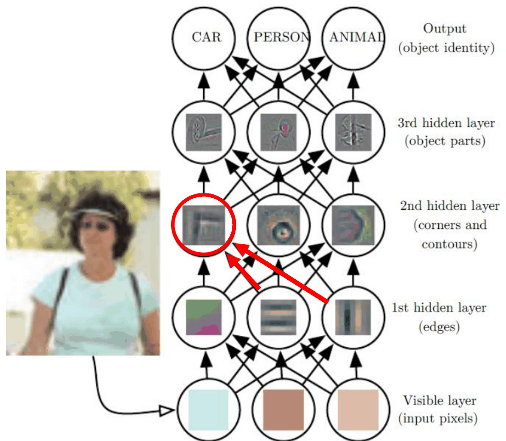
*Fig. 17.1 — Dai pixel all'identità dell'oggetto: una serie di strati nascosti estrae feature sempre più astratte (bordi → angoli e contorni → parti di oggetti).*

Il deep learning risolve la difficoltà di una mappatura complicata (pixel → identità) **scomponendola in una serie di mappature semplici annidate**, ciascuna descritta da uno strato diverso. La nuova rappresentazione **semplifica la classificazione** nell'ultimo strato. Ci sono analogie con il sistema visivo biologico.

Nelle reti queste feature astratte **si apprendono dagli esempi**: con la backpropagation, l'errore sullo strato di uscita (ad esempio per distinguere auto e persone) si propaga tramite i delta attraverso gli strati, e le unità si specializzano per fornire feature di alto livello utili a quello scopo (la ruota per l'auto, la mano per la persona...). Il legame tra le feature sviluppate automaticamente e la realtà è un aspetto affascinante; e sorprendentemente i primi filtri estraggono linee orizzontali o verticali, proprio come farebbe un semplice filtro convolutivo lineare.

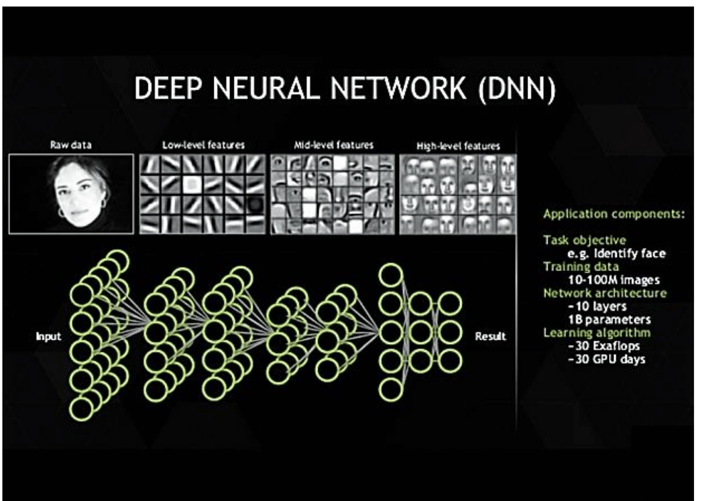
*Fig. 17.2 — Un altro esempio: feature di basso, medio e alto livello in una rete profonda per volti.*

### Combinare per generalizzare

Le feature astratte si possono **riusare** ai livelli superiori (es. genere, occhiali...) e **combinare** per generalizzare a casi mai visti in addestramento: se la rete ha visto donne senza occhiali e uomini con occhiali, può rappresentare facilmente anche una donna con gli occhiali.

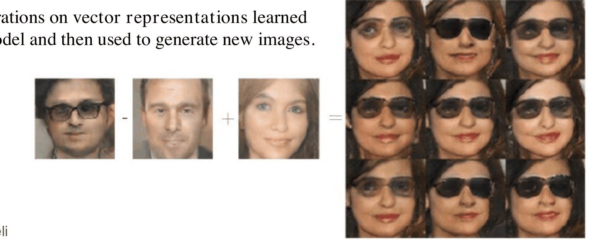
*Fig. 17.3 — Operazioni sulle rappresentazioni vettoriali apprese dal modello e usate per generare nuove immagini: "uomo con occhiali − uomo + donna = donna con occhiali".*

Lo stesso accade nel linguaggio: nello spazio vettoriale sviluppato dagli strati interni di un modello profondo,

- $\text{Rep}(\text{re}) - \text{Rep}(\text{maschio}) + \text{Rep}(\text{femmina}) \approx \text{Rep}(\text{regina})$: la differenza tra "re" e "maschio" cattura il concetto di monarchia;
- $\text{Rep}(\text{Parigi}) - \text{Rep}(\text{Francia}) + \text{Rep}(\text{Polonia}) \approx \text{Rep}(\text{Varsavia})$: la differenza cattura il concetto di capitale.

---

## Servono davvero molti strati?

### Un esempio dai circuiti logici

L'idea generale (**no-flattening**): *quando una funzione si rappresenta in modo compatto con un'architettura profonda, potrebbe richiedere un'architettura molto grande per essere rappresentata con una insufficientemente profonda.*

Un circuito logico a **due strati** può rappresentare **qualsiasi** funzione booleana, scritta come somma di prodotti (forma normale disgiuntiva): porte AND nel primo strato (con eventuale negazione degli input) e una porta OR nel secondo. Ma **con circuiti di profondità due, la maggior parte delle funzioni booleane richiede un numero esponenziale di porte** (rispetto alla dimensione dell'input).

> [!example] La funzione di parità
>
> La **parità dispari** estende lo XOR a $N$ input: restituisce 1 se e solo se il numero di 1 tra gli $N$ bit è dispari. (Si assume di disporre anche dei NOT; con 2 input bastano 3 porte.)
>
> **Con 2 strati** bisogna elencare tutte le configurazioni positive: per 3 input, $x_1x_2x_3 + x_1\bar x_2\bar x_3 + \bar x_1x_2\bar x_3 + \bar x_1\bar x_2x_3$ (1 se l'input è 111, 100, 010 o 001), cioè 4 AND + 1 OR = 5 porte. Per 4 input servono 9 porte, per 8 input **129 porte**, per $N$ input $2^N/2 + 1 = 2^{N-1} + 1$ porte: un numero **esponenziale**.
>
> **Con $\log N$ strati** si usa un **albero binario completo** di XOR: un albero con $N$ foglie ha $N - 1$ nodi interni, ognuno uno XOR da 3 porte AND/OR, per un totale di $3(N-1)$ porte, un numero **polinomiale**. Per 8 input bastano $3 \times 7 = 21$ porte contro le 129 della soluzione a 2 strati.

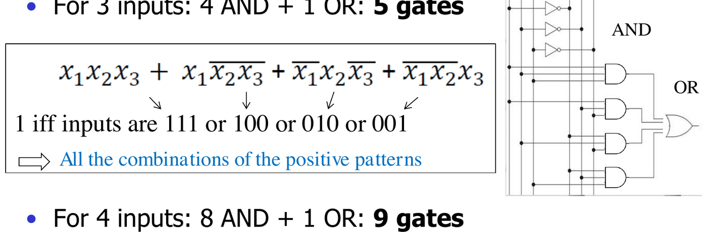
*Fig. 17.4 — Parità con 2 strati: un numero esponenziale di porte.*

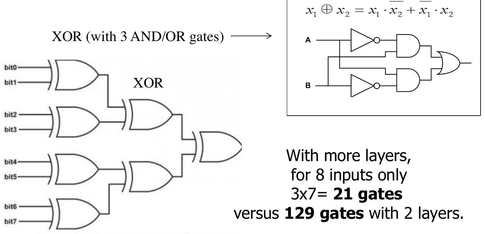
*Fig. 17.5 — Parità con $\log N$ strati: un albero di XOR con un numero polinomiale di porte.*

Questo però **non vale per tutte le classi di funzioni**: caratterizzare le classi che traggono un vantaggio (esponenziale) da una struttura a più strati è un problema di ricerca aperto.

### Il caso delle reti neurali

Ricordiamo che il **teorema di approssimazione universale** mostra che uno strato nascosto basta in generale, ma non garantisce che basti un numero **piccolo** di unità. Esistono però risultati di **no-flattening** (sull'efficienza, non sull'espressività):

1. **reti shallow**: ci sono casi in cui l'implementazione con un solo strato nascosto richiede un numero **esponenziale** di unità (rispetto alla dimensione $n$ dell'input) o di pesi non nulli. È facile vederlo nel caso binario: le funzioni booleane su $\{0,1\}^n$ sono $2^{2^n}$, e nel caso peggiore può servire un'unità nascosta per ogni configurazione di input da distinguere (come nell'esempio della parità). Non è solo un problema di dimensione della rete: significa anche che diventa **difficile apprendere con pochi esempi** (ed è questo il punto più rilevante per il ML);
2. **no-flattening delle reti profonde**: esistono famiglie di funzioni approssimabili in modo efficiente con profondità maggiore di $d$, ma che richiedono un modello molto più grande (fino a un guadagno esponenziale) se la profondità è al più $d$. Esempi per porte logiche (1986), reti con attivazioni standard (1990–1994), ReLU (2014)...

Resta la domanda: è facile addestrare un MLP con molti strati? (Vedi le tecniche più avanti.)

> [!note] Analisi teorica (ricerca aperta)
>
> I **teoremi di no-flattening** individuano funzioni composizionali che una rete profonda implementa bene e che non si possono implementare con la stessa efficienza "appiattendo" la rete (ad esempio passando da un numero lineare a uno esponenziale di unità). Ma non c'è garanzia che un dato task abbia questa proprietà: un elenco completo dei teoremi di no-flattening direbbe esattamente quando le reti profonde sono più efficienti di quelle superficiali.

### Perché: la composizionalità

Le reti profonde possono sfruttare la **composizionalità delle rappresentazioni interne**: c'è un guadagno esponenziale di potere rappresentativo perché i concetti semplici rappresentati in uno strato vengono usati come **primitive** dallo strato successivo per rappresentare concetti più complessi, evitando la rappresentazione (e l'apprendimento) esplicita e combinatoria delle feature.

Ad esempio, si devono imparare le singole parole o sotto-pattern, ma non direttamente tutte le loro possibili combinazioni: si può imparare senza vedere tutte le configurazioni. E forse la natura stessa (non solo immagini e linguaggio) ha una struttura gerarchica (fenomeni osservati a scale diverse nello spazio e nel tempo).

> [!tip] Meno è meglio!
>
> Non bisogna vedere le reti profonde come modelli **enormi** rispetto a piccoli modelli superficiali (solo perché nelle applicazioni si vedono istanze gigantesche: profondo non significa grande). Si possono vedere come modelli **compatti** rispetto a modelli superficiali potenzialmente molto più grandi per lo stesso task (anche esponenzialmente). Quindi sono "qualcosa di meno" e più efficienti. E non solo per ragioni computazionali: **meno unità e meno pesi aiutano l'apprendimento** su task complessi, permettendo di generalizzare bene con **meno esempi** (cioè rendendolo fattibile). Una "piccola rete profonda" da 50.000 unità può sostituire una "enorme rete superficiale" da un milione di unità.

### Il bias induttivo

Scegliere un modello profondo codifica una **convinzione molto generale**: che la funzione da apprendere sia una **composizione di funzioni più semplici** (o di fattori di variazione annidati). Se il task corrisponde a questo bias, la forma profonda è adatta, e la generalizzazione risulta migliore proprio grazie ai molti strati.

Task tipicamente gerarchici: la struttura delle **immagini** (composizione di parti grafiche), la struttura del **linguaggio** (testo e parlato), forse la musica; nuovi campi si stanno scoprendo. Ma non necessariamente tutti i dati e i task! È comunque un bias molto più **generale** di vincoli ad hoc per task specifici (come le $\phi$ scelte a mano nelle LBE o le feature ingegnerizzate). Ma, di nuovo, nulla è magico senza assunzioni.

*Fig. 17.6 — Risultati empirici (SVHN, ICLR 2014): a parità di numero di parametri, le reti più profonde generalizzano meglio.*

Quando il task corrisponde al bias, i modelli più profondi tendono a funzionare meglio: la generalizzazione è migliore di un modello con meno strati e **lo stesso numero di unità/pesi**.

### Maledizione della dimensionalità e bias

Altri argomenti a favore dei modelli profondi riguardano la **curse of dimensionality** e il *manifold learning* (la distribuzione delle immagini e dei testi reali sembra concentrata su una varietà che occupa solo una piccola frazione del volume di tutte le possibili immagini o testi casuali).

- Molti learner si basano su **approssimazioni locali** (un prior di *smoothness* locale): K-NN, kernel locali, alberi di decisione... Ma spesso questo non basta: servono esempi per generalizzare nell'intorno di ogni regione, e in alta dimensione servono moltissimi esempi per coprire tutto lo spazio. Per distinguere $O(k)$ regioni, tutti questi metodi richiedono $O(k)$ esempi.
- Per lavorare con $O(k)$ esempi su un numero **esponenziale** (in $k$) di regioni, cioè per generalizzare **non localmente**, servono ipotesi aggiuntive sulla distribuzione che genera i dati (un bias induttivo).
- Si potrebbero fare ipotesi forti e specifiche per ogni task (perdendo generalità). Il deep learning sceglie invece un bias **generale**, legato alla **composizione di funzioni**: si assume che i dati siano generati dalla composizione di fattori o feature, potenzialmente su più livelli di una gerarchia. Quando l'ipotesi è vera, si ottiene un guadagno potenzialmente esponenziale tra numero di esempi e numero di regioni distinguibili, si generalizza non localmente, e si impara con meno esempi.

### Questioni pratiche

Quanti strati? Quante unità? Non c'è ancora una risposta generale (è un problema di model selection). In generale le reti profonde usano spesso meno unità per strato, quindi meno parametri e meno dati per generalizzare bene; ma molti strati possono essere **più difficili da ottimizzare**. Gli iperparametri di questi modelli molto grandi possono essere troppi: l'**esperienza** fa la differenza nel fissare molti aspetti architetturali.

---

## Representation learning

> [!definition] Representation learning
>
> *"Il representation learning è un insieme di metodi che permette a una macchina di ricevere dati grezzi e scoprire automaticamente le rappresentazioni necessarie per il rilevamento o la classificazione."* (LeCun, Bengio, Hinton, 2015)

I metodi di deep learning sono metodi di representation learning con **più livelli** di rappresentazione (rappresentazioni espresse in termini di altre più semplici). Ma il concetto è più astratto e vale per molti modelli (ad esempio le reti neurali in generale). Si noti che si parla di apprendere la rappresentazione soprattutto per **dati grezzi** (immagini, stringhe di testo), non quando si fornisce già un piccolo insieme di feature.

### Idee di base

- Molti compiti di elaborazione dell'informazione sono facili o difficilissimi **a seconda di come l'informazione è rappresentata** (vale in tutta l'informatica).
- Nel ML, **una buona rappresentazione è quella che rende più facile il compito di apprendimento successivo**.
- Progettare le feature a mano è difficile: interi decenni di lavoro per alcune comunità (linguaggio, immagini). Equivale a ingegnerizzare a mano le $\phi(\mathbf{x})$ della LBE.
- L'apprendimento supervisionato di un MLP porta a una **rappresentazione automatica** in ogni strato nascosto, con proprietà che rendono più facile il compito dello strato di uscita (lo XOR!). Cioè $\phi(\mathbf{x}, \mathbf{w})$ viene appresa trovando il miglior $\mathbf{w}$.
- Nelle CNN si usa l'immagine grezza come input e il modello impara a estrarre le feature salienti per il task, senza pattern o feature specificati in anticipo.

Come ottenere o sfruttare le rappresentazioni nascoste (oltre all'addestramento completo di MLP e CNN)?

- **Ottenerle** (caso storico): con l'apprendimento **semi-supervisionato** si impara una rappresentazione dai dati non etichettati e la si usa per task supervisionati → **pre-training**.
- **Sfruttarle**: la rappresentazione appresa si usa per altri task → **transfer learning**.

### Pre-training

Il *greedy layer-wise unsupervised pretraining* (circa 2006) fu il primo approccio che rese possibile addestrare reti supervisionate profonde (a parte CNN e RNN). Si usa l'apprendimento **non supervisionato** per catturare la forma della distribuzione dell'input, **strato per strato**, e si inizializza così la rete, rendendo più facile l'addestramento complessivo (anziché fare subito un addestramento *end-to-end* con la discesa del gradiente, che per i modelli profondi era difficile).

Perché aiuta? Ogni strato è ottimizzato indipendentemente in modo non supervisionato, costituendo un pre-addestramento per il **fine-tuning** finale. Funziona sia come **buona strategia di inizializzazione** sia come **regolarizzazione**: non nel senso di un modello più semplice, ma di scoprire feature che catturano le regolarità dei dati. Se le funzioni vere sono complicate e modellate dalle regolarità della distribuzione degli input, l'apprendimento non supervisionato può essere un regolarizzatore più appropriato. Riduce anche la **varianza** del processo di stima (i modelli pre-addestrati tendono a finire in una regione più piccola).

#### Autoencoder

> [!definition] Autoencoder
>
> Un **autoencoder** è una rete neurale addestrata a **copiare il proprio input in uscita**. Internamente ha uno strato nascosto $\mathbf{h}$ che descrive un **codice** per rappresentare l'input. Si compone di un **encoder** $\mathbf{h} = f(\mathbf{x})$ e di un **decoder** che produce la ricostruzione $\mathbf{r} = g(\mathbf{h})$.

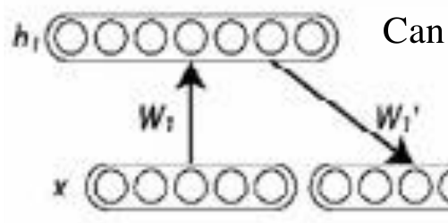
*Fig. 17.7 — Un autoencoder: encoder (W₁) e decoder (W₁').*

- **Undercomplete**: lo strato nascosto è **più piccolo** dell'input, e il vincolo architetturale forza la rete a catturare le feature più salienti. (Con decoder lineare e loss quadratica si ottiene la PCA.)
- **Overcomplete**: lo strato nascosto è **più grande** dell'input, ma si usa una regolarizzazione che impone sparsità, robustezza al rumore o altre proprietà, oltre alla banale capacità di copiare.
- È apprendimento **non supervisionato**.

Esempio d'uso: **denoising autoencoder** e memorie auto-associative. Si addestra su immagini cercando una buona rappresentazione ("*una buona rappresentazione è quella che si può ottenere in modo robusto da un input corrotto e che è utile per recuperare l'input pulito*"), poi si recupera l'immagine originale presentandone una versione rumorosa e ripetendo le fasi di codifica e decodifica.

#### L'algoritmo di pre-training (Bengio)

> [!abstract] Pre-training layer-wise
>
> 1. Addestrare il primo strato come **autoassociatore** per minimizzare l'errore di ricostruzione dell'input grezzo (non supervisionato: bastano esempi non etichettati).
> 2. Usare le uscite delle unità nascoste come input per un altro strato, anch'esso addestrato come autoassociatore.
> 3. Ripetere fino al numero di strati desiderato.
> 4. Usare l'uscita dell'ultimo strato nascosto come input per uno strato supervisionato, inizializzato (casualmente o con addestramento supervisionato, tenendo fisso il resto).
> 5. **Fine-tuning** di tutti i parametri rispetto al criterio supervisionato.
>
> Si spera che l'inizializzazione non supervisionata abbia portato i parametri in una regione da cui la discesa locale raggiunge un buon ottimo locale.

Gli autoencoder si usano come RBM (*Restricted Boltzmann Machines*, modelli basati sull'energia, nelle *deep belief network* di Hinton) o come autoencoder (denoising) impilati (Bengio, 2007).

> [!note] Serve ancora il pre-training?
>
> Il pre-training ha permesso di **far partire** il deep learning e dà ancora miglioramenti in alcuni task (soprattutto NLP, dove permette di sfruttare grandi corpora di testo per apprendere rappresentazioni distribuite delle parole). Ma è difficile da gestire (iperparametri divisi in due fasi) e oggi *"il pre-training non supervisionato è largamente abbandonato"* (DL book, cap. 15): le tecniche moderne bastano per un buon addestramento **end-to-end** da zero con la backpropagation.

> [!note] Encoder e decoder oggi
>
> - Gli **autoencoder variazionali** usano un quadro bayesiano: lo spazio latente è una miscela di distribuzioni invece di un vettore fisso.
> - La **traduzione automatica neurale** si realizza con architetture encoder-decoder in cui l'uscita non coincide con l'input ma è in un'altra lingua.
> - I **transformer** (come GPT, *Generative Pre-trained Transformer*) sono reti encoder/decoder con un meccanismo di **attenzione**. Si può usare solo l'encoder (BERT, per vari task NLP) o solo il decoder, a scopo generativo (la serie GPT per la generazione autoregressiva di testo).

### Transfer learning

Si usa la rappresentazione scoperta da un modello per **migliorare un altro modello**, assumendo che esistano feature utili in contesti o task diversi, corrispondenti a fattori sottostanti comuni. Forme diverse (sono veri sotto-campi del ML, non solo terminologia):

- dall'autoencoder al classificatore (come sopra);
- **multi-task learning**: stessi input, target diversi (una regolarizzazione implicita);
- **domain adaptation**: dominio di input diverso ma feature condivise (es. analisi del sentiment su recensioni di video e di smartphone);
- riuso di **modelli pre-addestrati** su dataset più grandi.

> [!example] Transfer learning con AlexNet
>
> AlexNet è una CNN addestrata su circa 1,2 milioni di immagini ImageNet in 1000 categorie: ha appreso **rappresentazioni ricche** per un'ampia gamma di immagini, con primitive di basso livello condivise tra immagini diverse. Ha 5 strati convoluzionali e 3 completamente connessi. Per un nuovo task si **sostituiscono gli ultimi 3 strati** e si addestrano solo quelli con poche immagini nuove, oppure si fa il **fine-tuning** di tutta la rete. Molte CNN pre-addestrate (VGG, ResNet, GoogLeNet...) sono disponibili nelle librerie.

---

## Rappresentazioni distribuite

> [!definition] Rappresentazione distribuita
>
> *"In una rappresentazione distribuita gli elementi (le feature) non sono mutuamente esclusivi e le loro molte configurazioni corrispondono alle variazioni osservate nei dati."* (LeCun, Bengio, Hinton, 2015)

I metodi di deep learning sfruttano rappresentazioni distribuite su più livelli, ma il concetto vale per molti modelli (reti neurali in generale, sulle unità nascoste; modelli grafici probabilistici, con più variabili latenti).

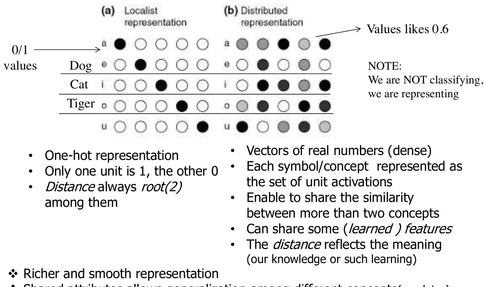
*Fig. 17.8 — Rappresentazione simbolica (one-hot) e distribuita.*

| Simbolica (one-hot) | Distribuita |
|---|---|
| una sola unità vale 1, le altre 0 | vettori di numeri reali (densi) |
| distanza sempre $\sqrt{2}$ tra concetti diversi | ogni concetto è l'insieme delle attivazioni di tutte le unità |
| | la similarità si può condividere tra più di due concetti |
| | si possono condividere feature (apprese) |
| | la distanza riflette il significato |

Attenzione: qui **non si classifica**, si **rappresenta**. Le rappresentazioni distribuite sono più ricche e lisce, e gli attributi condivisi permettono di generalizzare tra concetti diversi.

**Input o rappresentazione interna?** Il discorso è generale, ma l'apprendimento agisce sulla rappresentazione **interna**. Una rappresentazione distribuita in **input** si usa solo se la conoscenza di dominio permette di fissarla (raro e difficile; fissarla arbitrariamente può danneggiare il task). In genere si usa comunque un input one-hot (non informato) e si lascia che il modello sviluppi **internamente** la rappresentazione distribuita necessaria.

### Contare la differenza

Quattro concetti: auto blu, bici blu, auto rossa, bici rossa. Non servono 4 neuroni: ne bastano **2** ($2^2$ concetti), uno per blu/rosso e uno per auto/bici. E il neurone che descrive il "rosso" impara il rosso da immagini sia di auto sia di bici, non solo da una specifica categoria.

In generale, con $n$ feature a $k$ valori una rappresentazione distribuita descrive $k^n$ concetti diversi (ad esempio $2^n$ configurazioni binarie), contro gli $n$ di una rappresentazione simbolica one-hot. Si può assegnare un codice unico a un numero **esponenziale** di regioni: i modelli con rappresentazioni distribuite (come le reti con unità nascoste) distinguono esponenzialmente più regioni di quelli non distribuiti.

Modelli basati su rappresentazioni **non distribuite**: K-NN (uno o pochi prototipi per input, senza condividere informazione con tutto il training set), kernel RBF (si riducono al K-NN, come visto per le SVM), miscele di gaussiane, alberi di decisione (si attiva una sola foglia).

### Attributi condivisi: separare i concetti

*Fig. 17.9 — Condividendo una colonna (feature) si separa (*disentangle*) il concetto di "rosso", comune a oggetti diversi.*

Separando i concetti colore e tipo, si può imparare la distinzione auto/bici o il colore **senza dover vedere esempi di tutte le combinazioni**. Questa **separabilità statistica** rende facile generalizzare a configurazioni mai viste: avendo visto gli altri tre casi, si classifica facilmente la bici blu (ad esempio "non mi piace" perché non è rossa, se il modello ha imparato che mi piacciono gli oggetti rossi); con la rappresentazione localista la bici blu sarebbe del tutto nuova.

Con le **parole**: invece di un simbolo one-hot per parola (dimensione pari al vocabolario), una rappresentazione distribuita in cui "cane" e "gatto" condividono feature permette al modello di:

1. **trattarli in modo simile**: le frasi con "gatto" informano le predizioni per le frasi con "cane" e viceversa, trasferendo informazione da ogni frase di training a un numero esponenziale di frasi semanticamente affini (ad esempio "entrambi hanno la coda" → animale, non umano);
2. **imparare automaticamente che sono simili**, avvicinandone le rappresentazioni perché compaiono in contesti simili: è il **word embedding** (ad esempio *word2vec*). Nello spazio one-hot ogni parola è a distanza $\sqrt{2}$ da tutte le altre; nello spazio appreso parole con significato simile diventano vicine.

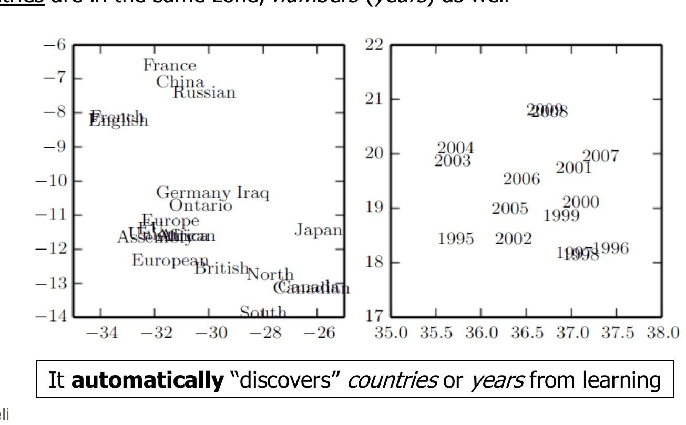
*Fig. 17.10 — Word embedding: parole semanticamente simili (paesi, anni) finiscono vicine. Il modello "scopre" automaticamente paesi e anni dall'apprendimento.*

> [!tip] Una considerazione sui risultati
>
> Il modello impara non solo la grammatica (non sorprende) ma rappresentazioni **semanticamente significative**, e lo fa automaticamente, solo leggendo testo. Perché la nostra semantica coincide con ciò che la rete impara? Probabilmente il linguaggio (e le immagini) hanno intrinsecamente una struttura **gerarchica** e la rete profonda ha il bias induttivo giusto per apprenderla in modo distribuito (le immagini reali sono una frazione minuscola delle immagini di rumore bianco). È ancora un campo aperto.

Il dibattito sulle rappresentazioni distribuite si estende a quello tra paradigmi **logico-simbolici** e **neurali** per la cognizione: i successi nella traduzione mettono in dubbio la necessità di approcci simbolici per capire le frasi.

> [!warning] Interpretabilità
>
> Il rovescio della medaglia: una rappresentazione distribuita è **meno facile da interpretare** di una localista.

### Rappresentazioni distribuite profonde

Il DL sfrutta rappresentazioni distribuite **attraverso molti strati**, ottenute componendo livelli di astrazione o una gerarchia di feature riusate. La composizionalità porta un ulteriore guadagno esponenziale di efficienza statistica, oltre a quello delle rappresentazioni distribuite: **due vantaggi potenzialmente esponenziali** rispetto ai modelli non distribuiti e superficiali. Nel complesso, i modelli di DL imparano una rappresentazione distribuita dei dati trovando (separando) i **fattori causali condivisi** che li generano, su diversi livelli di astrazione.

Esempi applicativi: la combinazione di CNN e RNN per generare **didascalie di immagini** (con un meccanismo di attenzione che si concentra sulla parte dell'immagine relativa a ogni parola generata); la classificazione dei **tumori della pelle** con una rete profonda addestrata su 130.000 casi, con competenza paragonabile a quella dei dermatologi (*Nature* 2017).

---

## Altri spunti e risultati recenti

- **Smoothness tramite la struttura**: a parità di parametri, le reti più profonde impongono più smoothness di quelle superficiali (ogni strato lavora sulla superficie già liscia prodotta dal precedente), e sembrano apprendere meglio a parità di neuroni totali: vincoli di smoothness **impliciti**, anziché espliciti.
- **Il puzzle del non-overfitting**: reti enormi, sovra-parametrizzate, capaci di azzerare l'errore di training anche su etichette **casuali**, eppure generalizzano. Una spiegazione: la discesa del gradiente impone una forma di **regolarizzazione implicita**, con convergenza verso la soluzione a **margine massimo** (Poggio et al., 2017–2019). Varianti di SGD con batch/weight normalization massimizzano il margine normalizzato, e perfino la discesa del gradiente standard massimizza il margine $L^2$ senza normalizzazione o regolarizzazione esplicita.
- **Double descent**: nelle CNN, ResNet e transformer, al crescere della dimensione del modello (o dei dati, o del tempo di addestramento) le prestazioni prima migliorano, poi peggiorano (la classica U) e poi **migliorano di nuovo** oltre la soglia di interpolazione (dove l'errore di training diventa quasi zero). L'effetto è spesso evitato con una regolarizzazione accurata; non è ancora pienamente compreso ed è un'importante direzione di ricerca. (Non necessariamente riguarda i piccoli modelli del progetto.)

*Fig. 17.11 — Il fenomeno del *deep double descent*.*

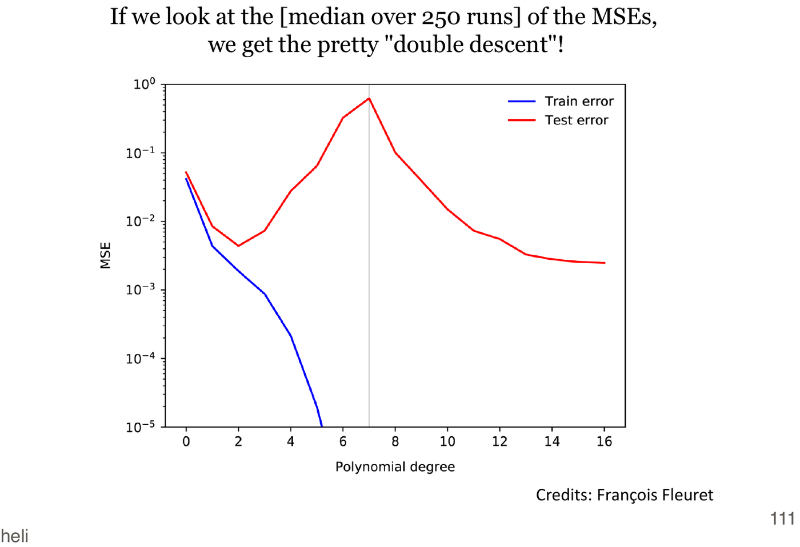
*Fig. 17.12 — Un esempio giocattolo con regressione polinomiale regolarizzata: anche qui compare il double descent. Superato l'errore di training nullo, all'aumentare del grado il fit è guidato solo dal termine di penalità e il polinomio diventa sempre più "lineare a tratti".*

- **Ridondanza**: nei modelli profondi c'è una ridondanza significativa nei parametri; dati pochi pesi per feature si possono predire gli altri, fino a oltre il 95% dei pesi senza perdita di accuratezza (Denil et al., 2013). Si possono anche **comprimere** i parametri (pruning, quantizzazione, codifica di Huffman) senza perdite (Han et al., 2015): sembra che reti piccole bastino!
- **Lottery ticket hypothesis** (Frankle e Carbin, 2018): perché allora addestriamo reti grandi? Perché le buone prestazioni dipendono da una **inizializzazione fortunata** di una o più sotto-reti, e le reti grandi ne contengono esponenzialmente di più. Riaddestrando la rete potata con la stessa inizializzazione si ottengono prestazioni simili.
- Il ruolo della **casualità** (reti inizializzate casualmente e reti a pesi casuali) riceve sempre più attenzione (vedi [[18 - Reti neurali randomizzate]]).

---

## Tecniche

Molti strati possono essere difficili da ottimizzare, quindi l'enfasi è sui metodi per migliorare la **discesa del gradiente** (anche contro il *vanishing gradient*), la **regolarizzazione** (reti grandi) e lo **sfruttamento dei dati** (semi-supervisionato, reinforcement learning, multi-task, apprendimento avversario...). A questo si aggiungono dataset più grandi, infrastrutture software pubbliche e miglioramenti hardware.

> [!abstract] Tecniche chiave per il DL
>
> - In origine: approcci di **pre-training** (ancora usati in domini come l'NLP per i word embedding).
> - Oggi (nelle librerie più diffuse), in gran parte già note:
>   - **SGD con momentum** (con decadimento di $\eta$, mini-batch) o **Adam**;
>   - attivazioni **ReLU** nelle unità nascoste;
>   - loss di **massima verosimiglianza** (cross-entropy) con **softmax** in uscita (anche per evitare saturazione e gradienti piccoli);
>   - regolarizzazione: early stopping, weight decay, **dropout**, **batch normalization**.

### Problemi del gradiente

Cosa succede alla norma del gradiente quando lo si retropropaga attraverso molti strati?

- se i pesi sono **piccoli**, i gradienti **si riducono esponenzialmente** (*vanishing gradient*), anche per via della derivata delle sigmoidi;
- se i pesi sono **grandi**, i gradienti **crescono esponenzialmente** (*exploding gradient*).

#### Il vanishing gradient

Le attivazioni tradizionali come la tanh hanno gradienti in $(-1, 1)$, e la backpropagation calcola i gradienti con la regola della catena ripetuta attraverso gli strati. In una rete a $d$ strati si moltiplicano $d$ di questi numeri piccoli per calcolare i gradienti degli strati vicini all'input: il gradiente (il delta) **decresce esponenzialmente con $d$** e gli strati vicini all'input si addestrano lentissimamente.

> [!note] Schizzo formale
>
> Se $\mathbf{h}_l = F_l(\mathbf{h}_{l-1})$ e $F = F_M \circ \dots \circ F_1$, allora
> $$
> \frac{\partial F}{\partial w_l} = \frac{\partial F_M}{\partial \mathbf{h}_{M-1}}\cdots\frac{\partial F_l}{\partial w_l}, \qquad \left|\frac{\partial F}{\partial w_l}\right| \approx \rho^{M-l+1} \text{ se } \left\|\frac{\partial F_i}{\partial \mathbf{h}_i}\right\| \approx \rho.
> $$
> Con $\rho < 1$ il gradiente svanisce, con $\rho > 1$ esplode.

Gli approcci per affrontarlo vanno da R-prop alle connessioni *shortcut*, fino alle reti randomizzate, e alle ReLU.

#### Gradient clipping

La moltiplicazione ripetuta attraverso gli strati può introdurre **scogliere** (*cliff*) nella funzione di costo: derivate altissime che "catapultano" i pesi lontanissimo. Il **clipping** limita la norma del gradiente mantenendone la direzione:
$$
\text{se } \|\mathbf{g}\| > v \;\text{ allora }\; \mathbf{g} \leftarrow \frac{v\,\mathbf{g}}{\|\mathbf{g}\|},
$$
con $v$ soglia sulla norma.

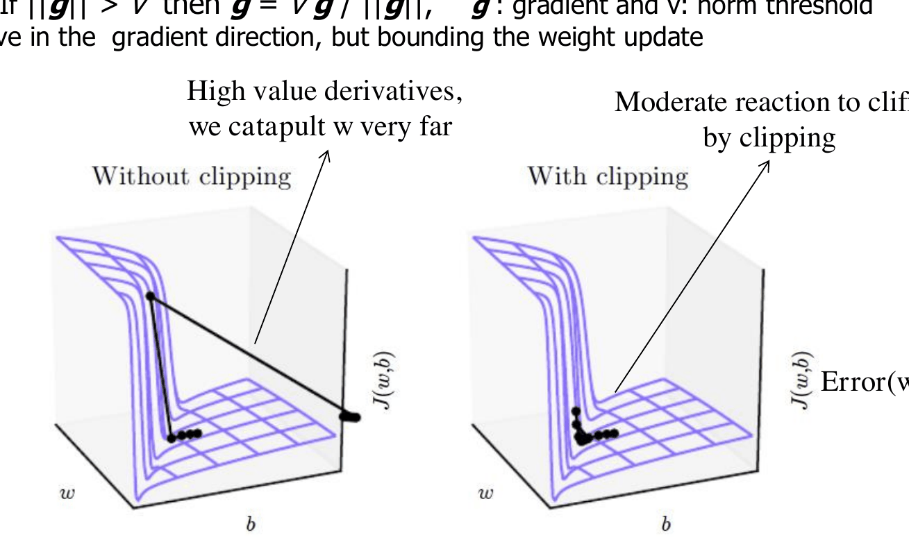
*Fig. 17.13 — Senza clipping (sinistra) e con clipping (destra) di fronte a una scogliera della funzione di costo.*

### ReLU

> [!definition] ReLU (*Rectified Linear Unit*)
>
> $$
> f(x) = \max(0, x) = \begin{cases} 0 & x < 0 \\ x & x \ge 0. \end{cases}
> $$

Perché usarla nel DL (dal 2009)?

- **Propagazione del gradiente** migliore attraverso molti strati: evita la saturazione delle sigmoidi, perché $f'(x) = 1$ per ogni net positivo.
- **Attivazione sparsa**: in una rete inizializzata casualmente circa il 50% delle unità nascoste è attivo (uscita non nulla).
- **Calcolo efficiente**: solo confronti, somme e prodotti.
- Ha ancora un'ispirazione neuroscientifica, e permette un addestramento più veloce ed efficace delle reti profonde.

La ReLU **non è differenziabile in 0**, ma nelle librerie si assume di solito derivata 0 (sinistra) o 1 (destra): l'approssimazione è accettabile e sicura, perché per le approssimazioni numeriche è improbabile valutare esattamente $f(0)$. (Un approccio più rigoroso usa l'ottimizzazione non differenziabile per funzioni lineari a tratti.)

Un trucco: iniziare con **net positivi**, ad esempio con bias piccoli e positivi (0,1), così che le ReLU siano inizialmente attive per la maggior parte degli input e lascino passare le derivate.

Varianti: **ELU** (*Exponential Linear Unit*), $f(x) = \alpha(e^x - 1)$ per $x \le 0$ e $x$ per $x > 0$; **Leaky ReLU**, $f(x) = 0{,}01x$ per $x < 0$ e $x$ per $x \ge 0$. Imparano anche sulla parte sinistra (i neuroni non si "spengono") e hanno attivazione media più vicina a zero. Molte varianti hanno prestazioni comparabili; in generale evitano alcuni difetti mantenendo la parte lineare, che rende il modello più facile da ottimizzare.

### Batch normalization

La **batch normalization** normalizza ogni mini-batch calcolandone le statistiche (media e varianza) per ogni strato: si normalizza la matrice [esempi del batch × attivazioni delle unità] a media zero e varianza unitaria, e la trasformazione è inclusa nella backpropagation. Come normalizzare l'input è pratica standard, così la BN mantiene normalizzati i dati che fluiscono tra gli strati intermedi. Effetti: **regolarizzazione** (per il rumore introdotto dal mini-batch) e **apprendimento più rapido** con accuratezza più alta (rilevante perché ha permesso di addestrare efficacemente CNN e modelli profondi con sigmoidi). (Dettagli non richiesti all'esame, a meno di usarla.)

### Dropout

Il **dropout** seleziona casualmente un sottoinsieme della rete durante l'addestramento. Si spiega con due concetti già noti: **ensemble** (un bagging implicito di sotto-reti diverse, ma computazionalmente economico) e **regolarizzazione**.

Il bagging addestra $n$ modelli su sottoinsiemi diversi del training set e ne media le uscite: modelli ad alta varianza e basso bias funzionano bene in media. Il dropout approssima e sfrutta questo processo con un numero **esponenziale** di sotto-reti, pur avendo a test time **una sola rete**, e massimizza la diversità dell'ensemble evitando co-adattamenti complessi sui dati di training.

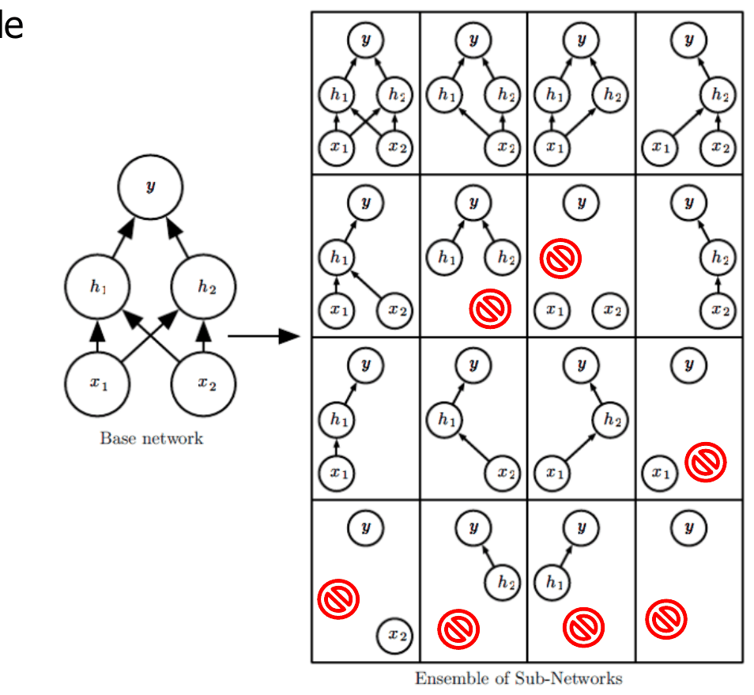
*Fig. 17.14 — Il dropout addestra l'ensemble di tutte le sotto-reti ottenibili rimuovendo unità non di uscita dalla rete base. Alcune sotto-reti non funzionano, ma in reti grandi è improbabile che non ci sia alcun percorso dall'input all'uscita.*

> [!abstract] Algoritmo del dropout
>
> - Ogni volta che si carica un esempio in un mini-batch, si campiona una diversa **maschera binaria** da applicare a tutte le unità di input e nascoste, indipendentemente per ogni unità. La probabilità di includere un'unità è un iperparametro (tipicamente 0,8 per l'input e 0,5 per le unità nascoste).
> - Ogni unità viene moltiplicata per la sua maschera (zero equivale a rimuoverla, *drop out*): si ottiene una sotto-rete.
> - Si eseguono forward, backpropagation e aggiornamento come al solito, addestrando un sottoinsieme di unità alla volta.
> - Le unità rimosse vengono poi reinserite con i loro pesi originali.

Solo una piccola frazione delle sotto-reti viene addestrata (ciascuna per un solo passo), ma la **condivisione dei parametri** fa sì che anche le altre arrivino a buoni parametri: si gestisce un numero esponenziale di modelli con memoria trattabile. Per approssimare la predizione dell'ensemble a test time si usa la *weight scaling inference rule*: si moltiplicano i pesi per la probabilità di inclusione (tipicamente 0,5), così che l'uscita attesa di ogni unità sia la stessa dell'addestramento.

Effetto regolarizzante: evita di addestrare tutte le unità su tutti i dati riducendone le interazioni (e diversificandole, come serve ai comitati); riduce la varianza come il bagging; inserisce **rumore strutturato** (ad esempio riconoscere un volto senza l'unità che rileva il naso). Soprattutto, regolarizza ogni unità a essere non solo una buona feature, ma **una feature buona in molti contesti** (sotto-reti diverse). Per la regressione lineare equivale al weight decay $L^2$ con un $\lambda$ diverso per ogni input. Si può usare con qualsiasi modello a rappresentazione distribuita addestrato con SGD.

### Regolarizzazione L1

Usare la norma $L^1$ (somma dei valori assoluti) al posto della $L^2$ nella penalità (per i modelli lineari è il **LASSO**) favorisce l'**eliminazione** di feature (pesi esattamente a zero), mentre la $L^2$ di solito riduce solo la grandezza dei pesi: si ottengono modelli più semplici. La soluzione richiede tecniche di ottimizzazione non differenziabile (sub-gradiente, approssimazioni lisce della norma $L^1$...).

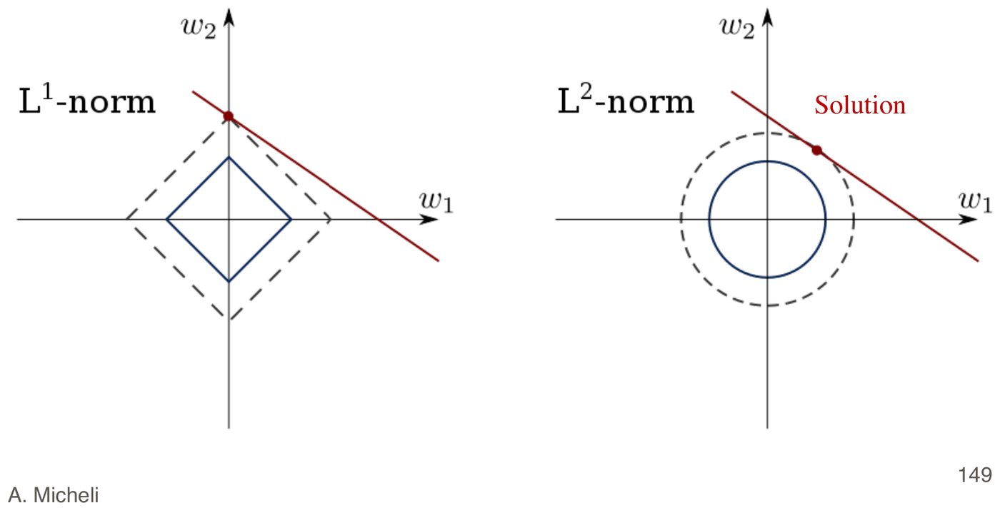
*Fig. 17.15 — Perché L1 produce soluzioni sparse: le curve di livello della norma L1 hanno "spigoli" sugli assi, dove una coordinata è nulla.*

### Apprendimento avversario

Le **Generative Adversarial Network** (GAN) sono due reti in competizione: una **genera** candidati, l'altra li **valuta** (distinguendo i veri dai generati). Sono usate ad esempio per generare immagini fotorealistiche di persone che non esistono.

---

## Applicazioni, sfide e conclusioni

Il DL ha successo nell'**NLP** (riconoscimento del parlato, traduzione, sentiment analysis, question answering...), nella **computer vision** (immagini e video: riconoscimento di oggetti, applicazioni mediche, sintesi di immagini...) con prestazioni mai raggiunte prima, e nel gioco del **Go**. Se ne parla più a fondo nei corsi di NLP e ISPR.

Sfide aperte: analisi e quadro teorici; progettazione ottima dell'architettura (quanti strati? che unità? la cross-validation può essere troppo costosa); efficienza per i big data; elaborazione di stream (on-line); dati strutturati (sequenze, alberi, grafi).

Anche l'hardware è cambiato: TPU di Google (inizialmente solo per l'inferenza), GPU Nvidia, NPU nei chip per smartphone (Huawei Kirin 970), il *Neural Engine* di Apple (dal 2017).

> [!abstract] Sintesi
>
> - I progressi tecnici e la disponibilità di dati hanno reso possibile apprendere con reti profonde e molto grandi, con risultati allo stato dell'arte soprattutto dove la **composizionalità** delle feature è rilevante (visione, linguaggio).
> - Due vantaggi potenzialmente esponenziali: la **profondità** (composizione di funzioni, no-flattening) e le **rappresentazioni distribuite** (attributi condivisi).
> - Il concetto più generale emerso è il **representation learning**.
> - Tecniche: ReLU, cross-entropy con softmax, SGD con momentum/Adam, dropout, batch normalization, gradient clipping.
> - Il ML rende relativamente più facile sviluppare sistemi di AI (e software in generale) sofisticati per problemi reali.

> [!question] Possibili domande d'esame
>
> - Cosa si intende per deep learning? Quali sono gli aspetti comuni ai vari approcci?
> - Servono davvero molti strati? Discutere l'esempio della parità e i risultati di no-flattening.
> - Qual è il bias induttivo dei modelli profondi?
> - Cos'è il representation learning? Pre-training e transfer learning.
> - Cos'è un autoencoder?
> - Rappresentazioni simboliche contro distribuite: vantaggi delle seconde.
> - Cos'è il vanishing gradient? Come si affronta (ReLU, clipping...)?
> - Descrivere il dropout e spiegarne l'effetto regolarizzante.
