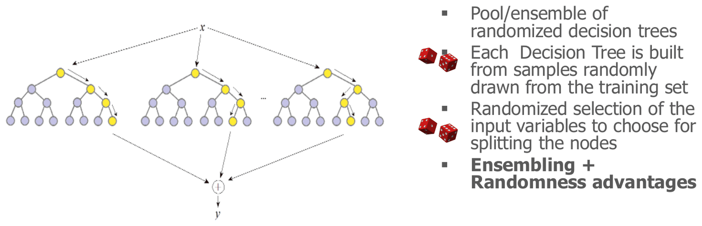
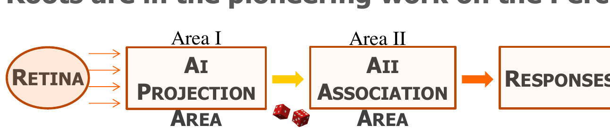
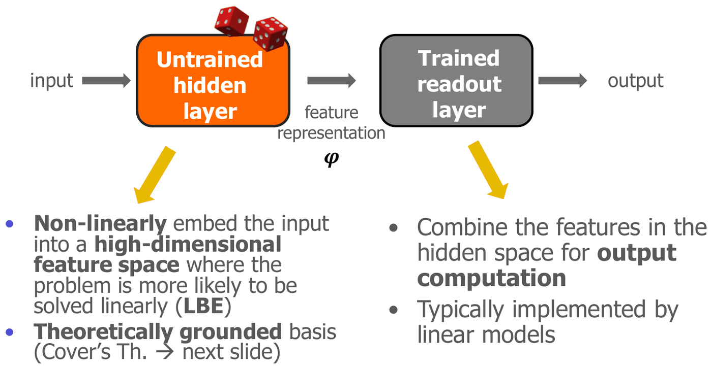
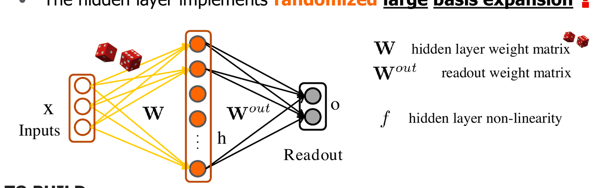

# Reti neurali randomizzate

*Appunti di Fabio Piscitelli — Machine Learning (654AA), Prof. Alessio Micheli, Università di Pisa, a.a. 2026/27*

Dopo il deep learning, l'altro paradigma recente presentato nel corso è quello delle **reti neurali a pesi casuali** ("deep learning ed *extreme* learning", scherza il professore). L'idea sembra paradossale: e se lo strato nascosto non venisse addestrato affatto? La lezione mostra come la casualità sia una componente utile del ML e come le reti randomizzate si ricolleghino a concetti già visti: espansione in basi, teorema di Cover, regolarizzazione.

## La casualità nel Machine Learning

Un approccio **randomizzato** usa un certo grado di casualità come parte della sua strategia costruttiva. La casualità può migliorare le prestazioni predittive e alleviare le difficoltà delle metodologie classiche, ed è presente a diversi livelli:

- **elaborazione dei dati**: suddivisione dei dati (hold-out, K-fold CV, leave-one-out), generazione di dati (bootstrap, boosting, tecniche di bilanciamento);
- **apprendimento**: ordine delle osservazioni (shuffling per il mini-batch), inizializzazione casuale dei pesi delle reti;
- **selezione degli iperparametri** (inclusa la ricerca casuale);
- **ensemble**: differenziazione casuale tra modelli (inizializzazioni diverse, campionamento dei training set in bagging e boosting);
- **nel cuore del modello**.

### Modelli intrinsecamente casuali

- I neuroni stocastici delle **Restricted Boltzmann Machine**.
- Gli **Extremely Randomized Trees** e le **Random Forest**: un ensemble di alberi di decisione randomizzati, ciascuno costruito su campioni estratti casualmente dal training set e con una scelta casuale delle variabili di input su cui dividere i nodi. Uniscono i vantaggi degli ensemble e della casualità.
- Il **dropout** come regolarizzazione (anche se qui la casualità non è necessaria di per sé).

*Fig. 18.1 — Random Forest: un ensemble di alberi di decisione randomizzati.*

---

## Reti neurali a pesi casuali

> [!question] La domanda
>
> È possibile sfruttare le architetture MLP (o ricorrenti) **senza lunghi cicli di addestramento** degli strati nascosti?

Esiste una lunga tradizione di reti randomizzate, a pesi casuali, a proiezione casuale: ad esempio la **Random Vector Functional Link** (RVFL), fin dalle origini. Di recente sono state rese popolari con vari nomi, tra cui **ELM** (*Extreme Learning Machine*).

> [!definition] Idea di base
>
> - Una rete con uno (o più) **strati nascosti connessi casualmente**: i pesi vengono **fissati dopo l'inizializzazione casuale** e non vengono più addestrati.
> - Si addestrano **solo i pesi di uscita** (un modello lineare: con la pseudoinversa o la ridge regression).
>
> Si superano così i problemi degli algoritmi di addestramento complessi e computazionalmente onerosi tradizionalmente usati per le reti neurali.

Le radici sono nel lavoro pionieristico sul **Perceptron** di Rosenblatt, in cui un'area di "proiezione" connessa casualmente alla retina alimentava un'area di "associazione", e solo le risposte finali venivano apprese. Altri lavori pionieristici avevano sottolineato l'importanza dell'apprendimento nello strato di uscita rispetto a quello nascosto.

*Fig. 18.2 — Il Perceptron originale: le connessioni dalla retina all'area di proiezione erano casuali.*

Le reti randomizzate sono oggi una linea di ricerca in crescita, particolarmente adatta quando l'**efficienza** è fondamentale (l'addestramento è limitato all'ultimo strato).

### Struttura generale

*Fig. 18.3 — Struttura generale: uno strato nascosto non addestrato (casuale) e uno strato di readout addestrato.*

- **Strato nascosto (non addestrato)**: immerge in modo **non lineare** l'input in uno **spazio delle feature ad alta dimensione**, dove il problema ha più probabilità di essere risolvibile linearmente (è una **LBE**!). Ha una base teorica nel teorema di Cover.
- **Readout (addestrato)**: combina le feature dello spazio nascosto per calcolare l'uscita; tipicamente è un **modello lineare**.

> [!theorem] Teorema di Cover (1965)
>
> *"Un problema complesso di classificazione di pattern, proiettato in modo non lineare in uno spazio ad alta dimensione, ha più probabilità di essere linearmente separabile che in uno spazio a bassa dimensione, purché lo spazio non sia densamente popolato."*
>
> Ad esempio, con una mappatura deterministica: dati $l$ esempi, li si solleva sui vertici di un simplesso $(l-1)$-dimensionale (il "triangolo" generalizzato). Ora **ogni** partizione binaria dei campioni è linearmente separabile.

È esattamente la stessa proprietà sfruttata dai **kernel** nelle SVM.

### Reti feedforward randomizzate

*Fig. 18.4 — Rete feedforward randomizzata: $\mathbf{W}$ (casuale, fissa) e $\mathbf{W}^{out}$ (addestrata).*

La relazione input-output è implementata da uno strato nascosto non addestrato, che realizza una **grande espansione in basi casuale**.

> [!abstract] Costruzione, apprendimento e uso
>
> **Costruzione**: riempire $\mathbf{W}$ con valori casuali (ad esempio rumore gaussiano), usando **molte unità**.
>
> **Apprendimento** del readout: dati $l$ esempi $(\mathbf{x}_p, \mathbf{d}_p)$, come per i modelli lineari si minimizza l'errore quadratico con il metodo diretto. Con $\mathbf{H} = f(\mathbf{W}\mathbf{X})$ (le attivazioni nascoste di tutti i pattern):
> $$
> \mathbf{W}^{out} = \mathbf{H}^+\mathbf{d},
> $$
> spesso con **regolarizzazione $L^2$** (utile per l'alto numero di unità):
> $$
> \mathbf{W}^{out} = (\mathbf{H}^T\mathbf{H} + \lambda\mathbf{I})^{-1}\mathbf{H}^T\mathbf{d},
> $$
> oppure con $L^1$.
>
> **Uso**: si calcolano le attivazioni nascoste $\mathbf{h}$ come per i normali neuroni e poi le uscite
> $$
> \mathbf{o}(\mathbf{x}) = \mathbf{W}^{out} f(\mathbf{W}\mathbf{x}),
> $$
> applicando eventualmente una soglia (o una funzione non lineare) per la classificazione.

I principali modelli di riferimento sono la **RVFL** (*Random Vector Functional-Link*), la **ELM** (*Extreme Learning Machine*) e le **reti RBF con centri casuali**.

> [!tip] Perché funziona
>
> Si confronti con le reti neurali "normali": lì lo strato nascosto è un'espansione in basi **adattiva** $\phi_j(\mathbf{x}, \mathbf{w})$ i cui pesi vengono appresi; qui è un'espansione in basi **casuale** ma molto **ampia**. Se le basi sono abbastanza numerose, per il teorema di Cover il problema diventa (quasi) linearmente separabile nello spazio nascosto, e basta un modello lineare in uscita, addestrabile in un solo passo con i minimi quadrati. Il costo di addestramento è quello di una regressione lineare regolarizzata.

### Pro e contro

- Il grande insieme di unità nascoste ha un ruolo interessante: la proiezione espande in modo non lineare la dimensione dell'input, rendendo i dati più separabili.
- Un numero elevato di unità può fornire un'espansione in basi **sufficiente** per il task (con basi teoriche, inclusi teoremi di approssimazione universale).
- **Estremamente efficienti**.
- Esistono molte varianti: apprendimento incrementale aggiungendo neuroni (come il Cascade Correlation), pruning, ecc., spesso legate a ricerche passate con nomi diversi.
- Modelli "mirati", con meno unità adattive addestrate sul task specifico, sembrano comunque **più eleganti**: c'è un dibattito tra approcci a **feature casuali** e a **feature apprese**, e vale la pena conoscerli entrambi.
- Si estendono alle reti ricorrenti: le **Echo State Network** (ESN), vedi [[20 - Reti neurali ricorrenti (RNN)]].

### Dove sono utili

- **Big Data**, grazie all'efficienza estrema.
- Implementazioni minuscole per sistemi **embedded** e distribuiti, su dispositivi con risorse limitate (reti di sensori, IoT, edge computing).
- **Deep learning**, dove gli algoritmi di addestramento sono particolarmente onerosi: le reti randomizzate alleviano il carico computazionale (reti profonde randomizzate come pile di moduli RVFL/ELM, CNN randomizzate).
- **Reti ricorrenti randomizzate**: dove l'addestramento è ancora più oneroso che per gli MLP, e con solide basi teoriche sul bias introdotto dalla dinamica del sistema (stabilità, apprendibilità).

> [!abstract] Conclusioni
>
> **La casualità non è un nemico: è un'amica, se la si controlla.** (Vale anche in altri campi dell'informatica, come gli algoritmi randomizzati, e in matematica.) Si noti come ritornino sempre gli stessi concetti — teorema di Cover, LBE, regolarizzazione, rappresentazione delle feature: il corso è ormai "maturo".

> [!note] FAQ: si possono usare le ELM nel progetto?
>
> Sì, ma come **parte aggiuntiva** rispetto all'implementazione standard di un MLP addestrato completamente con backpropagation e SGD. Sono facili da implementare come sotto-parte di una rete feedforward.

> [!question] Possibili domande d'esame
>
> - A quali livelli compare la casualità nel ML?
> - Descrivere una rete feedforward randomizzata: costruzione, addestramento del readout, uso.
> - Enunciare il teorema di Cover e spiegarne il legame con le reti randomizzate e con i kernel.
> - Pro e contro delle feature casuali rispetto alle feature apprese.
